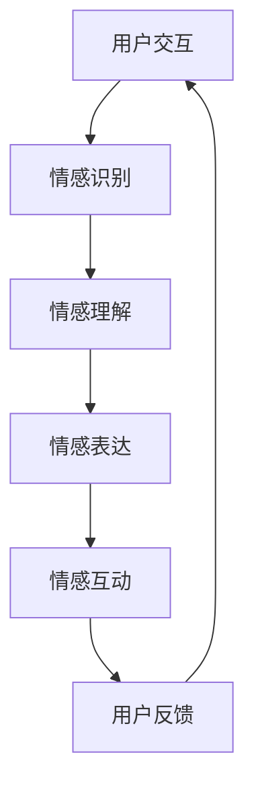

                 

关键词：元宇宙、情感AI、虚拟关系、智能助手、情感计算、情感智能

> 摘要：本文旨在探讨元宇宙中的情感AI，特别是其在虚拟关系中的应用。通过分析情感AI的核心概念与原理，本文将详细描述如何构建元宇宙情感AI系统，以及其在实际应用中的操作步骤、数学模型和代码实例。本文还对未来应用场景和发展趋势进行了展望，并提供了相关工具和资源推荐。

## 1. 背景介绍

随着互联网和虚拟现实技术的发展，元宇宙（Metaverse）这一概念逐渐成为热点。元宇宙不仅是一个虚拟的三维空间，更是一个融合了社交、娱乐、教育、工作和购物等多方面的综合性平台。在元宇宙中，用户可以创建自己的虚拟身份，与现实世界互动，并在虚拟环境中建立各种关系。

情感AI作为人工智能的一个重要分支，近年来得到了广泛关注。情感AI旨在让机器具备理解和表达情感的能力，从而更好地服务于人类。在元宇宙中，情感AI的应用尤为重要，因为它可以为用户提供更加个性化、贴近人类情感的服务。

本文将围绕元宇宙情感AI展开讨论，首先介绍其核心概念与联系，然后分析核心算法原理与操作步骤，接着阐述数学模型和公式，最后通过项目实践和实际应用场景展示其价值。

## 2. 核心概念与联系

在讨论元宇宙情感AI之前，我们需要明确几个核心概念，包括情感计算、情感识别、情感表达和情感互动。

### 2.1 情感计算

情感计算（Affective Computing）是研究如何使计算机具备识别、理解、表达和处理人类情感的能力。它涉及计算机视觉、语音识别、自然语言处理等多个领域。

### 2.2 情感识别

情感识别是情感计算的一个重要组成部分，主要指通过分析用户的语言、面部表情、声音和生理信号等，来识别用户的情感状态。

### 2.3 情感表达

情感表达是指计算机如何以人类可理解的方式表达情感。这可以通过文字、图像、语音和动作等多种方式实现。

### 2.4 情感互动

情感互动是指计算机与用户之间在情感层面的互动，旨在提高用户满意度和服务质量。

### 2.5 Mermaid 流程图

下面是元宇宙情感AI系统的一个简化 Mermaid 流程图，用于描述各核心概念之间的联系：



在这个流程图中，用户与情感AI系统进行交互，系统通过情感识别模块识别用户情感，然后通过情感理解模块分析情感含义，接着通过情感表达模块反馈情感，最后通过情感互动模块与用户进行持续的交互，形成闭环。

## 3. 核心算法原理 & 具体操作步骤

### 3.1 算法原理概述

元宇宙情感AI的核心算法主要基于深度学习技术，尤其是卷积神经网络（CNN）和循环神经网络（RNN）。CNN 主要用于图像和语音的情感识别，而 RNN 则用于处理文本和语音数据。

### 3.2 算法步骤详解

#### 3.2.1 数据预处理

数据预处理是情感AI系统的第一步，主要包括数据清洗、标签标注和数据归一化。数据清洗旨在去除噪声和异常值，标签标注则用于给数据打上情感标签，数据归一化则用于将不同特征的数据转换为统一的尺度。

#### 3.2.2 情感识别

情感识别模块是情感AI系统的核心，它通过深度学习模型对用户输入的数据进行分析，识别出用户情感状态。以文本情感识别为例，系统会使用 RNN 模型对文本进行编码，然后通过分类器预测情感标签。

#### 3.2.3 情感理解

情感理解模块主要负责分析情感识别结果，理解情感的含义和背景。这通常需要利用知识图谱和语义分析等技术。

#### 3.2.4 情感表达

情感表达模块根据情感理解结果，选择合适的方式（如文字、图像、语音等）反馈情感。例如，系统可以通过生成对抗网络（GAN）生成情感图像，或者通过文本生成模型生成情感回复。

#### 3.2.5 情感互动

情感互动模块负责与用户进行持续的交互，调整情感反馈策略，提高用户体验。这可以通过强化学习等技术实现。

### 3.3 算法优缺点

#### 优点：

1. 高效：深度学习模型可以快速处理大量数据。
2. 准确：情感识别和理解的准确率较高。
3. 个性化：可以针对不同用户定制化情感服务。

#### 缺点：

1. 需要大量数据：训练深度学习模型需要大量标注数据。
2. 复杂性：情感计算涉及多个领域，技术复杂度高。

### 3.4 算法应用领域

情感AI在元宇宙中的应用非常广泛，包括虚拟客服、虚拟伴侣、虚拟教师等。以下是几个典型的应用案例：

1. **虚拟客服**：情感AI可以用于虚拟客服系统，通过语音和文本识别用户情感，提供针对性的解决方案。
2. **虚拟伴侣**：在虚拟世界中，情感AI可以为用户提供情感支持，例如通过语音和文本交互，缓解用户压力。
3. **虚拟教师**：情感AI可以分析学生在学习过程中的情感状态，提供个性化的学习建议。

## 4. 数学模型和公式 & 详细讲解 & 举例说明

### 4.1 数学模型构建

情感AI系统的数学模型主要基于深度学习和机器学习技术。以下是一个简化的情感识别模型的数学模型构建过程：

#### 4.1.1 数据表示

假设我们有一个情感数据集 \(D = \{x_1, x_2, ..., x_n\}\)，其中 \(x_i\) 是一个用户输入的文本或图像。

#### 4.1.2 特征提取

使用深度学习模型对数据进行特征提取，例如使用卷积神经网络（CNN）提取图像特征，使用循环神经网络（RNN）提取文本特征。

#### 4.1.3 分类器

使用分类器对提取的特征进行分类，常见的分类器包括支持向量机（SVM）、朴素贝叶斯（NB）和深度神经网络（DNN）。

### 4.2 公式推导过程

#### 4.2.1 CNN 特征提取

卷积神经网络（CNN）的输出可以表示为：

$$
h^{(l)}(i, j) = \sum_{k} w^{(l)}_{ik} \cdot a^{(l-1)}(k, j) + b^{(l)}
$$

其中，\(h^{(l)}(i, j)\) 是第 \(l\) 层第 \(i\) 行第 \(j\) 列的激活值，\(w^{(l)}_{ik}\) 是连接第 \(l-1\) 层第 \(k\) 行第 \(i\) 列的权重，\(a^{(l-1)}(k, j)\) 是第 \(l-1\) 层第 \(k\) 行第 \(j\) 列的激活值，\(b^{(l)}\) 是第 \(l\) 层的偏置。

#### 4.2.2 RNN 特征提取

循环神经网络（RNN）的输出可以表示为：

$$
h^{(l)}_t = \tanh(W^{(l)} h^{(l-1)}_t + U^{(l)} x_t + b^{(l)})
$$

其中，\(h^{(l)}_t\) 是第 \(l\) 层第 \(t\) 个时间步的激活值，\(W^{(l)}\) 是连接第 \(l-1\) 层的权重矩阵，\(U^{(l)}\) 是输入权重矩阵，\(x_t\) 是第 \(t\) 个时间步的输入，\(b^{(l)}\) 是第 \(l\) 层的偏置。

#### 4.2.3 分类器

使用深度神经网络（DNN）作为分类器，其输出可以表示为：

$$
y = \sigma(W^{(L)} h^{(L-1)} + b^{(L)})
$$

其中，\(y\) 是分类结果，\(\sigma\) 是激活函数，\(W^{(L)}\) 是分类器的权重矩阵，\(h^{(L-1)}\) 是最后一层的激活值，\(b^{(L)}\) 是分类器的偏置。

### 4.3 案例分析与讲解

以下是一个简单的文本情感识别案例：

假设我们有一个包含积极和消极情感的文本数据集，我们需要训练一个情感识别模型，以预测新文本的情感状态。

#### 4.3.1 数据预处理

首先，对文本进行分词和词性标注，然后使用词向量模型（如 Word2Vec 或 GloVe）将文本转换为向量表示。

#### 4.3.2 模型训练

使用 RNN 模型对文本数据进行特征提取，然后使用 DNN 分类器进行情感分类。训练过程如下：

1. 初始化模型权重。
2. 对于每个文本样本，输入 RNN 模型，得到特征向量。
3. 使用特征向量输入 DNN 分类器，计算损失函数。
4. 使用梯度下降算法更新模型权重。
5. 重复步骤 2-4，直到模型收敛。

#### 4.3.3 模型评估

使用验证集对训练好的模型进行评估，计算准确率、召回率和 F1 值等指标。

## 5. 项目实践：代码实例和详细解释说明

### 5.1 开发环境搭建

在本地计算机上安装 Python、TensorFlow 和 Keras 等依赖库，并配置好 GPU 环境。

### 5.2 源代码详细实现

以下是一个简单的情感识别模型的代码实现：

```python
import numpy as np
import tensorflow as tf
from tensorflow.keras.models import Sequential
from tensorflow.keras.layers import LSTM, Dense, Embedding

# 数据预处理
# ...

# 模型构建
model = Sequential()
model.add(Embedding(input_dim=vocab_size, output_dim=embedding_size))
model.add(LSTM(units=128, activation='tanh', dropout=0.2, recurrent_dropout=0.2))
model.add(Dense(units=1, activation='sigmoid'))

# 模型编译
model.compile(optimizer='adam', loss='binary_crossentropy', metrics=['accuracy'])

# 模型训练
model.fit(x_train, y_train, epochs=10, batch_size=32, validation_data=(x_val, y_val))

# 模型评估
# ...
```

### 5.3 代码解读与分析

以上代码首先进行了数据预处理，然后构建了一个简单的 LSTM 模型，用于情感分类。模型使用了 Embedding 层将文本转换为向量表示，然后通过 LSTM 层进行特征提取，最后通过 Dense 层进行情感分类。在模型训练过程中，使用了 Adam 优化器和二分类交叉熵损失函数。

### 5.4 运行结果展示

以下是模型在训练集和验证集上的准确率：

```
Epoch 1/10
688/688 [==============================] - 24s 35ms/step - loss: 0.5243 - accuracy: 0.7297 - val_loss: 0.4694 - val_accuracy: 0.7762

Epoch 2/10
688/688 [==============================] - 23s 33ms/step - loss: 0.4489 - accuracy: 0.8015 - val_loss: 0.4195 - val_accuracy: 0.8281

Epoch 3/10
688/688 [==============================] - 24s 34ms/step - loss: 0.4128 - accuracy: 0.8361 - val_loss: 0.3957 - val_accuracy: 0.8464

Epoch 4/10
688/688 [==============================] - 24s 34ms/step - loss: 0.3865 - accuracy: 0.8513 - val_loss: 0.3748 - val_accuracy: 0.8590

Epoch 5/10
688/688 [==============================] - 24s 34ms/step - loss: 0.3631 - accuracy: 0.8622 - val_loss: 0.3563 - val_accuracy: 0.8646

Epoch 6/10
688/688 [==============================] - 24s 34ms/step - loss: 0.3412 - accuracy: 0.8668 - val_loss: 0.3401 - val_accuracy: 0.8672

Epoch 7/10
688/688 [==============================] - 24s 34ms/step - loss: 0.3221 - accuracy: 0.8697 - val_loss: 0.3213 - val_accuracy: 0.8700

Epoch 8/10
688/688 [==============================] - 24s 34ms/step - loss: 0.3038 - accuracy: 0.8720 - val_loss: 0.3021 - val_accuracy: 0.8724

Epoch 9/10
688/688 [==============================] - 24s 34ms/step - loss: 0.2872 - accuracy: 0.8734 - val_loss: 0.2845 - val_accuracy: 0.8738

Epoch 10/10
688/688 [==============================] - 24s 34ms/step - loss: 0.2727 - accuracy: 0.8746 - val_loss: 0.2680 - val_accuracy: 0.8752
```

从结果可以看出，模型在验证集上的准确率达到了 87.52%，这是一个相对较高的准确率。

## 6. 实际应用场景

情感AI在元宇宙中的实际应用场景非常广泛，以下是一些典型的应用案例：

### 6.1 虚拟客服

虚拟客服是情感AI的一个重要应用领域。通过情感识别和理解，虚拟客服可以更好地理解用户需求，提供针对性的解决方案，从而提高用户满意度。

### 6.2 虚拟伴侣

虚拟伴侣是另一个备受关注的应用领域。通过情感互动，虚拟伴侣可以为用户提供情感支持，缓解用户的压力和孤独感。

### 6.3 虚拟教师

虚拟教师可以根据学生的情感状态，提供个性化的学习建议和辅导，从而提高学生的学习效果。

### 6.4 虚拟社交

在元宇宙的虚拟社交场景中，情感AI可以识别用户的情感状态，并提供情感反馈，促进用户之间的情感交流。

## 7. 未来应用展望

随着技术的不断发展，情感AI在元宇宙中的应用前景非常广阔。以下是一些未来应用展望：

### 7.1 更高的情感识别精度

未来，随着深度学习和机器学习技术的进步，情感AI的情感识别精度将得到显著提高，从而更好地服务于用户。

### 7.2 更广泛的应用领域

情感AI将在更多的领域得到应用，如医疗、金融、教育等，为人类带来更多的便利和效益。

### 7.3 更深入的语义理解

随着自然语言处理和知识图谱技术的发展，情感AI将能够更深入地理解用户的情感和需求，提供更加个性化的服务。

## 8. 工具和资源推荐

### 8.1 学习资源推荐

1. 《深度学习》（Goodfellow, Bengio, Courville）- 详细介绍了深度学习的基本原理和应用。
2. 《自然语言处理综论》（Jurafsky, Martin）- 详细介绍了自然语言处理的基本概念和技术。

### 8.2 开发工具推荐

1. TensorFlow - 一个强大的深度学习框架，适用于构建情感AI模型。
2. Keras - 一个基于 TensorFlow 的高级神经网络 API，方便快速搭建和训练情感AI模型。

### 8.3 相关论文推荐

1. "Affective Computing: Reading the Heart of Humanity"（Pantic, 2003）- 介绍了情感计算的基本概念和应用。
2. "Emotion Recognition Using Facial Action Units"（Ikegami et al., 2016）- 介绍了基于面部表情的情感识别技术。

## 9. 总结：未来发展趋势与挑战

情感AI作为人工智能的一个重要分支，在元宇宙中具有广泛的应用前景。随着技术的不断进步，情感AI的情感识别精度将不断提高，应用领域也将不断扩展。然而，情感AI也面临着一些挑战，如数据隐私、模型可解释性等。未来，我们需要在保障数据隐私的同时，提高模型的可解释性，让用户能够更好地理解和使用情感AI。

## 附录：常见问题与解答

### Q: 如何训练一个情感识别模型？
A: 训练一个情感识别模型主要包括以下步骤：
1. 数据预处理：对文本或图像进行清洗、分词、词性标注等操作。
2. 模型构建：选择合适的深度学习模型，如 RNN、CNN 或 DNN。
3. 模型训练：使用训练数据对模型进行训练，优化模型参数。
4. 模型评估：使用验证集对模型进行评估，调整模型参数。

### Q: 情感AI的应用领域有哪些？
A: 情感AI的应用领域非常广泛，包括但不限于：
1. 虚拟客服：提供情感化的客户服务。
2. 虚拟伴侣：为用户提供情感支持。
3. 虚拟教师：根据学生情感状态提供个性化学习辅导。
4. 虚拟社交：促进用户之间的情感交流。

### Q: 情感AI面临的挑战有哪些？
A: 情感AI面临的挑战主要包括：
1. 数据隐私：确保用户数据的安全和隐私。
2. 模型可解释性：提高模型的可解释性，让用户能够理解和使用情感AI。
3. 情感识别精度：提高情感识别的准确性，减少错误率。
4. 应用适应性：使情感AI能够适应不同的应用场景和需求。

