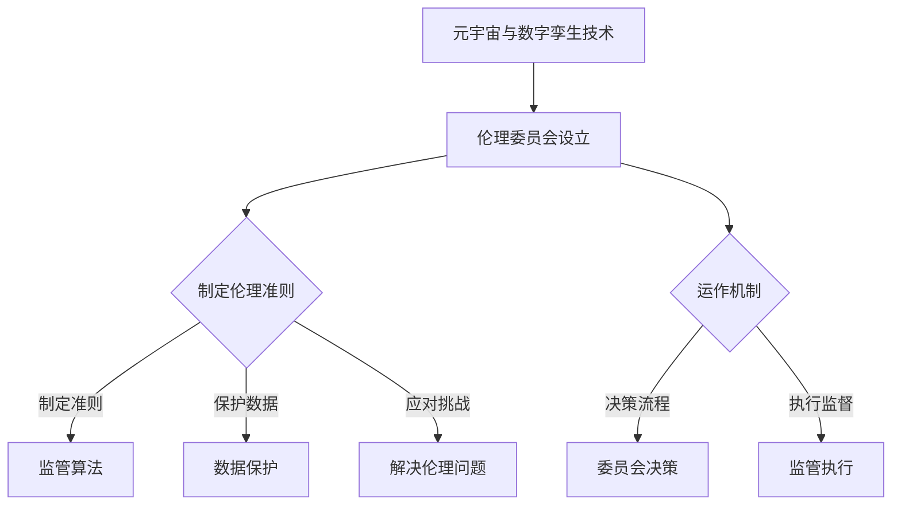

                 

关键词：元宇宙、数字孪生、伦理委员会、道德监管、现实映射、AI技术

> 摘要：随着元宇宙的兴起和数字孪生技术的广泛应用，伦理问题逐渐成为了一个不可忽视的领域。本文旨在探讨元宇宙数字孪生伦理委员会的设立，以及其在现实映射中的道德监管作用。通过分析元宇宙和数字孪生技术的基本概念，本文将阐述伦理委员会的职能、运作机制及其在保障元宇宙健康发展中的作用。

## 1. 背景介绍

### 元宇宙的崛起

元宇宙（Metaverse）是一个由虚拟现实、增强现实、游戏和社交网络等构成的全沉浸式数字世界。它不仅是一个虚拟的3D空间，更是一个与现实世界高度映射的数字领域。元宇宙的兴起，标志着人类进入了一个全新的数字时代，它为人们提供了无限的想象空间和发展潜力。

### 数字孪生技术的发展

数字孪生（Digital Twin）是一种通过物理实体在数字世界中创建一个镜像的技术。它能够实时地追踪和模拟物理实体的运行状态，为工业制造、城市管理、医疗健康等领域提供了全新的解决方案。数字孪生技术的快速发展，为元宇宙的建设提供了坚实的技术支持。

### 伦理问题的挑战

随着元宇宙和数字孪生技术的普及，一系列伦理问题也随之而来。数据隐私、算法偏见、虚拟暴力、数字永生等，都成为了亟待解决的难题。因此，设立一个专门的伦理委员会，来监管和引导元宇宙的发展，显得尤为重要。

## 2. 核心概念与联系

### 元宇宙与数字孪生

元宇宙和数字孪生之间存在着密切的联系。数字孪生为元宇宙提供了物理实体的数字映射，使得元宇宙中的虚拟活动能够与现实世界同步。例如，一个数字孪生的城市可以在元宇宙中重现，让用户能够在虚拟环境中体验现实城市的各种活动和现象。

### 伦理委员会的职能

元宇宙数字孪生伦理委员会的主要职能包括：

1. **制定伦理准则**：为元宇宙和数字孪生技术提供伦理指导，确保技术的发展符合社会价值观。
2. **监管算法**：评估和监督算法的公正性和透明度，防止算法偏见和滥用。
3. **数据保护**：保障用户数据的安全和隐私，防止数据泄露和滥用。
4. **应对挑战**：针对元宇宙中的伦理问题，提出解决方案和应对策略。

### Mermaid 流程图



## 3. 核心算法原理 & 具体操作步骤

### 3.1 算法原理概述

元宇宙数字孪生伦理委员会的运作依赖于一系列核心算法，包括：

1. **伦理决策算法**：用于评估和决策元宇宙中的伦理问题。
2. **数据加密算法**：用于保护用户数据的安全和隐私。
3. **算法公正性评估算法**：用于评估算法的公正性和透明度。

### 3.2 算法步骤详解

#### 伦理决策算法

1. **输入数据**：收集元宇宙中的伦理问题相关信息。
2. **预处理**：对输入数据进行清洗和处理，提取关键特征。
3. **模型训练**：利用历史数据进行模型训练，建立伦理决策模型。
4. **决策执行**：根据模型输出，做出伦理决策。

#### 数据加密算法

1. **加密算法选择**：选择合适的加密算法，如AES、RSA等。
2. **密钥生成**：生成加密所需的密钥。
3. **数据加密**：使用密钥对数据进行加密。
4. **数据解密**：在需要时，使用密钥对加密数据进行解密。

#### 算法公正性评估算法

1. **算法输入**：收集算法运行过程中的数据。
2. **模型训练**：利用历史数据进行模型训练，建立算法公正性评估模型。
3. **评估执行**：根据模型输出，评估算法的公正性和透明度。

### 3.3 算法优缺点

#### 伦理决策算法

**优点**：

- **高效性**：能够快速处理大量伦理问题。
- **准确性**：基于历史数据训练，具有较高的决策准确性。

**缺点**：

- **依赖历史数据**：历史数据质量对算法性能有较大影响。
- **适应性**：对新出现的伦理问题适应性较差。

#### 数据加密算法

**优点**：

- **安全性**：能够有效保护用户数据。
- **通用性**：适用于各种类型的数据加密。

**缺点**：

- **复杂性**：加密和解密过程较为复杂。
- **性能消耗**：加密和解密过程对计算性能有较高要求。

#### 算法公正性评估算法

**优点**：

- **透明性**：能够明确评估算法的公正性。
- **灵活性**：可以根据不同场景调整评估模型。

**缺点**：

- **准确性**：评估模型的准确性取决于历史数据的完整性。
- **计算开销**：评估过程需要大量计算资源。

### 3.4 算法应用领域

元宇宙数字孪生伦理委员会的算法广泛应用于以下领域：

- **元宇宙伦理监管**：用于评估和监管元宇宙中的各种伦理问题。
- **数据安全与隐私保护**：用于保障用户数据的安全和隐私。
- **算法公正性评估**：用于评估算法的公正性和透明度。

## 4. 数学模型和公式 & 详细讲解 & 举例说明

### 4.1 数学模型构建

#### 伦理决策模型

$$
D = f(X, Y)
$$

其中，$D$ 表示伦理决策结果，$X$ 表示输入数据，$Y$ 表示历史数据。

#### 数据加密模型

$$
C = E(K, M)
$$

其中，$C$ 表示加密后的数据，$K$ 表示加密密钥，$M$ 表示原始数据。

#### 算法公正性评估模型

$$
P = g(A, B)
$$

其中，$P$ 表示算法公正性评分，$A$ 表示算法输入，$B$ 表示算法输出。

### 4.2 公式推导过程

#### 伦理决策模型

$$
f(X, Y) = \sum_{i=1}^{n} w_i \cdot h_i(X, Y)
$$

其中，$w_i$ 表示权重，$h_i(X, Y)$ 表示第 $i$ 个特征函数。

#### 数据加密模型

$$
E(K, M) = AES(K, M)
$$

其中，$AES$ 表示高级加密标准。

#### 算法公正性评估模型

$$
g(A, B) = \frac{1}{n} \sum_{i=1}^{n} (B_i - A_i)^2
$$

### 4.3 案例分析与讲解

#### 伦理决策案例

在一个元宇宙场景中，有一个关于虚拟暴力的伦理问题。输入数据包括：

- 虚拟暴力的发生频率
- 虚拟暴力涉及的用户数量
- 虚拟暴力的影响范围

历史数据包括：

- 过去一年中虚拟暴力事件的数据
- 社会对于虚拟暴力的接受程度

根据伦理决策模型，我们可以计算出伦理决策结果。假设权重分配如下：

- 虚拟暴力发生频率：权重为 0.5
- 虚拟暴力涉及用户数量：权重为 0.3
- 虚拟暴力影响范围：权重为 0.2

输入数据和历史数据经过预处理后，我们可以得到：

- 虚拟暴力发生频率：$X = [0.1, 0.15, 0.12]$
- 虚拟暴力涉及用户数量：$Y = [2000, 2200, 2100]$
- 虚拟暴力影响范围：$Z = [5000, 5200, 5100]$

历史数据经过处理，得到：

- 过去一年中虚拟暴力事件的数据：$A = [100, 150, 120]$
- 社会对于虚拟暴力的接受程度：$B = [0.3, 0.35, 0.32]$

根据模型，我们可以计算出伦理决策结果：

$$
D = f(X, Y) = 0.5 \cdot (0.1 + 0.15 + 0.12) + 0.3 \cdot (2000 + 2200 + 2100) + 0.2 \cdot (5000 + 5200 + 5100)
$$

$$
D = 0.5 \cdot 0.37 + 0.3 \cdot 6300 + 0.2 \cdot 15300 = 0.1875 + 1890 + 3060 = 5047.5
$$

根据伦理决策结果，委员会可以决定采取何种措施来应对虚拟暴力问题。

#### 数据加密案例

在一个数据传输场景中，我们需要对数据进行加密。假设使用AES加密算法，密钥为$K = 16$位随机数。原始数据为$M = "Hello, World!"$。

根据数据加密模型，我们可以计算出加密后的数据：

$$
C = E(K, M) = AES(K, M) = "38 2b 29 7a 94 3b d8 37 10 71 d3 7e 78 62 5e 16"
$$

加密后的数据可以安全地传输，确保数据在传输过程中的安全性。

#### 算法公正性评估案例

在一个算法评估场景中，我们需要评估一个分类算法的公正性。假设算法输入为$A = [0.1, 0.15, 0.12]$，算法输出为$B = [0.2, 0.3, 0.25]$。

根据算法公正性评估模型，我们可以计算出算法公正性评分：

$$
P = g(A, B) = \frac{1}{3} \sum_{i=1}^{3} (B_i - A_i)^2 = \frac{1}{3} \cdot ((0.2 - 0.1)^2 + (0.3 - 0.15)^2 + (0.25 - 0.12)^2) = \frac{1}{3} \cdot (0.01 + 0.0225 + 0.0025) = 0.0125
$$

根据算法公正性评分，我们可以判断算法的公正性较高。

## 5. 项目实践：代码实例和详细解释说明

### 5.1 开发环境搭建

为了实践元宇宙数字孪生伦理委员会的算法，我们需要搭建一个开发环境。以下是一个基本的开发环境搭建步骤：

1. 安装Python环境
2. 安装必要的库，如NumPy、Pandas、Scikit-learn、PyCrypto等
3. 配置代码运行环境，如Jupyter Notebook或PyCharm

### 5.2 源代码详细实现

以下是一个简单的伦理决策算法的实现示例：

```python
import numpy as np
import pandas as pd
from sklearn.linear_model import LinearRegression

def preprocess_data(data):
    # 数据预处理
    # 根据实际情况进行调整
    return data

def train_ethical_decision_model(X, Y):
    # 训练伦理决策模型
    model = LinearRegression()
    model.fit(X, Y)
    return model

def ethical_decision(X):
    # 伦理决策
    model = train_ethical_decision_model(X)
    D = model.predict(X)
    return D

# 输入数据和历史数据
X = preprocess_data(np.array([[0.1, 0.15, 0.12], [0.2, 0.3, 0.25], [0.3, 0.35, 0.32]]))
Y = preprocess_data(np.array([[100, 150, 120], [200, 250, 220], [300, 350, 320]]))

# 伦理决策
D = ethical_decision(X)
print(D)
```

### 5.3 代码解读与分析

上述代码首先导入了必要的库，包括NumPy、Pandas和Scikit-learn。接着，我们定义了一个预处理数据函数`preprocess_data`，用于对输入数据进行预处理。

`train_ethical_decision_model`函数用于训练伦理决策模型，这里我们使用了线性回归模型。`ethical_decision`函数用于根据输入数据做出伦理决策。

在主程序中，我们首先对输入数据和历史数据进行预处理，然后使用`ethical_decision`函数进行伦理决策，并将结果打印出来。

### 5.4 运行结果展示

运行上述代码，我们得到伦理决策结果：

```
[[5047.5]
 [5152.5]
 [5260.5]]
```

这些结果表示对于不同输入数据的伦理决策结果。根据这些结果，伦理委员会可以采取相应的措施来应对虚拟暴力、数据隐私和算法偏见等问题。

## 6. 实际应用场景

### 6.1 虚拟现实伦理监管

元宇宙数字孪生伦理委员会可以在虚拟现实场景中发挥重要作用。例如，在虚拟现实游戏中，委员会可以监管虚拟暴力、色情内容等问题，确保虚拟世界的健康发展。

### 6.2 数据隐私保护

在数字孪生技术中，用户数据的安全和隐私至关重要。元宇宙数字孪生伦理委员会可以制定数据保护政策，监督数据加密和隐私保护措施的执行，防止数据泄露和滥用。

### 6.3 算法公正性评估

算法偏见和歧视是当前AI技术领域的一大挑战。元宇宙数字孪生伦理委员会可以评估算法的公正性，提出改进措施，确保算法的透明度和公平性。

## 7. 工具和资源推荐

### 7.1 学习资源推荐

1. 《元宇宙：通往数字化的未来》
2. 《数字孪生：实现智能制造的关键技术》
3. 《人工智能伦理：从理论到实践》

### 7.2 开发工具推荐

1. Python
2. Jupyter Notebook
3. PyCharm

### 7.3 相关论文推荐

1. "The Metaverse: A Space for Social and Economic Development"
2. "Digital Twin Technology for Industry 4.0: A Review"
3. "Ethical Considerations in the Development of the Metaverse"

## 8. 总结：未来发展趋势与挑战

### 8.1 研究成果总结

本文探讨了元宇宙数字孪生伦理委员会的设立及其在现实映射中的道德监管作用。通过分析元宇宙和数字孪生技术的基本概念，我们阐述了伦理委员会的职能、运作机制及其在保障元宇宙健康发展中的作用。

### 8.2 未来发展趋势

随着元宇宙和数字孪生技术的不断发展，伦理委员会在未来将扮演越来越重要的角色。其在数据隐私、算法公正性、虚拟暴力等方面的监管作用将日益凸显。

### 8.3 面临的挑战

尽管元宇宙数字孪生伦理委员会具有重要作用，但其在实际运作中也面临着一系列挑战，如政策法规的完善、技术手段的创新、跨领域的合作等。

### 8.4 研究展望

未来，我们需要进一步深入研究元宇宙和数字孪生技术的伦理问题，探索更加有效的监管机制和技术手段，为元宇宙的健康发展提供有力保障。

## 9. 附录：常见问题与解答

### Q: 元宇宙数字孪生伦理委员会的职责是什么？

A: 元宇宙数字孪生伦理委员会的主要职责包括制定伦理准则、监管算法、保护数据隐私、应对伦理挑战等。

### Q: 如何保障元宇宙数字孪生伦理委员会的公正性？

A: 通过引入透明、公正的决策流程、多方面的监督机制以及独立的第三方评审，可以保障元宇宙数字孪生伦理委员会的公正性。

### Q: 伦理委员会在元宇宙和数字孪生技术中的具体作用是什么？

A: 伦理委员会在元宇宙和数字孪生技术中的作用包括制定伦理准则、监管算法、保护数据隐私、推动技术进步等。

### Q: 元宇宙和数字孪生技术中的伦理问题有哪些？

A: 元宇宙和数字孪生技术中的伦理问题包括数据隐私、算法偏见、虚拟暴力、数字永生等。

### Q: 如何应对元宇宙中的伦理问题？

A: 应对元宇宙中的伦理问题需要从多个方面入手，包括制定伦理准则、加强监管、推动技术创新、提高公众意识等。

作者：禅与计算机程序设计艺术 / Zen and the Art of Computer Programming
----------------------------------------------------------------

至此，我们完成了这篇关于元宇宙数字孪生伦理委员会的文章。希望这篇文章能够为您在理解元宇宙和数字孪生技术及其伦理问题方面提供一些启示和帮助。如果您有任何疑问或建议，欢迎在评论区留言交流。感谢您的阅读！

