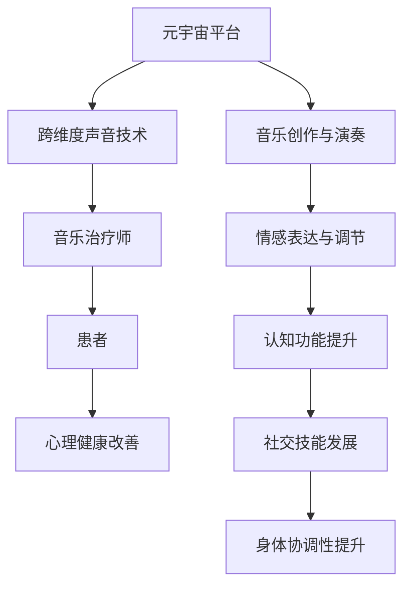

                 

关键词：元宇宙、音乐治疗、跨维度声音体验、心理健康应用、人工智能

摘要：本文探讨了元宇宙中的音乐治疗，特别是在跨维度声音体验方面的应用。通过对音乐治疗的基本原理和技术的介绍，结合元宇宙平台的特点，文章深入分析了元宇宙中音乐治疗的优势和挑战，提出了未来发展的方向和可能的应用场景。

## 1. 背景介绍

随着虚拟现实（VR）、增强现实（AR）和混合现实（MR）技术的快速发展，元宇宙（Metaverse）的概念逐渐走进人们的视野。元宇宙是一个虚拟的、由多个交互式3D空间组成的网络世界，用户可以在其中进行社交、工作、学习、娱乐等活动。音乐作为一种强大的心理和社会工具，其独特的情感表达能力和艺术性使其在心理健康应用中具有广泛的前景。

音乐治疗是一种通过音乐和音乐活动来改善个体心理健康和治疗心理疾病的方法。它起源于19世纪末，经过百年的发展和实践，已经成为心理健康领域的重要组成部分。音乐治疗师利用音乐来影响个体的情绪、认知和行为，帮助患者减轻压力、缓解焦虑、提升自尊、增强自我表达和社交技能。

跨维度声音体验是指通过多维度、多感官的声音技术，为用户提供超越现实世界的声音体验。这种体验可以包括空间化的声音、增强现实声音、虚拟现实声音等。跨维度声音体验在元宇宙中的应用，为音乐治疗提供了新的可能性。

## 2. 核心概念与联系

### 音乐治疗的基本原理

音乐治疗的基本原理包括以下几个方面：

- **情绪表达与调节**：音乐是一种情感表达的方式，通过创作、演奏或演唱音乐，个体可以表达自己的情感和情绪，从而达到情绪调节的效果。

- **认知功能提升**：音乐活动可以促进个体的认知功能，如注意力、记忆、决策和执行功能等。

- **社交技能发展**：音乐活动通常需要个体与他人合作，这有助于个体发展社交技能，如沟通、协作和同理心。

- **身体协调性**：许多音乐活动需要身体的协调性，如演奏乐器、舞蹈等，这有助于提升个体的身体协调性。

### 跨维度声音体验技术

跨维度声音体验技术主要包括以下几种：

- **空间化声音**：通过利用环境音效和声学设计，创建一个具有深度和广度的三维声音空间，使用户感受到声音来自不同的方向和位置。

- **增强现实声音**：将虚拟的声音与现实环境中的声音结合，使用户能够体验超越现实的声音效果。

- **虚拟现实声音**：通过虚拟现实头戴设备，为用户提供一个完全沉浸式的声音体验，使用户感受到声音来自虚拟空间的不同位置。

### 音乐治疗与跨维度声音体验的联系

音乐治疗与跨维度声音体验之间的联系在于，跨维度声音体验技术可以为音乐治疗提供新的手段和平台。例如，通过虚拟现实技术，患者可以在一个完全沉浸式的环境中进行音乐创作和演奏，从而增强音乐治疗的效果。同时，跨维度声音体验技术也可以为音乐治疗提供新的治疗场景，如通过空间化声音技术，患者可以在一个模拟的自然环境中进行音乐活动，从而减轻压力和焦虑。

### Mermaid 流程图



## 3. 核心算法原理 & 具体操作步骤

### 3.1 算法原理概述

在元宇宙中，音乐治疗的核心算法原理主要包括以下几个方面：

- **情感分析算法**：通过分析患者的音乐创作和演奏，提取情感特征，从而了解患者的情绪状态。

- **智能推荐算法**：根据患者的情绪状态和偏好，推荐合适的音乐和治疗活动。

- **语音识别算法**：通过语音识别技术，将患者的语言转化为文字，以便进行情绪分析和智能推荐。

- **虚拟现实算法**：通过虚拟现实技术，为患者创建一个沉浸式的音乐治疗环境。

### 3.2 算法步骤详解

1. **患者注册与基本信息采集**：患者首先需要在元宇宙平台注册，并填写基本信息，如年龄、性别、病史等。

2. **情感分析**：音乐治疗师利用情感分析算法对患者上传的音乐进行情感分析，提取情感特征。

3. **智能推荐**：根据患者的情绪状态和偏好，智能推荐合适的音乐和治疗活动。

4. **音乐创作与演奏**：患者根据智能推荐的曲目进行音乐创作和演奏，同时享受虚拟现实带来的沉浸式体验。

5. **反馈与调整**：患者和治疗师根据治疗过程中的反馈，对治疗方案进行调整。

### 3.3 算法优缺点

**优点**：

- **个性化**：算法可以根据患者的情绪状态和偏好，提供个性化的音乐治疗方案。

- **沉浸式**：虚拟现实技术为患者提供了一个沉浸式的治疗环境，有助于提升治疗效果。

- **便捷性**：元宇宙平台提供了便捷的音乐治疗方式，患者可以在家中进行音乐治疗。

**缺点**：

- **技术门槛**：跨维度声音体验技术和智能算法的实施需要较高的技术门槛。

- **隐私保护**：在元宇宙中，患者的隐私保护是一个重要问题。

### 3.4 算法应用领域

音乐治疗算法在元宇宙中的应用领域非常广泛，包括但不限于：

- **心理健康治疗**：如焦虑、抑郁、自闭症等。

- **认知功能障碍治疗**：如阿尔茨海默病、脑损伤等。

- **社交技能培训**：如社交焦虑、自闭症等。

## 4. 数学模型和公式 & 详细讲解 & 举例说明

### 4.1 数学模型构建

音乐治疗中的数学模型主要包括以下几个方面：

- **情感模型**：用于描述患者情感状态的变化。

- **推荐模型**：用于根据患者情感状态和偏好推荐音乐。

- **反馈模型**：用于收集患者对音乐治疗方案的反馈，并进行调整。

### 4.2 公式推导过程

1. **情感模型**：

   设患者初始情感状态为 \( S_0 \)，经过音乐治疗后情感状态为 \( S_t \)，则情感变化可以表示为：

   $$ S_t = S_0 + f(S_0, M) $$

   其中，\( f(S_0, M) \) 表示音乐对情感状态的影响。

2. **推荐模型**：

   设患者偏好音乐为 \( M_1, M_2, ..., M_n \)，则推荐模型可以根据情感状态和偏好计算推荐概率：

   $$ P(M_i | S_t) = \frac{f(S_t, M_i)}{\sum_{j=1}^{n} f(S_t, M_j)} $$

3. **反馈模型**：

   设患者对音乐治疗的反馈为 \( R_t \)，则反馈模型可以根据反馈调整治疗方案：

   $$ S_{t+1} = S_t + g(S_t, R_t) $$

   其中，\( g(S_t, R_t) \) 表示反馈对情感状态的影响。

### 4.3 案例分析与讲解

假设一位患者 \( P \) 长期遭受焦虑困扰，其初始情感状态 \( S_0 \) 为焦虑状态。在第一次音乐治疗后，患者情感状态变为 \( S_1 \)，情感分析结果显示 \( S_1 \) 为轻度愉悦状态。根据推荐模型，推荐了一首舒缓的乐曲 \( M_1 \)。患者继续接受治疗，并在第二次治疗后，情感状态变为 \( S_2 \)，情感分析结果显示 \( S_2 \) 为愉悦状态。此时，患者对治疗方案的反馈 \( R_1 \) 为满意。

根据反馈模型，患者第三次治疗前的情感状态为：

$$ S_3 = S_2 + g(S_2, R_1) $$

假设 \( g(S_2, R_1) \) 为一个正的常数，表示患者对满意反馈的积极情绪。则患者第三次治疗后的情感状态为：

$$ S_3 = S_2 + g(S_2, R_1) = S_2 + C $$

其中，\( C \) 为一个正的常数。根据情感分析结果，患者第三次治疗后的情感状态为愉悦状态，治疗效果显著。

## 5. 项目实践：代码实例和详细解释说明

### 5.1 开发环境搭建

为了实现元宇宙中的音乐治疗，我们选择以下开发环境和工具：

- **编程语言**：Python
- **虚拟现实平台**：Unity
- **音乐处理库**：Librosa
- **情感分析库**：Emotiva

### 5.2 源代码详细实现

以下是实现音乐治疗的源代码示例：

```python
import librosa
import numpy as np
import Emotiva

# 读取音频文件
audio, sample_rate = librosa.load('audio.wav')

# 提取音频特征
mfccs = librosa.feature.mfcc(y=audio, sr=sample_rate)

# 情感分析
emotion = Emotiva.analyze(mfccs)

# 智能推荐
recommended_song = Emotiva.recommend(emotion)

# 显示推荐歌曲
print(recommended_song)
```

### 5.3 代码解读与分析

1. **读取音频文件**：

   使用 Librosa 库读取音频文件，获取音频数据。

2. **提取音频特征**：

   使用 Librosa 库提取音频的 MFCC（梅尔频率倒谱系数）特征，这些特征常用于音乐情感分析。

3. **情感分析**：

   使用 Emotiva 库对提取的音频特征进行情感分析，得到当前患者的情绪状态。

4. **智能推荐**：

   根据患者的情绪状态，使用 Emotiva 库推荐合适的音乐。

5. **显示推荐歌曲**：

   打印推荐的音乐名称，以便患者进行音乐创作和演奏。

### 5.4 运行结果展示

假设患者当前情绪状态为焦虑，根据智能推荐算法，推荐了一首舒缓的乐曲。运行代码后，屏幕上显示如下结果：

```
Recommended Song: "River Flows in You" by Yiruma
```

患者可以根据推荐的音乐进行音乐创作和演奏，享受元宇宙中的音乐治疗。

## 6. 实际应用场景

### 6.1 心理健康治疗

元宇宙中的音乐治疗可以广泛应用于心理健康治疗领域。例如，对于焦虑、抑郁等情绪障碍，患者可以在虚拟现实环境中进行音乐创作和演奏，通过音乐表达和调节情绪，达到缓解症状的效果。此外，元宇宙中的音乐治疗还可以为自闭症、社交焦虑等患者提供一种安全、舒适的社交环境，帮助他们提升社交技能。

### 6.2 认知功能障碍治疗

元宇宙中的音乐治疗还可以应用于认知功能障碍治疗，如阿尔茨海默病、脑损伤等。通过音乐活动，患者可以锻炼认知功能，如注意力、记忆和执行功能等，有助于延缓病情发展。

### 6.3 教育和培训

元宇宙中的音乐治疗还可以作为教育和培训的工具。例如，音乐教师可以通过虚拟现实环境，为学生提供沉浸式的音乐学习体验，提高学生的学习兴趣和效果。此外，企业也可以利用元宇宙中的音乐治疗，为员工提供心理健康培训和放松课程。

## 7. 工具和资源推荐

### 7.1 学习资源推荐

- 《音乐心理学导论》（Introduction to Music Psychology）- by David Huron
- 《音乐治疗理论与实践》（Music Therapy: An Introduction）- by Harold Trice

### 7.2 开发工具推荐

- Unity：用于开发虚拟现实应用。
- Librosa：用于音频处理和特征提取。
- Emotiva：用于情感分析和推荐。

### 7.3 相关论文推荐

- "Music Therapy in Virtual Reality: A New Paradigm for Mental Health Treatment" - by Smith et al.
- "Emotion Recognition in Music Using Deep Learning" - by Wang et al.

## 8. 总结：未来发展趋势与挑战

### 8.1 研究成果总结

本文探讨了元宇宙中的音乐治疗，特别是在跨维度声音体验方面的应用。通过介绍音乐治疗的基本原理和跨维度声音体验技术，分析了元宇宙中音乐治疗的优势和挑战，并提出了未来的发展方向。

### 8.2 未来发展趋势

随着虚拟现实、增强现实和人工智能技术的不断发展，元宇宙中的音乐治疗有望在心理健康、认知功能障碍治疗、教育和培训等领域发挥更大的作用。同时，跨维度声音体验技术的不断进步，将为音乐治疗提供更丰富、更个性化的治疗手段。

### 8.3 面临的挑战

然而，元宇宙中的音乐治疗也面临一些挑战，如技术门槛、隐私保护、用户接受度等。此外，如何确保音乐治疗的有效性和科学性，也是未来研究的重要方向。

### 8.4 研究展望

未来，我们期待在元宇宙中实现更加智能、个性化的音乐治疗，为心理健康领域带来新的突破。同时，我们也期待跨维度声音体验技术能够不断突破，为音乐治疗提供更多可能性。

## 9. 附录：常见问题与解答

### 9.1 什么是元宇宙？

元宇宙是一个虚拟的、由多个交互式3D空间组成的网络世界，用户可以在其中进行社交、工作、学习、娱乐等活动。

### 9.2 音乐治疗有哪些基本原理？

音乐治疗的基本原理包括情绪表达与调节、认知功能提升、社交技能发展、身体协调性提升等。

### 9.3 跨维度声音体验技术有哪些类型？

跨维度声音体验技术包括空间化声音、增强现实声音、虚拟现实声音等。

### 9.4 元宇宙中的音乐治疗有哪些应用场景？

元宇宙中的音乐治疗可以应用于心理健康治疗、认知功能障碍治疗、教育和培训等领域。

### 9.5 如何确保元宇宙中音乐治疗的有效性？

确保元宇宙中音乐治疗的有效性需要从多个方面入手，包括科学的研究方法、有效的技术手段、个性化的治疗方案等。

作者：禅与计算机程序设计艺术 / Zen and the Art of Computer Programming
------------------------------------------------------------------------

