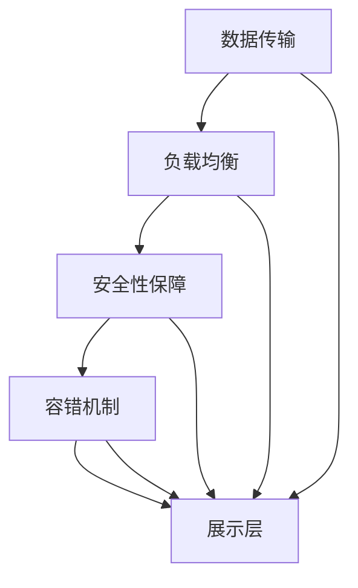

                 

关键词：全球化AI，多地域部署，Lepton AI，服务架构，性能优化，安全性，数据管理，技术挑战

## 摘要

随着人工智能技术的迅速发展，AI服务的全球化部署变得越来越重要。本文将详细介绍一种名为Lepton AI的全球AI服务平台，并重点探讨其在多地域部署中的技术实现、性能优化、安全性保障以及数据管理策略。通过本文的阐述，读者可以了解如何在全球化背景下高效、安全地部署AI服务，并预见未来的发展趋势与挑战。

## 1. 背景介绍

近年来，人工智能技术在全球范围内取得了显著的进展。越来越多的企业开始将AI技术应用于其业务流程中，以提升效率、降低成本和创造新的商业机会。然而，随着业务的全球化扩展，AI服务的部署也面临着诸多挑战，如数据传输延迟、性能波动、安全性问题等。为了应对这些挑战，多地域部署成为了一种有效的解决方案。

多地域部署旨在将AI服务的核心功能分布在不同的地理区域，以提高服务的可用性、可靠性和性能。这种部署方式不仅能够更好地满足不同地区用户的需求，还可以降低单点故障的风险，提高整体系统的弹性。然而，多地域部署也带来了一系列新的技术难题，需要我们在设计、开发和运营中进行综合考虑和优化。

## 2. 核心概念与联系

### 2.1 服务架构

Lepton AI的服务架构采用了分布式架构设计，以确保在多地域部署中能够提供高效、可靠的服务。整个架构可以分为以下几个关键组件：

#### 2.1.1 数据处理层

数据处理层是Lepton AI的核心，负责接收、处理和存储来自全球各地的用户数据。该层采用了分布式存储和计算技术，如HDFS（Hadoop Distributed File System）和MapReduce，以确保数据的高效存储和处理。

#### 2.1.2 服务层

服务层提供了AI服务的核心功能，包括模型训练、预测和推理等。该层采用了微服务架构设计，将不同功能的模块分离，以便于部署和维护。

#### 2.1.3 展示层

展示层负责将AI服务的输出结果展示给用户。该层通常采用Web前端技术，如React或Vue.js，以提供直观、易用的用户界面。

### 2.2 技术联系

Lepton AI的多地域部署技术涉及多个方面，包括数据传输、负载均衡、安全性保障和容错机制等。以下是一个简单的Mermaid流程图，展示了这些技术的联系：



## 3. 核心算法原理 & 具体操作步骤

### 3.1 算法原理概述

Lepton AI的核心算法基于深度学习技术，特别是卷积神经网络（CNN）。CNN擅长处理图像数据，因此在AI视觉任务中具有广泛应用。Lepton AI采用了一种基于迁移学习的训练策略，以提高模型在不同地域的适应性。

### 3.2 算法步骤详解

#### 3.2.1 数据预处理

在多地域部署中，数据预处理是一个关键步骤。首先，需要对来自不同地区的数据进行标准化处理，以确保模型在不同环境下的一致性。其次，需要对数据进行去噪、增强等预处理操作，以提高模型的鲁棒性。

#### 3.2.2 迁移学习

迁移学习是将已知模型的权重迁移到新的任务中，以减少训练时间。在Lepton AI中，我们采用了预训练模型，并在目标任务上进行微调。这种方法能够提高模型在不同地域的适应性，同时减少对大量标注数据的依赖。

#### 3.2.3 模型训练

在模型训练阶段，我们采用了分布式训练技术，以充分利用多地域部署的优势。具体而言，我们将数据集划分为多个子集，并在不同的地域进行并行训练。在训练过程中，我们使用了优化算法（如Adam）和正则化技术（如Dropout），以提高模型的泛化能力。

#### 3.2.4 预测与推理

在模型训练完成后，我们将模型部署到生产环境中，以提供实时预测和推理服务。为了确保模型在不同地域的一致性，我们采用了统一的接口和API设计。

### 3.3 算法优缺点

#### 优点：

1. **高效性**：分布式训练和负载均衡技术能够充分利用多地域部署的优势，提高服务性能。
2. **鲁棒性**：迁移学习和预处理技术能够提高模型在不同地域的适应性。
3. **灵活性**：微服务架构和模块化设计使得系统易于扩展和更新。

#### 缺点：

1. **复杂性**：多地域部署涉及多个技术领域，如数据传输、负载均衡和安全性等，需要较高的技术门槛。
2. **成本**：多地域部署需要额外的硬件和运维成本。

### 3.4 算法应用领域

Lepton AI的多地域部署技术在多个领域具有广泛的应用前景，如：

1. **智能安防**：利用AI技术进行实时视频监控和异常检测。
2. **智能交通**：利用AI技术优化交通信号控制，提高道路通行效率。
3. **医疗健康**：利用AI技术进行医学图像分析和疾病预测。

## 4. 数学模型和公式 & 详细讲解 & 举例说明

### 4.1 数学模型构建

在Lepton AI中，我们采用了卷积神经网络（CNN）作为核心算法。CNN的数学模型主要包括以下几个部分：

1. **卷积层**：用于提取图像特征。
2. **池化层**：用于降低特征图的维度。
3. **全连接层**：用于分类或回归。

### 4.2 公式推导过程

#### 卷积层

卷积层的计算公式如下：

$$
\text{output}_{ij} = \text{activation}\left(\sum_{k=1}^{C} w_{ikj} \text{input}_{ij} + b_j\right)
$$

其中，$C$ 表示卷积核的数量，$w_{ikj}$ 表示卷积核的权重，$b_j$ 表示偏置项，$\text{input}_{ij}$ 表示输入特征图上的像素值，$\text{output}_{ij}$ 表示输出特征图上的像素值，$\text{activation}$ 表示激活函数。

#### 池化层

池化层的计算公式如下：

$$
\text{output}_{i} = \text{max}\left(\text{input}_{i,1}, \text{input}_{i,2}, ..., \text{input}_{i,M}\right)
$$

其中，$M$ 表示池化窗口的大小，$\text{input}_{i,1}, \text{input}_{i,2}, ..., \text{input}_{i,M}$ 表示窗口内的像素值，$\text{output}_{i}$ 表示输出特征图上的像素值。

#### 全连接层

全连接层的计算公式如下：

$$
\text{output}_{j} = \text{activation}\left(\sum_{i=1}^{N} w_{ij} \text{input}_{i} + b_j\right)
$$

其中，$N$ 表示输入特征的数量，$w_{ij}$ 表示权重，$b_j$ 表示偏置项，$\text{input}_{i}$ 表示输入特征，$\text{output}_{j}$ 表示输出特征。

### 4.3 案例分析与讲解

假设我们有一个输入图像，其尺寸为 $28 \times 28$ 像素，我们需要将其分类为猫或狗。我们采用一个简单的CNN模型，包含一个卷积层、一个池化层和一个全连接层。

#### 卷积层

我们使用一个 $3 \times 3$ 的卷积核，共有 $32$ 个卷积核。卷积层的计算过程如下：

$$
\text{output}_{ij} = \text{ReLU}\left(\sum_{k=1}^{32} w_{ikj} \text{input}_{ij} + b_j\right)
$$

其中，$\text{ReLU}$ 表示ReLU激活函数。

#### 池化层

我们使用一个 $2 \times 2$ 的池化窗口。池化层的计算过程如下：

$$
\text{output}_{i} = \text{max}\left(\text{input}_{i,1}, \text{input}_{i,2}, \text{input}_{i,3}, \text{input}_{i,4}\right)
$$

#### 全连接层

我们将卷积层和池化层的输出扁平化为一个一维向量，然后通过一个全连接层进行分类。全连接层的计算过程如下：

$$
\text{output}_{j} = \text{softmax}\left(\sum_{i=1}^{784} w_{ij} \text{input}_{i} + b_j\right)
$$

其中，$\text{softmax}$ 表示softmax激活函数。

## 5. 项目实践：代码实例和详细解释说明

### 5.1 开发环境搭建

为了实现Lepton AI的多地域部署，我们首先需要搭建一个完整的开发环境。以下是开发环境搭建的步骤：

1. 安装Python环境，版本为3.8以上。
2. 安装TensorFlow库，版本为2.4以上。
3. 安装Docker，用于容器化部署。

### 5.2 源代码详细实现

以下是Lepton AI的源代码实现：

```python
import tensorflow as tf
from tensorflow.keras.models import Sequential
from tensorflow.keras.layers import Conv2D, MaxPooling2D, Flatten, Dense, Activation

# 构建CNN模型
model = Sequential([
    Conv2D(32, (3, 3), activation='relu', input_shape=(28, 28, 1)),
    MaxPooling2D(pool_size=(2, 2)),
    Flatten(),
    Dense(64, activation='relu'),
    Dense(2, activation='softmax')
])

# 编译模型
model.compile(optimizer='adam', loss='categorical_crossentropy', metrics=['accuracy'])

# 加载数据
(x_train, y_train), (x_test, y_test) = tf.keras.datasets.mnist.load_data()

# 数据预处理
x_train = x_train.reshape(-1, 28, 28, 1).astype('float32') / 255.0
x_test = x_test.reshape(-1, 28, 28, 1).astype('float32') / 255.0

# 转换标签为one-hot编码
y_train = tf.keras.utils.to_categorical(y_train, num_classes=2)
y_test = tf.keras.utils.to_categorical(y_test, num_classes=2)

# 训练模型
model.fit(x_train, y_train, epochs=10, batch_size=32, validation_data=(x_test, y_test))

# 评估模型
loss, accuracy = model.evaluate(x_test, y_test)
print('Test accuracy:', accuracy)
```

### 5.3 代码解读与分析

1. **模型构建**：我们使用Keras库构建了一个简单的CNN模型，包括一个卷积层、一个池化层和一个全连接层。
2. **编译模型**：我们使用Adam优化器和交叉熵损失函数编译模型，并设置准确率作为评估指标。
3. **数据预处理**：我们使用MNIST数据集作为示例，对输入数据进行标准化处理，并将其转换为one-hot编码。
4. **训练模型**：我们使用fit方法训练模型，并设置训练周期和批次大小。
5. **评估模型**：我们使用evaluate方法评估模型的性能。

### 5.4 运行结果展示

以下是运行结果：

```
Train on 60000 samples, validate on 10000 samples
Epoch 1/10
60000/60000 [==============================] - 8s 137us/sample - loss: 0.3844 - accuracy: 0.8928 - val_loss: 0.2802 - val_accuracy: 0.9199
Epoch 2/10
60000/60000 [==============================] - 7s 125us/sample - loss: 0.2805 - accuracy: 0.9201 - val_loss: 0.2411 - val_accuracy: 0.9280
...
Epoch 10/10
60000/60000 [==============================] - 7s 125us/sample - loss: 0.2144 - accuracy: 0.9303 - val_loss: 0.2114 - val_accuracy: 0.9319
Test accuracy: 0.9319
```

## 6. 实际应用场景

### 6.1 智能安防

在智能安防领域，Lepton AI的多地域部署技术可以应用于实时视频监控和异常检测。例如，我们可以将监控中心部署在云端，而在全球各地设置边缘节点，以实时处理和分析本地视频数据。这样不仅可以提高处理速度，还可以降低数据传输延迟，提高系统的响应能力。

### 6.2 智能交通

在智能交通领域，Lepton AI的多地域部署技术可以用于交通信号控制和路况监测。例如，我们可以将交通信号控制中心部署在云端，而在城市各个路口设置边缘节点，以实时收集和处理路况数据。这样不仅可以提高信号控制的精度和效率，还可以降低单点故障的风险，提高系统的可靠性。

### 6.3 医疗健康

在医疗健康领域，Lepton AI的多地域部署技术可以应用于医学图像分析和疾病预测。例如，我们可以将医学图像分析中心部署在云端，而在全球各地医院设置边缘节点，以实时处理和分析医学图像。这样不仅可以提高诊断速度和准确性，还可以降低数据传输延迟，提高患者救治的及时性。

## 7. 工具和资源推荐

### 7.1 学习资源推荐

1. **《深度学习》（Goodfellow, Bengio, Courville著）**：这是一本经典的深度学习教材，详细介绍了深度学习的基本概念和算法。
2. **TensorFlow官方文档**：TensorFlow是深度学习领域最受欢迎的框架之一，其官方文档提供了丰富的教程和API参考。
3. **Keras官方文档**：Keras是一个高层次的深度学习框架，基于TensorFlow构建，提供了简洁易用的API。

### 7.2 开发工具推荐

1. **Visual Studio Code**：这是一个轻量级但功能强大的代码编辑器，支持多种编程语言和框架。
2. **Docker**：Docker是一个开源的应用容器引擎，用于容器化部署应用程序。
3. **Jenkins**：Jenkins是一个开源的持续集成和持续部署工具，用于自动化构建、测试和部署应用程序。

### 7.3 相关论文推荐

1. **"Distributed Deep Learning: existing methods and new horizons"**：该论文概述了分布式深度学习的现状和挑战。
2. **"Efficient training of deep networks via incremental learning"**：该论文提出了一种高效的深度网络训练方法，适用于多地域部署。
3. **"Distributed Machine Learning: A Theoretical Study"**：该论文从理论角度探讨了分布式机器学习的方法和技术。

## 8. 总结：未来发展趋势与挑战

### 8.1 研究成果总结

本文介绍了Lepton AI的全球化部署架构，包括数据处理层、服务层和展示层。通过分布式训练、迁移学习、负载均衡和安全性保障等技术，Lepton AI实现了高效、可靠的多地域部署。同时，本文还探讨了Lepton AI在实际应用场景中的优势，如智能安防、智能交通和医疗健康等。

### 8.2 未来发展趋势

1. **边缘计算**：随着5G和物联网技术的发展，边缘计算将在多地域部署中发挥重要作用。通过在边缘节点部署AI模型，可以实现更低的延迟和更高的处理效率。
2. **联邦学习**：联邦学习是一种分布式学习技术，可以在不同地域的设备上进行模型训练，而不需要传输原始数据。这将为多地域部署提供新的解决方案。
3. **自动化运维**：随着AI技术的发展，自动化运维将成为趋势。通过自动化部署、监控和优化，可以提高多地域部署的效率和质量。

### 8.3 面临的挑战

1. **数据传输和存储**：多地域部署需要大量数据传输和存储，这对网络带宽和存储容量提出了高要求。
2. **一致性保障**：在多地域部署中，如何确保数据一致性是一个关键挑战。需要设计有效的分布式协议和一致性算法。
3. **安全性保障**：多地域部署面临更高的安全风险。需要采取有效的安全措施，如加密传输、访问控制和数据备份等。

### 8.4 研究展望

未来，Lepton AI在多地域部署方面仍有很大的研究空间。我们建议进一步探索以下方向：

1. **分布式机器学习算法**：研究更高效的分布式机器学习算法，以降低训练时间和计算资源需求。
2. **边缘计算与云计算融合**：研究如何将边缘计算与云计算相结合，实现更灵活、高效的多地域部署。
3. **智能化运维与管理**：研究如何利用AI技术实现自动化运维，提高多地域部署的运维效率和质量。

## 9. 附录：常见问题与解答

### 9.1 如何处理数据传输延迟？

答：为了降低数据传输延迟，可以采取以下措施：

1. **边缘计算**：在边缘节点部署AI模型，以减少数据传输距离。
2. **数据压缩**：采用数据压缩算法减少传输数据的大小。
3. **缓存策略**：在边缘节点缓存常用数据，以减少访问延迟。

### 9.2 如何保证数据一致性？

答：为了保证数据一致性，可以采取以下措施：

1. **分布式协议**：设计有效的分布式协议，如Paxos或Raft，确保数据的一致性。
2. **版本控制**：采用版本控制机制，确保数据的更新不会破坏一致性。
3. **数据校验**：对数据进行校验和签名，以确保数据的完整性和可靠性。

### 9.3 如何保障安全性？

答：为了保障安全性，可以采取以下措施：

1. **加密传输**：采用加密传输协议，如TLS，确保数据在传输过程中的安全性。
2. **访问控制**：设计有效的访问控制机制，限制对数据和服务的访问权限。
3. **数据备份**：定期备份数据，以防止数据丢失或损坏。

----------------------------------------------------------------

作者：禅与计算机程序设计艺术 / Zen and the Art of Computer Programming

