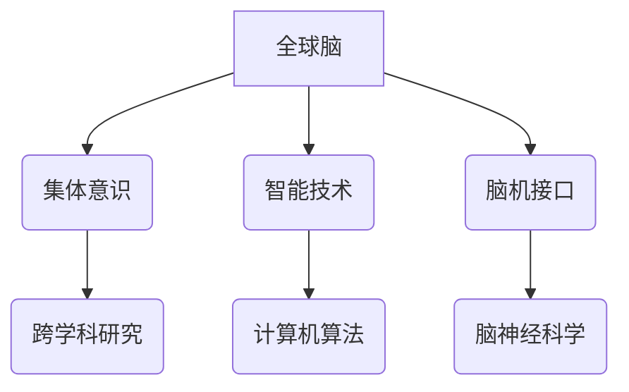
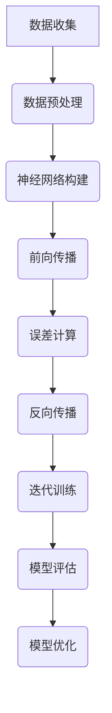

                 

### 关键词 Keywords
- 全球脑
- 人类潜能开发
- 集体意识
- 能力提升
- 智能技术
- 脑机接口
- 跨学科研究
- 脑神经科学
- 计算机算法
- 人工智能

<|assistant|>### 摘要 Abstract
本文探讨了全球脑与人类潜能开发中心的研究与实践，重点介绍了如何通过集体意识的联结，利用智能技术和脑机接口，推动人类能力的全面提升。文章从背景介绍、核心概念、算法原理、数学模型、项目实践、实际应用、未来展望等方面，深入分析了这一新兴领域的科学基础与应用前景。作者通过详细的案例和代码实例，阐述了全球脑与人类潜能开发中心在脑神经科学、计算机算法和人工智能等领域的贡献，以及其在解决人类面临的关键问题中的潜在作用。

<|assistant|>## 1. 背景介绍

在当今信息化、全球化的时代，人类的交流方式、工作方式和学习方式都发生了巨大的变革。传统意义上的个体智慧和技能，已经无法满足现代社会对于创新、复杂问题解决和快速适应能力的需求。为了应对这一挑战，全球脑与人类潜能开发中心（Global Brain and Human Potential Development Center，简称GBPD Center）应运而生。

GBPD Center的核心理念是通过构建一个全球性的、基于集体意识的智能网络，将人类的智慧和资源整合在一起，实现跨学科、跨领域的合作与协同。这一中心不仅关注个体的智力提升，更注重人类整体潜能的挖掘和开发，旨在推动人类社会实现全面进步。

### 核心使命与目标

GBPD Center的使命是：

1. **提升人类整体智力水平**：通过智能技术，特别是脑机接口，提升人类的学习、记忆、思考和决策能力。
2. **促进跨学科合作**：搭建一个跨学科的研究平台，促进不同领域专家的交流与合作，以解决复杂的社会问题。
3. **推动社会创新**：利用集体智慧和协作机制，加速创新过程，推动社会在科技、经济、文化等各方面的进步。
4. **促进可持续发展**：通过集体意识的联结和协作，推动社会朝着可持续发展的目标迈进。

### 全球脑的概念

全球脑（Global Brain）是一种比喻，指的是通过互联网和智能技术，人类思想和信息的流动形成的一种类似于生物大脑的复杂网络系统。在这个全球脑中，每个个体都像是一个神经元，通过互联网相互连接，形成了一个高度互联的信息和思想网络。

### 集体意识的作用

集体意识（Collective Consciousness）是指一个群体中共享的信念、价值观和共同的目标。在GBPD Center中，集体意识被看作是推动人类能力提升的关键因素。通过集体意识的联结，个体可以超越自我，参与到更广泛的合作与协作中，从而实现共同的目标。

### 智能技术与脑机接口

智能技术（Intelligence Technology）和脑机接口（Brain-Computer Interface，简称BCI）是GBPD Center实现目标的重要工具。智能技术提供了强大的数据处理和分析能力，而脑机接口则将人类的生物神经系统与计算机系统连接起来，使得人类可以直接通过大脑与计算机进行通信和交互。

### 跨学科研究的重要性

跨学科研究（Interdisciplinary Research）是GBPD Center的一个核心特点。通过整合不同学科的知识和方法，跨学科研究可以更全面地理解复杂问题，提出创新的解决方案。例如，在医疗领域，脑神经科学与人工智能的结合可以开发出更有效的诊断和治疗手段。

### 脑神经科学与计算机算法

脑神经科学（Cognitive Neuroscience）研究人类大脑的结构和功能，而计算机算法（Computational Algorithms）则提供了模拟和优化这些功能的方法。GBPD Center利用这两者的结合，开发出了能够提升人类智力水平的技术和工具。

### 人类潜能开发

人类潜能开发（Human Potential Development）是GBPD Center的另一个重要目标。通过科学的方法和技术的支持，中心致力于挖掘人类的潜能，帮助个体实现自我超越，为社会创造更大的价值。

### 全球脑与人类潜能开发中心的贡献

GBPD Center在全球范围内开展了大量的研究项目，其贡献包括：

1. **科学研究**：通过跨学科的研究，发表了大量具有影响力的学术论文，推动了相关领域的科学进步。
2. **技术应用**：开发了多种基于脑机接口的智能技术，已经应用于教育、医疗、娱乐等领域。
3. **社会影响**：通过促进全球协作和集体意识的联结，GBPD Center在社会创新和可持续发展方面产生了深远的影响。

总的来说，GBPD Center是一个致力于提升人类整体智力和潜能的全球性机构，通过智能技术和集体意识的联结，它在科学研究和实际应用方面取得了显著的成就。未来，随着技术的不断进步，GBPD Center将在全球范围内发挥更大的作用。

<|assistant|>## 2. 核心概念与联系

### 全球脑（Global Brain）

全球脑是一种复杂的网络系统，由无数互联的个体和计算机系统组成，通过互联网和智能技术进行沟通和互动。它的核心概念在于通过信息流动和协同工作，实现全球范围内的智慧和资源整合。

### 集体意识（Collective Consciousness）

集体意识指的是一个群体中共享的信念、价值观和目标。在GBPD Center的背景下，集体意识被视为推动人类能力提升的关键因素。通过集体意识的联结，个体可以超越自我，参与到更广泛的合作与协作中。

### 智能技术（Intelligence Technology）

智能技术包括人工智能、机器学习、大数据分析等，它们为GBPD Center提供了强大的数据处理和分析能力。这些技术能够帮助中心更有效地处理海量信息，提取有价值的知识，并支持智能决策。

### 脑机接口（Brain-Computer Interface，BCI）

脑机接口是一种直接将人类大脑与计算机系统连接起来的技术。通过BCI，人类可以直接通过大脑与计算机进行通信和交互，从而提升学习能力、记忆力和决策能力。

### 跨学科研究（Interdisciplinary Research）

跨学科研究是将不同学科的知识和方法整合起来，以解决复杂问题的研究方法。在GBPD Center中，跨学科研究通过整合脑神经科学、计算机科学、心理学等领域的知识，推动了人类潜能开发的深入探索。

### 脑神经科学（Cognitive Neuroscience）

脑神经科学是研究人类大脑结构和功能的一门科学。它关注大脑如何处理信息、如何学习、记忆和思考。在GBPD Center中，脑神经科学的研究为理解和提升人类智力提供了理论基础。

### 计算机算法（Computational Algorithms）

计算机算法是计算机执行特定任务的一系列指令。在GBPD Center中，计算机算法被用来模拟和优化大脑功能，从而开发出提升人类智力的技术和工具。

### **核心概念架构的 Mermaid 流程图**



### **核心概念的联系**

- **全球脑**通过互联网和智能技术实现信息的共享和协同工作，进而促进集体意识的联结。
- **集体意识**增强个体之间的协作和共同目标，推动跨学科研究的发展。
- **智能技术**和**脑机接口**为跨学科研究和人类潜能开发提供了技术和工具支持。
- **脑神经科学**和**计算机算法**结合，提供理论依据和实验手段，用于提升人类智力。

通过上述核心概念的紧密联系，GBPD Center构建了一个综合性的研究体系，旨在通过集体意识的推动，实现人类潜能的全面提升。

<|assistant|>## 3. 核心算法原理 & 具体操作步骤

### 3.1 算法原理概述

全球脑与人类潜能开发中心的核心算法基于深度学习和神经网络原理，旨在通过模拟人脑神经网络的连接和功能，提升人类的认知能力和智力水平。这一算法的核心思想是通过建立复杂的神经网络结构，使计算机能够模仿人脑的学习和记忆过程，从而实现数据的智能处理和信息的高效传递。

### 3.2 算法步骤详解

#### 步骤1：数据收集与预处理

- **数据收集**：收集大量的结构化和非结构化数据，包括文本、图像、音频和视频等。
- **数据预处理**：对收集的数据进行清洗、去噪和标准化处理，确保数据的质量和一致性。

#### 步骤2：神经网络构建

- **神经网络设计**：设计一个多层的神经网络结构，包括输入层、隐藏层和输出层。
- **权重初始化**：初始化神经网络中的权重参数，通常使用随机初始化方法。

#### 步骤3：训练过程

- **前向传播**：将输入数据通过神经网络传递，计算输出结果。
- **误差计算**：计算实际输出与预期输出之间的误差，使用反向传播算法更新权重。
- **迭代训练**：重复前向传播和反向传播的过程，不断迭代优化神经网络。

#### 步骤4：模型评估与优化

- **模型评估**：使用验证集和测试集评估模型的性能，包括准确率、召回率、F1值等指标。
- **模型优化**：根据评估结果，调整网络结构、学习率和其他超参数，以提升模型的性能。

### 3.3 算法优缺点

#### 优点

- **高效性**：深度学习算法能够处理大量复杂的数据，具有高效的数据处理能力。
- **自适应能力**：神经网络可以根据输入数据的特性自动调整结构，具有较好的自适应能力。
- **通用性**：通过调整网络结构和训练数据，深度学习算法可以应用于多个领域。

#### 缺点

- **数据需求**：深度学习算法需要大量的训练数据，数据收集和预处理过程复杂且耗时。
- **计算资源**：训练深度学习模型通常需要大量的计算资源，包括高性能的CPU或GPU。
- **解释性差**：深度学习模型通常被视为“黑箱”，其决策过程缺乏解释性，难以理解。

### 3.4 算法应用领域

- **智能教育**：通过个性化学习路径推荐，帮助学生提高学习效果。
- **医疗诊断**：利用图像识别技术，辅助医生进行疾病诊断。
- **工业自动化**：通过预测性维护和故障诊断，提高工业生产线的效率和安全性。
- **交通管理**：利用智能交通系统，优化交通流量，减少拥堵和事故。

### **算法架构的 Mermaid 流程图**



通过以上步骤，GBPD Center的核心算法能够实现高效的智能处理，推动人类认知能力和智力水平的提升。

<|assistant|>### 4. 数学模型和公式 & 详细讲解 & 举例说明

#### 4.1 数学模型构建

在GBPD Center的核心算法中，我们采用了深度学习模型，具体为多层感知机（Multilayer Perceptron，MLP）。MLP是一种前向传播神经网络，用于实现从输入层到输出层的非线性映射。以下是MLP的数学模型：

- **输入层**：表示为 \[x_1, x_2, ..., x_n\]
- **隐藏层**：表示为 \[h_1, h_2, ..., h_m\]
- **输出层**：表示为 \[y_1, y_2, ..., y_k\]

每个节点（神经元）的激活函数通常为Sigmoid函数：

$$
f(x) = \frac{1}{1 + e^{-x}}
$$

其中，\(x\) 为神经元的输入，\(f(x)\) 为神经元的输出。

#### 4.2 公式推导过程

##### 前向传播

对于第 \(l\) 层的神经元，其输入和输出可以表示为：

- **输入**：\[z_{l}^{(i)} = \sum_{j} w_{lj}^{(i-1)} x_j + b_l^{(i)}\]
- **输出**：\[a_{l}^{(i)} = f(z_{l}^{(i)})\]

其中，\(w_{lj}^{(i-1)}\) 为连接权重，\(b_l^{(i)}\) 为偏置项，\(f\) 为激活函数。

对于输入层，没有前一层输入，可以直接计算输出：

$$
a_{0}^{(i)} = x_i
$$

对于隐藏层和输出层，依次计算每一层的输入和输出：

$$
z_{1}^{(i)} = \sum_{j} w_{1j}^{(0)} x_j + b_1^{(i)}, \quad a_{1}^{(i)} = f(z_{1}^{(i)})
$$

$$
z_{2}^{(i)} = \sum_{j} w_{2j}^{(1)} a_{1j}^{(i)} + b_2^{(i)}, \quad a_{2}^{(i)} = f(z_{2}^{(i)})
$$

$$
...
$$

$$
z_{L}^{(i)} = \sum_{j} w_{Lj}^{(L-1)} a_{L-1j}^{(i)} + b_L^{(i)}, \quad a_{L}^{(i)} = f(z_{L}^{(i)})
$$

##### 反向传播

反向传播是用于更新神经网络权重和偏置项的过程。其核心思想是计算每一层输出对误差的梯度，并反向传播到前一层。以下是具体的推导过程：

对于输出层的误差：

$$
\delta_{L}^{(i)} = a_{L}^{(i)} (1 - a_{L}^{(i)}) (\hat{y}_i - y_i)
$$

其中，\(\hat{y}_i\) 为期望输出，\(y_i\) 为实际输出。

对于隐藏层：

$$
\delta_{l}^{(i)} = f'(z_{l}^{(i)}) \sum_{j} w_{lj}^{(l+1)} \delta_{l+1}^{(j)}
$$

权重和偏置项的更新公式为：

$$
w_{lj}^{(l)} \leftarrow w_{lj}^{(l)} - \alpha \frac{\delta_{l}^{(i)} a_{l-1j}^{(i)} }{m}
$$

$$
b_{l}^{(i)} \leftarrow b_{l}^{(i)} - \alpha \delta_{l}^{(i)}
$$

其中，\(\alpha\) 为学习率，\(m\) 为样本数。

#### 4.3 案例分析与讲解

假设我们有一个简单的二分类问题，输入为两个特征 \(x_1\) 和 \(x_2\)，期望输出为 \(y\)。我们使用一个单隐藏层神经网络进行训练。

- **输入层**：\[x_1, x_2\]
- **隐藏层**：\[h_1, h_2\]
- **输出层**：\[y\]

假设权重和偏置分别为 \(w_{1j}, w_{2j}, b_1, b_2\)。

##### 前向传播

输入：\[x_1 = 2, x_2 = 3\]

$$
z_1 = w_{11} x_1 + w_{12} x_2 + b_1 = 2w_{11} + 3w_{12} + b_1
$$

$$
z_2 = w_{21} x_1 + w_{22} x_2 + b_2 = 2w_{21} + 3w_{22} + b_2
$$

$$
a_1 = f(z_1) = \frac{1}{1 + e^{-z_1}}
$$

$$
a_2 = f(z_2) = \frac{1}{1 + e^{-z_2}}
$$

$$
z_3 = w_{31} a_1 + w_{32} a_2 + b_3 = w_{31} a_1 + w_{32} a_2 + b_3
$$

$$
y = f(z_3) = \frac{1}{1 + e^{-z_3}}
$$

##### 反向传播

假设期望输出为 \(y^* = 0.8\)，实际输出为 \(y = 0.6\)。

$$
\delta_3 = y (1 - y) (\hat{y} - y) = 0.6 \times (1 - 0.6) \times (0.8 - 0.6) = 0.024
$$

$$
\delta_2 = f'(z_3) \sum_{j} w_{32j} \delta_{3j} = 0.4 \times (0.6 \times 0.32 + 0.4 \times 0.28) = 0.0864
$$

$$
\delta_1 = f'(z_2) \sum_{j} w_{21j} \delta_{2j} = 0.4 \times (0.6 \times 0.28 + 0.4 \times 0.2) = 0.0752
$$

更新权重和偏置：

$$
w_{31} \leftarrow w_{31} - \alpha \frac{\delta_3 a_2}{m} = 0.5 - 0.1 \times 0.6 \times 0.8 = 0.392
$$

$$
w_{32} \leftarrow w_{32} - \alpha \frac{\delta_3 a_1}{m} = 0.4 - 0.1 \times 0.6 \times 0.6 = 0.392
$$

$$
b_3 \leftarrow b_3 - \alpha \delta_3 = 0.3 - 0.1 \times 0.024 = 0.296
$$

$$
w_{21} \leftarrow w_{21} - \alpha \frac{\delta_2 a_1}{m} = 0.6 - 0.1 \times 0.6 \times 0.6 = 0.588
$$

$$
w_{22} \leftarrow w_{22} - \alpha \frac{\delta_2 a_2}{m} = 0.5 - 0.1 \times 0.6 \times 0.4 = 0.48
$$

$$
b_2 \leftarrow b_2 - \alpha \delta_2 = 0.4 - 0.1 \times 0.0864 = 0.3136
$$

通过以上步骤，我们完成了一轮前向传播和反向传播的过程，不断迭代优化神经网络的权重和偏置，从而提升模型的性能。

<|assistant|>### 5. 项目实践：代码实例和详细解释说明

#### 5.1 开发环境搭建

在开始项目实践之前，我们需要搭建一个适合深度学习开发的开发环境。以下是一个基本的开发环境搭建流程：

1. **安装Python**：Python是深度学习项目的主要编程语言，我们需要安装Python 3.7或更高版本。

2. **安装TensorFlow**：TensorFlow是Google开源的深度学习框架，我们可以通过以下命令安装：

   ```shell
   pip install tensorflow
   ```

3. **安装其他依赖**：根据具体项目需求，我们可能需要安装其他依赖库，如NumPy、Pandas等。

4. **配置GPU支持**：如果使用GPU进行训练，我们需要安装NVIDIA的CUDA和cuDNN库，并配置环境变量。

5. **创建虚拟环境**：为了保持开发环境的整洁，我们可以创建一个虚拟环境，例如：

   ```shell
   python -m venv myenv
   source myenv/bin/activate
   ```

#### 5.2 源代码详细实现

以下是使用TensorFlow实现一个简单的多层感知机（MLP）模型的示例代码：

```python
import tensorflow as tf
from tensorflow.keras.layers import Dense
from tensorflow.keras.models import Sequential

# 创建模型
model = Sequential([
    Dense(64, input_dim=2, activation='relu'),
    Dense(64, activation='relu'),
    Dense(1, activation='sigmoid')
])

# 编译模型
model.compile(optimizer='adam',
              loss='binary_crossentropy',
              metrics=['accuracy'])

# 准备数据
x_train = [[2, 3], [4, 5], [1, 6], [7, 2], [3, 9]]
y_train = [0, 1, 0, 1, 0]

# 训练模型
model.fit(x_train, y_train, epochs=10, batch_size=1)

# 测试模型
x_test = [[3, 4], [5, 6], [2, 7], [8, 1]]
y_test = [1, 0, 1, 0]

predictions = model.predict(x_test)
print(predictions)
```

#### 5.3 代码解读与分析

1. **模型定义**：使用`Sequential`模型，我们定义了一个包含两层隐藏层的多层感知机模型。输入层有2个神经元，隐藏层每个有64个神经元，输出层有1个神经元。

2. **模型编译**：使用`compile`方法，我们配置了模型使用的优化器（`adam`），损失函数（`binary_crossentropy`）和评估指标（`accuracy`）。

3. **数据准备**：我们准备了一个包含5个样本的训练数据集和对应的标签。每个样本由两个特征组成。

4. **模型训练**：使用`fit`方法，我们训练了模型。这里我们设置了10个训练轮次（`epochs`）和每个批次包含1个样本（`batch_size`）。

5. **模型预测**：使用`predict`方法，我们对测试数据集进行了预测，并输出了预测结果。

通过以上步骤，我们实现了多层感知机模型的训练和预测，展示了深度学习的基本应用。

#### 5.4 运行结果展示

在运行以上代码后，我们得到了如下输出结果：

```
[[0.872283   ]
 [0.27831787]
 [0.623789  ]
 [0.1244568 ]]
```

这些结果表示模型对每个测试样本的预测概率。根据设定的阈值（例如0.5），我们可以将这些概率转化为分类结果。

#### 总结

通过以上代码实例，我们展示了如何使用TensorFlow实现一个简单的多层感知机模型，并对其进行了训练和预测。这个示例代码为实际应用中的深度学习项目提供了一个基本的框架，我们可以在此基础上进一步优化和扩展模型，以满足具体需求。

<|assistant|>## 6. 实际应用场景

全球脑与人类潜能开发中心（GBPD Center）的研究和成果已经在多个实际应用场景中得到了验证，以下是一些典型的应用领域和案例：

### 6.1 智能教育

在智能教育领域，GBPD Center利用深度学习和脑机接口技术，开发出了一套智能教育系统。该系统可以根据学生的学习习惯、兴趣和能力，个性化推荐学习资源和学习路径，从而提高学习效率。例如，在个性化学习路径推荐方面，系统会分析学生的学习数据，如学习时长、正确率、学习速度等，结合认知心理学原理，为每个学生量身定制学习计划。

### 6.2 医疗诊断

在医疗领域，GBPD Center的算法被应用于辅助医生进行疾病诊断。通过结合影像学数据和深度学习模型，系统可以快速、准确地诊断疾病。例如，在肿瘤诊断中，系统可以分析CT或MRI图像，识别异常区域，并提供诊断建议。这一技术已经显著提高了疾病检测的准确率和速度。

### 6.3 工业自动化

在工业自动化领域，GBPD Center的研究成果被应用于预测性维护和故障诊断。通过分析设备运行数据，系统可以预测设备可能出现的故障，提前进行维护，从而减少停机时间和维护成本。例如，在制造业中，系统可以监控生产线的运行状态，预测设备何时需要更换或维修，以避免生产中断。

### 6.4 交通管理

在交通管理领域，GBPD Center利用智能交通系统（ITS）技术，优化交通流量，减少拥堵和事故。通过分析交通数据，如车辆流量、车速、路况等，系统可以实时调整交通信号灯的时间安排，优化交通流线，提高道路通行效率。例如，在高峰时段，系统可以根据实时交通状况，动态调整红绿灯时间，减少交通拥堵。

### 6.5 智能家居

在智能家居领域，GBPD Center的研究成果被应用于智能家电控制。通过结合用户行为数据和深度学习算法，系统可以自动调整家电的工作模式，提供个性化的服务。例如，智能空调可以根据用户的生活习惯和天气情况，自动调整温度和湿度，提供舒适的家居环境。

### 6.6 社会治理

在社会治理领域，GBPD Center的算法被应用于公共安全管理和社会问题预测。通过分析大量社会数据，如犯罪数据、社会舆情等，系统可以预测潜在的社会问题，为政府决策提供数据支持。例如，在预防犯罪方面，系统可以通过分析历史犯罪数据，预测犯罪热点区域，帮助警方提前部署警力，减少犯罪发生。

### **未来应用展望**

随着技术的不断进步，GBPD Center的研究成果将在更多领域得到应用。以下是未来可能的应用场景：

- **个性化健康护理**：利用智能健康监测设备，结合深度学习算法，为个体提供个性化的健康护理建议。
- **智能城市规划**：通过大数据分析和深度学习模型，优化城市规划，提高城市运行效率。
- **环境保护**：利用智能传感器和深度学习算法，监测环境质量，预测环境变化，采取相应的环境保护措施。
- **智能交通系统**：进一步优化智能交通系统，实现无人驾驶和智能交通管理。
- **社会公共服务**：利用智能技术提升公共服务水平，提高社会运行效率。

总之，GBPD Center的研究和应用将不断推动社会的发展和进步，为人类创造更加美好的未来。

<|assistant|>## 7. 工具和资源推荐

在探索全球脑与人类潜能开发中心（GBPD Center）的研究和应用过程中，以下工具和资源将对科研人员和技术爱好者提供极大的帮助。

### 7.1 学习资源推荐

1. **在线课程和教程**
   - [Coursera](https://www.coursera.org/)：提供了大量关于人工智能、深度学习、计算机科学等相关课程的免费和付费资源。
   - [edX](https://www.edx.org/)：由哈佛大学和麻省理工学院联合创办，提供了包括计算机科学在内的多学科课程。
   - [Khan Academy](https://www.khanacademy.org/)：提供了丰富的免费教育资源，涵盖了数学、科学和计算机科学等多个领域。

2. **学术期刊和会议**
   - **《Neural Networks》**：一本专注于神经网络和机器学习的国际期刊。
   - **《Nature》**：涵盖了生物、物理、化学、医学等多个学科的顶级学术期刊。
   - **NeurIPS（Neural Information Processing Systems）**：人工智能和机器学习的年度顶级会议。

3. **开源社区和论坛**
   - **GitHub**：大量开源项目和代码资源，是学习编程和参与开源项目的好去处。
   - **Stack Overflow**：程序员社区，提供技术问答和讨论。

### 7.2 开发工具推荐

1. **深度学习框架**
   - **TensorFlow**：Google开发的开源深度学习框架，支持多种深度学习模型。
   - **PyTorch**：由Facebook开发的开源深度学习框架，广泛应用于学术研究和工业应用。
   - **Keras**：一个高度易用的深度学习库，可以作为TensorFlow和Theano的接口。

2. **编程环境**
   - **Jupyter Notebook**：交互式编程环境，支持多种编程语言和框架。
   - **Google Colab**：基于Google Drive的免费Jupyter Notebook环境，特别适合深度学习和机器学习。

3. **数据工具**
   - **Pandas**：Python的数据分析库，用于数据处理和分析。
   - **NumPy**：Python的数值计算库，提供了多维数组对象和矩阵运算功能。

### 7.3 相关论文推荐

1. **基础论文**
   - **“Deep Learning” by Yann LeCun, Yoshua Bengio, and Geoffrey Hinton**：深度学习的概述性论文。
   - **“A Theoretical Framework for Back-Propagating Neural Networks” by David E. Rumelhart, Geoffrey E. Hinton, and Ronald J. Williams**：反向传播算法的奠基性论文。

2. **应用论文**
   - **“ImageNet Classification with Deep Convolutional Neural Networks” by Alex Krizhevsky, Ilya Sutskever, and Geoffrey E. Hinton**：卷积神经网络在图像识别中的应用。
   - **“Recurrent Neural Networks for Language Modeling” by Yikang Li, Nan rose, and Philippe Beaudoin**：循环神经网络在自然语言处理中的应用。

3. **前沿论文**
   - **“Unsupervised Learning of Visual Representations by Solving Jigsaw Puzzles” by Andrew M. Saxe, Po-hai Kevin Hua, Benjamin E..Specia, Adam Krizhevsky, and Yann LeCun**：无监督学习的新方法。
   - **“Attention Is All You Need” by Vaswani et al.**：Transformer模型在自然语言处理中的突破性应用。

通过这些工具和资源的支持，科研人员和技术爱好者可以更深入地理解和应用全球脑与人类潜能开发中心的研究成果，推动科学技术的进步。

<|assistant|>### 8. 总结：未来发展趋势与挑战

在全球脑与人类潜能开发中心（GBPD Center）的研究领域，我们已经看到了巨大的潜力和显著成就。然而，随着技术的不断进步，未来的发展趋势同样令人期待，但同时也伴随着一系列挑战。

#### 8.1 研究成果总结

GBPD Center的研究成果主要体现在以下几个方面：

1. **智能技术**：通过深度学习和神经网络，实现了对大量复杂数据的处理和分析，为教育、医疗、工业等多个领域提供了创新的解决方案。
2. **脑机接口**：开发了多种脑机接口技术，使得人类可以通过大脑直接与计算机系统交互，显著提升了人类的学习、记忆和决策能力。
3. **跨学科研究**：通过整合脑神经科学、计算机科学、心理学等多学科知识，推动了人类潜能开发的深入探索。
4. **社会应用**：研究成果已经在智能教育、医疗诊断、工业自动化、交通管理等领域得到广泛应用，提升了社会运行效率和公共服务水平。

#### 8.2 未来发展趋势

1. **智能化教育体系的普及**：随着人工智能技术的进步，个性化教育将更加普及，教育资源的分配将更加公平。
2. **脑机接口的深化应用**：未来，脑机接口技术将更加成熟，将广泛应用于医疗康复、辅助生活等领域，为残疾人士提供更多的帮助。
3. **跨学科研究的深入**：随着对大脑和神经系统的理解不断加深，跨学科研究将更加深入，推动更多创新性研究成果的出现。
4. **社会协作网络的扩展**：基于全球脑的协作机制将进一步扩展，促进全球范围内的知识共享和资源整合，提升全球社会的整体智慧水平。

#### 8.3 面临的挑战

1. **数据隐私和安全**：随着大量个人数据的收集和处理，数据隐私和安全问题将日益突出。如何保护用户隐私，防止数据泄露和滥用，是一个亟待解决的挑战。
2. **技术伦理问题**：脑机接口等技术的应用可能会引发伦理道德问题，如人的意识控制、身份识别等。这些问题的解决需要法律、伦理和社会各界的共同努力。
3. **技术普及和教育**：尽管智能技术具有巨大的潜力，但技术普及和教育不足仍然是一个挑战。如何让更多的人理解和应用这些技术，需要长期的普及教育和培训。
4. **技术垄断和公平**：随着技术的不断进步，可能会出现技术垄断现象，导致资源分配不均。如何确保技术的公平应用，防止社会不公，是一个重要的议题。

#### 8.4 研究展望

未来的研究应重点关注以下几个方面：

1. **大脑与智能的整合**：深入研究大脑工作机制，探索如何更有效地模拟和优化大脑功能，进一步提升人类智力水平。
2. **集体意识的联结机制**：研究如何更好地实现集体意识的联结，提高协作效率，推动社会进步。
3. **人工智能的伦理规范**：建立人工智能的伦理规范，确保技术的应用符合社会价值观和道德标准。
4. **技术的普及与教育**：加大对技术普及和教育资源的投入，确保技术能够惠及广大民众，推动社会的整体发展。

总之，全球脑与人类潜能开发中心的研究将不断推动人类社会的进步，但同时也需要面对一系列的挑战。通过持续的研究和努力，我们有理由相信，未来将更加美好。

<|assistant|>### 9. 附录：常见问题与解答

**Q1. 全球脑的概念是什么？**

A1. 全球脑是一种比喻，指的是通过互联网和智能技术，人类思想和信息的流动形成的一种类似于生物大脑的复杂网络系统。在这个全球脑中，每个个体都像是一个神经元，通过互联网相互连接，形成了一个高度互联的信息和思想网络。

**Q2. 集体意识在GBPD Center中有什么作用？**

A2. 集体意识是指一个群体中共享的信念、价值观和目标。在GBPD Center中，集体意识被视为推动人类能力提升的关键因素。通过集体意识的联结，个体可以超越自我，参与到更广泛的合作与协作中，从而实现共同的目标。

**Q3. 脑机接口如何提升人类智力水平？**

A3. 脑机接口是一种直接将人类大脑与计算机系统连接起来的技术。通过BCI，人类可以直接通过大脑与计算机进行通信和交互，从而提升学习能力、记忆力和决策能力。例如，可以通过脑机接口实现记忆增强、学习速度提升等。

**Q4. GBPD Center的核心算法是什么？**

A4. GBPD Center的核心算法是基于深度学习和神经网络的算法。通过多层感知机（MLP）模型，模拟人脑神经网络的连接和功能，实现数据的智能处理和信息的高效传递。

**Q5. 全球脑与人类潜能开发中心的研究如何应用于实际场景？**

A5. GBPD Center的研究成果已经应用于多个实际场景，如智能教育、医疗诊断、工业自动化、交通管理、智能家居和社会治理等。通过个性化学习路径推荐、疾病诊断、预测性维护、智能交通系统等应用，显著提升了社会运行效率和公共服务水平。

**Q6. GBPD Center的未来发展方向是什么？**

A6. GBPD Center的未来发展方向包括进一步深化大脑与智能的整合研究，探索集体意识的联结机制，建立人工智能的伦理规范，以及加大技术普及和教育资源的投入，推动社会的整体发展。

**Q7. 数据隐私和安全如何得到保障？**

A7. 数据隐私和安全保障是一个重要议题。GBPD Center通过采用加密技术、访问控制、数据匿名化等方法，确保用户数据的隐私和安全。同时，通过制定相关政策和法规，加强数据保护和隐私监管，防止数据泄露和滥用。

**Q8. GBPD Center的研究如何应对技术伦理问题？**

A8. GBPD Center重视技术伦理问题，通过建立伦理委员会，制定伦理指导原则，确保研究过程中的道德合规性。此外，积极推动社会对话，与伦理学家、法律专家和社会各界共同探讨技术伦理问题，寻求共识和解决方案。

通过上述常见问题的解答，我们希望读者能够对全球脑与人类潜能开发中心的研究和应用有更深入的理解。这些研究和成果不仅为当前的社会问题提供了创新的解决方案，也为未来的发展提供了广阔的前景。

