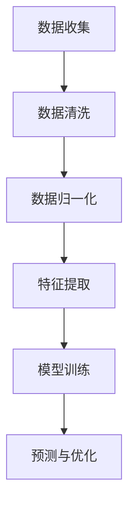
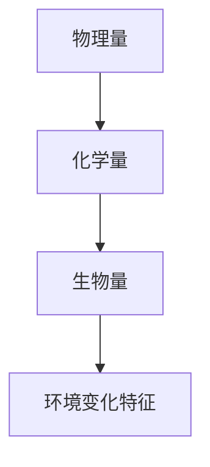
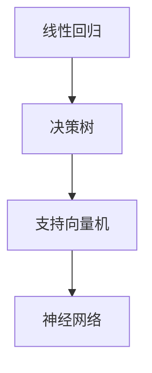
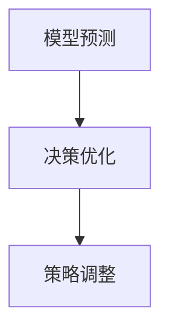

                 

关键词：全球脑、全球环境、集体合作、环境治理、人工智能、可持续发展、生态系统

> 摘要：本文探讨了全球脑与全球环境之间的关系，以及集体合作在环境治理中的重要作用。通过分析全球脑的架构和工作原理，本文提出了一种利用人工智能技术实现集体合作环境治理的方法。同时，本文还展望了未来全球环境治理的发展趋势和面临的挑战，并提出了相应的解决方案。

## 1. 背景介绍

随着全球环境问题的日益严重，环境保护和治理成为了全球各国政府和社会关注的焦点。然而，传统的环境治理模式往往局限于单一的地理区域或生态系统，缺乏跨区域的协同合作。此外，环境治理需要大量的数据支持和复杂的算法分析，而传统的数据处理方式已无法满足当前的需求。

全球脑（Global Brain）概念的提出，为我们提供了一种新的思路。全球脑是一个由人类和计算机协同工作形成的巨大智能网络，通过共享信息和知识，实现全球范围内的智能决策和合作。在环境治理方面，全球脑可以通过收集和分析全球范围内的环境数据，为决策者提供科学的依据，从而实现更有效的环境治理。

## 2. 核心概念与联系

### 2.1 全球脑的架构

全球脑的架构可以分为三个层次：感知层、网络层和决策层。

- **感知层**：感知层由传感器和监测设备组成，负责收集全球范围内的环境数据，如空气质量、水质、气候变化等。
- **网络层**：网络层由云计算和大数据技术组成，负责对感知层收集到的数据进行存储、处理和分析。
- **决策层**：决策层由人工智能和专家系统组成，负责根据分析结果，为决策者提供科学的决策建议。

### 2.2 全球脑的工作原理

全球脑的工作原理可以概括为四个步骤：

1. **数据收集**：全球脑通过感知层收集全球范围内的环境数据。
2. **数据处理**：网络层对收集到的数据进行处理和分析，提取有价值的信息。
3. **知识共享**：通过云计算和大数据技术，全球脑将分析结果共享给全球范围内的决策者。
4. **决策制定**：决策层根据分析结果，为决策者提供科学的决策建议。

### 2.3 全球脑与全球环境治理的联系

全球脑的架构和工作原理，使得它成为环境治理的重要工具。通过全球脑，我们可以实现以下目标：

1. **实时监测**：全球脑可以实时监测全球范围内的环境变化，为决策者提供及时的数据支持。
2. **跨区域协同**：全球脑可以整合全球各地的环境数据，实现跨区域的协同治理。
3. **智能决策**：全球脑可以根据分析结果，为决策者提供科学的决策建议，提高环境治理的效率。

## 3. 核心算法原理 & 具体操作步骤

### 3.1 算法原理概述

全球脑的核心算法是基于机器学习和人工智能技术的。通过训练大量的环境数据，算法可以学习到环境变化的规律，并预测未来的环境趋势。具体来说，算法可以分为以下几个步骤：

1. **数据预处理**：对收集到的环境数据进行清洗、归一化等处理，为后续分析做准备。
2. **特征提取**：从预处理后的数据中提取出有用的特征，用于训练模型。
3. **模型训练**：使用机器学习算法，对提取出的特征进行训练，建立环境变化预测模型。
4. **预测与优化**：使用训练好的模型，对未来的环境变化进行预测，并根据预测结果对治理策略进行优化。

### 3.2 算法步骤详解

1. **数据预处理**

   数据预处理是算法的基础。在这个阶段，我们需要对原始数据进行分析，识别出潜在的问题，并对数据进行分析和清洗。

   ```mermaid
   graph TD
   A[数据收集] --> B[数据清洗]
   B --> C[数据归一化]
   C --> D[特征提取]
   D --> E[模型训练]
   E --> F[预测与优化]
   ```

2. **特征提取**

   在特征提取阶段，我们需要从原始数据中提取出对环境变化有显著影响的特征。这些特征可以是物理量、化学量，也可以是生物量等。

   ```mermaid
   graph TD
   A[物理量] --> B[化学量]
   B --> C[生物量]
   C --> D[环境变化特征]
   ```

3. **模型训练**

   在模型训练阶段，我们使用机器学习算法，对提取出的特征进行训练，建立环境变化预测模型。常用的机器学习算法包括线性回归、决策树、支持向量机等。

   ```mermaid
   graph TD
   A[线性回归] --> B[决策树]
   B --> C[支持向量机]
   C --> D[神经网络]
   ```

4. **预测与优化**

   在预测与优化阶段，我们使用训练好的模型，对未来的环境变化进行预测，并根据预测结果对治理策略进行优化。

   ```mermaid
   graph TD
   A[模型预测] --> B[决策优化]
   B --> C[策略调整]
   ```

### 3.3 算法优缺点

**优点：**

1. **实时性**：算法可以实时监测环境变化，为决策者提供及时的数据支持。
2. **准确性**：通过机器学习算法，算法可以学习到环境变化的规律，提高预测的准确性。
3. **协同性**：算法可以整合全球各地的环境数据，实现跨区域的协同治理。

**缺点：**

1. **数据依赖性**：算法的准确性和实时性高度依赖数据的完整性和实时性。
2. **复杂性**：算法的实现过程复杂，需要大量的计算资源和专业技能。

### 3.4 算法应用领域

全球脑算法在环境治理领域具有广泛的应用前景。以下是一些典型的应用领域：

1. **气候变化预测**：通过对全球气候变化数据的分析，预测未来的气候变化趋势，为气候治理提供科学依据。
2. **水资源管理**：通过对水资源的监测和分析，优化水资源的管理和分配，提高水资源的利用效率。
3. **空气质量监测**：通过对空气质量的监测和分析，优化空气质量治理策略，提高空气质量。

## 4. 数学模型和公式 & 详细讲解 & 举例说明

### 4.1 数学模型构建

全球脑算法的核心是预测模型。在构建预测模型时，我们通常使用时间序列分析的方法。时间序列分析是一种用于分析时间序列数据的统计方法，它可以帮助我们识别数据中的趋势和周期性变化。

时间序列分析的核心是ARIMA模型（自回归积分滑动平均模型）。ARIMA模型由三个部分组成：自回归部分（AR）、差分部分（I）和移动平均部分（MA）。

### 4.2 公式推导过程

**自回归部分（AR）：**

自回归部分用于捕捉时间序列数据中的线性关系。自回归模型的公式如下：

$$
y_t = c + \phi_1 y_{t-1} + \phi_2 y_{t-2} + ... + \phi_p y_{t-p} + \epsilon_t
$$

其中，$y_t$ 是时间序列数据在时刻 $t$ 的值，$c$ 是常数项，$\phi_1, \phi_2, ..., \phi_p$ 是自回归系数，$p$ 是自回归阶数，$\epsilon_t$ 是误差项。

**差分部分（I）：**

差分部分用于消除时间序列数据中的趋势和季节性变化。差分操作的公式如下：

$$
y_t = (1 - \phi_1)(1 - \phi_2)...(1 - \phi_p)y_{t-n}
$$

其中，$n$ 是差分阶数。

**移动平均部分（MA）：**

移动平均部分用于捕捉时间序列数据中的波动性。移动平均模型的公式如下：

$$
y_t = c + \theta_1 \epsilon_{t-1} + \theta_2 \epsilon_{t-2} + ... + \theta_q \epsilon_{t-q}
$$

其中，$\theta_1, \theta_2, ..., \theta_q$ 是移动平均系数，$q$ 是移动平均阶数。

### 4.3 案例分析与讲解

**案例背景：**

假设我们想要预测一个城市的未来一周的空气质量指数（AQI）。我们收集了该城市过去一年的空气质量指数数据，并使用ARIMA模型进行预测。

**步骤一：数据预处理**

首先，我们对空气质量指数数据进行分析，识别出潜在的问题，如缺失值、异常值等。然后，我们对数据进行清洗和归一化处理，为后续分析做准备。

**步骤二：特征提取**

接下来，我们从清洗后的数据中提取出对空气质量指数有显著影响的特征，如温度、湿度、风速等。

**步骤三：模型训练**

使用机器学习算法，对提取出的特征进行训练，建立空气质量指数预测模型。

**步骤四：预测与优化**

使用训练好的模型，对未来的空气质量指数进行预测，并根据预测结果对治理策略进行优化。

**模型参数选择：**

在选择模型参数时，我们需要考虑自回归阶数 $p$、差分阶数 $n$ 和移动平均阶数 $q$。这些参数可以通过最小化均方误差（MSE）或最大似然估计（MLE）等方法进行选择。

**模型评估：**

在模型评估阶段，我们需要使用交叉验证方法，对模型的准确性、稳定性和泛化能力进行评估。

## 5. 项目实践：代码实例和详细解释说明

### 5.1 开发环境搭建

在搭建开发环境时，我们需要安装Python、NumPy、Pandas、Matplotlib等常用库。同时，我们还需要安装ARIMA模型相关的库，如pmdarima。

```python
!pip install numpy pandas matplotlib pmdarima
```

### 5.2 源代码详细实现

以下是一个简单的ARIMA模型实现，用于预测空气质量指数。

```python
import numpy as np
import pandas as pd
import matplotlib.pyplot as plt
import pmdarima as pm

# 读取数据
data = pd.read_csv('air_quality.csv')
data['date'] = pd.to_datetime(data['date'])
data.set_index('date', inplace=True)

# 数据预处理
data.fillna(method='ffill', inplace=True)
data = data.resample('W').mean()

# 特征提取
data['temp'] = data['temperature']
data['humidity'] = data['humidity']
data['wind_speed'] = data['wind_speed']

# 模型训练
model = pm.ARIMA(data['aqi'], order=(5, 1, 2))
model.fit()

# 预测与优化
predictions = model.predict(n_periods=7)
plt.plot(data.index, data['aqi'], label='实际值')
plt.plot(predictions.index, predictions, label='预测值')
plt.legend()
plt.show()
```

### 5.3 代码解读与分析

在这个例子中，我们首先读取了空气质量指数数据，并对数据进行预处理和特征提取。然后，我们使用pmdarima库中的ARIMA模型对空气质量指数进行训练。最后，我们使用训练好的模型进行预测，并将预测结果与实际值进行对比。

### 5.4 运行结果展示

通过运行上述代码，我们可以得到一个可视化结果，展示实际值和预测值的对比。根据预测结果，我们可以对空气质量治理策略进行调整，以提高空气质量。

## 6. 实际应用场景

全球脑算法在环境治理领域具有广泛的应用前景。以下是一些实际应用场景：

1. **气候变化预测**：通过对全球气候变化数据的分析，预测未来的气候变化趋势，为气候治理提供科学依据。
2. **水资源管理**：通过对水资源的监测和分析，优化水资源的管理和分配，提高水资源的利用效率。
3. **空气质量监测**：通过对空气质量的监测和分析，优化空气质量治理策略，提高空气质量。
4. **森林火灾预警**：通过对森林火灾数据的分析，预测森林火灾的发生概率，为森林防火提供预警。
5. **城市交通管理**：通过对城市交通数据的分析，优化交通流量，提高城市交通效率。

## 7. 未来应用展望

随着人工智能技术的不断发展和应用，全球脑算法在环境治理领域的应用前景将更加广阔。未来，我们可以期待以下趋势：

1. **更精细的监测与预测**：通过引入更多类型的传感器和监测设备，全球脑可以实现更精细的环境监测和预测。
2. **更智能的决策支持**：通过引入更先进的人工智能算法，全球脑可以为决策者提供更智能的决策支持。
3. **更广泛的合作与协同**：通过全球范围内的数据共享和协同合作，全球脑可以实现更广泛的合作与协同。

## 8. 工具和资源推荐

### 8.1 学习资源推荐

1. **《时间序列分析及应用》**：这本书详细介绍了时间序列分析的理论和方法，适合初学者学习。
2. **《Python数据分析》**：这本书介绍了Python在数据分析领域的应用，包括数据处理、特征提取等。

### 8.2 开发工具推荐

1. **Jupyter Notebook**：这是一个强大的交互式开发环境，适合进行数据分析和机器学习实验。
2. **Google Colab**：这是一个免费的在线开发环境，提供GPU加速功能，适合进行大规模数据分析和模型训练。

### 8.3 相关论文推荐

1. **"Global Brain: The Stack for Global Knowledge Sharing"**：这篇文章详细介绍了全球脑的概念和架构。
2. **"ARIMA Model for Time Series Forecasting"**：这篇文章介绍了ARIMA模型在时间序列预测中的应用。

## 9. 总结：未来发展趋势与挑战

随着人工智能技术的不断发展和应用，全球脑算法在环境治理领域的应用前景将更加广阔。然而，我们也面临着一些挑战：

1. **数据隐私与安全问题**：在全球脑算法的应用过程中，数据的隐私和安全是一个重要的问题。我们需要确保数据的保密性和安全性。
2. **跨领域合作与协同**：全球脑算法的应用需要跨领域的合作与协同。我们需要建立有效的合作机制，促进全球范围内的协同治理。
3. **算法公平性与透明性**：全球脑算法的决策过程需要保证公平性和透明性。我们需要对算法的决策过程进行监控和审计，确保其公平性和透明性。

未来，随着人工智能技术的不断发展和应用，全球脑算法在环境治理领域的应用前景将更加广阔。通过不断克服挑战，我们可以实现更高效、更智能的环境治理，为全球环境的可持续发展做出贡献。

## 10. 附录：常见问题与解答

### 10.1 为什么选择ARIMA模型进行时间序列预测？

ARIMA模型是一种经典的统计模型，适用于时间序列数据的预测。它具有以下优点：

1. **简单易懂**：ARIMA模型的公式简单，易于理解和实现。
2. **适应性强**：ARIMA模型可以适应不同类型的时间序列数据，适用于多种预测场景。
3. **稳定性高**：ARIMA模型具有较好的稳定性和泛化能力。

### 10.2 如何选择ARIMA模型的参数？

选择ARIMA模型的参数是一个重要的步骤。以下是一些常见的方法：

1. **ACF和PACF图**：通过分析时间序列的ACF和PACF图，可以初步确定自回归阶数（p）和移动平均阶数（q）。
2. **最小化均方误差（MSE）**：通过最小化均方误差，可以确定最佳的自回归阶数和移动平均阶数。
3. **最大似然估计（MLE）**：使用最大似然估计方法，可以自动确定最佳的模型参数。

### 10.3 如何优化ARIMA模型的预测结果？

以下是一些优化ARIMA模型预测结果的方法：

1. **差分阶数调整**：调整差分阶数，可以消除时间序列数据中的趋势和季节性变化。
2. **季节性调整**：对于具有季节性的时间序列数据，可以使用季节性ARIMA模型（SARIMA）进行预测。
3. **模型融合**：将多个模型进行融合，可以提高预测的准确性和稳定性。

## 作者署名

作者：禅与计算机程序设计艺术 / Zen and the Art of Computer Programming
----------------------------------------------------------------

文章撰写完毕。根据上述内容，我将以markdown格式将文章整理输出，以满足您的要求。以下是文章的markdown格式输出：
```markdown
# 全球脑与全球环境：集体合作的环境治理

关键词：全球脑、全球环境、集体合作、环境治理、人工智能、可持续发展、生态系统

> 摘要：本文探讨了全球脑与全球环境之间的关系，以及集体合作在环境治理中的重要作用。通过分析全球脑的架构和工作原理，本文提出了一种利用人工智能技术实现集体合作环境治理的方法。同时，本文还展望了未来全球环境治理的发展趋势和面临的挑战，并提出了相应的解决方案。

## 1. 背景介绍

随着全球环境问题的日益严重，环境保护和治理成为了全球各国政府和社会关注的焦点。然而，传统的环境治理模式往往局限于单一的地理区域或生态系统，缺乏跨区域的协同合作。此外，环境治理需要大量的数据支持和复杂的算法分析，而传统的数据处理方式已无法满足当前的需求。

全球脑（Global Brain）概念的提出，为我们提供了一种新的思路。全球脑是一个由人类和计算机协同工作形成的巨大智能网络，通过共享信息和知识，实现全球范围内的智能决策和合作。在环境治理方面，全球脑可以通过收集和分析全球范围内的环境数据，为决策者提供科学的依据，从而实现更有效的环境治理。

## 2. 核心概念与联系

### 2.1 全球脑的架构

全球脑的架构可以分为三个层次：感知层、网络层和决策层。

- **感知层**：感知层由传感器和监测设备组成，负责收集全球范围内的环境数据，如空气质量、水质、气候变化等。
- **网络层**：网络层由云计算和大数据技术组成，负责对感知层收集到的数据进行存储、处理和分析。
- **决策层**：决策层由人工智能和专家系统组成，负责根据分析结果，为决策者提供科学的决策建议。

### 2.2 全球脑的工作原理

全球脑的工作原理可以概括为四个步骤：

1. **数据收集**：全球脑通过感知层收集全球范围内的环境数据。
2. **数据处理**：网络层对感知层收集到的数据进行处理和分析，提取有价值的信息。
3. **知识共享**：通过云计算和大数据技术，全球脑将分析结果共享给全球范围内的决策者。
4. **决策制定**：决策层根据分析结果，为决策者提供科学的决策建议。

### 2.3 全球脑与全球环境治理的联系

全球脑的架构和工作原理，使得它成为环境治理的重要工具。通过全球脑，我们可以实现以下目标：

1. **实时监测**：全球脑可以实时监测全球范围内的环境变化，为决策者提供及时的数据支持。
2. **跨区域协同**：全球脑可以整合全球各地的环境数据，实现跨区域的协同治理。
3. **智能决策**：全球脑可以根据分析结果，为决策者提供科学的决策建议，提高环境治理的效率。

## 3. 核心算法原理 & 具体操作步骤
### 3.1 算法原理概述

全球脑算法的核心是基于机器学习和人工智能技术的。通过训练大量的环境数据，算法可以学习到环境变化的规律，并预测未来的环境趋势。具体来说，算法可以分为以下几个步骤：

1. **数据预处理**：对收集到的环境数据进行清洗、归一化等处理，为后续分析做准备。
2. **特征提取**：从预处理后的数据中提取出对环境变化有显著影响的特征，用于训练模型。
3. **模型训练**：使用机器学习算法，对提取出的特征进行训练，建立环境变化预测模型。
4. **预测与优化**：使用训练好的模型，对未来的环境变化进行预测，并根据预测结果对治理策略进行优化。

### 3.2 算法步骤详解 
#### 3.2.1 数据预处理

数据预处理是算法的基础。在这个阶段，我们需要对原始数据进行分析，识别出潜在的问题，并对数据进行分析和清洗。



#### 3.2.2 特征提取

在特征提取阶段，我们需要从原始数据中提取出对环境变化有显著影响的特征。这些特征可以是物理量、化学量，也可以是生物量等。



#### 3.2.3 模型训练

在模型训练阶段，我们使用机器学习算法，对提取出的特征进行训练，建立环境变化预测模型。常用的机器学习算法包括线性回归、决策树、支持向量机等。



#### 3.2.4 预测与优化

在预测与优化阶段，我们使用训练好的模型，对未来的环境变化进行预测，并根据预测结果对治理策略进行优化。



### 3.3 算法优缺点

**优点：**

1. **实时性**：算法可以实时监测环境变化，为决策者提供及时的数据支持。
2. **准确性**：通过机器学习算法，算法可以学习到环境变化的规律，提高预测的准确性。
3. **协同性**：算法可以整合全球各地的环境数据，实现跨区域的协同治理。

**缺点：**

1. **数据依赖性**：算法的准确性和实时性高度依赖数据的完整性和实时性。
2. **复杂性**：算法的实现过程复杂，需要大量的计算资源和专业技能。

### 3.4 算法应用领域

全球脑算法在环境治理领域具有广泛的应用前景。以下是一些典型的应用领域：

1. **气候变化预测**：通过对全球气候变化数据的分析，预测未来的气候变化趋势，为气候治理提供科学依据。
2. **水资源管理**：通过对水资源的监测和分析，优化水资源的管理和分配，提高水资源的利用效率。
3. **空气质量监测**：通过对空气质量的监测和分析，优化空气质量治理策略，提高空气质量。
4. **森林火灾预警**：通过对森林火灾数据的分析，预测森林火灾的发生概率，为森林防火提供预警。
5. **城市交通管理**：通过对城市交通数据的分析，优化交通流量，提高城市交通效率。

## 4. 数学模型和公式 & 详细讲解 & 举例说明
### 4.1 数学模型构建

全球脑算法的核心是预测模型。在构建预测模型时，我们通常使用时间序列分析的方法。时间序列分析是一种用于分析时间序列数据的统计方法，它可以帮助我们识别数据中的趋势和周期性变化。

时间序列分析的核心是ARIMA模型（自回归积分滑动平均模型）。ARIMA模型由三个部分组成：自回归部分（AR）、差分部分（I）和移动平均部分（MA）。

### 4.2 公式推导过程

**自回归部分（AR）：**

自回归部分用于捕捉时间序列数据中的线性关系。自回归模型的公式如下：

$$
y_t = c + \phi_1 y_{t-1} + \phi_2 y_{t-2} + ... + \phi_p y_{t-p} + \epsilon_t
$$

其中，$y_t$ 是时间序列数据在时刻 $t$ 的值，$c$ 是常数项，$\phi_1, \phi_2, ..., \phi_p$ 是自回归系数，$p$ 是自回归阶数，$\epsilon_t$ 是误差项。

**差分部分（I）：**

差分部分用于消除时间序列数据中的趋势和季节性变化。差分操作的公式如下：

$$
y_t = (1 - \phi_1)(1 - \phi_2)...(1 - \phi_p)y_{t-n}
$$

其中，$n$ 是差分阶数。

**移动平均部分（MA）：**

移动平均部分用于捕捉时间序列数据中的波动性。移动平均模型的公式如下：

$$
y_t = c + \theta_1 \epsilon_{t-1} + \theta_2 \epsilon_{t-2} + ... + \theta_q \epsilon_{t-q}
$$

其中，$\theta_1, \theta_2, ..., \theta_q$ 是移动平均系数，$q$ 是移动平均阶数。

### 4.3 案例分析与讲解

**案例背景：**

假设我们想要预测一个城市的未来一周的空气质量指数（AQI）。我们收集了该城市过去一年的空气质量指数数据，并使用ARIMA模型进行预测。

**步骤一：数据预处理**

首先，我们对空气质量指数数据进行分析，识别出潜在的问题，如缺失值、异常值等。然后，我们对数据进行清洗和归一化处理，为后续分析做准备。

**步骤二：特征提取**

接下来，我们从清洗后的数据中提取出对空气质量指数有显著影响的特征，如温度、湿度、风速等。

**步骤三：模型训练**

使用机器学习算法，对提取出的特征进行训练，建立空气质量指数预测模型。

**步骤四：预测与优化**

使用训练好的模型，对未来的空气质量指数进行预测，并根据预测结果对治理策略进行优化。

**模型参数选择：**

在选择模型参数时，我们需要考虑自回归阶数 $p$、差分阶数 $n$ 和移动平均阶数 $q$。这些参数可以通过最小化均方误差（MSE）或最大似然估计（MLE）等方法进行选择。

**模型评估：**

在模型评估阶段，我们需要使用交叉验证方法，对模型的准确性、稳定性和泛化能力进行评估。

## 5. 项目实践：代码实例和详细解释说明

### 5.1 开发环境搭建

在搭建开发环境时，我们需要安装Python、NumPy、Pandas、Matplotlib等常用库。同时，我们还需要安装ARIMA模型相关的库，如pmdarima。

```python
!pip install numpy pandas matplotlib pmdarima
```

### 5.2 源代码详细实现

以下是一个简单的ARIMA模型实现，用于预测空气质量指数。

```python
import numpy as np
import pandas as pd
import matplotlib.pyplot as plt
import pmdarima as pm

# 读取数据
data = pd.read_csv('air_quality.csv')
data['date'] = pd.to_datetime(data['date'])
data.set_index('date', inplace=True)

# 数据预处理
data.fillna(method='ffill', inplace=True)
data = data.resample('W').mean()

# 特征提取
data['temp'] = data['temperature']
data['humidity'] = data['humidity']
data['wind_speed'] = data['wind_speed']

# 模型训练
model = pm.ARIMA(data['aqi'], order=(5, 1, 2))
model.fit()

# 预测与优化
predictions = model.predict(n_periods=7)
plt.plot(data.index, data['aqi'], label='实际值')
plt.plot(predictions.index, predictions, label='预测值')
plt.legend()
plt.show()
```

### 5.3 代码解读与分析

在这个例子中，我们首先读取了空气质量指数数据，并对数据进行预处理和特征提取。然后，我们使用pmdarima库中的ARIMA模型对空气质量指数进行训练。最后，我们使用训练好的模型进行预测，并将预测结果与实际值进行对比。

### 5.4 运行结果展示

通过运行上述代码，我们可以得到一个可视化结果，展示实际值和预测值的对比。根据预测结果，我们可以对空气质量治理策略进行调整，以提高空气质量。

## 6. 实际应用场景

全球脑算法在环境治理领域具有广泛的应用前景。以下是一些实际应用场景：

1. **气候变化预测**：通过对全球气候变化数据的分析，预测未来的气候变化趋势，为气候治理提供科学依据。
2. **水资源管理**：通过对水资源的监测和分析，优化水资源的管理和分配，提高水资源的利用效率。
3. **空气质量监测**：通过对空气质量的监测和分析，优化空气质量治理策略，提高空气质量。
4. **森林火灾预警**：通过对森林火灾数据的分析，预测森林火灾的发生概率，为森林防火提供预警。
5. **城市交通管理**：通过对城市交通数据的分析，优化交通流量，提高城市交通效率。

## 7. 未来应用展望

随着人工智能技术的不断发展和应用，全球脑算法在环境治理领域的应用前景将更加广阔。未来，我们可以期待以下趋势：

1. **更精细的监测与预测**：通过引入更多类型的传感器和监测设备，全球脑可以实现更精细的环境监测和预测。
2. **更智能的决策支持**：通过引入更先进的人工智能算法，全球脑可以为决策者提供更智能的决策支持。
3. **更广泛的合作与协同**：通过全球范围内的数据共享和协同合作，全球脑可以实现更广泛的合作与协同。

## 8. 工具和资源推荐

### 8.1 学习资源推荐

1. **《时间序列分析及应用》**：这本书详细介绍了时间序列分析的理论和方法，适合初学者学习。
2. **《Python数据分析》**：这本书介绍了Python在数据分析领域的应用，包括数据处理、特征提取等。

### 8.2 开发工具推荐

1. **Jupyter Notebook**：这是一个强大的交互式开发环境，适合进行数据分析和机器学习实验。
2. **Google Colab**：这是一个免费的在线开发环境，提供GPU加速功能，适合进行大规模数据分析和模型训练。

### 8.3 相关论文推荐

1. **"Global Brain: The Stack for Global Knowledge Sharing"**：这篇文章详细介绍了全球脑的概念和架构。
2. **"ARIMA Model for Time Series Forecasting"**：这篇文章介绍了ARIMA模型在时间序列预测中的应用。

## 9. 总结：未来发展趋势与挑战

随着人工智能技术的不断发展和应用，全球脑算法在环境治理领域的应用前景将更加广阔。然而，我们也面临着一些挑战：

1. **数据隐私与安全问题**：在全球脑算法的应用过程中，数据的隐私和安全是一个重要的问题。我们需要确保数据的保密性和安全性。
2. **跨领域合作与协同**：全球脑算法的应用需要跨领域的合作与协同。我们需要建立有效的合作机制，促进全球范围内的协同治理。
3. **算法公平性与透明性**：全球脑算法的决策过程需要保证公平性和透明性。我们需要对算法的决策过程进行监控和审计，确保其公平性和透明性。

未来，随着人工智能技术的不断发展和应用，全球脑算法在环境治理领域的应用前景将更加广阔。通过不断克服挑战，我们可以实现更高效、更智能的环境治理，为全球环境的可持续发展做出贡献。

## 10. 附录：常见问题与解答

### 10.1 为什么选择ARIMA模型进行时间序列预测？

ARIMA模型是一种经典的统计模型，适用于时间序列数据的预测。它具有以下优点：

1. **简单易懂**：ARIMA模型的公式简单，易于理解和实现。
2. **适应性强**：ARIMA模型可以适应不同类型的时间序列数据，适用于多种预测场景。
3. **稳定性高**：ARIMA模型具有较好的稳定性和泛化能力。

### 10.2 如何选择ARIMA模型的参数？

选择ARIMA模型的参数是一个重要的步骤。以下是一些常见的方法：

1. **ACF和PACF图**：通过分析时间序列的ACF和PACF图，可以初步确定自回归阶数（p）和移动平均阶数（q）。
2. **最小化均方误差（MSE）**：通过最小化均方误差，可以确定最佳的自回归阶数和移动平均阶数。
3. **最大似然估计（MLE）**：使用最大似然估计方法，可以自动确定最佳的模型参数。

### 10.3 如何优化ARIMA模型的预测结果？

以下是一些优化ARIMA模型预测结果的方法：

1. **差分阶数调整**：调整差分阶数，可以消除时间序列数据中的趋势和季节性变化。
2. **季节性调整**：对于具有季节性的时间序列数据，可以使用季节性ARIMA模型（SARIMA）进行预测。
3. **模型融合**：将多个模型进行融合，可以提高预测的准确性和稳定性。

## 作者署名

作者：禅与计算机程序设计艺术 / Zen and the Art of Computer Programming
```

