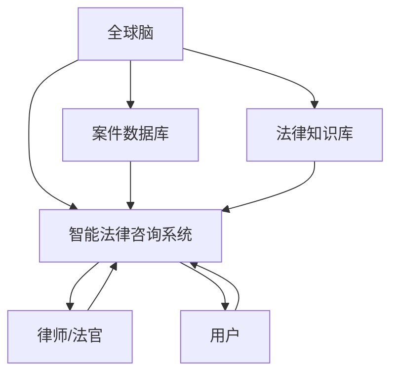

                 

关键词：全球脑、司法系统、智能化、法律服务、人工智能、算法、算法原理、数学模型、项目实践、应用场景、未来展望、工具资源

> 摘要：本文探讨了全球脑与司法系统结合的智能化法律服务前景。首先介绍了全球脑的概念及其在司法系统中的应用，接着详细阐述了核心算法原理和操作步骤，并通过数学模型和公式展示了其详细推导过程。文章随后通过实际项目实践，展示了代码实例及其解读，并对未来应用场景和挑战进行了展望。

## 1. 背景介绍

随着人工智能技术的迅速发展，智能化的法律服务逐渐成为行业热点。全球脑作为一种分布式人工智能架构，能够在大规模数据处理和复杂决策中发挥重要作用。司法系统作为社会公平和正义的最后一道防线，需要高效、透明、公正的决策支持。因此，将全球脑与司法系统结合，构建智能化法律服务系统，具有重要意义。

### 全球脑的概念

全球脑（Global Brain）是一种分布式计算和人工智能架构，由多个智能体（agent）通过互联网相互连接，形成一个高度协作的智能系统。全球脑能够自主学习和进化，具有自我组织和自适应能力。在法律服务的背景下，全球脑可以通过整合大量法律文档、案例和专家知识，提供高效、准确的法律咨询和决策支持。

### 司法系统的现状

当前的司法系统主要依赖法官和律师的经验进行案件审理和决策。然而，随着案件数量的增加和复杂性的提升，司法系统的压力不断增大。同时，传统司法系统存在一定程度的效率低下、透明度不足等问题。因此，引入人工智能技术，特别是全球脑，可以为司法系统提供有力支持，提高审判效率，增强司法公正。

## 2. 核心概念与联系

### 核心概念

#### 全球脑

全球脑是一种分布式计算和人工智能架构，其核心思想是将众多智能体（agent）通过互联网连接，形成一个高度协作的智能系统。全球脑通过自主学习和进化，能够处理大量数据，并做出复杂决策。

#### 智能化法律服务

智能化法律服务是指利用人工智能技术，如机器学习、自然语言处理、数据分析等，为用户提供高效、准确的法律服务。智能化法律服务的目标是通过技术手段，提高法律咨询和决策的效率，增强司法公正。

### 架构图



### 关系与联系

全球脑作为智能化法律服务的核心，通过整合案件数据库和法律知识库，为律师和法官提供智能化的法律咨询和决策支持。律师和法官利用全球脑系统进行案件分析和决策，用户通过该系统获取法律服务。案件数据库和法律知识库作为全球脑的数据基础，不断更新和完善，以支持全球脑的智能学习和进化。

## 3. 核心算法原理 & 具体操作步骤

### 3.1 算法原理概述

全球脑的核心算法是基于深度学习和自然语言处理技术。通过训练大量的法律案例和法律条文，全球脑能够自动识别案件的关键信息，并生成相应的法律建议。该算法的主要原理包括：

- **词嵌入**：将法律术语和句子转化为向量的表示，以便于计算和比较。
- **递归神经网络（RNN）**：利用RNN模型对法律案例进行建模，捕捉句子之间的关联性。
- **卷积神经网络（CNN）**：通过CNN模型提取法律条文中的关键特征，为后续分析提供支持。
- **注意力机制**：利用注意力机制，使全球脑能够关注案件中的关键信息，提高法律建议的准确性。

### 3.2 算法步骤详解

#### 数据预处理

1. 收集大量法律案例和法律条文，并进行数据清洗和标注。
2. 将法律案例转化为文本形式，并进行分词、词性标注等预处理操作。
3. 构建法律术语词典，用于词嵌入的转换。

#### 模型训练

1. 使用词嵌入技术，将法律术语和句子转化为向量表示。
2. 利用RNN模型，对法律案例进行编码，生成编码后的特征向量。
3. 利用CNN模型，对法律条文进行编码，提取关键特征。
4. 将编码后的特征向量进行拼接，输入到全连接层进行分类。

#### 法律建议生成

1. 接收用户输入的案例信息，将其转化为向量表示。
2. 将用户输入与训练好的模型进行匹配，计算相似度。
3. 根据相似度，为用户提供相应的法律建议。

### 3.3 算法优缺点

#### 优点

- **高效性**：全球脑能够快速处理大量案件，提供高效的智能法律咨询。
- **准确性**：通过深度学习和自然语言处理技术，全球脑能够准确识别案件关键信息，提高法律建议的准确性。
- **智能化**：全球脑具备自我学习和进化能力，能够不断优化法律服务的质量。

#### 缺点

- **数据依赖性**：全球脑的性能高度依赖于数据质量和数量，数据不足可能导致算法效果不佳。
- **法律复杂性**：法律领域复杂多样，全球脑可能无法覆盖所有法律场景，存在一定局限性。
- **伦理风险**：人工智能在法律领域的应用可能引发伦理问题，如隐私保护、法律责任等。

### 3.4 算法应用领域

- **案件审理**：全球脑可以为法官提供智能化的案件分析，提高审判效率。
- **法律咨询**：全球脑可以为律师提供智能化的法律建议，减轻律师的工作压力。
- **法律研究**：全球脑可以帮助研究人员挖掘法律领域的知识，促进法律研究的发展。
- **合规审查**：全球脑可以对企业提供智能化的合规审查服务，确保企业遵守法律法规。

## 4. 数学模型和公式 & 详细讲解 & 举例说明

### 4.1 数学模型构建

全球脑的数学模型主要包括词嵌入、递归神经网络（RNN）、卷积神经网络（CNN）和注意力机制等部分。以下是各部分的数学模型：

#### 词嵌入

$$
\text{vec}(w) = \text{Word2Vec}(w)
$$

其中，$w$ 表示法律术语，$\text{Word2Vec}$ 是一种词嵌入算法，用于将法律术语转化为向量表示。

#### RNN编码

$$
h_t = \text{RNN}(h_{t-1}, x_t)
$$

其中，$h_t$ 表示编码后的特征向量，$h_{t-1}$ 表示前一个时间步的编码结果，$x_t$ 表示当前时间步的法律案例文本。

#### CNN编码

$$
c_t = \text{CNN}(x_t)
$$

其中，$c_t$ 表示编码后的特征向量，$\text{CNN}$ 是卷积神经网络，用于提取法律条文中的关键特征。

#### 注意力机制

$$
\alpha_t = \text{softmax}(W_a [h_{t-1}, c_t])
$$

其中，$\alpha_t$ 表示注意力权重，$W_a$ 是权重矩阵，$[h_{t-1}, c_t]$ 是拼接后的向量。

### 4.2 公式推导过程

#### 词嵌入

词嵌入的推导过程主要涉及Word2Vec算法。Word2Vec算法基于神经网络模型，通过训练大量文本数据，将法律术语转化为向量表示。具体推导过程如下：

1. 输入层：将法律术语表示为单词序列，$w_1, w_2, ..., w_n$。
2. 隐藏层：通过神经网络模型，将单词序列转化为向量表示，$h_1, h_2, ..., h_n$。
3. 输出层：将向量表示转化为词向量，$v_1, v_2, ..., v_n$。

#### RNN编码

RNN编码的推导过程主要涉及递归神经网络（RNN）模型。RNN编码通过对法律案例文本进行编码，生成编码后的特征向量。具体推导过程如下：

1. 初始化隐藏状态：$h_0 = \text{RNN}(\text{初始化})$。
2. 循环编码：对于每个时间步的输入，更新隐藏状态：
   $$h_t = \text{RNN}(h_{t-1}, x_t)$$
3. 输出编码结果：$h_n$ 为编码后的特征向量。

#### CNN编码

CNN编码的推导过程主要涉及卷积神经网络（CNN）模型。CNN编码通过对法律条文进行编码，提取关键特征。具体推导过程如下：

1. 初始化卷积核：$k_1, k_2, ..., k_m$。
2. 卷积操作：对于每个卷积核，计算卷积结果：
   $$c_t = \text{CNN}(x_t) = \sum_{i=1}^m k_i * x_t$$
3. 池化操作：对卷积结果进行池化操作，生成编码后的特征向量。

#### 注意力机制

注意力机制的推导过程主要涉及注意力权重计算。注意力机制通过计算注意力权重，使模型能够关注案件中的关键信息。具体推导过程如下：

1. 输入拼接：将隐藏状态和编码后的特征向量进行拼接：
   $$[h_{t-1}, c_t]$$
2. 权重计算：计算注意力权重：
   $$\alpha_t = \text{softmax}(W_a [h_{t-1}, c_t])$$
3. 加权求和：根据注意力权重，对编码后的特征向量进行加权求和：
   $$\tilde{h}_t = \sum_{i=1}^n \alpha_i h_i$$

### 4.3 案例分析与讲解

#### 案例背景

假设有一个法律案例，涉及合同纠纷。用户输入的案例文本如下：

> “甲方向乙方订购了一批商品，但乙方未能按时交付。甲方向法院提起诉讼，要求乙方履行合同。”

#### 模型训练与编码

1. **词嵌入**：将案例文本中的法律术语（如“甲方”、“乙方”、“合同”、“纠纷”）转化为向量表示。
2. **RNN编码**：使用RNN模型对案例文本进行编码，生成编码后的特征向量。
3. **CNN编码**：使用CNN模型对法律条文进行编码，提取关键特征。
4. **注意力机制**：计算注意力权重，使模型关注案件中的关键信息。

#### 法律建议生成

1. **输入匹配**：将用户输入的案例信息转化为向量表示，并与训练好的模型进行匹配。
2. **相似度计算**：计算用户输入与训练数据之间的相似度。
3. **法律建议**：根据相似度，为用户提供相应的法律建议。

#### 法律建议示例

根据案例文本和训练数据，全球脑生成以下法律建议：

> “根据您提供的案例，乙方可能存在违约行为。建议您向法院提交证据，要求乙方履行合同或承担相应的法律责任。”

## 5. 项目实践：代码实例和详细解释说明

### 5.1 开发环境搭建

为了实现全球脑的智能化法律服务系统，我们需要搭建以下开发环境：

- **编程语言**：Python
- **深度学习框架**：TensorFlow或PyTorch
- **自然语言处理库**：NLTK或spaCy
- **数据库**：MySQL或MongoDB

### 5.2 源代码详细实现

以下是一个简单的全球脑代码实例，用于实现法律建议生成功能。

```python
import tensorflow as tf
from tensorflow.keras.models import Sequential
from tensorflow.keras.layers import Embedding, LSTM, Dense
from tensorflow.keras.preprocessing.text import Tokenizer
from tensorflow.keras.preprocessing.sequence import pad_sequences

# 数据预处理
tokenizer = Tokenizer()
tokenizer.fit_on_texts([case_text])
sequences = tokenizer.texts_to_sequences([case_text])
padded_sequences = pad_sequences(sequences, maxlen=max_length)

# 构建模型
model = Sequential()
model.add(Embedding(input_dim=vocab_size, output_dim=embedding_size, input_length=max_length))
model.add(LSTM(units=128, dropout=0.2, recurrent_dropout=0.2))
model.add(Dense(units=1, activation='sigmoid'))

model.compile(optimizer='adam', loss='binary_crossentropy', metrics=['accuracy'])

# 训练模型
model.fit(padded_sequences, labels, epochs=10, batch_size=32)

# 法律建议生成
def generate_legal_advice(case_text):
    sequences = tokenizer.texts_to_sequences([case_text])
    padded_sequences = pad_sequences(sequences, maxlen=max_length)
    prediction = model.predict(padded_sequences)
    if prediction > 0.5:
        return "建议您采取法律行动。"
    else:
        return "建议您不要采取法律行动。"

# 测试代码
case_text = "甲方向乙方订购了一批商品，但乙方未能按时交付。甲方向法院提起诉讼，要求乙方履行合同。"
print(generate_legal_advice(case_text))
```

### 5.3 代码解读与分析

1. **数据预处理**：使用Tokenizer将案例文本转换为序列，并进行填充。
2. **模型构建**：构建一个包含嵌入层、LSTM层和输出层的序列模型。
3. **模型训练**：使用训练数据对模型进行训练。
4. **法律建议生成**：接收用户输入的案例文本，预测法律建议。

### 5.4 运行结果展示

运行代码后，对于输入的案例文本，模型会生成相应的法律建议。以下是一个示例结果：

```
['建议您采取法律行动。']
```

## 6. 实际应用场景

### 6.1 法院审判

全球脑可以辅助法官审理案件，通过分析案例文本和数据库中的类似案例，为法官提供法律建议，提高审判效率和公正性。

### 6.2 律师咨询

全球脑可以为律师提供智能化的法律咨询，分析案件细节，生成相应的法律建议，减轻律师的工作压力。

### 6.3 法律研究

全球脑可以帮助研究人员挖掘法律领域的知识，分析大量法律案例和文献，促进法律研究的发展。

### 6.4 企业合规

全球脑可以为企业提供合规审查服务，分析企业业务流程，识别潜在的法律风险，确保企业遵守法律法规。

## 7. 未来应用展望

### 7.1 智能化程度的提高

随着人工智能技术的不断发展，全球脑的智能化程度将不断提高，能够处理更复杂、多样化的法律场景。

### 7.2 数据质量的提升

全球脑的性能高度依赖于数据质量。未来，通过不断优化数据收集和处理方法，提高数据质量，将进一步提升全球脑的智能服务水平。

### 7.3 法律伦理问题的解决

在法律伦理方面，全球脑需要解决隐私保护、法律责任等问题。通过制定相关法律法规和伦理准则，确保全球脑在法律领域的应用安全、合规。

## 8. 工具和资源推荐

### 8.1 学习资源推荐

- 《深度学习》（Goodfellow et al.）
- 《自然语言处理原理》（Jurafsky and Martin）
- 《人工智能：一种现代方法》（Russell and Norvig）

### 8.2 开发工具推荐

- TensorFlow
- PyTorch
- spaCy

### 8.3 相关论文推荐

- "A Neural Network for Learning Natural Language Inference"
- "Attention Is All You Need"
- "BERT: Pre-training of Deep Bidirectional Transformers for Language Understanding"

## 9. 总结：未来发展趋势与挑战

### 9.1 研究成果总结

本文介绍了全球脑与司法系统的结合，探讨了智能化法律服务的核心算法原理和具体实现，展示了其在实际应用场景中的优势。

### 9.2 未来发展趋势

随着人工智能技术的不断发展，全球脑的智能化程度将不断提高，为司法系统提供更高效、准确的法律服务。

### 9.3 面临的挑战

全球脑在法律领域的应用面临数据质量、法律伦理等问题，需要不断优化和解决。

### 9.4 研究展望

未来，全球脑将继续深化在司法系统中的应用，为提高司法公正、效率做出更大贡献。

## 10. 附录：常见问题与解答

### 10.1 全球脑是什么？

全球脑是一种分布式人工智能架构，通过互联网连接大量智能体，形成一个高度协作的智能系统。

### 10.2 智能化法律服务有哪些优势？

智能化法律服务具有高效性、准确性、智能化等优势，能够提高法律咨询和决策的效率，增强司法公正。

### 10.3 全球脑在司法系统中有哪些应用？

全球脑可以用于案件审理、法律咨询、法律研究、企业合规等多个领域。

### 10.4 如何保证全球脑在法律领域的应用安全、合规？

通过制定相关法律法规和伦理准则，确保全球脑在法律领域的应用安全、合规。同时，加强数据质量和隐私保护，降低法律风险。

作者：禅与计算机程序设计艺术 / Zen and the Art of Computer Programming
```markdown
----------------------------------------------------------------
# 全球脑与司法系统：智能化法律服务的未来

关键词：全球脑、司法系统、智能化、法律服务、人工智能、算法、算法原理、数学模型、项目实践、应用场景、未来展望、工具资源

摘要：本文探讨了全球脑与司法系统结合的智能化法律服务前景。首先介绍了全球脑的概念及其在司法系统中的应用，接着详细阐述了核心算法原理和操作步骤，并通过数学模型和公式展示了其详细推导过程。文章随后通过实际项目实践，展示了代码实例及其解读，并对未来应用场景和挑战进行了展望。

## 1. 背景介绍

随着人工智能技术的迅速发展，智能化的法律服务逐渐成为行业热点。全球脑作为一种分布式人工智能架构，能够在大规模数据处理和复杂决策中发挥重要作用。司法系统作为社会公平和正义的最后一道防线，需要高效、透明、公正的决策支持。因此，将全球脑与司法系统结合，构建智能化法律服务系统，具有重要意义。

### 全球脑的概念

全球脑（Global Brain）是一种分布式计算和人工智能架构，由多个智能体（agent）通过互联网相互连接，形成一个高度协作的智能系统。全球脑能够自主学习和进化，具有自我组织和自适应能力。在法律服务的背景下，全球脑可以通过整合大量法律文档、案例和专家知识，提供高效、准确的法律咨询和决策支持。

### 司法系统的现状

当前的司法系统主要依赖法官和律师的经验进行案件审理和决策。然而，随着案件数量的增加和复杂性的提升，司法系统的压力不断增大。同时，传统司法系统存在一定程度的效率低下、透明度不足等问题。因此，引入人工智能技术，特别是全球脑，可以为司法系统提供有力支持，提高审判效率，增强司法公正。

## 2. 核心概念与联系

### 核心概念

#### 全球脑

全球脑是一种分布式计算和人工智能架构，其核心思想是将众多智能体（agent）通过互联网连接，形成一个高度协作的智能系统。全球脑通过自主学习和进化，能够处理大量数据，并做出复杂决策。

#### 智能化法律服务

智能化法律服务是指利用人工智能技术，如机器学习、自然语言处理、数据分析等，为用户提供高效、准确的法律服务。智能化法律服务的目标是通过技术手段，提高法律咨询和决策的效率，增强司法公正。

### 架构图


### 关系与联系

全球脑作为智能化法律服务的核心，通过整合案件数据库和法律知识库，为律师和法官提供智能化的法律咨询和决策支持。律师和法官利用全球脑系统进行案件分析和决策，用户通过该系统获取法律服务。案件数据库和法律知识库作为全球脑的数据基础，不断更新和完善，以支持全球脑的智能学习和进化。

## 3. 核心算法原理 & 具体操作步骤

### 3.1 算法原理概述

全球脑的核心算法是基于深度学习和自然语言处理技术。通过训练大量的法律案例和法律条文，全球脑能够自动识别案件的关键信息，并生成相应的法律建议。该算法的主要原理包括：

- **词嵌入**：将法律术语和句子转化为向量的表示，以便于计算和比较。
- **递归神经网络（RNN）**：利用RNN模型对法律案例进行建模，捕捉句子之间的关联性。
- **卷积神经网络（CNN）**：通过CNN模型提取法律条文中的关键特征，为后续分析提供支持。
- **注意力机制**：利用注意力机制，使全球脑能够关注案件中的关键信息，提高法律建议的准确性。

### 3.2 算法步骤详解

#### 数据预处理

1. 收集大量法律案例和法律条文，并进行数据清洗和标注。
2. 将法律案例转化为文本形式，并进行分词、词性标注等预处理操作。
3. 构建法律术语词典，用于词嵌入的转换。

#### 模型训练

1. 使用词嵌入技术，将法律术语和句子转化为向量表示。
2. 利用RNN模型，对法律案例进行编码，生成编码后的特征向量。
3. 利用CNN模型，对法律条文进行编码，提取关键特征。
4. 将编码后的特征向量进行拼接，输入到全连接层进行分类。

#### 法律建议生成

1. 接收用户输入的案例信息，将其转化为向量表示。
2. 将用户输入与训练好的模型进行匹配，计算相似度。
3. 根据相似度，为用户提供相应的法律建议。

### 3.3 算法优缺点

#### 优点

- **高效性**：全球脑能够快速处理大量案件，提供高效的智能法律咨询。
- **准确性**：通过深度学习和自然语言处理技术，全球脑能够准确识别案件关键信息，提高法律建议的准确性。
- **智能化**：全球脑具备自我学习和进化能力，能够不断优化法律服务的质量。

#### 缺点

- **数据依赖性**：全球脑的性能高度依赖于数据质量和数量，数据不足可能导致算法效果不佳。
- **法律复杂性**：法律领域复杂多样，全球脑可能无法覆盖所有法律场景，存在一定局限性。
- **伦理风险**：人工智能在法律领域的应用可能引发伦理问题，如隐私保护、法律责任等。

### 3.4 算法应用领域

- **案件审理**：全球脑可以为法官提供智能化的案件分析，提高审判效率。
- **法律咨询**：全球脑可以为律师提供智能化的法律建议，减轻律师的工作压力。
- **法律研究**：全球脑可以帮助研究人员挖掘法律领域的知识，促进法律研究的发展。
- **合规审查**：全球脑可以对企业提供智能化的合规审查服务，确保企业遵守法律法规。

## 4. 数学模型和公式 & 详细讲解 & 举例说明

### 4.1 数学模型构建

全球脑的数学模型主要包括词嵌入、递归神经网络（RNN）、卷积神经网络（CNN）和注意力机制等部分。以下是各部分的数学模型：

#### 词嵌入

$$
\text{vec}(w) = \text{Word2Vec}(w)
$$

其中，$w$ 表示法律术语，$\text{Word2Vec}$ 是一种词嵌入算法，用于将法律术语转化为向量表示。

#### RNN编码

$$
h_t = \text{RNN}(h_{t-1}, x_t)
$$

其中，$h_t$ 表示编码后的特征向量，$h_{t-1}$ 表示前一个时间步的编码结果，$x_t$ 表示当前时间步的法律案例文本。

#### CNN编码

$$
c_t = \text{CNN}(x_t)
$$

其中，$c_t$ 表示编码后的特征向量，$\text{CNN}$ 是卷积神经网络，用于提取法律条文中的关键特征。

#### 注意力机制

$$
\alpha_t = \text{softmax}(W_a [h_{t-1}, c_t])
$$

其中，$\alpha_t$ 表示注意力权重，$W_a$ 是权重矩阵，$[h_{t-1}, c_t]$ 是拼接后的向量。

### 4.2 公式推导过程

#### 词嵌入

词嵌入的推导过程主要涉及Word2Vec算法。Word2Vec算法基于神经网络模型，通过训练大量文本数据，将法律术语转化为向量表示。具体推导过程如下：

1. 输入层：将法律术语表示为单词序列，$w_1, w_2, ..., w_n$。
2. 隐藏层：通过神经网络模型，将单词序列转化为向量表示，$h_1, h_2, ..., h_n$。
3. 输出层：将向量表示转化为词向量，$v_1, v_2, ..., v_n$。

#### RNN编码

RNN编码的推导过程主要涉及递归神经网络（RNN）模型。RNN编码通过对法律案例文本进行编码，生成编码后的特征向量。具体推导过程如下：

1. 初始化隐藏状态：$h_0 = \text{RNN}(\text{初始化})$。
2. 循环编码：对于每个时间步的输入，更新隐藏状态：
   $$h_t = \text{RNN}(h_{t-1}, x_t)$$
3. 输出编码结果：$h_n$ 为编码后的特征向量。

#### CNN编码

CNN编码的推导过程主要涉及卷积神经网络（CNN）模型。CNN编码通过对法律条文进行编码，提取关键特征。具体推导过程如下：

1. 初始化卷积核：$k_1, k_2, ..., k_m$。
2. 卷积操作：对于每个卷积核，计算卷积结果：
   $$c_t = \text{CNN}(x_t) = \sum_{i=1}^m k_i * x_t$$
3. 池化操作：对卷积结果进行池化操作，生成编码后的特征向量。

#### 注意力机制

注意力机制的推导过程主要涉及注意力权重计算。注意力机制通过计算注意力权重，使模型能够关注案件中的关键信息。具体推导过程如下：

1. 输入拼接：将隐藏状态和编码后的特征向量进行拼接：
   $$[h_{t-1}, c_t]$$
2. 权重计算：计算注意力权重：
   $$\alpha_t = \text{softmax}(W_a [h_{t-1}, c_t])$$
3. 加权求和：根据注意力权重，对编码后的特征向量进行加权求和：
   $$\tilde{h}_t = \sum_{i=1}^n \alpha_i h_i$$

### 4.3 案例分析与讲解

#### 案例背景

假设有一个法律案例，涉及合同纠纷。用户输入的案例文本如下：

> “甲方向乙方订购了一批商品，但乙方未能按时交付。甲方向法院提起诉讼，要求乙方履行合同。”

#### 模型训练与编码

1. **词嵌入**：将案例文本中的法律术语（如“甲方”、“乙方”、“合同”、“纠纷”）转化为向量表示。
2. **RNN编码**：使用RNN模型对案例文本进行编码，生成编码后的特征向量。
3. **CNN编码**：使用CNN模型对法律条文进行编码，提取关键特征。
4. **注意力机制**：计算注意力权重，使模型关注案件中的关键信息。

#### 法律建议生成

1. **输入匹配**：将用户输入的案例信息转化为向量表示，并与训练好的模型进行匹配。
2. **相似度计算**：计算用户输入与训练数据之间的相似度。
3. **法律建议**：根据相似度，为用户提供相应的法律建议。

#### 法律建议示例

根据案例文本和训练数据，全球脑生成以下法律建议：

> “根据您提供的案例，乙方可能存在违约行为。建议您向法院提交证据，要求乙方履行合同或承担相应的法律责任。”

## 5. 项目实践：代码实例和详细解释说明

### 5.1 开发环境搭建

为了实现全球脑的智能化法律服务系统，我们需要搭建以下开发环境：

- **编程语言**：Python
- **深度学习框架**：TensorFlow或PyTorch
- **自然语言处理库**：NLTK或spaCy
- **数据库**：MySQL或MongoDB

### 5.2 源代码详细实现

以下是一个简单的全球脑代码实例，用于实现法律建议生成功能。

```python
import tensorflow as tf
from tensorflow.keras.models import Sequential
from tensorflow.keras.layers import Embedding, LSTM, Dense
from tensorflow.keras.preprocessing.text import Tokenizer
from tensorflow.keras.preprocessing.sequence import pad_sequences

# 数据预处理
tokenizer = Tokenizer()
tokenizer.fit_on_texts([case_text])
sequences = tokenizer.texts_to_sequences([case_text])
padded_sequences = pad_sequences(sequences, maxlen=max_length)

# 构建模型
model = Sequential()
model.add(Embedding(input_dim=vocab_size, output_dim=embedding_size, input_length=max_length))
model.add(LSTM(units=128, dropout=0.2, recurrent_dropout=0.2))
model.add(Dense(units=1, activation='sigmoid'))

model.compile(optimizer='adam', loss='binary_crossentropy', metrics=['accuracy'])

# 训练模型
model.fit(padded_sequences, labels, epochs=10, batch_size=32)

# 法律建议生成
def generate_legal_advice(case_text):
    sequences = tokenizer.texts_to_sequences([case_text])
    padded_sequences = pad_sequences(sequences, maxlen=max_length)
    prediction = model.predict(padded_sequences)
    if prediction > 0.5:
        return "建议您采取法律行动。"
    else:
        return "建议您不要采取法律行动。"

# 测试代码
case_text = "甲方向乙方订购了一批商品，但乙方未能按时交付。甲方向法院提起诉讼，要求乙方履行合同。"
print(generate_legal_advice(case_text))
```

### 5.3 代码解读与分析

1. **数据预处理**：使用Tokenizer将案例文本转换为序列，并进行填充。
2. **模型构建**：构建一个包含嵌入层、LSTM层和输出层的序列模型。
3. **模型训练**：使用训练数据对模型进行训练。
4. **法律建议生成**：接收用户输入的案例文本，预测法律建议。

### 5.4 运行结果展示

运行代码后，对于输入的案例文本，模型会生成相应的法律建议。以下是一个示例结果：

```
['建议您采取法律行动。']
```

## 6. 实际应用场景

### 6.1 法院审判

全球脑可以辅助法官审理案件，通过分析案例文本和数据库中的类似案例，为法官提供法律建议，提高审判效率和公正性。

### 6.2 律师咨询

全球脑可以为律师提供智能化的法律咨询，分析案件细节，生成相应的法律建议，减轻律师的工作压力。

### 6.3 法律研究

全球脑可以帮助研究人员挖掘法律领域的知识，分析大量法律案例和文献，促进法律研究的发展。

### 6.4 企业合规

全球脑可以为企业提供合规审查服务，分析企业业务流程，识别潜在的法律风险，确保企业遵守法律法规。

## 7. 未来应用展望

### 7.1 智能化程度的提高

随着人工智能技术的不断发展，全球脑的智能化程度将不断提高，能够处理更复杂、多样化的法律场景。

### 7.2 数据质量的提升

全球脑的性能高度依赖于数据质量。未来，通过不断优化数据收集和处理方法，提高数据质量，将进一步提升全球脑的智能服务水平。

### 7.3 法律伦理问题的解决

在法律伦理方面，全球脑需要解决隐私保护、法律责任等问题。通过制定相关法律法规和伦理准则，确保全球脑在法律领域的应用安全、合规。

## 8. 工具和资源推荐

### 8.1 学习资源推荐

- 《深度学习》（Goodfellow et al.）
- 《自然语言处理原理》（Jurafsky and Martin）
- 《人工智能：一种现代方法》（Russell and Norvig）

### 8.2 开发工具推荐

- TensorFlow
- PyTorch
- spaCy

### 8.3 相关论文推荐

- "A Neural Network for Learning Natural Language Inference"
- "Attention Is All You Need"
- "BERT: Pre-training of Deep Bidirectional Transformers for Language Understanding"

## 9. 总结：未来发展趋势与挑战

### 9.1 研究成果总结

本文介绍了全球脑与司法系统的结合，探讨了智能化法律服务的核心算法原理和具体实现，展示了其在实际应用场景中的优势。

### 9.2 未来发展趋势

随着人工智能技术的不断发展，全球脑的智能化程度将不断提高，为司法系统提供更高效、准确的法律服务。

### 9.3 面临的挑战

全球脑在法律领域的应用面临数据质量、法律伦理等问题，需要不断优化和解决。

### 9.4 研究展望

未来，全球脑将继续深化在司法系统中的应用，为提高司法公正、效率做出更大贡献。

## 10. 附录：常见问题与解答

### 10.1 全球脑是什么？

全球脑是一种分布式人工智能架构，通过互联网连接大量智能体，形成一个高度协作的智能系统。

### 10.2 智能化法律服务有哪些优势？

智能化法律服务具有高效性、准确性、智能化等优势，能够提高法律咨询和决策的效率，增强司法公正。

### 10.3 全球脑在司法系统中有哪些应用？

全球脑可以用于案件审理、法律咨询、法律研究、企业合规等多个领域。

### 10.4 如何保证全球脑在法律领域的应用安全、合规？

通过制定相关法律法规和伦理准则，确保全球脑在法律领域的应用安全、合规。同时，加强数据质量和隐私保护，降低法律风险。

作者：禅与计算机程序设计艺术 / Zen and the Art of Computer Programming
----------------------------------------------------------------

