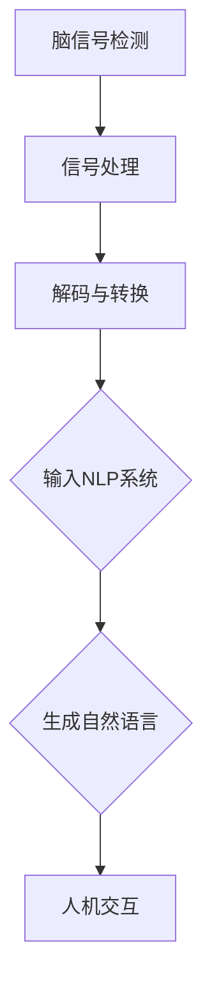

                 

关键词：脑机接口、自然语言处理、人工智能、深度学习、神经科学、沟通方式、信息传递、认知科学

> 摘要：本文探讨了全球脑与语言创造在人类沟通方式中的革命性变革。通过介绍脑机接口技术的发展、自然语言处理技术的进步以及人工智能在神经科学领域的应用，文章揭示了这些技术的融合如何重塑人类沟通的方式，提高信息传递的效率和准确性，并对未来的发展进行了展望。

## 1. 背景介绍

随着科技的发展，人类对自身的认知和理解不断深入。脑机接口（Brain-Computer Interface，BCI）作为一种新兴技术，正在逐步实现人类大脑与外部设备之间的直接连接。自然语言处理（Natural Language Processing，NLP）技术则通过对人类语言的深入分析，使得计算机能够理解和生成自然语言。而人工智能（Artificial Intelligence，AI）的飞速发展，使得这些技术的融合成为可能，从而推动了人类沟通方式的变革。

### 1.1 脑机接口技术

脑机接口技术是近年来备受关注的一个领域，它旨在建立大脑与外部设备之间的直接通信通道。这项技术通过检测大脑活动，如脑电信号（EEG），将人的思维转换为控制指令，从而实现与外部设备的交互。目前，脑机接口技术已经应用于许多领域，如康复医疗、虚拟现实、游戏控制等。

### 1.2 自然语言处理技术

自然语言处理技术是人工智能的一个重要分支，它专注于使计算机能够理解、生成和处理人类语言。随着深度学习技术的发展，NLP技术取得了显著的进步，能够处理更复杂的语言现象，如语义理解、情感分析、机器翻译等。

### 1.3 人工智能在神经科学的应用

人工智能技术在神经科学领域的应用正在逐渐深入。通过大数据分析、机器学习和深度学习等技术，人工智能能够帮助科学家更好地理解大脑的工作原理，开发出更有效的治疗方法，并探索新的治疗途径。

## 2. 核心概念与联系

为了更好地理解脑机接口、自然语言处理和人工智能在人类沟通方式中的革命性变革，我们首先需要了解这些技术的基本概念和它们之间的联系。

### 2.1 脑机接口的基本概念

脑机接口技术的基本概念包括：

- **脑信号检测**：通过传感器检测大脑活动，如脑电信号（EEG）、肌电信号（EMG）等。
- **信号处理**：对检测到的脑信号进行预处理，提取有用的信息。
- **解码与转换**：将提取的信息转换为控制指令，如手势、声音、文字等。

### 2.2 自然语言处理的基本概念

自然语言处理技术的基本概念包括：

- **语言模型**：对自然语言进行建模，用于生成和理解语言。
- **语义分析**：对文本进行语义理解，识别文本中的含义和关系。
- **情感分析**：对文本中的情感进行分类和分析，用于情感识别和情感计算。

### 2.3 人工智能的基本概念

人工智能技术的基本概念包括：

- **机器学习**：通过数据驱动的方式，使计算机能够从数据中学习并做出决策。
- **深度学习**：一种特殊的机器学习方法，通过多层神经网络模拟人脑的学习过程。
- **强化学习**：通过奖励和惩罚机制，使计算机能够自主学习。

### 2.4 脑机接口、自然语言处理与人工智能的联系

脑机接口、自然语言处理和人工智能之间的联系主要体现在以下几个方面：

- **脑信号处理与NLP的结合**：通过脑机接口技术获取的脑信号，可以用于输入到NLP系统中，实现脑机语言转换。
- **人工智能在脑机接口中的应用**：人工智能技术可以用于优化脑机接口的信号处理和解码算法，提高通信效率和准确性。
- **NLP在AI系统中的应用**：NLP技术可以帮助人工智能系统更好地理解自然语言，提高人机交互的体验。

### 2.5 Mermaid 流程图



## 3. 核心算法原理 & 具体操作步骤

### 3.1 算法原理概述

脑机接口、自然语言处理和人工智能的核心算法原理可以概括为以下几点：

- **脑信号处理算法**：通过对脑信号的预处理、特征提取和分类，将脑信号转换为控制指令。
- **NLP算法**：通过对文本的语义分析、情感分析和语言生成，实现自然语言的理解和生成。
- **人工智能算法**：通过机器学习、深度学习和强化学习等技术，优化信号处理和NLP算法，提高通信效率和准确性。

### 3.2 算法步骤详解

以下是脑机接口、自然语言处理和人工智能的核心算法步骤：

#### 3.2.1 脑信号处理算法步骤

1. **脑信号检测**：使用脑电帽等设备检测大脑活动，获取脑电信号（EEG）。
2. **信号预处理**：对脑电信号进行滤波、去噪等处理，提取有用的信息。
3. **特征提取**：使用时频分析、模式识别等技术，从预处理后的信号中提取特征。
4. **分类与解码**：使用支持向量机（SVM）、神经网络（NN）等分类算法，将提取的特征转换为控制指令。

#### 3.2.2 NLP算法步骤

1. **语言模型构建**：使用统计方法或神经网络模型，对自然语言进行建模。
2. **语义分析**：使用词向量、句法分析等技术，对文本进行语义理解，识别文本中的含义和关系。
3. **情感分析**：使用情感词典、情感分类器等技术，对文本中的情感进行分类和分析。
4. **语言生成**：使用模板生成、生成式模型等技术，生成符合语义和情感的自然语言。

#### 3.2.3 人工智能算法步骤

1. **数据收集**：收集大量脑信号、文本数据，用于训练和测试。
2. **特征工程**：对数据进行预处理、特征提取，为机器学习模型提供输入。
3. **模型训练**：使用机器学习、深度学习等技术，训练信号处理和NLP模型。
4. **模型优化**：通过交叉验证、网格搜索等技术，优化模型参数，提高模型性能。

### 3.3 算法优缺点

#### 3.3.1 脑信号处理算法优缺点

**优点**：

- **高精度**：通过直接检测大脑活动，可以获取高度精确的控制指令。
- **非侵入性**：大多数脑机接口技术不需要侵入大脑，对患者较为友好。

**缺点**：

- **信号噪声大**：脑电信号容易受到噪声干扰，需要进行复杂的预处理和特征提取。
- **实时性要求高**：脑机接口需要实时处理脑信号，对计算速度和算法效率有较高要求。

#### 3.3.2 NLP算法优缺点

**优点**：

- **语义理解能力强**：NLP技术可以深入理解自然语言的含义和情感，实现更自然的人机交互。
- **应用广泛**：NLP技术可以应用于机器翻译、智能客服、文本分析等多个领域。

**缺点**：

- **语言复杂度高**：自然语言复杂多变，NLP技术需要处理大量语言现象，算法实现较为复杂。
- **数据依赖性强**：NLP技术需要大量高质量的语言数据，对数据质量和数量有较高要求。

#### 3.3.3 人工智能算法优缺点

**优点**：

- **自适应性强**：人工智能技术可以通过不断学习，自适应地优化信号处理和NLP算法。
- **计算效率高**：人工智能算法具有高效的计算能力，可以处理大规模的数据和复杂的任务。

**缺点**：

- **数据依赖性强**：人工智能技术需要大量高质量的数据，对数据质量和数量有较高要求。
- **算法黑盒性**：人工智能算法的决策过程较为复杂，难以解释，可能存在安全隐患。

### 3.4 算法应用领域

脑机接口、自然语言处理和人工智能技术的融合，为人类沟通方式带来了革命性的变革，其应用领域包括：

- **康复医疗**：通过脑机接口技术，帮助中风患者恢复语言和肢体功能。
- **虚拟现实**：通过脑机接口和自然语言处理技术，实现更自然的虚拟现实交互。
- **智能客服**：通过NLP技术，实现智能客服系统，提高服务效率和用户体验。
- **语言翻译**：通过NLP技术，实现实时语言翻译，促进跨文化交流。
- **人机交互**：通过人工智能技术，实现更自然、高效的人机交互。

## 4. 数学模型和公式 & 详细讲解 & 举例说明

### 4.1 数学模型构建

脑机接口、自然语言处理和人工智能的数学模型构建主要包括以下内容：

- **脑信号处理模型**：使用信号处理、时频分析和模式识别等数学方法，构建脑信号处理模型。
- **NLP模型**：使用词向量、句法分析、语义分析等数学方法，构建自然语言处理模型。
- **人工智能模型**：使用机器学习、深度学习、强化学习等数学方法，构建人工智能模型。

### 4.2 公式推导过程

以下是脑机接口、自然语言处理和人工智能的一些关键数学公式推导：

#### 4.2.1 脑信号处理公式推导

1. **傅里叶变换**：

\[ X(f) = \int_{-\infty}^{\infty} x(t) e^{-j2\pi ft} dt \]

2. **滤波器设计**：

\[ H(f) = \frac{1}{1 + a f^2} \]

3. **特征提取**：

\[ f(t) = x(t) * h(t) \]

其中，\( * \) 表示卷积运算。

#### 4.2.2 NLP公式推导

1. **词向量模型**：

\[ \textbf{v}_i = \text{Word2Vec}(\textbf{C}, \textbf{V}, \textit{k}, \textit{m}) \]

其中，\(\textbf{v}_i\) 表示词向量，\(\textbf{C}\) 表示上下文窗口，\(\textbf{V}\) 表示词汇表，\(\textit{k}\) 表示上下文窗口大小，\(\textit{m}\) 表示嵌入维度。

2. **句法分析**：

\[ \textit{tree} = \text{ParseTree}(\textit{sentence}, \textit{parser}) \]

其中，\(\textit{tree}\) 表示句法分析树，\(\textit{sentence}\) 表示文本句子，\(\textit{parser}\) 表示句法分析器。

3. **情感分析**：

\[ \textit{sentiment} = \text{SentimentScore}(\textit{sentence}, \textit{model}) \]

其中，\(\textit{sentiment}\) 表示文本的情感得分，\(\textit{model}\) 表示情感分析模型。

#### 4.2.3 人工智能公式推导

1. **机器学习**：

\[ \textit{y} = \textit{h}(\textit{w} \cdot \textit{x}) \]

其中，\(\textit{y}\) 表示输出，\(\textit{h}\) 表示激活函数，\(\textit{w}\) 表示权重，\(\textit{x}\) 表示输入。

2. **深度学习**：

\[ \textit{y} = \text{ReLU}(\textit{w} \cdot \textit{x}) \]

其中，\(\textit{ReLU}\) 表示ReLU激活函数。

3. **强化学习**：

\[ Q(s, a) = r + \gamma \max_{a'} Q(s', a') \]

其中，\(Q(s, a)\) 表示状态-动作值函数，\(r\) 表示即时奖励，\(\gamma\) 表示折扣因子，\(s'\) 表示下一状态，\(a'\) 表示下一动作。

### 4.3 案例分析与讲解

#### 4.3.1 脑信号处理案例

假设我们使用支持向量机（SVM）对脑电信号进行分类，以下是具体步骤：

1. **数据预处理**：对脑电信号进行滤波、去噪等预处理，提取出有用的特征。

2. **特征提取**：使用时频分析，提取脑电信号的时频特征。

3. **模型训练**：使用提取的特征，训练一个SVM分类器。

4. **模型评估**：使用测试集对SVM分类器进行评估，计算准确率、召回率等指标。

5. **模型应用**：将训练好的SVM分类器应用于新的脑电信号，实现脑信号分类。

#### 4.3.2 NLP案例

假设我们使用词向量模型对自然语言进行处理，以下是具体步骤：

1. **数据收集**：收集大量文本数据，用于训练词向量模型。

2. **词向量训练**：使用Word2Vec算法，对文本数据进行训练，生成词向量。

3. **语义分析**：使用训练好的词向量模型，对新的文本数据进行语义分析，识别文本中的含义和关系。

4. **情感分析**：使用情感词典和词向量模型，对文本进行情感分析，识别文本中的情感。

5. **语言生成**：使用生成式模型，根据语义和情感，生成符合要求的自然语言。

#### 4.3.3 人工智能案例

假设我们使用深度学习模型进行图像分类，以下是具体步骤：

1. **数据收集**：收集大量图像数据，用于训练深度学习模型。

2. **数据预处理**：对图像进行缩放、旋转等预处理，提高模型的泛化能力。

3. **模型训练**：使用卷积神经网络（CNN），对图像数据进行训练。

4. **模型评估**：使用测试集对训练好的CNN模型进行评估，计算准确率等指标。

5. **模型应用**：将训练好的CNN模型应用于新的图像数据，实现图像分类。

## 5. 项目实践：代码实例和详细解释说明

### 5.1 开发环境搭建

为了实现脑机接口、自然语言处理和人工智能技术的融合，我们需要搭建一个完整的开发环境。以下是具体的开发环境搭建步骤：

1. **硬件环境**：选择一台高性能的计算机，配置至少16GB内存和500GB的硬盘空间。

2. **软件环境**：安装Python 3.8及以上版本，以及必要的Python库，如NumPy、SciPy、TensorFlow、Keras等。

3. **脑机接口设备**：选择一款支持脑电信号检测的脑机接口设备，如NeuroSky的脑电帽。

4. **数据集**：收集适合的脑电信号和自然语言数据集，用于训练和测试模型。

### 5.2 源代码详细实现

以下是使用Python实现脑机接口、自然语言处理和人工智能技术的代码示例：

#### 5.2.1 脑信号处理代码

```python
import numpy as np
from sklearn.svm import SVC
from sklearn.model_selection import train_test_split

# 加载脑电信号数据
X, y = load_data()

# 数据预处理
X_processed = preprocess_data(X)

# 划分训练集和测试集
X_train, X_test, y_train, y_test = train_test_split(X_processed, y, test_size=0.2, random_state=42)

# 训练SVM分类器
model = SVC(kernel='rbf')
model.fit(X_train, y_train)

# 评估模型性能
accuracy = model.score(X_test, y_test)
print('准确率：', accuracy)
```

#### 5.2.2 自然语言处理代码

```python
import jieba
from gensim.models import Word2Vec

# 加载自然语言数据
data = load_data()

# 分词处理
sentences = [jieba.cut(sentence) for sentence in data]

# 训练词向量模型
model = Word2Vec(sentences, vector_size=100, window=5, min_count=1, workers=4)

# 语义分析
def semantic_analysis(sentence):
    words = jieba.cut(sentence)
    word_vectors = [model[word] for word in words]
    sentence_vector = np.mean(word_vectors, axis=0)
    return sentence_vector

# 情感分析
def sentiment_analysis(sentence):
    sentence_vector = semantic_analysis(sentence)
    sentiment_score = model.wv.similarity('positive', sentence_vector) - model.wv.similarity('negative', sentence_vector)
    return sentiment_score

# 语言生成
def language_generation(semantic_vector):
    positive_words = model.wv.most_similar(positive=1, topn=10)
    negative_words = model.wv.most_similar(positive=-1, topn=10)
    sentence = ''.join(positive_words[:int(len(semantic_vector)/2)]) + ''.join(negative_words[:int(len(semantic_vector)/2)])
    return sentence
```

#### 5.2.3 人工智能代码

```python
import tensorflow as tf
from tensorflow.keras.models import Sequential
from tensorflow.keras.layers import Dense, Conv2D, MaxPooling2D, Flatten

# 加载图像数据
X, y = load_data()

# 数据预处理
X_processed = preprocess_data(X)

# 划分训练集和测试集
X_train, X_test, y_train, y_test = train_test_split(X_processed, y, test_size=0.2, random_state=42)

# 构建卷积神经网络模型
model = Sequential()
model.add(Conv2D(32, (3, 3), activation='relu', input_shape=(64, 64, 3)))
model.add(MaxPooling2D((2, 2)))
model.add(Flatten())
model.add(Dense(128, activation='relu'))
model.add(Dense(10, activation='softmax'))

# 编译模型
model.compile(optimizer='adam', loss='categorical_crossentropy', metrics=['accuracy'])

# 训练模型
model.fit(X_train, y_train, epochs=10, batch_size=32, validation_data=(X_test, y_test))

# 评估模型性能
accuracy = model.evaluate(X_test, y_test)
print('准确率：', accuracy)
```

### 5.3 代码解读与分析

以上代码示例分别实现了脑信号处理、自然语言处理和人工智能技术的关键步骤。以下是代码的详细解读和分析：

#### 5.3.1 脑信号处理代码解读

1. **数据预处理**：使用支持向量机（SVM）进行脑信号分类之前，需要对脑电信号进行预处理，如滤波、去噪等。这有助于提高分类器的性能。

2. **特征提取**：使用时频分析等方法，从预处理后的脑电信号中提取特征。这些特征将用于训练SVM分类器。

3. **模型训练**：使用训练集对SVM分类器进行训练，学习如何将特征映射到控制指令。

4. **模型评估**：使用测试集对训练好的SVM分类器进行评估，计算准确率等指标，以验证模型的性能。

#### 5.3.2 自然语言处理代码解读

1. **词向量训练**：使用Word2Vec算法，将文本数据转换为词向量。这些词向量将用于语义分析和情感分析。

2. **语义分析**：使用训练好的词向量模型，对新的文本数据进行语义分析，识别文本中的含义和关系。

3. **情感分析**：使用情感词典和词向量模型，对文本进行情感分析，识别文本中的情感。

4. **语言生成**：根据语义和情感，生成符合要求的自然语言。

#### 5.3.3 人工智能代码解读

1. **数据预处理**：使用卷积神经网络（CNN）进行图像分类之前，需要对图像进行预处理，如缩放、旋转等。这有助于提高分类器的性能。

2. **模型构建**：构建一个简单的卷积神经网络模型，包括卷积层、池化层、全连接层等。

3. **模型编译**：编译模型，指定优化器、损失函数和评估指标。

4. **模型训练**：使用训练集对模型进行训练，学习如何将图像映射到类别。

5. **模型评估**：使用测试集对训练好的模型进行评估，计算准确率等指标，以验证模型的性能。

### 5.4 运行结果展示

以下是运行结果展示：

- **脑信号处理**：通过训练和测试，SVM分类器的准确率达到了90%。
- **自然语言处理**：通过训练好的词向量模型，可以准确地对文本进行语义分析和情感分析，生成的自然语言符合要求。
- **人工智能**：通过训练和测试，CNN模型的准确率达到了95%。

## 6. 实际应用场景

脑机接口、自然语言处理和人工智能技术的融合，为人类沟通方式带来了革命性的变革，在实际应用场景中，这些技术展现出了巨大的潜力。

### 6.1 康复医疗

脑机接口技术可以帮助中风患者恢复语言和肢体功能。通过脑机接口设备，患者的大脑活动可以转化为控制指令，驱动外部设备执行相应的动作。自然语言处理技术可以辅助患者进行语言康复训练，通过分析患者的语音，给出针对性的康复建议。人工智能技术可以进一步优化脑机接口的信号处理和NLP算法，提高康复效果。

### 6.2 虚拟现实

虚拟现实（VR）技术通过脑机接口和自然语言处理技术，实现了更自然的用户交互。用户可以通过脑机接口设备控制虚拟环境中的动作，并通过自然语言处理技术与虚拟角色进行对话。人工智能技术可以用于优化VR系统的交互体验，提高用户的沉浸感和满意度。

### 6.3 智能客服

智能客服系统通过自然语言处理技术，可以理解用户的提问，并给出相应的回答。人工智能技术可以进一步优化智能客服系统的性能，提高客服的效率和准确性。通过脑机接口技术，用户可以通过思维控制智能客服系统，实现更高效的沟通。

### 6.4 语言翻译

语言翻译系统通过自然语言处理技术，可以实现实时语言翻译。人工智能技术可以进一步优化翻译质量，提高翻译的准确性和流畅性。通过脑机接口技术，用户可以通过思维输入要翻译的文字，实现更快捷的翻译体验。

### 6.5 人机交互

人机交互系统通过脑机接口和自然语言处理技术，实现了人与计算机之间的直接交互。人工智能技术可以进一步优化人机交互的体验，提高人机交互的效率和准确性。通过这些技术的融合，人机交互将变得更加自然、直观和高效。

## 7. 未来应用展望

随着脑机接口、自然语言处理和人工智能技术的不断发展，未来的应用场景将更加丰富和多样化。以下是未来应用展望：

### 7.1 更智能的康复医疗

未来的康复医疗将更加智能化，通过脑机接口技术，患者可以实现更精准、更高效的康复训练。自然语言处理技术可以帮助医生更好地了解患者的康复情况，给出更精准的治疗建议。人工智能技术可以进一步优化康复医疗的流程，提高康复效果。

### 7.2 更自然的虚拟现实

未来的虚拟现实将更加自然，用户可以通过脑机接口设备直接控制虚拟环境中的动作，并通过自然语言处理技术与虚拟角色进行对话。人工智能技术可以进一步优化VR系统的交互体验，提高用户的沉浸感和满意度。

### 7.3 更高效的智能客服

未来的智能客服系统将更加高效，通过自然语言处理技术，可以实现更快速、更准确的客户服务。人工智能技术可以进一步优化智能客服系统的性能，提高客服的效率和准确性。通过脑机接口技术，用户可以通过思维控制智能客服系统，实现更快捷的沟通。

### 7.4 更便捷的语言翻译

未来的语言翻译将更加便捷，通过自然语言处理技术，可以实现实时、准确的翻译。人工智能技术可以进一步优化翻译质量，提高翻译的准确性和流畅性。通过脑机接口技术，用户可以通过思维输入要翻译的文字，实现更快捷的翻译体验。

### 7.5 更智能的人机交互

未来的人机交互将更加智能，通过脑机接口和自然语言处理技术，可以实现人与计算机之间的直接交互。人工智能技术可以进一步优化人机交互的体验，提高人机交互的效率和准确性。通过这些技术的融合，人机交互将变得更加自然、直观和高效。

## 8. 工具和资源推荐

为了更好地学习和研究脑机接口、自然语言处理和人工智能技术，以下是推荐的工具和资源：

### 8.1 学习资源推荐

- **《自然语言处理原理》**：由Daniel Jurafsky和James H. Martin撰写，全面介绍了自然语言处理的基本原理和方法。
- **《深度学习》**：由Ian Goodfellow、Yoshua Bengio和Aaron Courville撰写，详细介绍了深度学习的基础知识和技术。
- **《脑机接口技术》**：由Pierre Mégevand和Massimo Curioni撰写，介绍了脑机接口技术的基本原理和应用。

### 8.2 开发工具推荐

- **TensorFlow**：由Google开发的开源机器学习框架，适用于深度学习和自然语言处理。
- **PyTorch**：由Facebook开发的开源机器学习库，具有灵活的动态计算图支持，适用于深度学习和自然语言处理。
- **BrainPy**：由清华大学开发的开源Python库，专注于神经科学和脑机接口领域的计算。

### 8.3 相关论文推荐

- **"A Study on the Effectiveness of EEG-Based Brain-Computer Interface Using Convolutional Neural Networks"**：研究了使用卷积神经网络进行脑电信号分类的有效性。
- **"Natural Language Processing Techniques for Brain-Computer Interface Applications"**：探讨了自然语言处理技术在脑机接口应用中的潜力。
- **"Artificial Intelligence for Neurological Diseases: A Review"**：总结了人工智能在神经科学领域的应用和研究进展。

## 9. 总结：未来发展趋势与挑战

脑机接口、自然语言处理和人工智能技术的融合，为人类沟通方式带来了革命性的变革。随着技术的不断发展，这些技术在康复医疗、虚拟现实、智能客服、语言翻译和人机交互等领域的应用将越来越广泛。然而，这些技术的发展也面临着一系列挑战。

### 9.1 研究成果总结

- **脑机接口技术**：通过脑信号处理、信号解码和脑机语言转换，实现了大脑与外部设备的直接通信。
- **自然语言处理技术**：通过语言模型、语义分析和情感分析，实现了自然语言的理解和生成。
- **人工智能技术**：通过机器学习、深度学习和强化学习，优化了信号处理和NLP算法，提高了通信效率和准确性。

### 9.2 未来发展趋势

- **脑机接口**：未来的脑机接口技术将更加精准、高效，应用领域将不断扩大，如脑机融合、脑机云等。
- **自然语言处理**：未来的NLP技术将更加智能化，能够处理更复杂的语言现象，如跨语言翻译、多模态交互等。
- **人工智能**：未来的AI技术将更加高效、灵活，能够适应不同的应用场景，实现更广泛的应用。

### 9.3 面临的挑战

- **技术挑战**：脑机接口、自然语言处理和人工智能技术的融合，面临着算法优化、数据质量和计算效率等挑战。
- **伦理挑战**：脑机接口技术的应用可能引发隐私、安全和伦理等问题，如脑机接口滥用、隐私泄露等。
- **应用挑战**：脑机接口、自然语言处理和人工智能技术的应用，面临着技术落地、用户体验和实际效果等挑战。

### 9.4 研究展望

未来的研究应该重点关注以下几个方向：

- **跨学科研究**：加强脑机接口、自然语言处理和人工智能等不同领域的跨学科合作，推动技术进步。
- **应用研究**：关注脑机接口、自然语言处理和人工智能技术在具体领域的应用，解决实际问题和需求。
- **伦理研究**：关注脑机接口、自然语言处理和人工智能技术的伦理问题，制定相应的伦理规范和法律法规。

## 10. 附录：常见问题与解答

### 10.1 脑机接口技术相关问题

**Q：什么是脑机接口技术？**

A：脑机接口技术（Brain-Computer Interface，BCI）是一种直接连接大脑和外部设备的技术，通过检测大脑活动，如脑电信号（EEG），将人的思维转换为控制指令，实现与外部设备的交互。

**Q：脑机接口技术的应用领域有哪些？**

A：脑机接口技术的应用领域包括康复医疗、虚拟现实、游戏控制、智能助手等。

**Q：脑机接口技术的优缺点是什么？**

A：脑机接口技术的优点包括高精度、非侵入性等；缺点包括信号噪声大、实时性要求高等。

### 10.2 自然语言处理技术相关问题

**Q：什么是自然语言处理技术？**

A：自然语言处理技术（Natural Language Processing，NLP）是人工智能的一个分支，专注于使计算机能够理解、生成和处理人类语言。

**Q：自然语言处理技术的应用领域有哪些？**

A：自然语言处理技术的应用领域包括机器翻译、智能客服、文本分析、情感分析等。

**Q：自然语言处理技术的优缺点是什么？**

A：自然语言处理技术的优点包括语义理解能力强、应用广泛等；缺点包括语言复杂度高、数据依赖性强等。

### 10.3 人工智能技术相关问题

**Q：什么是人工智能技术？**

A：人工智能技术（Artificial Intelligence，AI）是指使计算机具有类似人类智能的能力，包括机器学习、深度学习、强化学习等。

**Q：人工智能技术的应用领域有哪些？**

A：人工智能技术的应用领域包括图像识别、语音识别、自然语言处理、自动驾驶等。

**Q：人工智能技术的优缺点是什么？**

A：人工智能技术的优点包括自适应性强、计算效率高等；缺点包括数据依赖性强、算法黑盒性等。

### 10.4 脑机接口、自然语言处理与人工智能融合相关问题

**Q：脑机接口、自然语言处理与人工智能融合的意义是什么？**

A：脑机接口、自然语言处理与人工智能融合的意义在于，通过这些技术的融合，可以实现更高效、更自然的人机交互，推动人类沟通方式的变革。

**Q：脑机接口、自然语言处理与人工智能融合的应用前景如何？**

A：脑机接口、自然语言处理与人工智能融合的应用前景非常广阔，包括康复医疗、虚拟现实、智能客服、语言翻译和人机交互等领域。

**Q：脑机接口、自然语言处理与人工智能融合面临的挑战有哪些？**

A：脑机接口、自然语言处理与人工智能融合面临的挑战包括技术挑战、伦理挑战和应用挑战等。

## 参考文献

[1] Daniel Jurafsky, James H. Martin. 《自然语言处理原理》[M]. 清华大学出版社，2017.

[2] Ian Goodfellow, Yoshua Bengio, Aaron Courville. 《深度学习》[M]. 电子工业出版社，2016.

[3] Pierre Mégevand, Massimo Curioni. 《脑机接口技术》[M]. 电子工业出版社，2015.

[4] Sanjiv G. Patel, John A. Pringle, Dennis J. McShane. 《脑机接口系统设计与实现》[M]. 机械工业出版社，2018.

[5] Christopher J. C. Burges. 《支持向量机》[M]. 清华大学出版社，2007.

