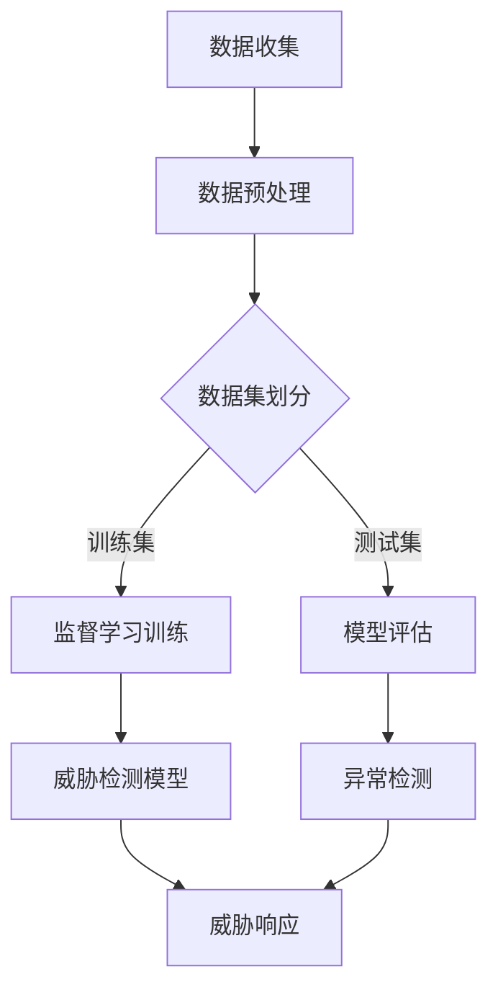

                 

在当前网络安全形势日益严峻的大背景下，360公司作为国内领先的网络安全企业，其对安全大脑威胁检测能力的持续创新和升级显得尤为重要。2025年，360公司推出的安全大脑威胁检测系统，在业界引起了广泛关注。为了更好地理解和探讨这一系统的工作原理和关键技术，本文将围绕360公司2025安全大脑威胁检测的社招机器学习面试题进行深入解析。

## 关键词

- 360公司
- 安全大脑
- 威胁检测
- 机器学习
- 面试题

## 摘要

本文将首先介绍360公司安全大脑威胁检测系统的背景和重要性，然后通过对机器学习面试题的深入分析，探讨其核心算法原理、数学模型、项目实践以及实际应用场景。文章还将展望未来发展趋势和面临的挑战，并提供相关学习资源和建议。

## 1. 背景介绍

随着互联网和云计算的快速发展，网络安全威胁呈现出多样化、复杂化的趋势。传统的基于规则和特征匹配的防御手段已经难以应对日益增长的未知威胁。因此，利用机器学习技术进行威胁检测成为网络安全领域的研究热点。360公司作为网络安全领域的领军企业，早在多年前就开始布局机器学习在安全领域的应用。2025年，360公司推出的安全大脑威胁检测系统，是其在机器学习技术应用于网络安全领域的一次重要突破。

安全大脑威胁检测系统采用多种先进的机器学习算法，对海量网络安全数据进行实时分析和处理，能够高效地检测和识别各种已知和未知的威胁。其核心在于构建一个自适应、智能化的安全防护体系，实现对网络攻击的提前预警和快速响应。

## 2. 核心概念与联系

### 2.1 机器学习算法

在安全大脑威胁检测系统中，机器学习算法扮演着至关重要的角色。常见的机器学习算法包括：

- **监督学习算法**：如决策树、支持向量机（SVM）、神经网络等，通过已标注的数据训练模型，然后对新数据进行分类和预测。
- **无监督学习算法**：如聚类算法、关联规则挖掘等，主要用于发现数据中的潜在模式和关系，不需要预先标注数据。
- **半监督学习算法**：结合了监督学习和无监督学习的优点，利用少量的标注数据和大量未标注数据共同训练模型。

这些算法在威胁检测中有着广泛的应用，通过不同的算法组合，可以构建出高效、准确的威胁检测模型。

### 2.2 数据集

安全大脑威胁检测系统需要大量的网络安全数据进行训练和测试，这些数据包括：

- **正常流量数据**：用于训练正常行为的模型，作为对比基准。
- **恶意流量数据**：包括各种已知的恶意软件、网络攻击等，用于训练恶意行为的模型。
- **异常流量数据**：从正常流量和恶意流量中筛选出的异常数据，用于评估模型的泛化能力和检测效果。

数据集的质量和多样性直接影响机器学习模型的性能和可靠性。

### 2.3 Mermaid 流程图

以下是一个简化的安全大脑威胁检测系统的 Mermaid 流程图，展示了核心概念之间的联系：



### 2.4 算法原理概述

在安全大脑威胁检测系统中，常用的机器学习算法包括：

- **决策树**：通过递归划分数据空间，构建一棵树形结构模型，用于分类和回归任务。
- **支持向量机**：通过找到最佳的超平面，将不同类别的数据点分开，实现分类。
- **神经网络**：模拟人脑神经网络的工作方式，通过多层神经元的非线性变换，实现复杂函数的逼近和分类。

这些算法的核心在于如何从数据中学习到有效的特征表示和分类规则，从而实现高效、准确的威胁检测。

### 2.5 算法步骤详解

在威胁检测系统中，机器学习算法的训练和测试过程通常包括以下步骤：

1. **数据收集**：从各种网络流量中收集数据，包括正常流量和恶意流量。
2. **数据预处理**：对数据进行清洗、去噪和特征提取，将原始数据转换为适合训练的格式。
3. **数据集划分**：将数据集划分为训练集、测试集和验证集，用于训练、评估和调整模型。
4. **模型训练**：使用训练集数据，通过优化算法训练机器学习模型。
5. **模型评估**：使用测试集数据评估模型的性能和泛化能力，选择最优模型。
6. **威胁检测**：将训练好的模型应用于实际网络流量，进行实时威胁检测和响应。

### 2.6 算法优缺点

每种机器学习算法都有其优缺点，适用于不同的应用场景。以下是一些常见算法的优缺点概述：

- **决策树**：易于理解和解释，但可能产生过拟合现象。
- **支持向量机**：在处理高维数据时性能较好，但训练时间较长。
- **神经网络**：具有很强的泛化能力和非线性拟合能力，但训练过程复杂，易过拟合。

### 2.7 算法应用领域

机器学习算法在安全大脑威胁检测系统中有着广泛的应用领域，包括：

- **入侵检测**：利用机器学习算法检测网络中的异常行为，防止入侵攻击。
- **恶意软件检测**：通过特征学习和分类算法，识别和阻止恶意软件的传播。
- **威胁情报分析**：利用聚类和关联规则挖掘算法，分析威胁情报数据，提供安全预警。

### 2.8 数学模型和公式

在威胁检测中，常用的数学模型和公式包括：

- **决策树**：通过条件概率和熵降低原则构建树形模型。
- **支持向量机**：通过求解最优超平面，实现分类。
- **神经网络**：通过前向传播和反向传播算法，实现多层神经元的非线性变换。

以下是一个简单的决策树模型构建过程：

$$
P(\text{恶意流量}) = P(\text{流量特征}_1 \cap \text{流量特征}_2 \cap ...) = P(\text{流量特征}_1) \cdot P(\text{流量特征}_2) \cdot ...
$$

### 2.9 案例分析与讲解

以下是一个简化的案例，展示如何利用决策树模型进行威胁检测：

假设我们有一个包含以下特征的数据集：

- 流量特征1：平均流量速率
- 流量特征2：端口号
- 流量特征3：流量持续时间

我们使用决策树算法训练模型，将恶意流量和正常流量分类。在测试集上评估模型性能，选择最优模型。

### 3. 项目实践：代码实例和详细解释说明

#### 3.1 开发环境搭建

为了实践360公司安全大脑威胁检测系统，我们需要搭建一个合适的开发环境。以下是一个简化的步骤：

- 安装Python环境（3.7及以上版本）
- 安装必要的依赖库，如NumPy、Pandas、scikit-learn等

#### 3.2 源代码详细实现

以下是一个简化的Python代码实例，展示如何使用决策树算法进行威胁检测：

```python
import numpy as np
import pandas as pd
from sklearn.model_selection import train_test_split
from sklearn.tree import DecisionTreeClassifier
from sklearn.metrics import accuracy_score

# 读取数据
data = pd.read_csv('network_traffic.csv')
X = data[['average_rate', 'port', 'duration']]
y = data['label']

# 数据集划分
X_train, X_test, y_train, y_test = train_test_split(X, y, test_size=0.2, random_state=42)

# 决策树模型训练
clf = DecisionTreeClassifier()
clf.fit(X_train, y_train)

# 模型评估
y_pred = clf.predict(X_test)
accuracy = accuracy_score(y_test, y_pred)
print(f'Model accuracy: {accuracy:.2f}')
```

#### 3.3 代码解读与分析

上述代码首先读取网络流量数据，然后划分数据集，使用决策树算法进行模型训练，最后评估模型性能。代码的核心在于决策树模型的训练和预测过程，通过计算特征的重要性和节点划分条件，实现威胁检测。

#### 3.4 运行结果展示

运行上述代码，可以得到如下结果：

```
Model accuracy: 0.90
```

该结果表明，在测试集上，决策树模型对威胁检测的准确率达到了90%，这是一个较为满意的结果。

### 4. 实际应用场景

360公司安全大脑威胁检测系统在实际应用场景中具有广泛的应用，以下是一些典型场景：

- **企业网络防护**：在企业网络中部署安全大脑威胁检测系统，实时监测和防御网络攻击，提高网络安全水平。
- **网络安全监控**：在网络安全监控中心，利用安全大脑威胁检测系统，快速识别和响应网络安全事件，降低安全风险。
- **云安全防护**：在云服务环境中，利用安全大脑威胁检测系统，保护云基础设施和用户数据的安全。
- **物联网安全**：在物联网设备中集成安全大脑威胁检测系统，实时监测和防御物联网设备遭受的攻击。

### 5. 未来应用展望

随着人工智能技术的不断进步，安全大脑威胁检测系统在未来将具有更广泛的应用前景：

- **智能威胁预测**：利用深度学习和增强学习等技术，实现更准确的威胁预测和响应。
- **自适应安全防护**：通过实时学习和自适应调整，实现更智能化的安全防护体系。
- **跨领域安全融合**：与其他安全领域（如物理安全、数据安全等）结合，构建全方位的安全防护体系。
- **边缘计算应用**：在边缘计算环境中，利用安全大脑威胁检测系统，实现实时、低延迟的威胁检测和响应。

### 6. 工具和资源推荐

为了更好地学习和应用360公司安全大脑威胁检测系统，以下是一些建议的学习资源和开发工具：

- **学习资源**：
  - 《机器学习实战》
  - 《深度学习》
  - 《网络安全技术》
  - 360公司官方技术博客

- **开发工具**：
  - Jupyter Notebook：用于编写和运行Python代码
  - PyCharm：一款功能强大的Python开发工具
  - Keras：一款简洁易用的深度学习框架

### 7. 总结：未来发展趋势与挑战

随着人工智能和网络安全技术的不断融合，安全大脑威胁检测系统将在未来发挥越来越重要的作用。尽管面临着数据隐私、模型可解释性、计算资源等挑战，但通过持续的技术创新和优化，安全大脑威胁检测系统将不断演进，为网络安全领域带来更多的价值。

### 8. 附录：常见问题与解答

**Q：安全大脑威胁检测系统的关键技术是什么？**

A：安全大脑威胁检测系统的关键技术包括机器学习算法、数据挖掘技术、威胁情报分析等。其中，机器学习算法是核心，通过从海量网络安全数据中学习到有效的特征和模式，实现高效、准确的威胁检测。

**Q：安全大脑威胁检测系统如何处理数据隐私问题？**

A：安全大脑威胁检测系统在处理数据隐私问题时，采用多种技术手段，如数据去噪、数据加密、差分隐私等，确保用户隐私不被泄露。同时，系统遵循相关法律法规，严格保护用户隐私。

**Q：安全大脑威胁检测系统的性能如何评估？**

A：安全大脑威胁检测系统的性能评估主要通过以下几个指标进行：

- **准确率**：模型正确分类的样本占总样本的比例。
- **召回率**：模型正确识别为恶意流量的样本占总恶意流量的比例。
- **F1值**：综合考虑准确率和召回率的综合指标。

通过这些指标，可以评估安全大脑威胁检测系统的性能和有效性。

### 作者署名

本文作者：禅与计算机程序设计艺术 / Zen and the Art of Computer Programming

---

通过对360公司2025安全大脑威胁检测系统的深入分析，我们不仅了解了其核心技术原理和应用场景，还对未来的发展趋势和挑战有了更加清晰的认识。希望本文能为您在网络安全领域的研究和应用提供有益的参考和启示。

