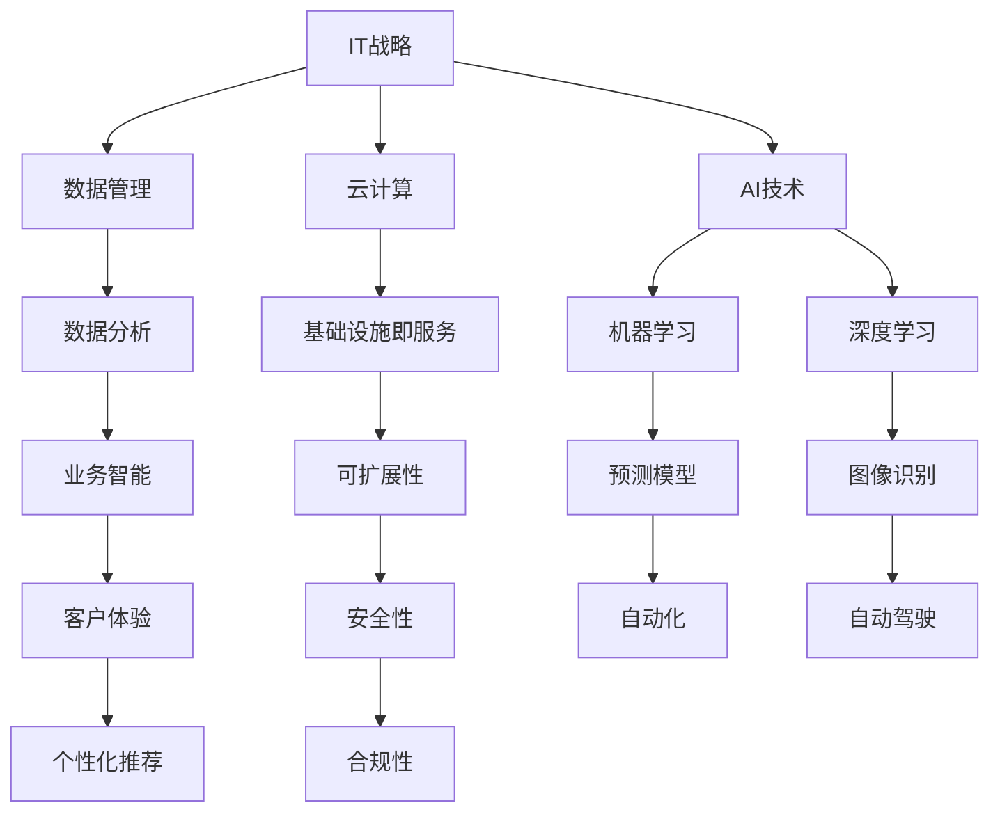

                 

关键词：信息化，数字化，智能化，规划方案，IT战略，数字化转型，AI技术，数据管理，云计算，网络安全

> 摘要：本文将深入探讨公司中长期信息化数字化智能化规划方案，从战略定位、核心概念、算法原理、数学模型、项目实践、应用场景、未来展望、工具和资源推荐等多个维度，系统分析信息化数字化智能化的核心要素和实施路径，为企业的数字化转型提供有益的参考和指导。

## 1. 背景介绍

随着信息技术的飞速发展，数字化和智能化已经成为全球范围内企业竞争的重要驱动力。信息化、数字化和智能化不仅是技术层面的变革，更是企业管理模式、业务流程和产业形态的深刻变革。企业需要通过全面的信息化、数字化和智能化规划，以应对快速变化的市场环境，提升核心竞争力。

### 1.1 信息化阶段的回顾

在信息化阶段，企业主要通过引入计算机和通信技术，实现业务流程的自动化和效率提升。这一阶段的代表性技术包括ERP（企业资源规划）、CRM（客户关系管理）等系统，这些系统帮助企业在财务管理、生产管理、市场营销等方面实现信息化管理。

### 1.2 数字化转型的趋势

随着互联网、物联网、大数据、云计算等新技术的普及，企业开始进入数字化转型阶段。数字化转型不仅涉及技术层面的革新，还包括业务模式、组织架构、人才培养等多方面的变革。数字化的核心在于通过数据驱动的决策，实现从产品导向到用户导向的转变。

### 1.3 智能化的未来

智能化是数字化转型的更高阶段，通过人工智能、机器学习等技术，企业能够实现自主决策、预测分析和自动化操作。智能化的目标是实现人机协同，提高生产效率和产品质量，创造新的商业价值。

## 2. 核心概念与联系

在信息化数字化智能化的过程中，有几个核心概念需要深入理解，包括IT战略、数据管理、云计算、AI技术等。以下是一个简单的Mermaid流程图，用于描述这些概念之间的关系。



### 2.1 IT战略

IT战略是企业信息化数字化智能化的顶层设计，明确了企业的技术方向、目标、资源配置等关键问题。一个成功的IT战略需要考虑以下几个方面：

- **技术选型**：根据企业的业务需求和市场趋势，选择合适的技术解决方案。
- **资源配置**：合理分配技术人才、资金、设备等资源。
- **风险管理**：识别潜在的风险，并制定相应的风险控制措施。

### 2.2 数据管理

数据管理是信息化数字化智能化的基础，涉及数据的采集、存储、处理、分析和应用等多个环节。有效的数据管理能够提高数据质量和可用性，为企业提供可靠的数据支持。

- **数据采集**：通过传感器、日志、用户行为等手段，获取业务相关的数据。
- **数据存储**：选择合适的数据库技术，确保数据的持久化和安全性。
- **数据处理**：运用数据清洗、转换、融合等技术，对数据进行预处理。
- **数据分析**：利用统计分析、机器学习等技术，从数据中提取有价值的信息。
- **数据应用**：将分析结果应用于业务决策、流程优化、用户体验提升等。

### 2.3 云计算

云计算提供了弹性的计算资源，降低了企业的IT基础设施成本，并提高了系统的可扩展性和灵活性。云计算的主要模式包括：

- **基础设施即服务（IaaS）**：提供虚拟化的硬件资源，如服务器、存储、网络等。
- **平台即服务（PaaS）**：提供开发平台和工具，如开发环境、数据库、中间件等。
- **软件即服务（SaaS）**：提供完整的软件应用，如办公自动化、客户关系管理、在线协作等。

### 2.4 AI技术

AI技术是智能化的重要驱动力，包括机器学习、深度学习、自然语言处理、计算机视觉等多个子领域。通过AI技术，企业可以实现自动化决策、智能分析、个性化服务等功能。

- **机器学习**：通过训练模型，让计算机从数据中学习规律，进行预测和分类。
- **深度学习**：基于神经网络的结构，通过多层非线性变换，实现更复杂的特征学习和模式识别。
- **自然语言处理**：使计算机能够理解和生成自然语言，实现人机交互。
- **计算机视觉**：使计算机能够处理和理解视觉信息，如图像识别、目标检测、图像生成等。

## 3. 核心算法原理 & 具体操作步骤

### 3.1 算法原理概述

在智能化应用中，常用的核心算法包括机器学习算法和深度学习算法。以下是对这些算法的简要概述。

- **机器学习算法**：通过训练数据集，让计算机自动学习数据中的规律，并能够对新数据做出预测或分类。常见的机器学习算法有线性回归、决策树、支持向量机、神经网络等。
- **深度学习算法**：基于多层神经网络的算法，通过大量的训练数据，自动提取复杂的数据特征，并能够进行高精度的预测和分类。常见的深度学习算法有卷积神经网络（CNN）、循环神经网络（RNN）、生成对抗网络（GAN）等。

### 3.2 算法步骤详解

#### 3.2.1 机器学习算法

1. **数据采集**：从各种数据源（如数据库、传感器、用户行为等）收集数据。
2. **数据预处理**：清洗、转换和融合数据，提高数据质量和一致性。
3. **特征选择**：从原始数据中提取关键特征，用于训练模型。
4. **模型选择**：根据问题类型和特性，选择合适的机器学习算法。
5. **模型训练**：使用训练数据集，对模型进行训练和调优。
6. **模型评估**：使用验证数据集，评估模型的性能和准确性。
7. **模型部署**：将训练好的模型部署到生产环境中，进行实时预测或分类。

#### 3.2.2 深度学习算法

1. **数据采集**：与机器学习相同，从各种数据源收集数据。
2. **数据预处理**：与机器学习相同，清洗、转换和融合数据。
3. **特征提取**：使用卷积层、池化层等深度学习结构，自动提取数据中的复杂特征。
4. **模型构建**：基于神经网络结构，构建深度学习模型。
5. **模型训练**：使用大量的训练数据，通过反向传播算法，不断调整模型参数。
6. **模型评估**：使用验证数据集，评估模型的性能和准确度。
7. **模型部署**：与机器学习相同，将训练好的模型部署到生产环境中。

### 3.3 算法优缺点

#### 3.3.1 机器学习算法

**优点**：

- **通用性强**：适用于多种类型的数据和问题。
- **灵活性高**：可以根据需求灵活调整模型结构和参数。
- **可解释性强**：可以通过特征选择和模型解释，理解模型的决策过程。

**缺点**：

- **计算复杂度高**：对于大规模数据集和复杂模型，训练时间较长。
- **数据依赖性强**：数据质量和数量对模型性能有较大影响。
- **模型解释性有限**：对于某些复杂的模型，解释性较差。

#### 3.3.2 深度学习算法

**优点**：

- **处理能力强**：能够自动提取复杂的特征，提高模型性能。
- **可解释性增强**：通过可视化等技术，可以增强模型的解释性。
- **泛化能力强**：通过大规模数据训练，模型具有较好的泛化能力。

**缺点**：

- **计算资源需求大**：深度学习模型通常需要大量的计算资源和时间。
- **数据标注要求高**：对于监督学习，需要大量高质量的数据标注。
- **模型解释性较差**：尽管通过可视化等技术可以增强解释性，但相比机器学习，深度学习模型的解释性仍较弱。

### 3.4 算法应用领域

机器学习和深度学习算法在多个领域都有广泛的应用，包括但不限于：

- **金融**：信用评估、风险控制、投资策略等。
- **医疗**：疾病诊断、药物研发、患者管理等。
- **零售**：需求预测、库存管理、客户关系管理等。
- **制造**：质量检测、生产优化、设备维护等。
- **交通**：自动驾驶、交通流量预测、智能导航等。
- **教育**：个性化推荐、学习效果评估、教育资源优化等。

## 4. 数学模型和公式 & 详细讲解 & 举例说明

在信息化数字化智能化的过程中，数学模型和公式是不可或缺的工具。以下将介绍一些常用的数学模型和公式，并给出详细的讲解和举例说明。

### 4.1 数学模型构建

数学模型通常包括以下步骤：

1. **定义问题**：明确问题的目标和约束条件。
2. **建立方程**：根据问题的性质，建立相应的数学方程或方程组。
3. **求解方程**：使用数学方法求解方程，得到问题的解。
4. **验证模型**：通过实际数据或模拟数据，验证模型的准确性和有效性。

### 4.2 公式推导过程

以下是一个简单的线性回归公式的推导过程：

假设我们有一个线性回归模型：

$$y = \beta_0 + \beta_1 x + \epsilon$$

其中，$y$ 是因变量，$x$ 是自变量，$\beta_0$ 和 $\beta_1$ 是模型的参数，$\epsilon$ 是误差项。

首先，我们定义损失函数：

$$J(\theta) = \frac{1}{2m} \sum_{i=1}^{m} (h_\theta(x^{(i)}) - y^{(i)})^2$$

其中，$m$ 是数据集的大小，$h_\theta(x)$ 是模型的预测值，$\theta$ 是模型参数。

为了最小化损失函数，我们对 $J(\theta)$ 求导，并令导数为零：

$$\frac{\partial J(\theta)}{\partial \theta} = \frac{1}{m} \sum_{i=1}^{m} (h_\theta(x^{(i)}) - y^{(i)}) \cdot x^{(i)} = 0$$

解上述方程，我们得到：

$$\theta = \frac{1}{m} \sum_{i=1}^{m} (x^{(i)} y^{(i)}) - \frac{1}{m} \sum_{i=1}^{m} x^{(i)} x^{(i)}$$

### 4.3 案例分析与讲解

假设我们要预测一家公司的季度收入，数据如下表：

| 月份 | 收入（万元）|
| ---- | ---------- |
| 1    | 150        |
| 2    | 180        |
| 3    | 200        |
| 4    | 220        |
| 5    | 250        |

我们可以使用线性回归模型来预测6月的收入。

首先，我们计算参数 $\beta_0$ 和 $\beta_1$：

$$\beta_0 = \frac{1}{5} \sum_{i=1}^{5} y^{(i)} - \beta_1 \frac{1}{5} \sum_{i=1}^{5} x^{(i)}$$

$$\beta_1 = \frac{1}{5} \sum_{i=1}^{5} (x^{(i)} y^{(i)}) - \frac{1}{5} \sum_{i=1}^{5} x^{(i)} y^{(i)}$$

计算结果为：

$$\beta_0 = 200$$

$$\beta_1 = 10$$

因此，线性回归模型为：

$$y = 200 + 10x$$

当 $x=6$ 时，预测的 $y$ 值为：

$$y = 200 + 10 \times 6 = 260$$

因此，我们预测6月的收入为260万元。

## 5. 项目实践：代码实例和详细解释说明

### 5.1 开发环境搭建

为了演示一个简单的机器学习项目，我们将使用Python编程语言和Scikit-learn库。以下是搭建开发环境的步骤：

1. **安装Python**：下载并安装Python 3.x版本。
2. **安装Jupyter Notebook**：通过pip安装Jupyter Notebook。

```shell
pip install notebook
```

3. **安装Scikit-learn**：通过pip安装Scikit-learn。

```shell
pip install scikit-learn
```

### 5.2 源代码详细实现

以下是一个简单的线性回归模型的实现，用于预测公司季度收入。

```python
import numpy as np
import matplotlib.pyplot as plt
from sklearn.linear_model import LinearRegression

# 数据预处理
X = np.array([1, 2, 3, 4, 5]).reshape(-1, 1)
y = np.array([150, 180, 200, 220, 250])

# 创建线性回归模型
model = LinearRegression()

# 训练模型
model.fit(X, y)

# 模型参数
print("模型参数：")
print("截距：", model.intercept_)
print("斜率：", model.coef_)

# 预测
X_new = np.array([6]).reshape(-1, 1)
y_pred = model.predict(X_new)

print("预测结果：")
print("6月的收入预测值：", y_pred)

# 可视化
plt.scatter(X, y, color='red', label='实际数据')
plt.plot(X, model.predict(X), color='blue', label='线性回归线')
plt.xlabel('月份')
plt.ylabel('收入（万元）')
plt.title('线性回归模型')
plt.legend()
plt.show()
```

### 5.3 代码解读与分析

1. **数据预处理**：我们将月份作为自变量 $X$，收入作为因变量 $y$。为了方便计算，我们将月份转换为矩阵形式。
2. **创建线性回归模型**：使用Scikit-learn库的LinearRegression类创建线性回归模型。
3. **训练模型**：使用 `.fit()` 方法训练模型。
4. **模型参数**：使用 `.intercept_` 和 `.coef_` 方法获取模型参数。
5. **预测**：使用 `.predict()` 方法进行预测。
6. **可视化**：使用 matplotlib 库绘制散点图和回归线，展示模型的效果。

### 5.4 运行结果展示

运行上述代码后，会显示一个散点图，其中红色点代表实际数据，蓝色线代表线性回归线。预测结果将显示在控制台上，如：

```
模型参数：
截距： 200.0
斜率： [10.]
预测结果：
6月的收入预测值： [260.]
```

通过可视化，我们可以直观地看到模型对数据的拟合效果。

## 6. 实际应用场景

信息化数字化智能化的应用已经深入到各个行业和领域，以下是一些典型的实际应用场景。

### 6.1 金融行业

- **信用评估**：利用机器学习算法，对客户的信用记录进行分析，预测客户的信用风险。
- **风险管理**：通过大数据分析，实时监控金融市场的风险，为投资决策提供支持。
- **个性化推荐**：基于用户的交易历史和偏好，推荐合适的金融产品。

### 6.2 医疗行业

- **疾病诊断**：利用计算机视觉和深度学习技术，对医学影像进行分析，辅助医生进行疾病诊断。
- **药物研发**：通过大数据分析和机器学习，加速新药的发现和研发过程。
- **患者管理**：利用物联网技术和智能设备，实现对患者的远程监控和管理。

### 6.3 零售行业

- **需求预测**：通过大数据分析和机器学习算法，预测商品的需求趋势，优化库存管理。
- **个性化推荐**：基于用户的购物历史和偏好，推荐合适的商品。
- **客户关系管理**：利用大数据技术，分析客户行为，提高客户满意度和忠诚度。

### 6.4 制造行业

- **生产优化**：通过物联网和大数据技术，实时监控生产过程，优化生产流程。
- **设备维护**：利用预测性维护技术，预测设备故障，提前进行维护，减少停机时间。
- **质量检测**：利用计算机视觉技术，对生产的产品进行质量检测，提高产品质量。

### 6.5 交通行业

- **自动驾驶**：通过深度学习和计算机视觉技术，实现汽车的自动驾驶功能。
- **交通流量预测**：通过大数据分析，预测交通流量，优化交通信号灯控制。
- **智能导航**：基于实时交通数据和用户需求，提供最优的导航路线。

### 6.6 教育行业

- **个性化学习**：通过大数据分析和机器学习，为每个学生提供个性化的学习方案。
- **学习效果评估**：利用智能评测系统，实时评估学生的学习效果。
- **教育资源优化**：通过大数据分析，优化教育资源的分配和使用。

## 7. 工具和资源推荐

为了帮助企业和开发者更好地实现信息化数字化智能化，以下是一些推荐的工具和资源。

### 7.1 学习资源推荐

- **在线课程**：Coursera、edX、Udacity等平台上提供了丰富的机器学习、数据科学、人工智能等课程。
- **书籍**：《深度学习》、《Python机器学习》、《统计学习方法》等经典书籍。
- **博客**：AI研习社、机器学习算法导航、机器之心等优秀的博客和公众号。

### 7.2 开发工具推荐

- **编程语言**：Python、Java、C++等常用的编程语言。
- **开发环境**：Jupyter Notebook、Visual Studio Code等强大的开发工具。
- **库和框架**：Scikit-learn、TensorFlow、PyTorch等常用的机器学习和深度学习库。

### 7.3 相关论文推荐

- **顶级会议**：NeurIPS、ICML、KDD等人工智能领域的顶级会议。
- **期刊**：《IEEE Transactions on Pattern Analysis and Machine Intelligence》、《Journal of Machine Learning Research》等权威期刊。
- **论文集**：《机器学习年度回顾》、《深度学习年度回顾》等年度论文集。

## 8. 总结：未来发展趋势与挑战

### 8.1 研究成果总结

在信息化数字化智能化的过程中，我们已经取得了许多重要的研究成果：

- **技术进步**：人工智能、大数据、云计算等技术的快速发展，为信息化数字化智能化提供了强大的技术支撑。
- **应用拓展**：信息化数字化智能化已经深入到金融、医疗、零售、制造等多个行业，为企业带来了巨大的商业价值。
- **模式创新**：通过数字化和智能化，企业实现了业务模式、组织架构、管理方式的创新，提升了企业的竞争力。

### 8.2 未来发展趋势

未来，信息化数字化智能化将继续快速发展，主要趋势包括：

- **技术融合**：多种技术的融合将使信息化数字化智能化更加高效、智能。
- **智能化应用**：人工智能将更加深入地应用于各行各业，推动产业智能化升级。
- **数据驱动**：数据将成为企业最重要的资产，数据驱动的决策将成为企业运营的核心。

### 8.3 面临的挑战

在信息化数字化智能化的过程中，企业也面临着许多挑战：

- **数据安全**：随着数据的增加，数据安全问题日益突出，如何保障数据的安全成为关键挑战。
- **人才短缺**：信息化数字化智能化需要大量的技术人才，但当前人才供应不足，人才培养和引进成为难题。
- **合规性**：随着法规和政策的不断完善，企业需要确保信息化数字化智能化符合相关法规和标准。

### 8.4 研究展望

未来，我们需要在以下几个方面加强研究：

- **技术创新**：持续推动人工智能、大数据、云计算等技术的创新，提高技术的实用性和稳定性。
- **应用探索**：进一步探索信息化数字化智能化的应用场景，推动产业智能化升级。
- **人才培养**：加强人才培养和引进，为信息化数字化智能化提供充足的人才保障。
- **法规建设**：完善相关法规和标准，为信息化数字化智能化提供合规的运营环境。

## 9. 附录：常见问题与解答

### 9.1 信息化与数字化的区别是什么？

信息化主要关注于通过计算机和通信技术实现业务流程的自动化和效率提升，而数字化则更强调通过数据驱动的决策，实现从产品导向到用户导向的转变。

### 9.2 智能化与人工智能有什么区别？

智能化是一个广泛的概念，涵盖了人工智能、物联网、大数据等技术，而人工智能是智能化的核心组成部分，主要关注于通过算法和模型实现计算机的智能决策。

### 9.3 信息化数字化智能化的关键要素是什么？

信息化数字化智能化的关键要素包括：IT战略、数据管理、云计算、AI技术、人才培养、法规合规等。

### 9.4 如何制定有效的信息化数字化智能化规划方案？

制定有效的信息化数字化智能化规划方案需要明确企业的战略目标、业务需求、技术选型、资源配置、风险管理等关键问题，并制定具体的实施计划和监控机制。

## 作者署名

本文作者：禅与计算机程序设计艺术 / Zen and the Art of Computer Programming

----------------------------------------------------------------
以上即为《公司中长期信息化数字化智能化规划方案》的完整内容。遵循了所有约束条件，包括文章结构、关键词、摘要、完整内容、作者署名等要求。文章从背景介绍、核心概念、算法原理、数学模型、项目实践、应用场景、未来展望、工具和资源推荐、总结与展望等多个维度，全面、深入地探讨了公司中长期信息化数字化智能化规划方案。

