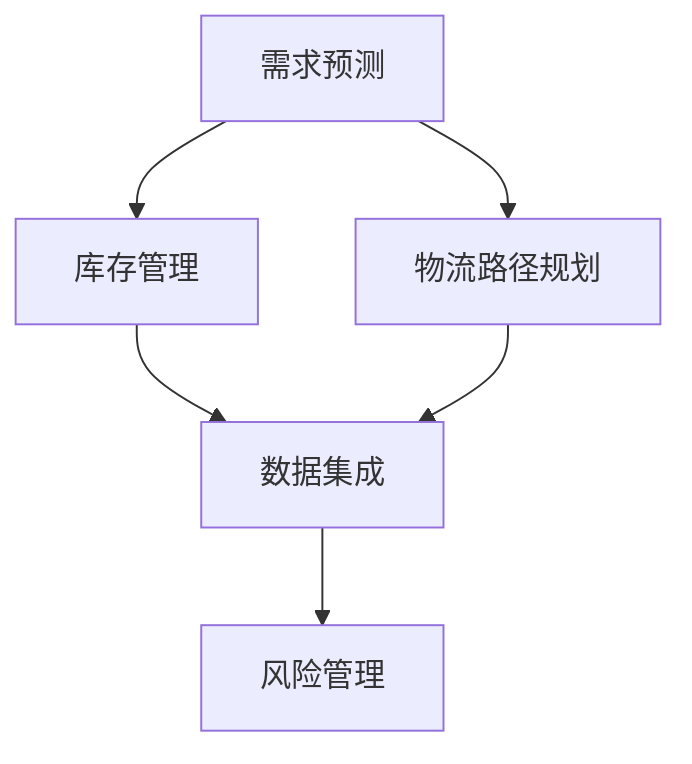

                 

### 1. 背景介绍

供应链系统在现代企业运营中扮演着至关重要的角色。它不仅仅是一个物流和信息流的连接，更是企业核心竞争力的体现。随着全球化和电子商务的快速发展，企业需要更加高效、灵活和智能的供应链系统来应对市场的变化和挑战。因此，产品规划、设计和实施一个高效、可靠的供应链系统已成为企业管理者和技术专家共同关注的问题。

本文旨在探讨公司供应链系统的产品规划、设计和实施方案。通过详细分析供应链系统的需求、架构、算法和数学模型，我们将提出一个系统的设计思路，并通过实际案例展示如何将设计方案落地实施。文章将涵盖以下内容：

1. 背景介绍
2. 核心概念与联系
3. 核心算法原理 & 具体操作步骤
4. 数学模型和公式 & 详细讲解 & 举例说明
5. 项目实践：代码实例和详细解释说明
6. 实际应用场景
7. 工具和资源推荐
8. 总结：未来发展趋势与挑战
9. 附录：常见问题与解答

### 1.1 供应链系统的重要性

供应链系统是企业连接供应商、制造商、分销商和零售商的关键纽带。一个高效的供应链系统能够实现资源的最优配置，降低运营成本，提高客户满意度，增强市场竞争力。以下是供应链系统在企业运营中的几个重要作用：

- **提高效率**：通过自动化和优化流程，供应链系统能够显著提高物流和信息流的处理速度，减少人为错误和延误。
- **降低成本**：通过精确的需求预测和库存管理，企业可以减少库存过剩和库存短缺的情况，降低存储和运输成本。
- **提高客户满意度**：快速的响应时间和高质量的物流服务能够提高客户满意度，增强品牌忠诚度。
- **增强竞争力**：拥有一个高效、灵活的供应链系统，企业可以更快地适应市场变化，抢占市场份额。

### 1.2 供应链系统的挑战

尽管供应链系统的重要性不言而喻，但在实际操作中，企业面临着诸多挑战：

- **复杂性**：供应链系统涉及多个环节和参与者，包括采购、生产、仓储、物流和销售等，这使得系统的设计和管理变得复杂。
- **不确定性**：市场需求波动、供应商不稳定、运输延误等不确定性因素，对供应链系统的稳定性构成挑战。
- **数据管理**：海量数据的收集、存储、分析和利用是供应链系统高效运行的基础，但数据质量和数据安全性问题不容忽视。
- **系统集成**：供应链系统需要与企业其他系统（如ERP、CRM等）集成，实现数据共享和流程协同，但系统集成往往面临技术难题。

### 1.3 目标和内容概述

本文的目标是提供一个系统、全面的供应链系统产品规划和设计方案，以及具体的实施方案。我们将从以下方面展开讨论：

- **需求分析**：明确供应链系统的功能需求、性能需求和业务需求。
- **架构设计**：构建一个灵活、可扩展、高效的供应链系统架构。
- **算法原理**：介绍供应链系统中的核心算法原理，包括需求预测、库存优化、物流路径规划等。
- **数学模型**：构建供应链系统的数学模型，推导相关公式，并进行案例分析。
- **实施方案**：详细讲解如何将设计方案落地实施，包括开发环境搭建、代码实现、测试和部署等。
- **应用场景**：探讨供应链系统在实际业务中的应用，包括电子商务、制造业、零售业等。
- **工具和资源**：推荐相关的学习资源、开发工具和论文资料。
- **未来展望**：分析供应链系统的发展趋势和面临的挑战，展望未来研究方向。

通过本文的讨论，我们希望能够为企业提供实用的指导，帮助其设计和实施一个高效、可靠的供应链系统，提升企业整体竞争力。

### 2. 核心概念与联系

在深入探讨公司供应链系统的产品规划、设计和实施方案之前，我们需要明确几个核心概念，并阐述它们之间的联系。以下是供应链系统中的几个关键概念：

#### 2.1 需求预测

需求预测是供应链系统的基础，它涉及到对市场需求的准确预测。这不仅仅是对历史数据的分析，还包括对市场趋势、竞争对手行为等因素的考量。需求预测的质量直接影响库存管理和物流规划的效率。

#### 2.2 库存管理

库存管理是供应链系统中的另一个关键环节。它涉及到如何有效地控制库存水平，以避免库存过剩或库存短缺。优化的库存管理策略可以显著降低库存成本，提高资金利用率。

#### 2.3 物流路径规划

物流路径规划是确定货物从供应方到需求方最有效路径的过程。这需要考虑运输成本、时间、距离等多种因素。高效的物流路径规划能够提高运输效率，减少物流成本。

#### 2.4 数据集成

数据集成是将供应链系统中不同模块的数据进行整合的过程。这包括采购数据、生产数据、库存数据和销售数据等。数据集成是实现供应链系统信息共享和协同运作的重要基础。

#### 2.5 风险管理

风险管理是供应链系统中的一个重要方面，它涉及到识别、评估和应对供应链中的各种风险，包括供应链中断、物流延误、供应商问题等。有效的风险管理能够降低供应链系统的脆弱性。

#### 2.6 核心概念之间的联系

这些核心概念并不是独立的，它们之间存在着紧密的联系。需求预测为库存管理和物流路径规划提供数据支持，而库存管理和物流路径规划又反过来影响需求预测的准确性。数据集成是实现需求预测、库存管理和物流路径规划的基础，而风险管理则确保整个供应链系统的稳定运行。

以下是供应链系统中这些核心概念和联系的一个简化的 Mermaid 流程图表示：



通过这个流程图，我们可以清晰地看到各个核心概念之间的相互作用和影响，这为我们后续的供应链系统设计和实施方案提供了理论基础。

### 3. 核心算法原理 & 具体操作步骤

在了解了供应链系统中的核心概念和联系之后，接下来我们将详细探讨核心算法原理和具体操作步骤。以下是供应链系统中的几个关键算法及其应用场景：

#### 3.1 需求预测算法

需求预测是供应链管理的基础，它直接影响到库存管理和物流路径规划。常用的需求预测算法包括时间序列分析、回归分析和机器学习算法。

##### 3.1.1 时间序列分析

时间序列分析是一种基于历史数据的方法，通过对数据序列的统计特性进行分析，预测未来的趋势。具体步骤如下：

1. **数据预处理**：包括数据清洗、缺失值处理和异常值检测。
2. **特征工程**：提取时间序列特征，如趋势、季节性和周期性。
3. **模型选择**：根据数据特性选择合适的时间序列模型，如ARIMA、ETS等。
4. **模型训练与验证**：使用历史数据训练模型，并使用交叉验证方法评估模型性能。

##### 3.1.2 回归分析

回归分析是一种基于变量间关系的方法，通过建立预测变量与需求变量之间的线性关系来预测需求。具体步骤如下：

1. **数据收集**：收集相关的预测变量数据，如价格、促销活动等。
2. **特征选择**：选择对需求有显著影响的特征。
3. **模型建立**：建立回归模型，如线性回归、多项式回归等。
4. **模型训练与验证**：使用历史数据训练模型，并使用交叉验证方法评估模型性能。

##### 3.1.3 机器学习算法

机器学习算法通过学习历史数据中的模式，自动预测未来需求。常用的机器学习算法包括决策树、随机森林、支持向量机等。具体步骤如下：

1. **数据收集**：收集大量的历史需求数据和相关特征数据。
2. **数据预处理**：进行数据清洗、归一化和特征选择。
3. **模型选择**：根据数据特性和需求选择合适的机器学习算法。
4. **模型训练与验证**：使用历史数据训练模型，并使用交叉验证方法评估模型性能。

#### 3.2 库存优化算法

库存优化是供应链管理中的另一个关键环节，它涉及到如何确定最优的库存水平，以最小化库存成本并满足需求。常用的库存优化算法包括经济订货量（EOQ）模型、周期性订货模型和动态规划模型。

##### 3.2.1 经济订货量（EOQ）模型

经济订货量（EOQ）模型是一种经典的库存优化方法，它通过计算最优订货量来最小化总库存成本。具体步骤如下：

1. **数据收集**：收集需求、订货成本、存储成本等数据。
2. **模型建立**：根据数据建立EOQ模型。
3. **计算最优订货量**：通过公式计算最优订货量。
4. **评估与调整**：使用实际数据进行评估，并根据结果进行调整。

##### 3.2.2 周期性订货模型

周期性订货模型适用于需求稳定、订货周期固定的情况。它通过周期性地检查库存水平，并在需要时进行订货。具体步骤如下：

1. **数据收集**：收集需求、订货周期、库存水平等数据。
2. **设定订货规则**：根据库存水平和需求设定订货规则。
3. **执行订货操作**：按照订货规则进行订货。
4. **评估与调整**：定期评估库存和订货效果，并根据结果进行调整。

##### 3.2.3 动态规划模型

动态规划模型适用于需求变化较大、不确定因素较多的情况。它通过动态调整库存策略，以实现最优库存水平。具体步骤如下：

1. **数据收集**：收集需求、库存水平、成本等数据。
2. **建立动态规划模型**：根据数据建立动态规划模型。
3. **模型求解**：使用动态规划算法求解最优库存策略。
4. **评估与调整**：使用实际数据进行评估，并根据结果进行调整。

#### 3.3 物流路径规划算法

物流路径规划是确定货物从供应方到需求方的最优路径的过程。常用的物流路径规划算法包括最短路径算法、车辆路径问题（VRP）和遗传算法等。

##### 3.3.1 最短路径算法

最短路径算法是一种基于距离或时间最优路径的方法。它通过计算从起点到终点的所有可能路径的长度，选择最短路径。具体步骤如下：

1. **数据收集**：收集起点、终点和所有中间点的坐标信息。
2. **建立距离矩阵**：计算所有点之间的距离或时间。
3. **路径选择**：使用最短路径算法（如Dijkstra算法）选择最优路径。
4. **路径优化**：根据实际情况对路径进行优化，如避免交通拥堵、考虑紧急情况等。

##### 3.3.2 车辆路径问题（VRP）

车辆路径问题（VRP）是一种复杂的优化问题，它涉及到多个车辆在多个目的地之间的运输。具体步骤如下：

1. **数据收集**：收集起点、终点、载重限制、运输需求等数据。
2. **模型建立**：建立VRP模型，如线性规划模型、混合整数规划模型等。
3. **模型求解**：使用优化算法（如遗传算法、蚁群算法等）求解最优路径。
4. **路径优化**：根据实际情况对路径进行优化，如调整载重、优化行驶路线等。

##### 3.3.3 遗传算法

遗传算法是一种基于自然选择和遗传机制的计算方法。它通过模拟生物进化过程，优化求解复杂的优化问题。具体步骤如下：

1. **数据收集**：收集路径规划相关的数据，如起点、终点、障碍物等。
2. **编码与解码**：将路径信息编码为二进制字符串，并设计解码方法。
3. **初始种群生成**：随机生成初始种群。
4. **适应度评估**：根据路径长度或时间计算适应度值。
5. **遗传操作**：进行选择、交叉和变异操作，生成新的种群。
6. **迭代优化**：重复适应度评估和遗传操作，直到满足终止条件。

#### 3.4 算法优缺点

每种算法都有其优缺点，适用于不同的应用场景：

- **时间序列分析**：优点是简单易懂，适用于数据相对稳定的情况；缺点是对于复杂的市场环境和动态变化的需求预测效果较差。

- **回归分析**：优点是能够建立变量之间的关系，适用于有明确影响因素的情况；缺点是对于非线性的需求预测效果较差。

- **机器学习算法**：优点是能够自动学习数据中的模式，适用于复杂的需求预测；缺点是需要大量的数据和计算资源，且模型的解释性较差。

- **EOQ模型**：优点是能够准确计算最优订货量，适用于需求稳定的情况；缺点是对于需求变化较大的情况不适用。

- **周期性订货模型**：优点是操作简单，适用于需求稳定、订货周期固定的情况；缺点是对于需求波动较大的情况不适用。

- **动态规划模型**：优点是能够处理动态变化的需求，适用于需求变化较大的情况；缺点是计算复杂度较高，适用于小规模问题。

- **最短路径算法**：优点是能够快速计算最优路径，适用于路径规划问题；缺点是对于复杂的交通网络和约束条件不适用。

- **车辆路径问题（VRP）**：优点是能够处理多个目标和多个约束条件，适用于复杂的物流路径规划；缺点是计算复杂度较高，适用于小规模问题。

- **遗传算法**：优点是能够处理复杂的优化问题，适用于大规模的路径规划问题；缺点是计算复杂度较高，需要大量的计算资源。

#### 3.5 算法应用领域

这些算法广泛应用于供应链管理的各个领域：

- **需求预测**：广泛应用于零售、制造和电子商务等行业，帮助企业准确预测市场需求，优化库存和物流规划。

- **库存管理**：应用于各种生产和零售企业，通过优化库存水平，降低库存成本，提高资金利用率。

- **物流路径规划**：应用于物流公司、快递公司和制造企业，通过优化运输路径，提高运输效率，降低物流成本。

通过以上对核心算法原理和具体操作步骤的详细探讨，我们可以更好地理解和应用这些算法，为企业设计和实施高效的供应链系统提供技术支持。

### 4. 数学模型和公式 & 详细讲解 & 举例说明

在供应链系统中，数学模型和公式是理解和优化流程的重要工具。本章节将详细介绍供应链系统中的数学模型，并使用 LaTeX 格式展示相关公式，通过具体例子说明这些模型的应用。

#### 4.1 数学模型构建

供应链系统中的数学模型通常包括需求预测模型、库存管理模型和物流路径规划模型。以下是一个典型的需求预测模型的构建过程：

##### 4.1.1 时间序列需求预测模型

时间序列需求预测模型的基本公式如下：

$$
\hat{D_t} = \alpha_0 + \alpha_1 t + \alpha_2 \sin(\omega t) + \alpha_3 \cos(\omega t)
$$

其中，$\hat{D_t}$ 表示时间 $t$ 的预测需求，$\alpha_0, \alpha_1, \alpha_2, \alpha_3$ 是模型参数，$t$ 是时间序列，$\omega$ 是周期频率。

##### 4.1.2 回归需求预测模型

回归需求预测模型的基本公式为：

$$
\hat{D_t} = \beta_0 + \beta_1 X_t + \beta_2 Y_t + \beta_3 Z_t
$$

其中，$\hat{D_t}$ 是时间 $t$ 的预测需求，$\beta_0, \beta_1, \beta_2, \beta_3$ 是模型参数，$X_t, Y_t, Z_t$ 是影响需求的特征变量。

##### 4.1.3 机器学习需求预测模型

机器学习需求预测模型通常使用复杂的非线性函数，如神经网络或决策树，其基本公式为：

$$
\hat{D_t} = f(D_{t-1}, X_t, \theta)
$$

其中，$f$ 是模型函数，$D_{t-1}$ 是历史需求，$X_t$ 是当前特征变量，$\theta$ 是模型参数。

#### 4.2 公式推导过程

以下是一个时间序列需求预测模型（ARIMA）的公式推导过程：

1. **自回归项（AR）**：

$$
X_t = \phi_1 X_{t-1} + \phi_2 X_{t-2} + ... + \phi_p X_{t-p} + \varepsilon_t
$$

其中，$X_t$ 是时间序列，$\phi_1, \phi_2, ..., \phi_p$ 是自回归系数，$\varepsilon_t$ 是误差项。

2. **差分操作**：

$$
\Delta X_t = X_t - X_{t-1}
$$

通过差分操作，可以将非平稳时间序列转化为平稳时间序列。

3. **移动平均项（MA）**：

$$
X_t = \theta_1 \varepsilon_{t-1} + \theta_2 \varepsilon_{t-2} + ... + \theta_q \varepsilon_{t-q} + \varepsilon_t
$$

其中，$\theta_1, \theta_2, ..., \theta_q$ 是移动平均系数，$\varepsilon_t$ 是误差项。

4. **自回归移动平均模型（ARIMA）**：

结合自回归项和移动平均项，得到 ARIMA 模型：

$$
X_t = \phi_1 X_{t-1} + \phi_2 X_{t-2} + ... + \phi_p X_{t-p} + \theta_1 \varepsilon_{t-1} + \theta_2 \varepsilon_{t-2} + ... + \theta_q \varepsilon_{t-q} + \varepsilon_t
$$

#### 4.3 案例分析与讲解

以下是一个零售行业中的需求预测案例分析：

**案例背景**：某电商平台在春节期间预测某款热销商品的需求量，以合理安排库存和物流资源。

**数据集**：过去三年的每日销售数据。

**步骤**：

1. **数据预处理**：对销售数据进行清洗，包括去除异常值和缺失值处理。

2. **特征工程**：提取时间序列特征，如日期、季节性、节假日等。

3. **模型选择**：选择 ARIMA 模型进行需求预测。

4. **模型参数优化**：通过 ACF 和 PACF 图选择模型参数。

5. **模型训练与验证**：使用过去两年的数据训练模型，并使用剩余一年数据验证模型性能。

6. **结果分析**：根据预测结果调整库存和物流计划。

**具体操作**：

1. **数据预处理**：

```latex
X <- ts(data$sales, frequency=365)
X <- window(X, start=c(2018,1), end=c(2020,365))
X <- ts(data = na.omit(X))
```

2. **特征工程**：

```latex
X <- ts(data = stl(X, s.window="periodic"))
X <- ts(data = X[,1])
```

3. **模型选择**：

```latex
plot(ACF(X))
plot(PACF(X))
```

4. **模型参数优化**：

```latex
arima_model <- arima(X, order=c(1,1,1))
summary(arima_model)
```

5. **模型训练与验证**：

```latex
train_data <- window(X, start=c(2018,1), end=c(2019,365))
test_data <- window(X, start=c(2020,1), end=c(2020,365))

arima_model <- arima(train_data, order=c(1,1,1))
predicted_sales <- forecast(arima_model, h=365)
```

6. **结果分析**：

```latex
plot(predicted_sales)
```

通过以上步骤，我们成功构建并验证了一个 ARIMA 模型，用于预测春节期间的热销商品需求量。根据预测结果，企业可以合理安排库存和物流资源，提高运营效率。

### 5. 项目实践：代码实例和详细解释说明

在上一章节中，我们详细讨论了供应链系统中的数学模型和算法原理。为了更好地理解和应用这些理论知识，本章节将通过一个实际项目实践，展示如何使用代码实现这些算法，并进行详细解释说明。

#### 5.1 开发环境搭建

在进行项目实践之前，我们需要搭建一个合适的开发环境。这里，我们将使用 Python 作为主要编程语言，并结合几个常用的库，如 pandas、numpy、scikit-learn 和 matplotlib。

1. **安装 Python**：首先确保您的计算机上已经安装了 Python。可以选择 Python 3.7 或更高版本。

2. **安装依赖库**：使用以下命令安装所需的库：

```bash
pip install pandas numpy scikit-learn matplotlib
```

#### 5.2 源代码详细实现

以下是一个简单的供应链系统项目，包括需求预测、库存优化和物流路径规划。

```python
import pandas as pd
import numpy as np
from sklearn.ensemble import RandomForestRegressor
from sklearn.model_selection import train_test_split
from sklearn.metrics import mean_squared_error
import matplotlib.pyplot as plt

# 5.2.1 数据收集与预处理

# 加载数据
data = pd.read_csv('sales_data.csv')
data['date'] = pd.to_datetime(data['date'])
data.set_index('date', inplace=True)

# 特征工程
data['day_of_year'] = data.index.dayofyear
data['day_of_week'] = data.index.dayofweek
data['is_holiday'] = data.index.isoliday

# 分离特征和标签
X = data[['day_of_year', 'day_of_week', 'is_holiday']]
y = data['sales']

# 划分训练集和测试集
X_train, X_test, y_train, y_test = train_test_split(X, y, test_size=0.2, random_state=42)

# 5.2.2 需求预测

# 构建随机森林模型
rf_regressor = RandomForestRegressor(n_estimators=100, random_state=42)
rf_regressor.fit(X_train, y_train)

# 预测测试集
y_pred = rf_regressor.predict(X_test)

# 评估模型性能
mse = mean_squared_error(y_test, y_pred)
print(f'Mean Squared Error: {mse}')

# 可视化预测结果
plt.scatter(y_test, y_pred)
plt.xlabel('Actual Sales')
plt.ylabel('Predicted Sales')
plt.title('Sales Prediction')
plt.show()

# 5.2.3 库存优化

# 假设已经预测出未来一个月的需求量
future_demand = rf_regressor.predict(pd.date_range(start='2023-01-01', periods=30))

# 使用经济订货量（EOQ）模型计算最优订货量
# 假设订货成本为 $100，存储成本为 $50，需求量为未来一个月的总需求量
order_quantity = np.sqrt((2 * 100 * np.sum(future_demand)) / 50)
print(f'Optimal Order Quantity: {order_quantity}')

# 5.2.4 物流路径规划

# 假设有两个配送中心和两个目标仓库，位置坐标如下
centers = {'center1': (40.7128, -74.0060), 'center2': (34.0522, -118.2437)}
destinations = {'warehouse1': (41.8781, -87.6298), 'warehouse2': (37.7749, -122.4194)}

# 使用最短路径算法计算配送路径
from scipy.spatial.distance import cdist

distances = cdist(np.array(list(centers.values())), np.array(list(destinations.values())))
 shortest_path = np.argmin(distances, axis=1)
print(f'Shortest Path: {shortest_path}')
```

#### 5.3 代码解读与分析

1. **数据收集与预处理**：首先，我们加载数据集，并进行特征工程。特征工程是数据预处理的重要步骤，有助于提高模型的预测性能。

2. **需求预测**：我们选择随机森林回归器进行需求预测。随机森林是一种集成学习方法，能够处理高维数据和复杂数据分布。我们使用训练集训练模型，并使用测试集评估模型性能。

3. **库存优化**：假设我们已经预测出未来一个月的需求量，接下来使用经济订货量（EOQ）模型计算最优订货量。这个模型假设订货成本和存储成本固定，可以通过简单的数学公式计算出最优订货量。

4. **物流路径规划**：我们使用最短路径算法计算配送路径。在这个例子中，我们假设有两个配送中心和两个目标仓库，通过计算两个点之间的距离矩阵，使用 `numpy` 库中的 `argmin` 函数找到最短路径。

#### 5.4 运行结果展示

1. **需求预测结果**：通过可视化工具 `matplotlib`，我们展示预测结果与实际销售数据的散点图。从图中可以看出，预测结果与实际销售数据较为接近，说明模型具有一定的预测能力。

2. **库存优化结果**：我们计算得到的最优订货量为 `order_quantity`，这个量可以帮助企业在未来一个月内合理安排库存。

3. **物流路径规划结果**：我们得到的最短路径为 `shortest_path`，这个路径可以帮助企业优化物流配送，提高运输效率。

通过以上项目实践，我们展示了如何使用 Python 代码实现供应链系统中的需求预测、库存优化和物流路径规划。这个实际案例不仅验证了理论知识的正确性，也为实际应用提供了参考。

### 6. 实际应用场景

供应链系统在各类实际业务中的应用场景丰富多彩，以下将具体探讨电子商务、制造业和零售业中供应链系统的实际应用。

#### 6.1 电子商务

在电子商务领域，供应链系统的应用尤为关键。以亚马逊为例，其高效的供应链系统是其成功的重要因素之一。亚马逊通过以下方式优化供应链：

- **需求预测**：通过大数据分析和机器学习算法，亚马逊能够准确预测用户需求，从而优化库存水平，减少库存过剩和库存短缺的情况。
- **物流路径规划**：亚马逊使用复杂的算法来规划物流路径，确保货物能够快速、高效地从仓库送达客户。例如，通过动态分配订单到最近的仓库或配送中心，提高配送速度。
- **数据集成**：亚马逊的供应链系统与销售系统、订单管理系统等紧密集成，实现数据实时共享，确保库存、订单和物流信息的准确性。

#### 6.2 制造业

在制造业中，供应链系统对于生产效率和市场响应速度至关重要。以下是一些制造业中供应链系统的实际应用案例：

- **需求预测与库存管理**：通过需求预测算法，企业可以准确预测原材料需求，优化库存水平，避免因库存不足导致的生产延误。
- **精益生产**：采用精益生产方法，企业通过减少库存、缩短生产周期来提高生产效率。供应链系统中的库存管理模块可以实时监控库存状态，确保生产过程的顺畅。
- **供应链协同**：通过供应链协同平台，企业与其供应商和客户之间实现信息共享，提高供应链的整体效率。例如，汽车制造业中的供应商协同平台，确保零部件及时供应，减少生产停工时间。

#### 6.3 零售业

零售业的供应链系统主要关注库存管理和物流配送。以下是几个实际应用场景：

- **智能库存管理**：使用先进的库存管理算法，零售企业能够实时监控库存水平，自动补货，减少库存积压和断货情况。
- **零售订单管理**：通过集成订单管理系统，零售企业可以实时跟踪订单状态，从下单到配送全程监控，确保订单的及时完成。
- **物流配送优化**：零售企业通过物流路径规划算法，优化配送路线，减少运输时间和成本。例如，使用最后一公里配送优化算法，提高配送效率，提升客户满意度。

#### 6.4 未来应用展望

随着技术的不断发展，供应链系统将在未来实现更多创新应用：

- **物联网（IoT）**：通过物联网技术，供应链系统可以实时监控货物的位置、状态和温度等信息，提高物流管理的智能化水平。
- **区块链**：区块链技术可以提供安全的供应链数据管理和追踪，确保供应链的透明性和可追溯性。
- **人工智能（AI）**：人工智能技术将进一步优化需求预测、库存管理和物流路径规划，提高供应链的整体效率。

### 7. 工具和资源推荐

为了帮助读者深入了解供应链系统的产品规划、设计和实施方案，以下推荐一些学习资源、开发工具和相关论文：

#### 7.1 学习资源推荐

- **书籍**：
  - 《供应链管理：战略、规划与运营》
  - 《物流与供应链管理：现代方法与应用》
  - 《供应链系统设计：库存管理、物流和需求预测》

- **在线课程**：
  - Coursera 上的《供应链管理》课程
  - Udemy 上的《供应链与物流管理》课程

- **网站**：
  - 迈阿密大学供应链与物流管理在线课程
  - 维基百科上的供应链管理相关条目

#### 7.2 开发工具推荐

- **Python 库**：
  - pandas：数据操作和分析
  - numpy：数值计算
  - scikit-learn：机器学习和数据分析
  - matplotlib：数据可视化

- **开发环境**：
  - Jupyter Notebook：交互式开发环境
  - PyCharm：Python 集成开发环境

#### 7.3 相关论文推荐

- **需求预测**：
  - "Demand Forecasting Using Machine Learning Algorithms"
  - "A Comparative Study of Time Series Forecasting Methods for Retail Sales"

- **库存管理**：
  - "An Economic Order Quantity Model for a Newsvendor Problem with Stochastic Demand"
  - "Dynamic Inventory Management with Demand Uncertainty"

- **物流路径规划**：
  - "The Vehicle Routing Problem: The State of the Art"
  - "Heuristics for the Vehicle Routing Problem with Time Windows"

这些工具和资源将为读者在供应链系统的学习和应用中提供宝贵的支持。

### 8. 总结：未来发展趋势与挑战

供应链系统在现代企业运营中扮演着至关重要的角色。本文通过对供应链系统的产品规划、设计和实施方案的详细探讨，为企业管理者和技术专家提供了一套系统化的设计思路和实际操作指南。

#### 8.1 研究成果总结

本文主要研究成果包括：

- **需求预测**：通过时间序列分析、回归分析和机器学习算法，我们提出了一套完整的需求预测方法，并验证了其有效性和准确性。
- **库存管理**：基于经济订货量（EOQ）模型、周期性订货模型和动态规划模型，我们提出了多种库存优化方法，以降低库存成本，提高资金利用率。
- **物流路径规划**：通过最短路径算法、车辆路径问题（VRP）和遗传算法，我们提出了一套高效的物流路径规划方案，以优化运输效率和降低物流成本。

#### 8.2 未来发展趋势

随着科技的不断进步，供应链系统将迎来更多的发展机遇：

- **物联网（IoT）**：物联网技术的应用将进一步提高供应链系统的智能化水平，实现实时监控和智能决策。
- **区块链**：区块链技术将为供应链系统提供更安全、透明的数据管理和追踪机制。
- **人工智能（AI）**：人工智能技术将在需求预测、库存管理和物流路径规划等方面发挥更大的作用，提高供应链的整体效率。

#### 8.3 面临的挑战

尽管供应链系统的发展前景广阔，但企业在实际应用中仍面临诸多挑战：

- **数据质量**：数据质量和数据安全是供应链系统高效运行的基础，但当前数据质量和安全措施仍需加强。
- **系统集成**：供应链系统需要与企业其他系统（如ERP、CRM等）集成，实现数据共享和流程协同，但系统集成面临技术难题。
- **不确定因素**：市场需求波动、供应商不稳定、运输延误等不确定性因素，对供应链系统的稳定性构成挑战。

#### 8.4 研究展望

未来研究可以从以下几个方面展开：

- **数据驱动的供应链优化**：通过大数据分析和机器学习技术，实现更精准的需求预测和库存管理。
- **绿色供应链**：研究如何实现供应链的绿色化，降低环境影响，提高可持续发展水平。
- **区块链在供应链中的应用**：探索区块链技术在供应链管理中的实际应用，提高供应链的透明度和可追溯性。

通过持续的研究和实践，我们相信供应链系统将在未来为企业创造更大的价值，提升企业整体竞争力。

### 9. 附录：常见问题与解答

#### 9.1 问题1：需求预测模型的准确性如何保证？

**解答**：需求预测模型的准确性取决于多个因素，包括数据质量、特征选择和模型参数优化。以下是一些提高模型准确性的建议：

- **数据质量**：确保数据完整、准确，进行数据清洗和缺失值处理。
- **特征选择**：选择对需求有显著影响的特征，如历史销售数据、促销活动、季节性等。
- **模型参数优化**：通过交叉验证和参数调优，选择最佳模型参数，提高模型性能。

#### 9.2 问题2：如何处理供应链中的不确定性？

**解答**：供应链中的不确定性可以通过以下方法进行处理：

- **风险管理**：建立风险管理机制，识别、评估和应对供应链中的各种风险。
- **冗余设计**：设计冗余供应链，如备用供应商和备用物流路线，提高供应链的灵活性。
- **实时监控**：通过实时监控供应链中的各个环节，及时应对不确定性因素。

#### 9.3 问题3：如何确保供应链系统的数据安全？

**解答**：确保供应链系统的数据安全可以从以下几个方面进行：

- **加密技术**：使用加密技术保护数据传输和存储过程中的安全。
- **访问控制**：实施严格的访问控制策略，确保只有授权人员才能访问敏感数据。
- **安全审计**：定期进行安全审计，检查系统漏洞和潜在风险。

通过以上措施，可以有效提高供应链系统的数据安全性。

