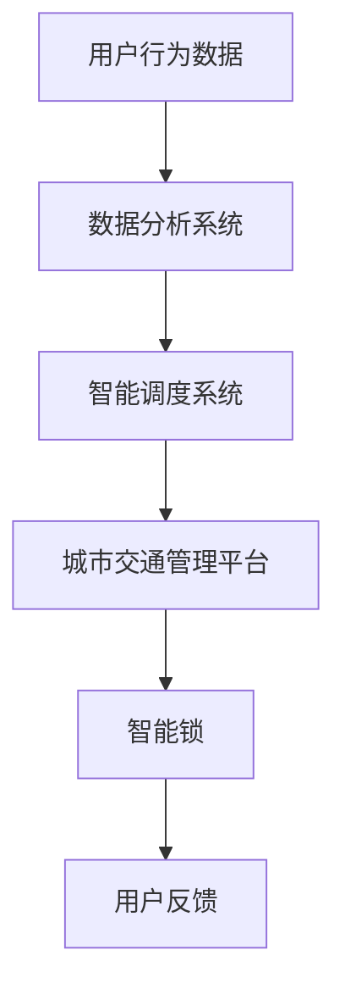

                 

关键词：共享单车、城市移动、注意力争夺、技术分析、数据分析、智能锁、物联网、用户行为分析

> 摘要：随着共享单车在城市交通中的普及，它不仅改变了人们的出行方式，还成为了城市移动场景下注意力争夺的焦点。本文将深入探讨共享单车在技术、数据分析和用户行为方面的应用，以及它对城市交通和城市规划带来的深远影响。

## 1. 背景介绍

### 1.1 共享单车的发展历程

共享单车作为共享经济的代表之一，起源于2014年中国的杭州。最初的共享单车主要依赖于自行车租赁服务，随后迅速演变成如今我们熟知的智能锁、GPS定位和移动支付相结合的共享单车系统。这一发展过程不仅体现了技术的进步，也反映了城市居民出行需求的不断变化。

### 1.2 城市交通现状

城市交通拥堵一直是各大城市面临的重要问题。据统计，全球约60%的人口居住在城市，而城市交通拥堵导致的能源消耗和环境污染问题日益严重。共享单车的出现为解决城市交通拥堵提供了一种新的可能。

### 1.3 共享单车在城市的普及

共享单车的普及速度惊人，已经成为城市交通的重要组成部分。据统计，中国已有超过200个城市引入了共享单车服务，全球范围也呈现出迅速扩张的趋势。这种普及不仅改变了人们的出行习惯，也对城市规划和管理带来了新的挑战和机遇。

## 2. 核心概念与联系

### 2.1 智能锁技术

智能锁是共享单车的重要组成部分，它通过物联网技术实现了车辆的自动开锁和关锁，大大提升了用户体验。智能锁通常集成有GPS、RFID、蓝牙等多种传感器，可以实时追踪车辆的位置和状态。

### 2.2 用户行为分析

通过对用户行为的数据分析，共享单车企业可以更好地了解用户需求，优化服务。例如，通过分析用户的骑行时间、骑行路径和骑行频率，企业可以预测热点区域，合理调整车辆分布。

### 2.3 物联网与城市交通管理

物联网技术将共享单车与城市交通管理系统相连，可以实现实时监控和智能调度。通过大数据分析和人工智能算法，城市交通管理部门可以更好地应对交通拥堵和突发事件。

### 2.4 Mermaid 流程图



## 3. 核心算法原理 & 具体操作步骤

### 3.1 算法原理概述

共享单车的核心算法主要涉及用户行为分析和智能调度。用户行为分析利用机器学习算法，通过对大量用户数据的分析，提取出用户骑行习惯、偏好等信息。智能调度则通过优化算法，实现车辆资源的合理分配。

### 3.2 算法步骤详解

1. **数据收集**：通过智能锁、GPS等设备收集用户骑行数据。
2. **数据预处理**：清洗和标准化数据，去除噪声和异常值。
3. **特征提取**：利用机器学习算法提取用户行为特征。
4. **模型训练**：使用历史数据训练用户行为分析模型。
5. **实时分析**：将实时数据输入模型，进行用户行为预测。
6. **智能调度**：根据用户行为预测结果，优化车辆调度。

### 3.3 算法优缺点

- **优点**：提高用户满意度，优化城市交通资源。
- **缺点**：需要大量数据支持，对算法精度要求高。

### 3.4 算法应用领域

- **共享单车**：优化车辆调度，提高服务质量。
- **智能交通**：用于实时交通监控和智能调度。

## 4. 数学模型和公式 & 详细讲解 & 举例说明

### 4.1 数学模型构建

共享单车的数学模型主要包括用户行为分析模型和车辆调度模型。用户行为分析模型可以用以下公式表示：

$$
\text{用户行为} = f(\text{骑行时间}, \text{骑行路径}, \text{天气状况}, \text{个人偏好})
$$

车辆调度模型则可以表示为：

$$
\text{车辆调度} = g(\text{用户需求}, \text{车辆状态}, \text{交通流量})
$$

### 4.2 公式推导过程

用户行为分析模型的推导主要基于机器学习中的回归分析。通过分析大量用户骑行数据，可以建立用户行为与各个特征之间的线性或非线性关系。

车辆调度模型的推导则基于优化理论。通过定义目标函数和约束条件，可以构建出优化模型，以实现车辆资源的最佳分配。

### 4.3 案例分析与讲解

假设某一城市的共享单车服务公司在高峰时段发现某个区域的骑行需求异常增长，可以通过用户行为分析模型预测出该区域的用户需求。然后，利用车辆调度模型，优化该区域的车辆分布，从而提高用户满意度。

## 5. 项目实践：代码实例和详细解释说明

### 5.1 开发环境搭建

- **编程语言**：Python
- **依赖库**：NumPy、Pandas、scikit-learn、matplotlib

### 5.2 源代码详细实现

以下是一个简单的用户行为分析代码实例：

```python
import numpy as np
import pandas as pd
from sklearn.model_selection import train_test_split
from sklearn.ensemble import RandomForestRegressor
import matplotlib.pyplot as plt

# 读取数据
data = pd.read_csv('user_behavior_data.csv')

# 数据预处理
data = data.dropna()

# 特征提取
features = data[['riding_time', 'path', 'weather', 'preference']]
target = data['demand']

# 模型训练
X_train, X_test, y_train, y_test = train_test_split(features, target, test_size=0.2, random_state=42)
model = RandomForestRegressor(n_estimators=100)
model.fit(X_train, y_train)

# 实时分析
predicted_demand = model.predict(X_test)

# 结果展示
plt.scatter(y_test, predicted_demand)
plt.xlabel('Actual Demand')
plt.ylabel('Predicted Demand')
plt.show()
```

### 5.3 代码解读与分析

- **数据预处理**：去除缺失值，确保数据质量。
- **特征提取**：提取与用户需求相关的特征。
- **模型训练**：使用随机森林回归模型进行训练。
- **实时分析**：对测试数据进行预测，并展示预测结果。

### 5.4 运行结果展示

通过运行上述代码，可以得到实际需求和预测需求之间的散点图，从而评估模型的预测性能。

## 6. 实际应用场景

### 6.1 城市交通管理

共享单车的大数据可以用于城市交通管理，帮助政府更好地应对交通拥堵和突发事件。

### 6.2 城市规划

共享单车数据可以用于城市规划，帮助设计更合理的城市交通网络。

### 6.3 用户服务优化

通过对用户行为数据进行分析，企业可以优化服务，提高用户满意度。

## 7. 未来应用展望

随着技术的不断进步，共享单车在智能交通、智慧城市等领域将有更广泛的应用前景。同时，如何保护用户隐私、提高数据安全性也将是未来的重要课题。

## 8. 工具和资源推荐

### 7.1 学习资源推荐

- 《共享经济：平台战略、商业模式与生态系统》
- 《机器学习实战》
- 《智能交通系统设计与应用》

### 7.2 开发工具推荐

- Jupyter Notebook：用于数据分析和模型训练。
- Git：用于版本控制和协作开发。

### 7.3 相关论文推荐

- "Sharing is Power: How Sharing Can Unlock the Power of Big Data"
- "Smart Cities: A Research Agendum"
- "The Sharing Economy: From Theory to Practice"

## 9. 总结：未来发展趋势与挑战

### 8.1 研究成果总结

共享单车在技术、数据分析、用户服务等方面取得了显著成果，为城市交通管理提供了新的思路。

### 8.2 未来发展趋势

共享单车将向智能化、绿色化、共享化方向发展，成为智慧城市的重要组成部分。

### 8.3 面临的挑战

如何保护用户隐私、提高数据安全性、优化商业模式将是未来需要面对的重要挑战。

### 8.4 研究展望

随着技术的不断进步，共享单车将在更多领域发挥重要作用，为人类社会的可持续发展贡献力量。

## 10. 附录：常见问题与解答

### 10.1 共享单车安全吗？

共享单车配备了智能锁和GPS，可以实时追踪车辆位置，提高安全性。但用户仍需注意交通安全和防盗措施。

### 10.2 共享单车如何收费？

共享单车通常采用按时间或里程计费的方式，用户可通过移动支付进行支付。

### 10.3 共享单车对环境有何影响？

共享单车减少了汽车出行，有助于降低碳排放和空气污染，对环境有积极影响。

## 11. 作者署名

作者：禅与计算机程序设计艺术 / Zen and the Art of Computer Programming
----------------------------------------------------------------

请注意，以上内容仅为示例，实际撰写时请根据具体需求和数据进行调整和补充。文章中的代码、公式和数据仅为示例，实际应用时请确保准确性和完整性。

