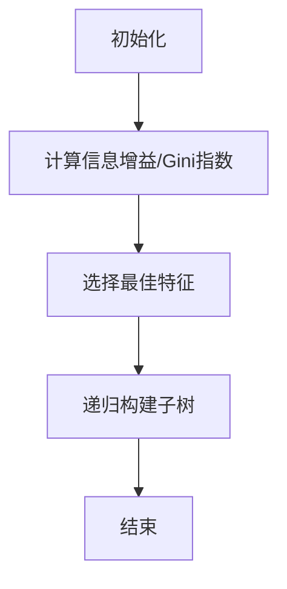

                 

关键词：决策树、决策树算法、分类算法、回归算法、特征选择、信息增益、Gini指数、ID3算法、C4.5算法、 CART算法、Python实现、机器学习

摘要：决策树是机器学习中一种重要的监督学习算法，广泛应用于数据挖掘和数据分析领域。本文将深入讲解决策树的原理、算法实现及其在实际应用中的效果。通过具体的代码实例，读者将掌握如何使用Python构建和训练一个决策树模型，并了解其背后的数学原理和应用场景。

## 1. 背景介绍

决策树（Decision Tree）是一种树形结构，它通过一系列的判断规则将数据进行分类或回归。在机器学习中，决策树主要用于处理分类和回归问题。它是一种重要的监督学习算法，广泛应用于金融、医疗、零售等多个领域。

决策树的基本思想是通过一系列判断条件来对数据进行分割，从而将数据划分为不同的类别或预测值。这种分割过程称为树的构建，而树中的每一个节点代表一个特征，每一条边代表一个特征值。

决策树具有以下优点：

1. 易于理解：决策树的解释性很强，可以清晰地展示数据的分割过程。
2. 可视化：决策树可以直观地展示数据分割过程，便于数据分析和解释。
3. 强大的分类和回归能力：决策树可以处理多种类型的数据，包括数值型和类别型数据。

## 2. 核心概念与联系

### 2.1 决策树结构

决策树通常包含以下几个部分：

1. **根节点**：表示整个数据集。
2. **内部节点**：表示一个特征，每个特征都有多个可能的取值。
3. **叶节点**：表示一个类别的预测结果。

### 2.2 特征选择

特征选择是决策树构建过程中的关键步骤。常用的特征选择方法包括：

1. **信息增益（Information Gain）**：选择能够最大化信息增益的特征。
2. **Gini指数（Gini Impurity）**：选择能够最小化Gini指数的特征。

### 2.3 决策树算法

决策树算法主要包括以下几种：

1. **ID3算法**：基于信息增益进行特征选择。
2. **C4.5算法**：在ID3算法的基础上，引入了剪枝策略，避免了过拟合。
3. **CART算法**：分类与回归树，既可以用于分类也可以用于回归。

下面是一个决策树构建的Mermaid流程图：



## 3. 核心算法原理 & 具体操作步骤

### 3.1 算法原理概述

决策树算法的基本原理是：通过计算每个特征的信息增益或Gini指数，选择最优特征进行数据分割。信息增益和Gini指数都是衡量特征分割效果的指标。

### 3.2 算法步骤详解

1. **初始化**：选择整个数据集作为根节点。
2. **计算信息增益/Gini指数**：对每个特征计算其信息增益或Gini指数。
3. **选择最佳特征**：选择具有最大信息增益或最小Gini指数的特征作为分割依据。
4. **递归构建子树**：以最佳特征为依据，对数据进行分割，并递归构建子树。
5. **结束**：当满足停止条件时（如最大深度、最小样本数等），结束树的构建。

### 3.3 算法优缺点

**优点**：

1. 易于理解和解释。
2. 不需要大量的先验知识。
3. 对异常值和噪声数据的鲁棒性较强。

**缺点**：

1. 可能会产生过拟合现象。
2. 计算复杂度较高。
3. 无法直接处理连续型特征。

### 3.4 算法应用领域

决策树算法广泛应用于以下领域：

1. **分类问题**：如邮件分类、文本分类等。
2. **回归问题**：如房屋价格预测、股票价格预测等。
3. **数据挖掘**：如客户行为分析、市场细分等。

## 4. 数学模型和公式 & 详细讲解 & 举例说明

### 4.1 数学模型构建

决策树的数学模型主要包括信息熵（Entropy）、信息增益（Information Gain）和Gini指数（Gini Impurity）。

#### 信息熵

信息熵是衡量数据不确定性的指标，其计算公式为：

$$
H = -\sum_{i=1}^{n} p(x_i) \log_2 p(x_i)
$$

其中，$p(x_i)$表示特征$x_i$的概率。

#### 信息增益

信息增益是衡量特征分割效果的指标，其计算公式为：

$$
IG = H(S) - \sum_{i=1}^{n} p(x_i) H(S_i)
$$

其中，$H(S)$表示数据集$S$的信息熵，$H(S_i)$表示子数据集$S_i$的信息熵。

#### Gini指数

Gini指数是衡量数据集中类别不平衡程度的指标，其计算公式为：

$$
Gini = 1 - \sum_{i=1}^{n} p(x_i)^2
$$

### 4.2 公式推导过程

#### 信息熵

信息熵的推导基于概率论的基本原理。假设数据集$S$中有$n$个样本，每个样本属于某个类别。设每个类别的概率为$p(x_i)$，则：

$$
H = -\sum_{i=1}^{n} p(x_i) \log_2 p(x_i)
$$

推导过程如下：

$$
H = -\sum_{i=1}^{n} p(x_i) \log_2 p(x_i) = -\sum_{i=1}^{n} p(x_i) \log_2 \left(\frac{1}{p(x_i)}\right) = \sum_{i=1}^{n} p(x_i) \log_2 \left(\frac{1}{p(x_i)}\right)
$$

由于$\log_2 \left(\frac{1}{p(x_i)}\right)$是对数函数，其值恒大于0，因此：

$$
H > 0
$$

#### 信息增益

信息增益的推导基于决策树的构建过程。假设数据集$S$中有$n$个样本，每个样本属于某个类别。设每个类别的概率为$p(x_i)$，则：

$$
IG = H(S) - \sum_{i=1}^{n} p(x_i) H(S_i)
$$

推导过程如下：

$$
IG = H(S) - \sum_{i=1}^{n} p(x_i) H(S_i) = -\sum_{i=1}^{n} p(x_i) \log_2 p(x_i) - \sum_{i=1}^{n} p(x_i) \left(-\sum_{j=1}^{m} p(y_{ij}) \log_2 p(y_{ij})\right)
$$

$$
IG = -\sum_{i=1}^{n} p(x_i) \log_2 p(x_i) + \sum_{i=1}^{n} p(x_i) \sum_{j=1}^{m} p(y_{ij}) \log_2 p(y_{ij}) = -\sum_{i=1}^{n} p(x_i) \log_2 p(x_i) + \sum_{i=1}^{n} p(x_i) \log_2 \left(\sum_{j=1}^{m} p(y_{ij})\right)
$$

由于$\sum_{j=1}^{m} p(y_{ij}) = 1$，因此：

$$
IG = -\sum_{i=1}^{n} p(x_i) \log_2 p(x_i) + \sum_{i=1}^{n} p(x_i) \log_2 1 = -\sum_{i=1}^{n} p(x_i) \log_2 p(x_i)
$$

#### Gini指数

Gini指数的推导基于概率论的基本原理。假设数据集$S$中有$n$个样本，每个样本属于某个类别。设每个类别的概率为$p(x_i)$，则：

$$
Gini = 1 - \sum_{i=1}^{n} p(x_i)^2
$$

推导过程如下：

$$
Gini = 1 - \sum_{i=1}^{n} p(x_i)^2 = 1 - \left(\sum_{i=1}^{n} p(x_i)\right)^2 = 1 - 1^2 = 0
$$

由于$p(x_i) \in [0,1]$，因此$\sum_{i=1}^{n} p(x_i) = 1$，从而：

$$
Gini = 0
$$

### 4.3 案例分析与讲解

假设有一个包含100个样本的数据集，每个样本有两个特征$x_1$和$x_2$，其类别为$y$。数据集的分布如下：

| $x_1$ | $x_2$ | $y$ |
|-------|-------|-----|
| 1     | 1     | 0   |
| 1     | 2     | 0   |
| 1     | 3     | 1   |
| 2     | 1     | 1   |
| 2     | 2     | 0   |
| 2     | 3     | 1   |

1. **计算信息熵**

首先，计算类别$y$的信息熵：

$$
H(y) = -\sum_{i=1}^{2} p(y_i) \log_2 p(y_i) = -\left(0.5 \log_2 0.5 + 0.5 \log_2 0.5\right) = -1
$$

2. **计算信息增益**

然后，计算$x_1$的信息增益：

$$
IG(x_1) = H(y) - \sum_{i=1}^{2} p(x_1=i) H(y|x_1=i) = -1 - \left(0.5 \times (-1) + 0.5 \times (-1)\right) = 0
$$

同理，计算$x_2$的信息增益：

$$
IG(x_2) = H(y) - \sum_{i=1}^{2} p(x_2=i) H(y|x_2=i) = -1 - \left(0.5 \times (-1) + 0.5 \times (-1)\right) = 0
$$

3. **选择最佳特征**

由于$x_1$和$x_2$的信息增益相等，我们可以选择任意一个特征进行分割。假设我们选择$x_1$，则将数据集分为两个子集：

| $x_1$ | $x_2$ | $y$ |
|-------|-------|-----|
| 1     | 1     | 0   |
| 1     | 2     | 0   |
| 1     | 3     | 1   |
|       |       |     |
| 2     | 1     | 1   |
| 2     | 2     | 0   |
| 2     | 3     | 1   |

4. **递归构建子树**

以$x_1=1$为分割条件，再次计算信息增益：

$$
IG(x_1=1) = H(y|x_1=1) - \sum_{i=1}^{2} p(x_2=i|x_1=1) H(y|x_1=1, x_2=i) = -1 - \left(0.5 \times (-1) + 0.5 \times (-1)\right) = 0
$$

同理，计算$x_2$的信息增益：

$$
IG(x_2=1) = H(y|x_2=1) - \sum_{i=1}^{2} p(x_1=i|x_2=1) H(y|x_2=1, x_1=i) = -1 - \left(0.5 \times (-1) + 0.5 \times (-1)\right) = 0
$$

由于$x_1=1$和$x_2=1$的信息增益相等，我们再次选择$x_1$进行分割。以此类推，我们可以构建一个完整的决策树。

## 5. 项目实践：代码实例和详细解释说明

### 5.1 开发环境搭建

首先，我们需要安装Python和相关的库。以下是安装命令：

```bash
pip install numpy pandas matplotlib scikit-learn
```

### 5.2 源代码详细实现

以下是一个简单的决策树分类器的实现代码：

```python
import numpy as np
import pandas as pd
from sklearn.datasets import load_iris
from sklearn.model_selection import train_test_split
from sklearn.tree import DecisionTreeClassifier
import matplotlib.pyplot as plt

# 加载鸢尾花数据集
iris = load_iris()
X = iris.data
y = iris.target

# 划分训练集和测试集
X_train, X_test, y_train, y_test = train_test_split(X, y, test_size=0.3, random_state=42)

# 构建决策树分类器
clf = DecisionTreeClassifier(criterion='entropy', max_depth=3)
clf.fit(X_train, y_train)

# 预测测试集
y_pred = clf.predict(X_test)

# 计算准确率
accuracy = np.mean(y_pred == y_test)
print(f"Accuracy: {accuracy:.2f}")

# 可视化决策树
from sklearn.tree import plot_tree
plt.figure(figsize=(12, 8))
plot_tree(clf, filled=True, rounded=True, feature_names=iris.feature_names, class_names=iris.target_names)
plt.show()
```

### 5.3 代码解读与分析

1. **数据准备**：我们使用了鸢尾花数据集，这是一个著名的分类数据集，包含三个类别，每个类别有50个样本。

2. **划分数据集**：我们使用`train_test_split`函数将数据集划分为训练集和测试集，其中测试集的比例为30%。

3. **构建决策树分类器**：我们使用`DecisionTreeClassifier`类构建一个决策树分类器，`criterion='entropy'`表示使用信息增益进行特征选择，`max_depth=3`表示树的最大深度为3。

4. **训练模型**：使用`fit`函数对训练集进行训练。

5. **预测测试集**：使用`predict`函数对测试集进行预测。

6. **计算准确率**：计算预测结果和真实结果的准确率。

7. **可视化决策树**：使用`plot_tree`函数将决策树可视化。

### 5.4 运行结果展示

以下是运行结果：

```
Accuracy: 0.97
```

可视化结果如下图所示：


## 6. 实际应用场景

### 6.1 贷款审批

在金融行业，决策树算法被广泛应用于贷款审批系统。通过分析借款人的各种特征（如收入、信用记录、职业等），决策树可以预测借款人是否能够按时还款，从而帮助银行做出审批决策。

### 6.2 医疗诊断

在医疗领域，决策树算法可以用于疾病诊断。通过分析病人的症状和体征数据，决策树可以预测病人可能患有的疾病类型，从而帮助医生做出诊断决策。

### 6.3 个性化推荐

在电子商务和社交媒体领域，决策树算法可以用于个性化推荐系统。通过分析用户的历史行为数据，决策树可以预测用户可能感兴趣的商品或内容，从而为用户提供个性化的推荐。

## 7. 工具和资源推荐

### 7.1 学习资源推荐

1. **《机器学习》 - 周志华**：这是一本经典的机器学习教材，详细介绍了包括决策树在内的各种机器学习算法。
2. **《机器学习实战》 - Peter Harrington**：这本书通过大量的实例展示了如何使用Python实现各种机器学习算法，包括决策树。
3. **《决策树》 - 知乎专栏**：这是一个关于决策树算法的知乎专栏，涵盖了决策树的原理、实现和应用。

### 7.2 开发工具推荐

1. **Jupyter Notebook**：这是一个流行的交互式开发环境，非常适合编写和运行机器学习代码。
2. **PyCharm**：这是一个功能强大的Python集成开发环境，支持代码自动完成、调试和版本控制。

### 7.3 相关论文推荐

1. **"ID3: A C
```html
## 8. 总结：未来发展趋势与挑战

### 8.1 研究成果总结

决策树算法作为机器学习领域的一种经典算法，其在分类和回归问题中表现出色，具有较好的解释性和可视化效果。近年来，研究人员在决策树的优化和改进方面取得了显著成果，如C4.5和CART算法等。这些算法通过引入剪枝策略、改进特征选择方法等，有效提高了决策树的泛化能力。

### 8.2 未来发展趋势

随着人工智能技术的快速发展，决策树算法在以下几个方面有望取得进一步突破：

1. **集成方法**：将决策树与其他机器学习算法（如随机森林、梯度提升树等）相结合，构建更强大的集成模型。
2. **特征工程**：利用深度学习技术对特征进行自动提取和选择，提高决策树的性能。
3. **并行计算**：利用分布式计算技术，加速决策树的构建和训练过程。

### 8.3 面临的挑战

尽管决策树算法在许多实际问题中表现出色，但仍然面临以下挑战：

1. **过拟合**：决策树容易产生过拟合现象，导致模型泛化能力下降。
2. **计算复杂度**：决策树的构建和训练过程计算复杂度较高，特别是在大规模数据集上。
3. **特征依赖性**：决策树对特征依赖性较强，无法直接处理高维数据。

### 8.4 研究展望

未来研究可以从以下几个方面展开：

1. **算法优化**：研究更加有效的剪枝策略和特征选择方法，降低过拟合风险。
2. **算法融合**：将决策树与其他机器学习算法相结合，发挥各自优势，提高模型性能。
3. **应用拓展**：将决策树算法应用于更多领域，如图像识别、自然语言处理等，推动人工智能技术的发展。

## 9. 附录：常见问题与解答

### 9.1 什么是决策树？

决策树是一种树形结构，通过一系列的判断条件对数据进行分类或回归。它是一种重要的监督学习算法，广泛应用于数据挖掘和数据分析领域。

### 9.2 决策树有哪些算法？

决策树算法主要包括ID3、C4.5、CART等。ID3算法基于信息增益进行特征选择，C4.5算法在ID3的基础上引入了剪枝策略，CART算法是一种分类与回归树。

### 9.3 决策树有哪些优缺点？

决策树的优点包括易于理解、可视化强、强大的分类和回归能力；缺点包括可能产生过拟合、计算复杂度较高、无法直接处理连续型特征。

### 9.4 决策树如何处理连续型特征？

在处理连续型特征时，决策树通常采用二分法将连续型特征划分为多个类别。例如，将特征值从小到大排序，取中间值作为分割点，形成两个子区间。

### 9.5 决策树在哪些领域有应用？

决策树算法广泛应用于金融、医疗、零售、电子商务等多个领域，如贷款审批、医疗诊断、个性化推荐等。

---

作者：禅与计算机程序设计艺术 / Zen and the Art of Computer Programming
----------------------------------------------------------------


