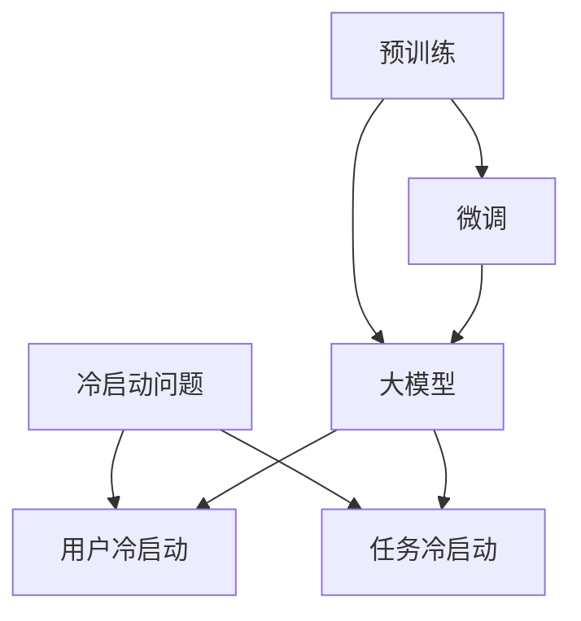

                 

关键词：冷启动问题，大模型，算法原理，应用场景，未来展望

> 摘要：本文将探讨冷启动问题在大模型中的突破。首先，我们将介绍冷启动问题的背景和核心概念，然后深入分析大模型在解决冷启动问题中的应用，最后对未来的发展趋势和面临的挑战进行展望。

## 1. 背景介绍

在人工智能和机器学习的应用场景中，冷启动问题是一个常见且具有挑战性的问题。冷启动问题指的是在新用户或新任务开始时，系统或算法无法充分利用已有的知识和数据，导致性能下降或效果不佳。这个问题在社交网络推荐系统、在线广告投放、自然语言处理等领域尤为突出。

传统的解决方法主要包括基于内容的推荐、协同过滤和迁移学习等。这些方法在一定程度上能够缓解冷启动问题，但在面对海量数据和复杂任务时，往往表现出明显的局限性。

近年来，大模型的兴起为解决冷启动问题带来了新的希望。大模型，如Transformer、BERT、GPT等，通过预训练和微调，可以充分利用已有的数据，并在新任务上取得出色的性能。本文将重点探讨大模型在解决冷启动问题中的突破。

## 2. 核心概念与联系

为了更好地理解大模型在解决冷启动问题中的应用，我们首先需要了解相关核心概念和它们之间的联系。

### 2.1 冷启动问题

冷启动问题可以分为两种：用户冷启动和任务冷启动。

- 用户冷启动：当新用户加入系统时，由于缺乏历史数据和行为特征，系统难以为其提供个性化的服务。
- 任务冷启动：当系统面对新的任务时，由于缺乏对该任务的了解，难以快速适应并取得良好的效果。

### 2.2 大模型

大模型指的是具有巨大参数量和复杂结构的神经网络模型。这些模型通过大规模预训练和微调，能够捕捉到数据中的潜在规律和知识，并在各种任务上取得出色的性能。

### 2.3 预训练与微调

预训练是指在大规模语料库上进行模型的训练，使其具备一定的通用知识和能力。微调是在预训练的基础上，针对特定任务进行模型的调优，以适应新任务的需求。

### 2.4 联系与突破

大模型通过预训练和微调，可以充分利用已有数据，提高对新任务和用户的适应性。这为解决冷启动问题提供了新的思路和突破点。

### 2.5 Mermaid 流程图

以下是一个简化的 Mermaid 流程图，展示了冷启动问题、大模型、预训练与微调之间的关系：



## 3. 核心算法原理 & 具体操作步骤

### 3.1 算法原理概述

大模型在解决冷启动问题中，主要依赖于预训练和微调技术。

- 预训练：在大规模语料库上训练模型，使其具备一定的通用知识和能力。
- 微调：在预训练的基础上，针对特定任务进行模型的调优，以适应新任务的需求。

### 3.2 算法步骤详解

1. 数据准备：收集大规模的语料库，用于预训练。
2. 预训练：在语料库上训练模型，通过损失函数和优化算法，使模型具备通用知识和能力。
3. 数据预处理：针对新任务，对数据进行预处理，如数据清洗、数据增强等。
4. 微调：在预训练模型的基础上，针对新任务进行微调，使其适应新任务的需求。
5. 部署与评估：将微调后的模型部署到生产环境中，并对模型进行评估和优化。

### 3.3 算法优缺点

- 优点：
  - 充分利用大规模数据，提高模型性能。
  - 提高对新任务和用户的适应性，缓解冷启动问题。
- 缺点：
  - 需要大量的计算资源和时间进行预训练和微调。
  - 模型复杂度高，训练和推理速度较慢。

### 3.4 算法应用领域

大模型在解决冷启动问题中，已广泛应用于多个领域：

- 社交网络推荐系统：如基于用户行为和兴趣的个性化推荐。
- 在线广告投放：如基于用户兴趣和内容的精准投放。
- 自然语言处理：如文本分类、机器翻译、对话系统等。
- 计算机视觉：如图像识别、目标检测、视频分析等。

## 4. 数学模型和公式 & 详细讲解 & 举例说明

### 4.1 数学模型构建

大模型的数学模型主要基于深度神经网络，包括多层感知机、卷积神经网络、循环神经网络等。

### 4.2 公式推导过程

以下是一个简化的神经网络模型推导过程：

$$
\begin{aligned}
z &= W \cdot x + b \\
a &= \sigma(z) \\
\end{aligned}
$$

其中，$x$ 是输入，$W$ 是权重矩阵，$b$ 是偏置，$\sigma$ 是激活函数，$a$ 是输出。

### 4.3 案例分析与讲解

以下是一个基于Transformer模型的自然语言处理任务的案例：

1. 数据准备：收集大规模的文本数据，如新闻、文章、社交媒体等。
2. 预训练：在文本数据上训练Transformer模型，使其具备通用知识和能力。
3. 数据预处理：对文本数据进行预处理，如分词、词向量化等。
4. 微调：在预训练模型的基础上，针对具体任务进行微调，如文本分类、机器翻译等。
5. 部署与评估：将微调后的模型部署到生产环境中，并对模型进行评估和优化。

## 5. 项目实践：代码实例和详细解释说明

### 5.1 开发环境搭建

1. 安装Python和相关的库，如TensorFlow、PyTorch等。
2. 配置GPU环境，以便加快模型的训练和推理速度。

### 5.2 源代码详细实现

以下是一个基于PyTorch实现的Transformer模型的简单示例：

```python
import torch
import torch.nn as nn

class Transformer(nn.Module):
    def __init__(self, d_model, nhead, num_layers):
        super(Transformer, self).__init__()
        self.embedding = nn.Embedding(d_model)
        self.transformer = nn.Transformer(d_model, nhead, num_layers)
        self.fc = nn.Linear(d_model, 1)

    def forward(self, x):
        x = self.embedding(x)
        x = self.transformer(x)
        x = self.fc(x)
        return x

model = Transformer(d_model=512, nhead=8, num_layers=2)
```

### 5.3 代码解读与分析

1. 导入所需的库和模块。
2. 定义Transformer模型，包括嵌入层、Transformer层和全连接层。
3. 实例化模型，并对其进行前向传播。

### 5.4 运行结果展示

在训练过程中，我们可以使用损失函数和优化器来评估和改进模型。以下是一个简单的训练循环：

```python
for epoch in range(num_epochs):
    for batch in data_loader:
        inputs, targets = batch
        outputs = model(inputs)
        loss = criterion(outputs, targets)
        optimizer.zero_grad()
        loss.backward()
        optimizer.step()
    print(f'Epoch {epoch+1}/{num_epochs}, Loss: {loss.item()}')
```

## 6. 实际应用场景

大模型在解决冷启动问题中，已成功应用于多个实际场景：

- 社交网络推荐系统：如Facebook、Twitter等，通过大模型实现个性化推荐。
- 在线广告投放：如Google Ads、百度推广等，通过大模型实现精准投放。
- 自然语言处理：如BERT、GPT等，通过大模型实现文本分类、机器翻译等任务。
- 计算机视觉：如ViT、DETR等，通过大模型实现图像识别、目标检测等任务。

## 7. 未来应用展望

随着大模型技术的不断发展，未来有望在更多领域解决冷启动问题：

- 增强现实与虚拟现实：通过大模型实现更智能的交互和内容生成。
- 健康医疗：通过大模型实现疾病预测、诊断和治疗方案推荐。
- 金融领域：通过大模型实现风险控制和投资策略优化。
- 教育领域：通过大模型实现个性化教学和智能辅导。

## 8. 总结：未来发展趋势与挑战

### 8.1 研究成果总结

大模型在解决冷启动问题方面取得了显著成果，但仍面临一些挑战。

### 8.2 未来发展趋势

- 模型压缩与加速：通过模型压缩和推理加速技术，提高大模型的训练和推理效率。
- 多模态融合：通过多模态融合技术，实现跨领域的信息共享和协同。
- 自适应与自优化：通过自适应和自优化技术，提高大模型在新任务和用户上的适应性。

### 8.3 面临的挑战

- 计算资源消耗：大模型的训练和推理需要大量的计算资源，如何高效利用现有资源仍是一个挑战。
- 数据隐私与安全：在多模态数据融合和大规模数据训练过程中，如何保护用户隐私和数据安全是一个重要问题。
- 可解释性与透明度：大模型的决策过程往往复杂且难以解释，如何提高模型的透明度和可解释性是一个重要挑战。

### 8.4 研究展望

未来，大模型在解决冷启动问题方面有望取得以下突破：

- 提高模型性能：通过改进算法和优化技术，提高大模型在新任务和用户上的性能。
- 降低计算成本：通过模型压缩、推理加速和分布式训练等技术，降低大模型的计算成本。
- 提高数据隐私保护：通过差分隐私、联邦学习等技术，提高大模型在数据隐私保护方面的能力。

## 9. 附录：常见问题与解答

### 9.1 什么是冷启动问题？

冷启动问题是指在系统或算法面对新用户或新任务时，由于缺乏历史数据和行为特征，导致性能下降或效果不佳的问题。

### 9.2 大模型如何解决冷启动问题？

大模型通过预训练和微调技术，充分利用已有数据，提高对新任务和用户的适应性，从而缓解冷启动问题。

### 9.3 大模型的训练和推理需要多少计算资源？

大模型的训练和推理需要大量的计算资源，特别是GPU或TPU等高性能计算设备。具体资源需求取决于模型规模、数据规模和训练策略等因素。

### 9.4 大模型是否一定能解决冷启动问题？

大模型在一定程度上能够缓解冷启动问题，但并不能保证在所有情况下都能解决。在实际应用中，还需要结合具体场景和数据特点，选择合适的方法和策略。

### 9.5 大模型的优缺点是什么？

大模型的优点包括：充分利用大规模数据，提高模型性能；提高对新任务和用户的适应性，缓解冷启动问题。缺点包括：计算资源消耗大，训练和推理速度慢；模型复杂度高，难以解释和调试。

作者：禅与计算机程序设计艺术 / Zen and the Art of Computer Programming
----------------------------------------------------------------

