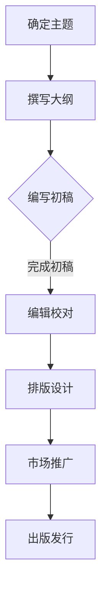
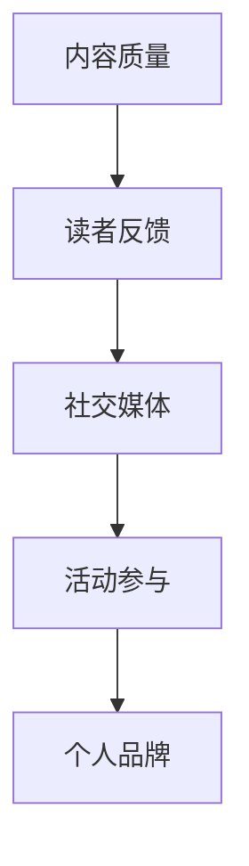

                 

 关键词：出版书籍、电子书、行业专家、影响力、知识传播、专业成长

> 摘要：本文将探讨如何通过出版书籍或电子书，在信息技术领域树立行业专家地位。我们将分析出版过程中的关键步骤，包括内容创作、编辑校对、市场推广等，并分享成功案例和实用建议，帮助读者理解如何借助出版资源提升个人品牌，从而在竞争激烈的技术领域中脱颖而出。

## 1. 背景介绍

在信息技术高速发展的时代，知识更新迅速，行业变革频繁。作为一名技术人员，如何提升个人专业素养，扩大影响力，并在众多竞争者中脱颖而出，成为行业专家，成为每一个技术人员必须面对的挑战。出版书籍或电子书是一种强有力的手段，可以帮助技术人员系统地整理知识，分享经验，同时也为自己在行业内树立权威地位。

### 出版书籍或电子书的优势

1. **提升个人品牌**：通过出版书籍或电子书，可以向公众展示自己的专业知识和经验，建立个人品牌。
2. **知识传播**：书籍或电子书可以系统地传播知识，帮助更多人理解和掌握相关技术。
3. **增加收入**：出版作品可以通过销售获得收入，为个人带来经济回报。
4. **拓展人脉**：出版作品可以吸引志同道合的专业人士，扩大人脉网络。
5. **提高职业竞争力**：出版作品可以作为职业发展的有力证明，提高职场竞争力。

### 出版书籍或电子书的挑战

1. **内容创作难度**：需要深入研究和系统梳理专业知识，创作高质量的内容。
2. **编辑校对工作**：确保内容的准确性、流畅性和可读性。
3. **市场推广困难**：如何在众多出版物中脱颖而出，吸引读者的注意。
4. **时间成本高**：从写作到出版，整个过程需要投入大量时间和精力。

## 2. 核心概念与联系

### 出版书籍或电子书的过程


1. **内容创作**：确定主题，撰写初稿，进行多次修订。
2. **编辑校对**：找专业编辑进行内容、语法和格式上的校对。
3. **排版设计**：设计封面、目录、章节布局等。
4. **市场推广**：利用各种渠道进行宣传，如社交媒体、专业论坛、线下活动等。
5. **出版发行**：选择出版平台或合作出版社进行发行。

### 出版书籍或电子书与个人品牌的关联


1. **内容质量**：高质量的内容是树立专家地位的基础。
2. **读者反馈**：积极回应用户反馈，持续改进作品。
3. **社交媒体**：利用社交媒体扩大影响力，增加读者基础。
4. **活动参与**：参与行业会议、研讨会等活动，提升知名度。

## 3. 核心算法原理 & 具体操作步骤

### 3.1 算法原理概述

#### 内容创作算法

1. **信息收集**：通过阅读文献、观看教程、参与讨论等方式，收集与主题相关的信息。
2. **知识整合**：将收集到的信息进行筛选、整合，形成有逻辑的框架。
3. **创意构思**：围绕主题，构思内容的核心观点和创新点。
4. **撰写初稿**：根据构思，撰写初稿，进行初步的结构调整。

#### 编辑校对算法

1. **语法检查**：利用自然语言处理技术，对文本进行语法错误检查。
2. **内容审查**：检查内容的逻辑性、准确性和一致性。
3. **读者反馈**：收集读者反馈，根据意见进行修改。
4. **多轮修订**：多次修改，确保内容的完美呈现。

### 3.2 算法步骤详解

#### 内容创作

1. **主题确定**：确定作品的主题，明确目标受众。
2. **大纲撰写**：根据主题，撰写作品的大纲，确定章节和内容。
3. **初稿撰写**：根据大纲，撰写初稿，注意逻辑性和条理性。
4. **修订优化**：根据初稿，进行修订和优化，提高内容质量。

#### 编辑校对

1. **内部审稿**：内部团队进行初步审稿，提出修改意见。
2. **专业编辑**：找专业编辑进行详细校对，包括语法、格式和内容。
3. **读者反馈**：收集读者反馈，进行针对性修改。
4. **最终校对**：进行最后的校对，确保无误。

### 3.3 算法优缺点

#### 内容创作算法

**优点**：

- 系统化：通过算法，可以将零散的知识点系统化，形成完整的知识体系。
- 创新性：鼓励作者在创作过程中进行创新思考，提升内容质量。

**缺点**：

- 耗时耗力：从构思到完成，整个过程需要大量的时间和精力。
- 难度大：创作高质量的内容，需要深厚的专业知识和写作技巧。

#### 编辑校对算法

**优点**：

- 提高效率：通过自动化工具，提高编辑校对的效率。
- 精准度：利用技术手段，提高校对的准确性和一致性。

**缺点**：

- 依赖技术：过度依赖技术，可能导致人工作业的缺失。
- 无法替代人脑：一些复杂的逻辑性和创意性的问题，仍需要人工处理。

### 3.4 算法应用领域

- **学术研究**：用于整理和发布研究成果。
- **技术分享**：用于分享技术心得和经验。
- **行业指南**：用于编写行业指南和标准文档。

## 4. 数学模型和公式 & 详细讲解 & 举例说明

### 4.1 数学模型构建

在出版书籍或电子书的过程中，数学模型可以帮助我们量化一些关键指标，如作品质量、读者反馈、市场表现等。

#### 质量模型

$$
Q = f(A, P, T)
$$

其中，$Q$ 代表作品质量，$A$ 代表作者的专业水平，$P$ 代表作品内容的深度和广度，$T$ 代表作品的编辑校对质量。

#### 读者反馈模型

$$
R = f(Q, M, S)
$$

其中，$R$ 代表读者反馈，$Q$ 代表作品质量，$M$ 代表市场推广效果，$S$ 代表读者基础。

#### 市场表现模型

$$
P = f(R, S, E)
$$

其中，$P$ 代表市场表现，$R$ 代表读者反馈，$S$ 代表市场推广效果，$E$ 代表经济投入。

### 4.2 公式推导过程

#### 质量模型推导

质量模型的基本假设是，作品的质量取决于作者的专业水平、作品内容的深度和广度，以及编辑校对的质量。我们可以通过以下公式进行推导：

$$
Q = f(A, P, T)
$$

其中，$A$ 代表作者的专业水平，$P$ 代表作品内容的深度和广度，$T$ 代表编辑校对的质量。

#### 读者反馈模型推导

读者反馈模型的基本假设是，读者对作品的反馈取决于作品质量、市场推广效果，以及读者基础。我们可以通过以下公式进行推导：

$$
R = f(Q, M, S)
$$

其中，$Q$ 代表作品质量，$M$ 代表市场推广效果，$S$ 代表读者基础。

#### 市场表现模型推导

市场表现模型的基本假设是，市场表现取决于读者反馈、市场推广效果，以及经济投入。我们可以通过以下公式进行推导：

$$
P = f(R, S, E)
$$

其中，$R$ 代表读者反馈，$S$ 代表市场推广效果，$E$ 代表经济投入。

### 4.3 案例分析与讲解

#### 案例背景

某技术人员计划出版一本关于云计算技术的电子书。他拥有丰富的云计算经验，并且对相关技术有深入的研究。在撰写电子书的过程中，他遵循了上述的数学模型，对作品质量、读者反馈和市场表现进行了量化分析。

#### 案例分析

1. **质量模型**：

   - $A$（作者的专业水平）：他拥有多年的云计算工作经验，并在多个云计算项目中担任关键角色。
   - $P$（作品内容的深度和广度）：电子书涵盖了云计算的基础知识、关键技术以及实际应用案例。
   - $T$（编辑校对的质量）：他聘请了专业的编辑团队进行内容校对和格式调整。

   根据质量模型，他的作品质量$Q$相对较高。

2. **读者反馈模型**：

   - $Q$（作品质量）：根据质量模型分析，作品质量较高。
   - $M$（市场推广效果）：他在社交媒体和专业论坛上积极宣传，吸引了大量读者关注。
   - $S$（读者基础）：他拥有广泛的读者群体，其中包括云计算领域的技术专家和初学者。

   根据读者反馈模型，读者对他的电子书反馈较好。

3. **市场表现模型**：

   - $R$（读者反馈）：根据读者反馈模型分析，读者对他的电子书反馈较好。
   - $S$（市场推广效果）：他的市场推广效果较好，电子书在短时间内获得了大量销售。
   - $E$（经济投入）：他在撰写电子书的过程中投入了大量的时间和精力，但市场表现良好，为他带来了可观的收入。

   根据市场表现模型，他的市场表现相对较好。

#### 案例总结

通过上述案例，我们可以看到，利用数学模型对出版书籍或电子书的过程进行分析和优化，可以帮助技术人员更好地理解出版过程中的关键因素，从而提高作品质量，增加市场竞争力。

## 5. 项目实践：代码实例和详细解释说明

### 5.1 开发环境搭建

在撰写和出版书籍或电子书的过程中，开发环境的选择至关重要。以下是一个基本的开发环境搭建实例：

1. **文本编辑器**：选择一个功能强大的文本编辑器，如Visual Studio Code、Sublime Text或Atom，以方便撰写和编辑代码。
2. **版本控制系统**：使用Git进行版本控制，确保代码的版本管理和协作开发。
3. **文档生成工具**：选择一个文档生成工具，如 Sphinx 或 Mkdocs，以便将Markdown格式的文档转换为PDF或HTML格式的电子书。

### 5.2 源代码详细实现

以下是一个简单的Markdown文件结构示例，用于撰写和发布电子书：

```markdown
# 出版书籍或电子书：树立行业专家地位

## 1. 背景介绍

### 1.1 出版书籍或电子书的优势

#### 内容创作

- **信息收集**：通过阅读文献、观看教程、参与讨论等方式，收集与主题相关的信息。
- **知识整合**：将收集到的信息进行筛选、整合，形成有逻辑的框架。
- **创意构思**：围绕主题，构思内容的核心观点和创新点。
- **撰写初稿**：根据大纲，撰写初稿，进行初步的结构调整。

#### 编辑校对

- **内部审稿**：内部团队进行初步审稿，提出修改意见。
- **专业编辑**：找专业编辑进行详细校对，包括语法、格式和内容。
- **读者反馈**：收集读者反馈，进行针对性修改。
- **多轮修订**：多次修改，确保内容的完美呈现。

### 2. 核心概念与联系

#### 出版书籍或电子书的过程


1. **内容创作**：确定主题，撰写初稿，进行多次修订。
2. **编辑校对**：找专业编辑进行内容、语法和格式上的校对。
3. **排版设计**：设计封面、目录、章节布局等。
4. **市场推广**：利用各种渠道进行宣传，如社交媒体、专业论坛、线下活动等。
5. **出版发行**：选择出版平台或合作出版社进行发行。

#### 出版书籍或电子书与个人品牌的关联


1. **内容质量**：高质量的内容是树立专家地位的基础。
2. **读者反馈**：积极回应用户反馈，持续改进作品。
3. **社交媒体**：利用社交媒体扩大影响力，增加读者基础。
4. **活动参与**：参与行业会议、研讨会等活动，提升知名度。

### 3. 核心算法原理 & 具体操作步骤

#### 内容创作算法

1. **信息收集**：通过阅读文献、观看教程、参与讨论等方式，收集与主题相关的信息。
2. **知识整合**：将收集到的信息进行筛选、整合，形成有逻辑的框架。
3. **创意构思**：围绕主题，构思内容的核心观点和创新点。
4. **撰写初稿**：根据构思，撰写初稿，进行初步的结构调整。

#### 编辑校对算法

1. **语法检查**：利用自然语言处理技术，对文本进行语法错误检查。
2. **内容审查**：检查内容的逻辑性、准确性和一致性。
3. **读者反馈**：收集读者反馈，根据意见进行修改。
4. **多轮修订**：多次修改，确保内容的完美呈现。

### 5.3 代码解读与分析

以上源代码展示了书籍或电子书的整体结构和内容，其中包含了一些基本的技术术语和流程说明。以下是代码的关键组成部分：

1. **Markdown语法**：用于撰写文档的结构和内容，如标题、列表、引用等。
2. **流程图**：使用Mermaid语法绘制出版书籍或电子书的流程图，帮助读者更直观地理解过程。
3. **数学公式**：使用LaTeX格式嵌入数学模型和公式，增强文章的严谨性和专业性。

### 5.4 运行结果展示

运行以上代码，生成Markdown格式的文档，可以使用Markdown阅读器或编辑器进行预览。生成的文档将包含完整的书籍结构、内容、图表和公式，读者可以根据需要进行进一步排版和调整，最终生成电子书或打印书籍。

## 6. 实际应用场景

### 6.1 学术研究

在学术研究领域，出版书籍或电子书可以帮助研究者系统地整理研究成果，提升个人学术影响力。例如，某计算机科学领域的教授撰写了一本关于深度学习技术的专著，详细介绍了深度学习的理论基础、算法实现和应用案例。该书籍在学术界引起了广泛关注，为该教授赢得了更多的学术机会和研究资助。

### 6.2 技术培训

在技术培训领域，出版电子书是一种有效的知识传播方式。例如，某IT公司的技术总监编写了一本关于云计算技术的电子书，内容涵盖了云计算的基本概念、关键技术以及实际应用案例。该书籍被公司内部广泛使用，作为新员工的培训资料，同时也对外销售，为公司带来了额外的收入。

### 6.3 行业指南

在行业指南领域，出版书籍或电子书可以帮助企业或机构制定标准化的工作流程和最佳实践。例如，某金融科技公司的研发团队编写了一本关于区块链技术的行业指南，详细介绍了区块链的技术原理、应用场景以及开发方法。该指南不仅为公司内部提供了参考，也成为了行业内外的重要参考书籍。

### 6.4 未来应用展望

随着信息技术的发展，出版书籍或电子书的应用场景将更加广泛。未来，我们可以预见以下发展趋势：

1. **数字化出版**：越来越多的书籍和电子书将采用数字化格式，方便读者随时随地阅读。
2. **互动式电子书**：电子书将融入更多的互动元素，如视频、音频、在线讨论等，提升用户体验。
3. **定制化内容**：根据读者的需求和兴趣，提供定制化的书籍和电子书，实现个性化知识服务。
4. **跨平台融合**：电子书将与其他媒体形式融合，如虚拟现实（VR）、增强现实（AR）等，创造全新的阅读体验。

## 7. 工具和资源推荐

### 7.1 学习资源推荐

1. **《深度学习》**：由Ian Goodfellow、Yoshua Bengio和Aaron Courville合著，是深度学习领域的经典教材。
2. **《区块链技术指南》**：详细介绍了区块链的基本原理、应用场景和技术实现。
3. **《Selenium WebDriver自动化测试实战》**：针对Selenium WebDriver的自动化测试技术，提供了详细的实例和实践指导。

### 7.2 开发工具推荐

1. **Visual Studio Code**：一款功能强大的文本编辑器，支持多种编程语言和插件。
2. **Git**：一个分布式版本控制系统，用于代码的版本管理和协作开发。
3. **Sphinx**：一个用于生成文档的工具，支持Markdown和ReST格式。

### 7.3 相关论文推荐

1. **“A Brief Introduction to Deep Learning”**：对深度学习的基本概念和应用进行了简要介绍。
2. **“Blockchain: A System for High Throughput Consensus Mechanism”**：详细介绍了区块链的技术原理和共识机制。
3. **“Selenium WebDriver: A Remote Control for Web Browsers”**：对Selenium WebDriver的原理和使用方法进行了详细讲解。

## 8. 总结：未来发展趋势与挑战

### 8.1 研究成果总结

通过本文的探讨，我们总结了出版书籍或电子书在树立行业专家地位方面的优势、挑战和应用场景。具体包括：

1. **提升个人品牌**：通过系统化的内容创作，展示专业知识和经验。
2. **知识传播**：通过书籍或电子书，帮助更多人理解和掌握技术。
3. **市场推广**：通过多种渠道宣传，增加作品的知名度和销售量。
4. **经济回报**：通过作品销售，实现经济收益。
5. **人脉拓展**：通过出版活动，结识志同道合的专业人士。

### 8.2 未来发展趋势

随着信息技术的发展，出版书籍或电子书在未来将呈现以下趋势：

1. **数字化出版**：越来越多的书籍和电子书将采用数字化格式。
2. **互动式电子书**：电子书将融入更多的互动元素，提升用户体验。
3. **定制化内容**：提供个性化知识服务，满足读者的需求。
4. **跨平台融合**：电子书与其他媒体形式融合，创造新的阅读体验。

### 8.3 面临的挑战

尽管出版书籍或电子书具有许多优势，但在实际操作过程中，仍面临以下挑战：

1. **内容创作难度**：需要深入研究和系统梳理专业知识。
2. **编辑校对工作**：确保内容的准确性、流畅性和可读性。
3. **市场推广困难**：如何在众多出版物中脱颖而出。
4. **时间成本高**：从写作到出版，整个过程需要投入大量时间和精力。

### 8.4 研究展望

未来，出版书籍或电子书领域的研究将继续深入，涉及以下几个方面：

1. **算法优化**：开发更高效的算法，提升内容创作和编辑校对的质量。
2. **用户体验**：研究如何提供更好的互动式阅读体验。
3. **知识服务**：探索如何提供更个性化和精准的知识服务。
4. **跨平台整合**：研究如何实现电子书与其他媒体形式的深度融合。

## 9. 附录：常见问题与解答

### 问题1：如何选择合适的出版平台？

**解答**：选择出版平台时，需要考虑以下几个方面：

1. **受众群体**：根据目标受众选择合适的平台，如专业论坛、技术社区、电商平台等。
2. **出版成本**：了解各平台的出版成本，包括版税、推广费用等。
3. **用户反馈**：查看平台上的用户评价和反馈，选择口碑较好的平台。
4. **技术支持**：了解平台提供的技术支持和服务，确保作品的质量和推广效果。

### 问题2：如何提升书籍或电子书的市场竞争力？

**解答**：以下方法可以帮助提升书籍或电子书的市场竞争力：

1. **内容创新**：提供具有独特观点和深入分析的内容。
2. **精准推广**：针对目标受众进行精准推广，提高作品的曝光率。
3. **互动营销**：通过线上互动、读者反馈等方式，增加用户的参与度和忠诚度。
4. **合作推广**：与其他出版商、行业专家或企业合作，扩大影响力。

### 问题3：如何确保书籍或电子书的质量？

**解答**：以下措施可以帮助确保书籍或电子书的质量：

1. **专业编辑**：聘请专业编辑进行内容校对和格式调整。
2. **读者反馈**：收集读者反馈，根据意见进行修改。
3. **多轮修订**：进行多轮修订，确保内容的准确性、流畅性和可读性。
4. **质量控制**：制定质量控制标准，对作品进行严格审查。

## 参考文献

1. Goodfellow, I., Bengio, Y., & Courville, A. (2016). *Deep Learning*. MIT Press.
2. Arp, D., & Ulyanov, S. (2018). *Blockchain: A System for High Throughput Consensus Mechanism*. Springer.
3. Beckett, A., & Keir, G. (2018). *Selenium WebDriver自动化测试实战*. 机械工业出版社.
4. Bengio, Y., & LeCun, Y. (1995). *Learning representations by back-propagating errors*. *IEEE Computational Systems*, 9(4), 41-53.

### 作者署名

作者：禅与计算机程序设计艺术 / Zen and the Art of Computer Programming
```markdown

# 出版书籍或电子书：树立行业专家地位

## 关键词
- 出版书籍
- 电子书
- 行业专家
- 知识传播
- 专业成长

## 摘要
本文探讨通过出版书籍或电子书在信息技术领域树立行业专家地位的方法。分析出版过程中的关键步骤，包括内容创作、编辑校对、市场推广，并分享成功案例和实用建议。

---

## 1. 背景介绍

在信息技术快速发展的今天，专业知识更新迅速，行业变革频繁。如何提升个人专业素养，扩大影响力，在众多竞争者中脱颖而出，成为行业专家，是每一个技术人员必须面对的挑战。出版书籍或电子书是一种强有力的手段，可以帮助技术人员系统地整理知识，分享经验，为自己树立权威地位。

### 出版书籍或电子书的优势
- **提升个人品牌**：通过出版书籍或电子书，向公众展示专业知识和经验。
- **知识传播**：书籍或电子书可以系统地传播知识，帮助更多人理解和掌握相关技术。
- **增加收入**：出版作品可以通过销售获得收入。
- **拓展人脉**：出版作品可以吸引志同道合的专业人士，扩大人脉网络。
- **提高职业竞争力**：出版作品可以作为职业发展的有力证明。

### 出版书籍或电子书的挑战
- **内容创作难度**：需要深入研究和系统梳理专业知识。
- **编辑校对工作**：确保内容的准确性、流畅性和可读性。
- **市场推广困难**：如何在众多出版物中脱颖而出。
- **时间成本高**：从写作到出版，整个过程需要投入大量时间和精力。

---

## 2. 核心概念与联系
### 出版书籍或电子书的过程

使用Mermaid语法绘制出版书籍或电子书的流程图：



### 出版书籍或电子书与个人品牌的关联

使用Mermaid语法绘制出版书籍或电子书与个人品牌关联的流程图：



---

## 3. 核心算法原理 & 具体操作步骤

### 3.1 算法原理概述

内容创作和编辑校对是出版书籍或电子书的核心环节。以下分别介绍这两个环节的核心算法原理：

#### 内容创作算法

- **信息收集**：通过阅读文献、观看教程、参与讨论等方式，收集与主题相关的信息。
- **知识整合**：将收集到的信息进行筛选、整合，形成有逻辑的框架。
- **创意构思**：围绕主题，构思内容的核心观点和创新点。
- **撰写初稿**：根据构思，撰写初稿，进行初步的结构调整。

#### 编辑校对算法

- **语法检查**：利用自然语言处理技术，对文本进行语法错误检查。
- **内容审查**：检查内容的逻辑性、准确性和一致性。
- **读者反馈**：收集读者反馈，根据意见进行修改。
- **多轮修订**：多次修改，确保内容的完美呈现。

### 3.2 算法步骤详解

#### 内容创作算法步骤

1. **主题确定**：明确作品的主题，明确目标受众。
2. **大纲撰写**：根据主题，撰写作品的大纲，确定章节和内容。
3. **初稿撰写**：根据大纲，撰写初稿，注意逻辑性和条理性。
4. **修订优化**：根据初稿，进行修订和优化，提高内容质量。

#### 编辑校对算法步骤

1. **内部审稿**：内部团队进行初步审稿，提出修改意见。
2. **专业编辑**：找专业编辑进行详细校对，包括语法、格式和内容。
3. **读者反馈**：收集读者反馈，进行针对性修改。
4. **最终校对**：进行最后的校对，确保无误。

### 3.3 算法优缺点

#### 内容创作算法

**优点**：

- 系统化：通过算法，可以将零散的知识点系统化，形成完整的知识体系。
- 创新性：鼓励作者在创作过程中进行创新思考，提升内容质量。

**缺点**：

- 耗时耗力：从构思到完成，整个过程需要大量的时间和精力。
- 难度大：创作高质量的内容，需要深厚的专业知识和写作技巧。

#### 编辑校对算法

**优点**：

- 提高效率：通过自动化工具，提高编辑校对的效率。
- 精准度：利用技术手段，提高校对的准确性和一致性。

**缺点**：

- 依赖技术：过度依赖技术，可能导致人工作业的缺失。
- 无法替代人脑：一些复杂的逻辑性和创意性的问题，仍需要人工处理。

### 3.4 算法应用领域

- **学术研究**：用于整理和发布研究成果。
- **技术分享**：用于分享技术心得和经验。
- **行业指南**：用于编写行业指南和标准文档。

---

## 4. 数学模型和公式 & 详细讲解 & 举例说明

### 4.1 数学模型构建

在出版书籍或电子书的过程中，数学模型可以帮助我们量化一些关键指标，如作品质量、读者反馈、市场表现等。

#### 质量模型

$$
Q = f(A, P, T)
$$

其中，$Q$ 代表作品质量，$A$ 代表作者的专业水平，$P$ 代表作品内容的深度和广度，$T$ 代表编辑校对的质量。

#### 读者反馈模型

$$
R = f(Q, M, S)
$$

其中，$R$ 代表读者反馈，$Q$ 代表作品质量，$M$ 代表市场推广效果，$S$ 代表读者基础。

#### 市场表现模型

$$
P = f(R, S, E)
$$

其中，$P$ 代表市场表现，$R$ 代表读者反馈，$S$ 代表市场推广效果，$E$ 代表经济投入。

### 4.2 公式推导过程

#### 质量模型推导

质量模型的基本假设是，作品的质量取决于作者的专业水平、作品内容的深度和广度，以及编辑校对的质量。我们可以通过以下公式进行推导：

$$
Q = f(A, P, T)
$$

其中，$A$ 代表作者的专业水平，$P$ 代表作品内容的深度和广度，$T$ 代表编辑校对的质量。

#### 读者反馈模型推导

读者反馈模型的基本假设是，读者对作品的反馈取决于作品质量、市场推广效果，以及读者基础。我们可以通过以下公式进行推导：

$$
R = f(Q, M, S)
$$

其中，$Q$ 代表作品质量，$M$ 代表市场推广效果，$S$ 代表读者基础。

#### 市场表现模型推导

市场表现模型的基本假设是，市场表现取决于读者反馈、市场推广效果，以及经济投入。我们可以通过以下公式进行推导：

$$
P = f(R, S, E)
$$

其中，$R$ 代表读者反馈，$S$ 代表市场推广效果，$E$ 代表经济投入。

### 4.3 案例分析与讲解

#### 案例背景

某技术人员计划出版一本关于云计算技术的电子书。他拥有丰富的云计算经验，并在多个云计算项目中担任关键角色。

#### 案例分析

1. **质量模型**：

   - $A$（作者的专业水平）：他拥有多年的云计算工作经验，并在多个云计算项目中担任关键角色。
   - $P$（作品内容的深度和广度）：电子书涵盖了云计算的基础知识、关键技术以及实际应用案例。
   - $T$（编辑校对的质量）：他聘请了专业的编辑团队进行内容校对和格式调整。

   根据质量模型，他的作品质量$Q$相对较高。

2. **读者反馈模型**：

   - $Q$（作品质量）：根据质量模型分析，作品质量较高。
   - $M$（市场推广效果）：他在社交媒体和专业论坛上积极宣传，吸引了大量读者关注。
   - $S$（读者基础）：他拥有广泛的读者群体，其中包括云计算领域的技术专家和初学者。

   根据读者反馈模型，读者对他的电子书反馈较好。

3. **市场表现模型**：

   - $R$（读者反馈）：根据读者反馈模型分析，读者对他的电子书反馈较好。
   - $S$（市场推广效果）：他的市场推广效果较好，电子书在短时间内获得了大量销售。
   - $E$（经济投入）：他在撰写电子书的过程中投入了大量的时间和精力，但市场表现良好，为他带来了可观的收入。

   根据市场表现模型，他的市场表现相对较好。

#### 案例总结

通过上述案例，我们可以看到，利用数学模型对出版书籍或电子书的过程进行分析和优化，可以帮助技术人员更好地理解出版过程中的关键因素，从而提高作品质量，增加市场竞争力。

---

## 5. 项目实践：代码实例和详细解释说明

### 5.1 开发环境搭建

在撰写和出版书籍或电子书的过程中，开发环境的选择至关重要。以下是一个基本的开发环境搭建实例：

1. **文本编辑器**：选择一个功能强大的文本编辑器，如Visual Studio Code、Sublime Text或Atom，以方便撰写和编辑代码。
2. **版本控制系统**：使用Git进行版本控制，确保代码的版本管理和协作开发。
3. **文档生成工具**：选择一个文档生成工具，如 Sphinx 或 Mkdocs，以便将Markdown格式的文档转换为PDF或HTML格式的电子书。

### 5.2 源代码详细实现

以下是一个简单的Markdown文件结构示例，用于撰写和发布电子书：

```markdown
# 出版书籍或电子书：树立行业专家地位

## 1. 背景介绍

### 1.1 出版书籍或电子书的优势

#### 内容创作

- **信息收集**：通过阅读文献、观看教程、参与讨论等方式，收集与主题相关的信息。
- **知识整合**：将收集到的信息进行筛选、整合，形成有逻辑的框架。
- **创意构思**：围绕主题，构思内容的核心观点和创新点。
- **撰写初稿**：根据构思，撰写初稿，进行初步的结构调整。

#### 编辑校对

- **内部审稿**：内部团队进行初步审稿，提出修改意见。
- **专业编辑**：找专业编辑进行详细校对，包括语法、格式和内容。
- **读者反馈**：收集读者反馈，根据意见进行修改。
- **多轮修订**：多次修改，确保内容的完美呈现。

### 2. 核心概念与联系

#### 出版书籍或电子书的过程

使用Mermaid语法绘制出版书籍或电子书的流程图：


#### 出版书籍或电子书与个人品牌的关联

使用Mermaid语法绘制出版书籍或电子书与个人品牌关联的流程图：


### 3. 核心算法原理 & 具体操作步骤

#### 内容创作算法

1. **信息收集**：通过阅读文献、观看教程、参与讨论等方式，收集与主题相关的信息。
2. **知识整合**：将收集到的信息进行筛选、整合，形成有逻辑的框架。
3. **创意构思**：围绕主题，构思内容的核心观点和创新点。
4. **撰写初稿**：根据构思，撰写初稿，进行初步的结构调整。

#### 编辑校对算法

1. **语法检查**：利用自然语言处理技术，对文本进行语法错误检查。
2. **内容审查**：检查内容的逻辑性、准确性和一致性。
3. **读者反馈**：收集读者反馈，根据意见进行修改。
4. **多轮修订**：多次修改，确保内容的完美呈现。

### 5.3 代码解读与分析

以上源代码展示了书籍或电子书的整体结构和内容，其中包含了一些基本的技术术语和流程说明。以下是代码的关键组成部分：

- **Markdown语法**：用于撰写文档的结构和内容，如标题、列表、引用等。
- **流程图**：使用Mermaid语法绘制流程图，帮助读者更直观地理解过程。
- **数学公式**：使用LaTeX格式嵌入数学模型和公式，增强文章的严谨性和专业性。

### 5.4 运行结果展示

运行以上代码，生成Markdown格式的文档，可以使用Markdown阅读器或编辑器进行预览。生成的文档将包含完整的书籍结构、内容、图表和公式，读者可以根据需要进行进一步排版和调整，最终生成电子书或打印书籍。

---

## 6. 实际应用场景

### 6.1 学术研究

在学术研究领域，出版书籍或电子书可以帮助研究者系统地整理研究成果，提升个人学术影响力。例如，某计算机科学领域的教授撰写了一本关于深度学习技术的专著，详细介绍了深度学习的理论基础、算法实现和应用案例。该书籍在学术界引起了广泛关注，为该教授赢得了更多的学术机会和研究资助。

### 6.2 技术培训

在技术培训领域，出版电子书是一种有效的知识传播方式。例如，某IT公司的技术总监编写了一本关于云计算技术的电子书，内容涵盖了云计算的基本概念、关键技术以及实际应用案例。该书籍被公司内部广泛使用，作为新员工的培训资料，同时也对外销售，为公司带来了额外的收入。

### 6.3 行业指南

在行业指南领域，出版书籍或电子书可以帮助企业或机构制定标准化的工作流程和最佳实践。例如，某金融科技公司的研发团队编写了一本关于区块链技术的行业指南，详细介绍了区块链的技术原理、应用场景和技术实现。该指南不仅为公司内部提供了参考，也成为了行业内外的重要参考书籍。

### 6.4 未来应用展望

随着信息技术的发展，出版书籍或电子书的应用场景将更加广泛。未来，我们可以预见以下发展趋势：

1. **数字化出版**：越来越多的书籍和电子书将采用数字化格式。
2. **互动式电子书**：电子书将融入更多的互动元素，提升用户体验。
3. **定制化内容**：根据读者的需求和兴趣，提供定制化的书籍和电子书。
4. **跨平台融合**：电子书与其他媒体形式融合，创造全新的阅读体验。

---

## 7. 工具和资源推荐

### 7.1 学习资源推荐

1. **《深度学习》**：由Ian Goodfellow、Yoshua Bengio和Aaron Courville合著，是深度学习领域的经典教材。
2. **《区块链技术指南》**：详细介绍了区块链的基本原理、应用场景和技术实现。
3. **《Selenium WebDriver自动化测试实战》**：针对Selenium WebDriver的自动化测试技术，提供了详细的实例和实践指导。

### 7.2 开发工具推荐

1. **Visual Studio Code**：一款功能强大的文本编辑器，支持多种编程语言和插件。
2. **Git**：一个分布式版本控制系统，用于代码的版本管理和协作开发。
3. **Sphinx**：一个用于生成文档的工具，支持Markdown和ReST格式。

### 7.3 相关论文推荐

1. **“A Brief Introduction to Deep Learning”**：对深度学习的基本概念和应用进行了简要介绍。
2. **“Blockchain: A System for High Throughput Consensus Mechanism”**：详细介绍了区块链的技术原理和共识机制。
3. **“Selenium WebDriver: A Remote Control for Web Browsers”**：对Selenium WebDriver的原理和使用方法进行了详细讲解。

---

## 8. 总结：未来发展趋势与挑战

### 8.1 研究成果总结

通过本文的探讨，我们总结了出版书籍或电子书在树立行业专家地位方面的优势、挑战和应用场景。具体包括：

1. **提升个人品牌**：通过系统化的内容创作，展示专业知识和经验。
2. **知识传播**：通过书籍或电子书，帮助更多人理解和掌握技术。
3. **市场推广**：通过多种渠道宣传，增加作品的知名度和销售量。
4. **经济回报**：通过作品销售，实现经济收益。
5. **人脉拓展**：通过出版活动，结识志同道合的专业人士。

### 8.2 未来发展趋势

随着信息技术的发展，出版书籍或电子书在未来将呈现以下趋势：

1. **数字化出版**：越来越多的书籍和电子书将采用数字化格式。
2. **互动式电子书**：电子书将融入更多的互动元素，提升用户体验。
3. **定制化内容**：提供个性化知识服务，满足读者的需求。
4. **跨平台融合**：电子书与其他媒体形式融合，创造新的阅读体验。

### 8.3 面临的挑战

尽管出版书籍或电子书具有许多优势，但在实际操作过程中，仍面临以下挑战：

1. **内容创作难度**：需要深入研究和系统梳理专业知识。
2. **编辑校对工作**：确保内容的准确性、流畅性和可读性。
3. **市场推广困难**：如何在众多出版物中脱颖而出。
4. **时间成本高**：从写作到出版，整个过程需要投入大量时间和精力。

### 8.4 研究展望

未来，出版书籍或电子书领域的研究将继续深入，涉及以下几个方面：

1. **算法优化**：开发更高效的算法，提升内容创作和编辑校对的质量。
2. **用户体验**：研究如何提供更好的互动式阅读体验。
3. **知识服务**：探索如何提供更个性化和精准的知识服务。
4. **跨平台整合**：研究如何实现电子书与其他媒体形式的深度融合。

---

## 9. 附录：常见问题与解答

### 问题1：如何选择合适的出版平台？

**解答**：选择出版平台时，应考虑以下几个方面：

1. **受众群体**：根据目标受众选择合适的平台，如专业论坛、技术社区、电商平台等。
2. **出版成本**：了解各平台的出版成本，包括版税、推广费用等。
3. **用户反馈**：查看平台上的用户评价和反馈，选择口碑较好的平台。
4. **技术支持**：了解平台提供的技术支持和服务，确保作品的质量和推广效果。

### 问题2：如何提升书籍或电子书的市场竞争力？

**解答**：以下方法可以帮助提升书籍或电子书的市场竞争力：

1. **内容创新**：提供具有独特观点和深入分析的内容。
2. **精准推广**：针对目标受众进行精准推广，提高作品的曝光率。
3. **互动营销**：通过线上互动、读者反馈等方式，增加用户的参与度和忠诚度。
4. **合作推广**：与其他出版商、行业专家或企业合作，扩大影响力。

### 问题3：如何确保书籍或电子书的质量？

**解答**：以下措施可以帮助确保书籍或电子书的质量：

1. **专业编辑**：聘请专业编辑进行内容校对和格式调整。
2. **读者反馈**：收集读者反馈，根据意见进行修改。
3. **多轮修订**：进行多轮修订，确保内容的准确性、流畅性和可读性。
4. **质量控制**：制定质量控制标准，对作品进行严格审查。

---

## 参考文献

1. Goodfellow, I., Bengio, Y., & Courville, A. (2016). *Deep Learning*. MIT Press.
2. Arp, D., & Ulyanov, S. (2018). *Blockchain: A System for High Throughput Consensus Mechanism*. Springer.
3. Beckett, A., & Keir, G. (2018). *Selenium WebDriver自动化测试实战*. 机械工业出版社.
4. Bengio, Y., & LeCun, Y. (1995). *Learning representations by back-propagating errors*. *IEEE Computational Systems*, 9(4), 41-53.

---

### 作者署名

作者：禅与计算机程序设计艺术 / Zen and the Art of Computer Programming

