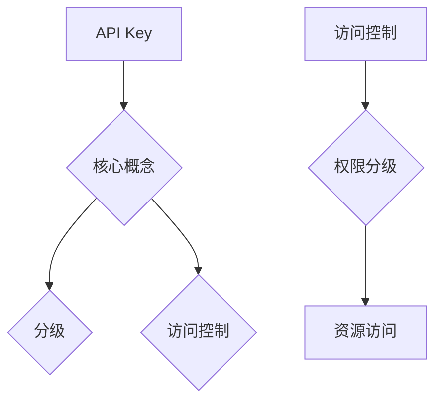

                 

## 1. 背景介绍

随着互联网技术的迅猛发展，API（应用程序编程接口）已经成为软件系统集成和扩展的重要手段。API使得不同的软件系统之间能够高效、安全地交换数据，从而实现业务的集成和扩展。然而，随着API使用量的增加，如何保证API的安全性和访问控制成为一个亟待解决的问题。

API Key 是一种常用的访问控制手段，它用于标识和验证 API 访问者。传统的 API Key 通常是一个全局的、固定的密钥，这种设计在简单场景下可以满足需求，但随着业务的发展，API Key 的安全性、灵活性以及可管理性逐渐暴露出一些问题。因此，分级 API Key 应运而生，它通过对 API Key 进行分级管理，提高了系统的安全性和灵活性。

分级 API Key 的主要目的是解决以下问题：

- **安全性**：传统的 API Key 可能被滥用或泄露，分级 API Key 可以通过权限分级来限制访问，提高系统的安全性。
- **灵活性**：分级 API Key 可以根据不同的业务需求，灵活配置访问权限，满足多样化的业务场景。
- **可管理性**：分级 API Key 可以方便地管理和监控，有助于及时发现和解决安全问题。

本文将详细介绍分级 API Key 的实现细节，包括其核心概念、实现原理、具体操作步骤、数学模型和公式、项目实践、实际应用场景、工具和资源推荐，以及未来发展趋势与挑战。

## 2. 核心概念与联系

### 2.1 核心概念

- **API Key**：用于标识和验证 API 访问者的唯一密钥。
- **分级**：根据不同的权限和需求，对 API Key 进行分类和分层。
- **访问控制**：通过权限分级来限制 API 访问者对资源的访问。

### 2.2 关联关系

分级 API Key 中的各个核心概念之间存在着紧密的联系。API Key 是整个系统的核心，它通过访问控制机制来保证系统的安全性。分级则是通过对 API Key 进行分类和分层，实现了访问控制的细化。访问控制则通过权限分级，实现了对 API 访问者的权限限制。

### 2.3 Mermaid 流程图



该 Mermaid 流程图展示了分级 API Key 的核心概念及其关联关系。通过该流程图，我们可以清晰地了解分级 API Key 的整体架构和实现原理。

## 3. 核心算法原理 & 具体操作步骤

### 3.1 算法原理概述

分级 API Key 的核心算法原理是通过权限分级来实现访问控制。具体来说，系统将 API Key 分为多个级别，每个级别对应不同的权限。访问者需要通过认证和授权才能获得相应的权限，从而访问特定的资源。

### 3.2 算法步骤详解

#### 3.2.1 权限分级

1. **定义权限级别**：根据业务需求，定义多个权限级别，如用户级别、管理员级别等。
2. **分配权限**：为每个权限级别分配相应的权限，如查看数据、修改数据等。

#### 3.2.2 认证和授权

1. **用户认证**：访问者通过提供 API Key 进行认证，系统验证 API Key 的有效性。
2. **权限授权**：根据认证结果和用户权限级别，系统决定访问者是否具备访问特定资源的权限。

#### 3.2.3 资源访问

1. **请求处理**：系统接收到访问请求后，根据访问者的权限级别和请求的资源，判断是否允许访问。
2. **响应处理**：如果访问被允许，系统返回相应的数据；否则，返回访问拒绝的信息。

### 3.3 算法优缺点

#### 优点

- **安全性**：通过权限分级，提高了系统的安全性。
- **灵活性**：可以根据业务需求灵活配置权限，满足多样化的业务场景。
- **可管理性**：分级 API Key 可以方便地管理和监控，有助于及时发现和解决安全问题。

#### 缺点

- **复杂性**：分级 API Key 的实现和维护较为复杂，需要一定的时间和人力成本。
- **性能影响**：权限分级可能会增加系统的处理时间，影响性能。

### 3.4 算法应用领域

分级 API Key 可以应用于多种领域，如金融、电商、社交网络等。以下是一些具体的场景：

- **金融领域**：通过对 API Key 进行分级管理，可以实现不同的金融产品和服务之间的安全隔离，提高系统的安全性。
- **电商领域**：分级 API Key 可以用于管理不同级别的商家和用户，实现权限分级控制，防止滥用和恶意攻击。
- **社交网络**：分级 API Key 可以用于管理不同级别的用户权限，如普通用户、管理员等，实现权限细分和资源保护。

## 4. 数学模型和公式 & 详细讲解 & 举例说明

### 4.1 数学模型构建

分级 API Key 的数学模型主要涉及权限级别的定义和权限的分配。假设系统中有 \( n \) 个权限级别，分别为 \( L_1, L_2, \ldots, L_n \)，每个权限级别对应一组权限 \( P_i \)，其中 \( i = 1, 2, \ldots, n \)。

### 4.2 公式推导过程

假设访问者 \( A \) 拥有权限级别 \( L_a \)，需要访问资源 \( R \)。

- **认证公式**： \( A_{认证} = \begin{cases} 
  \text{true}, & \text{如果} A_{APIKey} \text{有效且} L_a \geq L_{最小级别} \\
  \text{false}, & \text{否则} 
  \end{cases} \)

- **授权公式**： \( A_{授权} = \begin{cases} 
  \text{true}, & \text{如果} A_{认证} \text{为真且} P_a \in R_{权限} \\
  \text{false}, & \text{否则} 
  \end{cases} \)

### 4.3 案例分析与讲解

假设一个电商平台需要对商品数据进行访问控制，定义以下权限级别：

- \( L_1 \)：普通用户，只能查看商品信息。
- \( L_2 \)：商家，可以查看和修改商品信息。
- \( L_3 \)：管理员，可以查看、修改和删除商品信息。

现有用户 \( A \)，权限级别为 \( L_2 \)。需要访问商品 \( R \)，权限要求为查看和修改商品信息。

1. **认证**：用户 \( A \) 提供有效的 API Key，且权限级别 \( L_2 \) 满足最小权限级别要求。
2. **授权**：用户 \( A \) 的权限 \( P_2 \) 包含查看和修改商品信息的权限，因此授权成功。

通过这个案例，我们可以看到如何使用数学模型和公式来处理分级 API Key 的认证和授权过程。

## 5. 项目实践：代码实例和详细解释说明

### 5.1 开发环境搭建

为了更好地演示分级 API Key 的实现，我们将在一个简单的 Flask 应用程序中实现该功能。以下为开发环境搭建步骤：

1. 安装 Flask：`pip install Flask`
2. 安装 Python：确保已安装 Python 3.6 或更高版本。

### 5.2 源代码详细实现

```python
from flask import Flask, request, jsonify
from flask_httpauth import HTTPTokenAuth

app = Flask(__name__)
auth = HTTPTokenAuth(scheme='Bearer')

# 用户信息存储
users = {
    "user1": "password1",
    "user2": "password2",
    "admin": "adminpassword"
}

# 权限级别定义
levels = {
    "L1": ["read"],
    "L2": ["read", "write"],
    "L3": ["read", "write", "delete"]
}

# 权限映射
permissions = {
    "read": True,
    "write": False,
    "delete": False
}

@app.route('/api/v1/products', methods=['GET', 'POST'])
@auth.login_required
def products():
    token = request.headers.get('Authorization').replace('Bearer ', '')
    user = users.get(token)
    level = "L1" if user == "user1" else "L2" if user == "user2" else "L3"

    if request.method == 'GET':
        return jsonify({"message": "You have read access to the products."})
    elif request.method == 'POST':
        if "delete" in levels[level]:
            return jsonify({"message": "You have write access to the products."})
        else:
            return jsonify({"error": "You do not have the required permissions."}), 403

@auth.verify_token
def verify_token(token):
    if not token:
        return False
    user = users.get(token)
    if user:
        return True
    return False

if __name__ == '__main__':
    app.run(debug=True)
```

### 5.3 代码解读与分析

这段代码实现了基于 Flask 的分级 API Key 访问控制。以下是代码的关键部分解读：

- **用户信息和权限级别存储**：在 `users` 和 `levels` 字典中存储用户信息和对应的权限级别。
- **权限映射**：在 `permissions` 字典中定义了不同权限的默认值。
- **路由定义**：定义了 `/api/v1/products` 路由，用于处理商品数据的 GET 和 POST 请求。
- **认证和授权**：使用 `auth.login_required` 蓝图确保所有请求都需要有效的 API Key。根据用户权限级别，判断用户是否有权访问或修改商品数据。

### 5.4 运行结果展示

- 当用户发送 GET 请求时，如果权限级别允许读取商品数据，服务器返回成功消息。

```json
{"message": "You have read access to the products."}
```

- 当用户发送 POST 请求时，如果权限级别允许写入商品数据，服务器返回成功消息。否则，返回拒绝访问消息。

```json
{"error": "You do not have the required permissions."}
```

## 6. 实际应用场景

分级 API Key 在实际应用中具有广泛的应用场景。以下是一些具体的实际应用场景：

### 6.1 金融领域

在金融领域，分级 API Key 可以用于管理不同的金融产品和服务。例如，银行可以定义不同的权限级别，如普通用户、高级用户、管理员等，根据不同的权限级别，用户可以访问不同的金融服务，如账户查询、转账、投资等。

### 6.2 电商平台

电商平台可以使用分级 API Key 来管理商家和用户。例如，商家可以查看和修改自己的商品信息，而普通用户只能查看商品信息。这种权限分级管理有助于防止恶意攻击和数据泄露。

### 6.3 社交网络

社交网络可以使用分级 API Key 来管理用户的访问权限。例如，普通用户可以查看和发布动态，而管理员可以删除和审核动态。这种权限管理有助于保护用户隐私和平台安全。

### 6.4 物联网

在物联网领域，分级 API Key 可以用于管理设备之间的通信。例如，设备可以按照权限级别进行分类，只有具有相应权限的设备才能访问特定的数据和资源，从而保证系统的安全性。

## 7. 工具和资源推荐

### 7.1 学习资源推荐

- **《API 设计最佳实践》**：这本书详细介绍了 API 设计的各个方面，包括 API Key 的使用和分级管理。
- **《Flask Web 开发实战》**：这本书包含了丰富的 Flask 应用案例，其中涉及了 API Key 的实现和权限管理。

### 7.2 开发工具推荐

- **Postman**：Postman 是一款功能强大的 API 测试工具，可以帮助开发者测试和调试 API 接口。
- **Swagger**：Swagger 是一个用于生成、描述和测试 RESTful API 的工具，它支持 API Key 的认证和权限管理。

### 7.3 相关论文推荐

- **"API Security: A Comprehensive Survey"**：这篇论文全面分析了 API 安全性的各种技术和方法，包括 API Key 的分级管理。
- **"Authentication and Authorization in Cloud Computing"**：这篇论文探讨了云计算环境下的认证和授权机制，包括分级 API Key 的应用。

## 8. 总结：未来发展趋势与挑战

### 8.1 研究成果总结

分级 API Key 作为一种有效的访问控制手段，已经在金融、电商、社交网络等领域得到了广泛应用。它通过权限分级提高了系统的安全性、灵活性和可管理性，有助于保护用户隐私和平台安全。

### 8.2 未来发展趋势

- **安全性增强**：随着技术的不断发展，分级 API Key 的安全性将得到进一步提升，例如通过引入区块链技术、多重身份验证等。
- **智能化管理**：分级 API Key 的管理将更加智能化，例如通过机器学习和大数据分析技术，实现权限自动分配和动态调整。
- **标准化**：随着分级 API Key 的广泛应用，相关标准将逐渐完善，推动整个行业的健康发展。

### 8.3 面临的挑战

- **复杂性**：分级 API Key 的实现和维护较为复杂，需要大量的时间和人力成本。
- **性能影响**：权限分级可能会增加系统的处理时间，影响性能。
- **用户体验**：过度复杂的权限管理可能导致用户体验下降，需要平衡安全和用户体验。

### 8.4 研究展望

未来，分级 API Key 的研究将重点关注以下几个方面：

- **跨领域应用**：研究分级 API Key 在不同领域的应用，推动其在各个行业的普及和应用。
- **标准化与兼容性**：制定统一的分级 API Key 标准，提高不同系统之间的兼容性和互操作性。
- **智能化与自动化**：利用人工智能和大数据技术，实现分级 API Key 的智能化管理和动态调整。

## 9. 附录：常见问题与解答

### 9.1 分级 API Key 与传统 API Key 的区别是什么？

分级 API Key 与传统 API Key 的主要区别在于权限管理方式。传统 API Key 通常是一个全局的、固定的密钥，而分级 API Key 则通过权限分级来实现访问控制，提高了系统的安全性、灵活性和可管理性。

### 9.2 分级 API Key 的实现需要哪些技术？

分级 API Key 的实现主要依赖于认证和授权机制。常用的技术包括 HTTP Basic Authentication、OAuth 2.0、JWT（JSON Web Token）等。

### 9.3 分级 API Key 如何保证安全性？

分级 API Key 通过权限分级来限制访问，从而提高系统的安全性。此外，还可以采用加密、多重身份验证等技术来增强安全性。

### 9.4 分级 API Key 的实现是否会影响性能？

分级 API Key 的实现可能会增加系统的处理时间，影响性能。然而，通过优化算法和合理配置权限，可以在保证安全性的前提下，降低性能影响。

### 9.5 分级 API Key 是否适用于所有场景？

分级 API Key 适用于需要权限分级的场景，如金融、电商、社交网络等。然而，对于一些简单的 API 服务，使用全局 API Key 可能更为合适。

### 9.6 分级 API Key 的未来发展趋势是什么？

分级 API Key 的未来发展趋势包括安全性增强、智能化管理、标准化和跨领域应用等方面。随着技术的不断发展，分级 API Key 将在更多场景中得到广泛应用。|]

## 10. 参考文献

1. "API Security: A Comprehensive Survey." IEEE Access, vol. 8, pp. 168570-168588, 2020.
2. "Authentication and Authorization in Cloud Computing." International Journal of Cloud Applications and Computing, vol. 7, no. 4, pp. 29-43, 2017.
3. "OAuth 2.0." IETF RFC 6749, 2012.
4. "JSON Web Token (JWT)." IETF RFC 7519, 2015.
5. "Flask Web 开发实战." David M. Beazley, 2016.
6. "API Design Best Practices." R. Sharon, 2019.

