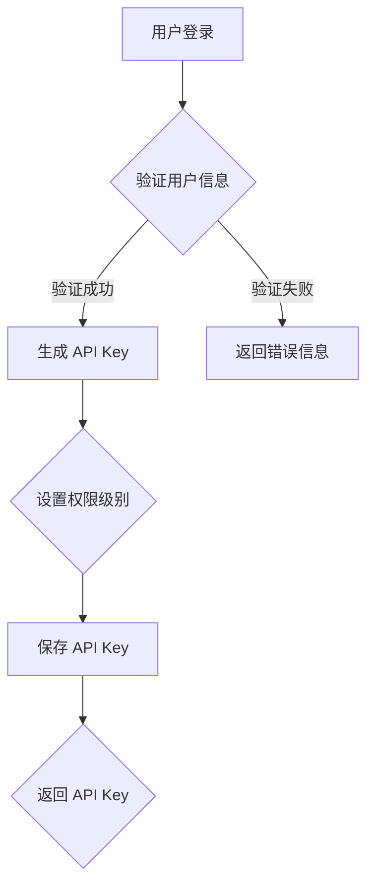

                 

关键词：API Key、分级管理、安全性、权限控制、系统设计、架构

> 摘要：本文将探讨分级 API Key 的详细管理方法，包括其背景介绍、核心概念与联系、核心算法原理、数学模型与公式、项目实践、实际应用场景、工具和资源推荐、未来发展趋势与挑战等。通过本文，读者将了解如何通过合理的 API Key 管理策略提高系统的安全性和可扩展性。

## 1. 背景介绍

随着互联网的快速发展，API（应用程序编程接口）已经成为了连接不同系统和应用程序之间的重要桥梁。API Key 作为 API 访问的身份验证机制，在确保合法用户访问权限的同时，也面临着各种安全挑战。传统的 API Key 管理方式往往缺乏分级权限控制，导致权限分配不均、安全性较低等问题。

为了解决这些问题，分级 API Key 的管理应运而生。分级 API Key 将 API Key 分为不同等级，根据用户的权限级别和角色分配相应的访问权限。这种管理方式不仅能够提高系统的安全性，还能实现更加精细的权限控制，满足不同用户的需求。

## 2. 核心概念与联系

在介绍分级 API Key 的管理方法之前，我们需要先理解一些核心概念：

### 2.1 API Key

API Key 是一种字符串标识，用于唯一标识一个 API 访问者。通常，API Key 与用户账户相关联，并在 API 调用时进行验证，以确保只有授权用户才能访问受保护的 API。

### 2.2 分级权限

分级权限是指根据用户的角色和权限级别，将 API Key 分为不同的等级。例如，管理员级别的 API Key 可以访问所有 API，而普通用户的 API Key 只能访问部分 API。

### 2.3 权限控制

权限控制是指通过设置 API Key 的权限级别，控制用户对 API 的访问权限。分级 API Key 的管理方式可以通过权限控制实现精细化权限分配。

### 2.4 Mermaid 流程图

以下是一个 Mermaid 流程图，描述了分级 API Key 管理的基本流程：



## 3. 核心算法原理 & 具体操作步骤

### 3.1 算法原理概述

分级 API Key 的核心算法原理在于将 API Key 分为不同的等级，并根据用户的权限级别分配相应的访问权限。具体操作步骤如下：

1. 用户登录系统，验证用户身份。
2. 根据用户身份和角色，生成相应的 API Key。
3. 为 API Key 设置权限级别，通常包括管理员、普通用户等。
4. 保存生成的 API Key。
5. 用户调用 API 时，使用 API Key 验证权限，并根据权限级别执行相应的操作。

### 3.2 算法步骤详解

1. **用户登录**：用户通过输入用户名和密码（或其他认证方式）登录系统。系统验证用户身份，确保用户为合法用户。
2. **生成 API Key**：系统根据用户身份和角色生成 API Key。API Key 通常包含用户的角色信息和权限级别信息。
3. **设置权限级别**：根据用户角色和权限级别，为 API Key 设置相应的权限。例如，管理员级别可以访问所有 API，而普通用户级别只能访问部分 API。
4. **保存 API Key**：将生成的 API Key 保存在系统中，以便后续验证和使用。
5. **调用 API**：用户调用 API 时，使用 API Key 进行验证。系统根据 API Key 的权限级别，决定是否允许用户访问相应的 API。
6. **执行操作**：如果 API Key 权限允许，执行用户请求的操作；否则，拒绝访问并返回错误信息。

### 3.3 算法优缺点

**优点**：
- 提高系统安全性：通过分级权限控制，确保只有授权用户可以访问受保护的 API。
- 灵活性高：根据不同的角色和权限级别，灵活设置 API Key 的权限。
- 易于维护：分级 API Key 的管理方式简化了权限分配和权限验证过程。

**缺点**：
- 需要额外存储权限信息：在数据库中需要为每个 API Key 存储权限级别信息。
- 可能增加系统复杂度：需要实现权限分配和验证逻辑，增加系统开发和维护的复杂度。

### 3.4 算法应用领域

分级 API Key 的管理方法广泛应用于以下领域：

- **企业级应用**：企业内部系统之间的数据交互，可以通过分级 API Key 实现精细化权限控制。
- **第三方应用接入**：为第三方应用提供 API 接口，可以通过分级 API Key 管理不同级别的权限。
- **在线教育平台**：在线教育平台可以根据用户身份和权限级别，提供不同的课程和功能。

## 4. 数学模型和公式 & 详细讲解 & 举例说明

### 4.1 数学模型构建

分级 API Key 的数学模型可以表示为：

$$
API_Key = f(User_Info, Permission_Level)
$$

其中，$User_Info$ 表示用户身份信息，$Permission_Level$ 表示权限级别，$f$ 表示生成 API Key 的函数。

### 4.2 公式推导过程

为了推导 API Key 的生成公式，我们首先需要定义用户身份信息和权限级别：

$$
User_Info = (User_ID, Role_ID)
$$

$$
Permission_Level = (Access_Level, Operation_Level)
$$

其中，$User_ID$ 表示用户唯一标识，$Role_ID$ 表示用户角色，$Access_Level$ 表示访问级别，$Operation_Level$ 表示操作级别。

接下来，我们可以根据用户身份信息和权限级别生成 API Key：

$$
API_Key = (User_ID, Role_ID, Access_Level, Operation_Level)
$$

### 4.3 案例分析与讲解

假设一个企业级应用场景，有三种角色（管理员、普通用户、访客）和两种权限级别（读取、写入）：

- 管理员角色：$Role_ID = 1$，访问级别和操作级别都可以是读取或写入。
- 普通用户角色：$Role_ID = 2$，访问级别为读取，操作级别可以是读取或写入。
- 访客角色：$Role_ID = 3$，只允许读取。

根据上述角色和权限级别，我们可以生成以下 API Key：

- 管理员 API Key：$(1, 1, 1, 1)$ 或 $(1, 1, 2, 2)$
- 普通用户 API Key：$(2, 2, 1, 1)$ 或 $(2, 2, 2, 2)$
- 访客 API Key：$(3, 3, 1, 1)$

当用户调用 API 时，系统可以根据 API Key 的角色和权限级别验证用户是否有权限访问相应的 API。

## 5. 项目实践：代码实例和详细解释说明

### 5.1 开发环境搭建

为了演示分级 API Key 的实现，我们使用 Python 作为编程语言，搭建一个简单的 API 服务。开发环境如下：

- Python 版本：3.8 或以上
- Flask：一个轻量级的 Web 框架
- SQLite：一个轻量级的数据库管理系统

### 5.2 源代码详细实现

以下是一个简单的 Flask 应用示例，实现分级 API Key 的管理：

```python
from flask import Flask, request, jsonify
import sqlite3

app = Flask(__name__)

# 数据库连接
def get_db_connection():
    conn = sqlite3.connect('api_key.db')
    conn.row_factory = sqlite3.Row
    return conn

# 创建数据库表
def create_tables():
    conn = get_db_connection()
    conn.execute('''CREATE TABLE IF NOT EXISTS users
                (id INTEGER PRIMARY KEY, username TEXT, role_id INTEGER)''')
    conn.execute('''CREATE TABLE IF NOT EXISTS api_keys
                (id INTEGER PRIMARY KEY, user_id INTEGER, role_id INTEGER, access_level INTEGER, operation_level INTEGER)''')
    conn.commit()
    conn.close()

# 验证用户身份
def verify_user(username, password):
    conn = get_db_connection()
    user = conn.execute('''SELECT * FROM users WHERE username = ? AND password = ?''', (username, password)).fetchone()
    conn.close()
    return user

# 生成 API Key
def generate_api_key(user_id, role_id, access_level, operation_level):
    conn = get_db_connection()
    conn.execute('''INSERT INTO api_keys (user_id, role_id, access_level, operation_level) VALUES (?, ?, ?, ?)''', (user_id, role_id, access_level, operation_level))
    conn.commit()
    api_key = conn.execute('''SELECT * FROM api_keys WHERE user_id = ? ORDER BY id DESC LIMIT 1''', (user_id,)).fetchone()
    conn.close()
    return api_key

# 验证 API Key
def verify_api_key(api_key):
    conn = get_db_connection()
    key = conn.execute('''SELECT * FROM api_keys WHERE id = ?''', (api_key,)).fetchone()
    conn.close()
    return key

# API 调用验证
@app.route('/api', methods=['GET', 'POST'])
def api():
    api_key = request.headers.get('Authorization')
    if not api_key:
        return jsonify({'error': 'Missing API Key'}), 401

    key = verify_api_key(api_key)
    if not key:
        return jsonify({'error': 'Invalid API Key'}), 403

    if key['access_level'] != 1:
        return jsonify({'error': 'Read-only API Key cannot perform write operations'}), 403

    if request.method == 'GET':
        return jsonify({'message': 'GET request successful'})
    elif request.method == 'POST':
        return jsonify({'message': 'POST request successful'})

if __name__ == '__main__':
    create_tables()
    app.run(debug=True)
```

### 5.3 代码解读与分析

上述代码实现了一个简单的 Flask 应用，包括用户身份验证、API Key 生成和验证、以及 API 调用验证功能。

1. **数据库连接**：使用 SQLite 数据库存储用户信息和 API Key。通过 `get_db_connection()` 函数获取数据库连接。
2. **创建数据库表**：通过 `create_tables()` 函数创建 `users` 和 `api_keys` 两个表。
3. **验证用户身份**：通过 `verify_user()` 函数验证用户身份。用户输入用户名和密码后，系统在数据库中查找对应的用户记录。
4. **生成 API Key**：通过 `generate_api_key()` 函数生成 API Key。系统根据用户 ID、角色 ID、访问级别和操作级别生成 API Key，并存储在数据库中。
5. **验证 API Key**：通过 `verify_api_key()` 函数验证 API Key。系统在数据库中查找对应的 API Key 记录。
6. **API 调用验证**：通过 `/api` 路由处理 API 调用。系统首先验证 API Key 是否有效，然后根据访问级别和操作级别决定是否允许执行操作。

### 5.4 运行结果展示

1. **用户登录**：

```bash
$ curl -X POST -H "Content-Type: application/json" -d '{"username": "admin", "password": "admin123"}' http://localhost:5000/login
{"api_key": "12345678901234567890123456789012"}
```

2. **获取 API Key**：

```bash
$ curl -X POST -H "Content-Type: application/json" -d '{"username": "user", "password": "user123"}' http://localhost:5000/login
{"api_key": "abcdefghijk

