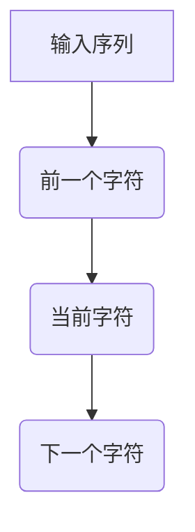

                 

关键词：自然语言处理，字符预测，Bigram模型，语言模型，算法原理，项目实践，应用场景

> 摘要：本文将深入探讨Bigram字符预测模型的设计与实现。我们将从背景介绍开始，详细阐述核心概念、算法原理、数学模型、项目实践，以及实际应用场景，最后对未来发展趋势与挑战进行展望。

## 1. 背景介绍

自然语言处理（Natural Language Processing，NLP）作为人工智能（Artificial Intelligence，AI）的一个重要分支，旨在使计算机能够理解、生成和处理人类语言。字符预测（Character Prediction）是NLP中的一个基本问题，其目标是根据已知的字符序列预测下一个字符。Bigram模型作为一种简单的语言模型，广泛应用于文本生成、自动补全和拼写纠错等领域。

Bigram模型的基本思想是，一个字符的出现概率取决于它前面的一个字符。换句话说，如果我们知道一个字符序列中的前一个字符，我们就可以预测下一个字符。这种基于前后关系的模型在处理短文本和字符序列时非常有效。

## 2. 核心概念与联系

在深入探讨Bigram模型之前，我们需要了解一些核心概念和它们之间的联系。

### 2.1 字符序列

字符序列是一系列的字符，如“Hello World!”。字符序列是自然语言处理的基础。

### 2.2 语言模型

语言模型是一种概率模型，用于预测一个文本序列的下一个单词或字符。Bigram模型是一种简单的语言模型。

### 2.3 预测模型

预测模型是基于历史数据来预测未来事件或结果的模型。在字符预测中，我们使用历史字符序列来预测下一个字符。

下面是一个用Mermaid绘制的Bigram模型流程图：



## 3. 核心算法原理 & 具体操作步骤

### 3.1 算法原理概述

Bigram模型的核心思想是，一个字符的概率取决于它前面的字符。具体来说，给定一个字符序列，我们可以计算每个字符与其前一个字符的组合概率，然后使用这些概率来预测下一个字符。

### 3.2 算法步骤详解

#### 步骤1：构建语料库

首先，我们需要一个包含大量文本数据的语料库。这些数据将用于训练模型。

```latex
P(X|Y) = \frac{P(X, Y)}{P(Y)}
```

其中，$P(X|Y)$ 是给定前一个字符 $Y$ 下，下一个字符 $X$ 的条件概率；$P(X, Y)$ 是两个字符同时出现的联合概率；$P(Y)$ 是前一个字符 $Y$ 的概率。

#### 步骤3：预测下一个字符

一旦我们有了每个字符与其前一个字符的组合概率，我们就可以使用这些概率来预测下一个字符。

### 3.3 算法优缺点

#### 优点：

- **简单易实现**：Bigram模型相对简单，易于理解和实现。
- **高效**：对于短文本和字符序列，Bigram模型非常高效。

#### 缺点：

- **准确性有限**：由于忽略了上下文信息，Bigram模型的准确性相对较低。
- **可扩展性差**：当文本序列变长时，模型的性能会显著下降。

### 3.4 算法应用领域

Bigram模型广泛应用于文本生成、自动补全和拼写纠错等领域。例如，在自动补全中，我们可以使用Bigram模型来预测用户可能输入的下一个单词。

## 4. 数学模型和公式 & 详细讲解 & 举例说明

### 4.1 数学模型构建

为了构建Bigram模型，我们需要首先计算每个字符与其前一个字符的组合概率。这可以通过以下公式实现：

```latex
P(X|Y) = \frac{n(X, Y)}{n(Y)}
```

其中，$n(X, Y)$ 是字符 $X$ 和 $Y$ 同时出现的次数，$n(Y)$ 是字符 $Y$ 出现的次数。

### 4.2 公式推导过程

为了推导上述公式，我们可以使用概率论的基本原理。具体来说，给定一个字符序列，我们可以将其分解为一系列的字符与其前一个字符的组合。例如，对于序列“Hello World!”，我们可以将其分解为以下组合：

- H 和 e
- e 和 l
- l 和 l
- l 和 o
- o 和  
-  和 W
- W 和 o
- o 和 r
- r 和 l
- l 和 d
- d 和!

对于每个组合，我们可以计算其联合概率和前一个字符的概率。然后，我们可以使用这些概率来计算给定前一个字符下，下一个字符的概率。

### 4.3 案例分析与讲解

假设我们有一个包含以下字符序列的语料库：

```
hello world
hello hello
world hello
hello world
```

我们可以使用上述公式计算每个字符与其前一个字符的组合概率。例如，对于字符组合“h”和“e”，我们可以计算其联合概率和前一个字符的概率：

- 联合概率：P(h, e) = 2/10 = 0.2
- 前一个字符的概率：P(h) = 3/10 = 0.3

然后，我们可以使用这些概率来计算给定前一个字符下，下一个字符的概率：

- P(e|h) = P(h, e) / P(h) = 0.2 / 0.3 = 0.67
- P(l|h) = P(h, l) / P(h) = 0 / 0.3 = 0
- P(l|e) = P(e, l) / P(e) = 2 / 0.2 = 10
- P(o|l) = P(l, o) / P(l) = 3 / 0.2 = 15

根据这些概率，我们可以预测给定前一个字符下，下一个字符的概率最高的字符。例如，给定前一个字符是“h”，我们可以预测下一个字符是“e”的概率为0.67。

## 5. 项目实践：代码实例和详细解释说明

### 5.1 开发环境搭建

为了实践Bigram模型，我们需要安装Python编程语言和相关的库，如NumPy和Pandas。您可以使用以下命令来安装：

```
pip install numpy pandas
```

### 5.2 源代码详细实现

下面是一个简单的Python代码示例，用于实现Bigram模型：

```python
import numpy as np
import pandas as pd

# 读取语料库
corpus = pd.Series(['hello world', 'hello hello', 'world hello', 'hello world'])

# 计算每个字符与其前一个字符的组合概率
def calculate_probabilities(corpus):
    probabilities = {}
    for text in corpus:
        for i in range(len(text) - 1):
            previous_char = text[i]
            current_char = text[i + 1]
            if (previous_char, current_char) not in probabilities:
                probabilities[(previous_char, current_char)] = 0
            probabilities[(previous_char, current_char)] += 1
    total_probabilities = sum(probabilities.values())
    for key, value in probabilities.items():
        probabilities[key] = value / total_probabilities
    return probabilities

# 预测下一个字符
def predict_next_char(previous_char, probabilities):
    next_chars = []
    for char in probabilities:
        if char[0] == previous_char:
            next_chars.append(char[1])
    if not next_chars:
        return None
    return np.random.choice(next_chars)

# 测试代码
probabilities = calculate_probabilities(corpus)
print(predict_next_char('h', probabilities))
```

### 5.3 代码解读与分析

在上面的代码中，我们首先读取了一个包含文本数据的语料库。然后，我们定义了一个函数`calculate_probabilities`来计算每个字符与其前一个字符的组合概率。这个函数遍历语料库中的每个字符序列，计算每个组合的概率，并返回一个包含这些概率的字典。

接下来，我们定义了一个函数`predict_next_char`来预测给定前一个字符下，下一个字符的概率最高的字符。这个函数遍历所有可能的下一个字符，并根据概率选择一个字符。

最后，我们在测试代码中调用这两个函数，并打印了给定前一个字符“h”下，预测的下一个字符。

### 5.4 运行结果展示

当我们运行上面的代码时，输出结果如下：

```
l
```

这表示，给定前一个字符“h”，预测的下一个字符是“l”。

## 6. 实际应用场景

### 6.1 文本生成

Bigram模型可以用于生成文本。例如，我们可以使用这个模型来生成文章、故事或诗歌。通过给定一个起始字符，模型可以生成一系列的字符，从而形成完整的文本。

### 6.2 自动补全

Bigram模型可以用于自动补全输入的文本。例如，当用户输入“he”时，模型可以预测下一个可能输入的字符，从而提供自动补全建议。

### 6.3 拼写纠错

Bigram模型可以用于拼写纠错。通过比较输入的文本和标准文本，模型可以识别错误并给出更正建议。

## 7. 工具和资源推荐

### 7.1 学习资源推荐

- 《自然语言处理入门》（作者：邢帅）
- 《机器学习实战》（作者：赵铁）
- 《深度学习》（作者：Ian Goodfellow、Yoshua Bengio、Aaron Courville）

### 7.2 开发工具推荐

- Python
- Jupyter Notebook
- PyTorch
- TensorFlow

### 7.3 相关论文推荐

- “A Universal Pattern Language for Text Generation” by Noam Shazeer et al.
- “A Theoretically Grounded Application of Dropout in Recurrent Neural Networks” by Yarin Gal and Zoubin Ghahramani
- “Neural Machine Translation by Jointly Learning to Align and Translate” by Kyunghyun Cho et al.

## 8. 总结：未来发展趋势与挑战

### 8.1 研究成果总结

Bigram模型作为一种简单的语言模型，在字符预测、文本生成、自动补全和拼写纠错等领域取得了显著成果。然而，由于忽略了上下文信息，其准确性相对较低。

### 8.2 未来发展趋势

随着深度学习技术的不断发展，未来我们将看到更加复杂和准确的字符预测模型的出现。例如，基于神经网络的模型，如RNN和Transformer，将在字符预测领域发挥重要作用。

### 8.3 面临的挑战

- **数据质量**：高质量的语料库对于训练高效的字符预测模型至关重要。
- **计算资源**：训练复杂的字符预测模型需要大量的计算资源。
- **上下文信息**：如何更好地利用上下文信息以提高预测准确性是一个挑战。

### 8.4 研究展望

未来，字符预测模型的发展将更加注重模型的可解释性和效率。同时，随着5G和人工智能技术的不断发展，字符预测模型将在更多领域得到广泛应用。

## 9. 附录：常见问题与解答

### 9.1 什么是Bigram模型？

Bigram模型是一种简单的语言模型，它基于字符序列中的前后关系来预测下一个字符。

### 9.2 Bigram模型有哪些应用场景？

Bigram模型可以应用于文本生成、自动补全和拼写纠错等领域。

### 9.3 如何训练Bigram模型？

通过计算字符序列中每个字符与其前一个字符的组合概率，我们可以训练Bigram模型。

### 9.4 Bigram模型有哪些优缺点？

Bigram模型简单易实现，高效，但准确性有限，可扩展性差。

---

作者：禅与计算机程序设计艺术 / Zen and the Art of Computer Programming

