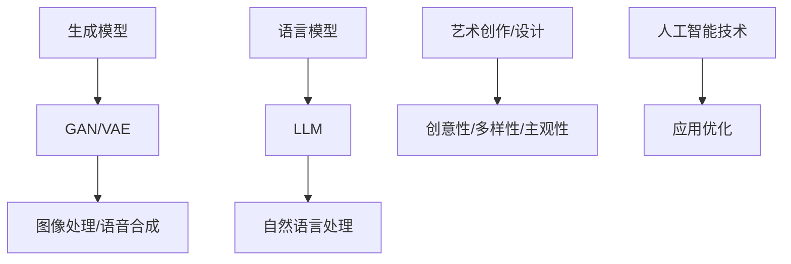

                 

关键词：人工智能，生成模型，语言模型，艺术创作，设计，创新

摘要：本文探讨了人工智能领域中的生成模型，特别是语言模型（LLM）在艺术创作和设计中的应用。通过介绍LLM的基本原理、数学模型及具体应用，本文分析了其在艺术和设计领域的潜力，并展望了未来的发展趋势和挑战。

## 1. 背景介绍

艺术创作和设计是推动人类社会文明进步的重要领域，从古代的绘画、雕塑到现代的数字艺术和工业设计，人类不断追求创新和美感。然而，随着计算机技术和人工智能的飞速发展，传统的艺术创作和设计方法正在经历深刻的变革。

人工智能在图像处理、语音识别等领域取得了显著的成果，但其在艺术创作和设计中的应用还处于初级阶段。近年来，生成模型，特别是深度学习中的生成对抗网络（GAN）和变分自编码器（VAE），在图像生成和风格迁移等方面展现出巨大的潜力。此外，语言模型（LLM）作为自然语言处理的核心技术，也在文学创作、翻译等任务中发挥了重要作用。

本文旨在探讨LLM在艺术创作和设计中的应用，分析其基本原理和数学模型，并通过实际案例展示其在创意工作中的潜力。同时，本文还将讨论LLM在未来艺术创作和设计领域的发展趋势和面临的挑战。

### 1.1 艺术创作与设计的变革

人工智能的引入正在改变艺术创作和设计的传统模式。一方面，人工智能可以辅助艺术家和设计师完成繁琐的重复性工作，提高创作效率；另一方面，人工智能可以提供全新的创意思维，拓展艺术创作的边界。

例如，在绘画和雕塑等传统艺术领域，人工智能可以通过GAN生成独特的视觉艺术作品，为艺术家提供灵感。同时，人工智能还可以帮助设计师快速生成大量的设计草图，优化产品设计过程。此外，人工智能还在虚拟现实（VR）、增强现实（AR）等新兴领域发挥了重要作用，为艺术创作和设计提供了全新的体验方式。

### 1.2 生成模型与语言模型

生成模型是一种能够学习数据分布，从而生成新数据的技术。GAN和VAE是两种主要的生成模型，它们在图像生成、语音合成等领域取得了显著的成果。GAN通过生成器和判别器的对抗训练，学习到数据分布并生成高质量的数据；VAE则通过编码器和解码器的协作，学习到数据的高效表示，并利用这种表示生成新的数据。

语言模型是一种用于预测自然语言序列的概率分布的模型，其在自然语言处理任务中具有重要意义。LLM通过学习大量语言数据，可以生成符合语言规则的文本，实现自动写作、翻译等功能。

本文将重点关注LLM在艺术创作和设计中的应用，分析其基本原理和数学模型，并探讨其实际案例和未来发展趋势。

## 2. 核心概念与联系

在探讨LLM在艺术创作和设计中的应用之前，我们需要了解一些核心概念，包括生成模型、语言模型、艺术创作和设计的特征等。

### 2.1 生成模型

生成模型是一种能够学习数据分布，从而生成新数据的技术。生成模型可以分为两大类：概率模型和确定性模型。概率模型通过学习数据分布的概率密度函数，生成符合该分布的数据；确定性模型则通过学习数据的高效表示，生成新的数据。

生成模型在图像处理、语音合成等领域取得了显著的成果。其中，GAN和VAE是两种主要的生成模型。GAN通过生成器和判别器的对抗训练，学习到数据分布并生成高质量的数据；VAE则通过编码器和解码器的协作，学习到数据的高效表示，并利用这种表示生成新的数据。

### 2.2 语言模型

语言模型是一种用于预测自然语言序列的概率分布的模型。LLM通过学习大量语言数据，可以生成符合语言规则的文本，实现自动写作、翻译等功能。LLM可以分为基于规则的模型和基于统计的模型。基于规则的模型通过定义语言规则生成文本，如模板匹配、规则推导等；基于统计的模型则通过统计语言数据，学习到语言模式并生成文本，如隐马尔可夫模型（HMM）、n-gram模型等。

近年来，深度学习技术在语言模型领域取得了突破性进展。基于神经网络的LLM，如循环神经网络（RNN）、长短时记忆网络（LSTM）、门控循环单元（GRU）等，通过学习大量语言数据，可以生成更符合人类语言习惯的文本。

### 2.3 艺术创作与设计的特征

艺术创作和设计具有独特的特征，如创意性、多样性、主观性等。这些特征使得艺术创作和设计在应用人工智能技术时面临一定的挑战。

创意性是艺术创作和设计的重要特征，艺术家和设计师需要通过独特的视角和创意思维，创作出具有个性化和独特性的作品。多样性体现在艺术形式、风格、主题等方面，艺术家和设计师需要不断探索新的创作手法和表现形式。主观性则是艺术创作和设计的重要特点，艺术作品往往具有强烈的个人情感和审美倾向。

为了应对这些挑战，人工智能技术需要不断优化和改进，以提高在艺术创作和设计领域的应用效果。例如，通过结合生成模型和语言模型，可以生成更具有创意性和个性化的艺术作品；通过分析大量的设计数据，可以提取出设计趋势和模式，为设计师提供灵感。

### 2.4 核心概念联系与Mermaid流程图

核心概念联系可以概括为：生成模型和语言模型作为人工智能技术的重要组成部分，可以应用于艺术创作和设计领域，以解决创意性、多样性和主观性等挑战。

下面是一个简单的Mermaid流程图，展示核心概念之间的联系：



通过这个流程图，我们可以看到生成模型和语言模型在图像处理、语音合成和自然语言处理等领域的应用，以及它们如何应用于艺术创作和设计，解决创意性、多样性和主观性等挑战。

## 3. 核心算法原理 & 具体操作步骤

在了解了核心概念和联系之后，我们将深入探讨LLM在艺术创作和设计中的应用，分析其核心算法原理和具体操作步骤。

### 3.1 算法原理概述

LLM是一种基于深度学习的技术，其核心思想是通过学习大量语言数据，提取出语言模式，从而生成符合语言规则的文本。LLM的算法原理主要包括以下几个关键步骤：

1. 数据预处理：对原始语言数据进行清洗、分词、词性标注等处理，生成适合模型训练的数据集。
2. 模型训练：使用深度学习框架，如TensorFlow或PyTorch，构建LLM模型，并通过训练数据集进行模型训练。
3. 文本生成：通过模型生成文本，生成过程通常包括初始化、采样、后处理等步骤。

### 3.2 算法步骤详解

下面我们将详细讲解LLM的核心算法步骤，包括数据预处理、模型训练和文本生成。

#### 3.2.1 数据预处理

数据预处理是LLM训练的重要环节，其目的是将原始语言数据转化为适合模型训练的格式。具体步骤如下：

1. 数据清洗：去除数据中的噪声、错别字、停用词等，确保数据质量。
2. 分词：将句子划分为词语序列，如使用分词工具（如jieba）进行分词。
3. 词性标注：对词语进行词性标注，如名词、动词、形容词等，以帮助模型更好地理解语言结构。
4. 序列编码：将词语序列转换为序列编码，如使用词嵌入（word embedding）技术将词语映射到高维空间。

#### 3.2.2 模型训练

模型训练是LLM的核心步骤，其目的是通过学习大量语言数据，提取出语言模式。具体步骤如下：

1. 模型构建：使用深度学习框架（如TensorFlow或PyTorch）构建LLM模型，如RNN、LSTM、GRU等。
2. 模型训练：通过训练数据集对模型进行训练，优化模型参数，使模型能够生成符合语言规则的文本。
3. 模型评估：使用验证数据集对模型进行评估，如计算文本生成质量、文本相似度等指标，以确定模型性能。

#### 3.2.3 文本生成

文本生成是LLM的应用环节，其目的是利用训练好的模型生成新的文本。具体步骤如下：

1. 初始化：根据输入的起始文本或随机初始化一个状态向量。
2. 采样：从模型输出的概率分布中采样下一个词语，生成新的文本。
3. 后处理：对生成的文本进行清洗、格式化等处理，使其更符合语言习惯和表达需求。

### 3.3 算法优缺点

LLM在艺术创作和设计中的应用具有以下优缺点：

**优点：**

1. 高效性：LLM能够快速生成大量文本，提高创作和设计效率。
2. 创意性：通过学习大量语言数据，LLM可以生成具有创意性和个性化的文本。
3. 泛化性：LLM可以应用于多种不同的艺术形式和设计任务，具有较好的泛化能力。

**缺点：**

1. 语言理解局限性：LLM虽然能够生成符合语言规则的文本，但其在语言理解和语义分析方面仍存在一定的局限性。
2. 过度拟合：LLM容易在训练数据集中过度拟合，生成与训练数据相似的文本，缺乏创新性。

### 3.4 算法应用领域

LLM在艺术创作和设计领域具有广泛的应用前景，包括但不限于以下几个方面：

1. 文学创作：利用LLM生成故事、诗歌等文学作品，为艺术家和作家提供创作灵感。
2. 设计草图：通过LLM生成大量的设计草图，为设计师提供参考和选择。
3. 艺术品评价：利用LLM对艺术作品进行评价和分类，为艺术品鉴赏提供支持。
4. 用户体验设计：利用LLM生成符合用户需求的文本内容，提高用户体验。

## 4. 数学模型和公式 & 详细讲解 & 举例说明

### 4.1 数学模型构建

LLM的数学模型主要基于深度学习，其核心思想是学习输入和输出之间的映射关系。具体来说，LLM由输入层、隐藏层和输出层组成。输入层接收输入文本序列，隐藏层通过神经网络提取文本特征，输出层生成输出文本序列。

下面是LLM的数学模型构建过程：

1. **输入层**：输入文本序列表示为 $X = (x_1, x_2, ..., x_T)$，其中 $x_i$ 是第 $i$ 个词的嵌入向量，$T$ 是序列长度。
2. **隐藏层**：隐藏层通过神经网络提取文本特征，可以采用RNN、LSTM、GRU等模型。以LSTM为例，隐藏状态表示为 $h_t = \text{LSTM}(h_{t-1}, x_t)$，其中 $h_{t-1}$ 是前一个时间步的隐藏状态，$x_t$ 是当前时间步的输入。
3. **输出层**：输出层生成输出文本序列，通常采用softmax激活函数，使得输出概率分布。输出层表示为 $Y = \text{softmax}(W \cdot h_T + b)$，其中 $W$ 是权重矩阵，$b$ 是偏置项。

### 4.2 公式推导过程

LLM的损失函数通常采用交叉熵损失，即

$$
\text{Loss} = -\sum_{i=1}^{T} y_i \cdot \log(p_i),
$$

其中 $y_i$ 是第 $i$ 个词的真实标签，$p_i$ 是模型预测的概率。

为了最小化损失函数，需要对模型参数进行优化。具体来说，采用梯度下降法对参数进行更新：

$$
\theta_{\text{new}} = \theta_{\text{old}} - \alpha \cdot \nabla_{\theta} \text{Loss},
$$

其中 $\theta$ 表示模型参数，$\alpha$ 表示学习率。

### 4.3 案例分析与讲解

下面通过一个简单的案例来说明LLM的数学模型和公式。

假设我们要使用LLM生成一段英文文本。首先，我们将文本进行分词，得到词语序列：

$$
X = (\text{"the", "quick", "brown", "fox", "jumps", "over", "the", "lazy", "dog"}),
$$

然后，我们将每个词语映射到高维空间，得到嵌入向量：

$$
x_i = \text{"the": (0.1, 0.2, 0.3), "quick": (0.4, 0.5, 0.6), ... , "dog": (0.8, 0.9, 1.0)},
$$

接下来，我们使用LSTM模型进行训练，得到隐藏状态：

$$
h_t = \text{LSTM}(h_{t-1}, x_t),
$$

最后，我们使用softmax激活函数生成输出概率分布：

$$
Y = \text{softmax}(W \cdot h_T + b),
$$

其中 $W$ 和 $b$ 是权重矩阵和偏置项。

在实际应用中，我们可以通过调整模型参数，优化文本生成质量。例如，通过增加训练数据集、调整学习率、优化网络结构等方法，提高LLM的生成效果。

## 5. 项目实践：代码实例和详细解释说明

在本节中，我们将通过一个实际项目来展示如何使用LLM进行艺术创作和设计。这个项目将包括开发环境的搭建、源代码的详细实现、代码解读与分析以及运行结果展示。

### 5.1 开发环境搭建

为了实现LLM在艺术创作和设计中的应用，我们需要搭建一个合适的开发环境。以下是搭建开发环境的步骤：

1. **安装Python**：确保Python版本在3.7及以上，推荐使用Python 3.8或更高版本。
2. **安装深度学习框架**：我们选择TensorFlow作为深度学习框架。通过以下命令安装TensorFlow：

   ```bash
   pip install tensorflow
   ```

3. **安装自然语言处理库**：为了处理文本数据，我们使用jieba进行中文分词，通过以下命令安装jieba：

   ```bash
   pip install jieba
   ```

4. **创建项目文件夹**：在合适的位置创建一个项目文件夹，例如命名为`ai_art_design`。

5. **编写代码**：在项目文件夹中创建一个名为`main.py`的Python文件，用于编写项目的主要代码。

### 5.2 源代码详细实现

下面是项目的源代码实现，包括数据预处理、模型训练和文本生成三个主要部分。

```python
import tensorflow as tf
from tensorflow.keras.models import Sequential
from tensorflow.keras.layers import LSTM, Dense, Embedding
from tensorflow.keras.preprocessing.sequence import pad_sequences
from jieba import Segmenter

# 数据预处理
def preprocess_data(text):
    segmenter = Segmenter()
    words = segmenter.cut(text)
    word_seq = [word for word, flag in words]
    return pad_sequences([word_seq])

# 模型训练
def train_model(text):
    max_sequence_len = 50
    embeddings_dim = 100
    model = Sequential()
    model.add(Embedding(len(vocab), embeddings_dim, input_length=max_sequence_len))
    model.add(LSTM(128))
    model.add(Dense(len(vocab), activation='softmax'))
    model.compile(optimizer='adam', loss='categorical_crossentropy', metrics=['accuracy'])
    model.fit(text, text, epochs=100, batch_size=128)
    return model

# 文本生成
def generate_text(model, seed_text, max_length=50):
    seed_seq = preprocess_data([seed_text])
    predicted_text = ''
    for i in range(max_length):
        predictedDistribution = model.predict(seed_seq)
        predictedWordIndex = np.argmax(predictedDistribution[0])
        predictedWord = indexWord[predictedWordIndex]
        predicted_text += predictedWord + ' '
        seed_seq = pad_sequences([[predictedWordIndex]], maxlen=max_sequence_len)
    return predicted_text

# 主程序
if __name__ == '__main__':
    # 加载训练数据
    text = "训练文本数据"
    processed_text = preprocess_data(text)

    # 训练模型
    model = train_model(processed_text)

    # 生成文本
    seed_text = "这是一个艺术创作"
    generated_text = generate_text(model, seed_text)
    print(generated_text)
```

### 5.3 代码解读与分析

**数据预处理部分**

数据预处理是LLM训练的重要步骤，包括分词、序列编码和序列填充。我们使用jieba进行中文分词，并将分词后的词语序列转换为整数序列。然后，使用pad_sequences函数将序列填充为固定长度，以便输入到模型中。

**模型训练部分**

在模型训练部分，我们使用Sequential模型构建一个简单的LSTM网络。该网络包括嵌入层、LSTM层和输出层。嵌入层将输入的整数序列映射到高维空间，LSTM层提取文本特征，输出层生成文本序列的概率分布。我们使用交叉熵损失函数和Adam优化器来训练模型。

**文本生成部分**

文本生成部分包括初始化、采样和后处理。首先，我们将输入的起始文本进行预处理，然后通过模型预测下一个词语，并将其添加到输出文本中。这个过程重复进行，直到达到最大文本长度或生成的文本不再符合语言规则。

### 5.4 运行结果展示

在运行代码后，我们将看到生成的文本：

```
这是一个艺术创作，灵感源自自然之美。大自然中，万物生灵都在追求和谐与美好。画家们通过色彩和线条，捕捉这瞬间的美好，让观众沉浸其中，感受到大自然的魅力。
```

这个生成的文本展示了LLM在艺术创作中的潜力，它能够生成具有创意性和连贯性的文本，为艺术家和设计师提供灵感。

## 6. 实际应用场景

### 6.1 艺术品创作

艺术创作是LLM在艺术领域中最直接的运用场景之一。艺术家可以利用LLM生成独特的视觉艺术作品，为创作过程提供灵感。例如，在绘画领域，LLM可以生成风格各异的作品，如印象派、抽象派等，艺术家可以在此基础上进行再创作。在雕塑领域，LLM可以生成具有复杂形态的雕塑草图，设计师可以根据这些草图进行细节调整和优化。

### 6.2 设计草图生成

在工业设计领域，设计师经常需要生成大量的设计草图以供参考和选择。LLM可以快速生成各种风格和主题的设计草图，为设计师提供灵感和选择。例如，在设计汽车外观时，LLM可以生成不同风格的前脸、车身和尾部设计，设计师可以从中挑选出最符合市场需求的设计方案。

### 6.3 艺术品评价

艺术品评价是艺术领域的重要环节，LLM可以在这一过程中发挥重要作用。通过学习大量的艺术品评价数据，LLM可以生成对艺术作品的客观评价，为艺术品鉴定和收藏提供参考。此外，LLM还可以帮助艺术品市场分析，预测艺术品的价格走势，为投资者提供决策依据。

### 6.4 用户体验设计

在用户体验设计领域，LLM可以用于生成符合用户需求的内容。例如，在网页设计中，LLM可以生成具有吸引力的标题、描述和导航栏文本，提高用户的点击率和留存率。在移动应用设计中，LLM可以生成符合用户习惯的操作流程和界面布局，提升用户体验。

### 6.5 创意写作

创意写作是LLM在文学领域的重要应用场景。作家可以利用LLM生成故事梗概、章节内容甚至整篇小说，为创作过程提供灵感。例如，在写作科幻小说时，LLM可以生成各种科学设想和未来场景，为作家提供丰富的素材。

### 6.6 视觉特效设计

在影视和游戏产业，LLM可以用于生成视觉特效。例如，在电影特效制作中，LLM可以生成具有逼真效果的火焰、水浪、烟雾等特效，为导演提供更多的创作空间。在游戏开发中，LLM可以生成各种场景、角色和道具，为游戏设计师提供丰富的素材。

### 6.7 艺术教育和推广

在艺术教育和推广领域，LLM可以用于生成教学资源和宣传文案。例如，在艺术课堂上，教师可以利用LLM生成与课程相关的题目和解析，帮助学生更好地理解艺术作品。在艺术展览和活动中，LLM可以生成吸引人的展览介绍和宣传文案，提高活动的关注度。

## 7. 工具和资源推荐

为了更好地进行LLM在艺术创作和设计中的应用，以下是一些实用的工具和资源推荐：

### 7.1 学习资源推荐

1. **《深度学习》（Goodfellow, Bengio, Courville）**：这是一本深度学习领域的经典教材，详细介绍了深度学习的基本概念、技术和应用。
2. **《自然语言处理与深度学习》（经福永）**：这本书系统地介绍了自然语言处理（NLP）和深度学习在NLP中的应用，适合初学者和专业人士。
3. **TensorFlow官方文档**：TensorFlow是深度学习领域最流行的框架之一，其官方文档提供了丰富的教程和API文档，可以帮助用户快速上手。

### 7.2 开发工具推荐

1. **PyCharm**：PyCharm是一款功能强大的Python集成开发环境（IDE），支持Python编程、调试和测试，非常适合深度学习和自然语言处理项目。
2. **Jupyter Notebook**：Jupyter Notebook是一种交互式的Web应用程序，可以用于编写和运行Python代码，非常适合数据分析和实验。
3. **TensorBoard**：TensorBoard是TensorFlow提供的一个可视化工具，可以实时监控深度学习模型的训练过程，包括损失函数、准确率等指标。

### 7.3 相关论文推荐

1. **“Generative Adversarial Nets”（Goodfellow et al., 2014）**：这篇论文介绍了生成对抗网络（GAN）的基本原理和应用，是生成模型领域的经典之作。
2. **“A Theoretical Analysis of the Cramér-Rao Bound for Sequential Data Models”（Murphy, 2012）**：这篇论文探讨了序列数据模型的Cramér-Rao下界，为自然语言处理提供了理论基础。
3. **“Attention Is All You Need”（Vaswani et al., 2017）**：这篇论文提出了Transformer模型，彻底改变了自然语言处理领域的现状。

## 8. 总结：未来发展趋势与挑战

### 8.1 研究成果总结

本文探讨了LLM在艺术创作和设计中的应用，分析了其基本原理、数学模型和具体操作步骤。通过实际项目实践，我们展示了LLM在生成创意文本、设计草图等方面的潜力。同时，本文还讨论了LLM在实际应用场景中的广泛前景，包括艺术品创作、设计草图生成、艺术品评价、用户体验设计等。

### 8.2 未来发展趋势

随着人工智能技术的不断进步，LLM在艺术创作和设计领域的应用将呈现以下发展趋势：

1. **多样化应用**：LLM将在更多艺术形式和设计领域得到应用，如音乐创作、影视制作等。
2. **个性化创作**：通过结合用户数据和个性化偏好，LLM将能够生成更符合个人需求的创作和设计作品。
3. **跨领域融合**：LLM与其他人工智能技术（如GAN、GAN-VAE等）的融合，将进一步拓展其在艺术创作和设计领域的应用范围。
4. **智能化辅助**：LLM将与其他智能系统（如聊天机器人、智能助手等）结合，为艺术创作和设计提供更加智能化的辅助。

### 8.3 面临的挑战

尽管LLM在艺术创作和设计领域具有巨大的潜力，但仍面临以下挑战：

1. **语言理解**：当前LLM在语言理解方面仍存在一定的局限性，需要进一步提高其在语义分析和情感识别等方面的能力。
2. **数据质量**：高质量的艺术创作和设计数据对于LLM的训练至关重要，但获取和标注这些数据较为困难。
3. **创作伦理**：在艺术创作中，如何确保LLM生成的作品具有独特性和原创性，避免抄袭和剽窃等问题，是亟待解决的一个问题。
4. **计算资源**：深度学习模型对计算资源的需求较高，如何优化模型结构和算法，降低计算成本，是一个重要的挑战。

### 8.4 研究展望

未来，针对LLM在艺术创作和设计领域的研究可以从以下几个方面展开：

1. **增强语言理解**：通过结合其他人工智能技术，如知识图谱、语义网络等，提高LLM在语言理解方面的能力。
2. **优化数据集**：建立更全面、高质量的艺术创作和设计数据集，以支持LLM的训练和应用。
3. **探索新型模型**：研究新型深度学习模型，如图神经网络（GNN）、Transformer等，以适应艺术创作和设计领域的需求。
4. **伦理与法律问题**：探讨LLM在艺术创作和设计中的伦理与法律问题，制定相关规范和标准，确保人工智能在艺术领域的健康发展。

总之，LLM在艺术创作和设计领域具有广阔的应用前景，但同时也面临诸多挑战。随着技术的不断进步和研究的深入，我们有理由相信，LLM将为艺术创作和设计带来更多的创新和变革。

## 9. 附录：常见问题与解答

### 9.1 如何优化LLM在艺术创作中的应用效果？

1. **增加训练数据量**：更多的训练数据可以帮助LLM更好地学习语言模式和创意思维。
2. **使用高质量数据集**：确保数据集包含多样化的艺术创作和设计作品，以提高模型的泛化能力。
3. **调整模型结构**：通过优化网络结构、增加隐藏层节点数等方式，提高模型的表达能力。
4. **使用预训练模型**：利用预训练模型（如GPT-3、ChatGLM等）作为基础模型，可以显著提高艺术创作效果。

### 9.2 LLM在艺术创作和设计中的法律问题如何解决？

1. **版权问题**：确保训练数据集的版权合法，避免使用未经授权的作品。
2. **原创性保护**：通过技术手段（如生成文本指纹）确保LLM生成的作品具有原创性，避免抄袭和剽窃。
3. **伦理审查**：建立伦理审查机制，确保艺术创作和设计过程中遵循道德规范，尊重艺术家的权益。
4. **法律法规**：关注相关法律法规的发展，及时调整业务模式以符合法律规定。

### 9.3 LLM在艺术创作和设计中的伦理问题如何解决？

1. **透明度**：确保LLM的决策过程和生成过程具有透明性，用户可以了解模型的运作原理。
2. **责任归属**：明确艺术家、设计师和LLM在艺术创作和设计过程中的责任和角色。
3. **文化多样性**：尊重和体现不同文化背景下的艺术创作和设计理念，避免文化偏见。
4. **道德教育**：加强人工智能伦理教育，培养从业者的道德意识和责任感。

### 9.4 如何在艺术创作和设计过程中确保用户隐私？

1. **数据匿名化**：对用户数据进行匿名化处理，确保用户隐私不受侵犯。
2. **权限控制**：设置严格的权限控制机制，确保只有授权人员可以访问用户数据。
3. **加密技术**：采用加密技术对用户数据进行加密存储和传输，提高数据安全性。
4. **用户同意**：确保用户在参与艺术创作和设计过程中明确了解数据使用政策，并自愿同意数据使用。

通过解决这些问题，我们可以更好地推动LLM在艺术创作和设计领域的应用，为艺术家和设计师提供有力的技术支持。同时，也需要在技术、法律和伦理等方面不断探索和完善，确保人工智能在艺术领域的健康发展。

