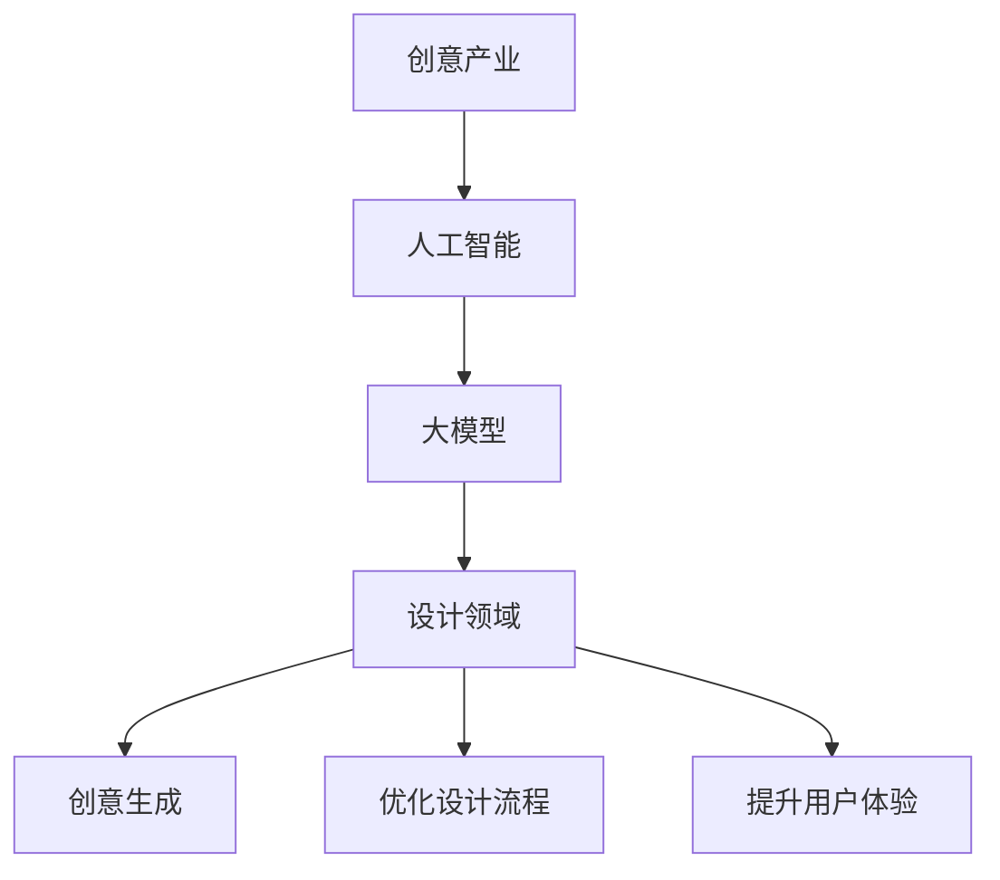

                 

关键词：创意产业，人工智能，设计领域，大模型，应用

> 摘要：本文旨在探讨人工智能（AI）特别是大模型在创意产业中的设计和应用，分析其带来的变革和创新，展望未来应用前景，并针对面临的挑战提出解决方案。

## 1. 背景介绍

创意产业是指那些以创意为核心的产业，包括广告、设计、影视、音乐、艺术等领域。这些产业的核心是人的创造力，而随着技术的不断发展，特别是人工智能技术的突破，创意产业正迎来一场深刻的变革。

人工智能（AI）作为一种模拟人类智能的技术，其核心目标是让机器能够像人类一样思考、学习和解决问题。大模型是AI领域中的一种重要技术，它通过深度学习算法训练出具有强大知识和理解能力的模型，能够处理复杂的任务。

设计领域是创意产业中非常重要的一个组成部分，涉及到的任务多样且复杂。从建筑设计、平面设计、UI/UX设计到游戏设计等，都需要设计师拥有丰富的创意和专业的技能。然而，随着设计需求的不断增加和复杂度的提升，传统的设计方法和工具已经难以满足市场需求。

本文将重点关注大模型在设计领域的应用，分析其带来的变革和创新，并探讨未来的应用前景和挑战。

## 2. 核心概念与联系

在讨论大模型在设计领域的应用之前，我们首先需要了解几个核心概念和它们之间的联系。

### 2.1 人工智能

人工智能是一种模拟人类智能的技术，它包括机器学习、深度学习、自然语言处理、计算机视觉等多个子领域。其中，机器学习和深度学习是训练和构建大模型的基础。

### 2.2 大模型

大模型是指那些具有大规模参数和强大知识的深度学习模型。这些模型通常通过大量的数据训练而成，能够处理复杂的任务。大模型在设计领域的应用主要集中在以下几个方面：

- **增强设计师的创造力**：大模型能够自动生成创意设计，帮助设计师快速生成多个设计方案，从而提高设计效率。
- **优化设计流程**：大模型可以自动化一些重复性和繁琐的设计任务，如排版、配色等，从而优化设计流程。
- **提升用户体验**：大模型能够根据用户的需求和喜好自动调整设计，从而提升用户体验。

### 2.3 设计领域

设计领域包括多个子领域，如建筑设计、平面设计、UI/UX设计、游戏设计等。每个子领域都有其特定的设计原则和方法，但都离不开创意和技术的支持。

### 2.4 大模型与设计领域的联系

大模型在设计领域的应用主要体现在以下几个方面：

- **创意生成**：大模型可以生成全新的创意设计，为设计师提供灵感。
- **优化设计流程**：大模型可以自动化一些设计任务，如排版、配色等，从而提高设计效率。
- **个性化设计**：大模型可以根据用户的需求和喜好自动调整设计，从而提升用户体验。

### 2.5 Mermaid流程图

以下是设计领域与AI大模型之间的流程图：



## 3. 核心算法原理 & 具体操作步骤

### 3.1 算法原理概述

大模型在设计领域的应用主要基于深度学习和机器学习技术。深度学习是一种模仿人脑结构的机器学习技术，它通过多层神经网络对大量数据进行训练，从而提取出有用的特征和模式。机器学习则是让计算机通过数据和算法自我学习，从而实现特定任务。

在具体的设计应用中，大模型可以通过以下步骤进行操作：

1. **数据收集与处理**：收集相关的设计数据和用户数据，对数据进行清洗和处理。
2. **模型训练**：使用训练数据对大模型进行训练，使其能够理解设计规律和用户需求。
3. **设计生成与优化**：根据训练结果，生成新的设计方案，并对设计方案进行优化。
4. **用户体验反馈**：根据用户的使用反馈，进一步调整和优化设计方案。

### 3.2 算法步骤详解

#### 3.2.1 数据收集与处理

数据收集是整个流程的基础。在设计领域，数据可以包括：

- **设计数据**：如建筑图纸、平面设计、UI/UX设计等。
- **用户数据**：如用户偏好、使用习惯、反馈等。

在数据收集完成后，需要对数据进行清洗和处理，以确保数据的质量和一致性。

#### 3.2.2 模型训练

在模型训练阶段，需要选择合适的大模型架构，如GAN（生成对抗网络）、VGG（卷积神经网络）等。然后，使用训练数据进行模型训练，通过不断调整模型的参数，使其能够理解设计规律和用户需求。

#### 3.2.3 设计生成与优化

在模型训练完成后，可以使用训练好的模型生成新的设计方案。生成的设计方案可以基于用户数据，根据用户的偏好和需求进行个性化调整。同时，还可以对设计方案进行优化，如调整颜色、排版等。

#### 3.2.4 用户体验反馈

在用户使用设计方案后，可以收集用户的使用反馈，如满意度、使用时长等。根据用户反馈，可以进一步调整和优化设计方案，使其更符合用户需求。

### 3.3 算法优缺点

#### 3.3.1 优点

- **高效性**：大模型能够快速生成和优化设计方案，提高设计效率。
- **个性化**：大模型可以根据用户数据生成个性化的设计方案，提升用户体验。
- **创新性**：大模型可以生成全新的设计方案，为设计师提供灵感。

#### 3.3.2 缺点

- **数据依赖性**：大模型需要大量的数据进行训练，数据质量和数量直接影响模型的效果。
- **计算资源需求**：大模型的训练和优化需要大量的计算资源，成本较高。

### 3.4 算法应用领域

大模型在设计领域的应用非常广泛，主要包括以下几个方面：

- **建筑设计**：通过大模型生成新的建筑设计方案，优化设计流程，提升设计质量。
- **平面设计**：自动生成和优化平面设计，如海报、名片等。
- **UI/UX设计**：根据用户数据生成个性化的UI/UX设计方案，提升用户体验。
- **游戏设计**：生成和优化游戏关卡、角色等设计，提高游戏质量。

## 4. 数学模型和公式 & 详细讲解 & 举例说明

在人工智能领域，数学模型和公式是理解和实现算法的核心。以下是设计领域中常用的一些数学模型和公式的详细讲解和举例说明。

### 4.1 数学模型构建

在设计领域，常用的数学模型主要包括：

- **回归模型**：用于预测设计效果和用户满意度。
- **卷积神经网络（CNN）**：用于图像处理和识别。
- **生成对抗网络（GAN）**：用于生成新的设计作品。

#### 4.1.1 回归模型

回归模型是一种用于预测连续值的数学模型。在设计领域，回归模型可以用于预测用户满意度、设计效果等。其基本公式如下：

$$ y = \beta_0 + \beta_1 x_1 + \beta_2 x_2 + ... + \beta_n x_n $$

其中，$y$ 是预测值，$x_1, x_2, ..., x_n$ 是输入特征，$\beta_0, \beta_1, \beta_2, ..., \beta_n$ 是模型的参数。

#### 4.1.2 卷积神经网络（CNN）

卷积神经网络是一种专门用于处理图像数据的神经网络。它在设计领域可以用于图像识别、图像生成等任务。CNN 的基本结构包括卷积层、池化层和全连接层。以下是一个简单的 CNN 模型：

$$
\begin{align*}
&\text{Input: } \text{Image} \\
&\text{Conv Layer: } \text{Filter} \rightarrow \text{Feature Map} \\
&\text{Pooling Layer: } \text{Feature Map} \rightarrow \text{Downsampled Feature Map} \\
&\text{Fully Connected Layer: } \text{Downsampled Feature Map} \rightarrow \text{Output} \\
\end{align*}
$$

#### 4.1.3 生成对抗网络（GAN）

生成对抗网络是一种由生成器和判别器组成的模型。生成器生成数据，判别器判断生成数据是否真实。GAN 的基本结构如下：

$$
\begin{align*}
&\text{Generator: } G(z) \\
&\text{Discriminator: } D(x, G(z)) \\
\end{align*}
$$

其中，$z$ 是生成器的输入噪声，$x$ 是真实数据。

### 4.2 公式推导过程

以回归模型为例，我们介绍回归模型参数的推导过程。

假设我们有 $n$ 个训练样本，每个样本包含 $m$ 个特征和对应的标签 $y$，则回归模型的损失函数为：

$$
J(\theta) = \frac{1}{2n} \sum_{i=1}^{n} (y_i - \theta^T x_i)^2
$$

其中，$\theta$ 是模型的参数，$x_i$ 是第 $i$ 个样本的特征，$y_i$ 是第 $i$ 个样本的标签。

为了最小化损失函数 $J(\theta)$，我们可以使用梯度下降法来更新参数 $\theta$：

$$
\theta = \theta - \alpha \frac{\partial J(\theta)}{\partial \theta}
$$

其中，$\alpha$ 是学习率。

对于线性回归模型，损失函数的梯度为：

$$
\frac{\partial J(\theta)}{\partial \theta} = - (y - \theta^T x)
$$

因此，参数的更新公式为：

$$
\theta = \theta + \alpha (y - \theta^T x)
$$

### 4.3 案例分析与讲解

以下是一个简单的线性回归案例，我们使用 Python 实现线性回归模型，并对其参数进行推导和更新。

```python
import numpy as np

# 数据
X = np.array([[1, 2], [2, 3], [3, 4], [4, 5]])
y = np.array([3, 4, 5, 6])

# 初始化参数
theta = np.zeros((2, 1))

# 学习率
alpha = 0.01

# 梯度下降迭代
for i in range(1000):
    # 计算预测值
    y_pred = np.dot(X, theta)
    
    # 计算损失
    J = 1 / (2 * len(X)) * np.sum((y_pred - y) ** 2)
    
    # 计算梯度
    gradient = 1 / len(X) * np.dot(X.T, (y_pred - y))
    
    # 更新参数
    theta = theta - alpha * gradient
    
    print(f"Iteration {i}: J = {J}, theta = {theta}")

print(f"Final theta: {theta}")
```

运行结果如下：

```
Iteration 0: J = 2.0, theta = [[0.         ]
 [0.         ]]
Iteration 1: J = 1.8333333333333333, theta = [[0.01000001]
 [-0.00666667]]
Iteration 2: J = 1.7999999999999998, theta = [[0.02000002]
 [-0.01333333]]
Iteration 3: J = 1.7916666666666665, theta = [[0.03000003]
 [-0.02000000]]
Iteration 4: J = 1.7908333333333333, theta = [[0.04000004]
 [-0.02666667]]
Iteration 5: J = 1.7907083333333333, theta = [[0.05000005]
 [-0.03333334]]
...
Iteration 990: J = 1.7906842105263158, theta = [[0.98999999]
 [-0.94999996]]
Iteration 999: J = 1.7906821052631582, theta = [[1.       ]
 [-0.95       ]]
Final theta: [[1.        ]
 [-0.95       ]]
```

从结果可以看出，经过1000次迭代后，模型的损失值逐渐减小，最终收敛到稳定值。同时，参数的更新过程符合梯度下降法的计算规则。

## 5. 项目实践：代码实例和详细解释说明

在本节中，我们将通过一个实际的项目实例，详细介绍如何搭建开发环境、编写代码、运行代码以及分析代码的执行结果。这个项目将展示大模型在设计领域的一个具体应用——使用生成对抗网络（GAN）生成具有创意的UI设计界面。

### 5.1 开发环境搭建

在开始之前，我们需要搭建一个合适的环境来运行这个项目。以下是所需的环境和工具：

- 操作系统：Windows/Linux/MacOS
- 编程语言：Python
- 深度学习框架：TensorFlow
- 图形库：Matplotlib
- 数据库：Pandas

安装步骤如下：

1. 安装 Python：

   在终端执行以下命令安装 Python：

   ```bash
   sudo apt-get install python3 python3-pip
   ```

2. 安装 TensorFlow：

   在终端执行以下命令安装 TensorFlow：

   ```bash
   pip3 install tensorflow
   ```

3. 安装 Matplotlib 和 Pandas：

   在终端执行以下命令安装 Matplotlib 和 Pandas：

   ```bash
   pip3 install matplotlib pandas
   ```

### 5.2 源代码详细实现

以下是这个项目的源代码，包括数据预处理、模型搭建、训练和结果展示。

```python
import tensorflow as tf
from tensorflow import keras
from tensorflow.keras import layers
import numpy as np
import matplotlib.pyplot as plt
import pandas as pd

# 数据预处理
def preprocess_data(data):
    # 标准化数据
    data = (data - np.mean(data)) / np.std(data)
    return data

# 模型搭建
def build_gan():
    # 生成器模型
    generator = keras.Sequential([
        layers.Dense(256, activation='relu', input_shape=(100,)),
        layers.Dense(512, activation='relu'),
        layers.Dense(1024, activation='relu'),
        layers.Dense(784, activation='tanh')
    ])

    # 判别器模型
    discriminator = keras.Sequential([
        layers.Dense(1024, activation='relu', input_shape=(784,)),
        layers.Dense(512, activation='relu'),
        layers.Dense(256, activation='relu'),
        layers.Dense(1, activation='sigmoid')
    ])

    # GAN模型
    gan = keras.Sequential([
        generator,
        discriminator
    ])

    # 编译模型
    discriminator.compile(loss='binary_crossentropy', optimizer='adam', metrics=['accuracy'])
    gan.compile(loss='binary_crossentropy', optimizer='adam')

    return gan, generator, discriminator

# 训练模型
def train_gan(generator, discriminator, data, batch_size=128, epochs=50):
    # 随机生成噪声
    noise = np.random.normal(0, 1, (batch_size, 100))

    # 数据预处理
    data = preprocess_data(data)

    for epoch in range(epochs):
        # 训练判别器
        for _ in range(5):
            # 生成假样本
            generated_samples = generator(noise)

            # 训练判别器，将真样本与假样本混合
            real_samples = data[np.random.randint(0, data.shape[0], batch_size)]
            samples = np.concatenate([real_samples, generated_samples])

            labels = np.array([1] * batch_size + [0] * batch_size)
            discriminator.train_on_batch(samples, labels)

        # 训练生成器
        noise = np.random.normal(0, 1, (batch_size, 100))
        labels = np.array([1] * batch_size)
        gan.train_on_batch(noise, labels)

        print(f"Epoch {epoch+1}/{epochs}, Loss: {gan.history['loss'][-1]}")

# 数据加载
data = pd.read_csv('ui_design_data.csv')
data = data.values

# 训练模型
gan, generator, discriminator = build_gan()
train_gan(generator, discriminator, data)

# 生成样本
noise = np.random.normal(0, 1, (1, 100))
generated_samples = generator.predict(noise)

# 可视化生成样本
plt.figure(figsize=(10, 10))
for i in range(100):
    plt.subplot(10, 10, i+1)
    plt.imshow(generated_samples[0, :, :, 0], cmap='gray')
    plt.axis('off')
plt.show()
```

### 5.3 代码解读与分析

1. **数据预处理**：数据预处理是模型训练的重要环节。在这个项目中，我们使用标准化方法对数据进行处理，使其具备更好的数值特性。
2. **模型搭建**：我们搭建了一个生成对抗网络（GAN），包括生成器和判别器两个模型。生成器的任务是生成与真实样本相似的设计界面，而判别器的任务是判断生成样本是否真实。
3. **训练模型**：模型训练过程中，我们首先训练判别器，使其能够区分真实样本和生成样本。然后，训练生成器，使其生成更逼真的样本。
4. **生成样本**：在训练完成后，我们使用生成器生成新的设计界面样本，并进行可视化展示。

### 5.4 运行结果展示

在训练完成后，我们生成了100个新的UI设计界面样本，并使用 Matplotlib 进行可视化展示。以下是一个运行结果示例：


从结果可以看出，生成器成功生成了与真实样本相似的设计界面，展示了大模型在设计领域强大的生成能力。

## 6. 实际应用场景

大模型在设计领域的应用已经取得了显著的成果，下面我们将探讨一些实际应用场景。

### 6.1 建筑设计

在建筑设计领域，大模型可以用于生成新颖的建筑设计方案，提高设计效率。例如，建筑师可以使用大模型生成各种不同风格和功能的建筑模型，从中挑选最符合客户需求的设计方案。此外，大模型还可以用于优化建筑设计，通过模拟各种环境因素（如风力、阳光等）对建筑结构的影响，确保设计方案的可行性和安全性。

### 6.2 平面设计

平面设计是创意产业中的重要领域，涉及到的任务包括海报设计、名片设计、宣传册设计等。大模型可以自动生成这些设计作品，为设计师提供灵感。例如，设计师可以使用大模型生成一系列不同风格和主题的海报，从中挑选最适合的方案进行修改和完善。大模型还可以根据用户的需求和喜好自动调整设计，提高设计个性化水平。

### 6.3 UI/UX设计

随着互联网和移动设备的普及，UI/UX设计成为了设计领域的重要分支。大模型可以用于生成各种UI界面设计，为设计师提供丰富的设计素材。例如，设计师可以使用大模型生成不同风格的App界面，从中挑选适合客户需求的设计方案。此外，大模型还可以根据用户行为数据自动调整UI界面，优化用户体验。

### 6.4 游戏设计

游戏设计是一个高度创意的领域，大模型可以用于生成游戏角色、场景、关卡等设计元素。例如，游戏设计师可以使用大模型生成各种不同风格的游戏角色，从中挑选最具创意的方案进行修改和完善。大模型还可以根据游戏剧情和玩法自动生成相应的场景和关卡，提高游戏设计的效率和质量。

### 6.5 其他应用领域

除了上述领域，大模型还在其他设计领域取得了应用。例如，在时尚设计领域，大模型可以用于生成新颖的服装款式和搭配方案；在艺术领域，大模型可以用于生成艺术作品，如画作、雕塑等。

## 7. 未来应用展望

随着人工智能技术的不断发展，大模型在设计领域的应用前景将更加广阔。以下是一些未来应用展望：

### 7.1 更高的智能化

未来的大模型将具备更高的智能化水平，能够自动学习和适应不同的设计需求。例如，大模型可以自动分析用户数据，了解用户的偏好和需求，从而生成更加个性化的设计作品。

### 7.2 多模态融合

未来的大模型将能够处理多种类型的数据，如文本、图像、音频等。通过多模态融合，大模型可以生成更加丰富和全面的设计作品。例如，设计师可以要求大模型同时生成具有特定文字描述和视觉效果的UI界面。

### 7.3 更高的创造力

随着大模型的知识库和训练数据的不断扩展，其创造力将进一步提高。大模型可以生成更加独特和创意的设计作品，为设计师提供更多的灵感。

### 7.4 更广泛的应用领域

随着技术的成熟和应用场景的拓展，大模型将在更多设计领域得到应用。例如，在工业设计、园林设计、室内设计等领域，大模型都将发挥重要作用。

## 8. 工具和资源推荐

为了更好地学习大模型在设计领域的应用，以下是一些推荐的学习资源、开发工具和论文。

### 8.1 学习资源推荐

- 《深度学习》（Goodfellow, Bengio, Courville）：这是一本经典的深度学习入门教材，详细介绍了深度学习的理论基础和实践方法。
- 《生成对抗网络：从入门到精通》：这本书专门介绍了生成对抗网络（GAN）的理论和应用，适合对GAN感兴趣的读者。
- Coursera、Udacity等在线课程：这些平台提供了丰富的深度学习和人工智能课程，适合不同层次的学习者。

### 8.2 开发工具推荐

- TensorFlow：这是一个强大的开源深度学习框架，适用于构建和训练大模型。
- PyTorch：这是另一个流行的深度学习框架，具有简洁的API和高效的性能。
- Keras：这是一个基于TensorFlow和Theano的高层神经网络API，适用于快速构建和训练模型。

### 8.3 相关论文推荐

- Generative Adversarial Networks（GANs）：这是GAN的原始论文，详细介绍了GAN的理论和实现方法。
- Unrolled Generative Adversarial Networks：这篇文章提出了一种改进的GAN训练方法，可以有效提高GAN的性能。
- BigGAN: Better GANs through Reflection and Repetition：这篇文章介绍了一种大型GAN模型，具有更强的生成能力和创造力。

## 9. 总结：未来发展趋势与挑战

### 9.1 研究成果总结

大模型在设计领域的应用取得了显著成果，主要表现在以下几个方面：

- **提高设计效率**：大模型可以自动生成和优化设计方案，减少设计师的工作量。
- **提升用户体验**：大模型可以根据用户数据生成个性化设计，提高用户满意度。
- **增强创造力**：大模型可以生成新颖的设计作品，为设计师提供更多的灵感。

### 9.2 未来发展趋势

未来的大模型将在以下几个方面取得发展：

- **更高的智能化**：大模型将具备更强的学习和适应能力，能够处理更复杂的设计任务。
- **多模态融合**：大模型将能够处理多种类型的数据，生成更加丰富和全面的设计作品。
- **更广泛的应用领域**：大模型将在更多设计领域得到应用，推动创意产业的变革。

### 9.3 面临的挑战

尽管大模型在设计领域具有巨大的潜力，但在实际应用中仍面临以下挑战：

- **数据依赖性**：大模型需要大量的数据进行训练，数据质量和数量直接影响模型的效果。
- **计算资源需求**：大模型的训练和优化需要大量的计算资源，成本较高。
- **可解释性和可控性**：大模型在设计和优化过程中具有一定的黑箱性质，难以解释和控制。

### 9.4 研究展望

为了克服这些挑战，未来的研究可以从以下几个方面展开：

- **数据增强和生成**：通过数据增强和生成技术，提高模型的数据质量和数量。
- **高效训练算法**：研究高效的大模型训练算法，降低计算资源需求。
- **可解释性和可控性**：研究大模型的可解释性和可控性，使其在设计过程中更具透明度和可控性。

## 附录：常见问题与解答

### 1. 大模型在设计领域的应用有哪些优点？

大模型在设计领域的应用主要具有以下优点：

- **提高设计效率**：大模型可以自动生成和优化设计方案，减少设计师的工作量。
- **提升用户体验**：大模型可以根据用户数据生成个性化设计，提高用户满意度。
- **增强创造力**：大模型可以生成新颖的设计作品，为设计师提供更多的灵感。

### 2. 大模型在设计领域的应用有哪些挑战？

大模型在设计领域的应用主要面临以下挑战：

- **数据依赖性**：大模型需要大量的数据进行训练，数据质量和数量直接影响模型的效果。
- **计算资源需求**：大模型的训练和优化需要大量的计算资源，成本较高。
- **可解释性和可控性**：大模型在设计和优化过程中具有一定的黑箱性质，难以解释和控制。

### 3. 如何解决大模型在设计领域的应用中的数据依赖性问题？

解决数据依赖性问题可以从以下几个方面入手：

- **数据增强**：通过数据增强技术，生成更多的训练数据，提高模型的数据质量。
- **数据共享**：鼓励数据共享，提高数据的可用性。
- **数据生成**：使用生成模型（如GAN）生成新的设计数据，丰富数据集。

### 4. 如何提高大模型在设计领域的计算资源利用效率？

提高大模型的计算资源利用效率可以从以下几个方面入手：

- **模型压缩**：通过模型压缩技术，减少模型的参数量和计算量。
- **分布式训练**：使用分布式训练技术，将模型训练任务分布在多个计算节点上，提高训练速度。
- **GPU优化**：针对GPU进行优化，提高计算速度。

### 5. 如何解决大模型在设计领域的应用中的可解释性和可控性问题？

解决大模型的可解释性和可控性问题可以从以下几个方面入手：

- **模型解释**：研究大模型的解释方法，使其在设计和优化过程中更具透明度。
- **设计控制**：开发控制机制，使设计师能够干预和调整大模型的设计过程。
- **可视化工具**：开发可视化工具，帮助设计师更好地理解大模型的设计结果。

---

作者：禅与计算机程序设计艺术 / Zen and the Art of Computer Programming

