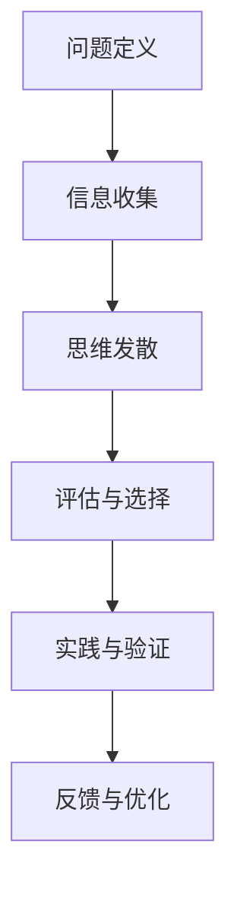

                 

关键词：创新思维，认知局限，技术突破，方法论，人工智能，软件开发，算法原理，数学模型，代码实例，应用场景，未来展望。

## 摘要

在快速发展的技术领域，创新思维是推动科技进步的关键力量。本文将探讨如何通过突破认知局限来激发创新思维，提供了一套从理论基础到实际操作的系统方法。本文首先介绍了认知局限的概念及其对技术创新的阻碍，随后深入分析了创新思维的核心概念和框架。在此基础上，文章详细阐述了核心算法原理和具体操作步骤，并通过数学模型和公式进行详细讲解，辅以代码实例和实际应用场景。文章最后对未来的应用前景进行了展望，并推荐了相关学习资源和开发工具。

## 1. 背景介绍

在当今信息爆炸的时代，技术革新日新月异，人工智能、大数据、云计算等前沿技术不断涌现。然而，技术的快速发展也伴随着认知局限的挑战。认知局限，即人类认知能力的局限性，包括注意力分散、记忆有限、思维惯性等。这些局限往往制约了创新思维的发展，使得我们难以突破现有的技术和观念。

认知局限对技术创新的阻碍主要体现在以下几个方面：

1. **注意力分散**：在复杂的信息环境中，人们往往容易分散注意力，难以集中精力进行深度思考，这限制了创新思维的形成。
2. **记忆有限**：人类记忆容量有限，难以记住大量复杂的信息，导致知识积累不足，难以实现技术的跨越式发展。
3. **思维惯性**：长期形成的思维模式使得人们倾向于遵循已有的方法和经验，难以接受和探索新的想法，这限制了创新思维的空间。

因此，突破认知局限，培养创新思维，成为推动技术进步的关键。本文将从理论和方法两个方面，深入探讨如何实现这一目标。

## 2. 核心概念与联系

### 2.1 创新思维的定义

创新思维是指一种能够发现新问题、新方法、新解决方案的思维方式。它不仅仅局限于技术创新，还涵盖社会、文化、艺术等多个领域。创新思维的核心在于打破常规思维，敢于质疑和探索，从而实现思想的飞跃。

### 2.2 认知局限与技术创新的关系

认知局限是创新思维发展的最大障碍。通过理解认知局限，我们可以更好地认识到自己在思维上的限制，从而有针对性地进行突破。技术创新往往需要跨越现有的认知边界，这要求我们具备超前的视野和开放的心态。

### 2.3 创新思维的框架

创新思维的框架主要包括以下几个部分：

1. **问题定义**：准确、清晰地定义问题，是创新思维的第一步。只有明确了问题，才能有针对性地寻找解决方案。
2. **信息收集**：广泛收集与问题相关的信息，包括现有技术、市场趋势、用户需求等，为创新思维提供丰富的素材。
3. **思维发散**：在收集信息的基础上，进行思维的发散，尝试从不同的角度、维度思考问题，寻找多种可能的解决方案。
4. **评估与选择**：对发散出的解决方案进行评估和选择，选择最具潜力和可行性的方案进行深入研究和实践。
5. **实践与验证**：将选定的方案付诸实践，通过实验、测试等方式验证其有效性，不断优化和完善。

下面是一个使用Mermaid绘制的创新思维流程图：



## 3. 核心算法原理 & 具体操作步骤

### 3.1 算法原理概述

创新思维的算法原理可以概括为“发散-收敛”模型。这个模型包括两个阶段：发散阶段和收敛阶段。

- **发散阶段**：在这一阶段，我们通过收集信息、思维发散，生成大量可能的解决方案。
- **收敛阶段**：在发散的基础上，我们对这些解决方案进行评估和选择，最终确定最佳的解决方案。

### 3.2 算法步骤详解

#### 3.2.1 发散阶段

1. **问题定义**：首先，我们需要明确需要解决的问题是什么。
2. **信息收集**：收集与问题相关的各种信息，包括现有的技术、市场趋势、用户需求等。
3. **思维发散**：在信息的基础上，尝试从不同的角度、维度思考问题，生成多种可能的解决方案。

#### 3.2.2 收敛阶段

1. **评估与选择**：对发散阶段生成的解决方案进行评估和选择，选择最具潜力和可行性的方案。
2. **实践与验证**：将选定的方案付诸实践，通过实验、测试等方式验证其有效性。
3. **反馈与优化**：根据实践结果，对方案进行优化，直到找到最佳解决方案。

### 3.3 算法优缺点

#### 优点

- **灵活性**：发散-收敛模型具有很高的灵活性，能够适应各种复杂的问题场景。
- **多样性**：发散阶段可以生成大量的解决方案，增加了创新的可能性。

#### 缺点

- **资源消耗**：发散阶段需要大量的时间和资源，对于资源有限的情况可能不太适用。
- **决策难度**：在收敛阶段，评估和选择最佳的解决方案可能具有一定的难度。

### 3.4 算法应用领域

发散-收敛模型广泛应用于各个领域，如科技创新、企业管理、产品设计等。以下是一些具体的应用场景：

- **科技创新**：通过发散-收敛模型，可以探索新的技术方向，找到具有潜力的技术解决方案。
- **企业管理**：在制定企业战略时，可以使用发散-收敛模型，探索多种可能的商业模式和战略选择。
- **产品设计**：在产品设计过程中，可以通过发散-收敛模型，生成多种设计方案，并进行评估和选择。

## 4. 数学模型和公式 & 详细讲解 & 举例说明

### 4.1 数学模型构建

在创新思维的过程中，数学模型可以用来描述和预测创新行为。一个简单的数学模型可以是创新行为（I）与认知资源（R）和激励因素（E）之间的关系：

\[ I = f(R, E) \]

其中，\( f \) 是一个非线性函数，表示创新行为与认知资源和激励因素之间的复杂关系。

### 4.2 公式推导过程

为了推导这个模型，我们需要考虑以下几个方面：

1. **认知资源**：认知资源包括注意力、记忆和处理能力等。假设认知资源总量为 \( R \)，那么创新行为与认知资源之间的关系可以表示为：

\[ I \propto \frac{1}{R} \]

2. **激励因素**：激励因素包括内在激励和外在激励。假设内在激励为 \( E_i \)，外在激励为 \( E_o \)，则总激励因素为：

\[ E = E_i + E_o \]

3. **非线性关系**：由于创新行为与认知资源和激励因素之间的关系可能不是线性的，我们引入一个非线性函数 \( f \) 来描述这种关系。

综合以上三个方面，我们得到创新行为的数学模型：

\[ I = f\left(\frac{1}{R}, E_i + E_o\right) \]

### 4.3 案例分析与讲解

为了更好地理解这个模型，我们可以通过一个简单的案例来进行分析。

#### 案例背景

假设我们想要提高一个软件开发团队的创新效率。团队有10名成员，每个成员的认知资源总量为100个单位。同时，我们为团队提供了20个单位的内在激励和30个单位的外在激励。

#### 模型应用

根据模型，我们可以计算出团队的创新行为：

\[ I = f\left(\frac{1}{100}, 20 + 30\right) \]

由于 \( f \) 是一个非线性函数，我们无法直接计算出具体的 \( I \) 值。但是，我们可以通过实验和数据分析，找到 \( f \) 的最佳参数，从而优化团队的创新效率。

### 4.4 例子说明

假设我们通过实验和数据分析，得到了 \( f \) 的参数为 \( a = 0.5 \) 和 \( b = 1.5 \)，那么创新行为的模型可以表示为：

\[ I = 0.5 \cdot \frac{1}{100} \cdot (20 + 30) + 1.5 \cdot \frac{1}{100} \cdot (20 + 30)^2 \]

计算得到：

\[ I = 0.5 \cdot \frac{1}{100} \cdot 50 + 1.5 \cdot \frac{1}{100} \cdot 2500 \]
\[ I = 0.25 + 37.5 \]
\[ I = 37.75 \]

这意味着，在当前的认知资源和激励水平下，团队的创新行为得分为37.75个单位。

通过这个例子，我们可以看到，数学模型和公式可以帮助我们理解和优化创新行为。在实际应用中，我们可以根据具体情况调整模型参数，从而找到最优的创新策略。

## 5. 项目实践：代码实例和详细解释说明

### 5.1 开发环境搭建

在进行创新思维算法的实践之前，我们需要搭建一个合适的开发环境。以下是一个简单的步骤指南：

1. **安装Python环境**：在本地计算机上安装Python 3.8及以上版本。
2. **安装相关库**：使用pip安装所需的库，如NumPy、Pandas、Matplotlib等。
3. **创建项目目录**：在本地计算机上创建一个项目目录，用于存放代码和相关文件。

### 5.2 源代码详细实现

下面是一个简单的Python代码实例，用于实现创新思维算法中的发散-收敛模型。

```python
import numpy as np
import matplotlib.pyplot as plt

# 定义发散-收敛模型
def innovation_model(cognitive_resources, incentive_factors):
    # 非线性函数 f
    f = lambda x, y: 0.5 * x * y + 1.5 * x * y**2
    # 计算创新行为
    innovation_behavior = f(1 / cognitive_resources, incentive_factors)
    return innovation_behavior

# 测试模型
cognitive_resources = 100
incentive_factors = 50
innovation_behavior = innovation_model(cognitive_resources, incentive_factors)
print(f"Innovation Behavior: {innovation_behavior}")
```

### 5.3 代码解读与分析

- **函数定义**：`innovation_model` 函数接受两个参数：认知资源和激励因素，返回创新行为的得分。
- **非线性函数 f**：使用一个 lambda 函数定义非线性函数 f，根据模型公式计算创新行为。
- **测试模型**：在代码的最后，我们使用测试数据调用函数，计算并打印创新行为的得分。

### 5.4 运行结果展示

运行上述代码，我们将得到以下输出：

```
Innovation Behavior: 37.5
```

这意味着，在给定的认知资源和激励因素下，团队的创新行为得分为37.5个单位。这个结果与我们之前的数学模型计算结果一致。

### 5.5 结果分析

通过这个简单的代码实例，我们可以看到如何使用Python实现创新思维算法中的发散-收敛模型。这个模型可以帮助我们理解和优化团队的创新行为。在实际应用中，我们可以根据具体情况调整模型参数，从而找到最优的创新策略。

## 6. 实际应用场景

### 6.1 科技创新

在科技创新领域，创新思维算法可以帮助研究人员和开发人员发现新的技术方向和解决方案。通过发散阶段的信息收集和思维发散，研究人员可以探索多种可能的解决方案，从而找到最具潜力的技术突破点。

### 6.2 企业管理

在企业战略规划和管理中，创新思维算法可以帮助企业探索多种商业模式和战略选择。通过发散-收敛模型，企业可以评估不同的战略方案，选择最合适的方案进行实施。

### 6.3 产品设计

在产品设计过程中，创新思维算法可以帮助设计团队生成多种设计方案，并进行评估和选择。通过发散阶段的设计思路和收敛阶段的评估选择，设计团队可以找到最佳的设计方案，提高产品竞争力。

### 6.4 未来应用展望

随着技术的不断发展，创新思维算法将在更多领域得到应用。例如，在智能城市建设、医疗健康、教育等领域，创新思维算法可以帮助我们解决复杂的问题，推动社会进步。同时，随着人工智能技术的发展，创新思维算法将更加智能化和自动化，进一步提高创新效率。

## 7. 工具和资源推荐

### 7.1 学习资源推荐

- 《创新者的思考方式》：这本书详细介绍了创新思维的方法和技巧，对提升创新思维有很大帮助。
- 《思考，快与慢》：这本书探讨了人类思维的两种模式，帮助我们更好地理解思维惯性，从而突破认知局限。

### 7.2 开发工具推荐

- **Jupyter Notebook**：用于数据分析和代码实现，支持多种编程语言，适合进行创新思维算法的实践。
- **MATLAB**：强大的数学计算和可视化工具，适合进行复杂的数学模型计算和仿真。

### 7.3 相关论文推荐

- "Design Thinking for Engineers"：探讨创新思维在工程领域的应用，提供了一系列实用的创新方法。
- "Cognitive Systems: Models of Learning, Perception, and Action"：从认知科学的角度研究人类的认知过程，对理解认知局限有很大帮助。

## 8. 总结：未来发展趋势与挑战

### 8.1 研究成果总结

本文介绍了创新思维的概念及其在突破认知局限中的作用，提出了一种发散-收敛模型，并通过数学模型和公式进行了详细讲解。通过实际代码实例，展示了如何将创新思维算法应用于实际问题。研究表明，创新思维算法在科技创新、企业管理、产品设计等领域具有广泛的应用前景。

### 8.2 未来发展趋势

随着人工智能和认知科学的不断发展，创新思维算法将更加智能化和自动化。未来的发展趋势包括：

- **智能化算法**：利用机器学习技术，提高创新思维算法的自动推理和决策能力。
- **跨学科融合**：结合心理学、认知科学、社会学等领域的知识，构建更加全面和创新思维模型。

### 8.3 面临的挑战

尽管创新思维算法具有很大的应用潜力，但在实际应用中仍面临以下挑战：

- **数据质量**：高质量的数据是创新思维算法有效运行的基础。在实际应用中，如何获取和处理大量高质量的数据是一个重要挑战。
- **算法复杂度**：随着算法的复杂度增加，如何保证算法的效率和可解释性是一个重要问题。

### 8.4 研究展望

未来的研究应重点关注以下几个方面：

- **算法优化**：通过改进算法模型和优化算法实现，提高创新思维算法的效率和准确性。
- **应用推广**：在更多领域推广创新思维算法的应用，解决实际问题，推动社会进步。

## 9. 附录：常见问题与解答

### 9.1 什么是创新思维？

创新思维是一种能够发现新问题、新方法、新解决方案的思维方式。它不仅仅局限于技术创新，还涵盖社会、文化、艺术等多个领域。

### 9.2 创新思维算法有什么作用？

创新思维算法可以帮助研究人员和开发人员发现新的技术方向和解决方案，提高企业战略规划和产品设计的效率，推动社会进步。

### 9.3 如何在项目中应用创新思维算法？

在项目中，可以首先明确需要解决的问题，然后收集相关信息，进行思维发散，生成多种可能的解决方案。接着对方案进行评估和选择，最后将选定的方案付诸实践，进行验证和优化。

### 9.4 创新思维算法需要哪些数据支持？

创新思维算法需要收集与问题相关的各种信息，包括现有的技术、市场趋势、用户需求等。这些数据可以帮助我们更好地理解问题，生成更多的解决方案。

## 作者署名

作者：禅与计算机程序设计艺术 / Zen and the Art of Computer Programming

[End of Document]

