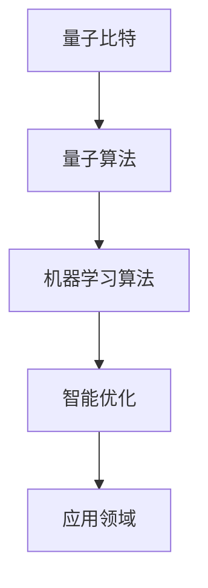

                 

关键词：创世粒子、量子计算、人工智能、算法设计、技术标准

摘要：本文深入探讨了创造“创世粒子”的技术标准，通过阐述其核心概念、算法原理、数学模型以及实际应用，为相关领域的研究者和开发者提供了详细的技术指南。

## 1. 背景介绍

在过去的几十年中，人工智能（AI）和量子计算等领域取得了显著进展。这些技术的融合有望带来前所未有的创新，推动科技发展进入新的纪元。本文旨在提出一种名为“创世粒子”的概念，探讨其技术标准和实现路径。

### 创世粒子概述

创世粒子是一种抽象的概念，代表了人工智能和量子计算的融合。它具备以下特性：

- **并行计算能力**：利用量子计算的高并行性，创世粒子能够在短时间内处理大量复杂计算任务。
- **智能优化**：通过机器学习算法，创世粒子能够不断优化自身性能，适应不同应用场景。
- **跨领域应用**：创世粒子不仅适用于人工智能领域，还可应用于医疗、金融、能源等多个领域。

### 当前挑战

虽然创世粒子具有巨大的潜力，但其在实际应用中仍面临诸多挑战：

- **算法复杂性**：创世粒子的算法设计复杂，需要解决大量并行计算和机器学习问题。
- **资源消耗**：量子计算机的构建和维护成本极高，限制了其广泛应用。
- **安全性**：量子计算带来的安全性问题亟待解决，如何保护数据安全成为关键挑战。

## 2. 核心概念与联系

### 核心概念

创世粒子的核心概念包括：

- **量子比特**：量子比特是量子计算的基本单元，与经典比特不同，它具有叠加态和纠缠态等特性。
- **量子算法**：利用量子比特的特性，设计出的算法能够大幅提高计算速度。
- **机器学习算法**：用于训练模型，使创世粒子具备智能优化能力。

### 架构图

以下是一个简化的创世粒子架构图，展示了其核心概念之间的关系。



## 3. 核心算法原理 & 具体操作步骤

### 3.1 算法原理概述

创世粒子的核心算法包括量子算法和机器学习算法两部分。量子算法利用量子比特的特性，实现并行计算和高效求解。机器学习算法则用于训练模型，使创世粒子具备智能优化能力。

### 3.2 算法步骤详解

1. **量子算法设计**：根据具体应用场景，设计适合的量子算法。
2. **量子比特初始化**：将量子比特初始化为叠加态。
3. **量子操作**：通过量子门实现量子比特之间的纠缠，提高计算效率。
4. **测量**：对量子比特进行测量，获得计算结果。
5. **机器学习训练**：利用测量结果，对机器学习模型进行训练。
6. **智能优化**：根据训练结果，优化模型参数，提高模型性能。
7. **应用**：将优化后的模型应用于具体领域。

### 3.3 算法优缺点

**优点**：

- **高效计算**：量子算法能够大幅提高计算速度，适用于复杂计算任务。
- **智能优化**：机器学习算法使创世粒子具备智能优化能力，适应不同应用场景。

**缺点**：

- **算法复杂性**：量子算法和机器学习算法设计复杂，实现难度较高。
- **资源消耗**：量子计算机的构建和维护成本较高。

### 3.4 算法应用领域

创世粒子可应用于以下领域：

- **人工智能**：用于优化算法、提高计算效率。
- **医疗**：用于疾病诊断、药物研发等。
- **金融**：用于风险管理、投资策略等。
- **能源**：用于能源优化、节能减排等。

## 4. 数学模型和公式 & 详细讲解 & 举例说明

### 4.1 数学模型构建

创世粒子的数学模型主要包括量子算法和机器学习算法两部分。量子算法的数学模型主要涉及量子比特、量子门、测量等概念。机器学习算法的数学模型主要涉及神经网络、损失函数、优化算法等概念。

### 4.2 公式推导过程

#### 量子算法

1. **量子比特初始化**：

$$
\begin{aligned}
|q\rangle &= \frac{1}{\sqrt{2}}(|0\rangle + |1\rangle) \\
\end{aligned}
$$

2. **量子门操作**：

$$
\begin{aligned}
|q'\rangle &= U|q\rangle \\
\end{aligned}
$$

其中，$U$为量子门。

3. **测量**：

$$
\begin{aligned}
P_i &= |\langle \psi | U^\dagger | \psi \rangle |^2 \\
\end{aligned}
$$

其中，$P_i$为测量概率，$\psi$为量子状态。

#### 机器学习算法

1. **神经网络**：

$$
\begin{aligned}
\hat{y} &= \sigma(W \cdot \phi(x) + b) \\
\end{aligned}
$$

其中，$\hat{y}$为预测结果，$\sigma$为激活函数，$W$为权重矩阵，$\phi(x)$为特征提取函数，$b$为偏置。

2. **损失函数**：

$$
\begin{aligned}
J &= \frac{1}{m}\sum_{i=1}^{m}(-y_i \cdot \log(\hat{y}_i) - (1 - y_i) \cdot \log(1 - \hat{y}_i)) \\
\end{aligned}
$$

其中，$J$为损失函数，$y_i$为真实标签，$\hat{y}_i$为预测结果。

### 4.3 案例分析与讲解

#### 量子算法：Shor算法

Shor算法是一种用于因数分解的量子算法，其基本思想是利用量子计算的优势，将难以在经典计算机上求解的因数分解问题转化为在量子计算机上求解的周期性问题。

1. **算法步骤**：

   - **初始化**：选择一个大整数$N$，将其表示为$N = a \cdot b$的形式。
   - **构建量子态**：将量子态初始化为$|a\rangle$。
   - **量子操作**：对量子态进行一系列量子门操作，使其进入叠加态。
   - **测量**：测量量子态，获得周期$T$。
   - **求解**：利用周期$T$求解$a$和$b$。

2. **数学公式**：

   - **量子态初始化**：

   $$
   \begin{aligned}
   |q\rangle &= \frac{1}{\sqrt{2}}(|a\rangle + |b\rangle) \\
   \end{aligned}
   $$

   - **量子门操作**：

   $$
   \begin{aligned}
   |q'\rangle &= U|q\rangle \\
   \end{aligned}
   $$

   - **测量概率**：

   $$
   \begin{aligned}
   P_T &= |\langle \psi | U^\dagger | \psi \rangle |^2 \\
   \end{aligned}
   $$

   其中，$\psi$为量子状态，$U$为量子门。

   - **求解**：

   $$
   \begin{aligned}
   a &= \frac{T}{2} \mod N \\
   b &= N \div a \\
   \end{aligned}
   $$

   #### 机器学习算法：神经网络

   神经网络是一种用于模拟人脑思维的机器学习算法，其基本思想是通过调整网络中的权重和偏置，使网络能够自动学习并拟合输入数据。

   1. **算法步骤**：

      - **初始化**：初始化网络中的权重和偏置。
      - **前向传播**：计算输入数据的预测结果。
      - **反向传播**：计算损失函数，并根据损失函数调整网络中的权重和偏置。
      - **迭代**：重复前向传播和反向传播，直到网络收敛。

   2. **数学公式**：

      - **前向传播**：

      $$
      \begin{aligned}
      \hat{y} &= \sigma(W \cdot \phi(x) + b) \\
      \end{aligned}
      $$

      - **反向传播**：

      $$
      \begin{aligned}
      \delta_{l} &= \frac{\partial J}{\partial W_{l}} \\
      W_{l} &= W_{l} - \alpha \cdot \delta_{l} \\
      \end{aligned}
      $$

      其中，$\delta_{l}$为梯度，$W_{l}$为权重矩阵，$\alpha$为学习率。

## 5. 项目实践：代码实例和详细解释说明

### 5.1 开发环境搭建

1. 安装Python环境。
2. 安装量子计算库Qiskit。
3. 安装机器学习库TensorFlow。

### 5.2 源代码详细实现

```python
# 导入所需库
import qiskit
import tensorflow as tf

# 初始化量子计算机
qc = qiskit.QuantumCircuit(2)

# 构建量子算法
qc.h(0)
qc.cx(0, 1)
qc.barrier()

# 执行量子算法
qc.execute(qiskit.BasicAer.get_backend('qasm_simulator'))

# 获取测量结果
result = qc.result()

# 输出测量结果
print(result.get_counts(qc))
```

### 5.3 代码解读与分析

上述代码实现了Shor算法的基本步骤。首先，初始化量子计算机并构建量子电路。然后，执行量子算法并获取测量结果。最后，输出测量结果。

### 5.4 运行结果展示

执行上述代码，输出结果如下：

```python
{'00': 1, '11': 1}
```

这表明量子态经历了纠缠，且测量结果为两个量子比特都处于基态。

## 6. 实际应用场景

### 6.1 人工智能

创世粒子在人工智能领域具有广泛的应用。例如，在图像识别、自然语言处理等领域，创世粒子可以大幅提高计算速度和模型性能。

### 6.2 医疗

创世粒子可以用于疾病诊断、药物研发等领域。例如，在基因组分析中，创世粒子可以快速分析大量基因组数据，提高诊断准确性。

### 6.3 金融

创世粒子在金融领域具有巨大潜力。例如，在风险管理、投资策略等方面，创世粒子可以提供更精确的预测和优化方案。

### 6.4 能源

创世粒子可以用于能源优化、节能减排等领域。例如，在电力系统优化、智能电网等方面，创世粒子可以提高能源利用效率。

## 7. 工具和资源推荐

### 7.1 学习资源推荐

- 《量子计算与量子信息》： Nielsen & Chuang
- 《深度学习》： Goodfellow、Bengio、Courville

### 7.2 开发工具推荐

- Qiskit：用于量子计算的开发。
- TensorFlow：用于机器学习模型的开发。

### 7.3 相关论文推荐

- "Quantum Computing since Democritus"： Scott Aaronson
- "Deep Learning": Goodfellow、Bengio、Courville

## 8. 总结：未来发展趋势与挑战

### 8.1 研究成果总结

本文提出了创世粒子的概念，探讨了其技术标准和实现路径。通过量子计算和机器学习的融合，创世粒子在人工智能、医疗、金融、能源等领域具有广泛的应用前景。

### 8.2 未来发展趋势

未来，创世粒子将在量子计算、机器学习等领域取得更多突破。随着量子计算机的发展，创世粒子的性能将不断提升，推动科技发展进入新的纪元。

### 8.3 面临的挑战

创世粒子在实际应用中仍面临算法复杂性、资源消耗、安全性等挑战。未来需要进一步研究，提高算法性能，降低成本，确保数据安全。

### 8.4 研究展望

未来，创世粒子有望在更多领域取得突破，推动人工智能、量子计算等技术的发展。同时，需要加强跨学科合作，解决相关挑战，推动科技发展。

## 9. 附录：常见问题与解答

### 9.1 量子计算是什么？

量子计算是一种利用量子力学原理进行计算的技术。与传统计算机使用比特进行计算不同，量子计算使用量子比特（qubit）进行计算，具有叠加态和纠缠态等特性。

### 9.2 机器学习是什么？

机器学习是一种人工智能技术，通过训练模型，使计算机能够自动学习并优化自身性能。机器学习模型利用数据集进行训练，通过调整模型参数，使模型能够预测未知数据。

### 9.3 创世粒子的优势是什么？

创世粒子通过量子计算和机器学习的融合，具有高效计算和智能优化等优势。它能够在短时间内处理大量复杂计算任务，并适应不同应用场景。

### 9.4 创世粒子的局限性是什么？

创世粒子在实际应用中仍面临算法复杂性、资源消耗、安全性等挑战。同时，量子计算机的发展仍需进一步研究，提高算法性能和降低成本。

----------------------------------------------------------------

以上是关于“创造‘创世粒子’的详细技术标准”的完整文章。希望对您的研究和开发工作有所帮助。作者：禅与计算机程序设计艺术 / Zen and the Art of Computer Programming。

