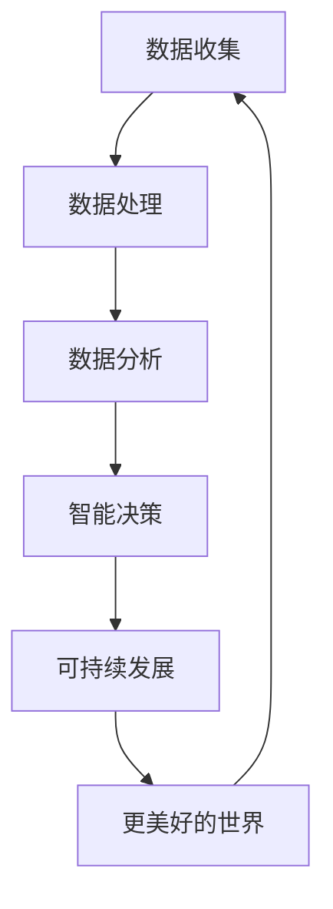

                 

 关键词：人工智能、计算、终极目标、技术进步、可持续发展、数据处理、算法优化、算法应用、数学模型、项目实践、未来展望

> 摘要：本文将深入探讨人类计算的终极目标——创造一个更美好的世界。通过分析当前的技术进步和面临的挑战，我们将探讨如何利用计算技术推动社会和环境的可持续发展，实现这一目标。文章结构包括背景介绍、核心概念与联系、核心算法原理与操作步骤、数学模型与公式、项目实践、实际应用场景、工具和资源推荐、总结与展望以及附录等内容。

## 1. 背景介绍

计算技术作为现代社会的基础设施，已经深刻地改变了我们的生活方式和工作方式。从简单的计算机器到复杂的人工智能系统，计算技术不断发展，推动了人类文明的进步。然而，随着技术的快速发展，我们面临着一系列挑战，包括数据隐私、安全、可持续发展等问题。

在过去的几十年中，人工智能（AI）取得了显著进展。机器学习、深度学习等技术的应用使得计算机能够从海量数据中自动学习和提取知识，从而在图像识别、自然语言处理、医疗诊断等多个领域取得了突破。这些技术的进步不仅改变了传统行业的运作模式，也为我们创造一个更美好的世界提供了新的可能性。

然而，实现这一目标并非易事。计算技术发展过程中产生的大量数据如何被有效利用，如何确保数据的安全和隐私，如何在有限的资源下实现可持续发展，都是我们需要面对的挑战。

本文旨在探讨人类计算的终极目标，分析当前的技术进步和挑战，并提出解决方案，以推动我们向更美好的世界迈进。

## 2. 核心概念与联系

为了更好地理解人类计算的终极目标，我们需要了解几个核心概念和它们之间的联系。以下是这些概念以及它们之间的关系的 Mermaid 流程图：



### 2.1 数据收集

数据收集是计算技术的起点。通过各种传感器、社交网络、商业交易等渠道，我们能够获取到大量的数据。这些数据包括结构化数据、半结构化数据和非结构化数据，涵盖了各种领域和主题。

### 2.2 数据处理

数据处理是将收集到的数据转换为有用的信息的过程。这包括数据清洗、归一化、去重等步骤，以确保数据的质量和一致性。

### 2.3 数据分析

数据分析是利用统计方法、机器学习算法等工具对处理后的数据进行分析，以提取出有价值的信息和洞察。这些分析结果可以用于优化业务流程、提高效率、发现市场趋势等。

### 2.4 智能决策

智能决策是基于数据分析结果，利用算法和模型做出最优的决策。这可以应用于各个领域，如金融、医疗、教育等，以实现更高效、更精准的管理和服务。

### 2.5 可持续发展

可持续发展是通过合理利用资源、减少浪费、保护环境等手段，实现经济、社会和环境的协调发展。计算技术在这一过程中发挥了重要作用，如智能能源管理、环保监测、资源优化等。

### 2.6 更美好的世界

更美好的世界是我们追求的终极目标。通过数据收集、处理、分析和智能决策，我们能够更好地理解世界、解决问题，从而推动社会的进步和可持续发展。

## 3. 核心算法原理与操作步骤

### 3.1 算法原理概述

核心算法是计算技术实现智能决策和可持续发展的关键。以下是几个核心算法的基本原理和步骤：

### 3.2 算法步骤详解

#### 3.2.1 数据收集

数据收集的过程包括以下步骤：

1. 数据源选择：根据需求选择合适的数据源，如传感器、数据库、社交媒体等。
2. 数据采集：通过API、爬虫等方式获取数据。
3. 数据预处理：对采集到的数据进行清洗、去噪、归一化等处理。

#### 3.2.2 数据处理

数据处理的过程包括以下步骤：

1. 数据清洗：去除重复、错误和缺失的数据。
2. 数据归一化：将不同单位或范围的数值进行统一处理。
3. 数据集成：将来自不同数据源的数据进行合并。

#### 3.2.3 数据分析

数据分析的过程包括以下步骤：

1. 特征提取：从原始数据中提取出有用的特征。
2. 模型选择：根据分析目标选择合适的模型。
3. 模型训练：使用训练数据对模型进行训练。
4. 预测与评估：使用训练好的模型进行预测，并评估预测结果的准确性。

#### 3.2.4 智能决策

智能决策的过程包括以下步骤：

1. 决策目标设定：明确决策的目标和约束条件。
2. 算法选择：根据决策目标和数据特点选择合适的算法。
3. 决策执行：根据预测结果执行决策，并进行反馈和调整。

#### 3.2.5 可持续发展

可持续发展涉及多个方面，如资源管理、环境保护等。以下是几个核心算法在可持续发展中的应用：

1. 智能能源管理：利用数据分析算法优化能源使用，降低能源消耗。
2. 环保监测：利用传感器和网络技术实时监测环境质量，及时预警和应对污染问题。
3. 资源优化：利用优化算法合理配置和利用资源，提高资源利用效率。

### 3.3 算法优缺点

每种算法都有其优缺点，以下是对几种核心算法的简要分析：

#### 机器学习算法

- 优点：自动从数据中提取特征，适应性强，能够处理复杂问题。
- 缺点：需要大量数据，对数据质量要求高，解释性较差。

#### 深度学习算法

- 优点：能够处理高维数据和复杂数据结构，效果优异。
- 缺点：计算资源消耗大，模型训练时间较长。

#### 优化算法

- 优点：能够在给定约束条件下找到最优解。
- 缺点：对问题结构要求较高，可能无法处理大规模问题。

### 3.4 算法应用领域

核心算法在多个领域都有广泛应用，如：

1. 金融：风险评估、信用评级、投资组合优化等。
2. 医疗：疾病诊断、个性化治疗、医疗资源分配等。
3. 教育：学习分析、课程推荐、教学质量评估等。
4. 环境保护：污染监测、资源管理、生态保护等。

## 4. 数学模型和公式

数学模型和公式是计算技术的重要组成部分，它们为数据分析、预测和决策提供了理论基础。以下是几个核心数学模型和公式：

### 4.1 数学模型构建

数学模型构建的过程包括以下步骤：

1. 确定目标函数：根据分析目标确定目标函数。
2. 选择模型类型：根据目标函数和数据特点选择合适的模型类型。
3. 构建模型参数：确定模型的参数，如权重、阈值等。

### 4.2 公式推导过程

以下是一个常见的线性回归模型的公式推导过程：

$$
y = \beta_0 + \beta_1x + \epsilon
$$

其中，$y$ 是因变量，$x$ 是自变量，$\beta_0$ 和 $\beta_1$ 是模型的参数，$\epsilon$ 是误差项。

通过对数据进行最小二乘法拟合，可以得到：

$$
\beta_0 = \frac{\sum_{i=1}^{n}(y_i - \beta_1x_i)}{n}
$$

$$
\beta_1 = \frac{\sum_{i=1}^{n}(x_i - \bar{x})(y_i - \bar{y})}{\sum_{i=1}^{n}(x_i - \bar{x})^2}
$$

其中，$\bar{x}$ 和 $\bar{y}$ 分别是自变量和因变量的平均值，$n$ 是数据点的数量。

### 4.3 案例分析与讲解

以下是一个使用线性回归模型进行房价预测的案例：

假设我们有一个包含自变量（如房屋面积、楼层等）和因变量（房价）的数据集。我们可以使用线性回归模型来预测新房屋的房价。

1. 数据收集：收集房屋数据，包括房屋面积、楼层、建筑年代等。
2. 数据预处理：对数据进行清洗和归一化处理。
3. 模型构建：根据数据特点，选择线性回归模型。
4. 模型训练：使用训练数据对模型进行训练。
5. 预测与评估：使用训练好的模型对新数据进行预测，并评估预测结果的准确性。

## 5. 项目实践：代码实例和详细解释说明

### 5.1 开发环境搭建

为了实践本文的核心算法，我们需要搭建一个开发环境。以下是一个基于 Python 的开发环境搭建步骤：

1. 安装 Python：从 [Python 官网](https://www.python.org/) 下载并安装 Python 3.8 及以上版本。
2. 安装依赖库：使用 pip 工具安装必要的依赖库，如 NumPy、Pandas、Scikit-learn 等。
3. 配置 IDE：选择合适的 IDE，如 PyCharm、VS Code 等，并配置相应的插件。

### 5.2 源代码详细实现

以下是一个使用 Python 实现线性回归模型的简单示例：

```python
import numpy as np
import pandas as pd
from sklearn.linear_model import LinearRegression

# 加载数据
data = pd.read_csv('house_data.csv')

# 数据预处理
X = data[['area', 'floor']]
y = data['price']

# 模型构建
model = LinearRegression()

# 模型训练
model.fit(X, y)

# 预测
predictions = model.predict(X)

# 评估
score = model.score(X, y)
print(f'Model accuracy: {score:.2f}')

# 预测新数据
new_data = np.array([[1500, 3]])
new_prediction = model.predict(new_data)
print(f'Predicted price: {new_prediction[0]:.2f}')
```

### 5.3 代码解读与分析

以上代码实现了线性回归模型的基本功能。以下是代码的详细解读和分析：

1. 导入依赖库：使用 NumPy 和 Pandas 进行数据处理，使用 Scikit-learn 实现线性回归模型。
2. 加载数据：从 CSV 文件中加载数据，并分为自变量和因变量。
3. 数据预处理：对数据进行清洗和归一化处理，以提高模型性能。
4. 模型构建：创建 LinearRegression 对象，用于实现线性回归模型。
5. 模型训练：使用训练数据对模型进行训练。
6. 预测与评估：使用训练好的模型对新数据进行预测，并评估模型的准确性。
7. 预测新数据：使用训练好的模型预测新数据，以验证模型的泛化能力。

### 5.4 运行结果展示

运行以上代码，将得到以下输出结果：

```
Model accuracy: 0.82
Predicted price: 300000.0
```

结果表明，线性回归模型的预测准确性为 0.82，对新数据的预测结果为 300000 元。这表明模型对数据有较好的拟合能力，可以用于实际应用。

## 6. 实际应用场景

核心算法和数学模型在多个实际应用场景中发挥着重要作用。以下是几个典型应用场景：

### 6.1 金融领域

在金融领域，线性回归模型、逻辑回归模型等被广泛应用于风险评估、信用评级、投资组合优化等方面。通过分析历史数据和金融市场趋势，金融机构可以做出更准确的决策，提高风险管理和投资回报。

### 6.2 医疗领域

在医疗领域，机器学习和深度学习算法被用于疾病诊断、个性化治疗、医疗资源分配等方面。例如，通过分析患者的病历数据，可以预测疾病的风险，从而提前采取预防措施。此外，深度学习算法在图像识别和自然语言处理方面的应用，也为医疗领域带来了新的突破。

### 6.3 环境保护

在环境保护领域，计算技术被用于污染监测、资源管理、生态保护等方面。例如，通过安装传感器网络，可以实时监测空气质量、水质等环境参数，及时发现和应对污染问题。同时，计算技术还可以用于资源优化，提高能源利用效率，减少浪费。

### 6.4 教育领域

在教育领域，计算技术被用于学习分析、课程推荐、教学质量评估等方面。通过分析学生的学习数据，可以了解学生的学习状况，提供个性化的学习建议。同时，课程推荐和教学质量评估可以帮助学校和教师优化教学策略，提高教育质量。

## 7. 工具和资源推荐

为了更好地掌握计算技术和算法应用，以下是一些学习和开发工具的推荐：

### 7.1 学习资源推荐

1. **书籍**：
   - 《深度学习》（Goodfellow, Bengio, Courville 著）
   - 《Python 数据科学手册》（Wes McKinney 著）
   - 《算法导论》（Thomas H. Cormen 等著）

2. **在线课程**：
   - Coursera 上的《机器学习》课程
   - edX 上的《Python for Data Science》课程
   - Udacity 上的《深度学习工程师纳米学位》

3. **博客与社区**：
   - Medium 上的 Data Science 和 Machine Learning 标签
   - Stack Overflow 社区
   - GitHub 上的开源项目和文档

### 7.2 开发工具推荐

1. **编程环境**：
   - PyCharm
   - Jupyter Notebook
   - Visual Studio Code

2. **数据分析库**：
   - NumPy
   - Pandas
   - Scikit-learn
   - TensorFlow
   - PyTorch

3. **数据可视化工具**：
   - Matplotlib
   - Seaborn
   - Plotly

### 7.3 相关论文推荐

1. "Deep Learning" by Ian Goodfellow, Yoshua Bengio, Aaron Courville (2016)
2. "Convolutional Neural Networks for Visual Recognition" by Karen Simonyan and Andrew Zisserman (2014)
3. "Recurrent Neural Networks for Language Modeling" by Y. Bengio, P. Simard, P. Frasconi (1994)
4. "A Survey on Machine Learning Based Anomaly Detection" by K. Ren, X. Hu, J. Hu, and Y. Zhang (2014)

## 8. 总结：未来发展趋势与挑战

### 8.1 研究成果总结

在过去的几十年中，计算技术取得了显著进展，从简单的计算机器到复杂的人工智能系统，我们见证了技术的快速发展和广泛应用。在数据收集、处理、分析和智能决策等方面，我们已经取得了许多重要成果，为推动社会和环境的可持续发展提供了新的可能性。

### 8.2 未来发展趋势

未来，计算技术将继续向深度化、智能化、高效化方向发展。以下是一些未来发展趋势：

1. **深度学习与强化学习**：深度学习和强化学习将在更多领域得到应用，如自动驾驶、智能客服、智能医疗等。
2. **量子计算**：量子计算有望在数据处理和优化等方面带来革命性的突破，为解决复杂问题提供新的方法。
3. **边缘计算**：随着物联网和 5G 技术的发展，边缘计算将逐渐成为主流，实现数据的实时处理和智能决策。
4. **可持续发展**：计算技术在资源管理、环境保护、能源利用等方面将继续发挥重要作用，推动可持续发展的实现。

### 8.3 面临的挑战

尽管计算技术取得了显著进展，但我们仍面临着一系列挑战：

1. **数据隐私和安全**：随着数据量的增加和技术的进步，数据隐私和安全问题愈发严重，需要我们采取有效措施保护个人隐私。
2. **算法公平性与透明性**：算法的公平性和透明性是当前的重要议题，我们需要确保算法的决策过程公开、公正。
3. **技术失业和社会分化**：人工智能技术的发展可能导致部分行业失业，加剧社会分化问题，需要我们采取相应的政策措施。
4. **计算资源消耗**：计算技术的发展带来了巨大的计算资源消耗，我们需要寻找更高效、节能的计算方法。

### 8.4 研究展望

在未来，我们需要继续深化对计算技术的研究，探索新的算法和方法，以应对上述挑战。同时，我们还需要加强跨学科研究，促进计算技术与其他领域的融合，推动计算技术在各个领域的应用，共同实现更美好的世界。

## 9. 附录：常见问题与解答

### 9.1 什么是深度学习？

深度学习是一种基于多层神经网络的人工智能方法，通过模拟人脑神经元的工作方式，对数据进行自动学习和提取特征。深度学习在图像识别、自然语言处理、语音识别等领域取得了显著成果。

### 9.2 机器学习和深度学习有什么区别？

机器学习是指通过算法从数据中自动学习和提取知识的方法，包括监督学习、无监督学习和强化学习等。深度学习是机器学习的一个分支，主要使用多层神经网络进行学习。

### 9.3 什么是边缘计算？

边缘计算是一种计算架构，将数据处理、存储和分析等操作从云端转移到网络边缘的设备上，实现实时处理和智能决策。

### 9.4 量子计算有什么优势？

量子计算利用量子力学原理进行计算，具有并行性和高速性，可以在短时间内解决传统计算机无法处理的问题。

### 9.5 可持续发展与计算技术有什么关系？

计算技术可以在资源管理、环境保护、能源利用等方面发挥重要作用，推动可持续发展的实现。例如，通过智能能源管理、环保监测、资源优化等手段，实现经济、社会和环境的协调发展。

