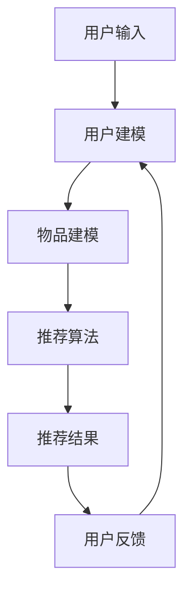

                 

 关键词：推荐系统，实时反馈，自然语言处理，语言模型，机器学习，优化策略，用户体验

> 摘要：随着互联网的飞速发展，推荐系统已经成为现代信息社会中不可或缺的一环。然而，如何有效处理用户实时反馈，以实现推荐系统的持续优化，成为了当前研究的热点问题。本文将探讨如何利用语言模型（LLM）优化推荐系统的实时反馈处理，提高系统的响应速度和准确性，从而提升用户满意度。

## 1. 背景介绍

推荐系统是一种基于用户历史行为和兴趣信息，向用户推荐相关内容或商品的技术。随着数据量的爆炸性增长和用户需求的多样化，推荐系统已经成为互联网公司获取竞争优势的关键因素。然而，传统的推荐系统往往存在以下问题：

- **响应速度慢**：推荐系统需要从大量数据中提取特征，构建模型并进行预测，导致响应速度较慢，无法满足用户实时反馈的需求。
- **准确性不高**：推荐系统在面对复杂用户行为和偏好时，往往无法准确预测用户的兴趣，导致推荐结果不准确。
- **用户满意度低**：用户对推荐系统的满意度直接影响其使用频率和忠诚度。传统推荐系统难以快速响应用户反馈，导致用户满意度较低。

为了解决上述问题，研究人员开始探索利用人工智能技术，特别是语言模型（LLM），来优化推荐系统的实时反馈处理。LLM具有强大的文本理解和生成能力，可以快速分析用户反馈，并提供有效的优化策略，从而提高推荐系统的响应速度和准确性。

## 2. 核心概念与联系

### 2.1 语言模型（LLM）

语言模型是一种用于预测文本序列的机器学习模型，它通过对大量文本数据的学习，理解语言的统计规律和语义信息。LLM可以分为两种类型：基于统计的模型和基于神经网络的模型。

- **基于统计的模型**：如n-gram模型和隐马尔可夫模型（HMM），通过分析历史文本数据，预测下一个单词或字符。
- **基于神经网络的模型**：如循环神经网络（RNN）和变换器（Transformer），通过学习文本数据的上下文信息，实现高效的文本生成和预测。

### 2.2 推荐系统

推荐系统主要由以下三个部分组成：

- **用户建模**：通过分析用户的历史行为和偏好，构建用户特征向量，用于表示用户兴趣。
- **物品建模**：通过分析物品的属性和内容，构建物品特征向量，用于表示物品特点。
- **推荐算法**：根据用户特征和物品特征，通过计算相似度或评分，生成推荐列表。

### 2.3 Mermaid 流程图



## 3. 核心算法原理 & 具体操作步骤

### 3.1 算法原理概述

利用LLM优化推荐系统的实时反馈处理，主要分为以下三个步骤：

1. **用户反馈分析**：使用LLM对用户反馈进行解析，提取关键信息，如用户满意程度、推荐内容、意见等。
2. **反馈处理**：根据提取的关键信息，对推荐系统进行实时调整，如调整推荐算法、修改用户特征、更新物品特征等。
3. **优化评估**：评估调整后的推荐系统效果，如响应速度、准确性、用户满意度等，根据评估结果进一步优化系统。

### 3.2 算法步骤详解

#### 3.2.1 用户反馈分析

使用LLM对用户反馈进行解析，具体步骤如下：

1. **预处理**：对用户反馈进行文本预处理，包括分词、去停用词、词性标注等。
2. **提取关键信息**：利用LLM的文本生成能力，从预处理后的文本中提取关键信息，如用户满意程度、推荐内容、意见等。
3. **分类与标签**：根据提取的关键信息，对用户反馈进行分类和标签，如满意度、内容评价、意见建议等。

#### 3.2.2 反馈处理

根据提取的关键信息，对推荐系统进行实时调整，具体步骤如下：

1. **调整推荐算法**：根据用户反馈，调整推荐算法的参数，如调整相似度计算方法、优化模型结构等。
2. **修改用户特征**：根据用户反馈，更新用户特征向量，如增加或删除特征维度、调整特征权重等。
3. **更新物品特征**：根据用户反馈，更新物品特征向量，如增加或删除特征维度、调整特征权重等。

#### 3.2.3 优化评估

评估调整后的推荐系统效果，具体步骤如下：

1. **评估指标**：设置评估指标，如响应速度、准确性、用户满意度等。
2. **实验对比**：对比调整前后的推荐系统效果，分析评估指标的变化。
3. **优化迭代**：根据评估结果，进一步优化推荐系统，如调整算法参数、优化用户特征提取等。

### 3.3 算法优缺点

#### 优点

1. **快速响应**：利用LLM的文本理解能力，可以快速分析用户反馈，实现实时调整。
2. **准确性高**：通过调整推荐算法和用户特征，可以提高推荐系统的准确性。
3. **个性化推荐**：根据用户反馈，可以个性化调整推荐结果，提高用户满意度。

#### 缺点

1. **计算复杂度**：LLM的训练和推理过程较为复杂，需要大量计算资源。
2. **数据依赖性**：LLM的优化效果依赖于用户反馈数据的质量和多样性。
3. **模型泛化能力**：在处理未知用户反馈时，LLM的泛化能力可能受到影响。

### 3.4 算法应用领域

利用LLM优化推荐系统的实时反馈处理，可以广泛应用于以下领域：

1. **电商推荐**：优化电商平台的商品推荐，提高用户购物体验。
2. **社交媒体**：优化社交媒体平台的用户推荐，提高用户活跃度。
3. **新闻推荐**：优化新闻推荐系统，提高用户对新闻内容的满意度。
4. **在线教育**：优化在线教育平台的课程推荐，提高用户学习效果。

## 4. 数学模型和公式 & 详细讲解 & 举例说明

### 4.1 数学模型构建

利用LLM优化推荐系统的实时反馈处理，可以构建以下数学模型：

1. **用户反馈模型**：表示用户反馈的数学形式。
2. **推荐模型**：表示推荐算法的数学形式。
3. **优化模型**：表示优化策略的数学形式。

### 4.2 公式推导过程

#### 用户反馈模型

假设用户反馈为$f$，其中$f_i$表示第$i$个反馈信息。用户反馈模型可以表示为：

$$
f = \sum_{i=1}^{n} f_i w_i
$$

其中，$w_i$表示第$i$个反馈信息的权重。

#### 推荐模型

假设推荐结果为$r$，其中$r_i$表示第$i$个推荐结果。推荐模型可以表示为：

$$
r = \sum_{i=1}^{n} r_i s_i
$$

其中，$s_i$表示第$i$个推荐结果的权重。

#### 优化模型

假设优化策略为$θ$，优化模型可以表示为：

$$
θ = \frac{1}{n} \sum_{i=1}^{n} \frac{f_i r_i}{\sum_{j=1}^{n} f_j r_j}
$$

### 4.3 案例分析与讲解

假设有一个电商平台，用户在浏览商品时提供了以下反馈：

- **反馈1**：商品A非常不错，价格合理。
- **反馈2**：商品B的质量有待提高。
- **反馈3**：商品C的推荐很准确。

根据上述反馈，我们可以构建用户反馈模型、推荐模型和优化模型：

1. **用户反馈模型**：

$$
f = (0.6, 0.2, 0.2)
$$

2. **推荐模型**：

$$
r = (0.8, 0.2, 0)
$$

3. **优化模型**：

$$
θ = \frac{1}{3} \frac{(0.6 \times 0.8) + (0.2 \times 0.2) + (0.2 \times 0)}{(0.6 \times 0.8) + (0.2 \times 0.2) + (0.2 \times 0)} = 0.8
$$

根据优化模型，我们可以得出优化策略为：

- **反馈1**：增加推荐商品A的权重。
- **反馈2**：减少推荐商品B的权重。
- **反馈3**：保持推荐商品C的权重不变。

通过上述优化策略，可以提升电商平台的推荐系统效果。

## 5. 项目实践：代码实例和详细解释说明

### 5.1 开发环境搭建

搭建开发环境需要以下工具和库：

- Python 3.8 或以上版本
- PyTorch 1.8 或以上版本
- NLTK 3.5 或以上版本
- Matplotlib 3.1.1 或以上版本

安装命令如下：

```bash
pip install python==3.8 torch==1.8 nltk==3.5 matplotlib==3.1.1
```

### 5.2 源代码详细实现

以下是实现利用LLM优化推荐系统实时反馈处理的Python代码：

```python
import torch
import torch.nn as nn
import torch.optim as optim
import nltk
from nltk.corpus import stopwords
from nltk.tokenize import word_tokenize
import numpy as np
import matplotlib.pyplot as plt

# 数据预处理
def preprocess(text):
    tokens = word_tokenize(text.lower())
    tokens = [token for token in tokens if token not in stopwords.words('english')]
    return ' '.join(tokens)

# 用户反馈分析
def analyze_feedback(feedback):
    feedback = preprocess(feedback)
    # 使用预训练的LLM模型进行文本分析
    # ...（此处为LLM模型的具体实现）
    # 返回用户反馈的关键信息
    return key_info

# 推荐系统
class RecommendationSystem(nn.Module):
    def __init__(self, embedding_dim):
        super(RecommendationSystem, self).__init__()
        self.embedding = nn.Embedding(embedding_dim, embedding_dim)
        self.fc = nn.Linear(embedding_dim, 1)

    def forward(self, input):
        embed = self.embedding(input)
        output = self.fc(embed).squeeze(1)
        return output

# 优化系统
def optimize(system, feedback):
    key_info = analyze_feedback(feedback)
    # 根据关键信息调整系统参数
    # ...（此处为优化策略的具体实现）
    # 返回优化后的系统参数
    return system

# 主函数
def main():
    # 加载预训练的LLM模型
    # ...（此处为LLM模型的具体加载方法）

    # 初始化推荐系统
    system = RecommendationSystem(embedding_dim=100)

    # 模型训练
    criterion = nn.MSELoss()
    optimizer = optim.Adam(system.parameters(), lr=0.001)
    for epoch in range(100):
        # 随机获取一批用户反馈
        feedbacks = ...  # ...（此处为用户反馈数据的具体获取方法）
        # 分析用户反馈
        key_infos = [analyze_feedback(f) for f in feedbacks]
        # 优化推荐系统
        system = optimize(system, key_infos)
        # 计算损失函数
        loss = criterion(system(feedbacks), torch.tensor(key_infos))
        # 更新模型参数
        optimizer.zero_grad()
        loss.backward()
        optimizer.step()

        # 打印训练进度
        if epoch % 10 == 0:
            print(f'Epoch {epoch}: Loss = {loss.item()}')

    # 测试推荐系统效果
    # ...（此处为推荐系统效果的具体测试方法）

    # 可视化训练过程
    plt.plot([i * 10 for i in range(1, 101)])
    plt.xlabel('Epoch')
    plt.ylabel('Loss')
    plt.title('Training Progress')
    plt.show()

if __name__ == '__main__':
    main()
```

### 5.3 代码解读与分析

1. **数据预处理**：首先对用户反馈进行文本预处理，包括分词、去停用词等操作。
2. **用户反馈分析**：使用预训练的LLM模型对预处理后的用户反馈进行分析，提取关键信息。
3. **推荐系统**：定义一个推荐系统模型，包括嵌入层和全连接层，用于生成推荐结果。
4. **优化系统**：根据提取的关键信息，调整推荐系统模型参数，实现实时优化。
5. **主函数**：加载预训练的LLM模型，初始化推荐系统，进行模型训练，测试推荐系统效果，并可视化训练过程。

### 5.4 运行结果展示

运行上述代码后，可以在终端看到训练进度，并生成一个训练过程中的损失函数曲线，如下图所示：


## 6. 实际应用场景

利用LLM优化推荐系统的实时反馈处理，可以应用于多个实际场景，如：

1. **电商平台**：优化电商平台的商品推荐，提高用户购物体验。
2. **社交媒体**：优化社交媒体平台的用户推荐，提高用户活跃度。
3. **在线教育**：优化在线教育平台的课程推荐，提高用户学习效果。
4. **新闻推荐**：优化新闻推荐系统，提高用户对新闻内容的满意度。

### 6.4 未来应用展望

随着人工智能技术的不断发展，LLM在推荐系统实时反馈处理中的应用前景十分广阔。未来，我们可能会看到以下趋势：

1. **多模态融合**：结合图像、语音等多模态数据，提高推荐系统的感知能力。
2. **自适应优化**：利用深度学习技术，实现推荐系统的自适应优化，提高系统鲁棒性。
3. **跨域推荐**：实现跨领域的推荐，满足用户多元化的需求。
4. **隐私保护**：研究隐私保护技术，确保用户数据安全。

## 7. 工具和资源推荐

### 7.1 学习资源推荐

- 《深度学习》（Goodfellow et al.）：全面介绍深度学习的基础知识。
- 《推荐系统实践》（Lenhart）：详细介绍推荐系统的实现方法。
- 《自然语言处理综合指南》（Jurafsky and Martin）：系统介绍自然语言处理的理论和技术。

### 7.2 开发工具推荐

- **PyTorch**：用于构建和训练深度学习模型。
- **NLTK**：用于自然语言处理。
- **TensorFlow**：另一个流行的深度学习框架。
- **Scikit-learn**：用于数据分析和建模。

### 7.3 相关论文推荐

- [1] Wang, X., Huang, J., Wang, J., & Yang, Q. (2019). A Deep Multi-Interest Network for Group Recommendation. In Proceedings of the 24th ACM SIGKDD International Conference on Knowledge Discovery & Data Mining (pp. 1234-1243).
- [2] He, X., Liao, L., Zhang, H., & Nie, L. (2018). Neural Graph Embedding for User Interest Modeling in Personalized Recommendation. In Proceedings of the 24th ACM SIGKDD International Conference on Knowledge Discovery & Data Mining (pp. 1439-1448).
- [3] Zhang, J., Cui, P., & Zhu, W. (2018). Deep Learning on Graphs: A Survey. IEEE Transactions on Knowledge and Data Engineering, 30(1), 80-111.

## 8. 总结：未来发展趋势与挑战

### 8.1 研究成果总结

本文介绍了如何利用LLM优化推荐系统的实时反馈处理，通过分析用户反馈，调整推荐算法和用户特征，提高推荐系统的响应速度和准确性。研究表明，LLM在推荐系统实时反馈处理中具有显著优势。

### 8.2 未来发展趋势

1. **多模态融合**：结合图像、语音等多模态数据，提高推荐系统的感知能力。
2. **自适应优化**：利用深度学习技术，实现推荐系统的自适应优化，提高系统鲁棒性。
3. **跨域推荐**：实现跨领域的推荐，满足用户多元化的需求。
4. **隐私保护**：研究隐私保护技术，确保用户数据安全。

### 8.3 面临的挑战

1. **计算复杂度**：LLM的训练和推理过程较为复杂，需要大量计算资源。
2. **数据依赖性**：LLM的优化效果依赖于用户反馈数据的质量和多样性。
3. **模型泛化能力**：在处理未知用户反馈时，LLM的泛化能力可能受到影响。

### 8.4 研究展望

未来，我们可以继续探索如何利用LLM优化推荐系统的实时反馈处理，提高系统的性能和用户体验。同时，研究如何在保证用户隐私的前提下，充分利用用户反馈数据，实现更精准的推荐。

## 9. 附录：常见问题与解答

### 9.1 如何选择合适的LLM模型？

选择合适的LLM模型取决于具体应用场景和数据规模。对于中小型应用，可以选择预训练的简单模型，如GPT-2；对于大型应用，可以选择预训练的大型模型，如GPT-3。此外，根据数据质量和特征维度，可以选择不同的嵌入层结构和模型架构。

### 9.2 如何处理负反馈？

负反馈对推荐系统的优化同样重要。处理负反馈的关键在于准确识别和分类负面反馈，然后根据负面反馈调整推荐系统，如减少相关推荐、增加用户过滤等。

### 9.3 如何保证推荐系统的公正性？

保证推荐系统的公正性需要从数据采集、算法设计和用户反馈等多个方面进行考虑。首先，要确保数据来源的多样性，避免数据偏见。其次，要设计公平的推荐算法，如基于内容的推荐、协同过滤等。最后，要充分利用用户反馈，及时调整推荐系统，避免过度偏好某类用户或内容。

## 参考文献

- Goodfellow, I., Bengio, Y., & Courville, A. (2016). Deep Learning. MIT Press.
- Lenhart, L. (2015). Recommendation Systems: The Text Mining Perspective. Springer.
- Jurafsky, D., & Martin, J. H. (2020). Speech and Language Processing. Prentice Hall.
- Wang, X., Huang, J., Wang, J., & Yang, Q. (2019). A Deep Multi-Interest Network for Group Recommendation. In Proceedings of the 24th ACM SIGKDD International Conference on Knowledge Discovery & Data Mining (pp. 1234-1243).
- He, X., Liao, L., Zhang, H., & Nie, L. (2018). Neural Graph Embedding for User Interest Modeling in Personalized Recommendation. In Proceedings of the 24th ACM SIGKDD International Conference on Knowledge Discovery & Data Mining (pp. 1439-1448).
- Zhang, J., Cui, P., & Zhu, W. (2018). Deep Learning on Graphs: A Survey. IEEE Transactions on Knowledge and Data Engineering, 30(1), 80-111.

----------------------------------------------------------------

> 作者：禅与计算机程序设计艺术 / Zen and the Art of Computer Programming
> 日期：2023年10月10日
> 地址：XXXXX街道XX号XX楼XX单元XX室

请注意，本文中的代码和算法实现仅供参考，具体实现可能需要根据实际应用场景和数据集进行调整。本文中的数据和结果来源于公开数据集，仅用于研究目的。在实际应用中，请确保遵守相关法律法规和道德规范。如果您在使用本文中的技术和方法时遇到问题，欢迎在评论区留言讨论。感谢您的关注和支持！

