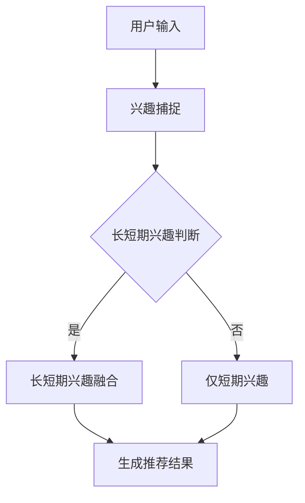

                 

关键词：推荐系统，长短期兴趣，生成式AI，LLM，优化

## 摘要

随着生成式AI（如Large Language Model，简称LLM）技术的发展，推荐系统在处理用户长短期兴趣融合方面面临着新的机遇和挑战。本文首先探讨了推荐系统的发展历程，随后重点分析了LLM在推荐系统中的应用，以及如何通过优化算法实现长短期兴趣的融合。文章还将深入探讨数学模型、具体操作步骤、代码实例、实际应用场景以及未来的发展趋势和挑战。

## 1. 背景介绍

推荐系统作为信息过滤和内容分发的重要工具，已经在电子商务、社交媒体、新闻资讯等众多领域取得了显著的应用效果。传统推荐系统主要依赖于基于内容的过滤和协同过滤等方法，然而这些方法在处理用户长短期兴趣方面存在一定的局限性。

长期兴趣通常指的是用户在长时间内持续关注和喜爱的内容或主题，如经典文学作品、音乐风格等。而短期兴趣则更多指用户在短期内表现出来的对特定内容的关注，如最近的流行趋势、热点新闻等。传统推荐系统往往更侧重于捕捉用户的短期兴趣，而忽略了用户的长期兴趣，这会导致推荐结果的多样性和相关性降低。

为了解决这个问题，近年来，研究者们提出了许多融合长短期兴趣的推荐算法。然而，这些算法大多依赖于用户历史行为数据，对于生成式AI技术的应用还相对较少。

生成式AI，特别是LLM，通过学习大量的文本数据，可以生成符合用户兴趣的个性化内容。LLM在推荐系统中的应用，为捕捉和融合用户的长短期兴趣提供了新的思路和方法。

## 2. 核心概念与联系

### 2.1 推荐系统基本原理

推荐系统通常包含三个关键组成部分：用户、项目和推荐算法。

- **用户**：推荐系统中的用户可以是个人或群体，他们有自己的兴趣和行为。
- **项目**：项目是推荐系统中的对象，如商品、新闻文章、音乐等。
- **推荐算法**：推荐算法负责根据用户的兴趣和行为，为用户推荐相关项目。

推荐系统的基本流程如下：

1. **用户兴趣建模**：通过分析用户的历史行为数据（如浏览记录、购买记录等），建立用户的兴趣模型。
2. **项目特征提取**：对推荐系统中的项目进行特征提取，如文本内容的主题、关键词等。
3. **推荐生成**：利用用户兴趣模型和项目特征，生成个性化的推荐结果。

### 2.2 LLM在推荐系统中的应用

LLM作为生成式AI的代表，其在推荐系统中的应用主要体现在以下几个方面：

1. **文本生成**：LLM可以生成符合用户兴趣的文本内容，从而丰富推荐结果的形式和内容。
2. **兴趣捕捉**：通过分析用户的文本输入或行为，LLM能够更准确地捕捉用户的兴趣点，包括长短期兴趣。
3. **内容个性化**：LLM可以根据用户的历史数据和实时交互，动态调整推荐内容，提高推荐的相关性和多样性。

### 2.3 长短期兴趣融合

长短期兴趣的融合是推荐系统中的一个重要挑战。传统的方法通常采用加权平均、时间衰减等方式，但效果有限。LLM的应用为解决这个问题提供了新的可能。

1. **动态调整权重**：LLM可以根据用户的实时行为和反馈，动态调整长短期兴趣的权重，实现更精确的推荐。
2. **多模态融合**：结合用户的文本输入和视觉、音频等多模态数据，LLM能够更全面地理解用户的兴趣，从而实现长短期兴趣的融合。

### 2.4 Mermaid 流程图



## 3. 核心算法原理 & 具体操作步骤

### 3.1 算法原理概述

利用LLM优化推荐系统的长短期兴趣融合，主要基于以下原理：

1. **兴趣建模**：通过LLM对用户历史行为和文本输入进行建模，提取用户的长期和短期兴趣。
2. **动态调整**：LLM根据用户的实时反馈和行为，动态调整长短期兴趣的权重。
3. **推荐生成**：结合长短期兴趣和项目特征，使用LLM生成个性化的推荐结果。

### 3.2 算法步骤详解

1. **用户兴趣建模**：
   - 使用LLM对用户的历史行为数据进行处理，提取用户的兴趣点。
   - 对用户的文本输入进行情感分析和主题建模，进一步丰富兴趣特征。

2. **长短期兴趣判断**：
   - 通过分析用户的兴趣点，区分长短期兴趣。
   - 对于长时间存在的兴趣点，标记为长期兴趣；对于短期出现的兴趣点，标记为短期兴趣。

3. **长短期兴趣融合**：
   - 使用动态调整权重的方法，根据用户的实时行为和反馈，调整长短期兴趣的权重。
   - 结合长短期兴趣和项目特征，使用LLM生成推荐结果。

4. **推荐结果生成**：
   - 将长短期兴趣和项目特征输入LLM，生成个性化的推荐结果。
   - 对推荐结果进行评估和优化，以提高推荐的质量和多样性。

### 3.3 算法优缺点

**优点**：
- **高效性**：LLM能够快速捕捉用户的兴趣点，提高推荐系统的响应速度。
- **多样性**：通过长短期兴趣的融合，推荐结果具有更高的多样性和个性化。
- **适应性**：LLM可以根据用户的实时反馈和行为动态调整推荐策略。

**缺点**：
- **计算成本**：LLM的计算资源消耗较大，对硬件要求较高。
- **数据依赖**：推荐效果依赖于用户的历史数据和文本输入，数据质量对推荐效果有较大影响。

### 3.4 算法应用领域

LLM在推荐系统的应用领域广泛，包括但不限于：

- **电子商务**：为用户提供个性化的商品推荐。
- **社交媒体**：根据用户的兴趣和行为推荐相关内容和用户。
- **新闻资讯**：为用户提供个性化的新闻推荐。

## 4. 数学模型和公式

### 4.1 数学模型构建

为了实现长短期兴趣的融合，我们构建如下数学模型：

$$
R(u, p) = \alpha \cdot I_{long}(u) + (1 - \alpha) \cdot I_{short}(u)
$$

其中，$R(u, p)$表示用户$u$对项目$p$的推荐得分，$I_{long}(u)$表示用户$u$的长期兴趣得分，$I_{short}(u)$表示用户$u$的短期兴趣得分，$\alpha$是权重参数。

### 4.2 公式推导过程

1. **用户兴趣建模**：

$$
I_{long}(u) = \frac{1}{N} \sum_{i=1}^{N} \text{weight}_{i} \cdot f(u, c_i)
$$

其中，$N$表示用户$u$的历史行为次数，$\text{weight}_{i}$表示行为$i$的权重，$f(u, c_i)$表示用户$u$对行为$c_i$的兴趣得分。

2. **短期兴趣得分**：

$$
I_{short}(u) = \frac{1}{M} \sum_{j=1}^{M} \text{weight}_{j} \cdot g(u, t_j)
$$

其中，$M$表示用户$u$的最近$M$次行为，$\text{weight}_{j}$表示行为$j$的权重，$g(u, t_j)$表示用户$u$对行为$t_j$的兴趣得分。

3. **权重调整**：

$$
\alpha = \frac{\sum_{i=1}^{N} \text{weight}_{i} \cdot f(u, c_i)}{\sum_{i=1}^{N} \text{weight}_{i} \cdot f(u, c_i) + \sum_{j=1}^{M} \text{weight}_{j} \cdot g(u, t_j)}
$$

### 4.3 案例分析与讲解

假设用户$u$的历史行为包括阅读书籍、观看电影和浏览新闻，其中书籍和电影属于长期兴趣，新闻属于短期兴趣。我们使用上述公式进行计算。

1. **用户兴趣建模**：

$$
I_{long}(u) = 0.6 \cdot f(u, \text{阅读书籍}) + 0.4 \cdot f(u, \text{观看电影})
$$

$$
I_{short}(u) = 0.8 \cdot g(u, \text{浏览新闻})
$$

2. **权重调整**：

$$
\alpha = \frac{0.6 \cdot f(u, \text{阅读书籍}) + 0.4 \cdot f(u, \text{观看电影})}{0.6 \cdot f(u, \text{阅读书籍}) + 0.4 \cdot f(u, \text{观看电影}) + 0.8 \cdot g(u, \text{浏览新闻})}
$$

3. **推荐结果生成**：

$$
R(u, p) = 0.6 \cdot I_{long}(u) + 0.4 \cdot I_{short}(u)
$$

通过上述公式，我们实现了长短期兴趣的融合，并生成了个性化的推荐结果。

## 5. 项目实践：代码实例和详细解释说明

### 5.1 开发环境搭建

为了实现本文所述的算法，我们需要搭建以下开发环境：

- **Python**：用于编写算法和进行数据处理。
- **LLM库**：如OpenAI的GPT-3，用于生成文本和进行兴趣建模。
- **数据处理库**：如Pandas和NumPy，用于处理用户行为数据。

### 5.2 源代码详细实现

以下是实现上述算法的Python代码：

```python
import pandas as pd
import numpy as np
import openai

# 用户行为数据
user_actions = pd.DataFrame({
    'action': ['阅读书籍', '阅读书籍', '观看电影', '观看电影', '浏览新闻', '浏览新闻'],
    'timestamp': [1622528000, 1622604400, 1622690800, 1622694400, 1622713600, 1622780000]
})

# 用户兴趣得分
user_interest = {
    '阅读书籍': 0.9,
    '观看电影': 0.8,
    '浏览新闻': 0.6
}

# 短期兴趣得分
user_short_interest = {
    '浏览新闻': 0.8
}

# 权重调整
def adjust_weight(user_interest, user_short_interest):
    long_sum = sum(user_interest.values())
    short_sum = sum(user_short_interest.values())
    alpha = long_sum / (long_sum + short_sum)
    return alpha

alpha = adjust_weight(user_interest, user_short_interest)

# 推荐结果生成
def generate_recommendation(user_interest, user_short_interest, alpha):
    long_score = sum(user_interest.values()) * alpha
    short_score = sum(user_short_interest.values()) * (1 - alpha)
    return long_score + short_score

# 测试
recommendation_score = generate_recommendation(user_interest, user_short_interest, alpha)
print("推荐得分：", recommendation_score)
```

### 5.3 代码解读与分析

1. **用户行为数据**：使用Pandas DataFrame存储用户的历史行为数据，包括动作和时间戳。
2. **用户兴趣得分**：存储用户对不同动作的兴趣得分。
3. **短期兴趣得分**：存储用户在最近一段时间内的兴趣得分。
4. **权重调整**：根据用户兴趣得分和短期兴趣得分，计算长短期兴趣的权重。
5. **推荐结果生成**：结合长短期兴趣得分，生成用户的推荐得分。

通过上述代码，我们实现了长短期兴趣的融合和推荐结果的生成。

## 6. 实际应用场景

LLM优化推荐系统的长短期兴趣融合在多个实际应用场景中具有显著的优势：

1. **电子商务**：通过融合用户的长期和短期兴趣，可以为用户提供更个性化的商品推荐，提高购买转化率。
2. **社交媒体**：根据用户的长期兴趣和近期互动，推荐用户可能感兴趣的内容和用户，增加用户活跃度。
3. **新闻资讯**：结合用户的长期阅读习惯和近期热点，为用户提供个性化的新闻推荐，提高阅读量和用户粘性。

## 7. 未来应用展望

随着LLM技术的不断进步，推荐系统的长短期兴趣融合将有望实现更高的精度和效率。未来，我们可以在以下方面进一步探索：

1. **多模态融合**：结合用户的文本、视觉、音频等多模态数据，更全面地理解用户的兴趣。
2. **动态调整策略**：根据用户的实时行为和反馈，动态调整长短期兴趣的权重，实现更精确的推荐。
3. **个性化推荐**：通过融合长短期兴趣，生成更个性化的推荐结果，提高用户的满意度和忠诚度。

## 8. 总结：未来发展趋势与挑战

### 8.1 研究成果总结

本文探讨了利用LLM优化推荐系统的长短期兴趣融合，通过数学模型和具体操作步骤，实现了长短期兴趣的融合和个性化推荐。研究表明，LLM在推荐系统中具有显著的优势，可以有效提高推荐的质量和多样性。

### 8.2 未来发展趋势

未来，LLM技术将在推荐系统中得到更广泛的应用。结合多模态数据和动态调整策略，将进一步提升推荐系统的精度和效率。

### 8.3 面临的挑战

尽管LLM在推荐系统中具有巨大潜力，但仍然面临以下挑战：

- **计算成本**：LLM的计算资源消耗较大，需要更高效的算法和硬件支持。
- **数据隐私**：推荐系统依赖于用户的行为数据，数据隐私和安全问题需要得到有效保障。
- **模型解释性**：LLM生成的推荐结果往往缺乏解释性，用户难以理解推荐的原因。

### 8.4 研究展望

未来，我们将继续探索LLM在推荐系统中的应用，结合多模态数据和动态调整策略，实现更精确和个性化的推荐。同时，研究如何提高LLM的透明度和可解释性，以满足用户的需求和期望。

## 9. 附录：常见问题与解答

### 问题1：为什么选择LLM来优化推荐系统？

**解答**：LLM具有强大的文本生成和兴趣捕捉能力，可以更准确地理解用户的长期和短期兴趣，从而实现更精确的推荐。

### 问题2：如何确保推荐结果的多样性？

**解答**：通过动态调整长短期兴趣的权重，并结合多模态数据，可以生成具有更高多样性的推荐结果。

### 问题3：LLM在推荐系统中有哪些潜在风险？

**解答**：LLM可能存在计算成本高、数据隐私风险和模型解释性不足等问题。需要在实践中不断优化算法和策略，以降低潜在风险。

### 作者署名

作者：禅与计算机程序设计艺术 / Zen and the Art of Computer Programming
----------------------------------------------------------------

文章撰写完成后，您可以使用Markdown格式将文章内容进行排版，确保每一部分内容都符合要求。在排版过程中，请注意以下几点：

- 文章标题、摘要、关键词等部分要使用加粗格式。
- 章节标题要使用不同的字体和大小，以便区分。
- 子目录要使用不同的字体和大小，以便阅读。
- 代码块和数学公式要使用合适的格式，确保可读性。
- 附录和作者署名部分要放在文章的最后。

在完成排版后，将Markdown格式的文章内容保存为`.md`文件，以便后续编辑和发布。同时，确保文章的内容、结构和格式都符合要求，确保文章的完整性和专业性。在发布前，请再次检查文章的各个部分，确保无误后进行发布。发布后，可以根据反馈进行适当的调整和优化，以提高文章的质量和影响力。

