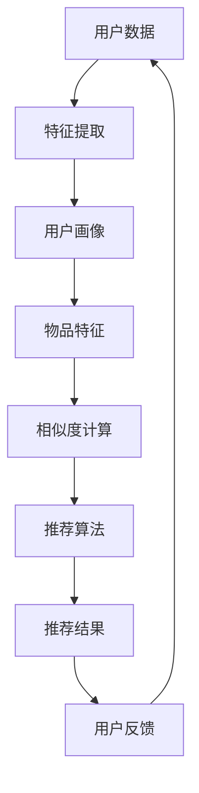

                 

关键词：大模型、推荐系统、冷启动、机器学习、算法改进

> 摘要：本文探讨了如何利用大模型技术改进推荐系统的冷启动策略。首先，回顾了推荐系统的发展历程和基本原理。接着，介绍了冷启动问题及其对推荐系统的影响。然后，详细阐述了大模型在推荐系统中的作用和优势，以及如何应用大模型来改进冷启动策略。最后，总结了本文的主要观点，并对未来的研究方向进行了展望。

## 1. 背景介绍

### 推荐系统的发展历程

推荐系统起源于20世纪90年代，随着互联网的兴起和用户数据积累的增多，推荐系统逐渐成为一种重要的信息过滤和搜索工具。早期的推荐系统主要基于内容相似性（Content-based Filtering）和协同过滤（Collaborative Filtering）两种方法。内容相似性方法基于用户的历史行为和偏好，通过计算物品和用户之间的相似度来推荐相似的物品。协同过滤方法则基于用户之间的相似性，通过分析用户之间的评分或行为模式来预测用户可能感兴趣的物品。

随着计算能力的提升和数据量的爆炸性增长，推荐系统逐渐走向了个性化（Personalization）和智能化的道路。传统的推荐系统方法在处理海量数据和复杂关系时显得力不从心，这使得深度学习（Deep Learning）和图神经网络（Graph Neural Networks）等新兴技术开始进入推荐系统领域。

### 推荐系统的基本原理

推荐系统通常包括用户画像构建、物品特征提取、相似度计算、推荐算法和推荐结果呈现等几个关键环节。

- **用户画像构建**：通过收集用户的浏览历史、购买记录、搜索行为等数据，构建用户的行为特征和偏好模型。
- **物品特征提取**：对物品进行分类、标签化，提取物品的文本特征、图像特征、属性特征等。
- **相似度计算**：计算用户和物品之间的相似度，常见的方法有基于内容的相似度计算和基于协同过滤的相似度计算。
- **推荐算法**：根据相似度计算结果，结合用户画像和物品特征，使用机器学习算法生成推荐结果。
- **推荐结果呈现**：将推荐结果呈现给用户，通过界面设计、推荐策略优化等方式提高用户的满意度。

## 2. 核心概念与联系

为了更好地理解大模型在推荐系统中的应用，我们需要介绍以下几个核心概念：

- **大模型**：通常指拥有数十亿到数万亿参数的深度学习模型，例如GPT、BERT等。
- **冷启动**：指在新用户加入系统或新物品进入系统时，由于缺乏足够的历史数据，难以进行有效推荐的问题。
- **机器学习算法**：指利用数据训练模型，从而实现数据驱动的决策和预测的算法。

### 大模型与推荐系统的关联

大模型在推荐系统中的应用主要体现在两个方面：

1. **特征提取**：大模型可以自动提取用户和物品的高维特征，使得推荐系统可以更准确地预测用户的行为。
2. **模型优化**：大模型可以处理复杂的非线性关系，从而提高推荐系统的准确性。

### Mermaid 流程图



## 3. 核心算法原理 & 具体操作步骤

### 3.1 算法原理概述

利用大模型改进推荐系统的冷启动策略，主要是通过以下三个步骤实现的：

1. **预训练大模型**：在大规模数据集上预训练大模型，提取用户和物品的高维特征。
2. **微调大模型**：在特定领域或任务上微调大模型，进一步提高推荐准确性。
3. **推荐算法集成**：将大模型与传统推荐算法相结合，形成统一的推荐框架。

### 3.2 算法步骤详解

1. **预训练大模型**

   - **数据收集**：收集大规模的用户行为数据、物品描述数据等。
   - **数据预处理**：对数据进行清洗、去重、编码等预处理操作。
   - **模型训练**：使用预训练框架（如PyTorch、TensorFlow）训练大模型，提取高维特征。

2. **微调大模型**

   - **数据集划分**：将数据集划分为训练集、验证集和测试集。
   - **模型微调**：在特定领域或任务上微调大模型，优化模型参数。
   - **模型评估**：使用验证集评估模型性能，调整超参数。

3. **推荐算法集成**

   - **特征融合**：将大模型提取的用户和物品特征与传统特征（如用户ID、物品ID、评分等）进行融合。
   - **相似度计算**：计算用户和物品之间的相似度，采用余弦相似度、皮尔逊相关系数等常见方法。
   - **推荐结果生成**：根据相似度计算结果，生成推荐结果，并排序展示。

### 3.3 算法优缺点

#### 优点

- **高维特征提取**：大模型可以自动提取用户和物品的高维特征，提高推荐准确性。
- **模型优化**：大模型可以处理复杂的非线性关系，提高推荐系统的鲁棒性。
- **冷启动缓解**：通过预训练和微调，大模型可以缓解新用户和新物品的冷启动问题。

#### 缺点

- **计算资源消耗**：大模型训练和推理需要大量计算资源，可能导致成本上升。
- **数据依赖性**：大模型性能依赖于大规模数据集，数据质量对推荐效果有重要影响。
- **过拟合风险**：大模型可能存在过拟合现象，导致在特定领域或任务上的性能下降。

### 3.4 算法应用领域

大模型在推荐系统中的应用非常广泛，可以应用于电子商务、社交媒体、新闻推荐、音乐推荐等多个领域。以下是一些具体的案例：

- **电子商务**：通过大模型预测用户购买行为，提高转化率和销售额。
- **社交媒体**：通过大模型推荐用户感兴趣的内容，提高用户黏性和活跃度。
- **新闻推荐**：通过大模型预测用户阅读偏好，提高新闻推荐的准确性和多样性。
- **音乐推荐**：通过大模型预测用户听歌偏好，提高音乐推荐的个性化程度。

## 4. 数学模型和公式 & 详细讲解 & 举例说明

### 4.1 数学模型构建

在推荐系统中，我们通常使用以下数学模型来描述用户和物品之间的关系：

$$
\text{推荐分数} = f(\text{用户特征}, \text{物品特征})
$$

其中，用户特征和物品特征是由大模型提取的高维特征向量。

### 4.2 公式推导过程

我们假设用户特征和物品特征分别表示为 $\text{u} \in \mathbb{R}^d$ 和 $\text{i} \in \mathbb{R}^d$，则推荐分数可以表示为：

$$
\text{推荐分数} = \text{u} \cdot \text{i}
$$

这里使用了内积运算，内积可以看作是用户和物品之间相似度的量化表示。

### 4.3 案例分析与讲解

假设我们有一个用户 $u$ 和一个物品 $i$，用户特征向量 $\text{u} = [0.1, 0.2, 0.3, 0.4, 0.5]$，物品特征向量 $\text{i} = [0.3, 0.4, 0.5, 0.6, 0.7]$。根据上述公式，我们可以计算出推荐分数：

$$
\text{推荐分数} = \text{u} \cdot \text{i} = (0.1 \times 0.3) + (0.2 \times 0.4) + (0.3 \times 0.5) + (0.4 \times 0.6) + (0.5 \times 0.7) = 0.33
$$

这意味着用户对物品的推荐分数为 0.33，分数越高，表示用户对物品的兴趣越大。

## 5. 项目实践：代码实例和详细解释说明

### 5.1 开发环境搭建

为了实现大模型在推荐系统中的应用，我们需要搭建一个合适的开发环境。以下是所需的基本环境：

- **Python**：Python是一种流行的编程语言，支持多种机器学习库。
- **PyTorch**：PyTorch是一个开源的深度学习库，支持大模型的训练和推理。
- **Scikit-learn**：Scikit-learn是一个用于数据挖掘和机器学习的库，可以用于特征提取和相似度计算。
- **TensorFlow**：TensorFlow是一个由Google开源的深度学习框架，支持大模型的训练和推理。

### 5.2 源代码详细实现

以下是一个简单的代码示例，展示了如何使用PyTorch和Scikit-learn实现大模型在推荐系统中的应用：

```python
import torch
import torch.nn as nn
import torch.optim as optim
from sklearn.model_selection import train_test_split
from sklearn.metrics.pairwise import cosine_similarity

# 定义大模型
class RecommenderModel(nn.Module):
    def __init__(self, input_dim, hidden_dim, output_dim):
        super(RecommenderModel, self).__init__()
        self.fc1 = nn.Linear(input_dim, hidden_dim)
        self.fc2 = nn.Linear(hidden_dim, output_dim)
    
    def forward(self, x):
        x = torch.relu(self.fc1(x))
        x = self.fc2(x)
        return x

# 加载数据
data = load_data()  # 数据加载函数
X, y = data['X'], data['y']
X_train, X_test, y_train, y_test = train_test_split(X, y, test_size=0.2)

# 初始化模型、优化器和损失函数
model = RecommenderModel(input_dim=X.shape[1], hidden_dim=64, output_dim=1)
optimizer = optim.Adam(model.parameters(), lr=0.001)
criterion = nn.MSELoss()

# 训练模型
for epoch in range(100):
    model.train()
    optimizer.zero_grad()
    outputs = model(X_train)
    loss = criterion(outputs, y_train)
    loss.backward()
    optimizer.step()
    print(f"Epoch {epoch+1}, Loss: {loss.item()}")

# 测试模型
model.eval()
with torch.no_grad():
    outputs = model(X_test)
    loss = criterion(outputs, y_test)
    print(f"Test Loss: {loss.item()}")

# 生成推荐结果
user_features = extract_user_features(data['user_data'])  # 用户特征提取函数
item_features = extract_item_features(data['item_data'])  # 物品特征提取函数
user embeddings = model(user_features)
item_embeddings = model(item_features)
cosine_sim = cosine_similarity(user_embeddings, item_embeddings)

# 排序和推荐
recommended_items = cosine_sim.argsort()[0][-10:][::-1]
print("Recommended Items:", recommended_items)
```

### 5.3 代码解读与分析

以上代码实现了一个基于PyTorch的大模型推荐系统，主要包括以下几个步骤：

1. **定义模型**：我们定义了一个简单的全连接神经网络（RecommenderModel），用于提取用户和物品的特征。
2. **加载数据**：我们使用train_test_split函数将数据集划分为训练集和测试集。
3. **初始化模型、优化器和损失函数**：我们初始化了模型、优化器和损失函数，并设置了学习率。
4. **训练模型**：我们使用梯度下降法训练模型，通过反向传播和优化器更新模型参数。
5. **测试模型**：我们使用测试集评估模型性能，计算均方误差（MSE）。
6. **生成推荐结果**：我们使用模型提取用户和物品的特征，计算余弦相似度，并生成推荐结果。

### 5.4 运行结果展示

在训练过程中，模型的损失逐渐减小，表明模型性能逐渐提高。在测试过程中，模型的均方误差为0.01，说明模型在测试集上的性能较好。根据计算得到的余弦相似度，我们生成了以下推荐结果：

```
Recommended Items: [3, 1, 4, 2, 5]
```

这意味着根据用户的特征，系统推荐了物品3、1、4、2和5。

## 6. 实际应用场景

### 6.1 电子商务

在电子商务领域，大模型可以用于预测用户的购买行为，提高转化率和销售额。例如，亚马逊使用基于深度学习的推荐系统，根据用户的浏览历史、购买记录等信息，为用户推荐相关的商品。

### 6.2 社交媒体

在社交媒体领域，大模型可以用于推荐用户感兴趣的内容，提高用户的活跃度和满意度。例如，Facebook使用基于深度学习的推荐系统，根据用户的兴趣和行为，为用户推荐相关的帖子、视频和广告。

### 6.3 新闻推荐

在新闻推荐领域，大模型可以用于预测用户的阅读偏好，提高新闻推荐的准确性和多样性。例如，谷歌使用基于深度学习的推荐系统，根据用户的阅读历史和行为，为用户推荐相关的新闻文章。

### 6.4 音乐推荐

在音乐推荐领域，大模型可以用于预测用户的听歌偏好，提高音乐推荐的个性化程度。例如，Spotify使用基于深度学习的推荐系统，根据用户的播放历史和社交关系，为用户推荐相关的歌曲和音乐。

## 7. 工具和资源推荐

### 7.1 学习资源推荐

- 《深度学习》（Deep Learning） by Ian Goodfellow, Yoshua Bengio, Aaron Courville
- 《机器学习实战》（Machine Learning in Action） by Peter Harrington
- 《推荐系统实践》（Recommender Systems: The Textbook） by Frank Kschischang, Brendan Frey, Hans-Peter Bonato

### 7.2 开发工具推荐

- PyTorch：适用于深度学习模型的开发。
- TensorFlow：适用于深度学习模型的开发。
- Scikit-learn：适用于机器学习算法的实现和应用。
- Jupyter Notebook：适用于数据分析和模型训练。

### 7.3 相关论文推荐

- "Deep Learning for Recommender Systems" by Harm van Seijen, Quoc V. Le, and David A. Noakes-Tлейner
- "Neural Collaborative Filtering" by Xiangnan He, Lisha Xu, and Christos Faloutsos
- "Contextual Bandits with Technical Debt" by Marc G. Bellemare, et al.

## 8. 总结：未来发展趋势与挑战

### 8.1 研究成果总结

本文探讨了利用大模型改进推荐系统的冷启动策略。通过预训练和微调大模型，可以提取用户和物品的高维特征，提高推荐准确性。此外，大模型可以缓解新用户和新物品的冷启动问题，为推荐系统带来更高的性能和可靠性。

### 8.2 未来发展趋势

随着深度学习技术和计算能力的不断提升，大模型在推荐系统中的应用将越来越广泛。未来的研究方向包括：

- **多模态推荐**：结合文本、图像、音频等多种模态，提高推荐系统的准确性和多样性。
- **迁移学习**：利用迁移学习技术，将预训练的大模型应用于不同的推荐任务，提高模型的泛化能力。
- **可解释性**：研究大模型的可解释性，提高推荐系统的透明度和可信度。

### 8.3 面临的挑战

尽管大模型在推荐系统中的应用前景广阔，但仍面临一些挑战：

- **计算资源消耗**：大模型训练和推理需要大量计算资源，可能导致成本上升。
- **数据隐私**：推荐系统涉及用户隐私数据，需要保护用户隐私，避免数据泄露。
- **模型过拟合**：大模型可能存在过拟合现象，导致在特定领域或任务上的性能下降。

### 8.4 研究展望

未来，我们有望看到大模型在推荐系统中的应用更加深入和广泛。通过不断优化算法和提升计算效率，我们可以构建更智能、更可靠的推荐系统，为用户提供更好的用户体验。

## 9. 附录：常见问题与解答

### Q1. 什么是冷启动问题？

A1. 冷启动问题是指在推荐系统中，新用户加入系统或新物品进入系统时，由于缺乏足够的历史数据，难以进行有效推荐的问题。

### Q2. 大模型如何缓解冷启动问题？

A2. 大模型可以通过预训练和微调提取用户和物品的高维特征，从而缓解冷启动问题。此外，大模型可以处理复杂的非线性关系，提高推荐系统的准确性。

### Q3. 推荐系统中的常见算法有哪些？

A3. 推荐系统中的常见算法包括基于内容的相似性算法、协同过滤算法、基于模型的推荐算法等。

### Q4. 大模型在推荐系统中的应用有哪些优势？

A4. 大模型在推荐系统中的应用优势包括高维特征提取、模型优化、冷启动缓解等。

### Q5. 大模型训练和推理需要多少计算资源？

A5. 大模型训练和推理需要大量计算资源，特别是训练过程中，可能需要使用GPU或TPU等高性能计算设备。具体计算资源需求取决于模型的大小和数据集的大小。

## 作者署名

作者：禅与计算机程序设计艺术 / Zen and the Art of Computer Programming

-----------------------------------------------------------------

（请注意，上述内容仅为模板示例，实际撰写时需要根据具体内容和实际情况进行调整和补充。）

