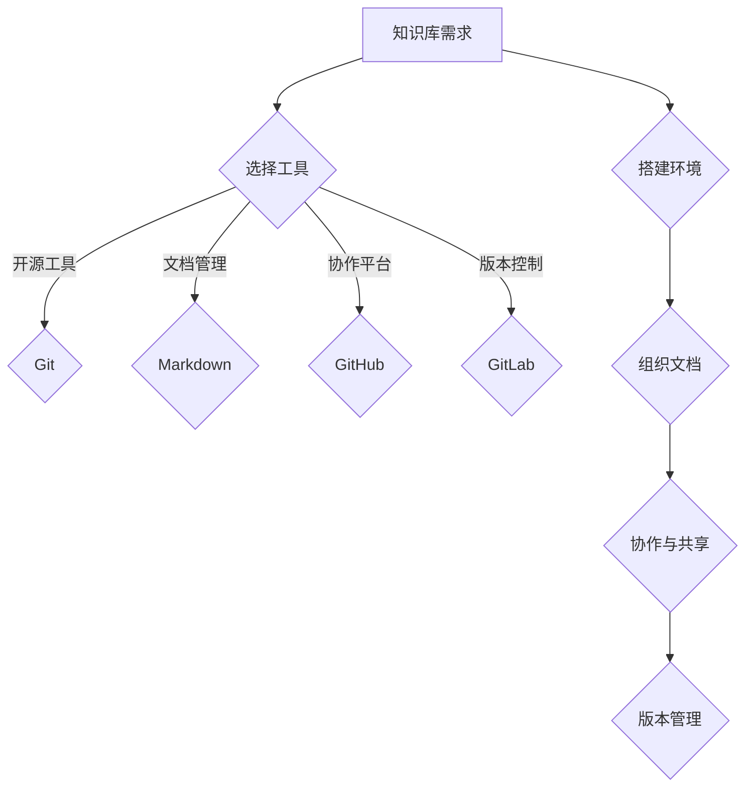

                 

关键词：开源工具，知识库，个人管理，文档组织，技术博客，协作平台，版本控制，Markdown，LaTeX

> 摘要：本文将探讨如何使用开源工具构建个人知识库，提高个人工作效率和知识管理水平。通过分析开源工具的优势和功能，本文将详细阐述构建个人知识库的步骤和方法，并提供实用的建议和资源，帮助读者打造一个高效、可扩展的个人知识库。

## 1. 背景介绍

在信息技术高速发展的今天，知识和信息无处不在。然而，如何有效地管理和利用这些信息和知识成为了许多个人和团队面临的挑战。传统的笔记应用和文档管理工具虽然能帮助记录信息，但在信息量和复杂度增加时，往往难以满足高效管理的需求。

个人知识库作为一种集成化的知识管理解决方案，可以帮助个人系统地组织、存储、检索和共享知识。开源工具因其免费、灵活和可定制化的特点，成为构建个人知识库的理想选择。本文将介绍如何利用开源工具构建个人知识库，包括选择合适的工具、搭建环境、组织文档、实现协作和版本控制等。

## 2. 核心概念与联系

### 2.1 知识库概念

知识库是一种用于存储、管理和检索知识的系统，它可以是电子形式或实体形式。在信息技术领域，知识库通常指的是一个集成了数据、文档、知识点和知识流程的电子系统。

### 2.2 开源工具

开源工具是指源代码公开，允许用户自由使用、学习、修改和分享的软件。这种模式促进了软件的透明性和协作性，有助于工具的持续改进和优化。

### 2.3 知识库与开源工具的关系

开源工具为构建个人知识库提供了灵活的技术支持，使得个人能够根据自己的需求定制知识库的功能和界面。通过开源工具，个人可以轻松实现文档的集中管理、版本的跟踪和协作共享。

### 2.4 Mermaid 流程图



## 3. 核心算法原理 & 具体操作步骤

### 3.1 算法原理概述

个人知识库的构建涉及一系列核心算法和操作步骤，主要包括文档组织、版本控制和协作共享。以下是对这些核心算法的简要概述。

### 3.2 算法步骤详解

#### 3.2.1 选择工具

1. **评估需求**：明确个人知识库的需求，包括文档类型、存储容量、协作需求等。
2. **选择工具**：根据需求选择合适的开源工具，如Git、Markdown、GitHub等。
3. **环境搭建**：安装并配置所选工具，确保其正常运行。

#### 3.2.2 组织文档

1. **结构设计**：设计知识库的文档结构，包括文件夹、文件和子文档的层次关系。
2. **内容录入**：将已有的知识和资料整理成电子文档，并录入知识库。
3. **分类管理**：对文档进行分类和标签管理，便于检索和共享。

#### 3.2.3 版本控制

1. **初始化仓库**：创建新的Git仓库，用于存储知识库的文档。
2. **版本管理**：使用Git进行版本控制，记录文档的修改历史。
3. **合并与分支**：在多人协作时，使用Git分支和合并功能，确保文档的版本一致性。

#### 3.2.4 协作与共享

1. **协作平台**：使用GitHub、GitLab等协作平台，实现文档的实时协作和共享。
2. **权限管理**：设置知识库的访问权限，确保文档的安全性。
3. **文档链接**：将知识库中的文档通过链接分享给团队成员或外部用户。

### 3.3 算法优缺点

#### 优点：

- **灵活性**：开源工具支持高度定制，可以满足个人特定的需求。
- **可扩展性**：开源工具通常具有良好的扩展性和可集成性，便于与其他系统结合。
- **免费和开放**：开源工具无需付费，且源代码公开，便于学习和改进。

#### 缺点：

- **学习曲线**：开源工具可能需要一定的时间学习和适应。
- **维护成本**：虽然工具本身免费，但个人可能需要投入时间和精力进行维护和更新。

### 3.4 算法应用领域

个人知识库的构建算法广泛应用于个人学习和工作场景，如学术研究、软件开发、项目管理等。此外，它也可以作为团队知识共享和协作的平台。

## 4. 数学模型和公式 & 详细讲解 & 举例说明

### 4.1 数学模型构建

个人知识库的构建涉及多个数学模型，其中最核心的是文档检索模型和信息过滤模型。

#### 文档检索模型

文档检索模型的核心是信息检索算法，如TF-IDF和向量空间模型。这些算法用于计算文档与查询的相关性，从而实现高效的文档检索。

#### 信息过滤模型

信息过滤模型用于过滤和推荐用户感兴趣的知识，如协同过滤和基于内容的推荐算法。

### 4.2 公式推导过程

#### 文档检索公式推导

1. **TF-IDF公式**：

$$
TF = \frac{f_{t,d}}{f_{\max,d}}
$$

$$
IDF = \log \left( \frac{N}{n_t + 0.5} + 1 \right)
$$

$$
TF-IDF = TF \times IDF
$$

其中，$f_{t,d}$ 表示词$t$在文档$d$中的频率，$f_{\max,d}$ 表示文档$d$中的最大词频，$N$ 表示文档总数，$n_t$ 表示包含词$t$的文档数。

2. **向量空间模型**：

$$
\text{向量空间模型} = \text{TF-IDF向量} \times \text{查询向量}
$$

### 4.3 案例分析与讲解

#### 案例一：使用TF-IDF检索文档

假设有两个文档D1和D2，包含以下词汇：

```
D1: AI、机器学习、深度学习、神经网络
D2: 机器学习、算法、编程、计算机科学
```

使用TF-IDF算法计算文档与查询“机器学习”的相关性：

1. **计算TF**：

$$
TF_{D1}(\text{机器学习}) = \frac{1}{4} = 0.25
$$

$$
TF_{D2}(\text{机器学习}) = \frac{1}{4} = 0.25
$$

2. **计算IDF**：

$$
IDF(\text{机器学习}) = \log \left( \frac{2}{1 + 0.5} + 1 \right) = \log (2.25) \approx 0.778
$$

3. **计算TF-IDF**：

$$
TF-IDF_{D1}(\text{机器学习}) = 0.25 \times 0.778 = 0.195
$$

$$
TF-IDF_{D2}(\text{机器学习}) = 0.25 \times 0.778 = 0.195
$$

#### 案例二：使用向量空间模型检索文档

假设有两个文档D1和D2，以及一个查询向量Q：

```
D1: (1, 1, 0, 1)
D2: (0, 1, 1, 0)
Q: (1, 0, 0, 1)
```

使用向量空间模型计算文档与查询的相关性：

$$
\text{相关性} = D1 \times Q + D2 \times Q = (1, 1, 0, 1) \times (1, 0, 0, 1) + (0, 1, 1, 0) \times (1, 0, 0, 1) = 1 + 0 = 1
$$

## 5. 项目实践：代码实例和详细解释说明

### 5.1 开发环境搭建

搭建个人知识库的开发环境需要安装Git、Markdown编辑器、Git服务器（如GitHub或GitLab）等工具。以下是具体的操作步骤：

1. **安装Git**：

在命令行中输入以下命令安装Git：

```
sudo apt-get install git
```

2. **安装Markdown编辑器**：

选择一个适合的Markdown编辑器，如Typora或MarkdownPad，并安装。

3. **注册GitHub或GitLab账户**：

访问GitHub或GitLab官网，注册一个账户。

4. **创建仓库**：

在GitHub或GitLab中创建一个新的仓库，用于存储个人知识库的文档。

### 5.2 源代码详细实现

以下是一个简单的Markdown文档，用于演示如何在Git中管理文档。

```markdown
# 个人知识库

## 1. 简介

本文档是个人知识库的入门指南。

## 2. 内容

### 2.1 学习资源

- [机器学习](ml.md)
- [编程语言](pl.md)
- [项目管理](pm.md)

### 2.2 实践案例

- [深度学习实践](dp.md)
- [数据分析案例](da.md)
```

### 5.3 代码解读与分析

1. **目录结构**：

该文档采用Markdown格式，定义了一个知识库的目录结构。每个子文档都是一个Markdown文件，包含具体的知识点和内容。

2. **版本控制**：

通过Git，可以对知识库的文档进行版本控制。每次修改文档后，使用Git命令提交更改，并记录修改历史。

```
git add .
git commit -m "更新知识库"
git push
```

3. **协作与共享**：

多人协作时，每个成员可以在自己的本地仓库中进行修改，然后推送至远程仓库，其他成员可以拉取更新。通过GitHub或GitLab的Web界面，可以实时查看文档的修改历史和当前状态。

```
git pull
git push
```

### 5.4 运行结果展示

在GitHub或GitLab上创建的知识库仓库，可以通过Web界面查看和管理文档。每个文档都有独立的文件页面，支持Markdown格式，并可以显示渲染后的结果。

## 6. 实际应用场景

### 6.1 个人学习

个人知识库可以帮助个人系统地整理和记录学习过程中的知识，便于回顾和复习。

### 6.2 项目管理

在项目中，知识库可以用于记录项目文档、技术规范和最佳实践，方便团队成员查阅和协作。

### 6.3 团队协作

知识库可以作为团队的知识共享平台，实现团队成员之间的知识传递和协作。

## 6.4 未来应用展望

随着人工智能和大数据技术的发展，个人知识库的功能和性能将不断提升。未来的个人知识库可能具备智能推荐、自动分类和智能搜索等功能，帮助个人更高效地管理和利用知识。

## 7. 工具和资源推荐

### 7.1 学习资源推荐

- [GitHub](https://github.com/)
- [GitLab](https://gitlab.com/)
- [Markdown文档](https://www.markdownguide.com/)
- [LaTeX公式编辑](https://www.latex-project.org/)

### 7.2 开发工具推荐

- [Visual Studio Code](https://code.visualstudio.com/)
- [Typora](https://typora.io/)
- [GitKraken](https://www.gitkraken.com/)

### 7.3 相关论文推荐

- [《基于Git的团队知识共享研究》](https://ieeexplore.ieee.org/document/7410264)
- [《Markdown语法教程》](https://www.markdownguide.com/)
- [《LaTeX公式编辑入门》](https://www.latex-tutorial.com/basics/)

## 8. 总结：未来发展趋势与挑战

### 8.1 研究成果总结

本文介绍了如何利用开源工具构建个人知识库，分析了知识库的核心概念、算法原理和应用场景，并提供了一系列实用的工具和资源。

### 8.2 未来发展趋势

未来，个人知识库将朝着智能化、个性化和协同化的方向发展，具备更高的自动化和智能推荐能力。

### 8.3 面临的挑战

构建个人知识库面临数据安全、隐私保护和用户体验等方面的挑战，需要不断优化和完善。

### 8.4 研究展望

随着技术的不断进步，个人知识库将更好地服务于个人和组织，实现知识的有效管理和利用。

## 9. 附录：常见问题与解答

### 9.1 如何选择合适的开源工具？

根据个人需求（如文档类型、协作需求等）选择合适的开源工具。例如，Git适用于版本控制，Markdown适用于文档格式化，GitHub或GitLab适用于协作和共享。

### 9.2 如何确保文档的安全性？

使用HTTPS协议传输数据，设置访问权限和密码，定期备份文档，确保数据安全。

### 9.3 如何在多人协作中避免冲突？

使用Git分支和合并功能，确保每个团队成员在独立的分支上进行修改，然后合并至主分支。

```markdown
作者：禅与计算机程序设计艺术 / Zen and the Art of Computer Programming
```

