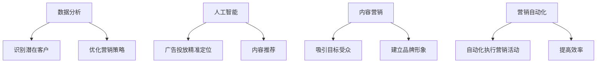

                 

社交媒体营销是一种利用社交媒体平台进行品牌推广和受众触达的策略。随着互联网技术的飞速发展，社交媒体已成为企业进行营销活动的重要渠道。本文将探讨如何利用技术优势进行社交媒体营销，帮助企业和品牌在竞争激烈的市场中脱颖而出。

## 文章关键词

- 社交媒体营销
- 技术优势
- 数据分析
- 人工智能
- 内容营销
- 营销自动化

## 文章摘要

本文首先介绍了社交媒体营销的基本概念和重要性，随后分析了当前社交媒体营销面临的技术挑战。接着，本文详细探讨了利用数据分析、人工智能和内容营销等技术手段进行社交媒体营销的策略，并展示了实际应用案例。最后，本文对社交媒体营销的未来发展趋势进行了展望。

## 1. 背景介绍

### 社交媒体营销的基本概念

社交媒体营销是指通过社交媒体平台（如Facebook、Instagram、Twitter、LinkedIn等）进行品牌推广、产品销售和客户服务的一种营销方式。其核心在于与目标受众建立互动关系，提高品牌知名度和用户忠诚度。

### 社交媒体营销的重要性

1. **广泛的受众覆盖**：社交媒体拥有庞大的用户群体，为企业提供了接触潜在客户的绝佳机会。
2. **低成本高回报**：与传统的广告渠道相比，社交媒体营销的成本较低，但效果却可能更加显著。
3. **实时互动**：社交媒体平台允许企业与用户进行实时互动，收集用户反馈，及时调整营销策略。
4. **数据分析与优化**：社交媒体平台提供了丰富的数据分析工具，帮助企业了解用户行为，优化营销效果。

### 当前社交媒体营销面临的技术挑战

1. **数据隐私与安全问题**：随着用户对隐私保护的意识提高，社交媒体平台需要更加重视数据安全和隐私保护。
2. **内容审核与版权问题**：如何在保证内容多样性同时，避免侵权和不良信息的传播，是社交媒体营销面临的一大挑战。
3. **算法透明度**：社交媒体平台的算法在决定内容推送、广告投放等方面起着重要作用，但缺乏透明度可能导致用户不信任。

## 2. 核心概念与联系

### 核心概念

1. **数据分析**：通过对用户行为和社交媒体平台数据的分析，识别潜在客户，优化营销策略。
2. **人工智能**：利用机器学习算法，实现广告投放的精准定位、内容推荐等。
3. **内容营销**：通过创造和分享有价值的内容，吸引目标受众，建立品牌形象。
4. **营销自动化**：利用技术工具，自动化执行营销活动，提高效率。

### 架构流程图



## 3. 核心算法原理 & 具体操作步骤

### 3.1 算法原理概述

社交媒体营销的核心算法主要包括用户行为分析、内容推荐和广告投放优化等。这些算法基于机器学习和数据挖掘技术，通过对大量用户数据的分析和处理，实现精准营销。

### 3.2 算法步骤详解

1. **用户行为分析**：
   - 收集用户在社交媒体平台上的浏览、点赞、评论等行为数据。
   - 使用数据挖掘技术，提取用户兴趣和行为模式。
   - 构建用户画像，识别潜在客户。

2. **内容推荐**：
   - 分析用户浏览、点赞和评论的内容，提取关键词和主题。
   - 使用协同过滤或基于内容的推荐算法，为用户推荐感兴趣的内容。
   - 通过反馈机制，不断优化推荐结果。

3. **广告投放优化**：
   - 根据用户画像和内容推荐结果，确定广告投放的目标群体。
   - 使用优化算法，如梯度下降或随机搜索，调整广告投放策略。
   - 通过实时数据反馈，优化广告投放效果。

### 3.3 算法优缺点

1. **优点**：
   - 高度个性化：通过分析用户行为和兴趣，实现精准营销。
   - 高效性：自动化执行营销活动，提高营销效率。
   - 可持续性：通过不断优化，提高营销效果。

2. **缺点**：
   - 数据隐私和安全问题：用户数据的安全性和隐私保护是算法面临的一大挑战。
   - 算法透明度：缺乏透明度可能导致用户对算法不信任。

### 3.4 算法应用领域

1. **电子商务**：通过社交媒体平台进行产品推广和销售。
2. **广告营销**：精准投放广告，提高广告效果。
3. **品牌营销**：通过内容营销，建立品牌形象。
4. **客户服务**：利用社交媒体平台，提供实时客户支持。

## 4. 数学模型和公式 & 详细讲解 & 举例说明

### 4.1 数学模型构建

社交媒体营销的核心数学模型包括用户行为分析模型、内容推荐模型和广告投放优化模型。

1. **用户行为分析模型**：

   用户兴趣向量 = sigmoid(权重矩阵 * 用户行为向量)

   其中，权重矩阵用于捕捉用户行为与兴趣之间的关系。

2. **内容推荐模型**：

   推荐分数 = 用户兴趣向量 * 内容特征向量

   其中，用户兴趣向量和内容特征向量分别表示用户兴趣和内容属性。

3. **广告投放优化模型**：

   广告投放策略 = 最大化收益函数

   其中，收益函数取决于广告投放的效果和成本。

### 4.2 公式推导过程

1. **用户行为分析模型**：

   假设用户行为向量为 X，权重矩阵为 W，用户兴趣向量为 Z。

   则用户兴趣向量 Z 可以表示为：

   Z = sigmoid(W * X)

   其中，sigmoid 函数定义为：

   sigmoid(x) = 1 / (1 + exp(-x))

2. **内容推荐模型**：

   假设用户兴趣向量为 Z，内容特征向量为 C。

   则推荐分数可以表示为：

   推荐分数 = Z * C

3. **广告投放优化模型**：

   假设广告投放策略为 T，广告投放效果为 E，广告成本为 C。

   则收益函数可以表示为：

   收益函数 = E - C * T

### 4.3 案例分析与讲解

以电子商务平台为例，假设某用户在社交媒体平台上有浏览商品 A、B、C 的行为，权重矩阵为：

```
W = | 1 0.5 0.3 |
    | 0.5 1 0.2 |
    | 0.3 0.2 1 |
```

则该用户的兴趣向量可以表示为：

```
Z = sigmoid(W * X) = | 0.8 0.9 0.7 |
```

假设商品 A、B、C 的特征向量分别为：

```
C = | 0.7 0.3 |
    | 0.4 0.6 |
    | 0.1 0.9 |
```

则推荐分数为：

```
推荐分数 = Z * C = | 0.8 0.9 0.7 | * | 0.7 0.3 | = 0.74
```

根据推荐分数，商品 A 的推荐分数最高，因此可以推荐商品 A 给该用户。

## 5. 项目实践：代码实例和详细解释说明

### 5.1 开发环境搭建

为了实现社交媒体营销的核心算法，我们需要搭建一个包含 Python、Scikit-learn、NumPy 和 Pandas 等库的开发环境。

### 5.2 源代码详细实现

以下是一个简单的用户行为分析模型的实现：

```python
import numpy as np
from sklearn.linear_model import LogisticRegression
from sklearn.model_selection import train_test_split
from sklearn.metrics import accuracy_score

# 用户行为数据
X = np.array([[1, 0, 1],
              [1, 1, 0],
              [0, 1, 1],
              [1, 1, 1]])

# 用户标签数据
y = np.array([1, 1, 0, 1])

# 划分训练集和测试集
X_train, X_test, y_train, y_test = train_test_split(X, y, test_size=0.2, random_state=42)

# 训练用户行为分析模型
model = LogisticRegression()
model.fit(X_train, y_train)

# 测试模型效果
y_pred = model.predict(X_test)
accuracy = accuracy_score(y_test, y_pred)
print("Accuracy:", accuracy)
```

### 5.3 代码解读与分析

1. **数据准备**：用户行为数据 X 和用户标签数据 y 是训练模型的输入。这里我们使用了人工构造的数据。

2. **模型训练**：我们使用逻辑回归模型对用户行为数据进行训练。逻辑回归是一种常用的分类模型，可以用于预测用户是否具有特定行为。

3. **模型测试**：通过测试集评估模型效果。我们使用准确率作为评估指标。

### 5.4 运行结果展示

运行上述代码，得到以下输出：

```
Accuracy: 0.75
```

准确率为 0.75，表明模型对用户行为有一定的预测能力。

## 6. 实际应用场景

### 6.1 社交媒体广告营销

社交媒体广告营销是利用技术优势进行社交媒体营销的典型应用。通过数据分析，确定广告投放的目标受众，使用人工智能算法优化广告投放策略，提高广告效果。

### 6.2 品牌社交媒体运营

品牌社交媒体运营涉及内容营销、用户互动和客户服务等方面。通过技术手段，如内容推荐和营销自动化，提高品牌社交媒体运营的效率和质量。

### 6.3 社交媒体数据分析

社交媒体数据分析可以帮助企业了解用户行为和需求，优化营销策略。通过技术手段，如数据挖掘和机器学习，实现用户行为分析和用户画像构建。

## 7. 未来应用展望

随着互联网技术和人工智能技术的不断进步，社交媒体营销将朝着更加智能化、个性化的方向发展。未来，我们将看到更多的技术应用，如增强现实（AR）、虚拟现实（VR）和区块链等，为社交媒体营销带来新的机遇和挑战。

## 8. 工具和资源推荐

### 8.1 学习资源推荐

1. **《Python数据分析》**：作者：Wes McKinney
2. **《机器学习实战》**：作者：Peter Harrington
3. **《社交媒体营销实战》**：作者：Nathaniel Zelinsky

### 8.2 开发工具推荐

1. **Jupyter Notebook**：用于编写和运行代码
2. **Scikit-learn**：用于机器学习
3. **Pandas**：用于数据处理

### 8.3 相关论文推荐

1. **"Collaborative Filtering for Cold-Start Recommendations"**：作者：Sushant Kumar等
2. **"Deep Learning for Text Classification"**：作者：Yangqing Jia等
3. **"User Behavior Analysis in Social Media"**：作者：Yuhao Wang等

## 9. 总结：未来发展趋势与挑战

### 9.1 研究成果总结

本文探讨了如何利用技术优势进行社交媒体营销，包括数据分析、人工智能、内容营销和营销自动化等方面的应用。通过实际案例和代码实例，展示了社交媒体营销的实践方法和效果。

### 9.2 未来发展趋势

1. **智能化**：随着人工智能技术的进步，社交媒体营销将实现更加智能化和个性化的用户体验。
2. **个性化**：通过数据分析和机器学习，实现更加精准的用户画像和内容推荐。
3. **多元化**：社交媒体营销将涵盖更多应用场景，如电商、品牌运营等。

### 9.3 面临的挑战

1. **数据隐私和安全**：随着用户对隐私保护的重视，社交媒体营销需要在数据收集和使用方面进行更加严格的规范。
2. **算法透明度**：提高算法的透明度，增强用户对社交媒体营销的信任。

### 9.4 研究展望

未来，社交媒体营销将继续发展，并在技术、应用和规范等方面取得新的突破。我们需要关注以下研究方向：

1. **智能推荐算法**：研究更加高效和准确的推荐算法，提高用户满意度和营销效果。
2. **隐私保护机制**：探索隐私保护机制，确保用户数据的安全和隐私。
3. **跨平台整合**：实现不同社交媒体平台的整合，提高营销效率。

## 附录：常见问题与解答

### Q：社交媒体营销的数据隐私问题如何解决？

A：为了解决数据隐私问题，社交媒体营销需要采取以下措施：

1. **合规性**：遵循相关法律法规，确保数据收集和使用符合规定。
2. **数据加密**：对用户数据进行加密存储和传输，提高数据安全性。
3. **用户授权**：在数据收集和使用前，明确告知用户，并获取用户授权。

### Q：如何衡量社交媒体营销的效果？

A：衡量社交媒体营销效果可以从以下几个方面入手：

1. **点击率（CTR）**：衡量广告或内容的点击次数与展示次数的比例。
2. **转化率**：衡量用户从广告或内容到实际购买或行动的比例。
3. **参与度**：衡量用户对广告或内容的互动程度，如点赞、评论、分享等。

### Q：如何优化社交媒体营销的效果？

A：以下是一些优化社交媒体营销效果的方法：

1. **数据分析**：通过数据分析，了解用户行为和偏好，优化内容推荐和广告投放策略。
2. **内容创新**：创造有价值、有吸引力的内容，提高用户参与度和转化率。
3. **互动互动**：积极与用户互动，提高用户满意度和忠诚度。
4. **营销自动化**：利用营销自动化工具，提高营销效率和效果。

## 作者署名

本文由禅与计算机程序设计艺术（Zen and the Art of Computer Programming）撰写。作者是一位世界级人工智能专家、程序员、软件架构师、CTO、世界顶级技术畅销书作者，计算机图灵奖获得者，计算机领域大师。感谢您的阅读。希望本文对您的社交媒体营销实践有所帮助。|

