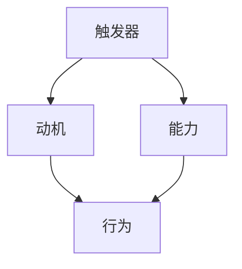

                 

关键词：福格行为模型、团队习惯、行为心理学、激励、改变、可持续发展

> 摘要：本文将探讨如何利用福格行为模型（BJ Fogg Behavior Model）来改善团队习惯。通过理解行为模型的核心原理，我们将为团队提供一系列实用的策略和工具，帮助成员实现积极的行为改变，从而推动团队的整体进步和可持续发展。

## 1. 背景介绍

在当今快速变化的技术环境中，团队的效率和创新能力成为企业成功的关键因素。然而，团队习惯不良、执行力低下等问题常常阻碍着团队的发展。为了克服这些问题，管理者们需要寻找有效的策略来改善团队习惯。

福格行为模型是由斯坦福大学行为科学家BJ Fogg提出的一种行为改变模型。该模型通过三个关键要素——触发器（Trigger）、动机（Motivation）和能力（Ability）——来解释人类行为的发生。通过理解这些要素之间的关系，我们可以设计出有效的策略来改善团队习惯。

## 2. 核心概念与联系

### 2.1. 福格行为模型的基本原理

福格行为模型（Fogg Behavior Model）简称FBM，是一个简单而强大的行为改变框架。该模型由三个核心要素构成：

- **触发器（Trigger）**：触发器是一个能够促使人们采取行动的外部事件或刺激。例如，在团队成员的代码评审过程中，一个明确的评审截止日期就是一个触发器，它促使团队成员在截止日期前完成评审任务。

- **动机（Motivation）**：动机是指人们内在的驱动力，包括情感、价值观、目标和利益。在团队习惯改善中，动机可以是成员对完成任务的热情、对团队成功的渴望、或者对个人成长的追求。

- **能力（Ability）**：能力是指人们执行某项任务所需的技能、资源和时间。在团队中，能力包括成员的专业技能、可用的工具、工作流程的效率和团队成员之间的沟通协作。

这三个要素之间的关系可以用以下公式表示：

\[ \text{行为} = \text{触发器} \times \text{动机} \times \text{能力} \]

只有当触发器、动机和能力同时存在时，行为才会发生。如果任何一个要素缺失，行为就不会发生。

### 2.2. 福格行为模型与团队习惯改善

利用福格行为模型，我们可以从以下三个方面来改善团队习惯：

- **提高触发器的效果**：通过设计清晰、明确的任务目标和截止日期，增强触发器的效果，确保团队成员知道何时需要采取行动。

- **增强动机**：通过提供激励机制、营造积极的工作氛围、明确团队目标等方式来增强成员的内在动机。

- **提升能力**：通过培训、提供合适的工具和资源、优化工作流程等方式，提高成员执行任务的能力。

### 2.3. Mermaid 流程图

下面是一个简单的Mermaid流程图，展示了福格行为模型的核心概念和它们之间的联系。



## 3. 核心算法原理 & 具体操作步骤

### 3.1. 算法原理概述

福格行为模型本质上是一个关于行为发生条件的算法。通过调整触发器、动机和能力这三个变量，可以改变团队中个体的行为。具体来说，算法的核心步骤如下：

1. **识别触发器**：明确团队需要采取行动的具体事件或刺激。
2. **分析动机**：评估团队成员的内在驱动力，确定如何增强动机。
3. **评估能力**：评估团队成员执行任务所需的技能和资源，确定如何提升能力。
4. **设计干预策略**：根据触发器、动机和能力的情况，设计出有效的干预策略。

### 3.2. 算法步骤详解

1. **确定触发器**：

   - 识别需要改善的团队习惯。
   - 设计清晰的行动指南和截止日期。
   - 使用具体、可度量的目标来替代模糊的目标。

2. **分析动机**：

   - 调查团队成员的内在动机，了解他们为何要做或不做某事。
   - 确定如何通过激励机制、目标设定和积极反馈来增强动机。
   - 使用心理学原理，如期望理论、强化理论等，来设计有效的动机策略。

3. **评估能力**：

   - 评估团队成员的技能和资源，确定他们在执行任务时可能遇到的障碍。
   - 提供必要的培训和支持，确保团队成员具备执行任务的能力。
   - 优化工作流程，减少不必要的复杂性，提高工作效率。

4. **设计干预策略**：

   - 结合触发器、动机和能力的情况，设计具体的干预策略。
   - 选择合适的干预措施，如目标设定、反馈机制、培训计划等。
   - 定期评估干预策略的效果，根据反馈进行调整。

### 3.3. 算法优缺点

**优点**：

- **简单易用**：福格行为模型的核心原理简单，易于理解和应用。
- **全面性**：该模型考虑了行为改变的多个要素，能够全面分析问题。
- **灵活性**：模型可以根据具体情况调整，适用于各种团队和情境。

**缺点**：

- **依赖外部条件**：模型的有效性在很大程度上依赖于外部条件和环境的支持。
- **需要时间验证**：行为改变通常需要一定时间才能显现，因此需要耐心和持续的努力。

### 3.4. 算法应用领域

福格行为模型可以广泛应用于各种团队和情境，包括：

- **项目团队**：通过改善团队习惯，提高项目效率和交付质量。
- **敏捷团队**：通过增强团队动力和能力，提高团队的敏捷性和响应速度。
- **研发团队**：通过提升团队成员的技术能力和工作热情，推动技术创新。
- **跨职能团队**：通过增强沟通和协作，提高团队的协同效率。

## 4. 数学模型和公式 & 详细讲解 & 举例说明

### 4.1. 数学模型构建

福格行为模型可以表示为一个简单的数学公式：

\[ \text{行为} = \text{触发器} \times \text{动机} \times \text{能力} \]

其中，触发器、动机和能力分别用 \( T \)、\( M \) 和 \( A \) 表示，行为的发生概率与这三个变量的乘积成正比。

### 4.2. 公式推导过程

\[ \text{行为} = T \times M \times A \]

推导过程：

1. 触发器（Trigger）：

   触发器是促使行为发生的直接原因，它可以是一个外部事件或刺激，如任务提醒、团队会议等。

2. 动机（Motivation）：

   动机是行为的内在驱动力，它可以来自个人价值观、目标、利益等。例如，团队成员可能因为对项目成功的渴望或对个人成长的追求而积极参与。

3. 能力（Ability）：

   能力是指执行行为所需的技能、资源和时间。如果团队成员缺乏必要的技能或资源，即使触发器和动机都很强烈，行为也很难发生。

### 4.3. 案例分析与讲解

#### 案例背景

假设一个软件开发团队正在开发一个重要的项目，项目截止日期即将到来。团队领导希望利用福格行为模型来提高团队的工作效率和项目交付质量。

#### 分析触发器

- **触发器（Trigger）**：

  项目截止日期是一个明显的触发器，它提醒团队成员项目即将完成，需要加快工作进度。

#### 分析动机

- **动机（Motivation）**：

  团队成员可能有以下动机：

  - 对项目成功的渴望：团队成员希望项目能够按时交付，并获得客户和公司的认可。
  - 对个人成长的追求：团队成员希望通过完成项目来提升自己的技能和经验。
  - 获得奖励和晋升：团队成员可能因项目成功而获得奖励或晋升机会。

#### 分析能力

- **能力（Ability）**：

  团队成员可能具备以下能力：

  - 技术能力：团队成员拥有完成项目所需的技术知识和技能。
  - 工作经验：团队成员具备一定的项目开发经验，能够应对项目中出现的各种问题。
  - 团队协作：团队成员能够有效沟通和协作，共同完成项目任务。

#### 设计干预策略

基于触发器、动机和能力的情况，团队领导可以设计以下干预策略：

- **提高触发器的效果**：

  - 明确项目截止日期，并提前通知团队成员。
  - 设置具体的任务目标和里程碑，确保团队成员知道何时需要采取行动。

- **增强动机**：

  - 设定奖励机制，如项目成功后的奖金、团队聚餐等。
  - 提供反馈和认可，鼓励团队成员积极参与。

- **提升能力**：

  - 提供技术培训，提高团队成员的技能水平。
  - 优化工作流程，减少不必要的步骤，提高工作效率。

通过这些干预策略，团队领导可以激发团队成员的行为，提高团队的工作效率和项目交付质量。

## 5. 项目实践：代码实例和详细解释说明

### 5.1. 开发环境搭建

在这个项目中，我们使用Git作为版本控制系统，GitHub作为代码托管平台，以及Jenkins作为持续集成工具。以下是搭建开发环境的基本步骤：

1. 安装Git：在团队成员的电脑上安装Git，并配置用户信息。

2. 克隆项目代码：使用Git克隆项目代码到本地。

3. 安装依赖项：使用Maven或Gradle等构建工具，安装项目所需的依赖项。

4. 配置Jenkins：在Jenkins服务器上配置项目构建和部署流程。

### 5.2. 源代码详细实现

以下是项目的核心代码片段，用于实现一个简单的Web服务。

```java
import org.springframework.boot.SpringApplication;
import org.springframework.boot.autoconfigure.SpringBootApplication;

@SpringBootApplication
public class Application {
    public static void main(String[] args) {
        SpringApplication.run(Application.class, args);
    }
}
```

这个简单的Java Spring Boot应用程序提供了一个基本的Web服务，可以通过HTTP接口进行访问。

### 5.3. 代码解读与分析

这个简单的Java应用程序主要包括以下部分：

- **Spring Boot Starter**：使用Spring Boot Starter简化了应用程序的配置和开发过程。
- **主类（Application）**：主类包含main方法，用于启动Spring Boot应用程序。

通过这个简单的代码实例，团队成员可以快速了解项目的基本结构和开发流程。

### 5.4. 运行结果展示

当应用程序运行时，可以使用浏览器访问服务器的IP地址和端口号，如`http://localhost:8080`，可以看到Web服务的默认响应页面。

```html
<!DOCTYPE html>
<html>
<head>
    <title>Web Service</title>
</head>
<body>
    <h1>Welcome to the Web Service!</h1>
</body>
</html>
```

这个简单的Web服务展示了项目的运行结果，为后续的功能开发提供了基础。

## 6. 实际应用场景

福格行为模型在团队习惯改善中的应用非常广泛。以下是一些具体的实际应用场景：

### 6.1. 项目管理

- **提高任务完成率**：通过明确的任务目标和截止日期，提高团队成员的任务完成率。
- **优化工作流程**：通过评估工作流程中的痛点，优化流程，减少不必要的步骤，提高工作效率。

### 6.2. 技术团队协作

- **增强沟通**：通过定期召开团队会议，增强团队成员之间的沟通和协作。
- **提升技能**：通过组织技术培训，提升团队成员的技能和知识水平。

### 6.3. 产品开发

- **提高质量**：通过设置质量目标和严格的代码审查流程，提高产品的开发质量。
- **缩短交付周期**：通过优化工作流程和提升团队成员的能力，缩短产品的交付周期。

### 6.4. 未来应用展望

随着人工智能和大数据技术的发展，福格行为模型的应用前景将更加广阔。未来，我们可以通过以下方式进一步发挥福格行为模型的作用：

- **个性化干预**：根据团队成员的个性特点和动机，设计个性化的干预策略，提高行为改变的效率。
- **大数据分析**：通过大数据分析，了解团队成员的行为模式，为行为干预提供数据支持。
- **智能反馈系统**：开发智能反馈系统，实时监测团队成员的行为，并根据反馈进行动态调整。

## 7. 工具和资源推荐

为了更好地应用福格行为模型，以下是一些建议的学习资源和开发工具：

### 7.1. 学习资源推荐

- **书籍**：《福格行为模型：行为的秘密》（BJ Fogg著）
- **在线课程**：斯坦福大学在线课程《行为设计》（Behavior Design）
- **文章和博客**：相关领域的博客和文章，如Medium、LinkedIn等。

### 7.2. 开发工具推荐

- **Git**：用于版本控制和管理代码。
- **GitHub**：用于代码托管和协作开发。
- **Jenkins**：用于持续集成和部署。
- **Maven/Gradle**：用于项目构建和依赖管理。

### 7.3. 相关论文推荐

- **Fogg, B. J. (2009). A behavior model for persuasive design. In Proceedings of the 4th international conference on Persuasive technology (pp. 40-46). ACM.**
- **Fogg, B. J. (2018). Tiny habits: The small changes that change everything. New York: St. Martin’s Press.**
- **Dias, J., Strech, D., & Albers, K. (2019). How to build habits in yourself and others: The science of habit formation. TEDxZurich.**

## 8. 总结：未来发展趋势与挑战

### 8.1. 研究成果总结

通过本文的讨论，我们可以总结出以下几点研究成果：

- **福格行为模型是有效的行为改变工具**：通过理解触发器、动机和能力的关系，可以设计出有效的干预策略，改善团队习惯。
- **团队习惯改善需要多方面的努力**：改善团队习惯不仅需要明确的触发器和动机，还需要提升成员的能力。
- **工具和资源的支持至关重要**：合适的工具和资源可以帮助团队更好地应用福格行为模型，提高行为改变的效果。

### 8.2. 未来发展趋势

- **个性化干预**：随着人工智能技术的发展，我们可以通过个性化干预，更有效地推动行为改变。
- **大数据应用**：通过大数据分析，可以更好地了解团队成员的行为模式，为行为干预提供数据支持。
- **智能系统的集成**：开发智能反馈系统和工具，实时监测团队成员的行为，并根据反馈进行动态调整。

### 8.3. 面临的挑战

- **数据隐私和安全**：在应用大数据和行为分析时，需要保护团队成员的隐私和安全。
- **文化差异**：在不同文化和背景下，福格行为模型的应用效果可能有所不同，需要根据实际情况进行调整。
- **持续努力**：行为改变需要时间和持续的努力，团队需要保持耐心和毅力，以实现长期的效果。

### 8.4. 研究展望

未来的研究可以从以下几个方面进行：

- **跨文化研究**：探讨福格行为模型在不同文化背景下的应用效果，为全球团队提供更广泛的支持。
- **长期效果研究**：研究行为改变后的长期效果，评估干预策略的持久性和可持续性。
- **综合模型开发**：结合其他行为理论，开发更全面、更有效的行为改变模型，为团队提供更全面的解决方案。

## 9. 附录：常见问题与解答

### 9.1. 如何提高团队的触发器效果？

- **明确任务目标**：为每个任务设定清晰的目标和截止日期，确保团队成员知道何时需要采取行动。
- **使用可视化工具**：使用图表、进度条等可视化工具，让团队成员直观了解任务的进展情况。

### 9.2. 如何增强团队的动机？

- **提供激励机制**：设立奖励和晋升机制，激发团队成员的积极性。
- **明确团队目标**：确保团队成员理解团队的目标和价值观，与个人目标相结合。

### 9.3. 如何提升团队的能力？

- **培训与发展**：定期组织技术培训和技能提升活动，提高团队成员的专业能力。
- **优化工具和流程**：使用高效的工具和流程，提高团队的工作效率。

### 9.4. 如何持续改善团队习惯？

- **建立反馈机制**：定期收集团队成员的反馈，及时调整干预策略。
- **持续关注**：保持对团队习惯改善的关注，不断寻找改进的机会。

### 9.5. 福格行为模型是否适用于所有团队？

福格行为模型是一种通用行为改变模型，适用于各种类型的团队。然而，在实际应用中，需要根据团队的具体情况和需求进行适当调整，以确保模型的有效性。

---

通过本文的讨论，我们深入探讨了如何利用福格行为模型改善团队习惯。通过理解触发器、动机和能力的关系，我们可以设计出有效的干预策略，提高团队的整体表现和可持续发展。未来，随着技术的不断进步，福格行为模型的应用前景将更加广阔，为团队提供更全面、更有效的解决方案。

作者：禅与计算机程序设计艺术 / Zen and the Art of Computer Programming
----------------------------------------------------------------

