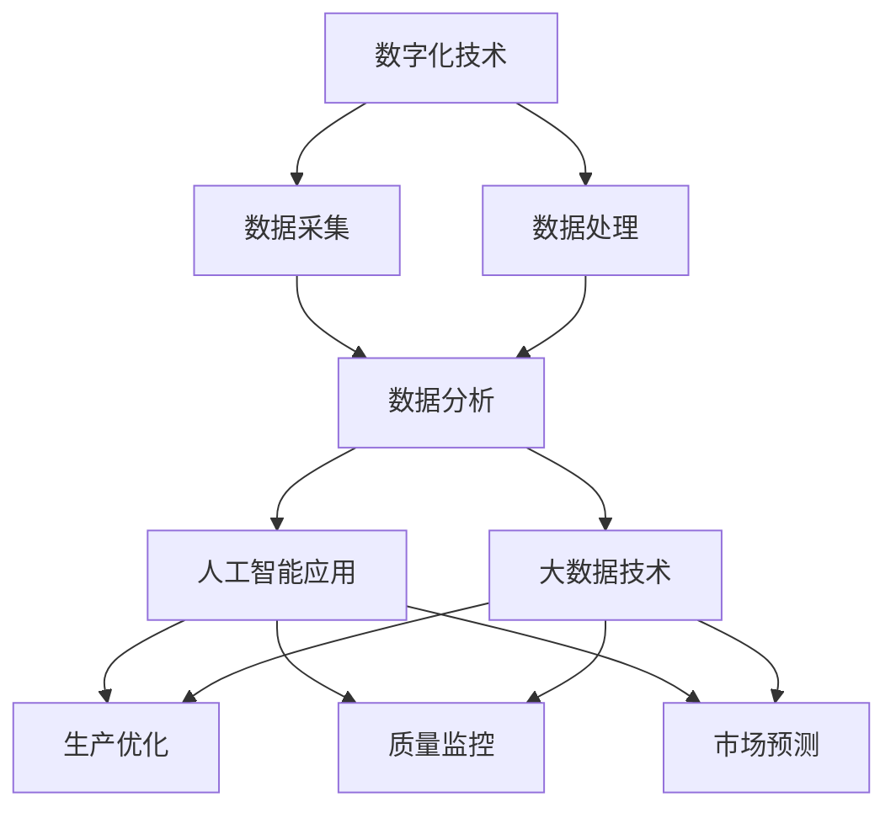

                 

关键词：制造行业、数字化、人工智能、大数据技术、转型、智能制造、工业4.0、物联网、数据分析、机器学习、数据挖掘

摘要：随着科技的快速发展，制造行业正经历一场深刻的变革。数字化、人工智能和大数据技术的兴起，为制造业带来了前所未有的机遇和挑战。本文旨在探讨制造行业如何通过数字化、人工智能和大数据技术的转型，实现生产效率的提升、产品质量的优化以及商业模式的创新。

## 1. 背景介绍

制造行业是国民经济的重要支柱，其发展水平直接影响国家的经济实力和工业竞争力。然而，传统制造业在发展过程中面临着一系列问题，如生产效率低下、产品质量不稳定、生产成本高、市场反应速度慢等。这些问题严重制约了制造业的可持续发展。

在过去的几十年里，信息技术和互联网的迅猛发展，为制造业的转型提供了强大的技术支撑。数字化、人工智能和大数据技术的引入，不仅能够解决传统制造业存在的问题，还能够创造新的商业模式和价值。

### 1.1 数字化

数字化是指将物理世界中的各种信息和过程转化为数字形式，通过计算机处理和分析。数字化技术的引入，使得制造行业能够实现生产过程的自动化、智能化和精细化。

### 1.2 人工智能

人工智能（AI）是指计算机系统通过模拟人类智能，实现自我学习和决策的能力。在制造行业，人工智能技术主要用于优化生产流程、提高产品质量、预测市场趋势等。

### 1.3 大数据技术

大数据技术是指对海量数据进行分析和处理，从中提取有价值的信息和知识。在制造行业，大数据技术可以帮助企业了解市场需求、优化生产计划、提高供应链效率等。

## 2. 核心概念与联系

制造行业的数字化、人工智能和大数据技术转型，涉及多个核心概念和技术的相互作用。以下是一个简化的Mermaid流程图，用于描述这些概念和技术之间的关系：



### 2.1 数字化技术

数字化技术主要包括物联网（IoT）、云计算、大数据等。这些技术能够实现设备与设备之间的互联互通，实时采集和分析生产过程中的数据。

### 2.2 数据采集

数据采集是数字化技术的核心。通过传感器、条码扫描、RFID等技术，实时采集生产过程中的数据，如设备状态、产品尺寸、原材料质量等。

### 2.3 数据处理

数据处理包括数据的清洗、存储、索引和查询等。通过数据处理技术，能够高效地管理和利用采集到的数据。

### 2.4 数据分析

数据分析是对处理后的数据进行深度挖掘，提取有价值的信息和知识。数据分析技术包括统计分析、机器学习、数据挖掘等。

### 2.5 人工智能应用

人工智能技术在制造行业中的应用主要包括生产优化、质量监控和市场预测等。通过模拟人类智能，人工智能技术能够实现更加精准的决策和预测。

### 2.6 大数据技术

大数据技术包括数据存储、数据处理、数据分析和数据可视化等。大数据技术能够帮助企业更好地理解市场、优化生产和提高效率。

## 3. 核心算法原理 & 具体操作步骤

### 3.1 算法原理概述

制造行业的数字化、人工智能和大数据技术转型，主要依赖于以下核心算法：

1. **机器学习算法**：用于数据分析和人工智能应用。
2. **神经网络算法**：用于模拟人类智能。
3. **数据挖掘算法**：用于从海量数据中提取有价值的信息。
4. **优化算法**：用于生产优化和质量监控。

### 3.2 算法步骤详解

1. **数据采集**：通过传感器、条码扫描、RFID等技术，实时采集生产过程中的数据。
2. **数据处理**：对采集到的数据进行清洗、存储、索引和查询等处理。
3. **数据分析**：使用机器学习算法、神经网络算法和数据挖掘算法，对处理后的数据进行深度挖掘和分析。
4. **人工智能应用**：根据数据分析结果，使用机器学习算法和神经网络算法，实现生产优化、质量监控和市场预测。
5. **大数据技术**：使用大数据技术，对海量数据进行分析和处理，提取有价值的信息和知识。

### 3.3 算法优缺点

1. **机器学习算法**：优点：能够自动学习和优化；缺点：对数据质量要求较高。
2. **神经网络算法**：优点：能够模拟人类智能；缺点：计算复杂度高，对硬件要求较高。
3. **数据挖掘算法**：优点：能够从海量数据中提取有价值的信息；缺点：对算法和数据处理技术要求较高。
4. **优化算法**：优点：能够实现生产优化和质量监控；缺点：对算法和数据处理技术要求较高。

### 3.4 算法应用领域

1. **生产优化**：通过机器学习算法和神经网络算法，实现生产过程的自动化和智能化。
2. **质量监控**：通过数据挖掘算法和优化算法，实现对产品质量的实时监控和预警。
3. **市场预测**：通过数据分析，预测市场需求和趋势，为企业决策提供支持。

## 4. 数学模型和公式 & 详细讲解 & 举例说明

### 4.1 数学模型构建

在制造行业的数字化、人工智能和大数据技术转型过程中，常用的数学模型包括：

1. **线性回归模型**：用于预测市场需求。
2. **神经网络模型**：用于模拟人类智能。
3. **聚类分析模型**：用于数据挖掘。

### 4.2 公式推导过程

1. **线性回归模型**：

$$
y = \beta_0 + \beta_1x
$$

其中，$y$ 为因变量，$x$ 为自变量，$\beta_0$ 和 $\beta_1$ 为参数。

2. **神经网络模型**：

$$
h_{\theta}(x) = \sum_{i=1}^{n} \theta_i x_i
$$

其中，$h_{\theta}(x)$ 为输出值，$x_i$ 为输入值，$\theta_i$ 为参数。

3. **聚类分析模型**：

$$
c = \frac{1}{m} \sum_{i=1}^{m} \frac{1}{\|x_i - \mu_c\|^2}
$$

其中，$c$ 为聚类中心，$x_i$ 为数据点，$\mu_c$ 为聚类中心。

### 4.3 案例分析与讲解

假设一家制造企业需要预测下一季度市场需求，可以使用线性回归模型进行分析。首先，收集过去几年的市场需求数据，然后使用线性回归模型进行拟合，得到预测公式。最后，将下一季度的市场需求数据代入公式，预测市场需求量。

$$
y = \beta_0 + \beta_1x
$$

其中，$y$ 为市场需求量，$x$ 为时间。

## 5. 项目实践：代码实例和详细解释说明

### 5.1 开发环境搭建

在开始项目实践之前，需要搭建一个合适的开发环境。这里以Python为例，介绍如何搭建开发环境。

1. 安装Python：从官网下载Python安装包，安装完成后，配置环境变量。
2. 安装相关库：使用pip命令安装所需的Python库，如numpy、pandas、scikit-learn等。

### 5.2 源代码详细实现

以下是一个简单的线性回归模型的实现代码：

```python
import numpy as np
import pandas as pd
from sklearn.linear_model import LinearRegression

# 加载数据
data = pd.read_csv('data.csv')
x = data['time'].values.reshape(-1, 1)
y = data['demand'].values

# 创建线性回归模型
model = LinearRegression()

# 拟合模型
model.fit(x, y)

# 预测
x_new = np.array([2023]).reshape(-1, 1)
y_pred = model.predict(x_new)

print('预测市场需求量：', y_pred)
```

### 5.3 代码解读与分析

1. **数据加载**：使用pandas库加载数据，数据包括时间（time）和市场需求量（demand）。
2. **模型创建**：使用scikit-learn库创建线性回归模型。
3. **模型拟合**：使用fit方法拟合模型。
4. **模型预测**：使用predict方法预测市场需求量。

### 5.4 运行结果展示

运行代码后，输出预测市场需求量的结果。根据预测结果，可以制定相应的生产和市场策略。

## 6. 实际应用场景

制造行业的数字化、人工智能和大数据技术转型，已经在多个领域取得了显著的应用成果。以下是一些实际应用场景：

1. **生产优化**：通过人工智能技术，优化生产流程，提高生产效率。
2. **质量监控**：通过大数据技术，实时监控产品质量，提高产品质量稳定性。
3. **市场预测**：通过数据分析，预测市场需求和趋势，为企业决策提供支持。
4. **供应链管理**：通过物联网技术，实现供应链的实时监控和管理。

## 7. 工具和资源推荐

为了更好地实现制造行业的数字化、人工智能和大数据技术转型，以下是一些建议的工具和资源：

1. **学习资源**：
   - 《深度学习》（Goodfellow, Bengio, Courville著）
   - 《机器学习实战》（周志华著）
   - 《Python数据分析》（Wes McKinney著）

2. **开发工具**：
   - Jupyter Notebook：适合数据分析和机器学习项目的开发。
   - TensorFlow：用于深度学习模型的训练和部署。
   - PyTorch：用于深度学习模型的训练和部署。

3. **相关论文**：
   - "Deep Learning for Manufacturing Applications"（深度学习在制造业中的应用）
   - "Big Data in Manufacturing: A Review"（大数据在制造业中的应用综述）
   - "Artificial Intelligence in Manufacturing: A Systematic Literature Review"（人工智能在制造业中的系统文献综述）

## 8. 总结：未来发展趋势与挑战

制造行业的数字化、人工智能和大数据技术转型，已经成为不可逆转的趋势。未来，随着技术的不断发展，制造行业将迎来更加智能化、自动化和高效化的生产模式。然而，这也带来了新的挑战：

1. **数据安全与隐私**：随着数据量的不断增加，数据安全和隐私保护成为重要问题。
2. **技术人才短缺**：数字化、人工智能和大数据技术人才的需求快速增长，但供给不足。
3. **商业模式创新**：如何在数字化、人工智能和大数据技术的支持下，创造新的商业模式和价值。

为了应对这些挑战，制造企业需要加强技术创新、人才培养和商业模式创新，积极拥抱数字化、人工智能和大数据技术，推动制造业的可持续发展。

## 9. 附录：常见问题与解答

### 9.1 什么是数字化？

数字化是指将物理世界中的各种信息和过程转化为数字形式，通过计算机处理和分析。数字化技术的引入，使得制造行业能够实现生产过程的自动化、智能化和精细化。

### 9.2 人工智能在制造行业中的应用有哪些？

人工智能在制造行业中的应用主要包括生产优化、质量监控和市场预测等。通过模拟人类智能，人工智能技术能够实现更加精准的决策和预测，提高生产效率和产品质量。

### 9.3 大数据技术在制造行业中的应用有哪些？

大数据技术在制造行业中的应用主要包括数据采集、数据分析、生产优化和质量监控等。通过大数据技术，企业能够更好地理解市场、优化生产和提高效率。

### 9.4 如何实现制造行业的数字化转型？

实现制造行业的数字化转型，需要从以下几个方面入手：

1. **数据采集**：通过传感器、条码扫描、RFID等技术，实时采集生产过程中的数据。
2. **数据处理**：对采集到的数据进行清洗、存储、索引和查询等处理。
3. **数据分析**：使用机器学习算法、神经网络算法和数据挖掘算法，对处理后的数据进行深度挖掘和分析。
4. **人工智能应用**：根据数据分析结果，使用机器学习算法和神经网络算法，实现生产优化、质量监控和市场预测。
5. **大数据技术**：使用大数据技术，对海量数据进行分析和处理，提取有价值的信息和知识。

作者：禅与计算机程序设计艺术 / Zen and the Art of Computer Programming
``` 
----------------------------------------------------------------
以上就是本文的完整内容。希望本文能够为制造行业的技术转型提供有益的参考和启示。在未来的发展中，制造行业将继续迎来新的机遇和挑战，让我们共同见证这场变革的力量。
----------------------------------------------------------------
```

