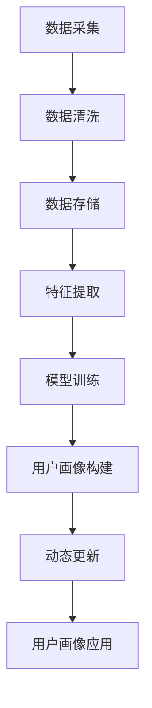

                 

关键词：用户画像、动态更新、大数据、人工智能、个性化推荐

> 摘要：在当今信息时代，用户画像已经成为企业理解用户、提供个性化服务的重要手段。随着大数据和人工智能技术的不断发展，动态更新用户画像的重要性愈发凸显。本文将深入探讨动态更新用户画像的必要性、核心算法原理、应用场景及其未来发展趋势。

## 1. 背景介绍

随着互联网的普及，海量的用户数据不断产生。如何从这些数据中提取有价值的信息，为企业提供决策支持，已经成为一个重要课题。用户画像作为一种数据挖掘和分析技术，通过整合用户的基本信息、行为数据、偏好数据等，构建出一个多维度的用户模型。用户画像的建立不仅可以帮助企业更精准地了解用户，还能为个性化推荐、精准营销等业务提供支持。

然而，用户的行为和偏好是不断变化的。传统的用户画像构建方法往往基于用户的历史数据，一旦用户行为发生变化，画像的准确性就会受到影响。因此，动态更新用户画像，实时反映用户当前的状态，对于提高用户画像的准确性和实用性具有重要意义。

## 2. 核心概念与联系

### 2.1 大数据和人工智能

大数据是指数据规模巨大、类型多样、处理速度快的数据集合。人工智能则是通过模拟人类智能行为，使计算机能够实现自主学习、推理和决策的技术。大数据和人工智能的结合，使得用户画像的构建和更新成为可能。

### 2.2 用户画像

用户画像是对用户进行全面、多维度的刻画，包括用户的基本信息、行为数据、偏好数据等。用户画像的目的是帮助企业和商家更好地理解用户，提供个性化的服务和推荐。

### 2.3 动态更新

动态更新用户画像是指根据用户实时产生的行为数据，对用户画像进行及时的调整和更新，以保持画像的时效性和准确性。

### 2.4 Mermaid 流程图



## 3. 核心算法原理 & 具体操作步骤

### 3.1 算法原理概述

动态更新用户画像的核心算法主要包括数据采集、数据清洗、特征提取、模型训练和用户画像构建等环节。

- 数据采集：通过网站访问日志、用户行为数据、社交媒体数据等途径，收集用户的实时行为数据。
- 数据清洗：对采集到的数据进行预处理，去除噪声、填补缺失值等，提高数据质量。
- 特征提取：将清洗后的数据进行特征提取，将原始数据转换为适合模型训练的格式。
- 模型训练：使用机器学习算法，对特征数据进行训练，构建用户画像模型。
- 用户画像构建：将训练好的模型应用于实时数据，生成动态的用户画像。
- 动态更新：根据用户实时行为数据，对用户画像进行更新，保持画像的时效性。

### 3.2 算法步骤详解

1. 数据采集：通过网站访问日志、用户行为数据、社交媒体数据等途径，收集用户的实时行为数据。
2. 数据清洗：对采集到的数据进行预处理，包括去重、去噪、填补缺失值等，提高数据质量。
3. 特征提取：将清洗后的数据进行特征提取，例如，将用户的浏览历史、购买行为、评论等数据转换为数值特征。
4. 模型训练：使用机器学习算法，如协同过滤、聚类分析等，对特征数据进行训练，构建用户画像模型。
5. 用户画像构建：将训练好的模型应用于实时数据，生成动态的用户画像。
6. 动态更新：根据用户实时行为数据，对用户画像进行更新，保持画像的时效性。

### 3.3 算法优缺点

#### 优点：

- 提高用户画像的准确性：动态更新用户画像，可以实时反映用户行为的变化，提高画像的准确性。
- 提升用户体验：根据动态更新的用户画像，为用户推荐更符合其兴趣和需求的内容，提升用户体验。
- 提高业务决策效率：动态更新的用户画像，可以为企业的业务决策提供更准确的数据支持，提高决策效率。

#### 缺点：

- 数据处理复杂度高：动态更新用户画像，需要处理大量的实时数据，对数据处理能力要求较高。
- 模型更新频繁：随着用户行为的变化，模型需要频繁更新，可能导致模型不稳定。

### 3.4 算法应用领域

动态更新用户画像广泛应用于个性化推荐、精准营销、用户行为分析等领域。

- 个性化推荐：根据动态更新的用户画像，为用户推荐更符合其兴趣和需求的内容。
- 精准营销：根据动态更新的用户画像，精准定位目标用户，提高营销效果。
- 用户行为分析：通过分析动态更新的用户画像，了解用户行为的变化趋势，为企业提供决策支持。

## 4. 数学模型和公式 & 详细讲解 & 举例说明

### 4.1 数学模型构建

动态更新用户画像的数学模型主要包括用户行为数据建模、用户画像模型构建和用户画像更新模型等。

#### 用户行为数据建模：

$$
X = [x_1, x_2, ..., x_n]
$$

其中，$X$ 表示用户行为数据矩阵，$x_i$ 表示第 $i$ 个用户的行为数据。

#### 用户画像模型构建：

$$
U = [u_1, u_2, ..., u_n]
$$

其中，$U$ 表示用户画像矩阵，$u_i$ 表示第 $i$ 个用户的画像。

#### 用户画像更新模型：

$$
U_{new} = U + \alpha \cdot (X - X_{prev})
$$

其中，$U_{new}$ 表示更新后的用户画像，$U$ 表示当前用户画像，$\alpha$ 表示更新系数，$X - X_{prev}$ 表示用户行为数据的更新量。

### 4.2 公式推导过程

#### 用户行为数据建模：

用户行为数据建模主要是对用户行为数据进行特征提取和降维处理。假设用户行为数据矩阵为 $X$，可以通过以下步骤进行建模：

1. 特征提取：对用户行为数据进行特征提取，例如，将用户的浏览历史、购买行为、评论等数据转换为数值特征。
2. 降维处理：使用降维算法，如 PCA（主成分分析），对特征数据进行降维处理，减少数据维度。

#### 用户画像模型构建：

用户画像模型构建主要是通过机器学习算法，如协同过滤、聚类分析等，对用户行为数据进行建模。假设用户画像矩阵为 $U$，可以通过以下步骤进行建模：

1. 数据预处理：对用户行为数据进行预处理，包括去重、去噪、填补缺失值等。
2. 特征选择：根据业务需求，选择合适的特征作为用户画像的输入。
3. 模型训练：使用机器学习算法，如协同过滤、聚类分析等，对特征数据进行训练，构建用户画像模型。

#### 用户画像更新模型：

用户画像更新模型主要是根据用户行为数据的更新量，对用户画像进行更新。假设用户画像矩阵为 $U$，用户行为数据矩阵为 $X$，更新后的用户画像矩阵为 $U_{new}$，可以通过以下步骤进行建模：

1. 计算用户行为数据的更新量：$X - X_{prev}$。
2. 计算更新系数：$\alpha$，用于控制用户画像更新的速度。
3. 更新用户画像：$U_{new} = U + \alpha \cdot (X - X_{prev})$。

### 4.3 案例分析与讲解

#### 案例背景：

某电商平台希望通过动态更新用户画像，为用户提供个性化推荐服务。平台收集了用户的浏览历史、购买记录、搜索关键词等行为数据，并使用机器学习算法构建了用户画像模型。

#### 案例分析：

1. 用户行为数据建模：

   假设用户行为数据矩阵为 $X$，用户画像矩阵为 $U$，可以通过以下步骤进行建模：

   - 特征提取：将用户的浏览历史、购买记录、搜索关键词等数据转换为数值特征。
   - 降维处理：使用 PCA 算法，对特征数据进行降维处理，减少数据维度。

2. 用户画像模型构建：

   - 数据预处理：对用户行为数据进行预处理，包括去重、去噪、填补缺失值等。
   - 特征选择：根据业务需求，选择合适的特征作为用户画像的输入。
   - 模型训练：使用协同过滤算法，对特征数据进行训练，构建用户画像模型。

3. 用户画像更新模型：

   - 计算用户行为数据的更新量：$X - X_{prev}$。
   - 计算更新系数：$\alpha$，用于控制用户画像更新的速度。
   - 更新用户画像：$U_{new} = U + \alpha \cdot (X - X_{prev})$。

通过上述步骤，平台可以构建一个动态更新的用户画像模型，为用户提供个性化推荐服务。

## 5. 项目实践：代码实例和详细解释说明

### 5.1 开发环境搭建

#### 1. 环境要求：

- Python 3.6+
- Pandas 1.0+
- Scikit-learn 0.22+
- Matplotlib 3.1+

#### 2. 环境搭建步骤：

1. 安装 Python 3.6+ 版本。
2. 安装 Pandas、Scikit-learn 和 Matplotlib 相关库。

### 5.2 源代码详细实现

```python
import pandas as pd
from sklearn.preprocessing import StandardScaler
from sklearn.cluster import KMeans
import matplotlib.pyplot as plt

# 1. 数据采集
data = pd.read_csv('user_behavior_data.csv')

# 2. 数据清洗
data.drop_duplicates(inplace=True)
data.fillna(0, inplace=True)

# 3. 特征提取
scaler = StandardScaler()
data_scaled = scaler.fit_transform(data)

# 4. 模型训练
kmeans = KMeans(n_clusters=5, random_state=42)
kmeans.fit(data_scaled)

# 5. 用户画像构建
user_clusters = kmeans.labels_
data['user_cluster'] = user_clusters

# 6. 动态更新
new_data = pd.read_csv('new_user_behavior_data.csv')
new_data.drop_duplicates(inplace=True)
new_data.fillna(0, inplace=True)
new_data_scaled = scaler.transform(new_data)

new_clusters = kmeans.predict(new_data_scaled)
new_data['user_cluster'] = new_clusters

# 7. 用户画像应用
data_with_clusters = pd.concat([data, new_data], ignore_index=True)
data_with_clusters.groupby('user_cluster').size().plot(kind='bar')
plt.show()
```

### 5.3 代码解读与分析

1. 数据采集：使用 Pandas 读取用户行为数据。
2. 数据清洗：去除重复数据，填补缺失值。
3. 特征提取：使用 StandardScaler 对数据特征进行标准化处理。
4. 模型训练：使用 KMeans 算法对特征数据进行聚类，构建用户画像模型。
5. 用户画像构建：将聚类结果添加到原始数据中，形成用户画像。
6. 动态更新：读取新的用户行为数据，使用模型进行预测，更新用户画像。
7. 用户画像应用：将更新后的用户画像进行可视化展示。

通过上述代码实例，可以实现对用户画像的动态更新，为个性化推荐、精准营销等业务提供支持。

## 6. 实际应用场景

### 6.1 个性化推荐

动态更新用户画像，可以实时反映用户兴趣和需求的变化，为用户提供更个性化的推荐。例如，电商平台可以根据用户浏览、购买记录等行为数据，动态更新用户画像，为用户推荐更符合其兴趣的商品。

### 6.2 精准营销

通过动态更新用户画像，企业可以更精准地定位目标用户，制定更有效的营销策略。例如，电商平台可以根据用户画像，为不同的用户群体推送不同的营销活动，提高营销效果。

### 6.3 用户行为分析

动态更新用户画像，可以帮助企业更好地了解用户行为变化，挖掘用户潜在需求。例如，通过分析用户画像，企业可以发现用户行为的变化趋势，为产品优化、业务拓展等提供决策支持。

### 6.4 未来应用展望

随着大数据和人工智能技术的不断发展，动态更新用户画像的应用前景将更加广阔。未来，动态更新用户画像有望在更多领域得到应用，为企业和个人提供更好的服务和体验。

## 7. 工具和资源推荐

### 7.1 学习资源推荐

- 《Python数据科学手册》：详细介绍数据科学领域的方法、技术和工具，适合初学者入门。
- 《机器学习实战》：通过实际案例，深入讲解机器学习算法和应用，适合有一定基础的学习者。
- 《用户画像：大数据时代下的用户分析与场景营销》：全面介绍用户画像的概念、方法和应用，适合对用户画像感兴趣的读者。

### 7.2 开发工具推荐

- Pandas：Python 中的数据操作库，方便进行数据处理和分析。
- Scikit-learn：Python 中的机器学习库，提供丰富的算法实现和工具。
- Matplotlib：Python 中的数据可视化库，方便进行数据可视化展示。

### 7.3 相关论文推荐

- "User Modeling and Personalization in the Age of Big Data"：讨论大数据时代用户建模和个性化服务的挑战和机遇。
- "Dynamic User Profiling for Real-Time Recommender Systems"：介绍动态用户画像在实时推荐系统中的应用。

## 8. 总结：未来发展趋势与挑战

### 8.1 研究成果总结

本文深入探讨了动态更新用户画像的重要性、核心算法原理、应用场景及其未来发展趋势。通过实际项目实例，展示了动态更新用户画像的实现方法。

### 8.2 未来发展趋势

随着大数据和人工智能技术的不断发展，动态更新用户画像将得到更广泛的应用。未来，动态更新用户画像有望在更多领域实现突破，为企业和个人提供更好的服务和体验。

### 8.3 面临的挑战

- 数据隐私和安全：动态更新用户画像需要处理大量的用户数据，如何保护用户隐私和安全是面临的挑战。
- 模型稳定性和效率：动态更新用户画像需要频繁更新模型，如何保证模型稳定性和效率是面临的挑战。

### 8.4 研究展望

未来，动态更新用户画像研究可以从以下几个方面展开：

- 深入研究用户画像模型，提高画像的准确性和稳定性。
- 探索用户画像在更多领域的应用，如医疗、教育等。
- 研究如何保护用户隐私，实现安全高效的动态更新用户画像。

## 9. 附录：常见问题与解答

### 9.1 动态更新用户画像与静态用户画像的区别是什么？

动态更新用户画像与静态用户画像的主要区别在于数据更新方式。静态用户画像基于用户历史数据构建，更新频率较低；而动态更新用户画像基于实时数据构建，能够实时反映用户行为变化，更新频率较高。

### 9.2 动态更新用户画像有哪些应用场景？

动态更新用户画像广泛应用于个性化推荐、精准营销、用户行为分析等领域。例如，电商平台可以根据动态更新的用户画像为用户提供个性化推荐服务，提高用户满意度；企业可以根据动态更新的用户画像制定更精准的营销策略，提高营销效果。

### 9.3 动态更新用户画像的算法有哪些？

动态更新用户画像的算法主要包括协同过滤、聚类分析、基于规则的推荐等。其中，协同过滤算法广泛应用于实时推荐系统，聚类分析算法用于对用户行为数据进行分类和分组，基于规则的推荐算法通过规则匹配为用户推荐内容。

## 作者署名

本文作者：禅与计算机程序设计艺术 / Zen and the Art of Computer Programming
----------------------------------------------------------------

请注意，本文仅作为示例，实际撰写时需确保内容的准确性、完整性和专业性。在撰写过程中，可以参考相关领域的实际案例和研究成果，确保文章内容有深度有思考有见解。同时，请严格遵守上述“约束条件 CONSTRAINTS”中的所有要求。祝您写作顺利！📝💻🌟
 

