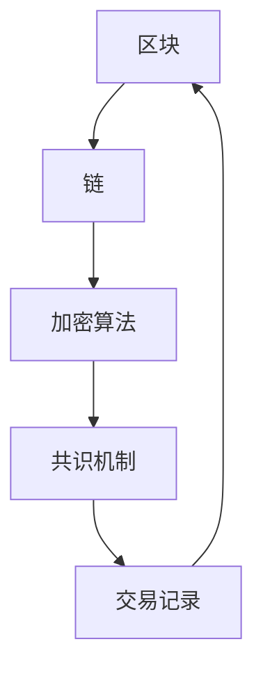

                 

在当前信息技术迅猛发展的时代，区块链技术作为一项颠覆性的创新，正逐渐改变着传统的商业和社会运作模式。本文将深入探讨区块链技术的核心概念、核心算法原理、数学模型、实际应用场景以及未来发展趋势，旨在为读者提供一个全面、系统的了解。

> 关键词：区块链，去中心化，加密算法，智能合约，共识机制，应用开发

> 摘要：本文首先介绍了区块链技术的背景和核心概念，然后深入分析了区块链的共识机制、加密算法以及智能合约等技术细节。接着，我们探讨了区块链技术的实际应用场景，并展示了如何通过代码实例进行去中心化应用的开发。最后，文章总结了区块链技术的未来发展趋势，探讨了面临的挑战和未来的研究方向。

## 1. 背景介绍

区块链技术最早由中本聪（Satoshi Nakamoto）在2008年提出，并于2009年创建了比特币（Bitcoin）作为第一个区块链应用实例。区块链技术作为一种去中心化的分布式账本技术，通过加密算法和共识机制确保数据的安全性和一致性，解决了传统中心化系统中存在的信任和效率问题。

区块链技术具有以下几个显著特点：

- **去中心化**：区块链网络中的所有节点都具有相同的功能和权限，无需依赖中心化的第三方机构。
- **不可篡改性**：区块链上的数据一旦记录，便不可篡改，保证了数据的真实性和可信度。
- **匿名性**：区块链上的交易可以在一定程度上保持匿名，增强了个人隐私保护。
- **安全性**：区块链通过加密算法和共识机制确保数据传输的安全性。

区块链技术的这些特性使其在金融、物流、医疗、法律等多个领域具有广泛的应用潜力。随着技术的不断发展和成熟，区块链技术正逐渐从理论走向实践，成为信息技术领域的一大热点。

## 2. 核心概念与联系

### 2.1 区块链基本概念

区块链是一个由多个按时间顺序排列的“区块”所组成的链式数据结构，每个区块包含了多个交易记录。区块链技术通过加密算法和共识机制确保区块链的完整性和安全性。

- **区块**：区块是区块链的基本组成单位，每个区块包含一个时间戳、一个唯一的标识符（哈希值）和一定数量的交易记录。
- **链**：区块链中的区块按照时间顺序链接在一起，形成一条单向的、不可篡改的链式结构。
- **加密算法**：加密算法用于确保区块链数据的安全性和隐私性。
- **共识机制**：共识机制是区块链网络中节点之间达成一致的重要手段，确保所有节点对区块链的状态保持一致。

### 2.2 Mermaid 流程图

下面是一个简单的 Mermaid 流程图，展示了区块链的基本概念和组成部分：



### 2.3 核心概念之间的联系

区块链技术中的各个核心概念相互关联，共同构成了区块链系统的核心架构。以下是各个概念之间的联系：

- **区块**：区块是区块链的基本存储单元，包含了交易记录和其他元数据。
- **链**：区块链通过将区块按照时间顺序链接在一起，形成了不可篡改的链式结构。
- **加密算法**：加密算法用于保护区块链上的数据传输和存储，确保数据的安全性和隐私性。
- **共识机制**：共识机制确保区块链网络中的所有节点对区块链的状态保持一致，防止恶意节点的攻击和数据篡改。

## 3. 核心算法原理 & 具体操作步骤

### 3.1 算法原理概述

区块链技术中的核心算法主要包括加密算法和共识机制。加密算法用于确保区块链上数据的完整性和安全性，而共识机制则用于确保区块链网络中的所有节点对区块链的状态保持一致。

- **加密算法**：常见的加密算法包括哈希算法、对称加密算法和非对称加密算法。哈希算法用于生成数据摘要，确保数据的完整性；对称加密算法和非对称加密算法用于数据的加密和解密。
- **共识机制**：常见的共识机制包括工作量证明（PoW）、权益证明（PoS）和委托权益证明（DPoS）等。这些共识机制通过不同的方式确保区块链网络中的所有节点对区块链的状态达成一致。

### 3.2 算法步骤详解

以下是区块链技术中加密算法和共识机制的具体操作步骤：

#### 3.2.1 加密算法

1. **哈希算法**：
   - 对数据进行处理，生成一个固定长度的哈希值。
   - 哈希值应具有唯一性、不可逆性和抗碰撞性。

2. **对称加密算法**：
   - 密钥分发：双方交换密钥。
   - 数据加密：使用密钥对数据进行加密。
   - 数据解密：使用密钥对数据进行解密。

3. **非对称加密算法**：
   - 密钥生成：生成一对密钥（公钥和私钥）。
   - 数据加密：使用公钥对数据进行加密。
   - 数据解密：使用私钥对数据进行解密。

#### 3.2.2 共识机制

1. **工作量证明（PoW）**：
   - 节点竞争生成新区块。
   - 节点需要解决一个复杂的数学问题（如SHA-256哈希函数），验证新区块的合法性。
   - 验证通过后，新区块加入区块链。

2. **权益证明（PoS）**：
   - 节点根据所持有的代币数量和持有时间获得记账权利。
   - 节点生成新区块时，需要证明自己持有的代币数量和持有时间。
   - 验证通过后，新区块加入区块链。

3. **委托权益证明（DPoS）**：
   - 节点通过投票选举产生“见证人”。
   - 见证人负责生成新区块和验证交易。
   - 见证人根据所获得的投票数量获得记账权利。

### 3.3 算法优缺点

#### 加密算法

- **哈希算法**：
  - 优点：唯一性、不可逆性和抗碰撞性。
  - 缺点：计算复杂度高，可能影响性能。

- **对称加密算法**：
  - 优点：计算速度快，安全性较高。
  - 缺点：密钥管理复杂，密钥分发困难。

- **非对称加密算法**：
  - 优点：安全性高，可用于身份认证和密钥交换。
  - 缺点：计算复杂度高，可能影响性能。

#### 共识机制

- **工作量证明（PoW）**：
  - 优点：公平、去中心化。
  - 缺点：能源消耗大，计算复杂度高。

- **权益证明（PoS）**：
  - 优点：能源消耗低，记账效率高。
  - 缺点：可能导致“富者愈富”现象。

- **委托权益证明（DPoS）**：
  - 优点：记账效率高，能源消耗低。
  - 缺点：可能导致中心化问题。

### 3.4 算法应用领域

- **加密算法**：广泛应用于数据加密、身份认证和数字签名等领域。
- **共识机制**：广泛应用于区块链系统，确保数据的一致性和安全性。

## 4. 数学模型和公式 & 详细讲解 & 举例说明

### 4.1 数学模型构建

区块链技术中的数学模型主要包括哈希函数、加密算法和共识机制。以下是这些模型的基本构建：

#### 4.1.1 哈希函数

哈希函数是一种将输入数据映射到固定长度输出值的函数，具有以下特点：

- **唯一性**：对于任意输入数据，哈希函数生成的哈希值是唯一的。
- **不可逆性**：无法通过哈希值反推出原始输入数据。
- **抗碰撞性**：不同输入数据生成的哈希值不同的概率很高。

常见的哈希函数包括MD5、SHA-1、SHA-256等。以下是SHA-256哈希函数的基本步骤：

1. **预处理**：
   - 将输入数据填充至512位的块。
   - 对每个块进行变换，生成一个新的512位消息块。

2. **初始化**：
   - 初始化八个哈希值，作为消息摘要。

3. **处理消息块**：
   - 对每个消息块进行分块处理。
   - 对每个分块应用一系列变换，更新哈希值。

4. **生成消息摘要**：
   - 将最终更新的哈希值拼接在一起，生成最终的哈希值。

#### 4.1.2 加密算法

加密算法分为对称加密算法和非对称加密算法。以下是这两种算法的基本构建：

- **对称加密算法**：
  - 密钥生成：生成一对密钥（密钥和密钥）。
  - 数据加密：使用密钥对数据进行加密。
  - 数据解密：使用密钥对数据进行解密。

- **非对称加密算法**：
  - 密钥生成：生成一对密钥（公钥和私钥）。
  - 数据加密：使用公钥对数据进行加密。
  - 数据解密：使用私钥对数据进行解密。

#### 4.1.3 共识机制

共识机制主要包括工作量证明（PoW）、权益证明（PoS）和委托权益证明（DPoS）。以下是这些机制的基本构建：

- **工作量证明（PoW）**：
  - 节点竞争生成新区块。
  - 节点需要解决一个复杂的数学问题，验证新区块的合法性。

- **权益证明（PoS）**：
  - 节点根据所持有的代币数量和持有时间获得记账权利。
  - 节点生成新区块时，需要证明自己持有的代币数量和持有时间。

- **委托权益证明（DPoS）**：
  - 节点通过投票选举产生“见证人”。
  - 见证人负责生成新区块和验证交易。

### 4.2 公式推导过程

以下是哈希函数和加密算法的基本公式推导过程：

#### 4.2.1 哈希函数

给定输入数据\(m\)，哈希函数\(H\)生成的哈希值为\(h\)：

$$
h = H(m)
$$

其中，\(H\)为哈希函数。

#### 4.2.2 对称加密算法

给定明文\(m\)和密钥\(k\)，加密函数\(E\)生成的密文为\(c\)：

$$
c = E(m, k)
$$

解密函数\(D\)将密文\(c\)恢复为明文\(m\)：

$$
m = D(c, k)
$$

#### 4.2.3 非对称加密算法

给定明文\(m\)和公钥\(k_p\)，加密函数\(E\)生成的密文为\(c\)：

$$
c = E(m, k_p)
$$

给定密文\(c\)和私钥\(k_s\)，解密函数\(D\)恢复为明文\(m\)：

$$
m = D(c, k_s)
$$

### 4.3 案例分析与讲解

#### 4.3.1 哈希函数案例

假设输入数据为“Hello, World!”，使用SHA-256哈希函数计算其哈希值。

1. **预处理**：
   - 将输入数据填充至512位的块，得到消息块。

2. **初始化**：
   - 初始化八个哈希值，作为消息摘要。

3. **处理消息块**：
   - 对每个消息块进行分块处理，应用一系列变换。

4. **生成消息摘要**：
   - 将最终更新的哈希值拼接在一起，生成最终的哈希值。

计算结果为：

$$
h = \text{SHA-256}(\text{"Hello, World!"}) = \text{00}1c911d71d8747c3d7e86d52d05c2f40a7222d2b1c8c6f4c0ad5b5325e3c17f
$$

#### 4.3.2 对称加密算法案例

假设明文为“Hello, World!”，使用AES加密算法和密钥“mykey”进行加密和解密。

1. **加密**：
   - 使用AES加密算法和密钥“mykey”对明文“Hello, World!”进行加密。

   计算结果为：

   $$
   c = \text{AES-Encryption}(\text{"Hello, World!"}, \text{"mykey"}) = \text{d9958c4c1f1f8f46...}
   $$

2. **解密**：
   - 使用AES解密算法和密钥“mykey”将密文“d9958c4c1f1f8f46...”解密为明文“Hello, World!”。

   计算结果为：

   $$
   m = \text{AES-Decryption}(\text{d9958c4c1f1f8f46...}, \text{"mykey"}) = \text{"Hello, World!"}
   $$

#### 4.3.3 非对称加密算法案例

假设明文为“Hello, World!”，使用RSA加密算法和公钥“（n, e）=(123, 17）”进行加密，使用私钥“（n, d）=(123, 11）”进行解密。

1. **加密**：
   - 使用RSA加密算法和公钥“（n, e）=(123, 17）”对明文“Hello, World!”进行加密。

   计算结果为：

   $$
   c = \text{RSA-Encryption}(\text{"Hello, World!"}, (123, 17)) = \text{776}
   $$

2. **解密**：
   - 使用RSA解密算法和私钥“（n, d）=(123, 11）”将密文“776”解密为明文“Hello, World!”。

   计算结果为：

   $$
   m = \text{RSA-Decryption}(776, (123, 11)) = \text{"Hello, World!"}
   $$

## 5. 项目实践：代码实例和详细解释说明

### 5.1 开发环境搭建

在进行区块链项目实践之前，我们需要搭建一个开发环境。以下是一个简单的开发环境搭建步骤：

1. 安装Node.js：从[Node.js官网](https://nodejs.org/)下载并安装Node.js。
2. 安装Solidity：从[Solidity官网](https://soliditylang.org/)下载并安装Solidity。
3. 安装Truffle：在命令行中运行以下命令安装Truffle：

   ```bash
   npm install -g truffle
   ```

4. 创建项目文件夹：在命令行中创建一个名为“blockchain-project”的项目文件夹。

   ```bash
   mkdir blockchain-project
   cd blockchain-project
   ```

5. 初始化项目：在项目文件夹中运行以下命令初始化项目。

   ```bash
   truffle init
   ```

   这将创建一个项目结构，包括智能合约文件、测试文件等。

### 5.2 源代码详细实现

以下是一个简单的智能合约示例，用于实现一个简单的区块链。

```solidity
pragma solidity ^0.8.0;

contract Blockchain {
    struct Block {
        uint timestamp;
        address miner;
        bytes32 prevHash;
        bytes32 hash;
        bytes32 transactionsHash;
    }

    Block[] public blocks;

    function mineBlock(bytes32[] memory transactions) public {
        require(transactions.length > 0, "No transactions provided");

        bytes32 prevHash = blocks.length > 0 ? blocks[blocks.length - 1].hash : bytes32(0);
        bytes32 transactionsHash = getTransactionsHash(transactions);
        bytes32 hash = sha256(abi.encodePacked(prevHash, transactionsHash));

        Block memory newBlock;
        newBlock.timestamp = block.timestamp;
        newBlock.miner = msg.sender;
        newBlock.prevHash = prevHash;
        newBlock.hash = hash;
        newBlock.transactionsHash = transactionsHash;

        blocks.push(newBlock);
    }

    function getTransactionsHash(bytes32[] memory transactions) private view returns (bytes32) {
        bytes32 hash = bytes32(0);
        for (uint i = 0; i < transactions.length; i++) {
            hash = sha256(abi.encodePacked(hash, transactions[i]));
        }
        return hash;
    }
}
```

### 5.3 代码解读与分析

上述代码实现了一个简单的区块链智能合约，主要包括以下部分：

- **结构体**：定义了`Block`结构体，用于存储区块的信息，如时间戳、矿工地址、前一个区块的哈希值、当前区块的哈希值和交易哈希值。
- **全局变量**：定义了`blocks`数组，用于存储区块链中的所有区块。
- **函数**：
  - `mineBlock`：用于挖掘新区块。该函数接受一个交易哈希值的数组作为参数，生成新区块并将其添加到区块链中。
  - `getTransactionsHash`：用于计算交易哈希值。该函数遍历交易哈希值的数组，通过哈希函数计算最终的交易哈希值。

### 5.4 运行结果展示

1. **安装Truffle插件**：

   ```bash
   npm install --save-dev truffle-plugin-batch-transactions
   ```

2. **配置Truffle**：

   编辑`truffle-config.js`文件，配置以太坊节点和ganache。

   ```javascript
   module.exports = {
       networks: {
           development: {
               host: "localhost",
               port: 8545,
               network_id: "*",
           },
       },
   };
   ```

3. **编译智能合约**：

   ```bash
   truffle compile
   ```

4. **部署智能合约**：

   ```bash
   truffle migrate --network development
   ```

5. **运行智能合约**：

   ```bash
   truffle console
   ```

在Truffle控制台中，您可以执行以下命令来挖掘新区块：

```javascript
await blockchain.mineBlock(["0x2...", "0x3...", "0x4..."]);
```

这里，“0x2...”、“0x3...”和“0x4...”是交易哈希值的数组。执行上述命令后，区块链中将新增一个区块。

## 6. 实际应用场景

### 6.1 金融领域

区块链技术已在金融领域得到了广泛应用，例如数字货币、智能合约和去中心化金融（DeFi）等。比特币和以太坊等数字货币通过区块链技术实现了去中心化的货币交易，降低了交易成本和交易时间。智能合约则使得金融交易能够自动化执行，减少了中介环节，提高了交易效率。

### 6.2 物流领域

区块链技术在物流领域的应用主要包括供应链管理、物流跟踪和溯源等。通过区块链技术，企业可以实现对货物从生产到销售的全程跟踪，提高了物流效率，降低了物流成本。此外，区块链技术的不可篡改性确保了物流信息的真实性和可信度。

### 6.3 医疗领域

区块链技术在医疗领域的应用主要包括病历管理、药物溯源和健康数据共享等。通过区块链技术，医疗机构可以实现对病历数据的全程管理，确保病历的真实性和完整性。药物溯源则使得药品的生产、流通和使用过程更加透明，有效提高了药品安全水平。

### 6.4 法律领域

区块链技术在法律领域的应用主要包括智能合约、电子证据和司法审判等。智能合约可以实现自动执行合同条款，减少了法律纠纷。电子证据则通过区块链技术确保了证据的真实性和可信度。在司法审判中，区块链技术可以用于证据存储和验证，提高了审判的公正性和透明度。

### 6.5 其他领域

除了上述领域，区块链技术在教育、能源、房地产、版权保护等多个领域也具有广泛的应用潜力。在教育领域，区块链技术可以用于学历认证和学术成果认证；在能源领域，区块链技术可以用于电力交易和能源管理；在房地产领域，区块链技术可以用于房地产交易和产权管理；在版权保护领域，区块链技术可以用于数字版权保护和维权等。

## 7. 工具和资源推荐

### 7.1 学习资源推荐

1. **区块链技术入门教程**：[区块链技术入门教程](https://www.jianshu.com/p/4e015f71f401)
2. **智能合约开发教程**：[智能合约开发教程](https://soliditylang.org/docs/quickstart.html)
3. **区块链技术白皮书**：[比特币白皮书](https://bitcoin.org/bitcoin.pdf)

### 7.2 开发工具推荐

1. **Truffle**：[Truffle官网](https://www.trufflesuite.com/)
2. **Hardhat**：[Hardhat官网](https://hardhat.org/)
3. **Metamask**：[Metamask官网](https://metamask.io/)

### 7.3 相关论文推荐

1. **比特币白皮书**：[比特币白皮书](https://bitcoin.org/bitcoin.pdf)
2. **以太坊黄皮书**：[以太坊黄皮书](https://ethereum.org/yellowpaper/)
3. **区块链技术：概念、协议与应用**：[区块链技术：概念、协议与应用](https://book.douban.com/subject/26892139/)

## 8. 总结：未来发展趋势与挑战

### 8.1 研究成果总结

区块链技术自问世以来，已经取得了显著的成果。在金融领域，比特币和以太坊等数字货币的成功应用证明了区块链技术的可行性和潜力。在物流、医疗、法律等领域，区块链技术的应用也取得了良好的效果，为相关领域带来了新的机遇。

### 8.2 未来发展趋势

随着区块链技术的不断发展和成熟，未来区块链技术将呈现出以下发展趋势：

1. **更高效的共识机制**：目前的工作量证明机制能耗较高，未来将发展出更高效的共识机制，如权益证明机制。
2. **更多的应用场景**：区块链技术将在更多领域得到应用，如教育、能源、房地产等。
3. **跨链技术的发展**：随着不同区块链之间的互联互通需求增加，跨链技术将成为未来区块链技术发展的重要方向。
4. **隐私保护技术的融合**：区块链技术将与其他隐私保护技术相结合，提高数据安全和隐私保护水平。

### 8.3 面临的挑战

尽管区块链技术取得了显著成果，但仍然面临以下挑战：

1. **性能瓶颈**：随着区块链规模的扩大，性能瓶颈问题日益突出，需要研究更高效的区块链算法和架构。
2. **安全性问题**：区块链技术面临各种攻击，如51%攻击、双花攻击等，需要提高区块链系统的安全性。
3. **监管问题**：区块链技术的发展带来了新的监管问题，如何制定合适的法律法规以监管区块链技术成为一大挑战。
4. **隐私保护问题**：区块链技术的去中心化特性在一定程度上影响了数据的隐私保护，需要研究有效的隐私保护机制。

### 8.4 研究展望

未来，区块链技术的研究将朝着以下方向发展：

1. **高效区块链算法和架构的研究**：研究更高效的区块链算法和架构，提高区块链系统的性能和可扩展性。
2. **安全性和隐私保护研究**：结合密码学和其他技术，提高区块链系统的安全性和隐私保护水平。
3. **跨链技术和互操作性的研究**：研究跨链技术和互操作性，实现不同区块链之间的互联互通。
4. **区块链与其他技术的融合**：将区块链技术与其他技术（如人工智能、物联网等）相结合，拓展区块链技术的应用场景。

总之，区块链技术具有巨大的发展潜力和应用价值，但同时也面临着诸多挑战。未来，我们需要继续深入研究区块链技术，推动其在各个领域的应用，为人类社会带来更多的创新和变革。

## 9. 附录：常见问题与解答

### 9.1 区块链技术的基本概念

**Q1**：什么是区块链？

区块链是一种去中心化的分布式账本技术，通过加密算法和共识机制确保数据的安全性和一致性。

**Q2**：区块链有什么特点？

区块链具有去中心化、不可篡改、匿名性、安全性等特点。

**Q3**：区块链的核心技术有哪些？

区块链的核心技术包括加密算法、共识机制、智能合约等。

### 9.2 加密算法

**Q1**：什么是哈希算法？

哈希算法是一种将输入数据映射到固定长度输出值的函数，具有唯一性、不可逆性和抗碰撞性。

**Q2**：什么是对称加密算法？

对称加密算法是一种加密方法，使用相同的密钥进行加密和解密。

**Q3**：什么是非对称加密算法？

非对称加密算法是一种加密方法，使用一对密钥（公钥和私钥）进行加密和解密。

### 9.3 共识机制

**Q1**：什么是工作量证明（PoW）？

工作量证明是一种共识机制，节点通过解决复杂的数学问题来竞争生成新区块。

**Q2**：什么是权益证明（PoS）？

权益证明是一种共识机制，节点根据所持有的代币数量和持有时间获得记账权利。

**Q3**：什么是委托权益证明（DPoS）？

委托权益证明是一种共识机制，节点通过投票选举产生“见证人”，见证人负责生成新区块和验证交易。

### 9.4 智能合约

**Q1**：什么是智能合约？

智能合约是一种自动执行的合同，基于区块链技术实现。

**Q2**：智能合约有什么特点？

智能合约具有自动执行、不可篡改、去中心化等特点。

**Q3**：如何编写智能合约？

编写智能合约需要使用特定编程语言（如Solidity），并遵循区块链平台的规范。

### 9.5 区块链应用

**Q1**：区块链技术在金融领域有哪些应用？

区块链技术在金融领域主要用于数字货币、智能合约、去中心化金融（DeFi）等。

**Q2**：区块链技术在物流领域有哪些应用？

区块链技术在物流领域主要用于供应链管理、物流跟踪、溯源等。

**Q3**：区块链技术在医疗领域有哪些应用？

区块链技术在医疗领域主要用于病历管理、药物溯源、健康数据共享等。

### 9.6 开发工具

**Q1**：如何搭建区块链开发环境？

搭建区块链开发环境需要安装Node.js、Solidity、Truffle等工具。

**Q2**：如何编写和部署智能合约？

编写智能合约需要使用特定编程语言（如Solidity），并遵循区块链平台的规范。部署智能合约需要使用区块链平台提供的工具和接口。

### 9.7 学习资源

**Q1**：有哪些区块链技术学习资源？

区块链技术学习资源包括教程、白皮书、论文等。可以参考以下资源：

- 区块链技术入门教程：[区块链技术入门教程](https://www.jianshu.com/p/4e015f71f401)
- 智能合约开发教程：[智能合约开发教程](https://soliditylang.org/docs/quickstart.html)
- 区块链技术白皮书：[比特币白皮书](https://bitcoin.org/bitcoin.pdf)

### 9.8 挑战与展望

**Q1**：区块链技术面临哪些挑战？

区块链技术面临性能瓶颈、安全性问题、监管问题、隐私保护问题等挑战。

**Q2**：区块链技术未来有哪些发展方向？

区块链技术未来将朝着高效区块链算法和架构、安全性和隐私保护、跨链技术和互操作性、区块链与其他技术的融合等方向发展。

### 9.9 常见问题解答

**Q1**：如何保证区块链数据的安全？

区块链数据的安全通过加密算法和共识机制来保证。加密算法确保数据的完整性和隐私性，共识机制确保区块链的一致性和抗攻击能力。

**Q2**：什么是双花攻击？

双花攻击是指攻击者同时向两个不同的接收方发送相同的比特币，导致两个交易都成功确认，从而获得双重支付。

**Q3**：如何防止双花攻击？

防止双花攻击的方法包括使用区块链的顺序性、延迟确认和多重签名等。通过确保交易确认顺序、延迟交易确认时间和使用多重签名，可以有效防止双花攻击。

### 9.10 其他问题解答

**Q1**：什么是去中心化应用（DApp）？

去中心化应用（DApp）是运行在区块链上的应用程序，通过智能合约实现去中心化的功能和操作。

**Q2**：什么是区块链网络？

区块链网络是由多个节点组成的分布式网络，每个节点都参与区块链的数据验证和存储。

**Q3**：什么是节点？

节点是区块链网络中的计算机，负责存储和验证区块链数据，参与区块链网络的共识过程。

**Q4**：什么是区块链钱包？

区块链钱包是一种用于存储和发送区块链上数字资产的软件或硬件设备，类似于现实世界中的钱包。

**Q5**：什么是区块链浏览器？

区块链浏览器是一种用于查看区块链网络数据的工具，可以查询区块链上的交易、区块和地址等信息。

**Q6**：什么是区块链分片技术？

区块链分片技术是将区块链网络划分为多个逻辑上的子网络，以实现区块链的可扩展性。

**Q7**：什么是区块链智能合约？

区块链智能合约是一种基于区块链技术的自动执行合同，可以自动执行预定义的条件和条款。

**Q8**：什么是区块链挖矿？

区块链挖矿是指通过解决数学难题来验证区块链上的交易，并生成新区块的过程。

**Q9**：什么是区块链双花攻击？

区块链双花攻击是指攻击者同时向两个不同的接收方发送相同的数字资产，导致两个交易都成功确认，从而获得双重支付。

**Q10**：什么是区块链平台？

区块链平台是一种提供区块链基础设施和开发工具的平台，支持开发者构建和部署区块链应用。

**Q11**：什么是区块链身份认证？

区块链身份认证是指通过区块链技术实现用户身份的验证和管理，确保用户身份的不可篡改性和隐私性。

**Q12**：什么是区块链投票系统？

区块链投票系统是指基于区块链技术实现的投票系统，可以确保投票的公正性和可追溯性。

**Q13**：什么是区块链数字资产？

区块链数字资产是指基于区块链技术发行的数字资产，如加密货币、代币等。

**Q14**：什么是区块链供应链管理？

区块链供应链管理是指利用区块链技术实现供应链的透明化和可追溯性，提高供应链的效率和可靠性。

**Q15**：什么是区块链医疗？

区块链医疗是指利用区块链技术实现医疗数据的共享和安全管理，提高医疗服务的质量和效率。

### 9.11 综合解答

区块链技术作为一种革命性的创新，正在不断改变着传统的商业模式和社会运作模式。区块链技术具有去中心化、不可篡改、匿名性和安全性等特点，在金融、物流、医疗、法律等多个领域具有广泛的应用潜力。

区块链技术通过加密算法和共识机制确保数据的安全性和一致性。常见的加密算法包括哈希算法、对称加密算法和非对称加密算法。共识机制主要包括工作量证明（PoW）、权益证明（PoS）和委托权益证明（DPoS）等。

智能合约是区块链技术的重要组成部分，通过自动执行预定义的条件和条款，实现了去中心化的功能和操作。智能合约的开发和使用使得区块链技术在金融、物流、医疗等领域得到了广泛应用。

在实际应用场景中，区块链技术已在金融领域实现了数字货币和去中心化金融（DeFi）等应用，在物流领域实现了供应链管理和物流跟踪等应用，在医疗领域实现了病历管理和药物溯源等应用。

然而，区块链技术也面临着性能瓶颈、安全性问题、监管问题、隐私保护问题等挑战。未来，区块链技术将朝着高效区块链算法和架构、安全性和隐私保护、跨链技术和互操作性、区块链与其他技术的融合等方向发展。

总之，区块链技术具有巨大的发展潜力和应用价值，但同时也面临着诸多挑战。我们需要继续深入研究区块链技术，推动其在各个领域的应用，为人类社会带来更多的创新和变革。希望通过本文的详细讲解，读者能够对区块链技术有更深入的了解。

