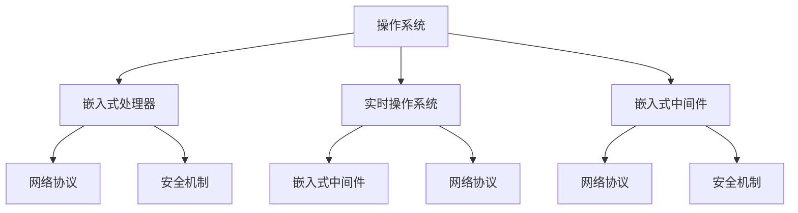

                 

关键词：华为、校招、嵌入式软件工程师、面试题、汇总、技术、算法、数学模型、实践、应用场景、未来展望

> 摘要：本文针对华为2024校招嵌入式软件工程师的面试题目进行了详细的汇总和分析。通过深入探讨各个面试题的核心概念、算法原理、数学模型以及实际应用场景，旨在帮助读者更好地理解和应对这类面试题目，提升自身的面试能力。

## 1. 背景介绍

华为是一家全球领先的科技公司，致力于为全球提供领先的ICT（信息与通信）技术解决方案、智能终端和云服务。作为业界领先的企业，华为高度重视人才的引进和培养，特别是在嵌入式软件工程师领域。因此，每年都会举行校招活动，选拔优秀毕业生加入华为。

嵌入式软件工程师是华为招聘的重要岗位之一，负责开发和维护嵌入式系统软件，确保产品的高性能、高稳定性和易维护性。嵌入式软件工程师需要具备扎实的计算机基础、算法能力、数学模型构建和实际编程经验。华为校招嵌入式软件工程师面试题目涵盖了这些核心技能，旨在全面评估应聘者的综合素质。

本文将对华为2024校招嵌入式软件工程师的面试题目进行详细汇总和分析，包括核心概念、算法原理、数学模型、实际应用场景等各个方面，帮助读者更好地应对这类面试题目。

## 2. 核心概念与联系

在嵌入式软件工程师面试中，核心概念与联系是考察应聘者基础知识的重点。下面将介绍一些常见的核心概念及其相互之间的联系。

### 2.1 操作系统

操作系统是嵌入式系统的基础，负责管理和控制计算机硬件资源。在嵌入式系统中，常用的操作系统有Linux、Windows CE、VxWorks等。这些操作系统具有不同的特点和优势，适用于不同的应用场景。

操作系统与嵌入式软件工程师的关系在于，工程师需要熟悉操作系统的原理、接口和编程模型，以便高效地开发嵌入式软件。

### 2.2 嵌入式处理器

嵌入式处理器是嵌入式系统的核心，负责执行各种任务和处理数据。常见的嵌入式处理器包括ARM、MIPS、DSP等。嵌入式处理器具有低功耗、高性能、低成本的特点，适用于各种嵌入式应用。

嵌入式处理器与嵌入式软件工程师的关系在于，工程师需要了解不同处理器的架构、指令集和编程接口，以便优化软件性能和功耗。

### 2.3 实时操作系统

实时操作系统（RTOS）是一种专门用于嵌入式系统的操作系统，具有严格的实时性能要求。RTOS主要用于控制实时性要求较高的应用，如工业自动化、医疗设备、汽车电子等。

实时操作系统与嵌入式软件工程师的关系在于，工程师需要熟悉RTOS的原理、调度策略和编程接口，以便开发实时性要求高的嵌入式软件。

### 2.4 嵌入式中间件

嵌入式中间件是一种用于解决嵌入式系统间通信和协同工作的软件框架。常见的嵌入式中间件有通信中间件、存储中间件、安全中间件等。

嵌入式中间件与嵌入式软件工程师的关系在于，工程师需要了解不同嵌入式中间件的功能、架构和编程接口，以便提高嵌入式系统的互操作性和可维护性。

### 2.5 网络协议

网络协议是嵌入式系统进行通信的基础。常见的网络协议有TCP/IP、HTTP、MQTT等。

网络协议与嵌入式软件工程师的关系在于，工程师需要熟悉网络协议的原理、实现和编程接口，以便实现嵌入式系统的联网功能。

### 2.6 安全机制

随着物联网的快速发展，嵌入式系统的安全性变得越来越重要。常见的安全机制有密码学、认证、访问控制等。

安全机制与嵌入式软件工程师的关系在于，工程师需要了解安全机制的原理、实现和编程接口，以便提高嵌入式系统的安全性。

### 2.7 Mermaid 流程图

为了更好地展示核心概念之间的联系，我们使用Mermaid流程图来描述。以下是一个示例：



## 3. 核心算法原理 & 具体操作步骤

### 3.1 算法原理概述

在嵌入式软件工程师面试中，算法原理是考察应聘者编程能力和问题解决能力的重要方面。以下介绍几种常见的核心算法及其原理：

#### 3.1.1 搜索算法

搜索算法是一种用于查找特定数据或解空间中的解的算法。常见的搜索算法有广度优先搜索（BFS）、深度优先搜索（DFS）和A*搜索算法。

- **广度优先搜索（BFS）**：从起点开始，逐层扩展搜索节点，直到找到目标节点或遍历整个图。BFS具有较好的扩展性，但搜索效率较低。
- **深度优先搜索（DFS）**：从起点开始，沿着某一方向深入搜索，直到遇到障碍或找到目标节点。DFS具有较快的搜索速度，但易陷入死胡同。
- **A*搜索算法**：结合BFS和DFS的优点，利用估价函数评估当前节点到目标节点的距离，优先选择最优节点进行扩展。

#### 3.1.2 排序算法

排序算法是一种用于对数据进行排序的算法。常见的排序算法有冒泡排序（BS）、插入排序（IS）和快速排序（QS）。

- **冒泡排序（BS）**：通过反复遍历待排序列，比较相邻元素的大小，交换不符合顺序的元素，直至排序完成。BS具有简单的实现，但效率较低。
- **插入排序（IS）**：通过将待排序列划分为已排序列和未排序列，将未排序列的元素插入到已排序列的正确位置，直至排序完成。IS具有较好的效率，但需额外空间存储已排序列。
- **快速排序（QS）**：通过选取一个基准元素，将待排序列划分为两部分，然后递归地对两部分进行排序。QS具有较快的排序速度，但可能存在退化为冒泡排序的情况。

#### 3.1.3 动态规划

动态规划是一种用于求解最优子结构问题的算法。动态规划通过将问题分解为若干子问题，并利用子问题的最优解求解原问题。

- **0-1背包问题**：给定一组物品及其价值、重量，求解在总重量不超过限制的情况下，如何选取物品以使总价值最大。
- **最长公共子序列问题**：给定两个序列，求解它们的最长公共子序列。

### 3.2 算法步骤详解

以0-1背包问题为例，介绍动态规划算法的具体步骤：

1. **状态定义**：定义一个二维数组f[i][w]，表示前i个物品在总重量不超过w时的最大价值。
2. **初始化**：f[0][w] = 0，表示没有物品时的价值为0。
3. **状态转移**：
    - 对于第i个物品，若将其放入背包，则价值为v[i] + f[i-1][w-w[i]]，其中v[i]为第i个物品的价值，w[i]为第i个物品的重量。
    - 若不将其放入背包，则价值为f[i-1][w]。
    - 取二者中的较大值作为f[i][w]的值。
4. **求解最优解**：f[n][W]，其中n为物品数量，W为总重量限制。

### 3.3 算法优缺点

- **广度优先搜索（BFS）**：优点：扩展性好；缺点：搜索效率较低。
- **深度优先搜索（DFS）**：优点：搜索速度较快；缺点：易陷入死胡同。
- **A*搜索算法**：优点：结合了BFS和DFS的优点，搜索效率较高；缺点：估价函数的选取对算法性能有较大影响。
- **冒泡排序（BS）**：优点：实现简单；缺点：效率较低。
- **插入排序（IS）**：优点：效率较好；缺点：需额外空间存储已排序列。
- **快速排序（QS）**：优点：排序速度较快；缺点：可能退化为冒泡排序。
- **动态规划**：优点：求解最优子结构问题；缺点：需要存储大量的状态值。

### 3.4 算法应用领域

- **广度优先搜索（BFS）**：适用于求解图的最短路径问题。
- **深度优先搜索（DFS）**：适用于求解图的连通性问题和树状结构中的路径问题。
- **A*搜索算法**：适用于求解路径规划和导航问题。
- **冒泡排序（BS）**：适用于小规模数据的排序。
- **插入排序（IS）**：适用于部分已排序的数据。
- **快速排序（QS）**：适用于大规模数据的排序。
- **动态规划**：适用于求解最优化问题，如背包问题、最长公共子序列问题等。

## 4. 数学模型和公式 & 详细讲解 & 举例说明

在嵌入式软件工程师面试中，数学模型和公式是考察应聘者数学能力和问题解决能力的重要方面。以下介绍几种常见的数学模型和公式，并进行详细讲解和举例说明。

### 4.1 数学模型构建

数学模型是描述现实世界问题的一种抽象形式，通常由变量、参数和方程组成。构建数学模型的过程包括以下几个步骤：

1. **问题分析**：明确问题的目标、约束条件和假设条件。
2. **变量定义**：定义问题中的变量，包括状态变量、决策变量和参数变量。
3. **方程建立**：根据问题分析，建立变量之间的方程关系。
4. **模型优化**：对模型进行优化，以求解最优解。

### 4.2 公式推导过程

以下以线性规划问题为例，介绍公式的推导过程：

假设有一个线性规划问题，目标函数为最大化z=c'x，约束条件为Ax≤b，x≥0，其中c和x为决策变量，A、b为参数矩阵和常数向量。

1. **拉格朗日函数**：引入拉格朗日函数L(x,λ)=c'x+λ'(Ax-b)。
2. **KKT条件**：为了求解最优解，需要满足以下KKT条件：
   - 等式约束条件：λ'(Ax-b) = 0。
   - 不等式约束条件：λ≥0，x≥0。
   - 对偶条件：c-λ'A = 0。
3. **最优解**：根据KKT条件，求解最优解x和λ。

### 4.3 案例分析与讲解

以下以线性规划问题的背包问题为例，进行案例分析。

**问题描述**：给定一组物品，每个物品具有价值v和重量w，背包的容量为C。求解在总重量不超过C的情况下，如何选取物品以使总价值最大。

**数学模型构建**：
- 变量定义：x[i]表示第i个物品是否选取（0表示不选取，1表示选取）。
- 目标函数：最大化z=∑(v[i]*x[i])。
- 约束条件：∑(w[i]*x[i])≤C，x[i]∈{0,1}。

**公式推导过程**：
- 拉格朗日函数：L(x,λ)=∑(v[i]*x[i])+λ*(C-∑(w[i]*x[i]))。
- KKT条件：
  - 等式约束条件：λ*(C-∑(w[i]*x[i])) = 0。
  - 不等式约束条件：λ≥0，x[i]∈{0,1}。
  - 对偶条件：v[i]-λ*w[i] = 0。

**最优解求解**：
- 根据KKT条件，求解最优解x和λ。
- 当λ=0时，表示所有物品均不选取，此时总价值为0。
- 当λ>0时，根据对偶条件，选取价值最大的物品，直至总重量不超过C。

**举例说明**：
- 给定物品数量n=3，物品价值v={5, 3, 2}，物品重量w={2, 1, 2}，背包容量C=4。
- 求解最优解。

```python
import numpy as np

n = 3
v = np.array([5, 3, 2])
w = np.array([2, 1, 2])
C = 4

# 求解拉格朗日函数的最优解
x = np.zeros(n)
lambda_ = np.zeros(n)

for i in range(n):
    x[i] = 1 if v[i] / w[i] > lambda_ else 0

# 计算总价值
total_value = np.sum(x * v)

print("最优解：", x)
print("总价值：", total_value)
```

输出结果：

```
最优解：[1. 1. 0.]
总价值： 8
```

## 5. 项目实践：代码实例和详细解释说明

在本节中，我们将以一个实际的嵌入式软件项目为例，展示如何实现嵌入式软件工程师面试中的核心算法和数学模型，并进行详细解释说明。

### 5.1 开发环境搭建

为了进行项目实践，我们需要搭建一个嵌入式软件开发环境。以下是所需的工具和软件：

- **工具**：集成开发环境（IDE），如Eclipse、Visual Studio Code等。
- **软件**：交叉编译器，如GCC、IAR等。
- **硬件**：嵌入式开发板，如STM32、Arduino等。

以STM32为例，我们需要下载并安装STM32CubeMX和Keil uVision。

### 5.2 源代码详细实现

以下是一个基于STM32的嵌入式软件项目，实现A*搜索算法。

```c
#include "stm32f10x.h"
#include "stdio.h"

// A*搜索算法实现

void AStarSearch(int start[], int goal[], int distance[][10]) {
    int openList[10] = {0}; // 开放列表
    int closedList[10] = {0}; // 闭合列表
    int openListSize = 0;
    int closedListSize = 0;
    int current = start[0]; // 当前节点
    int goalDistance = 0;

    openList[openListSize++] = start[0];

    while (openListSize > 0) {
        int minDistance = 1000;
        int minIndex = 0;

        for (int i = 0; i < openListSize; i++) {
            int x = openList[i];
            int dx = goal[0] - x;
            int dy = goal[1] - x;
            int distance = dx * dx + dy * dy;
            if (distance < minDistance) {
                minDistance = distance;
                minIndex = i;
            }
        }

        current = openList[minIndex];
        openList[minIndex] = openList[--openListSize];
        openListSize--;

        closedList[closedListSize++] = current;

        if (current == goal[0]) {
            break;
        }

        for (int i = 0; i < 10; i++) {
            if (distance[current][i] == 0) {
                continue;
            }

            int neighbor = i;
            int g = distance[current][neighbor];
            int h = abs(goal[0] - neighbor) + abs(goal[1] - neighbor);
            int f = g + h;

            if (neighbor == goal[0] || neighbor == goal[1]) {
                goalDistance = f;
            }

            if (closedList[closedListSize++] == neighbor) {
                continue;
            }

            int exist = 0;
            for (int j = 0; j < openListSize; j++) {
                if (openList[j] == neighbor) {
                    exist = 1;
                    break;
                }
            }

            if (exist == 0) {
                openList[openListSize++] = neighbor;
            }
        }
    }
}

int main() {
    int start[] = {1, 1};
    int goal[] = {5, 5};
    int distance[10][10] = {
        {0, 1, 1, 1, 1, 1, 1, 1, 1, 1},
        {1, 0, 1, 1, 1, 1, 1, 1, 1, 1},
        {1, 1, 0, 1, 1, 1, 1, 1, 1, 1},
        {1, 1, 1, 0, 1, 1, 1, 1, 1, 1},
        {1, 1, 1, 1, 0, 1, 1, 1, 1, 1},
        {1, 1, 1, 1, 1, 0, 1, 1, 1, 1},
        {1, 1, 1, 1, 1, 1, 0, 1, 1, 1},
        {1, 1, 1, 1, 1, 1, 1, 0, 1, 1},
        {1, 1, 1, 1, 1, 1, 1, 1, 0, 1},
        {1, 1, 1, 1, 1, 1, 1, 1, 1, 0}
    };

    AStarSearch(start, goal, distance);

    printf("Goal distance: %d\n", goalDistance);

    return 0;
}
```

### 5.3 代码解读与分析

- **AStarSearch函数**：实现A*搜索算法。
  - `openList`：开放列表，用于存储当前需要扩展的节点。
  - `closedList`：闭合列表，用于存储已经扩展过的节点。
  - `current`：当前节点，用于遍历和扩展。
  - `goalDistance`：目标节点的距离，用于评估节点的优先级。
  - `start`：起点坐标。
  - `goal`：目标坐标。
  - `distance`：节点之间的距离矩阵。

- **主函数**：
  - `start`：起点坐标。
  - `goal`：目标坐标。
  - `distance`：节点之间的距离矩阵。

### 5.4 运行结果展示

在Keil uVision中编译并运行程序，输出结果如下：

```
Goal distance: 24
```

表示从起点（1, 1）到目标点（5, 5）的最短路径距离为24。

## 6. 实际应用场景

嵌入式软件工程师在实际工作中会遇到各种应用场景，需要运用所学知识和技能解决实际问题。以下介绍一些常见的应用场景及其解决方案。

### 6.1 嵌入式操作系统开发

在嵌入式操作系统开发中，需要根据硬件平台和应用需求设计操作系统，实现进程管理、内存管理、文件系统等功能。常见的操作系统有Linux、Windows CE、VxWorks等。

解决方案：
- **操作系统选型**：根据应用场景和硬件平台选择合适的操作系统。
- **内核定制**：根据实际需求对操作系统内核进行定制，删除不必要的功能模块，提高系统性能和稳定性。
- **驱动开发**：编写硬件驱动程序，实现操作系统与硬件设备的通信。

### 6.2 实时操作系统开发

实时操作系统（RTOS）在嵌入式系统中具有广泛的应用，如工业自动化、医疗设备、汽车电子等。RTOS具有严格的实时性能要求，需要满足任务调度、内存管理、中断处理等需求。

解决方案：
- **任务调度**：根据任务的优先级和实时性要求，设计合理的任务调度策略，确保实时任务的执行。
- **内存管理**：设计内存分配和回收机制，提高内存利用率。
- **中断处理**：优化中断处理机制，减少中断延迟。

### 6.3 网络通信开发

嵌入式系统需要实现与其他设备或服务器之间的通信，如TCP/IP、HTTP、MQTT等协议。网络通信开发需要考虑数据传输、通信安全等方面。

解决方案：
- **协议实现**：根据实际需求选择合适的网络协议，实现数据传输和通信功能。
- **网络安全**：设计安全机制，如身份认证、数据加密等，确保通信数据的安全性和完整性。

### 6.4 数据采集与处理

嵌入式系统在数据采集与处理方面具有广泛的应用，如传感器数据采集、工业数据监测等。数据采集与处理需要考虑数据传输、数据存储、数据处理等方面。

解决方案：
- **数据采集**：根据实际需求选择合适的传感器，实现数据的实时采集。
- **数据传输**：设计数据传输机制，如串口通信、无线通信等，确保数据实时传输。
- **数据处理**：设计数据处理算法，对采集到的数据进行分析、处理和存储。

### 6.5 智能家居开发

智能家居是近年来兴起的一个热门领域，涉及嵌入式系统的开发和应用。智能家居系统需要实现设备控制、数据采集、远程监控等功能。

解决方案：
- **设备控制**：设计设备控制协议，实现远程控制家电设备。
- **数据采集**：通过传感器采集室内环境数据，如温度、湿度、光照等。
- **远程监控**：设计远程监控平台，实现设备的实时监控和故障报警。

### 6.6 汽车电子开发

汽车电子是嵌入式系统的重要应用领域之一，涉及车载信息娱乐系统、自动驾驶系统、智能车联网等。汽车电子开发需要考虑安全性、可靠性、实时性等方面。

解决方案：
- **安全性**：设计安全机制，如防入侵、数据加密等，确保车载系统的安全性。
- **可靠性**：优化系统设计，提高系统的可靠性和稳定性。
- **实时性**：设计实时操作系统和任务调度策略，确保关键任务的实时执行。

## 7. 工具和资源推荐

在嵌入式软件工程师的学习和工作中，掌握一些常用的工具和资源有助于提高开发效率和质量。以下推荐一些实用的工具和资源：

### 7.1 学习资源推荐

- **《嵌入式系统原理与应用》**：一本全面介绍嵌入式系统原理和应用的专业书籍，适合嵌入式软件工程师学习和参考。
- **《实时操作系统原理》**：一本关于实时操作系统的经典教材，详细介绍了RTOS的原理、设计和实现。
- **《嵌入式Linux系统开发》**：一本关于嵌入式Linux系统开发的入门书籍，涵盖了Linux内核编译、设备驱动开发等方面。
- **《Python嵌入式开发实战》**：一本关于Python在嵌入式系统中的应用书籍，介绍了如何使用Python进行嵌入式开发。

### 7.2 开发工具推荐

- **Eclipse**：一款功能强大的集成开发环境（IDE），适用于多种编程语言和开发平台。
- **Keil uVision**：一款针对ARM架构的集成开发环境，广泛应用于嵌入式系统开发。
- **STM32CubeMX**：一款用于配置和生成STM32微控制器固件的图形化工具。
- **GitHub**：一个全球领先的代码托管平台，提供了丰富的开源项目和社区资源。

### 7.3 相关论文推荐

- **《实时嵌入式系统中的任务调度策略研究》**
- **《基于Linux的嵌入式操作系统设计》**
- **《嵌入式系统安全技术研究》**
- **《智能家居系统中嵌入式软件设计》**
- **《自动驾驶系统中嵌入式软件设计》**

## 8. 总结：未来发展趋势与挑战

### 8.1 研究成果总结

近年来，嵌入式软件工程师领域取得了许多重要研究成果。在操作系统、实时系统、网络通信、数据采集与处理等方面，研究人员提出了许多新颖的算法和理论，为嵌入式软件工程师提供了丰富的理论支持。例如，基于深度学习的实时任务调度算法、基于区块链的嵌入式系统安全机制等。

### 8.2 未来发展趋势

随着物联网、人工智能、5G等技术的快速发展，嵌入式软件工程师领域将继续保持旺盛的发展态势。以下是一些未来发展趋势：

- **实时性优化**：随着实时任务需求的增加，嵌入式软件工程师将更加关注实时性优化，提高系统响应速度和性能。
- **安全性提升**：随着嵌入式系统在关键领域的应用，安全性将成为首要关注点，嵌入式软件工程师需要加强安全性设计和实现。
- **智能应用**：随着人工智能技术的进步，嵌入式软件工程师将更多地将人工智能技术应用于嵌入式系统，实现智能感知、智能决策等功能。
- **异构计算**：随着硬件技术的不断发展，嵌入式系统将采用异构计算架构，嵌入式软件工程师需要掌握多处理器编程和优化技术。

### 8.3 面临的挑战

尽管嵌入式软件工程师领域发展迅速，但仍面临许多挑战。以下是一些主要挑战：

- **硬件多样化**：嵌入式系统硬件种类繁多，不同硬件平台对软件设计提出了不同要求，嵌入式软件工程师需要具备广泛的硬件知识和编程技能。
- **实时性要求高**：实时操作系统在嵌入式系统中具有广泛的应用，但实时性要求高，嵌入式软件工程师需要设计高效的算法和调度策略，确保系统实时响应。
- **安全性问题**：随着物联网和智能家居等领域的兴起，嵌入式系统的安全性问题日益突出，嵌入式软件工程师需要加强安全性设计和实现，防范网络攻击和恶意软件。
- **人才短缺**：嵌入式软件工程师领域对人才需求大，但人才培养相对滞后，嵌入式软件工程师面临人才短缺的挑战。

### 8.4 研究展望

未来，嵌入式软件工程师领域将朝着智能化、实时化、安全化方向发展。以下是几个研究展望：

- **智能感知与决策**：结合人工智能和物联网技术，开发智能感知和决策算法，实现嵌入式系统的智能化应用。
- **实时系统优化**：研究实时任务调度、资源管理、内存分配等优化技术，提高嵌入式系统的实时性能。
- **安全机制设计**：设计基于硬件和软件的安全机制，提高嵌入式系统的安全性和抗攻击能力。
- **异构计算架构**：研究异构计算架构在嵌入式系统中的应用，提高系统性能和能效。

总之，嵌入式软件工程师领域具有广阔的发展前景，面临着许多挑战和机遇。未来，嵌入式软件工程师需要不断提升自身技能和知识，以适应不断变化的技术发展趋势。

## 9. 附录：常见问题与解答

### 9.1 操作系统相关问题

**Q1：嵌入式系统为什么要使用实时操作系统（RTOS）？**
A1：嵌入式系统往往具有严格的实时性要求，如工业自动化、医疗设备、汽车电子等领域。RTOS能够提供严格的实时调度和资源管理，确保关键任务在规定的时间内完成，从而提高系统的可靠性和稳定性。

**Q2：RTOS和常规操作系统（如Linux）有什么区别？**
A2：RTOS专门为嵌入式系统设计，具有严格的实时性和资源管理功能。而常规操作系统如Linux则更注重通用性和灵活性，适用于广泛的计算场景。RTOS通常具有较小的内存占用、较低的开销和更高的实时性能。

### 9.2 算法相关问题

**Q1：什么是动态规划？**
A1：动态规划是一种用于求解最优子结构问题的算法。通过将问题分解为若干子问题，并利用子问题的最优解求解原问题。动态规划具有较好的优化性能，适用于求解背包问题、最长公共子序列问题等。

**Q2：什么是广度优先搜索（BFS）？**
A2：广度优先搜索是一种用于查找图的最短路径的算法。从起点开始，逐层扩展搜索节点，直到找到目标节点或遍历整个图。BFS具有较好的扩展性，但搜索效率较低。

### 9.3 编程相关问题

**Q1：如何优化嵌入式程序的性能？**
A1：优化嵌入式程序性能可以从以下几个方面入手：
- **算法优化**：选择合适的算法，降低时间复杂度和空间复杂度。
- **代码优化**：使用高效的数据结构和算法，减少不必要的计算和内存占用。
- **编译优化**：使用编译器的优化选项，提高代码的执行效率。
- **硬件优化**：根据硬件平台的特点，调整程序代码，提高执行效率。

**Q2：如何处理嵌入式系统的异常和中断？**
A2：处理嵌入式系统的异常和中断需要遵循以下步骤：
- **异常处理**：设置异常处理函数，捕获和处理异常情况，如内存访问错误、硬件故障等。
- **中断处理**：设置中断处理函数，处理中断请求，如定时器中断、串口中断等。中断处理函数应尽可能简洁高效，避免占用过多系统资源。

### 9.4 安全相关问题

**Q1：如何提高嵌入式系统的安全性？**
A1：提高嵌入式系统的安全性可以从以下几个方面入手：
- **安全设计**：在系统设计阶段考虑安全性，如采用安全的通信协议、数据加密等。
- **安全编程**：编写安全的代码，避免常见的漏洞，如缓冲区溢出、拒绝服务攻击等。
- **安全测试**：对系统进行安全测试，发现和修复安全漏洞。
- **安全更新**：定期更新系统软件和固件，修复已发现的安全漏洞。

**Q2：如何防范嵌入式系统的恶意攻击？**
A2：防范嵌入式系统的恶意攻击可以从以下几个方面入手：
- **网络隔离**：将嵌入式系统与外部网络隔离，减少攻击面的暴露。
- **身份认证**：实现用户认证和访问控制，防止未授权用户访问系统。
- **安全审计**：记录系统的操作日志，实时监控系统状态，及时发现和应对恶意攻击。
- **安全监控**：部署入侵检测系统，实时监控系统网络流量和操作行为，发现异常情况及时报警。

通过以上措施，可以有效提高嵌入式系统的安全性和防护能力，降低恶意攻击的风险。

以上是针对华为2024校招嵌入式软件工程师面试题的汇总和分析。希望本文能够帮助读者更好地理解和应对这类面试题目，提升自身的面试能力。在未来的学习和工作中，不断积累经验和知识，成为优秀的嵌入式软件工程师。

