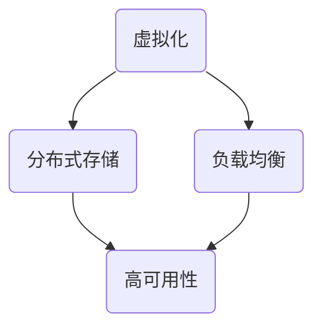

                 

 **关键词：**华为面试，云计算，社招，面试题，解析，工程师

**摘要：**本文将深入解析华为2025社招云计算工程师面试题，涵盖核心概念、算法原理、数学模型、项目实践等多个方面，为读者提供全面的面试准备和参考。

## 1. 背景介绍

随着云计算技术的快速发展，云计算工程师在IT行业的需求日益增长。华为作为全球领先的ICT（信息与通信技术）解决方案提供商，其社招云计算工程师面试题具有很高的参考价值。本文将围绕华为2025社招云计算工程师面试题，进行详细解析，帮助读者更好地准备面试。

## 2. 核心概念与联系

在云计算领域，核心概念包括但不限于虚拟化、分布式存储、负载均衡等。下面通过Mermaid流程图展示这些核心概念之间的联系。



### 2.1 虚拟化

虚拟化是云计算的核心技术之一，它将物理资源抽象成虚拟资源，实现资源的灵活分配和管理。

### 2.2 分布式存储

分布式存储是一种通过多个节点存储数据的技术，具有高可用性、高扩展性等特点。

### 2.3 负载均衡

负载均衡通过将请求分配到多个节点，实现流量的均衡，提高系统的处理能力。

### 2.4 高可用性

高可用性是指系统在遇到故障时能够快速恢复，确保服务的持续运行。

## 3. 核心算法原理 & 具体操作步骤

### 3.1 算法原理概述

云计算工程师需要掌握的核心算法包括但不限于负载均衡算法、分布式一致性算法等。

### 3.2 算法步骤详解

以负载均衡算法为例，其基本步骤如下：

1. 收集节点状态信息。
2. 根据节点状态计算负载。
3. 选择负载最小的节点处理请求。

### 3.3 算法优缺点

负载均衡算法的优点在于能够提高系统性能，缺点在于可能引入额外的网络开销。

### 3.4 算法应用领域

负载均衡算法广泛应用于Web服务、数据库服务等场景。

## 4. 数学模型和公式 & 详细讲解 & 举例说明

在云计算领域，数学模型和公式在资源分配、负载预测等方面具有重要意义。

### 4.1 数学模型构建

假设有N个节点，每个节点的处理能力为C，请求量为R，则负载均衡公式为：

$$
L = \frac{R}{N \times C}
$$

### 4.2 公式推导过程

推导过程如下：

$$
L = \frac{R}{N \times C} = \frac{R}{N \times (C_1 + C_2 + ... + C_N)}
$$

其中，$C_1, C_2, ..., C_N$ 为各个节点的处理能力。

### 4.3 案例分析与讲解

以一个具体的案例进行说明：

假设有3个节点，节点1的处理能力为10，节点2的处理能力为20，节点3的处理能力为30。请求量为100。

$$
L = \frac{100}{3 \times (10 + 20 + 30)} = \frac{100}{3 \times 60} = \frac{1}{18}
$$

即平均每个节点的负载为$\frac{1}{18}$。

## 5. 项目实践：代码实例和详细解释说明

### 5.1 开发环境搭建

搭建一个简单的负载均衡器，需要环境如下：

- Python 3.x
- Flask

### 5.2 源代码详细实现

以下是一个简单的负载均衡器代码实例：

```python
from flask import Flask, request, jsonify

app = Flask(__name__)

# 假设节点状态信息
nodes = {
    'node1': {'status': 'active', 'load': 0},
    'node2': {'status': 'active', 'load': 0},
    'node3': {'status': 'active', 'load': 0}
}

def select_node():
    min_load = float('inf')
    selected_node = None
    for node, info in nodes.items():
        if info['load'] < min_load and info['status'] == 'active':
            min_load = info['load']
            selected_node = node
    return selected_node

@app.route('/balance', methods=['POST'])
def balance():
    request_data = request.json
    node = select_node()
    if node:
        nodes[node]['load'] += 1
        return jsonify({'node': node})
    else:
        return jsonify({'error': 'no available nodes'})

if __name__ == '__main__':
    app.run()
```

### 5.3 代码解读与分析

- 代码中定义了一个简单的负载均衡器，通过选择负载最小的节点处理请求。
- `nodes` 字典存储了节点的状态信息，包括状态和负载。
- `select_node` 函数根据节点的状态和负载选择负载最小的节点。
- `balance` 函数处理POST请求，选择节点并将负载加1。

### 5.4 运行结果展示

运行代码后，可以使用以下命令发送POST请求：

```bash
curl -X POST -H "Content-Type: application/json" -d '{"data": "your_data"}' http://localhost:5000/balance
```

响应结果为选择到的节点名称。

## 6. 实际应用场景

云计算工程师在实际工作中，需要面对各种复杂的业务场景。例如，在大型分布式系统中，如何进行负载均衡、数据备份、故障恢复等，都是重要的应用场景。

## 7. 工具和资源推荐

### 7.1 学习资源推荐

- 《深入理解云计算》
- 《分布式系统原理与范型》
- 《Docker实战》

### 7.2 开发工具推荐

- Docker
- Kubernetes
- Jenkins

### 7.3 相关论文推荐

- 《大规模分布式存储系统：设计、管理和应用》
- 《基于云计算的负载均衡技术研究》

## 8. 总结：未来发展趋势与挑战

云计算技术将继续快速发展，为各行各业带来更多创新机会。然而，也面临着数据安全、隐私保护、跨平台兼容性等挑战。

## 9. 附录：常见问题与解答

### 问题1：什么是云计算？

**解答：**云计算是一种通过网络提供可伸缩的、弹性计算资源的服务模式，用户可以根据需求随时获取资源。

### 问题2：云计算有哪些优势？

**解答：**云计算具有资源弹性、成本优化、高可用性、易于管理等优势。

### 问题3：云计算有哪些挑战？

**解答：**云计算面临数据安全、隐私保护、跨平台兼容性等挑战。

---

作者：禅与计算机程序设计艺术 / Zen and the Art of Computer Programming

