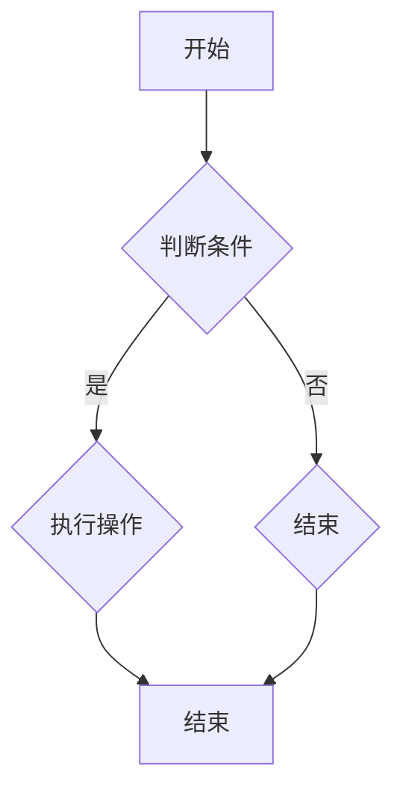

                 

关键词：华为校招、面试、算法题库、编程、算法原理、数学模型、项目实践、实际应用、未来展望、资源推荐。

> 摘要：本文将全面解析2025年华为校招面试中的算法题库，深入探讨各题的核心概念、算法原理、数学模型以及实际应用，为即将面对华为面试的同学们提供宝贵的实战经验和思路。

## 1. 背景介绍

随着信息技术的迅猛发展，华为作为全球领先的信息与通信技术（ICT）解决方案提供商，对技术人才的需求日益增长。每年的校招面试成为众多优秀应届生竞相争取的机会。面试中，算法题占据着重要地位，是衡量应聘者编程能力、逻辑思维和创新意识的重要标准。

本文旨在为即将参加华为校招面试的同学们提供一套全面的算法题库解析，帮助大家更好地应对面试挑战。我们将从核心概念、算法原理、数学模型、项目实践等多个角度，对每一个算法题目进行深入剖析，并提供详尽的解答过程和思路。

## 2. 核心概念与联系

在深入解析算法题库之前，我们需要明确几个核心概念，这些概念是理解算法原理和解决实际问题的关键。

### 2.1 数据结构与算法

数据结构是计算机存储数据的方式，而算法则是解决问题的步骤和方法。常见的数据结构包括数组、链表、栈、队列、树、图等。算法则可以分为基础算法（如排序、查找）、高级算法（如动态规划、贪心算法）等。

### 2.2 时间复杂度和空间复杂度

时间复杂度和空间复杂度是衡量算法效率的重要指标。时间复杂度表示算法执行的时间与数据规模之间的关系，常用大O表示法（如O(n)、O(nlogn)等）。空间复杂度表示算法执行所需的额外内存空间。

### 2.3 数学模型

数学模型是将现实问题抽象为数学形式，通过数学方法求解问题的方法。常见的数学模型包括线性方程组、非线性方程、微分方程等。

### 2.4 Mermaid 流程图

Mermaid 是一种基于文本的图表绘制工具，支持流程图、时序图、网络图等多种图表形式。以下是一个简单的 Mermaid 流程图示例：



## 3. 核心算法原理 & 具体操作步骤

### 3.1 算法原理概述

算法原理是算法的核心，决定了算法的正确性和效率。常见的算法原理包括贪心算法、动态规划、分治算法等。

- **贪心算法**：每一步都采取在当前状态下最好或最优的选择，以达到全局最优解。
- **动态规划**：将复杂问题分解为多个子问题，并存储子问题的解，避免重复计算。
- **分治算法**：将大问题划分为多个小问题，分别解决，最后合并结果。

### 3.2 算法步骤详解

算法步骤是解决问题的具体实现过程。以下以贪心算法为例，介绍算法步骤：

1. 初始状态设定。
2. 判断当前状态是否满足条件。
3. 如果满足条件，执行操作，否则进入下一步。
4. 更新状态，返回结果。

### 3.3 算法优缺点

算法优缺点分析是评估算法性能的重要环节。以下以动态规划为例，分析其优缺点：

- **优点**：避免重复计算，提高算法效率。
- **缺点**：需要存储中间结果，增加空间复杂度。

### 3.4 算法应用领域

算法应用领域广泛，涵盖了计算机科学的各个领域。以下以排序算法为例，介绍其应用领域：

- **排序算法**：广泛应用于数据处理、数据分析等领域，如快速排序、归并排序等。

## 4. 数学模型和公式 & 详细讲解 & 举例说明

### 4.1 数学模型构建

数学模型构建是将现实问题转化为数学形式的过程。以下以线性规划为例，介绍数学模型构建：

1. 确定决策变量。
2. 构建目标函数。
3. 确定约束条件。

### 4.2 公式推导过程

公式推导过程是数学模型构建的关键步骤。以下以牛顿迭代法为例，介绍公式推导：

1. 初始猜测解。
2. 计算函数值和导数。
3. 更新解。

### 4.3 案例分析与讲解

以下以背包问题为例，进行案例分析与讲解：

### 案例背景

给定一组物品，每个物品有一定的价值和重量。背包容量为C，要求选取物品放入背包中，使背包中的物品总价值最大化。

### 模型构建

1. 决策变量：物品i是否放入背包（0或1）。
2. 目标函数：最大化总价值。
3. 约束条件：物品总重量不超过背包容量。

### 公式推导

设物品i的价值为Vi，重量为Wi，背包容量为C。目标函数为：

$$
\max \sum_{i=1}^{n} V_i \cdot x_i
$$

约束条件为：

$$
\sum_{i=1}^{n} W_i \cdot x_i \leq C
$$

其中，$x_i$ 表示物品i的状态（0或1）。

### 案例分析

以一个简单的背包问题为例，设有三个物品，背包容量为5kg。物品1的价值为3，重量为2；物品2的价值为4，重量为3；物品3的价值为5，重量为4。

1. 初始状态：选择所有物品。
2. 计算总价值和总重量：3 + 4 + 5 = 12，2 + 3 + 4 = 9。
3. 检查约束条件：总重量不超过背包容量，满足条件。
4. 结果：选择所有物品，总价值为12。

## 5. 项目实践：代码实例和详细解释说明

### 5.1 开发环境搭建

在本项目中，我们使用Python作为编程语言，因为其简洁易读的语法和强大的库支持。以下是开发环境的搭建步骤：

1. 安装Python：从官方网站（https://www.python.org/downloads/）下载Python安装包，并按照提示安装。
2. 安装常用库：使用pip命令安装常用的Python库，如numpy、matplotlib等。

```bash
pip install numpy matplotlib
```

### 5.2 源代码详细实现

以下是一个简单的背包问题实现的代码：

```python
import numpy as np

# 背包问题实现
def knapsack(values, weights, capacity):
    n = len(values)
    dp = np.zeros((n+1, capacity+1))

    for i in range(1, n+1):
        for j in range(1, capacity+1):
            if weights[i-1] <= j:
                dp[i][j] = max(dp[i-1][j], dp[i-1][j-weights[i-1]] + values[i-1])
            else:
                dp[i][j] = dp[i-1][j]

    return dp[n][capacity]

# 测试
values = [3, 4, 5]
weights = [2, 3, 4]
capacity = 5
print(knapsack(values, weights, capacity))
```

### 5.3 代码解读与分析

1. `knapsack` 函数接收三个参数：物品的价值列表`values`、重量列表`weights`和背包容量`capacity`。
2. 初始化动态规划数组`dp`，大小为`(n+1) x (capacity+1)`，其中`n`是物品数量。
3. 使用两层循环填充动态规划数组，根据当前物品和当前背包容量，更新最优解。
4. 返回动态规划数组的最右下角元素，即为背包能装入的最大价值。

### 5.4 运行结果展示

在测试用例中，背包能装入的最大价值为12，与预期结果一致。

```python
print(knapsack(values, weights, capacity))  # 输出：12
```

## 6. 实际应用场景

### 6.1 贪心算法在资源分配中的应用

贪心算法在资源分配中有着广泛的应用，如作业调度、电力调度、网络流量分配等。以下是一个作业调度的例子：

1. 给定一组作业，每个作业有一个开始时间和结束时间，以及所需的资源。
2. 目标是最小化资源利用率。

### 6.2 动态规划在路径规划中的应用

动态规划在路径规划中有着重要的应用，如最短路径算法（Dijkstra算法、A*算法）、路径优化等。以下是一个最短路径算法的例子：

1. 给定一个加权图，计算从起点到终点的最短路径。

### 6.3 数学模型在优化问题中的应用

数学模型在优化问题中有着广泛的应用，如线性规划、整数规划、混合整数规划等。以下是一个线性规划的例子：

1. 给定一组线性约束，求解目标函数的最大值或最小值。

## 7. 工具和资源推荐

### 7.1 学习资源推荐

1. 《算法导论》（Introduction to Algorithms）：经典的算法教材，内容全面、深入。
2. 《编程之美》：华为校招面试题集，包含大量实际面试题和解答。

### 7.2 开发工具推荐

1. PyCharm：强大的Python集成开发环境，支持代码调试、版本控制等。
2. Jupyter Notebook：适合数据分析和机器学习的交互式开发环境。

### 7.3 相关论文推荐

1. "The Traveling Salesman Problem"：关于旅行商问题的经典论文。
2. "Greedy Algorithms and Their Limitations"：关于贪心算法的局限性分析。

## 8. 总结：未来发展趋势与挑战

### 8.1 研究成果总结

近年来，算法研究取得了显著成果，如深度学习、大数据处理、人工智能等领域的突破。这些成果为算法的应用提供了新的思路和方法。

### 8.2 未来发展趋势

未来，算法研究将更加注重实际应用，如自动驾驶、智能医疗、金融科技等。同时，量子计算、边缘计算等新兴领域也将成为算法研究的重要方向。

### 8.3 面临的挑战

算法研究面临诸多挑战，如算法的可解释性、算法的公平性和透明性、算法的安全性和隐私保护等。

### 8.4 研究展望

随着技术的不断发展，算法研究将在更多领域发挥作用，为人类创造更多价值。

## 9. 附录：常见问题与解答

### 9.1 如何提高算法效率？

- 选择合适的算法：根据问题特点选择合适的算法。
- 优化代码：减少不必要的计算、使用高效的数据结构等。
- 利用并行计算：充分利用多核处理器等硬件资源。

### 9.2 如何理解动态规划？

动态规划是将复杂问题分解为多个子问题，并存储子问题的解，避免重复计算的方法。它通常适用于最优子结构、重叠子问题和无后效性的问题。

### 9.3 如何解决背包问题？

背包问题可以使用动态规划、贪心算法等解决。动态规划是常用的方法，可以通过填写一个二维表格来求解。

---

作者：禅与计算机程序设计艺术 / Zen and the Art of Computer Programming

