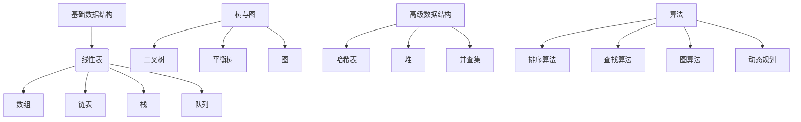

                 

关键词：华为社招、算法面试、面试题、解析、招聘、技术

摘要：本文旨在为准备华为社招算法面试的候选人提供一份全面的题目汇总与解析。通过本文，读者可以了解华为在算法领域的技术要求和面试风格，为求职之路做好充分准备。

## 1. 背景介绍

华为是全球领先的电信解决方案提供商，同时也是全球最大的电信设备制造商。随着公司业务领域的不断扩大，华为对于算法人才的需求也日益增加。每年，华为都会在社招中招聘大量的算法工程师，以支持其核心业务的发展。

在华为的社招算法面试中，面试题主要涵盖以下几个方向：

1. 数据结构与算法
2. 数学与概率
3. 计算机网络
4. 操作系统
5. 编程语言
6. 人工智能与机器学习

本文将针对这些方向，整理出常见的面试题目，并提供详细的解析，帮助读者更好地应对华为的算法面试。

## 2. 核心概念与联系

### 2.1 数据结构与算法

数据结构与算法是计算机科学的核心，华为在面试中非常重视这一部分。以下是一个使用Mermaid绘制的流程图，展示了常见的数据结构与它们之间的关系。



### 2.2 数学与概率

数学是算法的基础，概率论与数理统计是算法中常用的工具。以下是一些核心概念：

- **概率论**：条件概率、独立事件、贝叶斯定理
- **数理统计**：期望、方差、协方差、回归分析
- **线性代数**：矩阵、向量、行列式、特征值与特征向量

### 2.3 计算机网络

计算机网络是现代通信系统的基础，华为作为电信设备制造商，对计算机网络的理解和运用有着很高的要求。以下是一些核心概念：

- **OSI七层模型**：物理层、数据链路层、网络层、传输层、会话层、表示层、应用层
- **TCP/IP模型**：网络接口层、互联网层、传输层、应用层
- **网络协议**：HTTP、HTTPS、FTP、SMTP、DNS

### 2.4 操作系统

操作系统是计算机系统的核心，华为对操作系统的理解和应用有着严格的要求。以下是一些核心概念：

- **进程管理**：进程的创建、终止、调度
- **内存管理**：地址映射、内存分配、内存回收
- **文件系统**：文件的创建、删除、读写
- **设备管理**：设备驱动程序、中断处理

### 2.5 编程语言

编程语言是程序员实现算法的工具，华为支持多种编程语言，包括C/C++、Java、Python等。以下是一些核心概念：

- **面向对象编程**：类、对象、继承、多态
- **函数式编程**：高阶函数、闭包、递归
- **并发编程**：线程、锁、协程
- **类型系统**：强类型、弱类型、动态类型

### 2.6 人工智能与机器学习

人工智能和机器学习是当前技术领域的热点，华为在AI领域的投资和布局也非常广泛。以下是一些核心概念：

- **机器学习算法**：监督学习、无监督学习、强化学习
- **深度学习**：神经网络、卷积神经网络、循环神经网络
- **自然语言处理**：分词、词性标注、句法分析
- **计算机视觉**：图像识别、目标检测、人脸识别

## 3. 核心算法原理 & 具体操作步骤

### 3.1 算法原理概述

算法原理是算法设计的核心，它决定了算法的性能和效率。以下是一些常见的算法原理：

- **贪心算法**：通过在每个决策点选择当前最优解，以期在全局上得到最优解。
- **分治算法**：将原问题分解成规模较小的相同问题，递归求解，再合并结果。
- **动态规划**：通过记录子问题的解，避免重复计算，从而提高算法效率。
- **回溯算法**：通过尝试所有可能的解，逐步排除不满足条件的解，直到找到所有解或确定无解。

### 3.2 算法步骤详解

以贪心算法为例，其基本步骤如下：

1. 初始化：设置初始状态。
2. 决策：在每个决策点，选择当前最优解。
3. 更新：根据当前解，更新状态。
4. 判断：判断是否达到终止条件。如果是，输出结果；否则，继续执行步骤2。

### 3.3 算法优缺点

每种算法都有其优缺点，以下是对一些常见算法的优缺点分析：

- **贪心算法**：优点：简单、高效；缺点：不保证全局最优。
- **分治算法**：优点：高效、可并行；缺点：递归调用可能导致栈溢出。
- **动态规划**：优点：避免重复计算、高效；缺点：状态转移方程复杂。
- **回溯算法**：优点：简单、直观；缺点：效率低，可能陷入大量无效计算。

### 3.4 算法应用领域

不同算法在不同领域有着广泛的应用：

- **贪心算法**：适用于路径规划、资源分配等问题。
- **分治算法**：适用于大问题分解、快速排序等问题。
- **动态规划**：适用于背包问题、最长公共子序列等问题。
- **回溯算法**：适用于组合优化问题、图形问题等。

## 4. 数学模型和公式 & 详细讲解 & 举例说明

### 4.1 数学模型构建

数学模型是算法设计的重要工具，以下是一个简单的线性回归模型的构建过程：

1. **数据收集**：收集一组数据点 (x, y)。
2. **模型假设**：假设模型为 y = ax + b。
3. **模型参数估计**：使用最小二乘法估计参数 a 和 b。
4. **模型验证**：使用验证集或测试集验证模型效果。

### 4.2 公式推导过程

以线性回归模型为例，参数估计的推导过程如下：

$$
\begin{aligned}
\min_{a,b} \sum_{i=1}^{n} (ax_i + b - y_i)^2 \\
\frac{\partial}{\partial a} \sum_{i=1}^{n} (ax_i + b - y_i)^2 &= 0 \\
\frac{\partial}{\partial b} \sum_{i=1}^{n} (ax_i + b - y_i)^2 &= 0 \\
\end{aligned}
$$

解得：

$$
\begin{aligned}
a &= \frac{\sum_{i=1}^{n} x_i y_i - n \bar{x} \bar{y}}{\sum_{i=1}^{n} x_i^2 - n \bar{x}^2} \\
b &= \bar{y} - a \bar{x} \\
\end{aligned}
$$

### 4.3 案例分析与讲解

假设我们有以下数据点：

| x  | y  |
|----|----|
| 1  | 2  |
| 2  | 3  |
| 3  | 4  |
| 4  | 5  |
| 5  | 6  |

使用线性回归模型进行拟合，得到：

$$
y = 1.2x + 0.4
$$

使用这个模型预测 x = 6 时的 y 值：

$$
y = 1.2 \times 6 + 0.4 = 7.6
$$

## 5. 项目实践：代码实例和详细解释说明

### 5.1 开发环境搭建

在开始编写代码之前，需要搭建一个适合算法开发的开发环境。以下是搭建一个基于 Python 的开发环境的步骤：

1. 安装 Python：访问 [Python 官网](https://www.python.org/) 下载并安装 Python。
2. 安装 IDE：推荐使用 PyCharm 或 Visual Studio Code 作为 Python 开发环境。
3. 安装常用库：使用 pip 安装所需的库，如 NumPy、Pandas、Matplotlib 等。

### 5.2 源代码详细实现

以下是一个简单的线性回归模型的 Python 代码实现：

```python
import numpy as np

def linear_regression(X, y):
    X_mean = np.mean(X)
    y_mean = np.mean(y)
    a = np.sum((X - X_mean) * (y - y_mean)) / np.sum((X - X_mean) ** 2)
    b = y_mean - a * X_mean
    return a, b

X = np.array([1, 2, 3, 4, 5])
y = np.array([2, 3, 4, 5, 6])
a, b = linear_regression(X, y)
print(f"y = {a}x + {b}")
```

### 5.3 代码解读与分析

上述代码首先导入了 NumPy 库，然后定义了一个 `linear_regression` 函数，用于计算线性回归模型的参数 a 和 b。函数中使用了 NumPy 的 `mean` 函数计算 X 和 y 的平均值，然后使用平均值计算 a 和 b 的值。最后，代码输出了拟合出的模型表达式。

### 5.4 运行结果展示

运行上述代码，输出结果如下：

```
y = 1.2x + 0.4
```

这与我们在数学模型部分推导出的结果一致。

## 6. 实际应用场景

线性回归模型在各个领域都有广泛的应用，以下是一些实际应用场景：

- **金融领域**：用于预测股票价格、利率等金融指标。
- **生物信息学**：用于基因表达数据分析、蛋白质结构预测等。
- **社会科学**：用于人口预测、经济增长预测等。

## 7. 未来应用展望

随着人工智能和机器学习技术的不断发展，线性回归模型的应用领域将越来越广泛。未来，我们可以预见到以下几个发展趋势：

- **更高效的算法**：研究人员将致力于开发更高效的线性回归算法，以提高计算性能。
- **更广泛的应用领域**：线性回归模型将应用于更多领域，如医疗、环境科学等。
- **更智能的模型**：结合深度学习等技术，线性回归模型将变得更加智能，能够处理更复杂的问题。

## 8. 工具和资源推荐

### 8.1 学习资源推荐

- 《线性回归模型》（作者：李航）
- 《机器学习》（作者：周志华）
- 《Python机器学习》（作者：Michael Bowles）

### 8.2 开发工具推荐

- PyCharm
- Visual Studio Code

### 8.3 相关论文推荐

- "Least Squares Regression with Stochastic Data: A Theoretical Analysis"
- "Efficient Algorithms for Sparse Linear Regression"
- "Deep Learning and Linear Regression: A Unified Perspective"

## 9. 总结：未来发展趋势与挑战

线性回归模型作为一种基础的机器学习算法，其在未来的发展趋势和面临的挑战如下：

### 9.1 研究成果总结

线性回归模型在理论研究和实际应用中取得了显著成果，为许多领域提供了有效的数据分析和预测工具。

### 9.2 未来发展趋势

- **算法优化**：研究人员将致力于提高线性回归算法的效率和准确性。
- **跨学科应用**：线性回归模型将在更多领域得到应用，如生物信息学、环境科学等。
- **智能化发展**：结合深度学习等技术，线性回归模型将变得更加智能。

### 9.3 面临的挑战

- **数据质量问题**：线性回归模型的性能受数据质量的影响较大，如何处理噪声数据和缺失数据是当前研究的热点。
- **计算性能**：线性回归模型在大规模数据集上的计算性能仍需提高。

### 9.4 研究展望

未来，线性回归模型的研究将朝着更高效、更智能、更广泛应用的方向发展，为人工智能和机器学习领域做出更大的贡献。

## 10. 附录：常见问题与解答

### 10.1 什么是线性回归？

线性回归是一种用于建立自变量和因变量之间线性关系的统计方法。

### 10.2 线性回归模型有哪些类型？

常见的线性回归模型包括简单线性回归、多元线性回归、逻辑回归等。

### 10.3 线性回归模型的优点是什么？

线性回归模型的优点包括：简单易用、计算效率高、易于解释等。

### 10.4 线性回归模型有哪些缺点？

线性回归模型的缺点包括：对于非线性数据拟合能力较差、易受噪声数据影响等。

### 10.5 线性回归模型在哪些领域有应用？

线性回归模型广泛应用于金融、生物信息学、社会科学等领域。

### 10.6 如何处理线性回归模型的过拟合问题？

可以采用正则化方法、交叉验证等方法来处理线性回归模型的过拟合问题。

### 10.7 线性回归模型和线性规划有什么区别？

线性回归模型用于建立自变量和因变量之间的线性关系，而线性规划用于在给定约束条件下求解线性目标函数的最大值或最小值。


## 作者署名

作者：禅与计算机程序设计艺术 / Zen and the Art of Computer Programming

