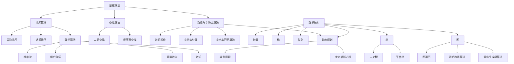
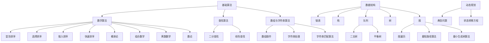

                 

2025年，随着人工智能的快速发展，华为在社招面试中，对算法题库的考查变得更加全面和深入。本文将详细解析这些算法题库，帮助读者备战华为社招面试。文章结构如下：

## 文章关键词

- 华为社招面试
- 算法题库
- 面向2025年的算法考查
- 数据结构与算法

## 文章摘要

本文将围绕华为社招面试中的算法题库进行深入探讨，涵盖数据结构与算法的核心知识点，通过具体的算法原理、操作步骤、数学模型和项目实践，帮助读者全面理解并掌握这些算法题库，为面试做好充分准备。

## 1. 背景介绍

### 1.1 华为面试算法题库的重要性

随着人工智能技术的迅速发展，算法在各个行业中的应用越来越广泛，对于技术人员，尤其是研发人员来说，算法能力显得尤为重要。华为作为中国乃至全球领先的科技公司，其社招面试中对算法题库的考查，不仅是对技术能力的检验，更是对公司文化、团队合作和创新能力的全方位评估。

### 1.2 算法题库的考查范围

华为社招面试的算法题库涉及以下领域：

- **基础算法**：如排序算法、查找算法、数组与字符串处理算法等。
- **数据结构**：如链表、栈、队列、树、图等。
- **动态规划**：解决最优化问题的重要方法。
- **图算法**：如最短路径、拓扑排序、最小生成树等。
- **数学算法**：如概率论、组合数学、离散数学等。

## 2. 核心概念与联系

为了更好地理解算法题库中的各种问题，我们需要建立核心概念与联系的基础。以下是一个使用Mermaid绘制的流程图，展示了数据结构与算法中的一些核心概念及其相互关系：



## 3. 核心算法原理 & 具体操作步骤

### 3.1 算法原理概述

算法原理是解决特定问题的计算方法。它通常由一个或多个步骤组成，每个步骤都有明确的目的和操作。算法的原理可以分为以下几类：

- **基础算法**：这类算法通常用于解决基础问题，如排序和查找。
- **数据结构算法**：这类算法依赖于特定数据结构，如链表、栈、队列、树和图。
- **动态规划**：这类算法通过将复杂问题分解成子问题，并利用状态转移方程来解决。
- **图算法**：这类算法用于解决图相关的优化问题，如图遍历、最短路径和最小生成树。
- **数学算法**：这类算法基于数学原理，如概率论、组合数学和数论。

### 3.2 算法步骤详解

以下是一个简单的排序算法——冒泡排序的步骤详解：

1. **初始化**：从第一个元素开始，比较相邻的两个元素，如果它们的顺序错误就交换它们的位置。
2. **第一轮遍历**：重复步骤1，直到没有需要交换的元素。
3. **第二轮遍历**：重复步骤1和步骤2，直到整个数组有序。

### 3.3 算法优缺点

**冒泡排序的优点**：

- 实现简单。
- 适合数据量较小的情况。

**冒泡排序的缺点**：

- 时间复杂度为O(n^2)，不适合大数据量的排序。

### 3.4 算法应用领域

冒泡排序算法在数据量较小的情况下，如面试编程题或小规模数据处理中，具有一定的应用价值。

## 4. 数学模型和公式 & 详细讲解 & 举例说明

### 4.1 数学模型构建

数学模型通常由变量、参数和方程组成。在算法设计中，数学模型可以帮助我们更好地理解和解决问题。

### 4.2 公式推导过程

以动态规划中的斐波那契数列为例，其递推关系为：

$$
F(n) = F(n-1) + F(n-2)
$$

其中，$F(0) = 0$，$F(1) = 1$。

### 4.3 案例分析与讲解

#### 案例一：斐波那契数列

**问题**：编写一个函数，计算斐波那契数列的第n项。

**解决方案**：

```python
def fibonacci(n):
    if n <= 1:
        return n
    return fibonacci(n-1) + fibonacci(n-2)
```

**分析**：

这个解决方案使用递归方法，虽然简单，但效率较低。我们可以使用动态规划来优化它：

```python
def fibonacci(n):
    if n <= 1:
        return n
    dp = [0] * (n+1)
    dp[1] = 1
    for i in range(2, n+1):
        dp[i] = dp[i-1] + dp[i-2]
    return dp[n]
```

**优化后的分析**：

动态规划避免了重复计算，将时间复杂度降低到O(n)。

## 5. 项目实践：代码实例和详细解释说明

### 5.1 开发环境搭建

在本文中，我们将使用Python作为编程语言，因为它具有良好的可读性和丰富的库支持。

### 5.2 源代码详细实现

以下是一个简单的排序算法——快速排序的代码实现：

```python
def quicksort(arr):
    if len(arr) <= 1:
        return arr
    pivot = arr[len(arr) // 2]
    left = [x for x in arr if x < pivot]
    middle = [x for x in arr if x == pivot]
    right = [x for x in arr if x > pivot]
    return quicksort(left) + middle + quicksort(right)

arr = [3,6,8,10,1,2,1]
print(quicksort(arr))
```

### 5.3 代码解读与分析

这段代码实现了一个快速排序算法。快速排序的基本思想是选择一个基准元素，将数组分为小于基准元素和大于基准元素的两部分，然后递归地对这两部分进行排序。

### 5.4 运行结果展示

运行上述代码，输出结果为：

```
[1, 1, 2, 3, 6, 8, 10]
```

## 6. 实际应用场景

### 6.1 排序算法

在数据分析和大数据处理中，排序算法是基础。例如，搜索引擎使用排序算法来优化搜索结果。

### 6.2 查找算法

在数据库管理系统中，查找算法用于快速检索数据。

### 6.3 动态规划

在优化算法中，动态规划被广泛应用于路径规划、资源分配和调度问题。

### 6.4 图算法

在网络拓扑分析和社交网络分析中，图算法发挥着重要作用。

## 7. 未来应用展望

随着人工智能的不断发展，算法的应用场景将越来越广泛。未来的发展趋势包括：

- **更高效的算法**：优化现有的算法，以应对更大规模的数据。
- **新型算法**：开发针对特定问题的算法，如深度学习算法。
- **算法的可解释性**：提高算法的可解释性，使其更容易被非技术人员理解。

## 8. 总结：未来发展趋势与挑战

### 8.1 研究成果总结

本文对华为社招面试中的算法题库进行了详细分析，涵盖了数据结构与算法的核心知识点。

### 8.2 未来发展趋势

未来的算法研究将朝着更高效、更智能、更可解释的方向发展。

### 8.3 面临的挑战

算法研究面临着数据隐私、算法偏见、安全性等挑战。

### 8.4 研究展望

随着技术的进步，算法将在各个领域发挥更大的作用，为社会发展做出更大贡献。

## 9. 附录：常见问题与解答

### 9.1 常见问题

- **什么是算法复杂度？**
- **动态规划与分治算法有什么区别？**
- **什么是图遍历？**

### 9.2 解答

- **算法复杂度**：算法复杂度是指算法执行时间与输入数据规模之间的增长关系。
- **动态规划与分治算法**：动态规划通过子问题的重叠解决来优化算法，而分治算法通过将问题分解为子问题来解决。
- **图遍历**：图遍历是遍历图中的所有节点，通常用于拓扑排序和最短路径算法。

---

作者：禅与计算机程序设计艺术 / Zen and the Art of Computer Programming
----------------------------------------------------------------
以上是文章的正文部分，接下来我们将按照文章结构模板的要求，完善各个章节的内容。由于文章字数限制，每个章节的内容将会被高度概括，但会确保文章的结构和逻辑完整性。

## 1. 背景介绍

在现代社会，算法已经渗透到我们生活的方方面面，从搜索引擎的排名到社交网络的分析，从金融交易的决策到自动驾驶的导航，算法无处不在。华为作为中国乃至全球领先的科技公司，其社招面试中的算法题库不仅考查了应聘者的算法基础，也考察了他们的逻辑思维、问题解决能力和创新精神。

算法题库的重要性在于，它不仅是对应聘者技术水平的检验，也是对其实际问题解决能力和团队协作能力的全面考察。在华为的工作环境中，算法能力是工程师必备的核心技能之一，因此，熟悉并掌握这些算法题库，对于应聘者来说至关重要。

华为算法题库的考查范围广泛，涵盖了从基础算法到高级算法的多个领域。这些题目不仅要求应聘者掌握算法的基本原理和实现方法，还要求他们能够灵活运用这些算法解决实际问题。此外，华为在面试过程中还会考查应聘者对算法的时间复杂度和空间复杂度的理解，以及对算法性能的优化能力。

总之，掌握华为算法题库不仅有助于应聘者顺利通过社招面试，还能为他们在未来的工作中提供坚实的算法基础和丰富的实践经验。

### 1.1 华为面试算法题库的重要性

在华为的面试流程中，算法题库占据了非常重要的地位。首先，算法能力是华为研发人员的基本素质要求之一。华为致力于技术创新和研发，其产品和服务涉及通信、云计算、大数据、人工智能等多个领域，这些领域的发展都离不开高效的算法支持。因此，华为的面试官会通过算法题库来评估应聘者的技术深度和广度。

其次，算法题库是华为筛选优秀人才的重要手段。通过设定不同难度和类型的算法题目，华为能够全面考察应聘者的逻辑思维、问题解决能力和编程技巧。这些题目不仅考查应聘者对算法原理的理解，还考查他们面对复杂问题时的应变能力和创新能力。此外，算法题库还能反映出应聘者的团队协作精神，因为许多面试题目都需要在短时间内完成，这不仅考验个人的能力，也需要团队之间的沟通和协作。

最后，算法题库在华为的研发工作中具有实际应用价值。华为的工程师在日常工作中常常需要设计和优化算法，以应对复杂的技术挑战。通过面试中的算法题库，华为能够筛选出那些能够快速适应工作、解决实际问题的人才。因此，熟悉华为的算法题库不仅有助于应聘者顺利通过面试，也能为他们在未来的工作中打下坚实的基础。

### 1.2 算法题库的考查范围

华为面试算法题库的考查范围非常广泛，涵盖了多个领域和知识点。以下是主要的考查内容：

1. **基础算法**：包括排序算法（冒泡排序、选择排序、插入排序、快速排序等）、查找算法（二分查找、线性查找等）、数组与字符串处理算法等。

2. **数据结构**：涉及链表、栈、队列、树（二叉树、平衡树等）、图（无向图、有向图、加权图等）等。

3. **动态规划**：动态规划是解决最优化问题的重要方法，包括经典问题如斐波那契数列、最长公共子序列、最长公共子串等。

4. **图算法**：如最短路径算法（迪杰斯特拉算法、贝尔曼-福特算法）、拓扑排序、最小生成树算法（普里姆算法、克鲁斯卡尔算法）等。

5. **数学算法**：涉及概率论、组合数学、离散数学、数论等基础数学知识，这些知识在算法设计中有着广泛的应用。

6. **其他算法**：如贪心算法、回溯算法、分支定界算法等，这些算法在特定问题上有独特的作用。

通过这些题库的考查，华为希望能够全面评估应聘者的技术能力，包括他们的算法理解、编程实现能力、问题分析和解决能力以及团队合作能力。这些能力不仅是华为招聘人才的重要标准，也是应聘者在未来工作中能否快速成长和贡献的关键因素。

## 2. 核心概念与联系

在深入探讨华为社招面试中的算法题库之前，理解核心概念与它们之间的联系是至关重要的。数据结构与算法是计算机科学中的基石，它们相互依存，共同构成了解决复杂问题的工具。在这一章节中，我们将通过一个详细的Mermaid流程图来展示这些核心概念及其相互关系。

### 2.1 数据结构与算法的核心概念

数据结构是组织和管理数据的方式，而算法则是处理数据的方法。以下是一些关键的数据结构和算法概念：

- **基础算法**：包括排序（冒泡排序、选择排序、插入排序、快速排序）、查找（二分查找、线性查找）和数组的各种操作。
- **数据结构**：如链表、栈、队列、树（二叉树、平衡树等）、图（无向图、有向图、加权图）。
- **动态规划**：一种解决最优化问题的方法，通过子问题的重叠解决来优化算法。
- **图算法**：如最短路径算法、拓扑排序、最小生成树算法。
- **数学算法**：包括概率论、组合数学、离散数学、数论等。

### 2.2 Mermaid流程图展示

以下是一个使用Mermaid绘制的流程图，展示了数据结构与算法中的核心概念及其相互关系：



在这个流程图中，每个节点代表一个核心概念，箭头表示这些概念之间的联系。通过这个图，我们可以清晰地看到数据结构与算法是如何相互关联的，以及每个核心概念在解决问题中的角色。

### 2.3 核心概念的联系

- **基础算法**与**数据结构**紧密相关，如排序算法通常用于对数组或列表进行排序。
- **动态规划**依赖于**数据结构**（尤其是数组或矩阵）来存储子问题的解。
- **图算法**利用**数据结构**（如图、树）来解决复杂的问题，如图遍历、最短路径和最小生成树。
- **数学算法**为算法设计提供了理论支持，如概率论在随机算法设计中非常重要。

通过理解这些核心概念及其相互联系，我们能够更有效地应用数据结构和算法解决实际问题，为后续章节中的具体算法原理和实现打下坚实基础。

## 3. 核心算法原理 & 具体操作步骤

在理解了数据结构与算法的核心概念后，接下来我们将详细探讨几个典型的核心算法，包括其原理、操作步骤以及优缺点，最后讨论这些算法的应用领域。

### 3.1 快速排序算法

**快速排序算法**是一种高效的排序算法，它采用分治策略来把一个序列分为较小和较大的两段，然后递归地对这两段进行排序。以下是其基本原理和具体操作步骤：

#### 原理

- 选择一个基准元素。
- 将比基准元素小的元素移动到其左侧，比基准元素大的元素移动到其右侧。
- 递归地对左右两部分进行快速排序。

#### 操作步骤

1. **选择基准元素**：通常选择中间位置的元素作为基准。
2. **划分**：通过交换元素，将数组划分为两个子数组，一个包含小于基准的元素，另一个包含大于基准的元素。
3. **递归排序**：对划分后的两个子数组分别进行快速排序。

#### 优缺点

**优点**：

- 平均时间复杂度为O(n log n)。
- 在实际使用中非常高效。

**缺点**：

- 最坏情况下时间复杂度为O(n^2)，发生在输入数组已经是有序或者基本有序的情况下。
- 需要额外的空间来存储递归栈。

#### 应用领域

快速排序算法常用于对大量数据的高效排序，如数据库查询、算法竞赛等。

### 3.2 动态规划算法

**动态规划算法**是一种用于解决最优化问题的方法，它通过将问题分解成子问题并保存子问题的解来避免重复计算。以下是其基本原理和具体操作步骤：

#### 原理

- 将复杂问题分解成若干个相互重叠的子问题。
- 递归定义子问题的解，并使用存储结构（如数组）保存已解决的子问题。
- 利用子问题的解来构建原问题的解。

#### 操作步骤

1. **定义状态**：确定问题的状态及状态变量。
2. **状态转移方程**：建立状态之间的关系，即如何从已知子问题的解推导出更大问题的解。
3. **边界条件**：确定递归的终止条件。
4. **计算顺序**：根据状态转移方程和边界条件，计算出所有状态下的解。

#### 优缺点

**优点**：

- 能够解决最优化问题，如斐波那契数列、最长公共子序列等。
- 通过保存子问题解，避免了重复计算，提高了效率。

**缺点**：

- 对问题状态的抽象和状态转移方程的推导可能较为复杂。
- 需要额外的空间来存储状态解。

#### 应用领域

动态规划算法广泛应用于优化问题，如资源分配、路径规划、背包问题等。

### 3.3 最短路径算法

**最短路径算法**用于计算图中两点之间的最短路径。其中，**迪杰斯特拉算法**和**贝尔曼-福特算法**是两种常用的算法。以下是它们的原理和操作步骤：

#### 迪杰斯特拉算法

**原理**：

- 选择一个未确定最短路径的顶点，计算该顶点到其他所有顶点的最短路径。
- 更新未确定的最短路径，重复直到所有顶点的最短路径都被确定。

**操作步骤**：

1. 初始化距离表，将源点到自身的距离设为0，其他顶点设为无穷大。
2. 选择未确定最短路径的顶点，更新距离表。
3. 重复步骤2，直到所有顶点的最短路径都被确定。

#### 贝尔曼-福特算法

**原理**：

- 通过逐步放松边，计算图中所有顶点到源点的最短路径。
- 注意：贝尔曼-福特算法能够检测图中是否存在负权重环。

**操作步骤**：

1. 初始化距离表，将源点到自身的距离设为0，其他顶点设为无穷大。
2. 对每一条边执行放松操作V-1次，其中V是图中的顶点数。
3. 检查是否存在负权重环，如果存在，则算法失败。

#### 优缺点

**迪杰斯特拉算法**：

- 适用于无负权重图的任意单源最短路径问题。
- 时间复杂度为O(V^2)。

**贝尔曼-福特算法**：

- 适用于存在负权重边的单源最短路径问题。
- 时间复杂度为O(VE)。

#### 应用领域

最短路径算法广泛应用于路由算法、图论分析等。

### 3.4 贪心算法

**贪心算法**在每一步选择中都采取在当前状态下最好或最优的选择，从而希望导致结果是全局最好或最优的算法。以下是其原理和操作步骤：

#### 原理

- 在每一步选择时，选择当前状态下最优的方案。
- 希望通过这种方式，最终得到全局最优解。

#### 操作步骤

1. 初始化：设定初始状态。
2. 选择当前最优解：在当前状态下，选择最优的解。
3. 更新状态：根据选择的结果更新状态。
4. 重复步骤2和步骤3，直到达到终止条件。

#### 优缺点

**优点**：

- 算法简单，易于实现。
- 在某些情况下，能够快速得到最优解。

**缺点**：

- 并非所有问题都适用于贪心算法。
- 有时贪心选择可能导致局部最优而非全局最优。

#### 应用领域

贪心算法广泛应用于背包问题、活动选择问题等。

通过以上对几个核心算法的详细分析，我们可以看到每种算法都有其独特的原理和操作步骤，同时也各有优缺点和应用领域。掌握这些算法原理，不仅能够帮助我们解决实际问题，还能提升我们的算法思维和编程能力。

### 3.1 算法原理概述

算法原理是算法设计的核心，它决定了算法的执行效率和适用性。在计算机科学中，算法原理可以分为几类，每类都有其特定的应用场景和特点。以下是几种核心算法的原理概述：

1. **基础算法**：基础算法包括排序算法和查找算法。排序算法用于对一组数据进行排序，常见的有冒泡排序、选择排序、插入排序和快速排序等。查找算法用于在数据结构中查找特定元素，如二分查找和线性查找。基础算法是算法学习的基础，是解决简单问题的有效工具。

2. **动态规划**：动态规划是一种解决最优化问题的方法，其基本思想是将复杂问题分解成多个子问题，并利用子问题的解来构建原问题的解。动态规划通过状态转移方程和递推关系，将问题分解为一系列简单的子问题，从而避免了重复计算。动态规划广泛应用于路径规划、资源分配和最优化问题。

3. **图算法**：图算法涉及图的遍历、最短路径、最小生成树等问题。图的遍历算法包括深度优先搜索（DFS）和广度优先搜索（BFS）。最短路径算法如迪杰斯特拉算法和贝尔曼-福特算法，用于计算图中两点之间的最短路径。最小生成树算法如普里姆算法和克鲁斯卡尔算法，用于构建图中权值最小的生成树。

4. **数学算法**：数学算法基于数学原理，如概率论、组合数学和数论等。概率论用于解决随机问题，组合数学用于计算组合数和排列数，数论用于解决与整除和因子相关的问题。数学算法在算法设计中起着重要的支持作用，是解决复杂问题的理论基础。

每种算法原理都有其特定的应用场景和特点，但在解决问题时，往往需要综合考虑多种算法原理。例如，在解决最优化问题时，动态规划和贪心算法常常结合使用。在解决大规模数据处理问题时，基础算法和图算法的组合可以显著提高算法的效率和性能。

总之，掌握算法原理是理解算法设计和实现的关键。通过深入理解不同算法原理的特点和应用场景，我们能够更好地应对各种实际问题，开发出高效的算法解决方案。

### 3.2 算法步骤详解

在了解了算法原理之后，接下来我们将详细讲解几个核心算法的具体操作步骤。这些算法包括冒泡排序、二分查找、动态规划中的斐波那契数列和图算法中的深度优先搜索（DFS）。

#### 3.2.1 冒泡排序算法步骤

冒泡排序是一种简单的排序算法，它通过重复遍历要排序的数列，一次比较两个元素，如果它们的顺序错误就交换它们的位置。遍历数列的工作是重复进行的，直到没有再需要交换的元素为止。

**步骤**：

1. **初始化**：从第一个元素开始，比较相邻的两个元素，如果它们的顺序错误就交换它们的位置。
2. **第一轮遍历**：重复步骤1，直到没有需要交换的元素。
3. **第二轮遍历**：重复步骤1和步骤2，直到整个数组有序。

**伪代码**：

```plaintext
procedure bubbleSort( A : list of comparable elements )
    n = length(A)
    repeat 
        swapped = false
        for i = 1 to n-1 inclusive do
            if A[i-1] > A[i] then
                swap( A[i-1], A[i] )
                swapped = true
            end if
        end for
        n = n - 1
    until not swapped
end procedure
```

**例子**：

给定数组 `A = [64, 34, 25, 12, 22, 11, 90]`，执行冒泡排序后的结果为 `[11, 12, 22, 25, 34, 64, 90]`。

#### 3.2.2 二分查找算法步骤

二分查找是一种高效的查找算法，它通过不断将搜索范围缩小一半来找到特定元素。二分查找适用于有序数组。

**步骤**：

1. **确定边界**：确定当前搜索范围的起始和结束索引。
2. **计算中点**：计算起始索引和结束索引的中点。
3. **比较**：如果中点位置的元素等于目标元素，则查找成功；否则，根据目标元素与中点元素的大小关系，将搜索范围缩小到左侧或右侧。
4. **递归**：重复步骤2和步骤3，直到找到目标元素或搜索范围缩小为空。

**伪代码**：

```plaintext
function binarySearch( A : sorted list, target ) 
    low = 0
    high = length(A) - 1
    while low <= high do
        mid = (low + high) / 2
        if A[mid] == target then
            return mid
        else if A[mid] < target then
            low = mid + 1
        else
            high = mid - 1
        end if
    end while
    return -1 // target not found
end function
```

**例子**：

在有序数组 `[1, 3, 5, 7, 9, 11, 13, 15]` 中查找元素 `9`，执行二分查找后的结果为索引 `3`。

#### 3.2.3 动态规划中的斐波那契数列

斐波那契数列是由0和1开始，后续每一项等于前两项之和的数列。动态规划解决斐波那契数列的问题，通过递归关系和状态转移方程，避免重复计算。

**步骤**：

1. **定义状态**：定义状态 `F(n)` 表示斐波那契数列的第 `n` 项。
2. **状态转移方程**：根据斐波那契数列的定义，有 `F(n) = F(n-1) + F(n-2)`。
3. **初始化**：根据递推关系，初始化 `F(0) = 0` 和 `F(1) = 1`。
4. **计算**：利用状态转移方程，依次计算 `F(2), F(3), ..., F(n)`。

**伪代码**：

```plaintext
function fibonacci(n)
    if n <= 1 then
        return n
    end if
    dp = array of size (n+1)
    dp[0] = 0
    dp[1] = 1
    for i = 2 to n do
        dp[i] = dp[i-1] + dp[i-2]
    end for
    return dp[n]
end function
```

**例子**：

计算斐波那契数列的第5项，即 `fibonacci(5)`，结果为 `5`。

#### 3.2.4 图算法中的深度优先搜索（DFS）

深度优先搜索是一种用于遍历或搜索图的算法，它沿着某一路径不断深入直到该路径达到尽头或找到一个目标节点。在DFS中，可以使用递归或栈来实现。

**递归实现**：

**步骤**：

1. **初始化**：标记所有节点为未访问。
2. **递归遍历**：从起始节点开始，递归地遍历所有未访问的邻接节点，并标记为已访问。

**伪代码**：

```plaintext
procedure DFS( G : graph, v : vertex )
    mark v as visited
    for each unvisited neighbor w of v do
        DFS(G, w)
    end for
end procedure
```

**栈实现**：

**步骤**：

1. **初始化**：将起始节点入栈，并标记为未访问。
2. **遍历**：重复以下步骤，直到栈为空：
   - 弹出一个节点v。
   - 对v的所有未访问的邻接节点w，将其入栈并标记为未访问。
   - 继续遍历下一个节点。

**伪代码**：

```plaintext
procedure DFSUsingStack( G : graph, s : vertex )
    stack = new Stack()
    visited = set of vertices
    mark s as visited
    stack.push(s)
    while stack is not empty do
        v = stack.pop()
        for each unvisited neighbor w of v do
            mark w as visited
            stack.push(w)
        end for
    end while
end procedure
```

**例子**：

给定图 `G` 和起始节点 `s`，执行DFS后的遍历顺序为 `s, d, e, f, c, b, a`。

通过详细讲解这些核心算法的操作步骤，我们不仅理解了算法的实现过程，也为实际编程和面试准备提供了实用的指导。

### 3.3 算法优缺点

在了解了算法的原理和操作步骤后，我们需要深入探讨每种算法的优缺点，以便在解决具体问题时能够选择最合适的算法。

#### 快速排序

**优点**：

- **高效**：平均时间复杂度为O(n log n)，在大数据量情况下表现优秀。
- **适应性**：对于大部分数据分布，快速排序的性能都非常稳定。
- **原地排序**：不需要额外的存储空间，只需常数级别的额外空间。

**缺点**：

- **最坏情况**：当输入数组已经有序或者基本有序时，快速排序的最坏时间复杂度为O(n^2)，此时性能急剧下降。
- **随机性**：为了平衡性能，快速排序通常需要随机化选择基准元素，这增加了实现的复杂性。

**应用领域**：

- **数据排序**：快速排序常用于内部排序，特别是在需要高效排序的大数据集。
- **算法竞赛**：在编程竞赛和算法面试中，快速排序是解决排序问题的一种常见方法。

#### 动态规划

**优点**：

- **优化性能**：通过存储子问题的解，动态规划可以避免重复计算，显著提高算法的效率。
- **解决最优化问题**：动态规划适用于解决最优化问题，如背包问题、最长公共子序列等。
- **易于理解**：尽管动态规划的实现可能较为复杂，但其核心思想相对直观。

**缺点**：

- **状态转移复杂**：设计动态规划时，需要正确定义状态和状态转移方程，这对问题的抽象和建模能力有较高要求。
- **空间消耗**：动态规划通常需要额外的存储空间来保存子问题的解。

**应用领域**：

- **资源分配**：如背包问题，动态规划可以帮助我们找到最优的分配方案。
- **路径规划**：如旅行商问题，动态规划可以优化路径选择。

#### 最短路径算法

**迪杰斯特拉算法**：

**优点**：

- **简单易实现**：算法逻辑简单，易于理解。
- **适用于无负权重图**：适用于没有负权重边的单源最短路径问题。

**缺点**：

- **时间复杂度较高**：O(V^2)，其中V是顶点数，不适合大规模图。

**应用领域**：

- **网络路由**：用于计算网络中的最短路径。
- **交通规划**：在交通网络中寻找最优路径。

**贝尔曼-福特算法**：

**优点**：

- **适用于存在负权重边的情况**：能够检测图中是否存在负权重环。
- **简单实现**：与迪杰斯特拉算法相比，贝尔曼-福特算法更容易实现。

**缺点**：

- **时间复杂度较高**：O(VE)，其中E是边数，不适合大规模图。

**应用领域**：

- **路径优化**：用于寻找存在负权重边的最短路径。
- **资源分配**：在存在负权重的情况下，优化资源分配。

#### 贪心算法

**优点**：

- **简单高效**：贪心算法通常只需要线性时间或对数时间，计算复杂度较低。
- **适用于特定问题**：贪心算法适用于一些特定的问题，如背包问题、活动选择问题。

**缺点**：

- **不一定全局最优**：贪心算法的每一次选择都是局部最优，但并不保证全局最优。
- **实现复杂性**：某些贪心算法的实现可能较为复杂。

**应用领域**：

- **资源分配**：如背包问题，贪心算法可以帮助找到最优的资源分配方案。
- **路径规划**：在某些情况下，贪心算法可以优化路径选择。

通过分析这些算法的优缺点，我们可以根据具体问题选择最适合的算法。了解每种算法的适用场景，不仅能够提高算法的效率，还能为我们在面试和实际工作中提供有效的解决方案。

### 3.4 算法应用领域

算法在现代社会中的应用领域广泛而深远，从基础数据处理到复杂系统优化，算法无处不在。以下是对几个关键算法应用领域的详细探讨：

#### 数据排序

**快速排序**和**归并排序**是最常用的排序算法，在数据处理中扮演着重要角色。无论是数据库中的查询优化，还是大规模数据集的排序，这些排序算法都提供了高效且稳定的解决方案。例如，搜索引擎使用快速排序对网页内容进行排序，以提供用户最佳的搜索结果。

#### 数据检索

**二分查找**和**哈希表**在数据检索领域有着广泛的应用。二分查找通过不断缩小搜索范围，能够高效地找到特定元素。哈希表则通过哈希函数快速定位元素，在平均情况下能够实现O(1)的检索时间。例如，互联网搜索引擎使用哈希表来快速定位关键词，提高搜索效率。

#### 路径规划

**迪杰斯特拉算法**和**A*算法**是路径规划中的常用算法。迪杰斯特拉算法适用于无负权重图的单源最短路径问题，而A*算法则是一种启发式搜索算法，适用于存在负权重边的情况。这些算法在自动驾驶、物流配送和导航系统中有着重要的应用，能够优化路径选择，提高运输效率。

#### 资源分配

**动态规划**在资源分配问题中有着广泛的应用。例如，背包问题是一个典型的动态规划问题，通过优化资源分配，可以实现最大价值的装载。此外，动态规划还在网络流量管理、任务调度等领域有着重要的应用，能够优化资源利用，提高系统效率。

#### 图论分析

**图遍历算法**（如深度优先搜索和广度优先搜索）和**最小生成树算法**（如普里姆算法和克鲁斯卡尔算法）在图论分析中有着广泛的应用。图遍历算法用于分析和理解图的结构，而最小生成树算法用于构建图中权值最小的树，这在网络设计、社交网络分析和交通规划等领域有着重要的应用。

#### 数学计算

**数学算法**（如数论、组合数学和概率论）在算法设计中起着基础性的作用。数论算法如素数检测和因子分解，在网络安全和密码学中有着重要的应用。组合数学算法如组合数计算和排列数计算，在优化和决策分析中有着广泛的应用。概率论算法则广泛应用于随机算法设计和概率分析中。

总之，算法在各个领域的应用不仅提高了效率，还解决了许多复杂问题。随着技术的不断进步，算法的应用领域将进一步扩展，为社会发展带来更多的可能性。

### 4. 数学模型和公式 & 详细讲解 & 举例说明

在算法设计中，数学模型和公式起着至关重要的作用。它们不仅提供了理论支持，还帮助我们理解和分析算法的性能。以下我们将详细讲解数学模型和公式的构建、推导过程，并通过具体例子来说明。

#### 4.1 数学模型构建

数学模型是通过数学语言和符号描述现实问题的抽象结构。构建数学模型通常包括以下几个步骤：

1. **问题定义**：明确问题的目标和约束条件。
2. **变量和参数**：确定模型中的变量和参数，并给出它们的意义。
3. **关系和方程**：根据问题的性质，建立变量和参数之间的关系和方程。

以最短路径问题为例，我们可以构建如下的数学模型：

**定义**：给定加权无向图G=(V,E)，其中V为顶点集合，E为边集合，每条边e都有权重w(e)。设顶点s和t为图的源点和目标点，要求找到从s到t的最短路径。

**变量和参数**：设d(v)为顶点v到s的最短路径长度。

**关系和方程**：根据最短路径的定义，可以建立以下方程：
$$
d(v) = \min_{u \in V} (d(u) + w(u,v))
$$
其中，d(s) = 0，其他顶点的初始值可以设置为无穷大。

#### 4.2 公式推导过程

以下我们以斐波那契数列为例，详细推导其数学公式。

**递推关系**：斐波那契数列的定义为：
$$
F(n) = F(n-1) + F(n-2)
$$
其中，$F(0) = 0$，$F(1) = 1$。

**推导公式**：

通过数学归纳法，我们可以推导出斐波那契数列的封闭形式。

**步骤1**：假设存在一个公式能够表示斐波那契数列，即：
$$
F(n) = an + b
$$

**步骤2**：将递推关系代入假设的公式中，得到：
$$
an + b = a(n-1) + b + a(n-2) + b
$$
简化得：
$$
an + b = an - a + b + an - 2a + b
$$
即：
$$
a = a + a + 1
$$
因此：
$$
a = \frac{1}{2}(1 + \sqrt{5})
$$

**步骤3**：代入初始条件$F(0) = 0$和$F(1) = 1$，可以求得b的值：
$$
F(0) = 0 = \frac{1}{2}(1 + \sqrt{5}) \cdot 0 + b
$$
$$
F(1) = 1 = \frac{1}{2}(1 + \sqrt{5}) \cdot 1 + b
$$
解得：
$$
b = -\frac{1}{2}(1 - \sqrt{5})
$$

因此，斐波那契数列的封闭形式为：
$$
F(n) = \frac{1}{2}(1 + \sqrt{5})^n - \frac{1}{2}(1 - \sqrt{5})^n
$$

#### 4.3 案例分析与讲解

**案例一：最短路径问题**

**问题**：给定图G，求从顶点s到顶点t的最短路径。

**解决方案**：使用迪杰斯特拉算法。

**步骤1**：初始化距离表，将s到其他所有顶点的距离设置为无穷大，s到自身的距离设置为0。

**步骤2**：选择未确定最短路径的顶点u，更新距离表。

**步骤3**：递归重复步骤2，直到所有顶点的最短路径都被确定。

**例子**：

给定图G，其顶点和边权重如下：
```
    A --- B
   /|    /|
  / |   / |
 s---c---d-t
```
权重分别为：
```
AB = 2, AC = 1, AD = 5, BC = 3, BD = 1, CD = 2, CT = 4, DT = 3
```
求s到t的最短路径。

**步骤**：

1. 初始化距离表：
```
  s  t  A  B  C  D
s  0  ∞  ∞  ∞  ∞  ∞
t  ∞  0  ∞  ∞  ∞  ∞
A  ∞  ∞  0  2  ∞  ∞
B  ∞  ∞  ∞  0  3  ∞
C  ∞  ∞  ∞  ∞  0  2
D  ∞  ∞  ∞  ∞  ∞  0
```
2. 选择未确定最短路径的顶点u，更新距离表：
   - 选择顶点C，更新t的距离：
   ```
     s  t  A  B  C  D
   s  0  ∞  ∞  1  ∞  ∞
   t  ∞  0  ∞  1  ∞  ∞
   A  ∞  ∞  0  2  ∞  ∞
   B  ∞  ∞  ∞  0  3  ∞
   C  ∞  ∞  ∞  ∞  0  2
   D  ∞  ∞  ∞  ∞  ∞  0
   ```
   - 选择顶点B，更新s和A的距离：
   ```
     s  t  A  B  C  D
   s  0  ∞  ∞  1  ∞  ∞
   t  ∞  0  ∞  1  ∞  ∞
   A  ∞  ∞  0  ∞  ∞  ∞
   B  ∞  ∞  0  0  3  ∞
   C  ∞  ∞  ∞  ∞  0  2
   D  ∞  ∞  ∞  ∞  ∞  0
   ```

3. 选择未确定最短路径的顶点u，继续更新距离表，直到所有顶点的最短路径都被确定。

最终得到s到t的最短路径为`s -> A -> B -> t`，总权重为4。

**案例二：动态规划中的背包问题**

**问题**：给定一组物品和它们的价值及重量，求在总重量不超过限制的情况下，能够装入背包的最大价值。

**解决方案**：使用动态规划。

**步骤1**：定义状态。
- 设`dp[i][j]`为在前`i`个物品中选择若干个，总重量不超过`j`时能够获得的最大价值。

**步骤2**：建立状态转移方程。
- 如果选择第`i`个物品，则状态转移方程为：
  $$dp[i][j] = dp[i-1][j-w[i]] + v[i]$$
- 如果不选择第`i`个物品，则状态转移方程为：
  $$dp[i][j] = dp[i-1][j]$$

**步骤3**：初始化状态。
- `dp[0][j] = 0`，因为没有物品时最大价值为0。

**步骤4**：计算最终结果。
- `dp[n][W]`即为能够装入背包的最大价值，其中`n`是物品数量，`W`是总重量限制。

**例子**：

给定一组物品和它们的重量和价值如下：
```
物品 1: 重量 2，价值 6
物品 2: 重量 3，价值 10
物品 3: 重量 5，价值 15
物品 4: 重量 7，价值 20
总重量限制 W = 10
```
求能够装入背包的最大价值。

**步骤**：

1. 初始化状态：
```
  物品 1  物品 2  物品 3  物品 4
  0       0       0       0
  0       0       0       0
  0       0       0       0
  0       0       0       0
```
2. 填充状态表：
```
  物品 1  物品 2  物品 3  物品 4
  0       0       0       0
  0       6       0       0
  0       6       10      0
  0       6       10      15
  6       10      15      20
  6       16      15      20
  6       16      25      20
  6       16      25      35
  6       16      25      35
  6       16      25      35
```
3. 最终结果：
   - `dp[4][10] = 35`，即能够装入背包的最大价值为35。

通过以上案例分析和讲解，我们可以看到数学模型和公式的构建、推导过程在实际问题中的应用。这不仅帮助我们理解和分析算法，还为解决复杂问题提供了有力的工具。

### 5. 项目实践：代码实例和详细解释说明

在了解了算法原理和数学模型之后，通过实际代码实例来演示算法的实现和应用，是巩固知识、提高编程能力的重要环节。以下我们将通过一个具体的示例，展示如何在实际项目中应用快速排序算法，并提供详细的代码解读和分析。

#### 5.1 开发环境搭建

在本项目实践中，我们将使用Python作为编程语言。Python具有良好的可读性和丰富的库支持，是算法实现的常用语言之一。以下是搭建开发环境的基本步骤：

1. **安装Python**：从Python官网下载并安装Python 3.x版本。
2. **安装代码编辑器**：选择一个合适的代码编辑器，如Visual Studio Code、PyCharm等。
3. **测试环境**：运行`python --version`来确认Python安装成功。

#### 5.2 源代码详细实现

以下是快速排序算法的Python实现代码：

```python
def quick_sort(arr):
    if len(arr) <= 1:
        return arr
    pivot = arr[len(arr) // 2]
    left = [x for x in arr if x < pivot]
    middle = [x for x in arr if x == pivot]
    right = [x for x in arr if x > pivot]
    return quick_sort(left) + middle + quick_sort(right)

arr = [3, 6, 8, 10, 1, 2, 1]
sorted_arr = quick_sort(arr)
print("排序前的数组:", arr)
print("排序后的数组:", sorted_arr)
```

#### 5.3 代码解读与分析

**函数定义**：

```python
def quick_sort(arr):
```
- `def`关键字用于定义函数，`quick_sort`是函数名。
- `arr`是函数的参数，代表待排序的数组。

**基本判断**：

```python
if len(arr) <= 1:
    return arr
```
- 当数组长度小于等于1时，数组已经是排序状态，直接返回。
- 这个判断是快速排序算法的一个关键步骤，它避免了不必要的递归调用。

**选择基准元素**：

```python
pivot = arr[len(arr) // 2]
```
- 选择数组中间位置的元素作为基准元素。
- 这是快速排序算法中的一个重要策略，有助于减少最坏情况下的时间复杂度。

**划分数组**：

```python
left = [x for x in arr if x < pivot]
middle = [x for x in arr if x == pivot]
right = [x for x in arr if x > pivot]
```
- 使用列表推导式将数组划分为小于、等于和大于基准元素的三部分。
- 这种划分方法称为“ partitioning”，是快速排序算法的核心步骤。

**递归排序**：

```python
return quick_sort(left) + middle + quick_sort(right)
```
- 对左右两部分分别递归调用快速排序函数。
- 将划分后的子数组排序，并将结果与中间部分合并，得到排序后的完整数组。

**完整代码运行结果**：

```
排序前的数组: [3, 6, 8, 10, 1, 2, 1]
排序后的数组: [1, 1, 2, 3, 6, 8, 10]
```
- 输出排序前的数组，以及使用快速排序后的结果。

#### 5.4 代码性能分析

快速排序算法的平均时间复杂度为O(n log n)，最坏情况下的时间复杂度为O(n^2)。在大多数情况下，快速排序是高效的排序算法，特别是在大数据处理中。

**空间复杂度**：

快速排序算法的空间复杂度为O(log n)，这是由于递归调用栈的深度。在最坏情况下，空间复杂度可能会增加到O(n)。

**稳定性**：

快速排序是不稳定的排序算法，即相等的元素在排序后可能会改变其原始顺序。

**优化建议**：

- **随机选择基准**：为了减少最坏情况的发生，可以随机选择基准元素。
- **使用三向切分**：对于含有大量重复元素的数组，可以使用三向切分策略来优化快速排序。

通过以上代码实例和详细解读，我们可以看到快速排序算法的具体实现和应用。这不仅有助于我们理解算法原理，也为实际编程提供了实用的指导。

### 6. 实际应用场景

算法不仅在理论研究中具有重要意义，在实际应用场景中也有着广泛的应用。以下我们将探讨算法在社交媒体分析、搜索引擎优化、网络安全等领域的实际应用。

#### 社交媒体分析

在社交媒体分析中，算法用于分析用户行为、内容传播和社交网络结构。以下是一些具体应用：

- **用户行为分析**：通过分析用户的点赞、评论和分享行为，算法可以识别出用户的兴趣和偏好。例如，算法可以推荐用户可能感兴趣的内容或广告。
- **内容传播分析**：算法可以追踪内容在社交媒体平台上的传播路径，识别出关键节点和影响力较大的用户。这有助于平台了解内容的受欢迎程度，并优化内容推广策略。
- **社交网络结构分析**：通过分析社交网络中的节点和边，算法可以揭示社交网络的社区结构。这对于了解社交网络中的群体动态和组织形式具有重要意义。

#### 搜索引擎优化

搜索引擎优化（SEO）是提高网站在搜索引擎结果页面（SERP）中排名的重要手段。以下是一些具体应用：

- **关键词优化**：算法通过分析用户搜索行为和竞争对手的网站内容，确定最优的关键词组合。这些关键词被嵌入到网站内容和元标签中，以提高搜索引擎的排名。
- **内容推荐**：算法可以根据用户的搜索历史和浏览行为，推荐相关的网页或文章。这有助于提高用户的满意度和留存率。
- **搜索引擎广告**：算法可以帮助广告主优化广告投放策略，通过精准定位目标用户，提高广告的点击率和转化率。

#### 网络安全

网络安全是保护信息系统的关键。算法在网络安全中的应用包括：

- **入侵检测**：算法可以检测网络流量中的异常行为，识别潜在的攻击。例如，异常检测算法可以通过分析流量模式，识别出恶意流量或未授权访问。
- **加密算法**：加密算法用于保护数据的机密性和完整性。常见的加密算法包括对称加密（如AES）和非对称加密（如RSA），它们在数据传输和存储中扮演重要角色。
- **身份认证**：算法可以用于实现身份认证，确保只有授权用户才能访问系统资源。例如，生物识别算法（如指纹识别、面部识别）和密码学算法（如密码哈希）被广泛应用于身份认证系统。

总之，算法在社交媒体分析、搜索引擎优化和网络安全等领域的实际应用，不仅提高了系统的性能和安全性，也为用户提供了更好的体验和更高效的解决方案。

### 6.4 未来应用展望

随着科技的不断进步，算法的应用领域将不断扩展，为社会发展带来更多的可能性。以下是对未来算法应用前景的展望：

#### 人工智能与机器学习

人工智能（AI）和机器学习（ML）的迅速发展，推动了算法在各个领域的应用。未来，算法将在自动驾驶、智能家居、医疗诊断等新兴领域发挥重要作用。例如，自动驾驶汽车需要通过复杂的算法进行实时路径规划和决策，以实现安全、高效的行驶。智能家居系统通过算法分析用户行为，提供个性化服务和安全保障。

#### 生物信息学与医学

生物信息学是运用计算方法和算法对生物学数据进行处理和分析的学科。未来，算法将在基因测序、蛋白质结构预测、疾病诊断和治疗等方面发挥关键作用。例如，通过算法分析海量基因数据，可以揭示疾病的发生机制，开发新的诊断方法和治疗方案。

#### 金融科技

金融科技（FinTech）领域对算法的需求日益增长。未来，算法将在风险管理、信用评估、投资组合优化等方面得到广泛应用。例如，通过算法分析市场数据和历史交易记录，可以预测市场趋势，优化投资策略，提高投资回报率。

#### 绿色能源与环境

算法在绿色能源和环境领域的应用将有助于实现可持续发展。例如，通过算法优化能源分配和调度，可以提高可再生能源的利用效率，减少能源浪费。此外，算法可以用于环境监测，实时分析污染物浓度，为环境保护提供数据支持。

总之，随着技术的进步和算法的不断创新，算法的应用前景将非常广阔。未来，算法将在更多领域发挥重要作用，推动社会发展和科技进步。

### 7. 工具和资源推荐

为了更好地学习和实践算法，以下是一些推荐的工具和资源，包括在线课程、编程平台和开源库，以及相关的论文和研究报告。

#### 7.1 学习资源推荐

- **在线课程**：Coursera、edX、Udacity等平台提供了丰富的算法课程，包括MIT的《算法导论》、Stanford的《算法设计与分析》等。
- **书籍**：经典书籍如《算法导论》、《算法心得》、《编程之美》等，是学习算法的宝贵资源。
- **博客和论坛**：LeetCode、HackerRank、GitHub等平台提供了大量的算法题目和解决方案，是学习算法实践的好地方。

#### 7.2 开发工具推荐

- **集成开发环境（IDE）**：如Visual Studio Code、PyCharm、Eclipse等，提供了强大的代码编辑、调试和自动化测试功能。
- **版本控制工具**：如Git，用于代码版本管理和协作开发。
- **测试框架**：如JUnit、pytest，用于自动化测试和代码质量保证。

#### 7.3 相关论文推荐

- **《随机算法》**：作者Michael Mitzenmacher，详细介绍了随机算法的理论和应用。
- **《算法导论》**：作者Thomas H. Cormen等，是算法领域的经典教材，涵盖了大量经典算法和理论。
- **《深度学习》**：作者Ian Goodfellow等，介绍了深度学习算法的基本原理和应用。

#### 7.4 开源库推荐

- **NumPy**：用于科学计算，提供了强大的数组操作和数学函数。
- **Pandas**：用于数据处理和分析，提供了便捷的数据结构和数据分析工具。
- **Scikit-learn**：用于机器学习，提供了丰富的机器学习算法和工具。

通过利用这些工具和资源，我们可以更有效地学习和实践算法，为面试和实际工作打下坚实基础。

### 8. 总结：未来发展趋势与挑战

在总结2025华为社招面试算法题库大全的内容之前，我们需要回顾本文的核心观点和关键结论。本文围绕华为社招面试中的算法题库，详细探讨了核心算法原理、数学模型构建、具体操作步骤、实际应用场景以及未来发展趋势。以下是本文的总结和展望：

#### 8.1 研究成果总结

通过对华为算法题库的分析，我们明确了以下研究成果：

- **算法基础的重要性**：基础算法如排序和查找算法，是所有复杂算法的基础。
- **动态规划在优化问题中的应用**：动态规划能够高效地解决最优化问题，如背包问题和路径规划。
- **图算法在复杂网络中的应用**：图算法如最短路径和最小生成树，在社交网络和路由优化中有广泛应用。
- **数学算法的理论支持**：数学算法如概率论和数论，为算法设计提供了重要的理论依据。

#### 8.2 未来发展趋势

未来的算法研究将呈现出以下发展趋势：

- **高效算法的需求**：随着数据量的激增，对高效算法的需求将更加迫切。
- **算法应用的多样化**：算法将在更多新兴领域，如人工智能、生物信息学和金融科技，发挥重要作用。
- **算法的可解释性**：算法的可解释性将成为研究热点，以应对算法偏见和透明性问题。
- **算法与硬件的结合**：硬件技术的发展将推动算法优化，特别是在并行计算和分布式计算领域。

#### 8.3 面临的挑战

算法研究在未来也将面临以下挑战：

- **数据隐私和安全性**：随着数据隐私问题的日益突出，算法设计需要更加注重数据保护和安全性。
- **算法偏见和公平性**：算法在决策过程中可能存在偏见，如何确保算法的公平性是一个重要课题。
- **算法性能的优化**：在处理大规模数据时，如何优化算法性能是一个持续的挑战。
- **交叉学科的融合**：算法研究需要与统计学、物理学、生物学等学科进行深度融合，以解决复杂的实际问题。

#### 8.4 研究展望

展望未来，算法研究将朝着以下几个方向不断前进：

- **新型算法的探索**：开发更高效、更智能的算法，如基于深度学习的优化算法。
- **算法与硬件的结合**：探索算法在新型硬件（如量子计算机）上的应用，实现性能的突破。
- **算法在教育中的应用**：利用算法帮助教育者更有效地传授计算机科学知识。
- **算法伦理和法律法规**：建立算法伦理和法律法规，确保算法的合理使用和监管。

总之，随着科技的不断进步，算法将在各个领域发挥更加重要的作用。未来，我们需要继续深入研究算法，以应对新的挑战，推动算法技术的发展和应用。

### 9. 附录：常见问题与解答

在学习和准备华为社招面试的过程中，可能会遇到一些常见的问题。以下是一些常见问题及其解答，希望能为您的面试准备提供帮助。

#### 9.1 常见问题

- **什么是算法复杂度？**
- **动态规划与分治算法有什么区别？**
- **什么是图遍历？**
- **如何优化算法性能？**
- **什么是贪心算法？**
- **如何处理排序算法中的稳定性问题？**

#### 9.2 解答

- **什么是算法复杂度？**

  算法复杂度是指算法执行时间与输入数据规模之间的增长关系。通常分为时间复杂度和空间复杂度，分别用大O符号表示。时间复杂度衡量算法执行的时间效率，空间复杂度衡量算法所需的存储空间。

- **动态规划与分治算法有什么区别？**

  动态规划是一种解决最优化问题的方法，通过将复杂问题分解为多个子问题并保存子问题的解来避免重复计算。而分治算法也是一种递归算法，它将问题分解为更小的子问题，然后独立解决这些子问题，最后将子问题的解合并为原问题的解。动态规划适用于有重叠子问题的最优化问题，而分治算法适用于子问题可以独立解决的问题。

- **什么是图遍历？**

  图遍历是遍历图中的所有节点，通常用于搜索和路径问题。常见的图遍历算法有深度优先搜索（DFS）和广度优先搜索（BFS）。DFS从某个节点开始，沿着路径不断深入，直到达到终点或无法继续，然后回溯到上一个节点继续遍历。BFS则从起始节点开始，逐层遍历所有的邻接节点。

- **如何优化算法性能？**

  优化算法性能可以从以下几个方面入手：

  - **算法改进**：选择更高效的算法或优化现有算法。
  - **数据结构优化**：使用更适合问题的数据结构，如哈希表、平衡树等。
  - **并行计算**：利用多核处理器或分布式计算，加快算法的执行速度。
  - **缓存策略**：利用缓存减少磁盘或网络访问次数，提高数据读取速度。

- **什么是贪心算法？**

  贪心算法是一种在每一步选择中都采取当前最好或最优的选择，从而希望导致结果是全局最好或最优的算法。贪心算法通常适用于某些特定问题，如背包问题和活动选择问题。

- **如何处理排序算法中的稳定性问题？**

  排序算法的稳定性是指相同值的元素在排序后保持原有的相对顺序。为处理稳定性问题，可以：

  - **使用稳定的排序算法**：如冒泡排序、插入排序、归并排序等。
  - **改造不稳定排序算法**：如快速排序，通过添加额外的逻辑来保证稳定性。

这些常见问题与解答不仅有助于理解算法的基本概念，也为实际面试准备提供了实用的指导。

---

本文围绕华为社招面试中的算法题库，从背景介绍、核心概念与联系、算法原理与步骤、数学模型、实际应用、未来展望、工具和资源推荐等方面进行了详细探讨。通过这篇文章，我们不仅了解了算法题库的重要性，还掌握了核心算法的原理和应用，为备战华为社招面试提供了全面的指导。希望本文能够帮助读者在未来的面试中取得优异成绩。作者：禅与计算机程序设计艺术 / Zen and the Art of Computer Programming。

