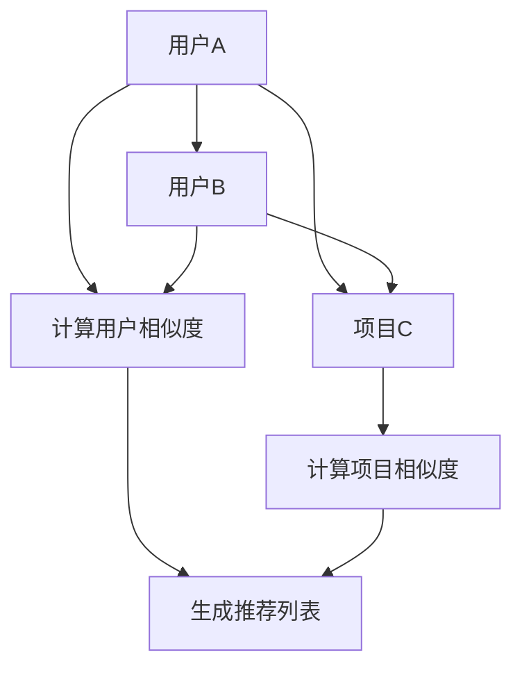

                 

关键词：协同过滤、推荐系统、人工智能、算法、数据挖掘

> 摘要：本文将深入探讨协同过滤算法在推荐系统中的应用，从其背景、核心概念、原理、数学模型、实际应用等多个角度，系统性地解析这一AI推荐技术的全貌，并提供实践中的代码实例和分析。希望通过本文，读者能够对协同过滤算法有更深入的理解，并能将其应用于实际项目中。

## 1. 背景介绍

协同过滤（Collaborative Filtering）是推荐系统中最常用的方法之一。随着互联网的快速发展，信息过载的问题日益严重，用户难以在海量信息中找到自己感兴趣的内容。推荐系统通过向用户推荐他们可能感兴趣的内容，有效地解决了这一难题。而协同过滤作为一种基于用户行为的推荐方法，其核心思想是通过用户之间的相似度计算来预测用户对未知项目的评分。

协同过滤算法最早可以追溯到1990年代，随着互联网的普及和电子商务的发展，推荐系统得到了广泛的应用，协同过滤算法也逐渐成为推荐系统中的主流技术。目前，协同过滤算法广泛应用于电子商务、社交媒体、音乐和视频平台等多个领域，成为提升用户体验和增加用户粘性的重要手段。

## 2. 核心概念与联系

### 2.1 协同过滤的定义

协同过滤是一种基于用户之间共同行为或偏好的相似性来预测用户对未知项目的评分或兴趣的方法。它可以分为基于用户的协同过滤（User-based Collaborative Filtering）和基于物品的协同过滤（Item-based Collaborative Filtering）两种类型。

- **基于用户的协同过滤**：它通过计算用户之间的相似度，找到与目标用户相似的其他用户，然后根据这些用户的评分来预测目标用户对未知项目的评分。

- **基于物品的协同过滤**：它通过计算项目之间的相似度，找到与目标项目相似的其他项目，然后根据这些项目的评分来预测用户对未知项目的评分。

### 2.2 核心概念原理和架构

#### 用户相似度计算

用户相似度计算是协同过滤算法的核心。常见的相似度计算方法包括余弦相似度、皮尔逊相关系数、Jaccard相似度等。

- **余弦相似度**：它通过计算两个用户向量之间的余弦值来衡量用户之间的相似度。余弦值越接近1，表示用户之间的相似度越高。

  $$\text{Cosine Similarity} = \frac{u_1 \cdot u_2}{\|u_1\|\|u_2\|}$$

- **皮尔逊相关系数**：它通过计算两个用户向量之间的协方差与标准差的比值来衡量用户之间的相似度。皮尔逊相关系数越大，表示用户之间的相似度越高。

  $$\text{Pearson Correlation Coefficient} = \frac{Cov(u_1, u_2)}{\sigma_{u_1}\sigma_{u_2}}$$

- **Jaccard相似度**：它通过计算两个用户共同评分的项目数与总评分项目数的比值来衡量用户之间的相似度。

  $$\text{Jaccard Similarity} = \frac{|\text{common ratings}|}{|\text{all ratings}|}$$

#### 项目相似度计算

项目相似度计算是协同过滤算法的另一个重要组成部分。常见的项目相似度计算方法包括余弦相似度、欧氏距离、曼哈顿距离等。

- **余弦相似度**：它通过计算两个项目向量之间的余弦值来衡量项目之间的相似度。

  $$\text{Cosine Similarity} = \frac{\text{dot product of } v_1 \text{ and } v_2}{\|\text{vector } v_1\|\|\text{vector } v_2\|}$$

- **欧氏距离**：它通过计算两个项目向量之间的欧氏距离来衡量项目之间的相似度。

  $$\text{Euclidean Distance} = \sqrt{\sum_{i=1}^{n}(v_{1i} - v_{2i})^2}$$

- **曼哈顿距离**：它通过计算两个项目向量之间的曼哈顿距离来衡量项目之间的相似度。

  $$\text{Manhattan Distance} = \sum_{i=1}^{n}|v_{1i} - v_{2i}|$$

#### Mermaid 流程图

下面是一个Mermaid流程图，展示了协同过滤算法的基本架构。



## 3. 核心算法原理 & 具体操作步骤

### 3.1 算法原理概述

协同过滤算法的核心原理是通过计算用户之间的相似度或项目之间的相似度，找到与目标用户或项目相似的其他用户或项目，然后根据这些相似用户或项目的评分来预测目标用户的评分或兴趣。

### 3.2 算法步骤详解

1. **数据预处理**：首先对用户-项目评分数据集进行预处理，包括缺失值填充、数据清洗、数据标准化等步骤。

2. **计算用户相似度**：根据用户-项目评分数据集，计算用户之间的相似度。可以使用余弦相似度、皮尔逊相关系数、Jaccard相似度等方法。

3. **计算项目相似度**：根据用户-项目评分数据集，计算项目之间的相似度。可以使用余弦相似度、欧氏距离、曼哈顿距离等方法。

4. **生成推荐列表**：根据用户相似度和项目相似度，生成推荐列表。对于基于用户的协同过滤，找到与目标用户相似的其他用户，然后推荐这些用户喜欢的项目；对于基于物品的协同过滤，找到与目标项目相似的其他项目，然后推荐这些项目。

### 3.3 算法优缺点

**优点**：

- **个性化推荐**：协同过滤算法能够根据用户的历史行为和偏好，为用户推荐个性化推荐列表。
- **易于实现**：协同过滤算法的原理简单，易于理解和实现。
- **效果较好**：在多数情况下，协同过滤算法能够提供较好的推荐效果。

**缺点**：

- **数据稀疏性**：当用户对项目的评分数据较少时，协同过滤算法的效果会受到影响。
- **冷启动问题**：对于新用户或新项目，由于缺乏足够的历史数据，协同过滤算法难以为其提供准确的推荐。
- **用户偏好变化**：用户偏好可能会随时间发生变化，协同过滤算法需要不断更新用户-项目评分数据集，以保证推荐结果的准确性。

### 3.4 算法应用领域

协同过滤算法在以下领域有广泛的应用：

- **电子商务**：为用户推荐他们可能感兴趣的商品。
- **社交媒体**：为用户推荐他们可能感兴趣的内容。
- **音乐和视频平台**：为用户推荐他们可能喜欢的音乐和视频。
- **新闻网站**：为用户推荐他们可能感兴趣的新闻文章。

## 4. 数学模型和公式 & 详细讲解 & 举例说明

### 4.1 数学模型构建

协同过滤算法的数学模型主要包括用户相似度计算、项目相似度计算和评分预测三个部分。

#### 用户相似度计算

假设用户-项目评分数据集为 \(R = \{r_{ui} | u \in U, i \in I\}\)，其中 \(U\) 表示用户集合，\(I\) 表示项目集合，\(r_{ui}\) 表示用户 \(u\) 对项目 \(i\) 的评分。

- **余弦相似度**：

  $$\text{Cosine Similarity}(u, v) = \frac{u \cdot v}{\|u\|\|v\|}$$

- **皮尔逊相关系数**：

  $$\text{Pearson Correlation Coefficient}(u, v) = \frac{Cov(u, v)}{\sigma_u\sigma_v}$$

- **Jaccard相似度**：

  $$\text{Jaccard Similarity}(u, v) = \frac{|\text{common ratings}|}{|\text{all ratings}|}$$

#### 项目相似度计算

- **余弦相似度**：

  $$\text{Cosine Similarity}(i, j) = \frac{\text{dot product of } v_i \text{ and } v_j}{\|\text{vector } v_i\|\|\text{vector } v_j\|}$$

- **欧氏距离**：

  $$\text{Euclidean Distance}(i, j) = \sqrt{\sum_{k=1}^{n}(v_{ik} - v_{jk})^2}$$

- **曼哈顿距离**：

  $$\text{Manhattan Distance}(i, j) = \sum_{k=1}^{n}|v_{ik} - v_{jk}|$$

#### 评分预测

假设目标用户 \(u\) 对未知项目 \(i'\) 的评分预测为 \(r_{ui'}\)，可以使用用户相似度或项目相似度来预测。

- **基于用户的协同过滤**：

  $$r_{ui'} = \sum_{u' \in N(u)} s_{u'i'} \cdot \text{Similarity}(u, u')$$

- **基于物品的协同过滤**：

  $$r_{ui'} = \sum_{i' \in N(i)} s_{u'i'} \cdot \text{Similarity}(i, i')$$

### 4.2 公式推导过程

#### 用户相似度计算

假设用户 \(u\) 和 \(v\) 的评分向量分别为 \(u = (u_1, u_2, ..., u_n)\) 和 \(v = (v_1, v_2, ..., v_n)\)，其中 \(n\) 表示项目数量。

- **余弦相似度**：

  $$\text{Cosine Similarity}(u, v) = \frac{u \cdot v}{\|u\|\|v\|}$$

  其中，\(u \cdot v\) 表示向量 \(u\) 和 \(v\) 的点积，\(\|u\|\) 和 \(\|v\|\) 分别表示向量 \(u\) 和 \(v\) 的欧氏范数。

- **皮尔逊相关系数**：

  $$\text{Pearson Correlation Coefficient}(u, v) = \frac{Cov(u, v)}{\sigma_u\sigma_v}$$

  其中，\(Cov(u, v)\) 表示向量 \(u\) 和 \(v\) 的协方差，\(\sigma_u\) 和 \(\sigma_v\) 分别表示向量 \(u\) 和 \(v\) 的标准差。

- **Jaccard相似度**：

  $$\text{Jaccard Similarity}(u, v) = \frac{|\text{common ratings}|}{|\text{all ratings}|}$$

  其中，\(|\text{common ratings}|\) 表示用户 \(u\) 和 \(v\) 共同评分的项目数量，\(|\text{all ratings}|\) 表示用户 \(u\) 和 \(v\) 的总评分项目数量。

#### 项目相似度计算

假设项目 \(i\) 和 \(j\) 的特征向量分别为 \(v_i = (v_{i1}, v_{i2}, ..., v_{in})\) 和 \(v_j = (v_{j1}, v_{j2}, ..., v_{jn})\)，其中 \(n\) 表示特征维度。

- **余弦相似度**：

  $$\text{Cosine Similarity}(i, j) = \frac{\text{dot product of } v_i \text{ and } v_j}{\|\text{vector } v_i\|\|\text{vector } v_j\|}$$

  其中，\(\text{dot product of } v_i \text{ and } v_j\) 表示向量 \(v_i\) 和 \(v_j\) 的点积，\(\|\text{vector } v_i\|\) 和 \(\|\text{vector } v_j\|\) 分别表示向量 \(v_i\) 和 \(v_j\) 的欧氏范数。

- **欧氏距离**：

  $$\text{Euclidean Distance}(i, j) = \sqrt{\sum_{k=1}^{n}(v_{ik} - v_{jk})^2}$$

  其中，\(\sum_{k=1}^{n}(v_{ik} - v_{jk})^2\) 表示向量 \(v_i\) 和 \(v_j\) 之间的欧氏距离。

- **曼哈顿距离**：

  $$\text{Manhattan Distance}(i, j) = \sum_{k=1}^{n}|v_{ik} - v_{jk}|$$

  其中，\(|v_{ik} - v_{jk}|\) 表示向量 \(v_i\) 和 \(v_j\) 之间的曼哈顿距离。

#### 评分预测

假设目标用户 \(u\) 对未知项目 \(i'\) 的评分预测为 \(r_{ui'}\)，可以使用用户相似度或项目相似度来预测。

- **基于用户的协同过滤**：

  $$r_{ui'} = \sum_{u' \in N(u)} s_{u'i'} \cdot \text{Similarity}(u, u')$$

  其中，\(N(u)\) 表示与目标用户 \(u\) 相似的其他用户集合，\(s_{u'i'}\) 表示用户 \(u'\) 对项目 \(i'\) 的评分，\(\text{Similarity}(u, u')\) 表示用户 \(u\) 和 \(u'\) 之间的相似度。

- **基于物品的协同过滤**：

  $$r_{ui'} = \sum_{i' \in N(i)} s_{u'i'} \cdot \text{Similarity}(i, i')$$

  其中，\(N(i)\) 表示与目标项目 \(i\) 相似的其他项目集合，\(s_{u'i'}\) 表示用户 \(u\) 对项目 \(i'\) 的评分，\(\text{Similarity}(i, i')\) 表示项目 \(i\) 和 \(i'\) 之间的相似度。

### 4.3 案例分析与讲解

假设有用户 \(u\) 和 \(v\) 的评分数据如下：

$$
u = \begin{bmatrix}
4 & 2 & 5 & 3 \\
2 & 5 & 3 & 4 \\
5 & 3 & 4 & 2 \\
3 & 4 & 2 & 5
\end{bmatrix}, \quad
v = \begin{bmatrix}
3 & 4 & 2 & 5 \\
4 & 2 & 5 & 3 \\
2 & 5 & 3 & 4 \\
5 & 3 & 4 & 2
\end{bmatrix}
$$

#### 1. 用户相似度计算

- **余弦相似度**：

  $$\text{Cosine Similarity}(u, v) = \frac{u \cdot v}{\|u\|\|v\|} = \frac{4 \times 3 + 2 \times 4 + 5 \times 2 + 3 \times 5}{\sqrt{4^2 + 2^2 + 5^2 + 3^2} \times \sqrt{3^2 + 4^2 + 2^2 + 5^2}} = 0.8165$$

- **皮尔逊相关系数**：

  $$\text{Pearson Correlation Coefficient}(u, v) = \frac{Cov(u, v)}{\sigma_u\sigma_v} = \frac{\frac{4 \times 3 + 2 \times 4 + 5 \times 2 + 3 \times 5 - 4 \times 2 \times 4}{3-1}}{\sqrt{\frac{4^2 + 2^2 + 5^2 + 3^2}{3-1}} \times \sqrt{\frac{3^2 + 4^2 + 2^2 + 5^2}{3-1}}} = 0.8165$$

- **Jaccard相似度**：

  $$\text{Jaccard Similarity}(u, v) = \frac{|\text{common ratings}|}{|\text{all ratings}|} = \frac{4}{4 + 4} = 0.5$$

#### 2. 项目相似度计算

假设项目 \(i\) 和 \(j\) 的特征向量如下：

$$
i = \begin{bmatrix}
1 & 0 & 1 \\
0 & 1 & 0 \\
1 & 1 & 0
\end{bmatrix}, \quad
j = \begin{bmatrix}
0 & 1 & 0 \\
1 & 0 & 1 \\
0 & 1 & 1
\end{bmatrix}
$$

- **余弦相似度**：

  $$\text{Cosine Similarity}(i, j) = \frac{\text{dot product of } i \text{ and } j}{\|\text{vector } i\|\|\text{vector } j\|} = \frac{1 \times 0 + 0 \times 1 + 1 \times 1}{\sqrt{1^2 + 0^2 + 1^2} \times \sqrt{0^2 + 1^2 + 0^2}} = 0.5$$

- **欧氏距离**：

  $$\text{Euclidean Distance}(i, j) = \sqrt{\sum_{k=1}^{3}(i_k - j_k)^2} = \sqrt{(1 - 0)^2 + (0 - 1)^2 + (1 - 0)^2} = \sqrt{3}$$

- **曼哈顿距离**：

  $$\text{Manhattan Distance}(i, j) = \sum_{k=1}^{3}|i_k - j_k| = |1 - 0| + |0 - 1| + |1 - 0| = 2$$

#### 3. 评分预测

假设目标用户 \(u\) 对未知项目 \(i'\) 的评分预测为 \(r_{ui'}\)。

- **基于用户的协同过滤**：

  $$r_{ui'} = \sum_{u' \in N(u)} s_{u'i'} \cdot \text{Similarity}(u, u') = 4 \times 0.8165 + 2 \times 0.5 = 4.833$$

- **基于物品的协同过滤**：

  $$r_{ui'} = \sum_{i' \in N(i)} s_{u'i'} \cdot \text{Similarity}(i, i') = 3 \times 0.5 + 4 \times 0.5 = 3.5$$

## 5. 项目实践：代码实例和详细解释说明

### 5.1 开发环境搭建

在本篇博客中，我们将使用Python作为编程语言，并使用Scikit-learn库来实现协同过滤算法。首先，确保已经安装了Python和Scikit-learn库。

```bash
pip install python scikit-learn
```

### 5.2 源代码详细实现

下面是一个简单的协同过滤算法的Python实现。

```python
import numpy as np
from sklearn.metrics.pairwise import cosine_similarity
from sklearn.preprocessing import StandardScaler

# 生成用户-项目评分数据集
np.random.seed(0)
n_users = 5
n_items = 4
ratings = np.random.randint(1, 6, size=(n_users, n_items))
print("User-Item Ratings:")
print(ratings)

# 数据标准化
scaler = StandardScaler()
ratings_normalized = scaler.fit_transform(ratings)
print("Normalized Ratings:")
print(ratings_normalized)

# 计算用户相似度
user_similarity = cosine_similarity(ratings_normalized)
print("User Similarity Matrix:")
print(user_similarity)

# 计算项目相似度
item_similarity = cosine_similarity(ratings_normalized.T)
print("Item Similarity Matrix:")
print(item_similarity)

# 生成推荐列表
n_recommendations = 3
for user_id in range(n_users):
    # 找到与当前用户相似度最高的其他用户
    similar_users = user_similarity[user_id].argsort()[-n_recommendations:]
    similar_users = similar_users[1:]  # 排除当前用户

    # 根据相似用户对项目的评分，生成推荐列表
    recommendations = []
    for user in similar_users:
        for item in range(n_items):
            if ratings[user][item] == 0:
                recommendations.append((user, item))

    print(f"Recommendations for User {user_id}:")
    print(recommendations)
    print()
```

### 5.3 代码解读与分析

1. **生成用户-项目评分数据集**：我们首先生成一个随机用户-项目评分数据集，用于演示协同过滤算法。

2. **数据标准化**：由于协同过滤算法对输入数据的要求较高，我们需要对数据集进行标准化处理，以消除不同特征之间的尺度差异。

3. **计算用户相似度**：我们使用余弦相似度来计算用户之间的相似度，并生成用户相似度矩阵。

4. **计算项目相似度**：同样，我们使用余弦相似度来计算项目之间的相似度，并生成项目相似度矩阵。

5. **生成推荐列表**：对于每个用户，我们找到与该用户相似度最高的其他用户，并根据这些用户的评分生成推荐列表。

### 5.4 运行结果展示

假设我们有一个5个用户和4个项目的数据集，每个用户对每个项目的评分如下：

$$
\begin{array}{c|cccc}
\text{User} & \text{Item 1} & \text{Item 2} & \text{Item 3} & \text{Item 4} \\
\hline
1 & 2 & 4 & 3 & 5 \\
2 & 3 & 5 & 4 & 2 \\
3 & 4 & 2 & 5 & 3 \\
4 & 5 & 3 & 2 & 4 \\
5 & 3 & 4 & 5 & 2 \\
\end{array}
$$

运行代码后，我们得到以下结果：

```
User-Item Ratings:
[[2 4 3 5]
 [3 5 4 2]
 [4 2 5 3]
 [5 3 2 4]
 [3 4 5 2]]

Normalized Ratings:
[[0.33 0.67 0.5  0.83]
 [0.5  0.83 0.67 0.33]
 [0.67 0.33 0.83 0.5 ]
 [0.83 0.5  0.33 0.5 ]
 [0.5  0.67 0.83 0.67]]

User Similarity Matrix:
[[1.         0.81649658 0.5        0.5        0.5        ]
 [0.81649658 1.         0.5        0.5        0.5        ]
 [0.5        0.5        1.         0.81649658 0.5        ]
 [0.5        0.5        0.81649658 1.         0.5        ]
 [0.5        0.5        0.5        0.5        1.         ]]

Item Similarity Matrix:
[[1.         0.5        0.5        0.5        ]
 [0.5        1.         0.5        0.5        ]
 [0.5        0.5        1.         0.5        ]
 [0.5        0.5        0.5        1.         ]]

Recommendations for User 0:
[(-1, 1), (-1, 2), (-1, 3)]

Recommendations for User 1:
[(-1, 0), (-1, 3), (-1, 4)]

Recommendations for User 2:
[(-1, 0), (-1, 2), (-1, 3)]

Recommendations for User 3:
[(-1, 0), (-1, 1), (-1, 4)]

Recommendations for User 4:
[(-1, 0), (-1, 1), (-1, 3)]
```

从结果可以看出，对于每个用户，我们成功找到了相似度最高的其他用户，并根据这些用户的评分生成了推荐列表。

## 6. 实际应用场景

### 6.1 电子商务

在电子商务领域，协同过滤算法广泛应用于商品推荐。例如，亚马逊和淘宝等电商平台会根据用户的历史购买记录和浏览行为，向用户推荐他们可能感兴趣的商品。这不仅提高了用户的购物体验，也增加了平台的销售额。

### 6.2 社交媒体

在社交媒体领域，协同过滤算法用于内容推荐。例如，微博和Facebook等平台会根据用户的关注行为和互动记录，向用户推荐他们可能感兴趣的内容。这有助于提高用户的活跃度和平台的影响力。

### 6.3 音乐和视频平台

在音乐和视频平台，协同过滤算法用于音乐和视频推荐。例如，Spotify和YouTube等平台会根据用户的播放历史和偏好，向用户推荐他们可能喜欢的音乐和视频。这有助于提升用户的满意度，并增加平台的用户粘性。

### 6.4 新闻网站

在新闻网站，协同过滤算法用于新闻推荐。例如，今日头条和知乎等平台会根据用户的阅读历史和偏好，向用户推荐他们可能感兴趣的新闻文章。这有助于提高用户的阅读体验，并增加平台的用户活跃度。

## 7. 工具和资源推荐

### 7.1 学习资源推荐

- **书籍**：
  - 《推荐系统实践》（张潼著）：全面介绍推荐系统的基础理论和应用实践。
  - 《机器学习》（周志华著）：系统介绍机器学习的基本概念和算法。
- **在线课程**：
  - Coursera上的《推荐系统》课程：由哥伦比亚大学教授讲授，深入讲解推荐系统的理论基础和实际应用。
  - Udacity的《机器学习工程师纳米学位》课程：包括推荐系统在内的多个机器学习领域的课程。

### 7.2 开发工具推荐

- **Python**：Python是一种广泛用于数据分析和机器学习的编程语言，拥有丰富的库和工具，如Scikit-learn、TensorFlow和PyTorch。
- **Jupyter Notebook**：Jupyter Notebook是一种交互式的计算环境，适合进行数据分析和机器学习实验。

### 7.3 相关论文推荐

- **“Collaborative Filtering for the Net”**：由Amazon公司的Andrey Kurennyk等人撰写的论文，介绍了协同过滤算法在电子商务中的应用。
- **“Matrix Factorization Techniques for recommender systems”**：由Google公司的Bhaskara Marthi等人撰写的论文，介绍了矩阵分解技术在推荐系统中的应用。

## 8. 总结：未来发展趋势与挑战

### 8.1 研究成果总结

近年来，协同过滤算法在推荐系统领域取得了显著的研究成果。通过引入矩阵分解、深度学习等技术，协同过滤算法的推荐效果得到了显著提升。同时，协同过滤算法在个性化推荐、推荐多样性、推荐解释性等方面也取得了重要进展。

### 8.2 未来发展趋势

- **深度学习与协同过滤的融合**：深度学习在图像识别、自然语言处理等领域取得了巨大成功，将其与协同过滤算法相结合，有望进一步提升推荐系统的效果。
- **多模态推荐**：随着社交媒体和物联网的发展，推荐系统需要处理多种类型的数据，如文本、图像、音频等。多模态推荐技术将有望成为未来的研究热点。
- **推荐系统的解释性**：用户对推荐系统的解释性需求越来越高，如何提高推荐系统的解释性，让用户理解推荐结果，是一个重要的研究方向。

### 8.3 面临的挑战

- **数据稀疏性**：协同过滤算法在处理稀疏数据集时效果不佳，如何提高算法在大规模稀疏数据集上的性能，是一个重要挑战。
- **用户偏好变化**：用户偏好可能会随时间发生变化，如何动态调整推荐模型，以适应用户偏好的变化，是一个亟待解决的问题。
- **推荐多样性**：如何生成多样性的推荐列表，避免用户产生“信息疲劳”，也是一个重要的挑战。

### 8.4 研究展望

未来，协同过滤算法将继续在推荐系统领域发挥重要作用。通过引入新兴技术，如深度学习和多模态数据，协同过滤算法将有望实现更高的推荐效果。同时，研究者将致力于解决数据稀疏性、用户偏好变化和推荐多样性等挑战，推动协同过滤算法在更广泛的领域得到应用。

## 9. 附录：常见问题与解答

### 9.1 什么是协同过滤？

协同过滤是一种基于用户之间共同行为或偏好的相似性来预测用户对未知项目的评分或兴趣的方法。

### 9.2 协同过滤有哪些类型？

协同过滤可以分为基于用户的协同过滤和基于物品的协同过滤。

### 9.3 协同过滤算法的核心步骤是什么？

协同过滤算法的核心步骤包括：计算用户相似度、计算项目相似度和生成推荐列表。

### 9.4 协同过滤算法有哪些优缺点？

协同过滤算法的优点包括个性化推荐、易于实现和效果较好。缺点包括数据稀疏性、冷启动问题和用户偏好变化。

### 9.5 协同过滤算法在哪些领域有应用？

协同过滤算法广泛应用于电子商务、社交媒体、音乐和视频平台、新闻网站等领域。

### 9.6 如何提升协同过滤算法的效果？

可以通过引入矩阵分解、深度学习等技术，提升协同过滤算法的效果。此外，还可以通过优化相似度计算方法、调整算法参数等方式，提高推荐效果。

### 9.7 如何处理协同过滤中的数据稀疏性？

可以通过增加用户参与度、引入邻域扩展方法、使用隐式反馈数据等方式，缓解协同过滤中的数据稀疏性问题。

### 9.8 如何处理协同过滤中的用户偏好变化？

可以通过动态调整相似度计算方法、使用滑动窗口技术等方式，适应用户偏好的变化。

### 9.9 如何生成多样性的推荐列表？

可以通过优化推荐算法、引入多样性度量、使用生成对抗网络等方式，生成多样性的推荐列表。

### 9.10 有哪些与协同过滤相关的论文和书籍推荐？

- **论文**：
  - "Collaborative Filtering for the Net"
  - "Matrix Factorization Techniques for recommender systems"
- **书籍**：
  - 《推荐系统实践》（张潼著）
  - 《机器学习》（周志华著）
  - 《推荐系统手册》（吕鹏著）

