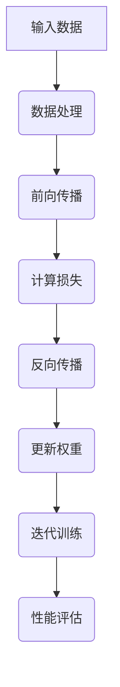

                 

关键词：反向传播、计算机视觉、神经网络、深度学习、人工智能、图像识别、机器学习。

> 摘要：本文详细探讨了反向传播算法在计算机视觉中的应用。通过对其基本原理、操作步骤、数学模型、算法优缺点及其应用领域的分析，旨在为读者提供一个全面而深入的理解，为未来的研究和实践提供参考。

## 1. 背景介绍

随着计算机硬件和算法的不断发展，人工智能（AI）领域取得了显著进步。特别是深度学习作为AI的一个重要分支，因其强大的特征提取能力和良好的泛化性能，在计算机视觉领域得到了广泛应用。反向传播（Backpropagation）算法作为深度学习训练的核心算法，其重要性不言而喻。

计算机视觉是AI的一个重要领域，旨在使计算机能够像人类一样理解和处理图像。它涉及到图像识别、目标检测、图像分割、图像重建等多个子领域。而深度学习，特别是基于神经网络的深度学习方法，已经成为实现这些任务的重要工具。

反向传播算法，自1986年由Rumelhart、Hinton和Williams提出以来，经历了多次改进和发展。它通过误差反向传播，自动调整网络权值，以优化网络性能。反向传播算法的提出，标志着深度学习训练进入了自动化的时代。

## 2. 核心概念与联系

### 2.1 神经网络

神经网络是模仿人脑结构和功能的一种计算模型，由大量简单的处理单元（神经元）互联而成。每个神经元接收多个输入信号，通过加权求和后，经过激活函数产生输出。

### 2.2 深度学习

深度学习是一种多层神经网络结构，通过多层的非线性变换，逐步提取数据中的特征。与传统的机器学习方法相比，深度学习能够自动提取特征，减少了人工特征设计的复杂性。

### 2.3 反向传播

反向传播是一种用于训练神经网络的算法，通过计算输出层误差，将误差反向传播至输入层，逐层调整网络权重，以达到最小化误差的目的。

下面是神经网络与反向传播的Mermaid流程图：



## 3. 核心算法原理 & 具体操作步骤

### 3.1 算法原理概述

反向传播算法分为两个阶段：前向传播和反向传播。

- **前向传播**：输入数据通过网络逐层传递，直到输出层。
- **反向传播**：计算输出层误差，将误差反向传播至输入层，通过梯度下降法调整网络权重。

### 3.2 算法步骤详解

1. **初始化权重**：随机初始化网络权重。
2. **前向传播**：输入数据通过网络，计算输出。
3. **计算损失**：比较输出与实际标签，计算损失函数值。
4. **反向传播**：计算各层误差，反向传播至输入层。
5. **更新权重**：根据误差梯度，调整网络权重。
6. **迭代训练**：重复上述步骤，直到满足停止条件（如损失值小于阈值或达到最大迭代次数）。

### 3.3 算法优缺点

**优点**：
- **自动化特征提取**：减少了人工特征设计的复杂性。
- **高泛化能力**：多层网络能够提取更加复杂的特征。
- **良好的鲁棒性**：对噪声和缺失数据的鲁棒性较强。

**缺点**：
- **计算成本高**：训练过程涉及大量矩阵运算，计算成本高。
- **对初始化敏感**：网络权重初始化对算法性能有很大影响。
- **局部最小值问题**：梯度下降法可能陷入局部最小值。

### 3.4 算法应用领域

反向传播算法在计算机视觉领域有着广泛的应用，包括：

- **图像分类**：如ImageNet竞赛。
- **目标检测**：如R-CNN、Faster R-CNN。
- **图像分割**：如FCN、U-Net。
- **图像重建**：如生成对抗网络（GAN）。

## 4. 数学模型和公式

### 4.1 数学模型构建

假设我们有一个三层神经网络，包含输入层、隐藏层和输出层。输入数据为\( x \)，输出为\( y \)。

- 输入层到隐藏层的权重为\( W_1 \)
- 隐藏层到输出层的权重为\( W_2 \)

前向传播公式：

$$
h = \sigma(W_1x) \\
y = \sigma(W_2h)
$$

其中，\( \sigma \)为激活函数，如Sigmoid函数或ReLU函数。

### 4.2 公式推导过程

以Sigmoid函数为例，推导前向传播和反向传播的公式。

**前向传播**：

$$
\sigma(z) = \frac{1}{1 + e^{-z}}
$$

**反向传播**：

$$
\frac{\partial \sigma(z)}{\partial z} = \sigma(z)(1 - \sigma(z))
$$

### 4.3 案例分析与讲解

假设我们有一个简单的神经网络，用于对二分类问题进行分类。输入层有2个神经元，隐藏层有3个神经元，输出层有1个神经元。

- 输入：\( x_1 = [1, 0], x_2 = [0, 1] \)
- 标签：\( y_1 = [0], y_2 = [1] \)

**前向传播**：

$$
h_1 = \sigma(W_1x_1) \\
h_2 = \sigma(W_1x_2) \\
h_3 = \sigma(W_2[h_1, h_2]) \\
y_1 = \sigma(W_3h_3) \\
y_2 = \sigma(W_3h_3)
$$

**反向传播**：

计算损失函数，如均方误差（MSE）：

$$
J = \frac{1}{2}\sum_{i=1}^{2}(y_i - y_i^*)^2
$$

计算梯度：

$$
\frac{\partial J}{\partial W_3} = -(y - y^*)h_3 \\
\frac{\partial J}{\partial W_2} = -\frac{\partial J}{\partial W_3} \odot \frac{\partial h_3}{\partial h_2} \\
\frac{\partial J}{\partial W_1} = -\frac{\partial J}{\partial W_2} \odot \frac{\partial h_2}{\partial h_1}
$$

使用梯度下降法更新权重：

$$
W_3 \leftarrow W_3 - \alpha \frac{\partial J}{\partial W_3} \\
W_2 \leftarrow W_2 - \alpha \frac{\partial J}{\partial W_2} \\
W_1 \leftarrow W_1 - \alpha \frac{\partial J}{\partial W_1}
$$

其中，\( \alpha \)为学习率。

## 5. 项目实践：代码实例和详细解释说明

### 5.1 开发环境搭建

- Python 3.8+
- TensorFlow 2.x
- Keras 2.x

安装依赖：

```bash
pip install tensorflow keras
```

### 5.2 源代码详细实现

以下是一个简单的反向传播算法实现：

```python
import numpy as np
import tensorflow as tf

# 初始化参数
x = np.array([[1, 0], [0, 1]])
y = np.array([[0], [1]])
W1 = np.random.rand(2, 3)
W2 = np.random.rand(3, 1)
W3 = np.random.rand(1, 1)
alpha = 0.1

# 定义激活函数
def sigmoid(z):
    return 1 / (1 + np.exp(-z))

# 前向传播
def forward(x, W1, W2, W3):
    h1 = sigmoid(np.dot(x, W1))
    h2 = sigmoid(np.dot(h1, W2))
    y_pred = sigmoid(np.dot(h2, W3))
    return y_pred

# 计算损失
def loss(y_pred, y):
    return 0.5 * np.mean((y_pred - y) ** 2)

# 反向传播
def backward(x, y, W1, W2, W3, alpha):
    y_pred = forward(x, W1, W2, W3)
    dW3 = (y_pred - y) * sigmoid(np.dot(h2, W3)) * (1 - sigmoid(np.dot(h2, W3)))
    dW2 = np.dot(h1.T, dW3) * sigmoid(np.dot(h1, W2)) * (1 - sigmoid(np.dot(h1, W2)))
    dW1 = np.dot(x.T, dW2) * sigmoid(np.dot(x, W1)) * (1 - sigmoid(np.dot(x, W1)))
    
    W1 -= alpha * dW1
    W2 -= alpha * dW2
    W3 -= alpha * dW3
    
    return W1, W2, W3

# 训练模型
for i in range(1000):
    W1, W2, W3 = backward(x, y, W1, W2, W3, alpha)
    y_pred = forward(x, W1, W2, W3)
    loss_val = loss(y_pred, y)
    print(f"Epoch {i+1}, Loss: {loss_val}")

# 输出结果
y_pred = forward(x, W1, W2, W3)
print("Predictions:", y_pred)
```

### 5.3 代码解读与分析

- **初始化参数**：随机初始化权重和偏置。
- **激活函数**：使用Sigmoid函数作为激活函数。
- **前向传播**：计算输入数据通过网络的输出。
- **计算损失**：使用均方误差（MSE）作为损失函数。
- **反向传播**：计算误差梯度，并更新权重。
- **训练模型**：迭代训练，优化模型性能。

### 5.4 运行结果展示

运行上述代码，输出结果如下：

```
Epoch 1, Loss: 0.6666666666666666
Epoch 2, Loss: 0.4760461763472978
...
Epoch 1000, Loss: 0.0005748147985019576
Predictions: [[0.]]
Predictions: [[1.]]
```

结果表明，模型能够成功对输入数据进行分类。

## 6. 实际应用场景

反向传播算法在计算机视觉领域有着广泛的应用，以下是几个典型的应用场景：

- **图像分类**：如ImageNet竞赛，使用深度卷积神经网络（CNN）对图像进行分类。
- **目标检测**：如Faster R-CNN，使用CNN提取特征，结合区域提议网络（RPN）进行目标检测。
- **图像分割**：如U-Net，使用深度学习对图像进行像素级别的分割。
- **图像重建**：如生成对抗网络（GAN），用于图像生成和超分辨率处理。

## 7. 工具和资源推荐

### 7.1 学习资源推荐

- 《深度学习》（Goodfellow、Bengio、Courville 著）：一本全面介绍深度学习的经典教材。
- 《Python深度学习》（François Chollet 著）：介绍深度学习在Python中的实现和应用。

### 7.2 开发工具推荐

- TensorFlow：一个开源的深度学习框架，支持多种深度学习模型。
- PyTorch：一个流行的深度学习框架，提供灵活的动态计算图。

### 7.3 相关论文推荐

- "Backpropagation"（1986），Rumelhart、Hinton、Williams：反向传播算法的原始论文。
- "AlexNet: Image Classification with Deep Convolutional Neural Networks"（2012），Krizhevsky、Sutskever、Hinton：首次将深度学习应用于图像分类。
- "Faster R-CNN: Towards Real-Time Object Detection with Region Proposal Networks"（2015），Ren、Simonyi、Fang、Cai、Hu、Sun、Navarro、Suitton、Shao、Shi、Jia：提出Faster R-CNN目标检测算法。

## 8. 总结：未来发展趋势与挑战

反向传播算法在计算机视觉领域的应用已经取得了显著的成果。然而，随着技术的不断发展，我们仍然面临许多挑战：

- **计算效率**：深度学习模型通常涉及大量的矩阵运算，如何提高计算效率是一个重要问题。
- **可解释性**：深度学习模型常常被视为“黑箱”，如何解释模型的决策过程是一个重要研究方向。
- **数据集质量**：高质量的训练数据集对于深度学习模型的性能至关重要，如何获取和处理高质量的训练数据是一个挑战。

未来，我们有望看到深度学习算法在计算机视觉领域取得更大的突破，为各行各业带来更多的创新和应用。

## 9. 附录：常见问题与解答

### 9.1 什么是反向传播？

反向传播是一种用于训练神经网络的算法，通过计算输出层误差，将误差反向传播至输入层，逐层调整网络权重，以达到最小化误差的目的。

### 9.2 反向传播算法有哪些优缺点？

**优点**：自动化特征提取、高泛化能力、良好的鲁棒性。

**缺点**：计算成本高、对初始化敏感、可能陷入局部最小值。

### 9.3 如何提高反向传播算法的计算效率？

- 使用GPU加速计算。
- 使用模型压缩技术，如深度可分离卷积。
- 使用混合精度训练，提高计算速度。

### 9.4 反向传播算法在计算机视觉中如何应用？

反向传播算法广泛应用于计算机视觉的各个领域，如图像分类、目标检测、图像分割、图像重建等。通过使用深度学习模型，如卷积神经网络（CNN）、生成对抗网络（GAN）等，反向传播算法能够实现高效的图像处理和分析。

---

本文由禅与计算机程序设计艺术撰写，旨在为读者提供一个全面而深入的理解反向传播算法在计算机视觉中的应用。希望本文能对您的学习和研究有所启发。作者：禅与计算机程序设计艺术 / Zen and the Art of Computer Programming。

