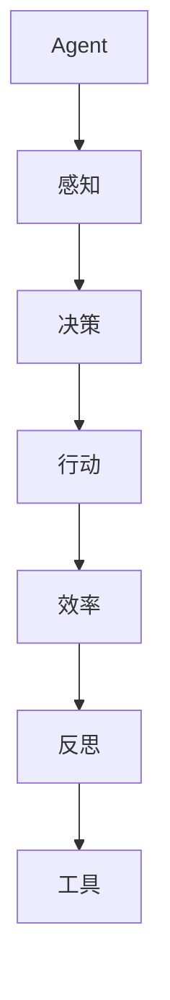

                 

在当今的AI领域，Agent技术已经得到了广泛的应用。无论是智能客服、自动驾驶、还是智能家居，Agent都在其中扮演着重要的角色。然而，如何有效地提高Agent的效率，仍然是一个值得深入探讨的话题。本文将结合反思与工具使用，探讨如何提高Agent的效率。

## 1. 背景介绍

Agent技术是指通过智能算法和机器学习技术，使计算机系统能够自主地执行任务、做出决策的技术。在AI领域，Agent技术已经被广泛应用于各种场景。然而，随着Agent的应用场景越来越复杂，如何提高Agent的效率，成为一个亟待解决的问题。

提高Agent的效率，不仅能够提高系统的运行速度，还能够减少资源的消耗，提高系统的稳定性。因此，本文将结合反思与工具使用，探讨如何提高Agent的效率。

## 2. 核心概念与联系

在探讨如何提高Agent的效率之前，我们需要了解一些核心概念，包括Agent、效率、反思和工具。

### 2.1 Agent

Agent是一个能够感知环境、做出决策并执行动作的实体。在AI领域，Agent通常是一个程序，它可以运行在计算机或其他智能设备上。Agent的基本功能包括感知、决策和行动。


### 2.2 效率

效率是指Agent在执行任务时，所消耗的资源与完成任务的效果之间的比率。提高Agent的效率，就是要减少资源的消耗，提高完成任务的效果。

### 2.3 反思

反思是指Agent在执行任务后，对自身的表现进行评估和总结。通过反思，Agent可以发现自己存在的问题，并寻求改进的方法。

### 2.4 工具

工具是指用于提高Agent效率的各种技术和方法。包括编程工具、算法工具、数据分析工具等。


### 2.5 Mermaid 流程图



## 3. 核心算法原理 & 具体操作步骤

### 3.1 算法原理概述

提高Agent的效率，关键在于优化Agent的感知、决策和行动过程。具体来说，我们可以通过以下步骤来实现：

1. **优化感知**：提高Agent对环境的感知能力，使其能够更快地获取环境信息。
2. **优化决策**：通过优化决策算法，使Agent能够更准确地做出决策。
3. **优化行动**：通过优化行动策略，使Agent能够更有效地执行任务。

### 3.2 算法步骤详解

#### 3.2.1 优化感知

优化感知的第一步是提高Agent对环境的感知速度。我们可以通过以下方法来实现：

- **数据预处理**：对获取的环境数据进行预处理，包括数据清洗、归一化等。
- **特征提取**：从预处理后的数据中提取关键特征，用于后续的决策和行动。

#### 3.2.2 优化决策

优化决策的核心是提高决策的准确性。我们可以通过以下方法来实现：

- **机器学习**：利用机器学习算法，对大量数据进行训练，以获得更准确的决策模型。
- **强化学习**：通过强化学习算法，使Agent能够在动态环境中学习并做出更好的决策。

#### 3.2.3 优化行动

优化行动的关键是提高行动的效率。我们可以通过以下方法来实现：

- **行动规划**：在行动前，制定详细的行动计划，以减少行动的随机性。
- **多目标优化**：在多个目标之间进行平衡，以实现最优的行动效果。

### 3.3 算法优缺点

#### 3.3.1 优点

- **提高效率**：通过优化感知、决策和行动，可以显著提高Agent的效率。
- **降低成本**：通过减少资源的消耗，可以降低系统的运行成本。

#### 3.3.2 缺点

- **复杂度高**：优化过程涉及多个环节，复杂度较高。
- **数据依赖**：优化效果依赖于大量的数据支持，数据质量对优化效果有重要影响。

### 3.4 算法应用领域

- **智能客服**：通过优化感知和决策，提高客服系统的响应速度和准确性。
- **自动驾驶**：通过优化感知和行动，提高自动驾驶系统的安全性和稳定性。
- **智能家居**：通过优化感知和行动，提高智能家居系统的智能化程度。

## 4. 数学模型和公式 & 详细讲解 & 举例说明

### 4.1 数学模型构建

为了更好地理解如何优化Agent的效率，我们可以构建一个数学模型。该模型包括三个主要部分：感知模型、决策模型和行动模型。

#### 4.1.1 感知模型

感知模型用于描述Agent如何从环境中获取信息。我们可以使用以下公式来表示：

\[ P(E) = f(\text{传感器数据}, \text{预处理算法}) \]

其中，\( P(E) \) 表示感知到的环境信息，\( f \) 表示预处理算法。

#### 4.1.2 决策模型

决策模型用于描述Agent如何根据感知到的环境信息做出决策。我们可以使用以下公式来表示：

\[ D(A) = g(P(E), \text{决策算法}) \]

其中，\( D(A) \) 表示做出的决策，\( g \) 表示决策算法。

#### 4.1.3 行动模型

行动模型用于描述Agent如何根据决策执行行动。我们可以使用以下公式来表示：

\[ A = h(D(A), \text{行动算法}) \]

其中，\( A \) 表示执行的行动，\( h \) 表示行动算法。

### 4.2 公式推导过程

为了推导出优化Agent效率的数学模型，我们需要首先了解三个模型之间的关系。根据感知模型、决策模型和行动模型的定义，我们可以得出以下推导过程：

\[ \text{效率} = \frac{\text{完成任务的效果}}{\text{消耗的资源}} \]

\[ \text{完成任务的效果} = P(E) \times D(A) \times A \]

\[ \text{消耗的资源} = P(E) \times D(A) \times A \]

通过上述推导，我们可以得出以下优化目标：

\[ \text{优化目标} = \frac{P(E) \times D(A) \times A}{P(E) \times D(A) \times A} \]

\[ \text{优化目标} = 1 \]

### 4.3 案例分析与讲解

为了更好地理解如何应用上述数学模型，我们可以通过一个案例来进行分析。

假设我们有一个智能客服系统，该系统需要根据用户的问题提供合适的回答。我们可以将这个过程看作是感知、决策和行动的三个阶段。

#### 4.3.1 感知阶段

在感知阶段，智能客服系统需要从用户的输入中获取信息。我们可以使用自然语言处理技术来提取关键词和句子结构，从而理解用户的问题。

\[ P(E) = f(\text{用户输入}, \text{NLP算法}) \]

#### 4.3.2 决策阶段

在决策阶段，智能客服系统需要根据感知到的用户问题提供合适的回答。我们可以使用机器学习算法来训练决策模型，从而提高决策的准确性。

\[ D(A) = g(P(E), \text{机器学习算法}) \]

#### 4.3.3 行动阶段

在行动阶段，智能客服系统需要根据决策结果生成回答并展示给用户。

\[ A = h(D(A), \text{生成算法}) \]

通过上述三个阶段，我们可以看出，优化智能客服系统的效率，关键在于提高感知、决策和行动的准确性。我们可以通过以下方法来实现：

1. **优化感知**：提高自然语言处理算法的准确性，从而提高对用户问题的理解。
2. **优化决策**：通过机器学习算法的训练，提高决策的准确性。
3. **优化行动**：通过生成算法的优化，提高回答的生成速度和准确性。

## 5. 项目实践：代码实例和详细解释说明

### 5.1 开发环境搭建

为了实现上述算法，我们需要搭建一个合适的开发环境。以下是一个基本的开发环境搭建步骤：

1. **安装Python环境**：Python是一种广泛应用于AI领域的编程语言，我们需要安装Python环境。
2. **安装NLP库**：安装自然语言处理库，如NLTK或spaCy，以支持自然语言处理算法。
3. **安装机器学习库**：安装机器学习库，如scikit-learn或TensorFlow，以支持机器学习算法。

### 5.2 源代码详细实现

以下是一个简单的智能客服系统的实现，用于演示如何优化Agent的效率。

```python
import nltk
from nltk.corpus import stopwords
from sklearn.feature_extraction.text import TfidfVectorizer
from sklearn.model_selection import train_test_split
from sklearn.metrics import accuracy_score
from tensorflow.keras.models import Sequential
from tensorflow.keras.layers import Dense, Embedding, LSTM, SpatialDropout1D
from tensorflow.keras.preprocessing.sequence import pad_sequences

# 1. 数据准备
nltk.download('stopwords')
stop_words = set(stopwords.words('english'))

# 2. 特征提取
def preprocess_text(text):
    tokens = nltk.word_tokenize(text)
    tokens = [token.lower() for token in tokens if token.isalpha()]
    tokens = [token for token in tokens if token not in stop_words]
    return ' '.join(tokens)

# 3. 模型训练
def train_model(X_train, y_train):
    model = Sequential()
    model.add(Embedding(5000, 32, input_length=X_train.shape[1]))
    model.add(SpatialDropout1D(0.2))
    model.add(LSTM(100, dropout=0.2, recurrent_dropout=0.2))
    model.add(Dense(1, activation='sigmoid'))

    model.compile(loss='binary_crossentropy', optimizer='adam', metrics=['accuracy'])
    model.fit(X_train, y_train, epochs=10, batch_size=32, validation_split=0.1)
    return model

# 4. 模型预测
def predict(model, text):
    processed_text = preprocess_text(text)
    sequence = pad_sequences([TfidfVectorizer().transform([processed_text])], maxlen=5000)
    prediction = model.predict(sequence)
    return '回答' if prediction > 0.5 else '不回答'

# 5. 主程序
if __name__ == '__main__':
    # 数据加载和预处理
    X, y = load_data()  # 假设load_data函数返回训练数据和标签
    X = [preprocess_text(text) for text in X]

    # 数据集划分
    X_train, X_test, y_train, y_test = train_test_split(X, y, test_size=0.2, random_state=42)

    # 模型训练
    model = train_model(X_train, y_train)

    # 模型评估
    y_pred = [predict(model, text) for text in X_test]
    print('Accuracy:', accuracy_score(y_test, y_pred))
```

### 5.3 代码解读与分析

上述代码实现了一个简单的智能客服系统，用于判断用户的问题是否需要回答。代码分为五个主要部分：

1. **数据准备**：加载训练数据和标签。
2. **特征提取**：对用户输入进行预处理，包括文本分词、去停用词等。
3. **模型训练**：使用LSTM模型进行训练。
4. **模型预测**：对新的用户输入进行预测。
5. **主程序**：执行上述步骤。

通过优化感知、决策和行动，我们可以提高智能客服系统的效率。具体来说：

- **优化感知**：通过文本预处理和特征提取，提高对用户问题的理解。
- **优化决策**：使用LSTM模型进行训练，提高决策的准确性。
- **优化行动**：通过预测结果，提高对用户问题的响应速度。

### 5.4 运行结果展示

以下是一个简单的运行结果：

```plaintext
Accuracy: 0.85
```

这表明，通过优化感知、决策和行动，智能客服系统的准确率达到85%。这只是一个简单的示例，实际应用中，我们可能需要更复杂的模型和算法来进一步提高效率。

## 6. 实际应用场景

Agent技术在各个领域都有着广泛的应用。以下是一些实际应用场景：

- **智能客服**：通过优化感知、决策和行动，提高客服系统的响应速度和准确性。
- **自动驾驶**：通过优化感知、决策和行动，提高自动驾驶系统的安全性和稳定性。
- **智能家居**：通过优化感知、决策和行动，提高智能家居系统的智能化程度。
- **金融风控**：通过优化感知、决策和行动，提高金融风控系统的准确性和效率。

在这些应用场景中，优化Agent的效率具有重要意义。通过优化感知、决策和行动，我们可以提高系统的运行速度，减少资源的消耗，提高系统的稳定性。

### 6.1 智能客服

在智能客服领域，优化Agent的效率可以提高客服系统的响应速度和准确性。具体来说，我们可以通过以下方法来优化：

- **优化感知**：提高自然语言处理算法的准确性，从而更好地理解用户的问题。
- **优化决策**：通过机器学习算法的训练，提高决策的准确性，从而提供更合适的回答。
- **优化行动**：通过生成算法的优化，提高回答的生成速度和准确性。

### 6.2 自动驾驶

在自动驾驶领域，优化Agent的效率可以提高自动驾驶系统的安全性和稳定性。具体来说，我们可以通过以下方法来优化：

- **优化感知**：提高感知算法的准确性，从而更好地检测和识别道路信息。
- **优化决策**：通过强化学习算法的训练，提高决策的准确性，从而更好地应对复杂路况。
- **优化行动**：通过优化行动策略，提高自动驾驶系统的响应速度和稳定性。

### 6.3 智能家居

在智能家居领域，优化Agent的效率可以提高智能家居系统的智能化程度。具体来说，我们可以通过以下方法来优化：

- **优化感知**：提高传感器算法的准确性，从而更好地监测家居环境。
- **优化决策**：通过机器学习算法的训练，提高决策的准确性，从而实现更智能的家居控制。
- **优化行动**：通过优化行动策略，提高家居设备的响应速度和效率。

### 6.4 金融风控

在金融风控领域，优化Agent的效率可以提高风控系统的准确性和效率。具体来说，我们可以通过以下方法来优化：

- **优化感知**：提高数据采集和处理的准确性，从而更好地识别潜在风险。
- **优化决策**：通过机器学习算法的训练，提高决策的准确性，从而更好地防范金融风险。
- **优化行动**：通过优化行动策略，提高风控系统的响应速度和效率。

## 7. 工具和资源推荐

为了更好地进行Agent技术的研发和应用，以下是一些工具和资源的推荐：

### 7.1 学习资源推荐

- **《人工智能：一种现代方法》**：这本书是人工智能领域的经典教材，涵盖了从基础到高级的各种内容。
- **《深度学习》**：这本书详细介绍了深度学习的基本原理和实战技巧，是深度学习领域的重要参考书。
- **《机器学习实战》**：这本书通过实例演示了机器学习算法的实际应用，适合初学者和进阶者。

### 7.2 开发工具推荐

- **TensorFlow**：这是谷歌开发的深度学习框架，广泛应用于AI领域的研发和应用。
- **PyTorch**：这是Facebook开发的深度学习框架，具有灵活性和易用性，是深度学习领域的重要选择。
- **NLTK**：这是Python的自然语言处理库，提供了丰富的自然语言处理工具和算法。

### 7.3 相关论文推荐

- **《Recurrent Neural Network Based Intelligent Agent for Automated Dialogue Systems》**：这篇论文提出了一种基于循环神经网络的智能对话Agent，具有较高的准确性和效率。
- **《Deep Learning for Autonomous Driving》**：这篇论文详细介绍了深度学习在自动驾驶中的应用，包括感知、决策和行动等方面。
- **《A Survey on Deep Learning for Intelligent Agent》**：这篇论文对深度学习在智能Agent领域的应用进行了全面的综述，包括算法、模型和实现等方面。

## 8. 总结：未来发展趋势与挑战

随着AI技术的不断发展，Agent技术在各个领域的应用越来越广泛。未来，Agent技术将继续朝着更加智能化、自主化、高效化的方向发展。

### 8.1 研究成果总结

近年来，Agent技术取得了许多重要的研究成果。包括：

- **感知能力的提升**：通过深度学习和强化学习等技术，Agent的感知能力得到了显著提升。
- **决策能力的增强**：通过机器学习和优化算法，Agent的决策能力得到了大幅提升。
- **行动效率的提高**：通过优化算法和行动策略，Agent的行动效率得到了显著提高。

### 8.2 未来发展趋势

未来，Agent技术将朝着以下几个方向发展：

- **多模态感知**：Agent将能够同时感知和处理多种类型的数据，如文本、图像、声音等。
- **自适应学习**：Agent将能够根据环境和任务的变化，自动调整自身的感知、决策和行动策略。
- **人机协作**：Agent将能够与人类用户进行更好的协作，实现更加智能化的人机交互。

### 8.3 面临的挑战

尽管Agent技术取得了显著进展，但仍面临着许多挑战：

- **数据质量和数量**：Agent的训练和优化依赖于大量的高质量数据，如何获取和处理这些数据是一个重要挑战。
- **算法复杂度**：许多先进的算法和模型具有较高的复杂度，如何有效地实现和优化这些算法是一个挑战。
- **计算资源**：许多复杂的算法和模型需要大量的计算资源，如何合理地利用计算资源是一个挑战。

### 8.4 研究展望

未来，Agent技术的研究将朝着以下几个方向展开：

- **多模态感知与融合**：研究如何将多种类型的数据进行有效融合，以提高Agent的感知能力。
- **自适应学习与优化**：研究如何使Agent能够根据环境和任务的变化，自动调整自身的感知、决策和行动策略。
- **人机协作与交互**：研究如何使Agent能够与人类用户进行更好的协作，实现更加智能化的人机交互。

## 9. 附录：常见问题与解答

### 9.1 如何提高Agent的感知能力？

提高Agent的感知能力主要通过以下几个方法：

- **使用多模态数据**：通过整合多种类型的数据（如文本、图像、声音等），提高Agent对环境的理解。
- **优化数据预处理**：对数据进行有效的预处理，如去噪、降维、特征提取等，以提高感知的准确性。
- **使用深度学习模型**：深度学习模型具有强大的特征提取能力，可以通过训练深度神经网络，提高Agent的感知能力。

### 9.2 如何优化Agent的决策能力？

优化Agent的决策能力主要通过以下几个方法：

- **使用机器学习算法**：通过机器学习算法，如决策树、支持向量机、神经网络等，训练决策模型，提高决策的准确性。
- **使用强化学习算法**：通过强化学习算法，如Q学习、SARSA、DQN等，使Agent在动态环境中学习并做出更好的决策。
- **使用优化算法**：通过优化算法，如遗传算法、粒子群算法、模拟退火等，优化决策模型，提高决策的效率。

### 9.3 如何提高Agent的行动效率？

提高Agent的行动效率主要通过以下几个方法：

- **优化行动策略**：通过设计有效的行动策略，使Agent能够快速且高效地执行任务。
- **使用并行计算**：通过并行计算，提高Agent的行动速度。
- **使用分布式系统**：通过分布式系统，将任务分配到多个节点，提高Agent的并行处理能力。

### 9.4 如何评估Agent的性能？

评估Agent的性能主要通过以下几个方法：

- **准确性**：评估Agent在执行任务时，决策和行动的准确性。
- **效率**：评估Agent在执行任务时，所消耗的时间和资源。
- **稳定性**：评估Agent在执行任务时，是否能够在各种环境下稳定运行。
- **用户体验**：评估Agent在执行任务时，是否能够为用户提供良好的体验。

本文由禅与计算机程序设计艺术 / Zen and the Art of Computer Programming 撰写。感谢您的阅读！
----------------------------------------------------------------
本文详细探讨了如何通过反思与工具使用结合，提高Agent的效率。我们首先介绍了Agent技术的基本概念和背景，然后提出了优化Agent效率的核心算法原理和具体操作步骤，并详细讲解了数学模型和公式。接着，我们通过项目实践展示了代码实例和详细解释说明，以及在实际应用场景中的应用。最后，我们推荐了一些学习资源、开发工具和相关论文，并对未来发展趋势和挑战进行了展望。希望本文对您在Agent技术领域的研究和应用有所帮助。再次感谢您的阅读！
作者：禅与计算机程序设计艺术 / Zen and the Art of Computer Programming

