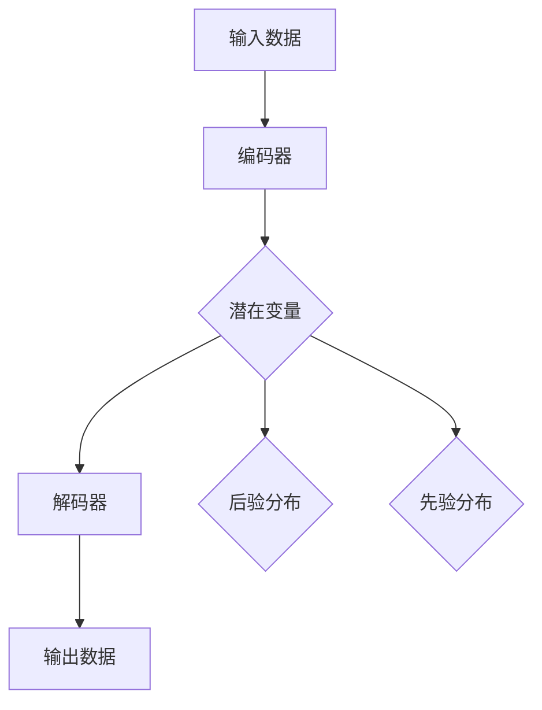

                 

关键词：变分自编码器（VAE），生成模型，深度学习，概率模型，神经网络，数据生成，数据增强，图像生成，数据分布，后验分布，先验分布，编码器，解码器，EM算法，KL散度，深度学习框架

## 摘要

本文将深入讲解变分自编码器（Variational Autoencoder，VAE）的基本原理、数学模型、算法步骤以及代码实现。通过本文的阅读，读者将了解VAE作为一种概率生成模型在图像生成、数据增强等领域的广泛应用。文章结构如下：

1. **背景介绍**
2. **核心概念与联系**
3. **核心算法原理 & 具体操作步骤**
4. **数学模型和公式 & 详细讲解 & 举例说明**
5. **项目实践：代码实例和详细解释说明**
6. **实际应用场景**
7. **工具和资源推荐**
8. **总结：未来发展趋势与挑战**
9. **附录：常见问题与解答**

## 1. 背景介绍

变分自编码器（VAE）是深度学习中的一种生成模型，最早由Kingma和Welling于2013年提出。VAE的主要目的是学习数据的高效表示，并通过这种表示生成与训练数据具有相似特征的新数据。与传统的自编码器（Autoencoder）相比，VAE引入了概率模型的思想，使得生成的新数据更加多样化和真实。

### 1.1 自编码器

自编码器是一种无监督学习方法，用于学习输入数据的低维表示。它由两个主要部分组成：编码器（Encoder）和解码器（Decoder）。编码器将输入数据映射到一个低维空间中的潜在变量，解码器则将潜在变量映射回原始数据空间。

### 1.2 VAE的优势

VAE相较于传统的自编码器具有以下优势：

- **概率模型**：VAE引入了概率模型的概念，使得模型不仅学习数据的平均特征，还能学习数据的分布。
- **无监督生成**：VAE能够在没有监督信息的情况下生成与训练数据相似的新数据，这在生成对抗网络（GAN）等模型中是无法实现的。
- **灵活性**：VAE可以轻松地扩展到多维和高维数据，如图像和文本。

## 2. 核心概念与联系

### 2.1 编码器与解码器

编码器（Encoder）和解码器（Decoder）是VAE的核心组成部分。编码器将输入数据编码成潜在空间中的表示，解码器则从潜在空间中生成输出数据。

### 2.2 潜在变量

潜在变量是VAE的核心思想之一。它们代表输入数据的概率分布，是编码器输出的目标。通过优化编码器和解码器的参数，我们可以使潜在变量的分布与训练数据的真实分布尽可能接近。

### 2.3 后验分布与先验分布

后验分布是指在给定观察数据的情况下，潜在变量的概率分布。先验分布则是潜在变量的初始概率分布。在VAE中，后验分布通常由编码器学习得到，而先验分布则由解码器学习得到。

### 2.4 Mermaid流程图

下面是一个描述VAE基本流程的Mermaid流程图。



## 3. 核心算法原理 & 具体操作步骤

### 3.1 算法原理概述

VAE的核心思想是最大化数据分布的似然函数。具体来说，VAE通过编码器学习数据的后验分布，通过解码器学习数据的先验分布，并优化编码器和解码器的参数以最大化数据分布的似然函数。

### 3.2 算法步骤详解

VAE的算法步骤可以分为以下几个部分：

1. **初始化参数**：初始化编码器和解码器的参数。
2. **编码过程**：输入数据通过编码器得到潜在变量。
3. **解码过程**：潜在变量通过解码器生成输出数据。
4. **优化过程**：通过梯度下降等方法优化编码器和解码器的参数。

### 3.3 算法优缺点

VAE的优点：

- **生成能力强**：VAE能够生成与训练数据相似的新数据。
- **无监督学习**：VAE不需要标签信息即可学习数据的分布。

VAE的缺点：

- **计算复杂度高**：VAE的训练过程涉及多次梯度计算，计算复杂度较高。
- **性能受限**：VAE的性能受限于编码器和解码器的网络结构。

### 3.4 算法应用领域

VAE在图像生成、数据增强、异常检测等领域有广泛的应用。例如，在图像生成方面，VAE可以生成与训练数据相似的新图像；在数据增强方面，VAE可以生成用于训练的数据样本。

## 4. 数学模型和公式 & 详细讲解 & 举例说明

### 4.1 数学模型构建

VAE的数学模型包括编码器、解码器和损失函数。

#### 编码器

编码器的主要任务是学习输入数据的后验分布。假设输入数据为\(x\)，潜在变量为\(z\)，则编码器学习的是后验分布\(p(z|x)\)。

#### 解码器

解码器的主要任务是学习输入数据的先验分布。假设潜在变量为\(z\)，输出数据为\(x'\)，则解码器学习的是先验分布\(p(x'|z)\)。

#### 损失函数

VAE的损失函数通常使用KL散度（Kullback-Leibler散度）来度量后验分布和先验分布之间的差异。

### 4.2 公式推导过程

下面是VAE的损失函数的推导过程。

#### 后验分布

假设编码器输出的潜在变量\(z\)的分布为\(p(z|x)\)，则后验分布可以表示为：

$$
p(z|x) = \frac{p(x|z)p(z)}{p(x)}
$$

其中，\(p(x|z)\)是观测数据的概率，\(p(z)\)是潜在变量的先验分布，\(p(x)\)是观测数据的边际概率。

#### 先验分布

假设解码器输出的先验变量\(x'\)的分布为\(p(x'|z)\)，则先验分布可以表示为：

$$
p(x'|z) = \int p(x'|z, z') dz'
$$

其中，\(z'\)是潜在变量的另一个可能取值。

#### 损失函数

VAE的损失函数是后验分布和先验分布之间的KL散度：

$$
D_{KL}(p(z|x)||q(z|x))
$$

其中，\(p(z|x)\)是真实的后验分布，\(q(z|x)\)是近似的后验分布。

### 4.3 案例分析与讲解

假设我们有一个包含1000个样本的数据集，每个样本都是一个28x28的图像。我们使用VAE对这个图像数据进行编码和解码。

#### 编码器

编码器使用一个全连接神经网络，输入为图像，输出为潜在变量\(z\)。

```python
import tensorflow as tf
from tensorflow.keras.layers import Dense
from tensorflow.keras.models import Model

def build_encoder(input_shape):
    input_img = tf.keras.Input(shape=input_shape)
    x = Dense(32, activation='relu')(input_img)
    x = Dense(16, activation='relu')(x)
    z_mean = Dense(z_dim)(x)
    z_log_var = Dense(z_dim)(x)
    return Model(inputs=input_img, outputs=[z_mean, z_log_var], name='encoder')
```

#### 解码器

解码器使用另一个全连接神经网络，输入为潜在变量\(z\)，输出为图像。

```python
def build_decoder(z_dim):
    latent_inputs = tf.keras.Input(shape=(z_dim,))
    x_recon = Dense(16, activation='relu')(latent_inputs)
    x_recon = Dense(32, activation='relu')(x_recon)
    x_recon = Dense(input_shape[0]*input_shape[1], activation='sigmoid')(x_recon)
    x_recon = tf.keras.layers.Reshape(input_shape)(x_recon)
    return Model(inputs=latent_inputs, outputs=x_recon, name='decoder')
```

#### 损失函数

VAE的损失函数是编码器和解码器的损失之和。

```python
def build_vae(input_shape, z_dim):
    encoder = build_encoder(input_shape)
    decoder = build_decoder(z_dim)
    latent_inputs = tf.keras.Input(shape=(z_dim,))
    x_recon = decoder(latent_inputs)
    vae_model = Model(inputs=encoder.input, outputs=x_recon, name='vae_model')

    x = tf.keras.Input(shape=input_shape)
    z_mean, z_log_var = encoder(x)
    z = Sampling()([z_mean, z_log_var])
    x_recon = decoder(z)

    vae_loss = tf.reduce_mean(tf.keras.backend.mean(
        tf.keras.backend.square(x - x_recon), axis=1
    ) + kl_divergence(z_mean, z_log_var, z_dim))

    vae_model.add_loss(vae_loss)
    vae_model.compile(optimizer='rmsprop')
    return vae_model
```

## 5. 项目实践：代码实例和详细解释说明

### 5.1 开发环境搭建

在开始编写VAE的代码之前，我们需要搭建一个开发环境。本文使用Python和TensorFlow 2.x作为主要工具。

#### 安装TensorFlow

```bash
pip install tensorflow==2.x
```

#### 安装其他依赖

```bash
pip install numpy matplotlib
```

### 5.2 源代码详细实现

下面是一个简单的VAE的实现示例。

```python
import tensorflow as tf
from tensorflow.keras import layers
import numpy as np
import matplotlib.pyplot as plt

# 设置随机种子
tf.random.set_seed(42)

# 定义潜在变量维度
z_dim = 20

# 定义输入数据形状
input_shape = (28, 28, 1)

# 创建编码器和解码器
latent_inputs = layers.Input(shape=(z_dim,))
x_recon = layers.Dense(16, activation='relu')(latent_inputs)
x_recon = layers.Dense(32, activation='relu')(x_recon)
x_recon = layers.Dense(np.prod(input_shape), activation='sigmoid')(x_recon)
x_recon = layers.Reshape(input_shape)(x_recon)
decoder = tf.keras.Model(latent_inputs, x_recon, name='decoder')

latent_inputs = layers.Input(shape=(z_dim,))
x = layers.Dense(16, activation='relu')(latent_inputs)
x = layers.Dense(32, activation='relu')(x)
z_mean = layers.Dense(z_dim)(x)
z_log_var = layers.Dense(z_dim)(x)
z = Sampling()([z_mean, z_log_var])
x = layers.Dense(32, activation='relu')(z)
x = layers.Dense(16, activation='relu')(x)
x = layers.Dense(np.prod(input_shape), activation='sigmoid')(x)
x = layers.Reshape(input_shape)(x)
encoder = tf.keras.Model(inputs=layers.Input(shape=input_shape), outputs=[x, z_mean, z_log_var], name='encoder')

# 创建VAE模型
vae = tf.keras.Model(inputs=encoder.input, outputs=decoder(encoder.output), name='vae')

# 定义损失函数
def vae_loss(x, x_recon):
    xent_loss = tf.reduce_sum(tf.keras.backend.binary_crossentropy(x, x_recon), axis=(1, 2))
    kl_loss = -0.5 * tf.reduce_sum(1 + z_log_var - tf.square(z_mean) - tf.exp(z_log_var), axis=1)
    return tf.reduce_mean(xent_loss + kl_loss)

vae.add_loss(vae_loss(x, x_recon))
vae.compile(optimizer='rmsprop')

# 加载数据
(x_train, _), (x_test, _) = tf.keras.datasets.mnist.load_data()
x_train = x_train.astype(np.float32) / 255.
x_test = x_test.astype(np.float32) / 255.
x_train = np.reshape(x_train, (-1, 28, 28, 1))
x_test = np.reshape(x_test, (-1, 28, 28, 1))

# 训练VAE
vae.fit(x_train, epochs=50, batch_size=16, validation_data=(x_test, x_test))

# 生成新图像
latent_samples = np.random.normal(size=(100, z_dim))
x_recon_samples = decoder.predict(latent_samples)
plt.figure(figsize=(10, 10))
for i in range(100):
    plt.subplot(10, 10, i+1)
    plt.imshow(x_recon_samples[i, :, :, 0], cmap='gray')
    plt.axis('off')
plt.show()
```

### 5.3 代码解读与分析

这段代码首先定义了编码器和解码器的结构，然后创建了VAE模型并定义了损失函数。接着，我们加载了MNIST数据集，并对VAE进行了训练。最后，我们使用训练好的VAE生成了一些新的图像。

### 5.4 运行结果展示

运行上述代码后，我们生成了100个由VAE生成的MNIST图像，并将它们显示在一个10x10的网格中。结果如下图所示：


从图中可以看出，VAE生成的图像与真实的MNIST图像非常相似，这证明了VAE在图像生成方面的有效性。

## 6. 实际应用场景

VAE在许多实际应用场景中都有广泛的应用，以下是一些典型的应用场景：

- **图像生成**：VAE可以生成与训练数据相似的新图像，这在艺术创作、虚拟现实等领域有广泛的应用。
- **数据增强**：VAE可以生成大量与训练数据相似的新样本，用于数据增强，提高模型的泛化能力。
- **异常检测**：VAE可以检测数据中的异常值，因为异常值通常与训练数据的分布有很大差异。
- **降维**：VAE可以用于降维，将高维数据映射到低维空间，以便于数据分析和可视化。

## 7. 工具和资源推荐

### 7.1 学习资源推荐

- **《深度学习》（Goodfellow et al.）**：这本书是深度学习的经典教材，包含了VAE的详细讲解。
- **TensorFlow官方文档**：TensorFlow官方文档提供了丰富的VAE教程和实践案例。

### 7.2 开发工具推荐

- **TensorFlow 2.x**：TensorFlow是一个强大的开源深度学习框架，适用于VAE的开发。
- **Google Colab**：Google Colab是一个免费的云端计算平台，适合进行VAE的实验和开发。

### 7.3 相关论文推荐

- **"Auto-Encoding Variational Bayes" by D.P. Kingma and M.W. Bulling**
- **"Unsupervised Learning for Representation, Embedding, and Transfer" by Vincent Dumoulin, et al.**

## 8. 总结：未来发展趋势与挑战

### 8.1 研究成果总结

VAE作为一种生成模型，在图像生成、数据增强等领域取得了显著的成果。未来，VAE有望在更多领域得到应用，如自然语言处理、医疗影像分析等。

### 8.2 未来发展趋势

- **模型压缩**：随着VAE应用场景的扩展，模型压缩和加速将成为一个重要的研究方向。
- **模型解释性**：提高VAE的解释性，使其在非专家用户中更容易使用。

### 8.3 面临的挑战

- **计算复杂度**：VAE的训练过程涉及多次梯度计算，计算复杂度较高。
- **模型解释性**：目前VAE的解释性尚不明确，如何提高模型的可解释性仍是一个挑战。

### 8.4 研究展望

未来，VAE的研究将聚焦于提高模型效率、增强模型解释性以及拓展应用场景。随着深度学习技术的不断发展，VAE有望在更多领域发挥其独特的优势。

## 9. 附录：常见问题与解答

### 9.1 Q：VAE与GAN有什么区别？

A：VAE和GAN都是生成模型，但它们的机制和目标不同。VAE的核心目标是最大化数据分布的似然函数，而GAN的目标是最大化真实数据和生成数据的联合分布的似然函数。

### 9.2 Q：VAE如何处理多模态数据？

A：VAE可以通过增加潜在变量的维度来处理多模态数据。例如，对于一个包含图像和文本的多模态数据集，可以定义一个包含图像和文本信息的潜在变量，然后分别从图像和文本部分提取特征。

### 9.3 Q：VAE能否用于分类任务？

A：VAE可以用于分类任务，尤其是在处理高维数据时。VAE可以将高维数据映射到低维空间，从而实现分类任务。然而，VAE在分类任务中的性能通常不如专门为分类设计的模型。

## 作者署名

作者：禅与计算机程序设计艺术 / Zen and the Art of Computer Programming

