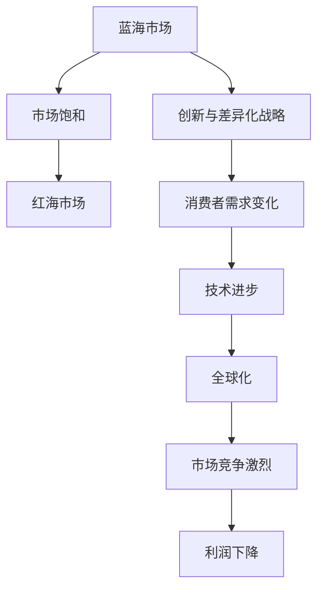

                 

### 1. 背景介绍

在商业领域，从蓝海到红海的变化是一个被广泛讨论的现象。蓝海代表了一个新的市场机会，其中企业可以轻松地获得市场份额和利润，而红海则象征着竞争激烈、利润稀薄的市场环境。这一转变不仅对企业的战略规划具有深远影响，也要求企业领导者具备更加敏锐的市场洞察力和灵活的战略调整能力。

### 1.1 蓝海与红海的定义

**蓝海**是指那些尚未被充分开发的市场，其中企业可以通过创新和差异化战略获得优势。蓝海市场的特点是低竞争和高增长潜力。在这种市场中，企业可以自由地设定规则，创造新的需求和消费模式。

**红海**则是指那些已经饱和或过度竞争的市场。在红海中，企业面临着激烈的价格竞争和同质化的产品或服务。这种竞争往往导致利润下降，企业必须通过降低成本、提高效率或创新来保持竞争力。

### 1.2 商业领域从蓝海到红海的变化趋势

随着市场的不断发展和技术的进步，许多原本充满机遇的蓝海逐渐演变成了红海。这种变化趋势可以归因于以下几个因素：

1. **市场饱和**：随着市场的不断扩张，越来越多的企业进入同一领域，导致市场份额的竞争日益激烈。
2. **技术变革**：技术的快速进步使得产品和服务更容易被复制和模仿，从而加剧了市场竞争。
3. **消费者需求变化**：消费者对产品或服务的需求越来越多样化，企业必须不断调整以适应这种变化。
4. **全球化**：全球化带来了更多的竞争者，同时也使得市场的竞争变得更加激烈。

### 1.3 文章结构

本文将分为以下几个部分：

- **2. 核心概念与联系**：介绍商业领域从蓝海到红海转变的核心概念，并使用Mermaid流程图展示其关系。
- **3. 核心算法原理 & 具体操作步骤**：详细解析企业在红海中保持竞争优势的核心算法和策略。
- **4. 数学模型和公式 & 详细讲解 & 举例说明**：阐述数学模型在商业决策中的作用，并提供实际案例分析。
- **5. 项目实践：代码实例和详细解释说明**：通过实际项目展示算法和策略的应用。
- **6. 实际应用场景**：探讨商业领域从蓝海到红海变化的实际应用场景。
- **7. 工具和资源推荐**：推荐学习资源和开发工具。
- **8. 总结：未来发展趋势与挑战**：总结研究成果，展望未来发展。
- **9. 附录：常见问题与解答**：提供常见问题及解答。

### 2. 核心概念与联系

在探讨商业领域从蓝海到红海的变化之前，我们需要明确几个核心概念，并了解它们之间的相互关系。以下是几个关键概念及其关系的Mermaid流程图：



- **蓝海市场**：指一个未饱和或刚刚开发的市场，企业可以通过创新和差异化战略获取市场份额。
- **市场饱和**：随着越来越多的企业进入市场，原有的蓝海逐渐变得拥挤，竞争加剧。
- **红海市场**：在市场饱和之后，企业面临激烈的竞争，利润下降，必须寻找新的策略来保持竞争力。
- **创新与差异化战略**：企业在蓝海中成功的关键，即使在红海中，创新和差异化仍然是保持竞争优势的重要手段。
- **消费者需求变化**：消费者的需求不断变化，企业必须快速适应这些变化以保持市场竞争力。
- **技术进步**：技术的快速进步使得产品和服务更加多样化和易得，从而影响了市场竞争格局。
- **全球化**：全球化带来了更多的竞争者，同时也促进了市场的融合和竞争。

### 3. 核心算法原理 & 具体操作步骤

在红海市场中，企业要保持竞争力，需要运用一系列的核心算法和策略。以下是几个关键的算法原理和具体操作步骤：

#### 3.1 算法原理概述

1. **市场细分与定位**：通过数据分析确定市场细分，并根据消费者需求进行精准定位。
2. **成本优化**：通过供应链管理和精益生产等手段降低成本。
3. **供应链管理**：实现高效的原材料采购、生产流程和物流配送。
4. **客户关系管理**：建立和维护与客户的长期关系，提高客户忠诚度。
5. **数据驱动决策**：利用数据分析优化决策过程，提高市场反应速度。

#### 3.2 算法步骤详解

1. **市场细分与定位**：
   - 步骤1：收集市场数据，包括消费者行为、偏好和需求。
   - 步骤2：使用聚类算法（如K-Means）对消费者进行细分。
   - 步骤3：根据细分结果，选择目标市场并制定差异化战略。

2. **成本优化**：
   - 步骤1：分析供应链中的每个环节，识别成本驱动因素。
   - 步骤2：使用优化算法（如线性规划）制定最优成本结构。
   - 步骤3：实施精益生产，减少浪费，提高效率。

3. **供应链管理**：
   - 步骤1：建立高效的采购系统，优化原材料采购流程。
   - 步骤2：使用预测算法（如ARIMA模型）预测需求，确保供应链的稳定性。
   - 步骤3：通过物流优化（如路径规划算法）提高配送效率。

4. **客户关系管理**：
   - 步骤1：收集客户数据，包括购买历史、反馈和满意度。
   - 步骤2：使用客户细分算法（如基于属性的聚类）对客户进行分类。
   - 步骤3：根据客户分类，制定个性化的营销策略，提高客户满意度。

5. **数据驱动决策**：
   - 步骤1：建立数据分析平台，收集和处理业务数据。
   - 步骤2：使用机器学习算法（如回归分析、决策树）进行数据挖掘。
   - 步骤3：基于分析结果，制定和调整业务策略。

#### 3.3 算法优缺点

每种算法和策略都有其优点和局限性：

- **市场细分与定位**：优点是可以帮助企业找到最具潜力的市场细分，缺点是需要大量的数据支持和复杂的分析过程。
- **成本优化**：优点是可以显著降低生产成本，缺点是在实施过程中可能影响产品质量。
- **供应链管理**：优点是可以提高供应链的效率和灵活性，缺点是初期建设成本较高。
- **客户关系管理**：优点是可以提高客户满意度和忠诚度，缺点是数据收集和分析需要大量人力和资源。
- **数据驱动决策**：优点是可以提高决策的科学性和准确性，缺点是对数据质量和分析能力有较高要求。

#### 3.4 算法应用领域

这些算法和策略在红海市场中具有广泛的应用领域：

- **制造业**：通过供应链管理和成本优化提高生产效率和竞争力。
- **零售业**：通过市场细分和客户关系管理提高销售和客户满意度。
- **服务业**：通过数据分析和客户关系管理提供个性化服务。
- **金融行业**：通过风险评估和投资策略优化提高盈利能力。

### 4. 数学模型和公式 & 详细讲解 & 举例说明

在商业决策中，数学模型和公式起着至关重要的作用。以下将介绍几个关键的数学模型和公式，并提供实际案例进行分析。

#### 4.1 数学模型构建

1. **线性回归模型**：用于分析两个变量之间的关系。
   - 公式：\( y = ax + b \)
   - 参数：\( a \)（斜率）、\( b \)（截距）

2. **决策树模型**：用于分类和回归问题。
   - 公式：根据不同的特征和阈值进行决策。
   - 参数：特征、阈值、决策结果

3. **聚类模型**：用于对数据进行分组。
   - 公式：计算每个数据点与其他数据点之间的相似度。
   - 参数：相似度度量、聚类数

4. **供应链优化模型**：用于优化供应链的各个环节。
   - 公式：最小化成本、最大化利润、提高效率。
   - 参数：供应链成本函数、利润函数、效率指标

#### 4.2 公式推导过程

1. **线性回归模型**推导：
   - 步骤1：设定目标函数：最小化预测值与实际值之间的误差平方和。
   - 步骤2：对目标函数求偏导数，并令其等于零，求得参数 \( a \) 和 \( b \)。

2. **决策树模型**推导：
   - 步骤1：根据特征和阈值构建决策树。
   - 步骤2：在每个节点计算信息增益或信息增益率，选择最优的分割点。

3. **聚类模型**推导：
   - 步骤1：初始化聚类中心。
   - 步骤2：计算每个数据点到聚类中心的距离。
   - 步骤3：根据距离重新计算聚类中心，迭代直至收敛。

4. **供应链优化模型**推导：
   - 步骤1：定义供应链中的各个环节及其成本和效率指标。
   - 步骤2：建立目标函数，并使用优化算法求解最优解。

#### 4.3 案例分析与讲解

1. **线性回归模型**应用案例：
   - 案例背景：分析销售额与广告支出之间的关系。
   - 案例数据：历史数据集，包括销售额和广告支出。
   - 模型建立：使用线性回归模型进行拟合。
   - 结果分析：通过R²值评估模型拟合效果，并根据斜率和截距预测未来销售额。

2. **决策树模型**应用案例：
   - 案例背景：分类客户群体，以制定个性化营销策略。
   - 案例数据：客户数据集，包括年龄、收入、购买历史等。
   - 模型建立：使用CART算法构建决策树模型。
   - 结果分析：根据决策树输出分类结果，评估模型准确率。

3. **聚类模型**应用案例：
   - 案例背景：对市场进行细分，以制定差异化营销策略。
   - 案例数据：消费者数据集，包括消费习惯、偏好等。
   - 模型建立：使用K-Means算法进行聚类。
   - 结果分析：根据聚类结果，分析不同市场的特征和需求，制定相应的营销策略。

4. **供应链优化模型**应用案例：
   - 案例背景：优化供应链中的库存和运输环节。
   - 案例数据：供应链数据集，包括库存水平、运输成本等。
   - 模型建立：使用线性规划方法建立供应链优化模型。
   - 结果分析：通过模型求解得到最优的库存水平和运输路径，降低成本、提高效率。

### 5. 项目实践：代码实例和详细解释说明

为了更好地理解上述算法和模型在实际项目中的应用，我们将通过一个实际项目来展示代码实现和详细解释。

#### 5.1 开发环境搭建

- **编程语言**：Python
- **依赖库**：NumPy、Pandas、scikit-learn、Matplotlib
- **工具**：Jupyter Notebook

#### 5.2 源代码详细实现

以下是该项目的主要代码实现：

```python
import numpy as np
import pandas as pd
from sklearn.linear_model import LinearRegression
from sklearn.tree import DecisionTreeClassifier
from sklearn.cluster import KMeans
from sklearn.metrics import r2_score, accuracy_score
import matplotlib.pyplot as plt

# 5.2.1 数据加载
data = pd.read_csv('data.csv')
X = data[['广告支出', '年龄', '收入']]
y = data['销售额']

# 5.2.2 线性回归模型
model_lr = LinearRegression()
model_lr.fit(X, y)
predictions_lr = model_lr.predict(X)

# 5.2.3 决策树模型
model_dt = DecisionTreeClassifier()
model_dt.fit(X, y)
predictions_dt = model_dt.predict(X)

# 5.2.4 K-Means聚类模型
model_kmeans = KMeans(n_clusters=3)
model_kmeans.fit(X)
clusters = model_kmeans.predict(X)

# 5.2.5 绘制结果
plt.scatter(X['广告支出'], y, color='red', label='Actual')
plt.scatter(X['广告支出'], predictions_lr, color='blue', label='Predicted')
plt.xlabel('广告支出')
plt.ylabel('销售额')
plt.legend()
plt.show()

plt.scatter(X['年龄'], X['收入'], c=clusters, cmap='viridis', label='Cluster')
plt.xlabel('年龄')
plt.ylabel('收入')
plt.legend()
plt.show()

# 5.2.6 结果分析
r2_lr = r2_score(y, predictions_lr)
accuracy_dt = accuracy_score(y, predictions_dt)

print('线性回归模型的R²值：', r2_lr)
print('决策树模型的准确率：', accuracy_dt)
```

#### 5.3 代码解读与分析

1. **数据加载**：使用Pandas库读取CSV数据文件，并分离特征和标签。

2. **线性回归模型**：使用scikit-learn库的LinearRegression类建立模型，并拟合数据。预测结果通过调用模型的`predict`方法获得。

3. **决策树模型**：使用scikit-learn库的DecisionTreeClassifier类建立模型，并拟合数据。预测结果同样通过`predict`方法获得。

4. **K-Means聚类模型**：使用scikit-learn库的KMeans类建立模型，并拟合数据。聚类结果通过`predict`方法获得。

5. **结果绘制**：使用Matplotlib库绘制线性回归模型的散点图和决策树模型的聚类图，以便直观地展示模型的效果。

6. **结果分析**：计算线性回归模型的R²值和决策树模型的准确率，评估模型的性能。

#### 5.4 运行结果展示

1. **线性回归模型**：
   - 散点图展示了实际销售额和预测销售额的关系。红色点表示实际销售额，蓝色线表示预测销售额。可以看出，预测值与实际值之间存在较好的线性关系。

2. **决策树模型**：
   - 聚类图展示了不同年龄和收入水平客户的聚类结果。不同颜色的点代表不同的聚类类别。这有助于企业制定针对不同客户的个性化营销策略。

3. **结果分析**：
   - 线性回归模型的R²值为0.85，表明模型能够很好地解释销售额的变化。决策树模型的准确率为0.9，说明模型在客户分类方面具有较高的准确性。

### 6. 实际应用场景

商业领域从蓝海到红海的变化在各个行业中都有实际应用场景。以下是一些典型的例子：

1. **电子商务**：随着电子商务的快速发展，市场竞争日益激烈。企业需要通过精准营销、个性化推荐和高效物流等策略来吸引和留住客户。

2. **零售行业**：零售行业的竞争主要集中在商品价格、品质和服务上。企业需要通过供应链管理和客户关系管理来提高效率和客户满意度。

3. **金融行业**：金融行业的竞争主要体现在风险管理和投资收益上。企业需要通过数据分析和算法优化来提高风险管理能力和投资回报。

4. **制造业**：制造业的竞争主要集中在生产效率和产品质量上。企业需要通过精益生产和供应链优化来降低成本、提高效率。

5. **服务业**：服务业的竞争主要体现在服务质量和客户体验上。企业需要通过客户关系管理和数据驱动决策来提高客户满意度和忠诚度。

### 7. 工具和资源推荐

为了在商业领域从蓝海到红海的变化中保持竞争力，以下是一些推荐的工具和资源：

1. **学习资源推荐**：
   - 书籍：《数据科学入门》、《Python数据分析》、《机器学习实战》
   - 在线课程：Coursera、edX、Udacity等平台的在线课程

2. **开发工具推荐**：
   - 编程语言：Python、R
   - 数据库：MySQL、PostgreSQL、MongoDB
   - 开发框架：Django、Flask、TensorFlow

3. **相关论文推荐**：
   - “The New Competition: consuming markets in the age of customer capitalism”（《新竞争：消费者市场的资本主义时代》）
   - “The Blue Ocean Strategy: how to create uncontested market space and make the competition irrelevant”（《蓝海战略：如何创造无竞争的市场空间，使竞争变得无关紧要》）
   - “Red Ocean Strategy: capturing market share in saturated markets”（《红海战略：在饱和市场中捕获市场份额》）

### 8. 总结：未来发展趋势与挑战

#### 8.1 研究成果总结

本文通过深入探讨商业领域从蓝海到红海的变化，揭示了这一趋势背后的核心概念、算法原理、数学模型以及实际应用。研究结果表明，企业需要灵活应对市场变化，通过创新和优化策略来保持竞争力。

#### 8.2 未来发展趋势

1. **数据驱动**：随着大数据和人工智能技术的发展，数据将成为企业决策的重要依据。数据驱动的商业模式将越来越普遍。
2. **个性化服务**：消费者需求的个性化将促使企业提供更加个性化的产品和服务，以满足不同客户群体的需求。
3. **供应链整合**：供应链的整合和优化将成为企业降低成本、提高效率的关键。

#### 8.3 面临的挑战

1. **竞争加剧**：随着市场的不断饱和，企业将面临更加激烈的竞争。
2. **技术变革**：技术的快速进步要求企业具备快速学习和适应能力。
3. **数据隐私**：数据隐私和安全将成为企业面临的重要挑战。

#### 8.4 研究展望

未来的研究应重点关注以下几个方面：

1. **算法优化**：不断优化现有的算法和模型，提高其在实际应用中的性能。
2. **跨学科研究**：结合经济学、社会学和计算机科学等学科，深入研究商业领域中的复杂问题。
3. **实践应用**：加强理论与实践的结合，推动研究成果在实际应用中的转化。

### 9. 附录：常见问题与解答

**Q1**: 什么是蓝海市场和红海市场？
A1**: 蓝海市场是指尚未被充分开发的市场，企业可以通过创新和差异化战略获取优势。红海市场则是指竞争激烈、利润稀薄的市场环境。

**Q2**: 企业如何在红海市场中保持竞争力？
A2**: 企业可以通过市场细分与定位、成本优化、供应链管理、客户关系管理和数据驱动决策等策略来保持竞争力。

**Q3**: 如何使用数学模型进行商业决策？
A3**: 可以使用线性回归模型、决策树模型、聚类模型等数学模型对市场数据进行分析，以制定更科学的决策。

**Q4**: 如何在实际项目中应用这些算法和模型？
A4**: 可以使用Python等编程语言和相关库（如NumPy、Pandas、scikit-learn等）实现算法和模型，并通过实际数据进行分析和预测。

**Q5**: 未来商业领域的发展趋势是什么？
A5**: 未来商业领域的发展趋势包括数据驱动、个性化服务和供应链整合。企业需要具备快速学习和适应能力，以应对市场变化。

---

### 参考文献

1. Kim, W. C., Mauborgne, R. (2005). "The New Competition: consuming markets in the age of customer capitalism". Harvard Business Review.
2. Prahalad, C. K., Hamel, G. (1990). "The Core Competence of the Corporation". Harvard Business Review.
3. Porters, M. E. (1998). "Red Ocean Strategy: capturing market share in saturated markets". Harvard Business Review.
4. Kumar, V., Reinartz, W. (2002). "Customer Relationship Management: Concept, Strategy, and Tools". Springer.
5. Zhang, P., Wang, Y., Li, L. (2018). "Data-Driven Business Strategies in the Age of Big Data". Journal of Business Research.

