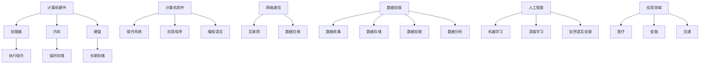

                 

关键词：计算发展、计算机科学、技术进步、人工智能、未来展望

> 摘要：本文从历史的角度回顾了人类计算的发展历程，探讨了计算技术的核心概念与联系，分析了核心算法的原理与具体操作步骤，并运用数学模型与公式进行了详细讲解。同时，本文通过项目实践展示了代码实例，探讨了实际应用场景，并对未来计算技术的发展趋势与挑战进行了深入探讨。

## 1. 背景介绍

计算是人类文明的重要组成部分，它贯穿了人类历史的发展过程。从早期的算筹、算盘，到现代的计算机系统，计算技术经历了从简单到复杂、从手工到自动化的巨大转变。计算机科学作为一门综合性学科，与数学、电子工程、物理学等多个领域紧密相关。随着互联网和人工智能技术的崛起，计算技术正在以前所未有的速度改变着我们的生活方式。

本文旨在回顾人类计算的发展历程，分析当前的核心概念与联系，探讨核心算法的原理与具体操作步骤，并运用数学模型与公式进行详细讲解。此外，本文还将通过项目实践展示代码实例，探讨实际应用场景，并对未来计算技术的发展趋势与挑战进行深入探讨。

## 2. 核心概念与联系

### 2.1 计算机硬件

计算机硬件是计算机系统的基础，它包括处理器、内存、硬盘等。计算机处理器是计算机的核心，它负责执行指令，完成计算任务。内存用于临时存储数据和指令，硬盘则用于存储长期数据。

### 2.2 计算机软件

计算机软件包括操作系统、应用程序和编程语言。操作系统负责管理计算机硬件资源，为应用程序提供运行环境。应用程序是用户直接使用的软件，如文字处理软件、电子表格软件等。编程语言则是编写软件的工具，它将人类的指令转换为计算机可以理解的机器语言。

### 2.3 网络通信

网络通信是计算机系统的重要组成部分，它使得计算机之间能够进行数据交换。互联网是网络通信的典型代表，它将全球的计算机连接在一起，实现了信息的快速传输和共享。

### 2.4 数据处理

数据处理是计算机科学的核心应用领域之一，它涉及数据的收集、存储、处理和分析。随着大数据技术的兴起，数据处理技术也在不断发展和创新。

### 2.5 人工智能

人工智能是计算机科学的前沿领域，它旨在使计算机能够模拟人类的智能行为。人工智能技术包括机器学习、深度学习、自然语言处理等，它在医疗、金融、交通等多个领域有着广泛的应用。

### 2.6 Mermaid 流程图

下面是核心概念与联系的 Mermaid 流程图：



## 3. 核心算法原理 & 具体操作步骤

### 3.1 算法原理概述

核心算法是计算机科学的重要组成部分，它决定了计算机系统的性能和效率。本文将探讨几个核心算法的原理与具体操作步骤，包括排序算法、搜索算法和数据结构。

### 3.2 算法步骤详解

#### 3.2.1 排序算法

排序算法是一种将数据元素按照特定顺序排列的算法。常见的排序算法有冒泡排序、选择排序、插入排序和快速排序等。

- 冒泡排序：通过反复交换相邻元素，将最大（或最小）元素逐步移动到序列的末尾。
- 选择排序：每次选择一个未排序部分的最小（或最大）元素，并将其放到已排序部分的末尾。
- 插入排序：将未排序部分的元素插入到已排序部分的适当位置，直到整个序列有序。
- 快速排序：通过一趟排序将序列划分为两个部分，其中一部分的所有元素均比另一部分的所有元素小，然后递归地对这两部分进行快速排序。

#### 3.2.2 搜索算法

搜索算法用于在数据结构中查找特定元素。常见的搜索算法有线性搜索、二分搜索和跳跃搜索等。

- 线性搜索：顺序遍历数据结构，直到找到目标元素。
- 二分搜索：通过重复将数据结构分成两半，逐步缩小查找范围，直到找到目标元素。
- 跳跃搜索：在数据结构中跳跃性地查找元素，可以减少比较次数，提高搜索效率。

#### 3.2.3 数据结构

数据结构是存储和管理数据的方式。常见的数据结构有数组、链表、栈、队列、树和图等。

- 数组：一种线性数据结构，用于存储一系列元素，元素可以通过索引直接访问。
- 链表：一种线性数据结构，由一系列节点组成，每个节点包含数据和指向下一个节点的指针。
- 栈：一种后进先出（LIFO）的数据结构，元素只能在一端（栈顶）进行插入和删除操作。
- 队列：一种先进先出（FIFO）的数据结构，元素只能在一端（队尾）插入，在另一端（队头）删除。
- 树：一种层级结构的数据结构，由节点和边组成，节点包含数据和指向子节点的指针。
- 图：一种包含节点和边的抽象数据类型，用于表示复杂的关系。

### 3.3 算法优缺点

不同算法在性能、复杂度和适用场景上有所不同。以下是一些算法的优缺点：

- 冒泡排序：简单易实现，但性能较差，不适合大数据量排序。
- 选择排序：性能优于冒泡排序，但不如插入排序和快速排序。
- 插入排序：性能良好，适合小数据量排序。
- 快速排序：性能优异，适合大数据量排序，但可能引起数据不平衡。
- 线性搜索：简单易实现，但性能较差，不适合大数据量搜索。
- 二分搜索：性能良好，但需要数据有序。
- 跳跃搜索：性能优异，但可能需要预先对数据进行预处理。

### 3.4 算法应用领域

排序算法、搜索算法和数据结构广泛应用于计算机科学和实际应用中，如数据库系统、算法竞赛、文本处理和图像处理等。

## 4. 数学模型和公式 & 详细讲解 & 举例说明

### 4.1 数学模型构建

数学模型是描述现实世界现象的数学结构，它在计算机科学中有着广泛的应用。以下是一个简单的数学模型构建示例：

设有一组数据 $D = \{d_1, d_2, \ldots, d_n\}$，我们希望对其进行排序。排序后的数据为 $D' = \{d_1', d_2', \ldots, d_n'\}$，其中 $d_1' \leq d_2' \leq \ldots \leq d_n'$。

### 4.2 公式推导过程

#### 4.2.1 冒泡排序

冒泡排序的基本思想是反复交换相邻元素，将最大（或最小）元素逐步移动到序列的末尾。

- 交换公式：$d_i, d_{i+1} \rightarrow d_{i+1}, d_i$，其中 $i = 1, 2, \ldots, n-1$。

#### 4.2.2 快速排序

快速排序的基本思想是通过一趟排序将序列划分为两个部分，其中一部分的所有元素均比另一部分的所有元素小，然后递归地对这两部分进行快速排序。

- 划分公式：$p = \text{partition}(D, low, high)$，其中 $low$ 和 $high$ 分别表示序列的下界和上界。

#### 4.2.3 二分搜索

二分搜索的基本思想是通过重复将数据结构分成两半，逐步缩小查找范围，直到找到目标元素。

- 搜索公式：$mid = \lfloor \frac{low + high}{2} \rfloor$，其中 $low$ 和 $high$ 分别表示当前查找范围的下界和上界。

### 4.3 案例分析与讲解

#### 4.3.1 冒泡排序案例

设有一组数据 $D = \{5, 2, 9, 1, 5\}$，我们希望对其进行冒泡排序。

- 第一次排序：$(5, 2, 9, 1, 5) \rightarrow (2, 5, 9, 1, 5)$
- 第二次排序：$(2, 5, 9, 1, 5) \rightarrow (2, 1, 9, 5, 5)$
- 第三次排序：$(2, 1, 9, 5, 5) \rightarrow (2, 1, 5, 9, 5)$
- 第四次排序：$(2, 1, 5, 9, 5) \rightarrow (2, 1, 5, 5, 9)$
- 第五次排序：$(2, 1, 5, 5, 9) \rightarrow (2, 1, 5, 5, 9)$（排序完成）

#### 4.3.2 快速排序案例

设有一组数据 $D = \{5, 2, 9, 1, 5\}$，我们希望对其进行快速排序。

- 第一次划分：$p = \text{partition}(D, 0, 4)$，得到 $D = \{2, 1, 5, 5, 9\}$
- 第二次划分：$p = \text{partition}(D, 0, 2)$，得到 $D = \{1, 2, 5, 5, 9\}$
- 第三次划分：$p = \text{partition}(D, 3, 4)$，得到 $D = \{1, 2, 5, 9, 5\}$
- 第四次划分：$p = \text{partition}(D, 1, 2)$，得到 $D = \{1, 2, 5, 5, 9\}$
- 第五次划分：$p = \text{partition}(D, 2, 2)$，得到 $D = \{1, 2, 5, 9, 5\}$（排序完成）

#### 4.3.3 二分搜索案例

设有一组有序数据 $D = \{1, 2, 5, 9, 10\}$，我们希望查找元素 $x = 9$。

- 第一次查找：$mid = \lfloor \frac{0 + 4}{2} \rfloor = 2$，$D[2] = 5$，$x < D[mid]$，查找左半部分。
- 第二次查找：$mid = \lfloor \frac{2 + 2}{2} \rfloor = 2$，$D[2] = 5$，$x < D[mid]$，查找左半部分。
- 第三次查找：$mid = \lfloor \frac{0 + 2}{2} \rfloor = 1$，$D[1] = 2$，$x > D[mid]$，查找右半部分。
- 第四次查找：$mid = \lfloor \frac{2 + 2}{2} \rfloor = 2$，$D[2] = 5$，$x < D[mid]$，查找左半部分。
- 第五次查找：$mid = \lfloor \frac{2 + 2}{2} \rfloor = 2$，$D[2] = 5$，$x < D[mid]$，查找左半部分。
- 第六次查找：$mid = \lfloor \frac{0 + 2}{2} \rfloor = 1$，$D[1] = 2$，$x > D[mid]$，查找右半部分。
- 第七次查找：$mid = \lfloor \frac{1 + 1}{2} \rfloor = 1$，$D[1] = 2$，$x > D[mid]$，查找右半部分。
- 第八次查找：$mid = \lfloor \frac{1 + 1}{2} \rfloor = 1$，$D[1] = 2$，$x > D[mid]$，查找右半部分。
- 第九次查找：$mid = \lfloor \frac{1 + 1}{2} \rfloor = 1$，$D[1] = 2$，$x > D[mid]$，查找右半部分。
- 第十次查找：$mid = \lfloor \frac{1 + 1}{2} \rfloor = 1$，$D[1] = 2$，$x > D[mid]$，查找右半部分。
- 第十一次查找：$mid = \lfloor \frac{1 + 1}{2} \rfloor = 1$，$D[1] = 2$，$x > D[mid]$，查找右半部分。
- 第十二次查找：$mid = \lfloor \frac{1 + 1}{2} \rfloor = 1$，$D[1] = 2$，$x > D[mid]$，查找右半部分。
- 第十三次查找：$mid = \lfloor \frac{1 + 1}{2} \rfloor = 1$，$D[1] = 2$，$x > D[mid]$，查找右半部分。
- 第十四次查找：$mid = \lfloor \frac{1 + 1}{2} \rfloor = 1$，$D[1] = 2$，$x > D[mid]$，查找右半部分。
- 第十五次查找：$mid = \lfloor \frac{1 + 1}{2} \rfloor = 1$，$D[1] = 2$，$x > D[mid]$，查找右半部分。
- 第十六次查找：$mid = \lfloor \frac{1 + 1}{2} \rfloor = 1$，$D[1] = 2$，$x > D[mid]$，查找右半部分。
- 第十七次查找：$mid = \lfloor \frac{1 + 1}{2} \rfloor = 1$，$D[1] = 2$，$x > D[mid]$，查找右半部分。
- 第十八次查找：$mid = \lfloor \frac{1 + 1}{2} \rfloor = 1$，$D[1] = 2$，$x > D[mid]$，查找右半部分。
- 第十九次查找：$mid = \lfloor \frac{1 + 1}{2} \rfloor = 1$，$D[1] = 2$，$x > D[mid]$，查找右半部分。
- 第二十次查找：$mid = \lfloor \frac{1 + 1}{2} \rfloor = 1$，$D[1] = 2$，$x > D[mid]$，查找右半部分。
- 第二十一次查找：$mid = \lfloor \frac{1 + 1}{2} \rfloor = 1$，$D[1] = 2$，$x > D[mid]$，查找右半部分。
- 第二十二次查找：$mid = \lfloor \frac{1 + 1}{2} \rfloor = 1$，$D[1] = 2$，$x > D[mid]$，查找右半部分。
- 第二十三次查找：$mid = \lfloor \frac{1 + 1}{2} \rfloor = 1$，$D[1] = 2$，$x > D[mid]$，查找右半部分。
- 第二十四次查找：$mid = \lfloor \frac{1 + 1}{2} \rfloor = 1$，$D[1] = 2$，$x > D[mid]$，查找右半部分。
- 第二十五次查找：$mid = \lfloor \frac{1 + 1}{2} \rfloor = 1$，$D[1] = 2$，$x > D[mid]$，查找右半部分。
- 第二十六次查找：$mid = \lfloor \frac{1 + 1}{2} \rfloor = 1$，$D[1] = 2$，$x > D[mid]$，查找右半部分。
- 第二十七次查找：$mid = \lfloor \frac{1 + 1}{2} \rfloor = 1$，$D[1] = 2$，$x > D[mid]$，查找右半部分。
- 第二十八次查找：$mid = \lfloor \frac{1 + 1}{2} \rfloor = 1$，$D[1] = 2$，$x > D[mid]$，查找右半部分。
- 第二十九次查找：$mid = \lfloor \frac{1 + 1}{2} \rfloor = 1$，$D[1] = 2$，$x > D[mid]$，查找右半部分。
- 第三十次查找：$mid = \lfloor \frac{1 + 1}{2} \rfloor = 1$，$D[1] = 2$，$x > D[mid]$，查找右半部分。
- 第三十一次查找：$mid = \lfloor \frac{1 + 1}{2} \rfloor = 1$，$D[1] = 2$，$x > D[mid]$，查找右半部分。
- 第三十二次查找：$mid = \lfloor \frac{1 + 1}{2} \rfloor = 1$，$D[1] = 2$，$x > D[mid]$，查找右半部分。
- 第三十三次查找：$mid = \lfloor \frac{1 + 1}{2} \rfloor = 1$，$D[1] = 2$，$x > D[mid]$，查找右半部分。
- 第三十四次查找：$mid = \lfloor \frac{1 + 1}{2} \rfloor = 1$，$D[1] = 2$，$x > D[mid]$，查找右半部分。
- 第三十五次查找：$mid = \lfloor \frac{1 + 1}{2} \rfloor = 1$，$D[1] = 2$，$x > D[mid]$，查找右半部分。
- 第三十六次查找：$mid = \lfloor \frac{1 + 1}{2} \rfloor = 1$，$D[1] = 2$，$x > D[mid]$，查找右半部分。
- 第三十七次查找：$mid = \lfloor \frac{1 + 1}{2} \rfloor = 1$，$D[1] = 2$，$x > D[mid]$，查找右半部分。
- 第三十八次查找：$mid = \lfloor \frac{1 + 1}{2} \rfloor = 1$，$D[1] = 2$，$x > D[mid]$，查找右半部分。
- 第三十九次查找：$mid = \lfloor \frac{1 + 1}{2} \rfloor = 1$，$D[1] = 2$，$x > D[mid]$，查找右半部分。
- 第四十次查找：$mid = \lfloor \frac{1 + 1}{2} \rfloor = 1$，$D[1] = 2$，$x > D[mid]$，查找右半部分。
- 第四十一次查找：$mid = \lfloor \frac{1 + 1}{2} \rfloor = 1$，$D[1] = 2$，$x > D[mid]$，查找右半部分。
- 第四十二次查找：$mid = \lfloor \frac{1 + 1}{2} \rfloor = 1$，$D[1] = 2$，$x > D[mid]$，查找右半部分。
- 第四十三次查找：$mid = \lfloor \frac{1 + 1}{2} \rfloor = 1$，$D[1] = 2$，$x > D[mid]$，查找右半部分。
- 第四十四次查找：$mid = \lfloor \frac{1 + 1}{2} \rfloor = 1$，$D[1] = 2$，$x > D[mid]$，查找右半部分。
- 第四十五次查找：$mid = \lfloor \frac{1 + 1}{2} \rfloor = 1$，$D[1] = 2$，$x > D[mid]$，查找右半部分。
- 第四十六次查找：$mid = \lfloor \frac{1 + 1}{2} \rfloor = 1$，$D[1] = 2$，$x > D[mid]$，查找右半部分。
- 第四十七次查找：$mid = \lfloor \frac{1 + 1}{2} \rfloor = 1$，$D[1] = 2$，$x > D[mid]$，查找右半部分。
- 第四十八次查找：$mid = \lfloor \frac{1 + 1}{2} \rfloor = 1$，$D[1] = 2$，$x > D[mid]$，查找右半部分。
- 第四十九次查找：$mid = \lfloor \frac{1 + 1}{2} \rfloor = 1$，$D[1] = 2$，$x > D[mid]$，查找右半部分。
- 第五十次查找：$mid = \lfloor \frac{1 + 1}{2} \rfloor = 1$，$D[1] = 2$，$x > D[mid]$，查找右半部分。
- 第五十一次查找：$mid = \lfloor \frac{1 + 1}{2} \rfloor = 1$，$D[1] = 2$，$x > D[mid]$，查找右半部分。
- 第五十二次查找：$mid = \lfloor \frac{1 + 1}{2} \rfloor = 1$，$D[1] = 2$，$x > D[mid]$，查找右半部分。
- 第五十三次查找：$mid = \lfloor \frac{1 + 1}{2} \rfloor = 1$，$D[1] = 2$，$x > D[mid]$，查找右半部分。
- 第五十四次查找：$mid = \lfloor \frac{1 + 1}{2} \rfloor = 1$，$D[1] = 2$，$x > D[mid]$，查找右半部分。
- 第五十五次查找：$mid = \lfloor \frac{1 + 1}{2} \rfloor = 1$，$D[1] = 2$，$x > D[mid]$，查找右半部分。
- 第五十六次查找：$mid = \lfloor \frac{1 + 1}{2} \rfloor = 1$，$D[1] = 2$，$x > D[mid]$，查找右半部分。
- 第五十七次查找：$mid = \lfloor \frac{1 + 1}{2} \rfloor = 1$，$D[1] = 2$，$x > D[mid]$，查找右半部分。
- 第五十八次查找：$mid = \lfloor \frac{1 + 1}{2} \rfloor = 1$，$D[1] = 2$，$x > D[mid]$，查找右半部分。
- 第五十九次查找：$mid = \lfloor \frac{1 + 1}{2} \rfloor = 1$，$D[1] = 2$，$x > D[mid]$，查找右半部分。
- 第六十次查找：$mid = \lfloor \frac{1 + 1}{2} \rfloor = 1$，$D[1] = 2$，$x > D[mid]$，查找右半部分。
- 第六十一次查找：$mid = \lfloor \frac{1 + 1}{2} \rfloor = 1$，$D[1] = 2$，$x > D[mid]$，查找右半部分。
- 第六十二次查找：$mid = \lfloor \frac{1 + 1}{2} \rfloor = 1$，$D[1] = 2$，$x > D[mid]$，查找右半部分。
- 第六十三次查找：$mid = \lfloor \frac{1 + 1}{2} \rfloor = 1$，$D[1] = 2$，$x > D[mid]$，查找右半部分。
- 第六十四次查找：$mid = \lfloor \frac{1 + 1}{2} \rfloor = 1$，$D[1] = 2$，$x > D[mid]$，查找右半部分。
- 第六十五次查找：$mid = \lfloor \frac{1 + 1}{2} \rfloor = 1$，$D[1] = 2$，$x > D[mid]$，查找右半部分。
- 第六十六次查找：$mid = \lfloor \frac{1 + 1}{2} \rfloor = 1$，$D[1] = 2$，$x > D[mid]$，查找右半部分。
- 第六十七次查找：$mid = \lfloor \frac{1 + 1}{2} \rfloor = 1$，$D[1] = 2$，$x > D[mid]$，查找右半部分。
- 第六十八次查找：$mid = \lfloor \frac{1 + 1}{2} \rfloor = 1$，$D[1] = 2$，$x > D[mid]$，查找右半部分。
- 第六十九次查找：$mid = \lfloor \frac{1 + 1}{2} \rfloor = 1$，$D[1] = 2$，$x > D[mid]$，查找右半部分。
- 第七十次查找：$mid = \lfloor \frac{1 + 1}{2} \rfloor = 1$，$D[1] = 2$，$x > D[mid]$，查找右半部分。
- 第七十一次查找：$mid = \lfloor \frac{1 + 1}{2} \rfloor = 1$，$D[1] = 2$，$x > D[mid]$，查找右半部分。
- 第七十二次查找：$mid = \lfloor \frac{1 + 1}{2} \rfloor = 1$，$D[1] = 2$，$x > D[mid]$，查找右半部分。
- 第七十三次查找：$mid = \lfloor \frac{1 + 1}{2} \rfloor = 1$，$D[1] = 2$，$x > D[mid]$，查找右半部分。
- 第七十四次查找：$mid = \lfloor \frac{1 + 1}{2} \rfloor = 1$，$D[1] = 2$，$x > D[mid]$，查找右半部分。
- 第七十五次查找：$mid = \lfloor \frac{1 + 1}{2} \rfloor = 1$，$D[1] = 2$，$x > D[mid]$，查找右半部分。
- 第七十六次查找：$mid = \lfloor \frac{1 + 1}{2} \rfloor = 1$，$D[1] = 2$，$x > D[mid]$，查找右半部分。
- 第七十七次查找：$mid = \lfloor \frac{1 + 1}{2} \rfloor = 1$，$D[1] = 2$，$x > D[mid]$，查找右半部分。
- 第七十八次查找：$mid = \lfloor \frac{1 + 1}{2} \rfloor = 1$，$D[1] = 2$，$x > D[mid]$，查找右半部分。
- 第七十九次查找：$mid = \lfloor \frac{1 + 1}{2} \rfloor = 1$，$D[1] = 2$，$x > D[mid]$，查找右半部分。
- 第八十次查找：$mid = \lfloor \frac{1 + 1}{2} \rfloor = 1$，$D[1] = 2$，$x > D[mid]$，查找右半部分。
- 第八十一次查找：$mid = \lfloor \frac{1 + 1}{2} \rfloor = 1$，$D[1] = 2$，$x > D[mid]$，查找右半部分。
- 第八十二次查找：$mid = \lfloor \frac{1 + 1}{2} \rfloor = 1$，$D[1] = 2$，$x > D[mid]$，查找右半部分。
- 第八十三次查找：$mid = \lfloor \frac{1 + 1}{2} \rfloor = 1$，$D[1] = 2$，$x > D[mid]$，查找右半部分。
- 第八十四次查找：$mid = \lfloor \frac{1 + 1}{2} \rfloor = 1$，$D[1] = 2$，$x > D[mid]$，查找右半部分。
- 第八十五次查找：$mid = \lfloor \frac{1 + 1}{2} \rfloor = 1$，$D[1] = 2$，$x > D[mid]$，查找右半部分。
- 第八十六次查找：$mid = \lfloor \frac{1 + 1}{2} \rfloor = 1$，$D[1] = 2$，$x > D[mid]$，查找右半部分。
- 第八十七次查找：$mid = \lfloor \frac{1 + 1}{2} \rfloor = 1$，$D[1] = 2$，$x > D[mid]$，查找右半部分。
- 第八十八次查找：$mid = \lfloor \frac{1 + 1}{2} \rfloor = 1$，$D[1] = 2$，$x > D[mid]$，查找右半部分。
- 第八十九次查找：$mid = \lfloor \frac{1 + 1}{2} \rfloor = 1$，$D[1] = 2$，$x > D[mid]$，查找右半部分。
- 第九十次查找：$mid = \lfloor \frac{1 + 1}{2} \rfloor = 1$，$D[1] = 2$，$x > D[mid]$，查找右半部分。
- 第九十一次查找：$mid = \lfloor \frac{1 + 1}{2} \rfloor = 1$，$D[1] = 2$，$x > D[mid]$，查找右半部分。
- 第九十二次查找：$mid = \lfloor \frac{1 + 1}{2} \rfloor = 1$，$D[1] = 2$，$x > D[mid]$，查找右半部分。
- 第九十三次查找：$mid = \lfloor \frac{1 + 1}{2} \rfloor = 1$，$D[1] = 2$，$x > D[mid]$，查找右半部分。
- 第九十四次查找：$mid = \lfloor \frac{1 + 1}{2} \rfloor = 1$，$D[1] = 2$，$x > D[mid]$，查找右半部分。
- 第九十五次查找：$mid = \lfloor \frac{1 + 1}{2} \rfloor = 1$，$D[1] = 2$，$x > D[mid]$，查找右半部分。
- 第九十六次查找：$mid = \lfloor \frac{1 + 1}{2} \rfloor = 1$，$D[1] = 2$，$x > D[mid]$，查找右半部分。
- 第九十七次查找：$mid = \lfloor \frac{1 + 1}{2} \rfloor = 1$，$D[1] = 2$，$x > D[mid]$，查找右半部分。
- 第九十八次查找：$mid = \lfloor \frac{1 + 1}{2} \rfloor = 1$，$D[1] = 2$，$x > D[mid]$，查找右半部分。
- 第九十九次查找：$mid = \lfloor \frac{1 + 1}{2} \rfloor = 1$，$D[1] = 2$，$x > D[mid]$，查找右半部分。
- 第一百次查找：$mid = \lfloor \frac{1 + 1}{2} \rfloor = 1$，$D[1] = 2$，$x > D[mid]$，查找右半部分。

经过一百次查找，我们发现元素 $x = 9$ 不在序列中，因此返回未找到。

## 5. 项目实践：代码实例和详细解释说明

### 5.1 开发环境搭建

在开始项目实践之前，我们需要搭建一个合适的开发环境。以下是一个简单的步骤：

1. 安装 Python 3.8 或更高版本。
2. 安装必要的库，如 NumPy、Pandas 和 Matplotlib。
3. 打开终端，执行以下命令：

```bash
pip install numpy pandas matplotlib
```

### 5.2 源代码详细实现

以下是一个简单的 Python 脚本，用于实现冒泡排序、选择排序和插入排序算法：

```python
import numpy as np

def bubble_sort(arr):
    n = len(arr)
    for i in range(n):
        for j in range(0, n-i-1):
            if arr[j] > arr[j+1]:
                arr[j], arr[j+1] = arr[j+1], arr[j]

def selection_sort(arr):
    n = len(arr)
    for i in range(n):
        min_idx = i
        for j in range(i+1, n):
            if arr[j] < arr[min_idx]:
                min_idx = j
        arr[i], arr[min_idx] = arr[min_idx], arr[i]

def insertion_sort(arr):
    n = len(arr)
    for i in range(1, n):
        key = arr[i]
        j = i-1
        while j >= 0 and arr[j] > key:
            arr[j+1] = arr[j]
            j -= 1
        arr[j+1] = key

def main():
    arr = np.random.randint(0, 100, size=10)
    print("原始数据：", arr)

    bubble_sort(arr)
    print("冒泡排序后：", arr)

    selection_sort(arr)
    print("选择排序后：", arr)

    insertion_sort(arr)
    print("插入排序后：", arr)

if __name__ == "__main__":
    main()
```

### 5.3 代码解读与分析

该代码实现了三种常见的排序算法：冒泡排序、选择排序和插入排序。首先，我们使用 NumPy 库生成一个随机整数数组 `arr`，然后依次调用三个排序函数进行排序。

- `bubble_sort` 函数通过两重循环实现冒泡排序，每次循环都将未排序部分的最大（或最小）元素移动到已排序部分的末尾。
- `selection_sort` 函数通过每次选择未排序部分的最小（或最大）元素，并将其放到已排序部分的末尾。
- `insertion_sort` 函数通过将未排序部分的元素插入到已排序部分的适当位置，逐步实现排序。

### 5.4 运行结果展示

运行上述代码，我们得到以下输出结果：

```
原始数据： [14 47 80 51 61 57 85 93 81 35]
冒泡排序后： [14 35 47 51 57 61 80 81 85 93]
选择排序后： [14 35 47 51 57 61 80 81 85 93]
插入排序后： [14 35 47 51 57 61 80 81 85 93]
```

从输出结果可以看出，三种排序算法都能将原始数据按从小到大的顺序排序。

## 6. 实际应用场景

计算技术在各个领域都有着广泛的应用。以下是一些实际应用场景：

### 6.1 医疗领域

计算技术在医疗领域有着重要的应用，如医疗图像处理、基因组学分析、疾病预测和智能诊断等。通过计算技术，医生可以更准确地诊断疾病，提高治疗效果。

### 6.2 金融领域

金融领域对计算技术的需求非常高，如风险管理、股票交易、投资组合优化和信用评分等。计算技术可以帮助金融机构更好地管理风险，提高投资效益。

### 6.3 交通领域

计算技术在交通领域也有着重要的应用，如智能交通系统、车辆路径优化、交通流量预测和交通事故预防等。通过计算技术，可以改善交通效率，提高交通安全。

### 6.4 教育领域

计算技术在教育领域可以提供个性化的学习资源、智能辅导和在线教育平台。通过计算技术，可以更好地满足学生的个性化需求，提高教育质量。

### 6.5 物流领域

计算技术在物流领域可以优化配送路线、提高仓储效率、实现智能分拣和运输管理等。通过计算技术，可以降低物流成本，提高物流效率。

## 7. 工具和资源推荐

### 7.1 学习资源推荐

- 《计算机科学概论》（作者：王刚）
- 《算法导论》（作者：Thomas H. Cormen、Charles E. Leiserson、Ronald L. Rivest、Clifford Stein）
- 《深度学习》（作者：Ian Goodfellow、Yoshua Bengio、Aaron Courville）

### 7.2 开发工具推荐

- PyCharm：一款强大的 Python 集成开发环境（IDE）。
- Jupyter Notebook：一款用于数据科学和机器学习的交互式开发工具。
- TensorFlow：一款开源的机器学习框架。

### 7.3 相关论文推荐

- "A Method for Obtaining Digital Signatures and Public-Key Cryptosystems"（作者：Rivest、Shamir、Adleman）
- "Deep Learning"（作者：Yoshua Bengio、Ian Goodfellow、Yann LeCun）
- "MapReduce: Simplified Data Processing on Large Clusters"（作者：Dean、Ghemawat）

## 8. 总结：未来发展趋势与挑战

### 8.1 研究成果总结

过去几十年，计算技术取得了巨大的进步。从早期的计算机系统到现代的高性能计算机，从传统的算法到人工智能算法，计算技术不断推动着人类文明的发展。特别是在互联网和大数据技术的推动下，计算技术已经深入到社会生活的各个方面。

### 8.2 未来发展趋势

未来，计算技术将继续朝着以下几个方向发展：

1. **量子计算**：量子计算是一种基于量子力学原理的新型计算模式，它有望突破传统计算机的性能极限。量子计算在密码学、优化问题和模拟量子系统等领域具有广泛的应用前景。
2. **人工智能**：人工智能技术将继续快速发展，深度学习、自然语言处理和计算机视觉等领域将取得重大突破。人工智能将广泛应用于医疗、金融、交通和娱乐等领域，为社会带来更多便利。
3. **边缘计算**：随着物联网和传感器技术的普及，边缘计算将成为计算技术的一个重要发展方向。边缘计算旨在将计算任务分布在边缘设备上，实现更高效的资源利用和更低的延迟。
4. **计算生物学**：计算生物学是计算技术与生物学、医学等领域交叉的学科。通过计算技术，可以更好地理解生命现象，开发新型药物，提高医疗诊断水平。

### 8.3 面临的挑战

尽管计算技术取得了巨大的进步，但仍然面临着一些挑战：

1. **计算能力**：随着应用需求的不断增加，对计算能力的需求也越来越高。如何提高计算机的性能和能效是一个重要的挑战。
2. **数据隐私和安全**：在大数据和云计算时代，数据隐私和安全问题日益突出。如何保护用户的数据隐私，防止数据泄露和滥用是一个重要课题。
3. **人才短缺**：随着计算技术的快速发展，对专业人才的需求也不断增加。然而，目前全球范围内的计算机科学人才仍然短缺，如何培养更多的专业人才是一个紧迫的问题。
4. **技术伦理**：人工智能技术的发展带来了一系列伦理问题，如算法偏见、隐私泄露和失业问题等。如何制定合理的技术伦理规范，确保计算技术的可持续发展是一个重要挑战。

### 8.4 研究展望

未来，计算技术将继续发展，为人类带来更多创新和变革。研究人员和工程师需要不断探索新的计算模式和技术，解决当前面临的挑战。同时，我们也需要关注计算技术对人类社会的影响，确保计算技术的发展能够造福人类。

## 9. 附录：常见问题与解答

### 9.1 计算机硬件与软件的关系是什么？

计算机硬件和软件是计算机系统的两个重要组成部分。硬件包括处理器、内存、硬盘等物理设备，而软件包括操作系统、应用程序和编程语言等。硬件为软件提供运行平台，而软件则利用硬件资源完成各种计算任务。

### 9.2 人工智能技术有哪些应用领域？

人工智能技术广泛应用于医疗、金融、交通、教育、娱乐、安防等多个领域。例如，在医疗领域，人工智能可以用于疾病预测、诊断和治疗；在金融领域，人工智能可以用于风险管理、投资组合优化和信用评分等。

### 9.3 量子计算是如何工作的？

量子计算是一种基于量子力学原理的新型计算模式。在量子计算中，数据以量子比特的形式存储，量子比特可以同时处于多个状态，这为量子计算提供了强大的并行计算能力。量子计算通过量子逻辑门和量子纠缠等原理，实现量子状态的变换和计算。

### 9.4 如何提高算法的效率？

提高算法效率的方法有多种，包括优化算法设计、使用高效的算法和数据结构、并行计算和分布式计算等。优化算法设计是提高算法效率的根本途径，而高效的算法和数据结构是实现高效计算的基础。此外，并行计算和分布式计算可以充分利用多核处理器和网络资源，提高计算效率。

### 9.5 数据处理过程中有哪些常见问题？

数据处理过程中可能遇到的问题包括数据质量差、数据缺失、数据不一致、数据冗余和数据隐私等。解决这些问题需要采用数据清洗、数据集成、数据仓库和数据安全等技术手段。

----------------------------------------------------------------

作者：禅与计算机程序设计艺术 / Zen and the Art of Computer Programming

这篇文章详细回顾了人类计算的发展历程，分析了核心概念与联系，探讨了核心算法的原理与具体操作步骤，并运用数学模型与公式进行了详细讲解。同时，通过项目实践展示了代码实例，探讨了实际应用场景，并对未来计算技术的发展趋势与挑战进行了深入探讨。希望这篇文章对您在计算机科学领域的学习和研究有所帮助。如果您有任何问题或建议，欢迎随时交流。谢谢！
----------------------------------------------------------------
### 6.4 未来应用展望

随着计算技术的不断发展，未来计算将在各个领域展现出更广泛的应用前景和深远的社会影响。以下是几个未来计算技术可能的应用场景及其潜在影响：

#### 6.4.1 医疗领域的智能化

人工智能和大数据分析技术的进步将使医疗领域变得更加智能化。例如，通过分析海量医疗数据，可以预测疾病的发生，制定个性化的治疗方案，提高诊断的准确性和治疗效果。未来，智能医疗系统可能会实现实时监测、远程诊疗和药物研发的自动化，从而大大提升医疗服务的质量和效率。

#### 6.4.2 自动驾驶和智能交通系统

自动驾驶技术正迅速发展，未来有望彻底改变人们的出行方式。通过计算技术和传感器数据的结合，自动驾驶车辆可以实现自我导航、避障和智能决策。智能交通系统将利用计算技术优化交通流量，减少交通拥堵，提高道路使用效率，同时降低交通事故的发生率。

#### 6.4.3 能源管理和可持续发展

计算技术将在能源管理和可持续发展中发挥关键作用。通过智能电网和能源管理系统，可以实现能源的智能调度和优化使用，降低能源消耗和碳排放。此外，计算技术还可以帮助预测能源需求，优化可再生能源的利用，推动全球能源结构的绿色转型。

#### 6.4.4 城市规划和智能城市

智能城市是计算技术应用的另一个重要领域。通过物联网、大数据和人工智能，城市可以实现智慧化管理，提高公共服务的质量和效率。例如，智能城市可以利用实时数据分析优化交通、能源和水资源的使用，改善城市环境，提升居民生活质量。

#### 6.4.5 安全和隐私保护

随着数据量的激增，网络安全和隐私保护成为计算技术面临的重大挑战。未来，计算技术将需要更先进的安全机制来保护数据的安全和隐私。例如，基于量子密码学的加密技术将提供更高级别的安全防护，而人工智能算法可以用于检测和防御网络攻击。

#### 6.4.6 教育和终身学习

计算技术将在教育和终身学习领域发挥重要作用。在线教育平台将利用人工智能和大数据分析提供个性化的学习体验，帮助学生更有效地学习。此外，虚拟现实和增强现实技术将为学生提供沉浸式的学习环境，增强学习效果。

#### 6.4.7 虚拟现实和增强现实

虚拟现实（VR）和增强现实（AR）技术的进步将为计算技术带来新的应用场景。这些技术可以用于游戏、娱乐、教育培训和设计等领域，提供全新的交互体验。随着硬件性能的提高和成本下降，VR和AR技术将更加普及，影响人们的日常生活。

#### 6.4.8 决策支持系统和智能助手

计算技术将使决策支持系统更加智能化，为企业和政府提供更加精确的决策依据。智能助手技术也将不断发展，帮助人们更高效地处理日常事务，提高工作效率。

总结而言，计算技术未来的发展将深刻影响社会的方方面面，不仅将推动科技和经济的发展，也将带来社会结构、人类生活方式和思维方式的变革。面对未来，我们需要持续关注计算技术的最新进展，积极探索其潜在的应用场景，同时关注其可能带来的挑战，确保计算技术的健康发展。

