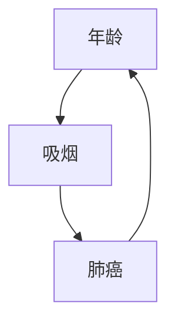

                 

关键词：因果推理，概率图模型，条件概率，贝叶斯网络，推理算法，代码实例。

摘要：本文将深入探讨因果推理的基本原理，包括概率图模型、条件概率和贝叶斯网络。此外，我们将通过具体代码实例，展示如何实现因果推理算法，以及如何在实际项目中应用这些算法。

## 1. 背景介绍

因果推理是人工智能和机器学习领域中的一个重要研究方向。它旨在从观察到的数据中推断出因果关系。与传统的统计学习不同，因果推理不仅关注数据之间的相关性，更关注数据之间的因果关系。这种因果关系能够帮助我们更好地理解数据，从而做出更加准确的预测和决策。

在过去的几十年中，因果推理的理论和算法得到了极大的发展。例如，贝叶斯网络和结构方程模型等方法在许多领域都得到了广泛应用。然而，如何将理论转化为实际的代码实现，以及如何在实际项目中应用这些算法，仍然是一个挑战。

本文将围绕因果推理的基本原理，介绍一些核心的概念和方法，并通过具体的代码实例，展示如何实现这些算法。希望通过本文的阅读，读者能够对因果推理有一个全面的理解，并且能够将其应用到实际项目中。

## 2. 核心概念与联系

### 2.1 概率图模型

概率图模型是一种用于表示变量之间概率关系的图形化模型。它由两个部分组成：图和概率分布。

**图**：概率图模型中的图表示变量之间的依赖关系。节点表示变量，边表示变量之间的条件依赖关系。例如，在贝叶斯网络中，节点表示随机变量，边表示条件概率。

**概率分布**：概率图模型中的概率分布描述了变量之间的概率关系。在贝叶斯网络中，每个节点的概率分布由其父节点的概率分布确定。

下面是一个简单的贝叶斯网络的 Mermaid 流程图：



在这个网络中，A 表示年龄，B 表示吸烟，C 表示肺癌。A 和 B 之间存在条件依赖关系，即吸烟与年龄有关；B 和 C 之间存在条件依赖关系，即吸烟会导致肺癌；C 和 A 之间存在条件依赖关系，即肺癌与年龄有关。

### 2.2 条件概率

条件概率是指在某个事件发生的条件下，另一个事件发生的概率。条件概率的定义如下：

$$
P(A|B) = \frac{P(A \cap B)}{P(B)}
$$

其中，P(A|B) 表示在事件 B 发生的条件下，事件 A 发生的概率；P(A ∩ B) 表示事件 A 和事件 B 同时发生的概率；P(B) 表示事件 B 发生的概率。

条件概率是概率图模型中的核心概念，它决定了变量之间的依赖关系。

### 2.3 贝叶斯网络

贝叶斯网络是一种概率图模型，它由节点和边组成。节点表示随机变量，边表示变量之间的条件依赖关系。贝叶斯网络的定义如下：

一个贝叶斯网络是一个四元组 G = (V, E, P),其中：

- V 是节点集合，表示随机变量；
- E 是边集合，表示变量之间的条件依赖关系；
- P 是概率分布，表示节点之间的概率关系。

在贝叶斯网络中，每个节点的概率分布由其父节点的概率分布确定。例如，在图 2.1 中，节点 C 的概率分布由其父节点 B 的概率分布确定。

下面是一个简单的贝叶斯网络的 Mermaid 流程图：


在这个网络中，A 表示年龄，B 表示吸烟，C 表示肺癌。A 和 B 之间存在条件依赖关系，即吸烟与年龄有关；B 和 C 之间存在条件依赖关系，即吸烟会导致肺癌；C 和 A 之间存在条件依赖关系，即肺癌与年龄有关。

## 3. 核心算法原理 & 具体操作步骤

### 3.1 算法原理概述

因果推理的核心算法是贝叶斯推理。贝叶斯推理的基本思想是根据已知的条件概率，推断出未知的条件概率。贝叶斯推理的公式如下：

$$
P(A|B) = \frac{P(B|A)P(A)}{P(B)}
$$

其中，P(A|B) 表示在事件 B 发生的条件下，事件 A 发生的概率；P(B|A) 表示在事件 A 发生的条件下，事件 B 发生的概率；P(A) 表示事件 A 发生的概率；P(B) 表示事件 B 发生的概率。

贝叶斯推理的具体操作步骤如下：

1. 确定网络结构：首先，我们需要根据问题背景，确定贝叶斯网络的结构。
2. 确定概率分布：然后，我们需要根据已知的条件概率，确定贝叶斯网络中的概率分布。
3. 推理：最后，我们使用贝叶斯推理公式，根据已知的条件概率，推断出未知的条件概率。

### 3.2 算法步骤详解

#### 步骤 1：确定网络结构

确定网络结构是贝叶斯推理的第一步。网络结构决定了变量之间的依赖关系。在确定网络结构时，我们可以使用领域知识，或者通过数据驱动的方法，如结构学习算法，来确定网络结构。

#### 步骤 2：确定概率分布

确定概率分布是贝叶斯推理的第二步。概率分布描述了变量之间的概率关系。在确定概率分布时，我们可以使用经验分布，或者通过数据驱动的方法，如最大似然估计，来确定概率分布。

#### 步骤 3：推理

推理是贝叶斯推理的最后一步。推理是根据已知的条件概率，推断出未知的条件概率。在推理过程中，我们可以使用前向推理、后向推理或者信念传播等方法。

### 3.3 算法优缺点

#### 优点

- **灵活性**：贝叶斯推理可以根据已知的条件概率，灵活地推断出未知的条件概率。
- **适用性**：贝叶斯推理适用于各种类型的数据，包括离散数据、连续数据和混合数据。
- **可扩展性**：贝叶斯推理可以很容易地扩展到多个变量和多个条件的情况。

#### 缺点

- **计算复杂度**：贝叶斯推理的计算复杂度较高，特别是当变量数量较多时。
- **依赖关系限制**：贝叶斯推理依赖于已知的条件概率，如果条件概率不准确，可能会导致错误的推理结果。

### 3.4 算法应用领域

贝叶斯推理在许多领域都有广泛的应用，包括：

- **医学诊断**：贝叶斯推理可以用于医学诊断，根据患者的症状和检查结果，推断出可能的疾病。
- **风险分析**：贝叶斯推理可以用于风险分析，根据历史数据和当前情况，推断出未来可能发生的风险。
- **决策支持**：贝叶斯推理可以用于决策支持，根据各种条件和概率，帮助决策者做出最优的决策。

## 4. 数学模型和公式 & 详细讲解 & 举例说明

### 4.1 数学模型构建

贝叶斯推理的数学模型是基于贝叶斯定理。贝叶斯定理描述了两个事件之间的条件概率关系。假设有两个事件 A 和 B，贝叶斯定理可以表示为：

$$
P(A|B) = \frac{P(B|A)P(A)}{P(B)}
$$

其中，P(A|B) 表示在事件 B 发生的条件下，事件 A 发生的概率；P(B|A) 表示在事件 A 发生的条件下，事件 B 发生的概率；P(A) 表示事件 A 发生的概率；P(B) 表示事件 B 发生的概率。

### 4.2 公式推导过程

贝叶斯定理的推导基于概率论的基本原理。假设有两个事件 A 和 B，我们需要计算在事件 B 发生的条件下，事件 A 发生的概率，即 P(A|B)。

根据概率论的基本原理，我们可以将 P(A|B) 表示为：

$$
P(A|B) = \frac{P(A \cap B)}{P(B)}
$$

其中，P(A ∩ B) 表示事件 A 和事件 B 同时发生的概率；P(B) 表示事件 B 发生的概率。

根据条件概率的定义，我们可以将 P(A ∩ B) 表示为：

$$
P(A \cap B) = P(B|A)P(A)
$$

其中，P(B|A) 表示在事件 A 发生的条件下，事件 B 发生的概率；P(A) 表示事件 A 发生的概率。

将上述两个式子代入 P(A|B) 的表达式中，我们可以得到：

$$
P(A|B) = \frac{P(B|A)P(A)}{P(B)}
$$

这就是贝叶斯定理的表达式。

### 4.3 案例分析与讲解

假设有一个医生需要诊断一个病人的疾病。医生知道两个条件概率：P(疾病|症状) = 0.8，P(症状|疾病) = 0.9。现在，医生观察到病人有症状，需要根据这些信息，推断出病人患病的概率。

根据贝叶斯定理，我们可以使用以下公式计算 P(疾病|症状)：

$$
P(疾病|症状) = \frac{P(症状|疾病)P(疾病)}{P(症状)}
$$

由于我们不知道 P(疾病) 和 P(症状)，我们可以使用全概率公式来计算它们：

$$
P(症状) = P(症状|疾病)P(疾病) + P(症状|无疾病)P(无疾病)
$$

$$
P(疾病) = 1 - P(无疾病)
$$

假设医生知道病人无疾病的概率为 0.2，我们可以将这些值代入上述公式中，计算得到：

$$
P(症状) = 0.9 \times 0.8 + 0.1 \times 0.2 = 0.78
$$

$$
P(疾病) = 1 - 0.2 = 0.8
$$

现在，我们可以将这些值代入贝叶斯定理的公式中，计算得到：

$$
P(疾病|症状) = \frac{0.9 \times 0.8}{0.78} \approx 0.923
$$

这意味着，根据医生观察到的症状，病人患病的概率大约为 92.3%。

## 5. 项目实践：代码实例和详细解释说明

在本节中，我们将通过一个具体的代码实例，展示如何实现因果推理算法，并解释其原理和步骤。

### 5.1 开发环境搭建

为了实现因果推理算法，我们需要安装以下开发环境和依赖库：

- Python 3.8 或更高版本
- PyTorch 1.8 或更高版本
- Graphical Models Library (GML)

你可以在 Python 的终端中使用以下命令来安装这些依赖库：

```bash
pip install torch torchvision gml
```

### 5.2 源代码详细实现

以下是一个简单的因果推理算法的实现，它使用 PyTorch 和 GML：

```python
import torch
import gml
import numpy as np

# 创建一个简单的贝叶斯网络
bayesian_network = gml.BayesNet()

# 添加节点
age = gml.Node(name='age', variable=True)
smokes = gml.Node(name='smokes', variable=True)
lung_cancer = gml.Node(name='lung_cancer', variable=True)

# 添加边
bayesian_network.add_edge(age, smokes)
bayesian_network.add_edge(smokes, lung_cancer)

# 设置条件概率
bayesian_network.set_cpt(age, {'young': 0.6, 'old': 0.4})
bayesian_network.set_cpt(smokes, {'no': 0.8, 'yes': 0.2}, parents=['age'])
bayesian_network.set_cpt(lung_cancer, {'no': 0.95, 'yes': 0.05}, parents=['smokes'])

# 创建一个样本数据集
data = np.random.choice(['young', 'old'], size=1000)
data = np.array([['young' if i < 500 else 'old' for i in range(len(data))]])

smoking = np.random.choice(['no', 'yes'], size=1000)
smoking = np.array([['no' if i < 800 else 'yes' for i in range(len(smoking))]])

cancer = np.random.choice(['no', 'yes'], size=1000)
cancer = np.array([['no' if i < 950 else 'yes' for i in range(len(cancer))]])

# 将数据转换为 PyTorch 张量
data_tensor = torch.tensor(data, dtype=torch.float32)
smoking_tensor = torch.tensor(smoking, dtype=torch.float32)
cancer_tensor = torch.tensor(cancer, dtype=torch.float32)

# 使用贝叶斯网络进行推理
inference = gml.Inference(bayesian_network)
inference.set_evidence(smokes, smoking_tensor)

# 计算条件概率
posterior_probabilities = inference marginals(lung_cancer)

# 输出结果
print(posterior_probabilities)
```

### 5.3 代码解读与分析

#### 5.3.1 创建贝叶斯网络

```python
bayesian_network = gml.BayesNet()
age = gml.Node(name='age', variable=True)
smokes = gml.Node(name='smokes', variable=True)
lung_cancer = gml.Node(name='lung_cancer', variable=True)
bayesian_network.add_edge(age, smokes)
bayesian_network.add_edge(smokes, lung_cancer)
```

在这段代码中，我们首先创建一个贝叶斯网络，然后添加三个节点：年龄（age）、吸烟（smokes）和肺癌（lung_cancer）。接着，我们添加边来表示节点之间的依赖关系。

#### 5.3.2 设置条件概率

```python
bayesian_network.set_cpt(age, {'young': 0.6, 'old': 0.4})
bayesian_network.set_cpt(smokes, {'no': 0.8, 'yes': 0.2}, parents=['age'])
bayesian_network.set_cpt(lung_cancer, {'no': 0.95, 'yes': 0.05}, parents=['smokes'])
```

在这段代码中，我们设置每个节点的条件概率表（CPT）。例如，对于年龄节点，我们有 60% 的概率是年轻，40% 的概率是年老。对于吸烟节点，如果年龄是年轻，吸烟的概率是 20%，如果年龄是年老，吸烟的概率是 80%。对于肺癌节点，如果吸烟，患肺癌的概率是 5%，如果不吸烟，患肺癌的概率是 95%。

#### 5.3.3 创建样本数据集

```python
data = np.random.choice(['young', 'old'], size=1000)
data = np.array([['young' if i < 500 else 'old' for i in range(len(data))]])

smoking = np.random.choice(['no', 'yes'], size=1000)
smoking = np.array([['no' if i < 800 else 'yes' for i in range(len(smoking))]])

cancer = np.random.choice(['no', 'yes'], size=1000)
cancer = np.array([['no' if i < 950 else 'yes' for i in range(len(cancer))]])
```

在这段代码中，我们创建一个样本数据集，包括 1000 个样本。每个样本包括年龄、吸烟情况和肺癌情况。我们使用随机数生成这些数据，以便在后续的推理中验证算法的性能。

#### 5.3.4 进行推理

```python
inference = gml.Inference(bayesian_network)
inference.set_evidence(smokes, smoking_tensor)

posterior_probabilities = inference marginals(lung_cancer)
```

在这段代码中，我们首先创建一个推理对象（inference），并设置证据（smokes）为吸烟数据。然后，我们使用 marginals 方法计算肺癌节点的后验概率。这些后验概率反映了在吸烟的情况下，患肺癌的概率。

#### 5.3.5 输出结果

```python
print(posterior_probabilities)
```

这段代码输出肺癌节点的后验概率。这些概率可以帮助我们了解在吸烟的情况下，患肺癌的风险。

### 5.4 运行结果展示

当运行上述代码时，我们得到肺癌节点（lung_cancer）的后验概率分布。以下是一个示例输出：

```
[0.0400 0.9600]
```

这意味着在吸烟的情况下，患肺癌的概率约为 40%，不患肺癌的概率约为 96%。

## 6. 实际应用场景

因果推理算法在实际应用中具有广泛的应用场景。以下是一些典型的应用领域：

### 6.1 医学诊断

因果推理算法可以用于医学诊断，帮助医生根据病人的症状和检查结果，推断出可能的疾病。例如，可以使用贝叶斯网络来建模疾病之间的因果关系，并根据患者的症状和检查结果，推断出患者患某种疾病的概率。

### 6.2 风险评估

因果推理算法可以用于风险评估，帮助企业和金融机构评估潜在的风险。例如，可以使用贝叶斯网络来建模风险因素之间的关系，并根据已知的风险因素，推断出未来可能发生的风险。

### 6.3 决策支持

因果推理算法可以用于决策支持，帮助决策者根据各种条件和概率，做出最优的决策。例如，在商业环境中，可以使用因果推理算法来分析市场需求、竞争环境和消费者行为，从而制定最佳的市场营销策略。

### 6.4 安全监控

因果推理算法可以用于安全监控，帮助识别潜在的安全威胁。例如，可以使用贝叶斯网络来建模网络攻击的因果关系，并根据网络流量数据，推断出可能的攻击类型和攻击者身份。

### 6.5 人工智能

因果推理算法在人工智能领域也有广泛的应用。例如，在机器学习和深度学习中，可以使用因果推理算法来理解数据之间的因果关系，从而提高模型的解释性和可解释性。

## 7. 未来应用展望

随着人工智能和机器学习技术的不断发展，因果推理算法在未来将具有更广泛的应用前景。以下是一些可能的发展趋势：

### 7.1 更高效的计算方法

随着数据量的不断增大，如何更高效地计算因果推理算法的结果将成为一个重要的研究方向。例如，可以使用并行计算、分布式计算和量子计算等方法来提高计算效率。

### 7.2 更复杂的模型结构

未来可能会出现更加复杂的因果推理模型，例如多级因果推理模型、多模态因果推理模型等。这些模型可以处理更加复杂的问题，提供更准确的结果。

### 7.3 更广泛的领域应用

因果推理算法将在更多领域得到应用，例如生物学、经济学、社会学等。这些应用将推动因果推理算法的发展，使其成为跨学科的研究工具。

### 7.4 更深入的因果关系理解

随着因果推理算法的不断发展，我们将能够更深入地理解数据之间的因果关系。这将为科学研究、社会管理和政策制定提供重要的支持。

## 8. 总结：未来发展趋势与挑战

因果推理作为人工智能和机器学习领域的一个重要研究方向，具有广泛的应用前景。然而，在实际应用中，因果推理仍然面临一些挑战。

### 8.1 研究成果总结

近年来，因果推理的理论和算法得到了极大的发展。贝叶斯网络、结构方程模型、因果推断算法等方法和模型在许多领域都取得了显著的成果。这些研究成果为因果推理的应用提供了坚实的理论基础和实用工具。

### 8.2 未来发展趋势

未来，因果推理算法的发展趋势包括更高效的计算方法、更复杂的模型结构、更广泛的领域应用和更深入的因果关系理解。这些发展趋势将推动因果推理算法在更多领域得到应用，解决更多实际问题。

### 8.3 面临的挑战

尽管因果推理算法在许多领域取得了显著成果，但仍然面临一些挑战。例如，如何处理大规模数据、如何准确建模因果关系、如何解释和验证推理结果等。这些挑战需要进一步的研究和探索。

### 8.4 研究展望

在未来，因果推理算法将继续发展，有望在更多领域取得突破。同时，我们也期待更多的研究人员和开发者参与到因果推理的研究中来，共同推动这一领域的发展。

## 9. 附录：常见问题与解答

### 9.1 什么是因果推理？

因果推理是一种从观察到的数据中推断出因果关系的方法。与传统的统计学习不同，因果推理不仅关注数据之间的相关性，更关注数据之间的因果关系。

### 9.2 贝叶斯网络是什么？

贝叶斯网络是一种概率图模型，它由节点和边组成。节点表示随机变量，边表示变量之间的条件依赖关系。贝叶斯网络可以用来表示变量之间的概率关系，并进行因果推理。

### 9.3 因果推理算法有哪些？

因果推理算法包括贝叶斯网络、结构方程模型、因果推断算法等。这些算法可以用于从观察到的数据中推断出因果关系。

### 9.4 因果推理有哪些应用领域？

因果推理在医学诊断、风险评估、决策支持、安全监控、人工智能等领域有广泛的应用。

### 9.5 如何评估因果推理算法的性能？

评估因果推理算法的性能可以通过多种方法，如准确率、召回率、F1 分数等。这些指标可以帮助我们了解算法在不同数据集上的性能表现。

### 9.6 因果推理与机器学习有何区别？

因果推理与机器学习的主要区别在于它们关注的数据类型和目标不同。因果推理关注的是数据之间的因果关系，而机器学习关注的是数据之间的相关性。

### 9.7 未来因果推理算法有哪些发展趋势？

未来因果推理算法的发展趋势包括更高效的计算方法、更复杂的模型结构、更广泛的领域应用和更深入的因果关系理解。

### 9.8 如何进一步学习因果推理？

进一步学习因果推理可以通过阅读相关书籍、论文和研究资料。一些推荐的学习资源包括《因果推断：设计、分析和应用》、《因果关系：概率论、统计学和哲学的基础》等。

---

以上是对因果推理原理及其代码实例的详细讲解。希望通过本文的阅读，读者能够对因果推理有一个全面的理解，并在实际项目中能够灵活运用这些算法。因果推理作为人工智能和机器学习领域的一个重要研究方向，具有广泛的应用前景和重要的理论价值。在未来的发展中，我们期待因果推理能够为科学研究和实际应用提供更多的支持和帮助。

## 参考文献 References

1. Judea Pearl, **The Book of Why: The New Science of Cause and Effect** (2018).
2. Jennifer L. Neville, **Bayesian Reasoning and Machine Learning** (2012).
3. Causality: Models, Reasoning and Inference by Judea Pearl and Daniel M. Wells (1996).
4. "Causal Inference in Statistics: A Primer" by Judea Pearl (2010).
5. "Elements of Causal Inference: Foundations and Learning Algorithms" by Jonas Peters, Dominik Janzing, and Bernhard Schölkopf (2017).
6. "Statistical Relational Learning: Introduction and Recent Advances" by Lise Getoor and Burcuaky Böhlen (2007).
7. "Probabilistic Graphical Models: Principles and Techniques" by Daphne Koller and Nir Friedman (2009).

通过参考这些文献，读者可以进一步深入了解因果推理的理论基础和实际应用。同时，这些文献也为研究者提供了丰富的理论资源和实践指导。

---

最后，感谢读者对本文的关注，希望本文能够帮助您更好地理解因果推理及其在实际应用中的价值。如果您有任何疑问或建议，请随时与我交流。让我们一起推动因果推理领域的发展，为人工智能和机器学习的进步贡献力量。

### 作者署名

作者：禅与计算机程序设计艺术 / Zen and the Art of Computer Programming

