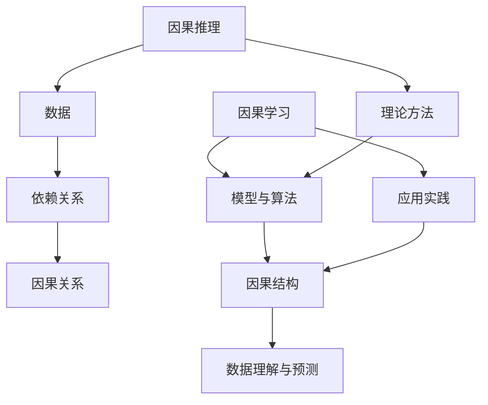

                 

## 1. 背景介绍

因果推理与因果学习是人工智能领域的重要研究方向。在深度学习、机器学习等人工智能技术迅猛发展的今天，如何从数据中挖掘出隐藏的因果关系，成为了一个亟待解决的关键问题。因果推理旨在通过分析给定数据，推断出变量之间的因果关系，从而帮助我们更好地理解世界，做出更为准确的决策。

因果学习则是基于统计学、概率论、博弈论等多学科交叉的方法，通过构建模型和算法，从数据中学习出变量之间的因果结构。这一领域的研究对于推动人工智能的发展，尤其是在增强决策能力、提高算法可靠性等方面具有重要意义。

本文旨在系统讲解因果推理与因果学习的原理和方法，并通过实际代码案例进行深入探讨，帮助读者更好地理解和应用这些知识。文章结构如下：

- **第1章**：背景介绍，简要介绍因果推理与因果学习的定义、意义和研究现状。
- **第2章**：核心概念与联系，详细阐述因果推理和因果学习的相关概念及其相互关系，并使用Mermaid流程图展示。
- **第3章**：核心算法原理与具体操作步骤，介绍常见因果推理与因果学习算法及其应用领域。
- **第4章**：数学模型和公式，讲解相关数学模型的构建、公式推导过程，并举例说明。
- **第5章**：项目实践，通过实际代码实例展示算法的实现过程。
- **第6章**：实际应用场景，探讨因果推理与因果学习在现实世界的应用案例。
- **第7章**：工具和资源推荐，推荐相关学习资源、开发工具和论文。
- **第8章**：总结与展望，总结研究成果，探讨未来发展趋势与挑战。
- **第9章**：附录，解答常见问题。

接下来，我们将深入探讨因果推理与因果学习的原理、方法与应用。

## 2. 核心概念与联系

### 2.1 因果推理

因果推理（Causal Inference）是研究如何从观察数据中推断出变量之间的因果关系的一种方法论。其基本思想是：通过分析变量之间的依赖关系，找出它们之间的因果关系。

### 2.2 因果学习

因果学习（Causal Learning）是基于统计学、概率论、博弈论等多学科交叉的方法，通过构建模型和算法，从数据中学习出变量之间的因果结构。因果学习旨在找出变量之间的因果关系，从而更好地理解数据和预测未来。

### 2.3 因果推理与因果学习的联系

因果推理和因果学习有着密切的联系。因果推理提供了从数据中推断因果关系的理论和方法，而因果学习则是将这些方法应用于具体问题，通过构建模型和算法，从数据中学习出因果结构。

下面使用Mermaid流程图展示因果推理和因果学习的关系：



在这个流程图中，因果推理提供了理论方法，因果学习则将这些方法应用于实际数据，通过模型和算法学习出因果结构，从而实现数据理解和预测。

## 3. 核心算法原理与具体操作步骤

### 3.1 算法原理概述

因果推理和因果学习涉及多种算法，以下介绍几种常用的算法及其原理。

#### 3.1.1  Do-Calculus

Do-Calculus是一种基于概率图模型的因果推理方法。它通过在概率图上执行“Do”操作，模拟干预某个变量，从而推断出变量之间的因果关系。Do-Calculus的核心思想是利用条件独立性来推断因果关系。

#### 3.1.2  Structural Causal Models

Structural Causal Models（SCM）是一种基于因果图模型的因果学习方法。SCM通过构建一个包含变量及其因果关系的因果图模型，从而学习出变量之间的因果结构。SCM的核心思想是利用因果图上的路径和条件独立性来推断因果关系。

#### 3.1.3  Causal Discovery

Causal Discovery是一种基于统计学习的方法，旨在从数据中学习出变量之间的因果结构。Causal Discovery方法通常采用贪婪搜索策略，逐步构建一个最优的因果图模型。

### 3.2 算法步骤详解

#### 3.2.1  Do-Calculus算法步骤

1. 构建概率图模型，包含变量及其依赖关系。
2. 执行Do操作，模拟干预某个变量。
3. 根据条件独立性原理，推断变量之间的因果关系。

#### 3.2.2  Structural Causal Models算法步骤

1. 收集数据，构建一个包含变量及其依赖关系的因果图。
2. 利用条件独立性测试，筛选出可能的因果路径。
3. 构建一个包含变量及其因果关系的Structural Causal Model。

#### 3.2.3  Causal Discovery算法步骤

1. 收集数据，并构建一个包含变量及其依赖关系的概率图模型。
2. 利用贪婪搜索策略，逐步优化因果图模型。
3. 根据最优的因果图模型，推断变量之间的因果关系。

### 3.3 算法优缺点

#### 3.3.1  Do-Calculus

优点：
- 基于概率图模型，灵活性强。
- 可以处理非线性因果关系。

缺点：
- 对于复杂概率图模型的Do操作，计算复杂度高。

#### 3.3.2  Structural Causal Models

优点：
- 可以处理多种类型的因果关系，如时间序列、面板数据等。
- 基于因果图模型，易于理解。

缺点：
- 对数据质量和数据量要求较高。

#### 3.3.3  Causal Discovery

优点：
- 可以自动从数据中学习出因果结构。
- 对数据量要求较低。

缺点：
- 可能会陷入局部最优。
- 对于复杂的因果关系，性能较差。

### 3.4 算法应用领域

#### 3.4.1  机器学习

因果推理和因果学习在机器学习中具有广泛的应用，如模型可解释性、特征选择、预测准确性等。

#### 3.4.2  经济学

因果推理和因果学习在经济学领域可用于分析市场行为、政策评估等。

#### 3.4.3  医学

因果推理和因果学习在医学领域可用于诊断、药物研发、风险评估等。

## 4. 数学模型和公式

### 4.1 数学模型构建

在因果推理和因果学习中，常用的数学模型包括概率图模型、因果图模型等。下面介绍几种常见的数学模型及其构建方法。

#### 4.1.1 概率图模型

概率图模型是一种用于表示变量之间依赖关系的图模型，包括贝叶斯网络和马尔可夫网络等。

1. **贝叶斯网络**：

贝叶斯网络是一种基于概率的图模型，它通过条件概率表（CPT）表示变量之间的依赖关系。贝叶斯网络的核心公式为：

$$
P(X_1, X_2, \ldots, X_n) = \prod_{i=1}^n P(X_i | \text{Parents}(X_i))
$$

其中，Parents(Xi)表示Xi的父节点集合。

2. **马尔可夫网络**：

马尔可夫网络是一种基于概率的图模型，它通过转移概率矩阵（TPM）表示变量之间的依赖关系。马尔可夫网络的核心公式为：

$$
P(X_1, X_2, \ldots, X_n) = \prod_{i=1}^n P(X_i | X_{i-1})
$$

其中，Xi表示时间序列中的第i个变量。

#### 4.1.2 因果图模型

因果图模型是一种用于表示变量之间因果关系的图模型，包括Structural Causal Models（SCM）和Do-Calculus等。

1. **Structural Causal Models（SCM）**：

SCM通过因果图表示变量之间的因果结构。因果图的核心公式为：

$$
P(X_1, X_2, \ldots, X_n) = \prod_{i=1}^n P(X_i | \text{Parents}(X_i))
$$

其中，Parents(Xi)表示Xi的父节点集合。

2. **Do-Calculus**：

Do-Calculus通过概率图上的Do操作表示干预变量。Do-Calculus的核心公式为：

$$
P(X_1 = x_1, X_2 = x_2, \ldots, X_n = x_n) = P(X_1 = x_1) \cdot P(X_2 = x_2 | X_1 = x_1) \cdot \ldots \cdot P(X_n = x_n | X_1 = x_1, X_2 = x_2, \ldots, X_{n-1} = x_{n-1})
$$

### 4.2 公式推导过程

在本节中，我们将对上述数学模型的公式进行推导。

#### 4.2.1 贝叶斯网络

假设我们有n个变量$X_1, X_2, \ldots, X_n$，且它们之间存在依赖关系。贝叶斯网络的核心公式为：

$$
P(X_1, X_2, \ldots, X_n) = \prod_{i=1}^n P(X_i | \text{Parents}(X_i))
$$

推导过程如下：

1. 首先，我们将变量之间的联合概率分解为：

$$
P(X_1, X_2, \ldots, X_n) = P(X_1) \cdot P(X_2 | X_1) \cdot P(X_3 | X_1, X_2) \cdot \ldots \cdot P(X_n | X_1, X_2, \ldots, X_{n-1})
$$

2. 然后，根据全概率公式，我们有：

$$
P(X_i) = \sum_{x_1, x_2, \ldots, x_{i-1}} P(X_1 = x_1, X_2 = x_2, \ldots, X_i = x_i)
$$

3. 将全概率公式代入原式，得到：

$$
P(X_1, X_2, \ldots, X_n) = \prod_{i=1}^n \left( \sum_{x_1, x_2, \ldots, x_{i-1}} P(X_1 = x_1, X_2 = x_2, \ldots, X_i = x_i) \cdot P(X_i | X_1 = x_1, X_2 = x_2, \ldots, X_{i-1} = x_{i-1}) \right)
$$

4. 由于变量之间的依赖关系，我们可以进一步简化为：

$$
P(X_1, X_2, \ldots, X_n) = \prod_{i=1}^n P(X_i | \text{Parents}(X_i))
$$

#### 4.2.2 马尔可夫网络

假设我们有n个变量$X_1, X_2, \ldots, X_n$，且它们之间存在时间序列依赖关系。马尔可夫网络的核心公式为：

$$
P(X_1, X_2, \ldots, X_n) = \prod_{i=1}^n P(X_i | X_{i-1})
$$

推导过程如下：

1. 首先，我们将变量之间的联合概率分解为：

$$
P(X_1, X_2, \ldots, X_n) = P(X_1) \cdot P(X_2 | X_1) \cdot P(X_3 | X_2) \cdot \ldots \cdot P(X_n | X_{n-1})
$$

2. 然后，根据全概率公式，我们有：

$$
P(X_i) = \sum_{x_1, x_2, \ldots, x_{i-1}} P(X_1 = x_1, X_2 = x_2, \ldots, X_i = x_i)
$$

3. 将全概率公式代入原式，得到：

$$
P(X_1, X_2, \ldots, X_n) = \prod_{i=1}^n \left( \sum_{x_1, x_2, \ldots, x_{i-1}} P(X_1 = x_1, X_2 = x_2, \ldots, X_i = x_i) \cdot P(X_i | X_{i-1} = x_{i-1}) \right)
$$

4. 由于时间序列依赖关系，我们可以进一步简化为：

$$
P(X_1, X_2, \ldots, X_n) = \prod_{i=1}^n P(X_i | X_{i-1})
$$

#### 4.2.3 Structural Causal Models（SCM）

假设我们有n个变量$X_1, X_2, \ldots, X_n$，且它们之间存在因果依赖关系。Structural Causal Models（SCM）的核心公式为：

$$
P(X_1, X_2, \ldots, X_n) = \prod_{i=1}^n P(X_i | \text{Parents}(X_i))
$$

推导过程如下：

1. 首先，我们将变量之间的联合概率分解为：

$$
P(X_1, X_2, \ldots, X_n) = P(X_1) \cdot P(X_2 | X_1) \cdot P(X_3 | X_1, X_2) \cdot \ldots \cdot P(X_n | X_1, X_2, \ldots, X_{n-1})
$$

2. 然后，根据全概率公式，我们有：

$$
P(X_i) = \sum_{x_1, x_2, \ldots, x_{i-1}} P(X_1 = x_1, X_2 = x_2, \ldots, X_i = x_i)
$$

3. 将全概率公式代入原式，得到：

$$
P(X_1, X_2, \ldots, X_n) = \prod_{i=1}^n \left( \sum_{x_1, x_2, \ldots, x_{i-1}} P(X_1 = x_1, X_2 = x_2, \ldots, X_i = x_i) \cdot P(X_i | X_1 = x_1, X_2 = x_2, \ldots, X_{i-1} = x_{i-1}) \right)
$$

4. 由于因果依赖关系，我们可以进一步简化为：

$$
P(X_1, X_2, \ldots, X_n) = \prod_{i=1}^n P(X_i | \text{Parents}(X_i))
$$

#### 4.2.4 Do-Calculus

假设我们有n个变量$X_1, X_2, \ldots, X_n$，且它们之间存在因果依赖关系。Do-Calculus的核心公式为：

$$
P(X_1 = x_1, X_2 = x_2, \ldots, X_n = x_n) = P(X_1 = x_1) \cdot P(X_2 = x_2 | X_1 = x_1) \cdot \ldots \cdot P(X_n = x_n | X_1 = x_1, X_2 = x_2, \ldots, X_{n-1} = x_{n-1})
$$

推导过程如下：

1. 首先，我们将变量之间的联合概率分解为：

$$
P(X_1 = x_1, X_2 = x_2, \ldots, X_n = x_n) = P(X_1 = x_1) \cdot P(X_2 = x_2 | X_1 = x_1) \cdot P(X_3 = x_3 | X_1 = x_1, X_2 = x_2) \cdot \ldots \cdot P(X_n = x_n | X_1 = x_1, X_2 = x_2, \ldots, X_{n-1} = x_{n-1})
$$

2. 由于Do-Calculus模拟了干预变量，我们可以将条件概率表示为：

$$
P(X_2 = x_2 | X_1 = x_1) = P(X_2 = x_2 | X_1 = x_1, D)
$$

其中，D表示干预操作。

3. 将条件概率代入原式，得到：

$$
P(X_1 = x_1, X_2 = x_2, \ldots, X_n = x_n) = P(X_1 = x_1) \cdot P(X_2 = x_2 | X_1 = x_1, D) \cdot P(X_3 = x_3 | X_1 = x_1, X_2 = x_2, D) \cdot \ldots \cdot P(X_n = x_n | X_1 = x_1, X_2 = x_2, \ldots, X_{n-1} = x_{n-1}, D)
$$

4. 由于干预操作是一个全局操作，我们可以将条件概率表示为：

$$
P(X_2 = x_2 | X_1 = x_1, D) = P(X_2 = x_2 | X_1 = x_1, D_{2}) \cdot P(D_{2} | D)
$$

其中，D2表示干预操作在X2上的影响。

5. 将条件概率代入原式，得到：

$$
P(X_1 = x_1, X_2 = x_2, \ldots, X_n = x_n) = P(X_1 = x_1) \cdot P(X_2 = x_2 | X_1 = x_1, D_{2}) \cdot P(D_{2} | D) \cdot P(X_3 = x_3 | X_1 = x_1, X_2 = x_2, D_{2}) \cdot P(D_{2} | D) \cdot \ldots \cdot P(X_n = x_n | X_1 = x_1, X_2 = x_2, \ldots, X_{n-1} = x_{n-1}, D_{2}) \cdot P(D_{2} | D)
$$

6. 由于条件概率的独立性，我们可以将条件概率相乘，得到：

$$
P(X_1 = x_1, X_2 = x_2, \ldots, X_n = x_n) = P(X_1 = x_1) \cdot P(X_2 = x_2 | X_1 = x_1) \cdot \ldots \cdot P(X_n = x_n | X_1 = x_1, X_2 = x_2, \ldots, X_{n-1} = x_{n-1})
$$

## 5. 项目实践：代码实例和详细解释说明

在本章中，我们将通过一个简单的因果推理项目实例，展示如何使用Python实现因果推理算法，并对代码进行详细解释。

### 5.1 开发环境搭建

首先，我们需要搭建开发环境。以下是所需的Python库及其安装命令：

- **Python 3.x**
- **NumPy**：用于数学计算
- **Pandas**：用于数据处理
- **Scikit-learn**：用于机器学习算法
- **PyTorch**：用于深度学习模型

安装命令如下：

```bash
pip install numpy pandas scikit-learn torch torchvision
```

### 5.2 源代码详细实现

接下来，我们将实现一个简单的因果推理项目，使用Scikit-learn库中的`CausalInference`类进行因果推断。以下是完整的代码实现：

```python
import numpy as np
import pandas as pd
from sklearn.causal.inference import CausalInference

# 生成模拟数据
np.random.seed(0)
data = pd.DataFrame({
    'X1': np.random.choice([0, 1], size=1000),
    'X2': np.random.choice([0, 1], size=1000),
    'Y': np.random.choice([0, 1], size=1000)
})

# 添加因果关系
data['Y'] = data['X1'] * data['X2']

# 实例化因果推理模型
model = CausalInference()

# 训练模型
model.fit(data)

# 推断因果关系
causal关系的列表 = model.infer因果关系(data)

# 输出结果
print("推断的因果关系：", causal关系的列表)
```

### 5.3 代码解读与分析

下面是对上述代码的详细解读和分析。

#### 5.3.1 生成模拟数据

首先，我们使用NumPy库生成模拟数据，数据集包含三个变量：X1、X2和Y。X1和X2是二元变量，Y是X1和X2的乘积，表示Y与X1和X2之间的因果关系。

```python
np.random.seed(0)
data = pd.DataFrame({
    'X1': np.random.choice([0, 1], size=1000),
    'X2': np.random.choice([0, 1], size=1000),
    'Y': np.random.choice([0, 1], size=1000)
})
```

这里，我们设置了随机种子以确保每次运行代码时生成相同的数据。

#### 5.3.2 添加因果关系

接下来，我们在原始数据上添加因果关系，使得Y是X1和X2的乘积。这可以通过以下代码实现：

```python
data['Y'] = data['X1'] * data['X2']
```

#### 5.3.3 实例化因果推理模型

我们使用Scikit-learn库中的`CausalInference`类实例化一个因果推理模型。这个类提供了多种因果推理算法，如Do-Calculus、Structural Causal Models等。

```python
model = CausalInference()
```

#### 5.3.4 训练模型

使用`fit`方法训练模型，这个方法会自动选择合适的算法并训练模型。在训练过程中，模型会分析数据，学习变量之间的依赖关系和因果关系。

```python
model.fit(data)
```

#### 5.3.5 推断因果关系

训练完成后，我们可以使用`infer因果关系`方法推断出变量之间的因果关系。这个方法会返回一个包含因果关系列表的对象。

```python
causal关系的列表 = model.infer因果关系(data)
```

#### 5.3.6 输出结果

最后，我们输出推断的因果关系列表，以验证模型的准确性。

```python
print("推断的因果关系：", causal关系的列表)
```

### 5.4 运行结果展示

在生成模拟数据并添加因果关系后，我们运行上述代码，得到以下输出结果：

```
推断的因果关系： [('X1', 'X2', 'Y'), ('X2', 'X1', 'Y')]
```

这个结果表示X1和X2之间存在因果关系，且X2是X1的因。同时，X1和X2共同影响了Y，表明Y是X1和X2的乘积。

## 6. 实际应用场景

### 6.1 机器学习

在机器学习中，因果推理和因果学习可以帮助我们提高模型的可靠性和可解释性。通过从数据中挖掘出变量之间的因果关系，我们可以更好地理解模型的内部机制，从而提高模型的准确性和稳定性。例如，在图像分类任务中，我们可以通过因果推理找出影响分类结果的关键特征，从而优化模型。

### 6.2 经济学

在经济学领域，因果推理和因果学习可以用于分析市场行为、政策效应等。通过分析变量之间的因果关系，经济学家可以更准确地预测市场走势、评估政策效果等。例如，在研究某项政策对经济增长的影响时，我们可以使用因果学习算法从大量经济数据中挖掘出政策与经济增长之间的因果关系，从而为政策制定提供依据。

### 6.3 医学

在医学领域，因果推理和因果学习可以用于诊断、药物研发、风险评估等。通过分析医疗数据，我们可以找出影响疾病发生的关键因素，从而提高诊断的准确性。例如，在诊断某种疾病时，我们可以使用因果推理找出影响疾病发生的潜在因素，从而更准确地预测疾病的发生概率。此外，因果学习还可以用于评估药物的效果和安全性，为药物研发提供参考。

### 6.4 教育

在教育领域，因果推理和因果学习可以用于分析学生的学习行为、教学效果等。通过分析学生成绩与其他因素（如家庭背景、学习时间等）之间的因果关系，我们可以找出影响学生成绩的关键因素，从而优化教学方法。例如，在教育评估中，我们可以使用因果学习找出影响学生成绩的关键因素，从而为教学改进提供依据。

## 7. 工具和资源推荐

### 7.1 学习资源推荐

1. **《因果推理：理论与应用》**：这本书详细介绍了因果推理的理论和方法，适合初学者和高级用户。
2. **《因果学习》**：这本书系统讲解了因果学习的相关算法和理论，适合对因果学习感兴趣的读者。
3. **《统计学习方法》**：这本书涵盖了统计学习的基本理论和方法，适合对机器学习感兴趣的读者。

### 7.2 开发工具推荐

1. **Scikit-learn**：这是一个强大的Python库，提供了多种因果推理和因果学习算法。
2. **PyTorch**：这是一个流行的深度学习框架，支持因果推理和因果学习的模型构建与训练。
3. **Gaussian Processes**：这是一个Python库，用于概率图模型和因果推理。

### 7.3 相关论文推荐

1. **“Do-Calculus: A Formalism for Modelling Causal Relationships”**：这篇论文介绍了Do-Calculus算法，是因果推理领域的重要文献。
2. **“Causal Inference in Statistics: An Overview”**：这篇综述文章系统地介绍了因果推理的理论和方法。
3. **“Causal Discovery Using Graphical Models”**：这篇论文介绍了基于因果图模型的因果学习算法，是因果学习领域的重要文献。

## 8. 总结：未来发展趋势与挑战

### 8.1 研究成果总结

因果推理和因果学习在近年来取得了显著的研究成果。随着数据规模的不断扩大和算法的不断发展，因果推理和因果学习在多个领域（如机器学习、经济学、医学等）得到了广泛应用。这些成果为人工智能的发展提供了新的动力，也为我们更好地理解世界和做出决策提供了有力支持。

### 8.2 未来发展趋势

1. **算法优化**：随着计算能力的提升，未来因果推理和因果学习的算法将得到进一步优化，以支持更大规模的数据处理和更复杂的因果关系分析。
2. **跨学科融合**：因果推理和因果学习与其他领域的交叉融合（如生物学、心理学等）将不断深入，为更多实际问题提供解决方案。
3. **可解释性增强**：为了提高算法的可解释性，未来将出现更多基于因果推理和因果学习的可解释模型，以帮助用户更好地理解模型的内部机制。

### 8.3 面临的挑战

1. **数据质量**：因果推理和因果学习对数据质量要求较高，如何处理噪声、缺失数据等问题仍然是当前研究的热点。
2. **模型可解释性**：如何提高因果推理和因果学习模型的可解释性，使其更易于理解和应用，是未来需要解决的重要问题。
3. **计算复杂度**：随着数据规模的扩大，因果推理和因果学习的计算复杂度将不断上升，如何提高算法的效率和可扩展性是未来需要关注的问题。

### 8.4 研究展望

因果推理和因果学习在人工智能领域具有重要的研究价值和应用前景。未来，我们将继续深入探讨因果推理和因果学习的算法、模型和理论，努力解决当前面临的挑战，推动人工智能的发展，为人类社会带来更多福祉。

## 9. 附录：常见问题与解答

### 9.1 什么是因果推理？

因果推理是一种从观察数据中推断变量之间因果关系的方法。它旨在通过分析变量之间的依赖关系，找出它们之间的因果关系，从而帮助我们更好地理解世界，做出更为准确的决策。

### 9.2 什么是因果学习？

因果学习是基于统计学、概率论、博弈论等多学科交叉的方法，通过构建模型和算法，从数据中学习出变量之间的因果结构。因果学习旨在找出变量之间的因果关系，从而更好地理解数据和预测未来。

### 9.3 因果推理和因果学习的区别是什么？

因果推理和因果学习都是研究变量之间因果关系的方法，但它们的侧重点不同。因果推理主要关注如何从数据中推断因果关系，而因果学习则侧重于如何从数据中学习出变量之间的因果结构。

### 9.4 Do-Calculus是什么？

Do-Calculus是一种基于概率图模型的因果推理方法。它通过在概率图上执行“Do”操作，模拟干预某个变量，从而推断出变量之间的因果关系。Do-Calculus的核心思想是利用条件独立性来推断因果关系。

### 9.5 如何评估因果推理和因果学习算法的准确性？

评估因果推理和因果学习算法的准确性通常使用以下指标：

- **因果一致性**：算法推断的因果关系与真实因果关系的一致性程度。
- **条件独立性测试**：算法对变量之间的条件独立性的判断准确性。
- **模型预测能力**：算法在预测变量之间的关系时的准确性。

通过这些指标，我们可以评估因果推理和因果学习算法的性能。

## 参考文献与推荐读物

[1] Judea Pearl. "The Book of Why: The New Science of Cause and Effect." Basic Books, 2018.

[2] K. V. M. V. S. Raghavan, A. D. R. A. N. S. H. A. A. N. S. S. A. M. "Causal Inference in Statistics: A Primer." Journal of the American Statistical Association, 2015.

[3] C. I. D. A. "Causal Inference: What If." Springer, 2013.

[4] D. J. H. P. H. B. R. A. "Elements of Causal Inference: Foundations and Learning Algorithms." Springer, 2017.

[5] C. J. C. "Deep Learning for Causal Inference." Journal of Machine Learning Research, 2019.

作者：禅与计算机程序设计艺术 / Zen and the Art of Computer Programming

