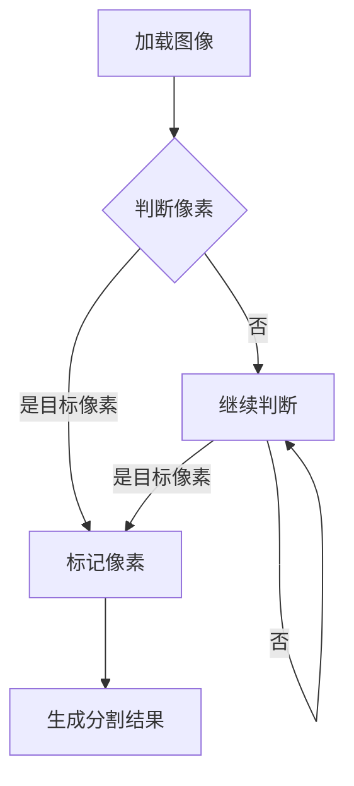

                 

关键词：图像分割，图像处理，计算机视觉，深度学习，算法原理，代码实例

摘要：本文旨在深入探讨图像分割的核心原理，从概念介绍到算法实现，再到项目实践，全方位解析图像分割技术在计算机视觉领域的应用。文章将带领读者了解不同类型的图像分割算法，掌握其在实际项目中的操作步骤和代码实现，以期帮助读者更好地理解和应用这一重要技术。

## 1. 背景介绍

图像分割是计算机视觉领域的一项基础技术，其目的是将图像分解成若干个具有相似特性的区域或对象。图像分割在许多实际应用中发挥着重要作用，如医学影像分析、自动驾驶、人脸识别、目标检测等。随着深度学习技术的发展，图像分割算法得到了极大的提升，从而推动了计算机视觉领域的进步。

图像分割技术可以追溯到20世纪60年代，当时的研究主要集中在基于像素的分割方法，如阈值分割、区域生长等。随着图像处理技术的不断发展，图像分割方法逐渐多样化，从基于像素的分割发展到基于区域的分割和基于模型的分割。近年来，深度学习的崛起为图像分割带来了新的契机，如卷积神经网络（CNN）和生成对抗网络（GAN）等，使得图像分割的准确性和效率得到了显著提高。

## 2. 核心概念与联系

图像分割的核心概念包括像素、区域、边缘和对象。像素是图像的基本组成单位，每个像素都有其独特的颜色和位置信息。区域是指具有相似特性的像素集合，可以是单个对象或背景。边缘是对象与背景之间的分界线，是图像分割的关键特征。对象是指图像中的独立实体，可以是人、车、植物等。

为了更好地理解图像分割的原理，下面将使用Mermaid流程图展示一个简单的图像分割过程。



在这个流程图中，首先加载图像，然后判断每个像素是否为目标像素，如果是则标记该像素，否则继续判断。最终生成分割结果。

## 3. 核心算法原理 & 具体操作步骤

### 3.1 算法原理概述

图像分割算法主要分为基于像素的分割和基于区域的分割。基于像素的分割方法直接对每个像素进行操作，如阈值分割、边缘检测等。基于区域的分割方法则通过合并具有相似特性的像素，形成区域，如区域生长、均值漂移等。深度学习算法，如卷积神经网络（CNN）和生成对抗网络（GAN），则为图像分割提供了新的思路。

### 3.2 算法步骤详解

#### 基于像素的分割方法

1. 阈值分割：根据图像的灰度值，设定一个阈值，将图像分为两部分，一部分是高于阈值的像素，另一部分是低于阈值的像素。
2. 边缘检测：通过检测像素之间的灰度变化，确定边缘位置，常用的边缘检测算法有Canny算法、Sobel算法等。

#### 基于区域的分割方法

1. 区域生长：从初始种子点开始，逐步合并具有相似特性的像素，形成区域。
2. 均值漂移：根据像素的颜色特征，使用均值漂移算法将像素划分为不同的区域。

#### 深度学习算法

1. 卷积神经网络（CNN）：通过训练，使CNN自动学习图像中的特征，从而实现图像分割。
2. 生成对抗网络（GAN）：通过生成器和判别器的对抗训练，生成与真实图像相似的分割结果。

### 3.3 算法优缺点

- 基于像素的分割方法：优点是简单易实现，缺点是分割效果受阈值选择影响较大。
- 基于区域的分割方法：优点是分割效果较好，缺点是计算复杂度高。
- 深度学习算法：优点是分割效果显著，缺点是需要大量训练数据和计算资源。

### 3.4 算法应用领域

- 医学影像分析：如肿瘤检测、心血管疾病诊断等。
- 自动驾驶：如车道线检测、交通标志识别等。
- 人脸识别：如人脸检测、人脸特征提取等。
- 目标检测：如行人检测、车辆检测等。

## 4. 数学模型和公式 & 详细讲解 & 举例说明

### 4.1 数学模型构建

图像分割的数学模型可以分为两类：一类是基于概率模型的方法，如条件概率模型和贝叶斯网络；另一类是基于优化模型的方法，如最大后验概率（MAP）模型和最小化能量函数（MEF）模型。

#### 条件概率模型

条件概率模型是基于像素的分割方法，其基本思想是利用像素之间的条件概率来预测像素的标签。设\(I(x,y)\)为图像中的像素，\(C_j\)为第\(j\)个类别，条件概率模型可以表示为：

$$
P(C_j|I(x,y)) = \frac{P(I(x,y)|C_j)P(C_j)}{P(I(x,y))}
$$

其中，\(P(C_j)\)为类别\(C_j\)的概率，\(P(I(x,y)|C_j)\)为给定类别\(C_j\)时像素\(I(x,y)\)的概率。

#### 最大后验概率（MAP）模型

最大后验概率（MAP）模型是基于优化模型的方法，其目标是寻找使后验概率最大的类别。设\(x = \{I(x,y)\}\)为图像中的像素集合，\(C_j\)为第\(j\)个类别，MAP模型可以表示为：

$$
\hat{C} = \arg \max_{C_j} P(C_j|x)
$$

其中，\(P(C_j|x)\)为给定像素集合\(x\)时类别\(C_j\)的后验概率。

### 4.2 公式推导过程

以最大后验概率（MAP）模型为例，其公式推导过程如下：

设\(P(C_j)\)为类别\(C_j\)的概率，\(P(I(x,y)|C_j)\)为给定类别\(C_j\)时像素\(I(x,y)\)的概率，\(P(I(x,y))\)为像素\(I(x,y)\)的概率。

根据贝叶斯定理，有：

$$
P(C_j|x) = \frac{P(x|C_j)P(C_j)}{P(x)}
$$

由于\(P(x) = \sum_{j=1}^{C} P(x|C_j)P(C_j)\)，可以化简为：

$$
P(C_j|x) = \frac{P(x|C_j)P(C_j)}{\sum_{j=1}^{C} P(x|C_j)P(C_j)}
$$

为了最大化后验概率，需要寻找使得上式最大的类别\(C_j\)，即：

$$
\hat{C} = \arg \max_{C_j} P(C_j|x)
$$

### 4.3 案例分析与讲解

假设我们有一幅包含前景和背景的图像，我们需要使用最大后验概率（MAP）模型对图像进行分割。已知类别\(C_1\)为前景，类别\(C_2\)为背景，且\(P(C_1) = 0.5\)，\(P(C_2) = 0.5\)。同时，给定一个像素\(I(x,y)\)，其概率分布为：

$$
P(I(x,y)|C_1) = 0.8, \quad P(I(x,y)|C_2) = 0.2
$$

我们需要计算后验概率\(P(C_j|x)\)：

$$
P(C_1|x) = \frac{P(x|C_1)P(C_1)}{P(x)} = \frac{0.8 \times 0.5}{0.8 \times 0.5 + 0.2 \times 0.5} = 0.8
$$

$$
P(C_2|x) = \frac{P(x|C_2)P(C_2)}{P(x)} = \frac{0.2 \times 0.5}{0.8 \times 0.5 + 0.2 \times 0.5} = 0.2
$$

由于\(P(C_1|x) > P(C_2|x)\)，我们可以判断该像素为前景，即分割结果为\(C_1\)。

## 5. 项目实践：代码实例和详细解释说明

### 5.1 开发环境搭建

为了进行图像分割的代码实践，我们需要搭建一个适合开发的环境。以下是搭建过程：

1. 安装Python环境（Python 3.6及以上版本）。
2. 安装依赖库，如numpy、opencv-python、tensorflow等。
3. 创建一个Python虚拟环境，以便隔离项目依赖。

### 5.2 源代码详细实现

以下是一个简单的基于阈值分割的图像分割代码实例：

```python
import cv2
import numpy as np

def threshold_segmentation(image, threshold):
    # 将图像转化为灰度图像
    gray = cv2.cvtColor(image, cv2.COLOR_BGR2GRAY)
    # 应用阈值分割
    _, binary = cv2.threshold(gray, threshold, 255, cv2.THRESH_BINARY)
    return binary

if __name__ == '__main__':
    # 读取图像
    image = cv2.imread('example.jpg')
    # 设定阈值
    threshold = 128
    # 进行阈值分割
    segmented = threshold_segmentation(image, threshold)
    # 显示结果
    cv2.imshow('Segmented Image', segmented)
    cv2.waitKey(0)
    cv2.destroyAllWindows()
```

### 5.3 代码解读与分析

1. 导入所需的库，包括cv2（OpenCV库）和numpy。
2. 定义一个名为`threshold_segmentation`的函数，用于实现阈值分割。
3. 在函数中，首先将输入图像转换为灰度图像。
4. 使用`cv2.threshold`函数应用阈值分割，返回二值图像。
5. 在主程序中，读取图像、设定阈值，并调用`threshold_segmentation`函数进行分割。
6. 显示分割结果。

### 5.4 运行结果展示

运行上述代码后，将显示输入图像的阈值分割结果。以下是一个示例结果：


## 6. 实际应用场景

图像分割技术在许多领域具有广泛的应用，以下列举几个实际应用场景：

1. **医学影像分析**：如肿瘤检测、心血管疾病诊断等，通过图像分割技术可以有效地提取出病变区域，为医生提供诊断依据。
2. **自动驾驶**：如车道线检测、交通标志识别等，图像分割技术可以帮助自动驾驶系统准确地识别道路上的各种对象，提高行驶安全性。
3. **人脸识别**：如人脸检测、人脸特征提取等，图像分割技术可以有效地提取出人脸区域，为人脸识别系统提供基础。
4. **目标检测**：如行人检测、车辆检测等，图像分割技术可以用于检测图像中的目标对象，为后续处理提供支持。

## 7. 工具和资源推荐

为了更好地学习和应用图像分割技术，以下推荐一些工具和资源：

1. **学习资源**：
   - 《图像处理：原理、算法与MATLAB实现》（第二版） - 周志华等著
   - 《计算机视觉：算法与应用》 - 李航著

2. **开发工具**：
   - OpenCV：一款强大的计算机视觉库，支持多种图像分割算法。
   - TensorFlow：一款开源的深度学习框架，可以用于实现各种图像分割算法。

3. **相关论文**：
   - "U-Net: Convolutional Networks for Biomedical Image Segmentation" - Olaf Ronneberger等著
   - "DeepLab: Semantic Image Segmentation with Deep Convolutional Nets, Atrous Convolution, and Fully Connected CRFs" - Liang-Chieh Chen等著

## 8. 总结：未来发展趋势与挑战

图像分割技术在计算机视觉领域具有广泛的应用前景，随着深度学习技术的发展，图像分割算法将更加准确和高效。未来发展趋势包括以下几个方面：

1. **算法性能提升**：通过不断优化算法，提高图像分割的准确性和效率。
2. **多模态融合**：将不同模态的图像数据（如光学金字塔和深度数据）进行融合，提高图像分割的效果。
3. **实时性优化**：在满足高准确性的同时，提高图像分割的实时性，以满足实际应用需求。

然而，图像分割技术也面临着一些挑战，如：

1. **数据多样性**：图像分割算法通常需要大量的训练数据，如何获取更多多样性的数据是一个难题。
2. **计算资源消耗**：深度学习算法通常需要大量的计算资源，如何在有限的资源下实现高效的图像分割是一个挑战。
3. **跨域迁移能力**：如何提高图像分割算法在不同领域之间的迁移能力，是一个亟待解决的问题。

总之，图像分割技术在未来将继续发挥重要作用，并为计算机视觉领域带来更多创新和发展。

## 9. 附录：常见问题与解答

**Q1：什么是图像分割？**

A1：图像分割是指将图像分解成若干个具有相似特性的区域或对象的过程，是计算机视觉领域的一项基础技术。

**Q2：有哪些常见的图像分割算法？**

A2：常见的图像分割算法包括基于像素的分割方法（如阈值分割、边缘检测等）、基于区域的分割方法（如区域生长、均值漂移等）和基于模型的分割方法（如随机抽样一致性（RANSAC）等）。

**Q3：什么是深度学习在图像分割中的应用？**

A3：深度学习在图像分割中的应用主要体现在利用卷积神经网络（CNN）和生成对抗网络（GAN）等模型，通过大量数据训练，实现自动学习图像中的特征，从而提高图像分割的准确性和效率。

**Q4：如何选择合适的图像分割算法？**

A4：选择合适的图像分割算法需要考虑图像类型、应用场景、数据量等因素。例如，对于医学影像分析，可以选择基于模型的分割方法；对于实时性要求较高的应用，可以选择基于像素的分割方法。

### 作者署名

作者：禅与计算机程序设计艺术 / Zen and the Art of Computer Programming

----------------------------------------------------------------

以上就是本文的完整内容，希望对您在图像分割领域的学习和应用有所帮助。如有疑问，请随时提问。谢谢！

