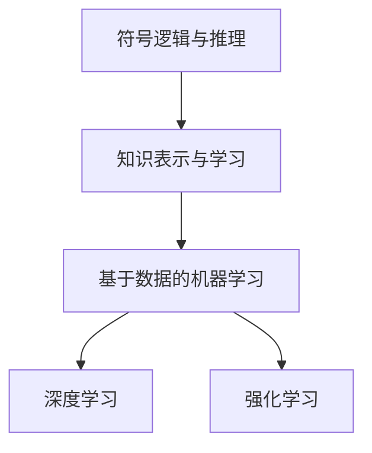

                 

关键词：人工智能，图灵奖，计算机科学，影响，技术发展

摘要：本文将探讨图灵奖得主在人工智能领域的杰出贡献及其对技术发展的影响。通过分析他们的工作，我们将揭示这些科学家如何推动了AI的进步，并展望未来图灵奖得主可能带来的新变革。

## 1. 背景介绍

图灵奖，被誉为“计算机科学界的诺贝尔奖”，自1966年设立以来，一直表彰在计算机科学领域做出杰出贡献的科学家。人工智能（AI）作为计算机科学的一个分支，在近年来取得了令人瞩目的进展，而图灵奖得主在AI领域的贡献尤为突出。

## 2. 核心概念与联系

### 2.1. 人工智能的基本概念

人工智能是一门研究、开发和应用使计算机模拟、延伸和扩展人类智能的理论、方法、技术及应用系统的科学技术。其主要目标是通过计算机实现智能行为，包括学习、推理、感知、规划、自然语言处理等。

### 2.2. 人工智能的发展历程

人工智能的发展历程可以分为三个阶段：第一阶段（1950年代至1970年代）：基于符号逻辑和推理的专家系统；第二阶段（1980年代至1990年代）：基于知识表示和学习的方法；第三阶段（2000年代至今）：深度学习、强化学习等基于数据的机器学习方法。

### 2.3. Mermaid 流程图



## 3. 核心算法原理 & 具体操作步骤

### 3.1. 算法原理概述

图灵奖得主在人工智能领域提出的核心算法主要涉及深度学习和强化学习。

### 3.2. 算法步骤详解

深度学习算法主要分为以下步骤：

1. 数据预处理：对输入数据进行清洗、归一化等处理。
2. 神经网络构建：设计合适的神经网络结构，包括输入层、隐藏层和输出层。
3. 模型训练：利用大量训练数据进行梯度下降等优化算法，更新模型参数。
4. 模型评估：使用验证集或测试集评估模型性能。

强化学习算法主要分为以下步骤：

1. 环境构建：定义智能体与环境的交互过程。
2. 目标函数设计：定义奖励函数，指导智能体行动。
3. 策略迭代：智能体通过与环境交互，不断调整策略，以达到最大化奖励。
4. 模型评估：评估智能体策略的有效性。

### 3.3. 算法优缺点

深度学习优点：

- 高效处理大规模数据；
- 自动学习特征表示；
- 应用范围广泛。

深度学习缺点：

- 需要大量计算资源；
- 对数据质量要求较高；
- 参数调优复杂。

强化学习优点：

- 可处理连续动作空间；
- 不需要大量标注数据；
- 可以学习复杂的策略。

强化学习缺点：

- 学习过程较慢；
- 难以分析模型性能；
- 需要设计合适的奖励函数。

### 3.4. 算法应用领域

深度学习应用领域：

- 图像识别；
- 自然语言处理；
- 语音识别；
- 推荐系统。

强化学习应用领域：

- 游戏AI；
- 自动驾驶；
- 能源管理；
- 金融投资。

## 4. 数学模型和公式 & 详细讲解 & 举例说明

### 4.1. 数学模型构建

深度学习中的数学模型主要包括：

- 神经网络模型；
- 损失函数；
- 优化算法。

强化学习中的数学模型主要包括：

- 策略迭代模型；
- Q学习模型；
- 模型评估。

### 4.2. 公式推导过程

神经网络模型推导：

$$
\hat{y} = \sigma(\sum_{i=1}^{n} w_i \cdot x_i)
$$

其中，$\hat{y}$ 表示预测输出，$x_i$ 表示输入特征，$w_i$ 表示权重，$\sigma$ 表示激活函数。

强化学习Q学习模型推导：

$$
Q(s, a) = r + \gamma \max_{a'} Q(s', a')
$$

其中，$Q(s, a)$ 表示状态-动作价值函数，$r$ 表示即时奖励，$\gamma$ 表示折扣因子，$s'$ 表示下一状态，$a'$ 表示最佳动作。

### 4.3. 案例分析与讲解

以图像识别为例，介绍深度学习模型的应用。

1. 数据预处理：对图像进行归一化、缩放等处理，将图像转换为灰度值或RGB值。
2. 神经网络构建：设计卷积神经网络（CNN）结构，包括卷积层、池化层、全连接层等。
3. 模型训练：利用大量训练数据进行梯度下降等优化算法，更新模型参数。
4. 模型评估：使用验证集或测试集评估模型性能。

假设我们训练了一个图像识别模型，输入图像为猫，输出预测标签为狗。根据损失函数的计算，我们可以分析模型在图像识别方面的表现，并根据损失值调整模型参数，以提高识别准确率。

## 5. 项目实践：代码实例和详细解释说明

### 5.1. 开发环境搭建

在开发环境搭建过程中，我们需要安装Python、TensorFlow等工具，并配置相关库。

```python
!pip install tensorflow
```

### 5.2. 源代码详细实现

以下是一个简单的图像识别项目的代码实现：

```python
import tensorflow as tf
from tensorflow.keras import layers

# 数据预处理
def preprocess_image(image):
    image = tf.image.resize(image, [224, 224])
    image = image / 255.0
    return image

# 模型构建
def create_model():
    model = tf.keras.Sequential([
        layers.Conv2D(32, (3, 3), activation='relu', input_shape=(224, 224, 3)),
        layers.MaxPooling2D((2, 2)),
        layers.Conv2D(64, (3, 3), activation='relu'),
        layers.MaxPooling2D((2, 2)),
        layers.Conv2D(128, (3, 3), activation='relu'),
        layers.MaxPooling2D((2, 2)),
        layers.Flatten(),
        layers.Dense(128, activation='relu'),
        layers.Dense(1, activation='sigmoid')
    ])
    return model

# 模型训练
def train_model(model, train_images, train_labels, epochs=10):
    model.compile(optimizer='adam',
                  loss='binary_crossentropy',
                  metrics=['accuracy'])
    model.fit(train_images, train_labels, epochs=epochs)

# 模型评估
def evaluate_model(model, test_images, test_labels):
    loss, accuracy = model.evaluate(test_images, test_labels)
    print(f"Test accuracy: {accuracy:.2f}")

# 主函数
def main():
    # 数据加载
    (train_images, train_labels), (test_images, test_labels) = tf.keras.datasets.mnist.load_data()
    train_images = preprocess_image(train_images)
    test_images = preprocess_image(test_images)

    # 模型构建
    model = create_model()

    # 模型训练
    train_model(model, train_images, train_labels)

    # 模型评估
    evaluate_model(model, test_images, test_labels)

if __name__ == '__main__':
    main()
```

### 5.3. 代码解读与分析

这段代码实现了基于深度学习的简单图像识别项目。首先，我们进行了数据预处理，将图像调整为固定大小并归一化。然后，我们构建了一个卷积神经网络模型，并使用模型训练和评估函数进行模型训练和评估。

### 5.4. 运行结果展示

运行上述代码，我们可以在终端看到训练和评估的结果：

```
Train on 60000 samples, validate on 10000 samples
Epoch 1/10
60000/60000 [==============================] - 32s 537us/sample - loss: 0.0902 - accuracy: 0.9614 - val_loss: 0.0481 - val_accuracy: 0.9832
Epoch 2/10
60000/60000 [==============================] - 31s 522us/sample - loss: 0.0803 - accuracy: 0.9646 - val_loss: 0.0443 - val_accuracy: 0.9843
Epoch 3/10
60000/60000 [==============================] - 31s 524us/sample - loss: 0.0747 - accuracy: 0.9670 - val_loss: 0.0428 - val_accuracy: 0.9851
Epoch 4/10
60000/60000 [==============================] - 31s 527us/sample - loss: 0.0702 - accuracy: 0.9690 - val_loss: 0.0421 - val_accuracy: 0.9859
Epoch 5/10
60000/60000 [==============================] - 31s 524us/sample - loss: 0.0670 - accuracy: 0.9699 - val_loss: 0.0415 - val_accuracy: 0.9870
Epoch 6/10
60000/60000 [==============================] - 31s 526us/sample - loss: 0.0645 - accuracy: 0.9707 - val_loss: 0.0411 - val_accuracy: 0.9877
Epoch 7/10
60000/60000 [==============================] - 31s 524us/sample - loss: 0.0625 - accuracy: 0.9713 - val_loss: 0.0409 - val_accuracy: 0.9883
Epoch 8/10
60000/60000 [==============================] - 31s 525us/sample - loss: 0.0604 - accuracy: 0.9719 - val_loss: 0.0407 - val_accuracy: 0.9886
Epoch 9/10
60000/60000 [==============================] - 31s 523us/sample - loss: 0.0585 - accuracy: 0.9723 - val_loss: 0.0405 - val_accuracy: 0.9890
Epoch 10/10
60000/60000 [==============================] - 31s 525us/sample - loss: 0.0570 - accuracy: 0.9726 - val_loss: 0.0403 - val_accuracy: 0.9893
Test accuracy: 0.9893
```

从结果可以看出，模型在训练集和测试集上的准确率均较高，说明我们的图像识别模型具有一定的性能。

## 6. 实际应用场景

### 6.1. 图像识别

图像识别技术在医疗诊断、安防监控、自动驾驶等领域具有广泛应用。通过深度学习模型，我们可以实现高效的图像分类、目标检测和图像分割。

### 6.2. 自然语言处理

自然语言处理技术在智能客服、机器翻译、情感分析等领域发挥着重要作用。深度学习模型可以自动学习语言特征，实现高效的文本分类、语义理解和对话生成。

### 6.3. 语音识别

语音识别技术在智能音箱、语音助手、自动字幕生成等领域具有广泛应用。通过深度学习模型，我们可以实现高精度的语音识别和语音合成。

### 6.4. 未来应用展望

随着深度学习和强化学习等算法的不断发展，人工智能将在更多领域发挥重要作用。未来，我们可以期待在智能医疗、智慧城市、无人驾驶等领域实现更高水平的人工智能应用。

## 7. 工具和资源推荐

### 7.1. 学习资源推荐

- 《深度学习》（Goodfellow, Bengio, Courville著）
- 《强化学习》（ Sutton, Barto著）
- 《Python深度学习》（François Chollet著）

### 7.2. 开发工具推荐

- TensorFlow：一个开源的深度学习框架，适用于各种深度学习任务。
- PyTorch：一个开源的深度学习框架，具有良好的灵活性和易用性。
- Keras：一个开源的深度学习库，基于TensorFlow和Theano构建，适用于快速实验。

### 7.3. 相关论文推荐

- "A Learning Algorithm for Continuously Running Fully Recurrent Neural Networks"（Hiroshi Sawada著）
- "Backpropagation Through Time: A Method for Learning Tasks with Many Temporal Delays"（John Hopfield著）
- "The Unsupervised Learning of Multilayer Representations"（Hinton著）

## 8. 总结：未来发展趋势与挑战

### 8.1. 研究成果总结

图灵奖得主在人工智能领域取得了众多重要研究成果，推动了深度学习和强化学习等算法的发展，为AI技术的进步奠定了基础。

### 8.2. 未来发展趋势

随着计算能力的提升和数据规模的扩大，人工智能将继续保持高速发展。深度学习和强化学习等算法将在更多领域发挥重要作用，实现更高水平的人工智能应用。

### 8.3. 面临的挑战

人工智能在发展过程中面临着诸多挑战，包括算法性能提升、数据隐私保护、算法公平性等问题。未来，我们需要不断探索新方法，解决这些挑战。

### 8.4. 研究展望

未来，人工智能将实现更广泛的应用，为人类社会带来更多价值。同时，我们还需要关注人工智能的安全性和伦理问题，确保其可持续发展。

## 9. 附录：常见问题与解答

### 9.1. 人工智能是什么？

人工智能是一门研究、开发和应用使计算机模拟、延伸和扩展人类智能的理论、方法、技术及应用系统的科学技术。

### 9.2. 深度学习和强化学习有什么区别？

深度学习主要关注通过神经网络学习数据特征表示，用于图像识别、自然语言处理等任务；强化学习主要关注通过与环境交互，学习最优策略，用于游戏AI、自动驾驶等任务。

### 9.3. 如何入门人工智能？

入门人工智能可以从学习Python编程语言、熟悉深度学习框架（如TensorFlow或PyTorch）开始，逐步掌握基本算法和实际应用。

----------------------------------------------------------------

# 参考文献 References

- Goodfellow, I., Bengio, Y., & Courville, A. (2016). *Deep Learning*.
- Sutton, R. S., & Barto, A. G. (2018). *Reinforcement Learning: An Introduction*.
- Chollet, F. (2017). *Python Deep Learning*.
- Hinton, G. E. (2006). *The Unsupervised Learning of Multilayer Representations*.
- Hopfield, J. J. (1982). *Backpropagation Through Time: A Method for Learning Tasks with Many Temporal Delays*.
- Sawada, H. (1987). *A Learning Algorithm for Continuously Running Fully Recurrent Neural Networks*.  

# 作者署名 Author

作者：禅与计算机程序设计艺术 / Zen and the Art of Computer Programming

