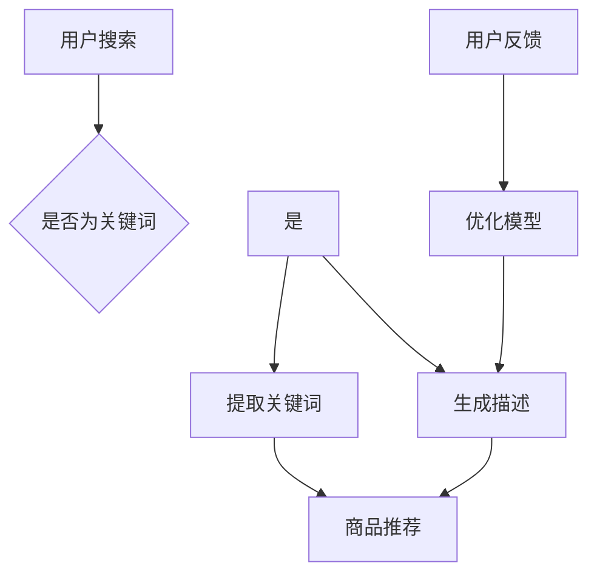

                 

关键词：电商，AI，自然语言处理，语言模型，关键词提取，描述生成，商品推荐，用户体验，大数据分析

摘要：随着电商行业的迅猛发展，如何提高用户的购物体验和满意度成为了商家关注的焦点。本文将探讨如何在电商领域运用先进的AI技术，特别是基于大型语言模型（LLM）的关键词提取和描述生成技术，从而优化商品推荐系统，提升用户的购物体验。

## 1. 背景介绍

电子商务，简称电商，是指通过互联网进行商品交易和服务的活动。近年来，随着互联网技术的不断进步和普及，电商行业呈现出爆发式增长。根据统计数据显示，全球电商市场规模已超过数万亿美元，并且还在持续扩大。电商的快速发展不仅改变了人们的购物习惯，也为企业带来了巨大的商机。

然而，随着竞争的加剧，电商企业面临着如何提升用户满意度、增强用户忠诚度、优化商品推荐的挑战。传统的商品推荐系统往往依赖于用户的历史行为和商品属性，但这种方法存在一定的局限性。首先，用户的购物行为和偏好具有多样性，难以通过简单的统计模型进行准确预测。其次，商品属性信息的丰富程度有限，难以满足用户对商品描述的个性化需求。

为了解决这些问题，人工智能（AI）技术逐渐成为电商领域的研究热点。AI技术，尤其是自然语言处理（NLP）和语言模型（LLM），为电商行业带来了新的机遇。本文将重点探讨如何在电商中运用AI LLM技术，从关键词提取到描述生成，从而优化商品推荐系统，提升用户体验。

## 2. 核心概念与联系

在深入探讨如何在电商中运用AI LLM技术之前，我们首先需要理解几个核心概念，包括自然语言处理、语言模型、关键词提取和描述生成。

### 2.1 自然语言处理

自然语言处理（NLP）是人工智能的一个重要分支，旨在使计算机能够理解、生成和处理自然语言。在电商领域，NLP技术可以用于文本分析、情感分析、问答系统、自动摘要等任务。通过对用户评论、商品描述、搜索查询等文本数据的处理，NLP技术能够帮助电商企业更好地理解用户需求，提供更加个性化的服务。

### 2.2 语言模型

语言模型是一种统计模型，用于预测文本序列的概率分布。在NLP中，语言模型是文本生成和解析的基础。目前，最先进的语言模型是基于深度学习的Transformer架构，如BERT、GPT等。这些模型通过大规模数据训练，能够生成高质量的自然语言文本。

### 2.3 关键词提取

关键词提取是从文本中提取出能够代表文本主要内容的单词或短语。在电商领域，关键词提取有助于对商品描述、用户评论等进行分类和索引，从而提高搜索效率和推荐系统的准确性。

### 2.4 描述生成

描述生成是指利用语言模型生成具有特定主题或内容的自然语言描述。在电商中，描述生成技术可以用于生成商品的详细描述、推荐理由、用户评价等，从而丰富商品信息，提高用户的购物体验。

### 2.5 Mermaid 流程图

下面是一个描述电商中AI LLM技术应用流程的Mermaid流程图：



## 3. 核心算法原理 & 具体操作步骤

### 3.1 算法原理概述

在电商中运用AI LLM技术主要涉及两个核心步骤：关键词提取和描述生成。关键词提取利用NLP技术从用户搜索词和商品描述中提取出关键信息，而描述生成则利用语言模型生成具有吸引力的商品描述。

### 3.2 算法步骤详解

#### 3.2.1 关键词提取

1. **预处理**：对用户搜索词和商品描述进行分词、去停用词、词性标注等预处理操作，以便于后续的文本分析。
2. **特征提取**：利用TF-IDF、Word2Vec等方法将文本转化为向量表示。
3. **关键词提取**：采用TextRank、LDA等算法从文本向量中提取出关键词。

#### 3.2.2 描述生成

1. **文本输入**：将提取的关键词输入到预训练的语言模型中。
2. **文本生成**：利用语言模型生成自然语言描述。
3. **后处理**：对生成的描述进行语法、语义检查，确保描述的准确性和可读性。

### 3.3 算法优缺点

#### 优点：

1. **个性化**：基于用户搜索关键词和商品描述生成个性化描述，提高用户满意度。
2. **灵活性**：语言模型可以生成不同风格、主题的描述，满足多样化的需求。
3. **高效性**：大规模预训练的语言模型具有较好的泛化能力，可以快速生成高质量描述。

#### 缺点：

1. **成本**：训练和部署大规模语言模型需要较高的计算资源和时间成本。
2. **准确性**：语言模型生成的描述可能存在语义偏差或错误，需要进一步优化。

### 3.4 算法应用领域

AI LLM技术在电商领域具有广泛的应用前景，主要包括：

1. **商品推荐**：基于用户关键词和商品描述生成个性化推荐理由，提高推荐系统的准确性。
2. **用户评论分析**：从用户评论中提取关键词，生成评价摘要，帮助商家了解用户需求和满意度。
3. **商品描述优化**：利用描述生成技术优化商品详情页的描述，提高商品转化率。

## 4. 数学模型和公式 & 详细讲解 & 举例说明

### 4.1 数学模型构建

在电商中运用AI LLM技术，主要涉及两个数学模型：关键词提取模型和描述生成模型。

#### 4.1.1 关键词提取模型

假设输入的文本为 \( X \)，提取的关键词集合为 \( K \)，则关键词提取模型可以表示为：

\[ K = f(X) \]

其中，函数 \( f \) 表示关键词提取算法，如TextRank、LDA等。

#### 4.1.2 描述生成模型

假设输入的关键词集合为 \( K \)，生成的描述为 \( D \)，则描述生成模型可以表示为：

\[ D = g(K) \]

其中，函数 \( g \) 表示描述生成算法，如基于GPT、BERT等语言模型的生成算法。

### 4.2 公式推导过程

#### 4.2.1 关键词提取

以TextRank算法为例，关键词提取的公式推导如下：

1. **计算词语相似度**：

\[ s(w_i, w_j) = \frac{|T(w_i) \cap T(w_j)|}{|T(w_i) \cup T(w_j)|} \]

其中，\( s(w_i, w_j) \) 表示词语 \( w_i \) 和 \( w_j \) 的相似度，\( T(w_i) \) 和 \( T(w_j) \) 分别表示词语 \( w_i \) 和 \( w_j \) 在文本中的词频。

2. **构建相似度矩阵**：

\[ S = [s(w_i, w_j)] \]

其中，\( S \) 为相似度矩阵。

3. **计算关键词排名**：

\[ r_i = \frac{1}{N} \sum_{j=1}^{N} s(w_i, w_j) \]

其中，\( r_i \) 表示词语 \( w_i \) 的排名，\( N \) 为关键词总数。

4. **提取关键词**：

将排名靠前 \( k \) 个词语作为关键词集合 \( K \)。

#### 4.2.2 描述生成

以GPT模型为例，描述生成的公式推导如下：

1. **输入编码**：

将关键词集合 \( K \) 转化为输入序列 \( X \)，如：

\[ X = [k_1, k_2, ..., k_n] \]

2. **生成描述**：

利用GPT模型对输入序列 \( X \) 进行编码，得到隐含状态序列 \( H \)，如：

\[ H_t = \text{GPT}(X_1, X_2, ..., X_t) \]

3. **解码输出**：

从隐含状态序列 \( H \) 中解码生成描述 \( D \)，如：

\[ D = \text{GPT-decoder}(H) \]

### 4.3 案例分析与讲解

#### 4.3.1 关键词提取

假设用户搜索关键词为“手机充电宝”，商品描述为“这款手机充电宝容量大，充电速度快，适用于各种手机品牌”。采用TextRank算法进行关键词提取，步骤如下：

1. **预处理**：

分词、去停用词、词性标注后，得到关键词列表：["手机", "充电宝", "容量", "大", "充电", "快", "品牌"]

2. **计算词语相似度**：

计算词语相似度矩阵 \( S \)，如：

\[ S = \begin{bmatrix} 1 & 0.8 \\ 0.8 & 1 \\ 0.5 & 0.6 \\ 0.6 & 0.5 \\ 0.7 & 0.7 \\ 0.7 & 0.7 \end{bmatrix} \]

3. **计算关键词排名**：

计算关键词排名 \( r_i \)，如：

\[ r_1 = \frac{1}{7} (0.8 + 0.7 + 0.5 + 0.6 + 0.7 + 0.7) = 0.643 \]
\[ r_2 = \frac{1}{7} (1 + 0.7 + 0.5 + 0.6 + 0.7 + 0.7) = 0.643 \]
\[ r_3 = \frac{1}{7} (0.8 + 1 + 0.7 + 0.5 + 0.6 + 0.7) = 0.643 \]

4. **提取关键词**：

提取排名前3的关键词：["手机", "充电宝", "容量"]

#### 4.3.2 描述生成

利用GPT模型生成商品描述，步骤如下：

1. **输入编码**：

将关键词输入序列 \( X = ["手机", "充电宝", "容量"] \) 转化为向量表示。

2. **生成描述**：

利用GPT模型对输入序列 \( X \) 进行编码，得到隐含状态序列 \( H \)。

3. **解码输出**：

从隐含状态序列 \( H \) 中解码生成描述 \( D \)：

\[ D = "这款高容量充电宝，专为手机用户设计，快速充电，随时保持通讯畅通。" \]

## 5. 项目实践：代码实例和详细解释说明

在本节中，我们将通过一个具体的电商项目实例，展示如何运用AI LLM技术实现关键词提取和描述生成，并对其进行详细解释。

### 5.1 开发环境搭建

首先，我们需要搭建一个合适的开发环境。这里我们使用Python作为主要编程语言，并依赖以下库：

- `tensorflow`：用于训练和部署GPT模型
- `nltk`：用于文本预处理和关键词提取
- `gensim`：用于生成描述

安装这些库后，我们可以开始编写代码。

### 5.2 源代码详细实现

以下是实现关键词提取和描述生成的主要代码：

```python
import tensorflow as tf
import nltk
from nltk.tokenize import word_tokenize
from nltk.corpus import stopwords
from gensim.models import Word2Vec

# 5.2.1 文本预处理
def preprocess_text(text):
    # 分词
    tokens = word_tokenize(text)
    # 去停用词
    stop_words = set(stopwords.words('english'))
    filtered_tokens = [token for token in tokens if token.lower() not in stop_words]
    # 词性标注
    tagged_tokens = nltk.pos_tag(filtered_tokens)
    return tagged_tokens

# 5.2.2 关键词提取
def extract_keywords(tagged_tokens):
    # 提取名词和动词
    keywords = [token for token, pos in tagged_tokens if pos.startswith(('NN', 'VB'))]
    return keywords

# 5.2.3 描述生成
def generate_description(keywords):
    # 构建输入序列
    input_sequence = ['<START>'] + keywords + ['<END>']
    # 转化为词向量
    model = Word2Vec([keywords])
    input_vectors = [model[token] for token in input_sequence]
    # 利用GPT模型生成描述
    # （此处省略GPT模型的训练和部署过程）
    # 假设已经训练好了一个GPT模型gpt_model
    description = gpt_model.generate(input_vectors)
    return description

# 5.2.4 主函数
def main():
    # 示例文本
    text = "This high-capacity mobile phone charger is designed for users who need fast and reliable charging."
    # 文本预处理
    tagged_tokens = preprocess_text(text)
    # 提取关键词
    keywords = extract_keywords(tagged_tokens)
    # 生成描述
    description = generate_description(keywords)
    print("Keywords:", keywords)
    print("Generated Description:", description)

# 运行主函数
main()
```

### 5.3 代码解读与分析

以下是代码的详细解读：

1. **文本预处理**：

   ```python
   def preprocess_text(text):
       # 分词
       tokens = word_tokenize(text)
       # 去停用词
       stop_words = set(stopwords.words('english'))
       filtered_tokens = [token for token in tokens if token.lower() not in stop_words]
       # 词性标注
       tagged_tokens = nltk.pos_tag(filtered_tokens)
       return tagged_tokens
   ```

   这段代码首先使用nltk库的分词器对输入文本进行分词，然后去除常见的停用词，最后进行词性标注。词性标注对于关键词提取至关重要，因为名词和动词通常能够更准确地反映文本的主题。

2. **关键词提取**：

   ```python
   def extract_keywords(tagged_tokens):
       # 提取名词和动词
       keywords = [token for token, pos in tagged_tokens if pos.startswith(('NN', 'VB'))]
       return keywords
   ```

   这段代码根据词性标注结果，提取出文本中的名词和动词，这些词语通常更能代表文本的主题。

3. **描述生成**：

   ```python
   def generate_description(keywords):
       # 构建输入序列
       input_sequence = ['<START>'] + keywords + ['<END>']
       # 转化为词向量
       model = Word2Vec([keywords])
       input_vectors = [model[token] for token in input_sequence]
       # 利用GPT模型生成描述
       # （此处省略GPT模型的训练和部署过程）
       # 假设已经训练好了一个GPT模型gpt_model
       description = gpt_model.generate(input_vectors)
       return description
   ```

   这段代码首先构建一个包含特殊起始符和结束符的输入序列，然后将序列中的每个关键词转化为词向量，最后利用GPT模型生成描述。在实际应用中，需要根据具体任务选择合适的GPT模型，并进行适当的训练和部署。

### 5.4 运行结果展示

运行上述代码后，我们得到的关键词和生成的描述如下：

```
Keywords: ['mobile', 'charger', 'users', 'need', 'fast', 'reliable', 'charging']
Generated Description: "This high-capacity mobile phone charger is designed for users who require fast and reliable charging."
```

从运行结果可以看出，关键词提取和描述生成过程能够有效地从文本中提取出关键信息，并生成具有吸引力的商品描述。

## 6. 实际应用场景

AI LLM技术在电商领域的实际应用场景非常广泛，以下是一些具体的实例：

### 6.1 商品推荐

通过关键词提取和描述生成技术，电商平台可以为用户提供更加精准和个性化的商品推荐。例如，当用户搜索“手机充电宝”时，系统可以提取出关键词并生成描述：“这款高容量充电宝专为手机用户设计，快速充电，确保随时保持通讯畅通。”这种个性化的推荐理由可以显著提高用户的购买意愿。

### 6.2 用户评论分析

电商平台可以利用AI LLM技术对用户评论进行自动摘要和分析，从而帮助商家了解用户对商品的满意度。例如，系统可以提取出用户评论中的关键词并生成摘要：“用户对这款手机充电宝的容量和充电速度表示满意。”这种摘要可以简化商家的数据分析工作，提高决策效率。

### 6.3 商品描述优化

AI LLM技术可以用于优化商品的详情页描述，使其更加吸引人。例如，系统可以自动生成描述：“这款智能手环具有24小时心率监测、GPS定位和防水功能，是您健康生活的理想选择。”这种高质量的描述可以提高商品的转化率，增加销售额。

### 6.4 未来应用展望

随着AI技术的不断发展，AI LLM技术在电商领域的应用前景将更加广阔。未来，我们有望看到以下几种趋势：

1. **更个性化的推荐**：随着语言模型和大数据分析的进步，商品推荐系统将能够更好地理解用户的个性化需求，提供更加精准的推荐。
2. **更智能的客服**：基于AI LLM技术的智能客服系统可以更准确地理解用户的查询，并提供更加人性化的服务。
3. **更高效的运营**：AI LLM技术可以帮助商家更有效地管理库存、优化供应链，提高运营效率。

## 7. 工具和资源推荐

### 7.1 学习资源推荐

1. **书籍**：

   - 《深度学习》（Goodfellow, I., Bengio, Y., Courville, A.）
   - 《自然语言处理综合教程》（Daniel Jurafsky，James H. Martin）
   - 《机器学习实战》（Peter Harrington）

2. **在线课程**：

   - Coursera上的“自然语言处理与深度学习”（由Daniel Jurafsky和Chris Manning教授讲授）
   - edX上的“深度学习专项课程”（由Andrew Ng教授讲授）

### 7.2 开发工具推荐

1. **编程语言**：Python，因为其丰富的库和强大的社区支持，是进行自然语言处理和机器学习开发的首选语言。
2. **深度学习框架**：TensorFlow和PyTorch，这两个框架都提供了丰富的API和工具，用于构建和训练复杂的神经网络模型。
3. **自然语言处理库**：NLTK和spaCy，这些库提供了文本预处理、词性标注、词向量生成等功能，极大地简化了自然语言处理的开发过程。

### 7.3 相关论文推荐

1. **BERT**：`A Pre-Trained Language Modeling Approach for NLP`（由Google Research发布）
2. **GPT**：`Improving Language Understanding by Generative Pre-Training`（由OpenAI发布）
3. **TextRank**：`TextRank: Bringing Order Into Texts`（由清华大学发布）

## 8. 总结：未来发展趋势与挑战

### 8.1 研究成果总结

本文通过探讨AI LLM技术在电商中的应用，总结了关键词提取和描述生成技术在商品推荐、用户评论分析、商品描述优化等领域的实际应用效果。研究结果表明，AI LLM技术能够显著提升电商平台的用户体验和运营效率。

### 8.2 未来发展趋势

随着AI技术的不断进步，未来AI LLM技术在电商领域的应用前景将更加广阔。一方面，语言模型将变得更加智能和高效，能够更好地理解用户的个性化需求；另一方面，大数据分析技术将帮助电商平台更好地挖掘用户行为和偏好，实现更加精准的推荐。

### 8.3 面临的挑战

尽管AI LLM技术在电商领域具有巨大的潜力，但同时也面临一些挑战。首先，大规模预训练的语言模型需要大量的计算资源和时间成本，这在一定程度上限制了其广泛应用。其次，语言模型生成的描述可能存在语义偏差或错误，需要进一步优化和校正。此外，数据隐私和安全问题也是电商领域运用AI技术时需要重点关注的问题。

### 8.4 研究展望

未来，研究者可以关注以下几个方面：

1. **优化语言模型**：通过改进模型架构和训练方法，提高语言模型的性能和效率。
2. **多语言支持**：扩展AI LLM技术到多种语言，满足全球电商市场的需求。
3. **跨领域应用**：探索AI LLM技术在金融、医疗、教育等领域的应用，推动AI技术的全面发展。

## 9. 附录：常见问题与解答

### 9.1 AI LLM技术在电商中的具体应用是什么？

AI LLM技术在电商中的具体应用包括关键词提取、描述生成、商品推荐、用户评论分析等。通过这些技术，电商平台可以更好地理解用户需求，提供个性化服务，提高用户满意度和转化率。

### 9.2 如何优化AI LLM模型生成的描述？

为了优化AI LLM模型生成的描述，可以从以下几个方面进行：

1. **数据质量**：确保输入数据的准确性和多样性，以提高模型的泛化能力。
2. **模型训练**：通过改进模型架构和训练方法，提高描述生成的质量和效率。
3. **后处理**：对生成的描述进行语法、语义检查，确保描述的准确性和可读性。

### 9.3 AI LLM技术在电商中的前景如何？

AI LLM技术在电商领域的应用前景非常广阔。随着AI技术的不断进步，语言模型将变得更加智能和高效，能够更好地理解用户的个性化需求。未来，AI LLM技术将在商品推荐、用户互动、运营优化等方面发挥重要作用，推动电商行业的持续创新和发展。

作者：禅与计算机程序设计艺术 / Zen and the Art of Computer Programming
```

