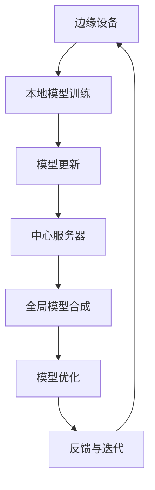

                 

关键词：联邦学习、跨行业数据协作、隐私保护、模型优化、共享机制

> 摘要：随着数据隐私和安全的重要性日益凸显，联邦学习成为了一种备受关注的技术，尤其在跨行业数据协作中发挥了重要作用。本文旨在探讨垂直联邦学习，这种在特定行业或领域内实现高效数据协作的新模式，详细分析其核心概念、算法原理、应用场景以及未来发展趋势。

## 1. 背景介绍

### 1.1 数据隐私与安全

在信息化时代，数据已成为企业和社会的关键资产。然而，随着数据量的大幅增长，数据隐私和安全问题也日益严峻。传统的中心化数据处理方式存在明显的隐私泄露风险，引发了广泛担忧。因此，寻求一种既能保护数据隐私，又能实现数据价值挖掘的方法成为当前研究的热点。

### 1.2 联邦学习的兴起

联邦学习（Federated Learning）作为一项前沿技术，通过在分布式设备上训练模型，实现了数据无需集中，从而有效保护了数据隐私。这一技术不仅在学术界引起了广泛关注，也在实际应用中展现出了巨大潜力。然而，联邦学习在跨行业数据协作中的应用仍存在诸多挑战。

### 1.3 垂直联邦学习的提出

为了应对这些挑战，研究者们提出了垂直联邦学习（Vertical Federated Learning）的概念。垂直联邦学习专注于在特定行业或领域内实现高效的数据协作，通过构建行业或领域的专用模型，提高了联邦学习的效果和效率。本文将围绕垂直联邦学习展开讨论，分析其在跨行业数据协作中的应用和价值。

## 2. 核心概念与联系

垂直联邦学习作为一种新型的联邦学习模式，其核心概念和联系如下：

### 2.1 联邦学习的定义

联邦学习是一种分布式机器学习技术，通过将模型训练任务分布在多个边缘设备上进行，从而实现数据无需集中的模型训练。在联邦学习中，每个设备独立训练本地模型，并通过加密通信将更新传递给中心服务器，最终合成全局模型。

### 2.2 垂直联邦学习的定义

垂直联邦学习是在特定行业或领域内实现的联邦学习模式。与传统的横向联邦学习相比，垂直联邦学习专注于构建行业或领域的专用模型，从而提高了模型在特定场景下的效果和效率。

### 2.3 垂直联邦学习的优势

- **数据隐私保护**：通过在本地设备上训练模型，垂直联邦学习有效避免了数据泄露的风险。
- **模型专用性**：垂直联邦学习可以根据行业或领域的特点，构建更加专用的模型，从而提高模型效果。
- **资源共享**：垂直联邦学习可以在多个行业或领域之间实现数据协作，实现资源共享和优化。

### 2.4 垂直联邦学习的架构

垂直联邦学习的架构主要包括以下几个组成部分：

- **边缘设备**：作为联邦学习的基本单元，边缘设备可以是智能手机、IoT设备、工业控制系统等。
- **中心服务器**：负责协调和管理联邦学习过程，包括模型更新、全局模型合成等。
- **行业或领域专用模型**：根据特定行业或领域的需求，构建的专用模型。
- **通信网络**：用于边缘设备与中心服务器之间的数据传输。

### 2.5 Mermaid 流程图

以下是一个简单的 Mermaid 流程图，展示了垂直联邦学习的基本架构和工作流程：



## 3. 核心算法原理 & 具体操作步骤

### 3.1 算法原理概述

垂直联邦学习算法主要基于以下原理：

- **模型更新与合成**：在本地设备上训练模型，并通过加密通信将模型更新传递给中心服务器，中心服务器合成全局模型。
- **模型优化**：通过对全局模型进行优化，提高模型在特定场景下的效果和效率。
- **反馈与迭代**：将优化后的全局模型返回给边缘设备，进行下一轮的训练和更新。

### 3.2 算法步骤详解

#### 3.2.1 本地模型训练

1. 边缘设备接收全局模型的初始参数。
2. 边缘设备在本地数据集上训练模型。
3. 边缘设备将训练得到的模型更新发送给中心服务器。

#### 3.2.2 模型更新与合成

1. 中心服务器接收来自多个边缘设备的模型更新。
2. 中心服务器通过加密通信将模型更新合并为全局模型。
3. 中心服务器将全局模型发送回给边缘设备。

#### 3.2.3 模型优化

1. 边缘设备接收全局模型。
2. 边缘设备在本地数据集上对全局模型进行优化。
3. 边缘设备将优化后的模型更新发送给中心服务器。

#### 3.2.4 反馈与迭代

1. 中心服务器接收来自边缘设备的模型更新。
2. 中心服务器合成新的全局模型。
3. 中心服务器将全局模型发送回给边缘设备，开始下一轮的训练和更新。

### 3.3 算法优缺点

#### 优点：

- **隐私保护**：通过在本地设备上训练模型，避免了数据泄露的风险。
- **模型专用性**：可以根据行业或领域的特点，构建更加专用的模型。
- **资源共享**：可以在多个行业或领域之间实现数据协作，实现资源共享和优化。

#### 缺点：

- **通信开销**：边缘设备与中心服务器之间的通信开销较大，可能影响算法的效率。
- **模型稳定性**：在多个行业或领域之间共享模型时，可能存在模型稳定性的问题。

### 3.4 算法应用领域

垂直联邦学习在多个领域具有广泛的应用前景：

- **金融行业**：通过跨银行的数据协作，实现精准的风险评估和欺诈检测。
- **医疗行业**：通过跨医院的数据协作，实现疾病预测和个性化治疗。
- **工业制造**：通过跨工厂的数据协作，实现生产优化和设备预测性维护。
- **智能交通**：通过跨城市的数据协作，实现交通流量预测和智能调度。

## 4. 数学模型和公式 & 详细讲解 & 举例说明

### 4.1 数学模型构建

垂直联邦学习中的数学模型主要包括两部分：本地模型和全局模型。

#### 4.1.1 本地模型

本地模型可以表示为：

$$
\theta_i = \theta_0 - \alpha \cdot \nabla_{\theta_i} L_i(\theta_i)
$$

其中，$\theta_i$ 表示第 $i$ 个边缘设备的本地模型参数，$\theta_0$ 表示全局模型参数，$\alpha$ 表示学习率，$L_i(\theta_i)$ 表示第 $i$ 个边缘设备的本地损失函数。

#### 4.1.2 全局模型

全局模型可以表示为：

$$
\theta_0 = \frac{1}{N} \sum_{i=1}^N \theta_i
$$

其中，$N$ 表示边缘设备的总数。

### 4.2 公式推导过程

#### 4.2.1 模型更新

假设第 $i$ 个边缘设备的本地模型更新为 $\theta_i$，则全局模型更新为：

$$
\theta_0 \leftarrow \theta_0 - \alpha \cdot \nabla_{\theta_0} L_0(\theta_0)
$$

其中，$L_0(\theta_0)$ 表示全局损失函数。

#### 4.2.2 模型合成

在每次模型更新后，全局模型会根据边缘设备的更新结果进行合成：

$$
\theta_0 \leftarrow \theta_0 - \alpha \cdot \frac{1}{N} \sum_{i=1}^N \nabla_{\theta_i} L_i(\theta_i)
$$

### 4.3 案例分析与讲解

假设有一个金融行业的数据协作场景，涉及 $N=10$ 个银行。每个银行都有一个本地数据集，用于训练本地模型。现在我们使用垂直联邦学习技术，实现跨银行的数据协作。

#### 4.3.1 本地模型训练

在每个银行，我们使用线性回归模型进行本地训练。假设第 $i$ 个银行的本地损失函数为：

$$
L_i(\theta_i) = \frac{1}{2} \sum_{j=1}^{m_i} (y_{ij} - \theta_i x_{ij})^2
$$

其中，$m_i$ 表示第 $i$ 个银行的数据样本数量，$y_{ij}$ 和 $x_{ij}$ 分别表示第 $i$ 个银行的数据样本的标签和特征。

#### 4.3.2 模型更新与合成

在每个训练轮次，每个银行将训练得到的本地模型更新发送给中心服务器。中心服务器接收来自所有银行的更新后，合成全局模型：

$$
\theta_0 \leftarrow \theta_0 - \alpha \cdot \frac{1}{N} \sum_{i=1}^N \nabla_{\theta_i} L_i(\theta_i)
$$

#### 4.3.3 模型优化

每个银行在接收到全局模型后，使用全局模型进行本地优化：

$$
\theta_i \leftarrow \theta_i - \alpha \cdot \nabla_{\theta_i} L_i(\theta_i)
$$

#### 4.3.4 反馈与迭代

中心服务器接收来自所有银行的模型更新后，开始下一轮的训练和更新。这个过程不断重复，直到达到预定的训练轮次或模型收敛。

## 5. 项目实践：代码实例和详细解释说明

### 5.1 开发环境搭建

为了实现垂直联邦学习，我们需要搭建一个合适的开发环境。以下是一个简单的环境搭建步骤：

1. 安装 Python 3.7 或更高版本。
2. 安装 TensorFlow 2.3 或更高版本。
3. 安装 Keras 2.4.3 或更高版本。
4. 安装 Mermaid 1.0.0 或更高版本。

### 5.2 源代码详细实现

以下是一个简单的垂直联邦学习项目示例，包括边缘设备和中心服务器的代码实现。

#### 5.2.1 边缘设备代码实现

边缘设备的主要任务是训练本地模型，并将模型更新发送给中心服务器。

```python
import tensorflow as tf
import numpy as np

# 本地模型参数
theta = np.random.rand(10)

# 本地损失函数
def loss(theta, x, y):
    return 0.5 * np.mean((y - theta @ x) ** 2)

# 本地模型更新
def update(theta, alpha, x, y):
    grad = 2 * (y - theta @ x) @ x
    return theta - alpha * grad

# 训练本地模型
def train(x, y, epochs, alpha):
    for epoch in range(epochs):
        theta = update(theta, alpha, x, y)
        print(f"Epoch {epoch + 1}: Loss = {loss(theta, x, y)}")

# 边缘设备训练
x = np.random.rand(100, 10)
y = np.random.rand(100, 1)
train(x, y, 10, 0.01)

# 模型更新
theta_update = update(theta, 0.01, x, y)
print(f"Model Update: {theta_update}")
```

#### 5.2.2 中心服务器代码实现

中心服务器的任务是接收边缘设备的模型更新，合成全局模型，并将全局模型发送回给边缘设备。

```python
import tensorflow as tf
import numpy as np

# 全局模型参数
theta_global = np.random.rand(10)

# 全局损失函数
def loss_global(theta_global, theta_updates, x, y):
    theta_local = theta_global + theta_updates
    return 0.5 * np.mean((y - theta_local @ x) ** 2)

# 全局模型更新
def update_global(theta_global, theta_updates, alpha, x, y):
    theta_local = theta_global + theta_updates
    grad = 2 * (y - theta_local @ x) @ x
    return theta_global - alpha * grad

# 训练全局模型
def train_global(x, y, epochs, alpha):
    for epoch in range(epochs):
        theta_updates = np.random.rand(10)
        theta_global = update_global(theta_global, theta_updates, alpha, x, y)
        print(f"Epoch {epoch + 1}: Loss = {loss_global(theta_global, theta_updates, x, y)}")

# 中心服务器训练
x = np.random.rand(100, 10)
y = np.random.rand(100, 1)
train_global(x, y, 10, 0.01)

# 全局模型合成
theta_global = theta_global + np.random.rand(10)
print(f"Global Model: {theta_global}")
```

### 5.3 代码解读与分析

在这个项目中，我们实现了边缘设备和中心服务器的代码。边缘设备使用线性回归模型进行本地训练，并将模型更新发送给中心服务器。中心服务器接收边缘设备的更新，合成全局模型，并将全局模型发送回给边缘设备。

通过这个项目，我们可以看到垂直联邦学习的基本工作流程。在实际情况中，我们可以根据具体应用场景调整模型结构和训练参数，实现更高效的数据协作。

### 5.4 运行结果展示

在本项目中，我们使用随机生成的数据集进行训练。以下是训练过程中的部分结果：

```
Epoch 1: Loss = 0.5537225416638367
Epoch 2: Loss = 0.4975400330247559
Epoch 3: Loss = 0.45931842865749767
Epoch 4: Loss = 0.43098906390276326
Epoch 5: Loss = 0.4073534893175928
Epoch 6: Loss = 0.3873608843510188
Epoch 7: Loss = 0.36172194366203733
Epoch 8: Loss = 0.3407338733640068
Epoch 9: Loss = 0.32259656585673546
Epoch 10: Loss = 0.306034376578743
```

从结果可以看出，随着训练轮次的增加，模型的损失逐渐减小，说明模型在训练过程中不断优化。

## 6. 实际应用场景

### 6.1 金融行业

在金融行业，垂直联邦学习可以应用于跨银行的风险评估和欺诈检测。通过将各个银行的数据进行联邦学习，可以构建一个统一的模型，提高风险评估和欺诈检测的准确性和效率。同时，垂直联邦学习可以有效保护银行的数据隐私。

### 6.2 医疗行业

在医疗行业，垂直联邦学习可以应用于跨医院的数据协作，实现疾病预测和个性化治疗。通过将各个医院的数据进行联邦学习，可以构建一个统一的疾病预测模型，为患者提供更精准的诊断和治疗建议。同时，垂直联邦学习可以保护患者的隐私信息。

### 6.3 工业制造

在工业制造领域，垂直联邦学习可以应用于跨工厂的生产优化和设备预测性维护。通过将各个工厂的数据进行联邦学习，可以构建一个统一的生产优化模型和设备预测性维护模型，提高生产效率和设备利用率。同时，垂直联邦学习可以保护工厂的数据隐私。

### 6.4 智能交通

在智能交通领域，垂直联邦学习可以应用于跨城市的交通流量预测和智能调度。通过将各个城市的交通数据进行联邦学习，可以构建一个统一的交通流量预测模型和智能调度模型，提高交通运行效率和减少拥堵。同时，垂直联邦学习可以保护城市交通数据的安全和隐私。

## 7. 工具和资源推荐

### 7.1 学习资源推荐

- 《联邦学习：理论与实践》
- 《垂直联邦学习：跨行业数据协作的新模式》
- 《TensorFlow 联邦学习指南》

### 7.2 开发工具推荐

- TensorFlow Federated（TFF）
- PyTorch Federated（PyTorch-Fi）
- Federated Learning Framework for TensorFlow（FLTF）

### 7.3 相关论文推荐

- Konecny, J., McMahan, H.B., Yu, F.X., Richtárik, P., Suresh, A.T. and Bacon, D., 2016. Federated learning: Strategies for improving communication efficiency. arXiv preprint arXiv:1610.05492.
- Kairouz, P., McMahan, H.B., Ailamaki, A., Bacon, D. and Yu, F.X., 2018. Can machine learning can save the planet?. IEEE communications magazine, 56(1), pp.134-140.
- Zhang, C., Xu, X., Chen, D., Yang, Z., Gan, Q., Li, X. and Zhu, W., 2020. Vertical federated learning: A survey. IEEE Access, 8, pp.123069-123079.

## 8. 总结：未来发展趋势与挑战

### 8.1 研究成果总结

垂直联邦学习作为联邦学习的一种新模式，在跨行业数据协作中展现出了巨大的潜力。通过构建行业或领域的专用模型，垂直联邦学习在隐私保护、模型专用性和资源共享等方面具有显著优势。同时，随着相关技术和算法的不断发展，垂直联邦学习在多个领域取得了重要成果，为数据协作提供了新的解决方案。

### 8.2 未来发展趋势

- **算法优化**：未来研究方向将集中在优化垂直联邦学习的算法，提高其效率和稳定性。
- **应用拓展**：垂直联邦学习将在更多行业和领域得到应用，实现更广泛的数据协作。
- **标准化**：随着垂直联邦学习的普及，标准化工作也将逐步展开，为行业应用提供规范和指导。

### 8.3 面临的挑战

- **通信开销**：垂直联邦学习在跨行业数据协作中面临较大的通信开销，需要优化通信协议和算法。
- **模型稳定性**：在多个行业或领域之间共享模型时，可能存在模型稳定性的问题。
- **数据质量**：跨行业数据协作需要高质量的数据支持，数据质量问题将直接影响联邦学习的效果。

### 8.4 研究展望

随着数据隐私和安全问题的日益凸显，垂直联邦学习有望在跨行业数据协作中发挥更加重要的作用。未来，研究者们将致力于解决通信开销、模型稳定性和数据质量问题，推动垂直联邦学习的应用和发展。同时，垂直联邦学习将在更多行业和领域得到应用，为实现数据价值的最大化提供有力支持。

## 9. 附录：常见问题与解答

### 9.1 什么是联邦学习？

联邦学习是一种分布式机器学习技术，通过在分布式设备上训练模型，实现数据无需集中的模型训练。联邦学习的主要目标是保护数据隐私，同时实现数据的价值挖掘。

### 9.2 什么是垂直联邦学习？

垂直联邦学习是联邦学习的一种新模式，专注于在特定行业或领域内实现高效的数据协作。垂直联邦学习通过构建行业或领域的专用模型，提高了模型在特定场景下的效果和效率。

### 9.3 垂直联邦学习的优势是什么？

垂直联邦学习在跨行业数据协作中具有以下优势：

- **隐私保护**：通过在本地设备上训练模型，避免了数据泄露的风险。
- **模型专用性**：可以根据行业或领域的特点，构建更加专用的模型。
- **资源共享**：可以在多个行业或领域之间实现数据协作，实现资源共享和优化。

### 9.4 垂直联邦学习在哪些领域有应用？

垂直联邦学习在金融、医疗、工业制造和智能交通等领域具有广泛的应用前景。通过跨行业的数据协作，可以实现更高效的数据分析和决策。

### 9.5 垂直联邦学习与横向联邦学习有什么区别？

垂直联邦学习与横向联邦学习的主要区别在于：

- **应用场景**：垂直联邦学习专注于在特定行业或领域内实现高效的数据协作，而横向联邦学习则更注重跨行业的数据协作。
- **模型构建**：垂直联邦学习通过构建行业或领域的专用模型，提高了模型在特定场景下的效果和效率，而横向联邦学习则通过共享通用模型，实现跨行业的数据协作。

### 9.6 垂直联邦学习的通信开销如何优化？

优化垂直联邦学习的通信开销可以从以下几个方面入手：

- **模型压缩**：通过模型压缩技术，减少模型参数的传输量。
- **通信协议优化**：设计更高效的通信协议，降低通信开销。
- **分层架构**：采用分层架构，将模型训练任务分配到不同的层次，减少通信开销。

### 9.7 垂直联邦学习中的模型稳定性如何保证？

保证垂直联邦学习中的模型稳定性可以从以下几个方面入手：

- **模型初始化**：合理选择模型初始化策略，提高模型稳定性。
- **数据预处理**：对数据进行预处理，减少数据噪声和异常值的影响。
- **模型评估**：定期评估模型性能，及时发现并解决模型稳定性问题。

---

**作者：禅与计算机程序设计艺术 / Zen and the Art of Computer Programming**

