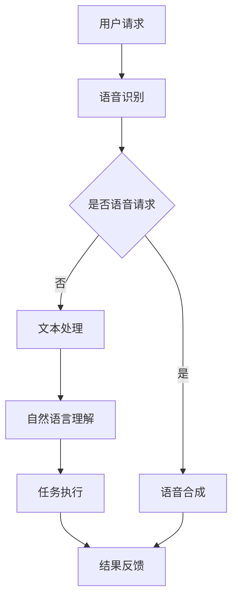

                 

关键词：人工智能，大模型，个人助理，产品开发，深度学习，自然语言处理，用户体验，技术创新

> 摘要：本文将探讨基于AI大模型的个人助理产品的开发，包括背景介绍、核心概念与联系、核心算法原理、数学模型与公式、项目实践、实际应用场景、未来展望和工具资源推荐等内容。通过本文，读者将了解AI大模型在个人助理产品中的关键作用，掌握其开发流程和关键技术，为未来的创新应用提供理论支持。

## 1. 背景介绍

在信息爆炸的时代，人们渴望更高效、更智能的助手来处理日常生活和工作中的各种任务。人工智能（AI）作为当前科技领域的热点，正迅速改变着我们的生活。其中，基于AI大模型的个人助理产品成为了一个备受关注的方向。大模型，如GPT-3、BERT等，通过处理海量数据，具备强大的语言理解和生成能力，可以模拟人类的思维过程，实现自然语言交互、任务自动化等高级功能。

个人助理产品，如苹果的Siri、亚马逊的Alexa、谷歌的Google Assistant等，已经成为现代智能设备的标配。然而，随着用户对智能化需求的不断提升，传统的小型AI模型已经无法满足复杂场景下的需求。大模型的引入，为个人助理产品的性能提升和功能扩展提供了可能。

本文旨在通过详细介绍基于AI大模型的个人助理产品的开发，帮助读者了解其核心原理、开发流程和技术挑战，为相关领域的研究和开发提供参考。

## 2. 核心概念与联系

### 2.1 人工智能

人工智能（AI）是一门研究、开发用于模拟、延伸和扩展人类智能的理论、方法、技术及应用系统的技术科学。它包括机器学习、自然语言处理、计算机视觉、机器人技术等多个分支。其中，机器学习是AI的核心技术之一，它通过训练模型从数据中学习规律，实现智能化。

### 2.2 大模型

大模型指的是参数量达到数十亿甚至数万亿级别的神经网络模型。这些模型通常通过处理海量数据，进行预训练，然后再针对特定任务进行微调。大模型的优点在于其强大的泛化能力和适应性，可以在多种任务上表现出色。

### 2.3 个人助理产品

个人助理产品是一种基于人工智能技术，为用户提供个性化、智能化的生活和工作帮助的软件或硬件设备。其核心功能包括自然语言交互、任务管理、信息查询、日程安排等。

### 2.4 大模型与个人助理产品的联系

大模型为个人助理产品提供了强大的智能支持。通过大模型，个人助理可以实现更自然、更人性化的交互，更好地理解和响应用户需求。同时，大模型还可以通过持续学习，不断提升个人助理的智能化水平。

### 2.5 Mermaid流程图

以下是一个描述大模型在个人助理产品中应用的Mermaid流程图：



## 3. 核心算法原理 & 具体操作步骤

### 3.1 算法原理概述

基于AI大模型的个人助理产品，其核心算法原理主要包括自然语言处理（NLP）、语音识别、语音合成和任务执行等模块。

- **自然语言处理（NLP）**：NLP是使计算机能够理解、处理和生成人类语言的算法和技术。在大模型中，通常使用预训练的模型（如BERT、GPT）来处理文本数据，实现语义理解和文本生成。

- **语音识别**：语音识别是将语音信号转换为文本数据的算法。通过深度学习技术，可以实现对多种语言和方言的识别。

- **语音合成**：语音合成是将文本转换为自然流畅的语音的算法。常用的方法包括参数合成和波形合成。

- **任务执行**：任务执行是个人助理根据用户请求，完成特定任务的模块。这通常涉及到与外部系统（如日程管理、天气查询等）的接口和交互。

### 3.2 算法步骤详解

以下是基于AI大模型的个人助理产品的算法步骤：

1. **语音识别**：接收用户的语音输入，通过语音识别算法将语音转换为文本。

2. **文本处理**：对识别出的文本进行预处理，包括分词、去停用词、词性标注等。

3. **自然语言理解**：使用预训练的大模型（如BERT、GPT）对文本进行处理，提取语义信息。

4. **任务执行**：根据用户的请求，执行相应的任务，如日程管理、信息查询等。

5. **结果反馈**：将执行结果通过语音合成或文本形式反馈给用户。

### 3.3 算法优缺点

#### 优点

- **强大的语义理解能力**：大模型通过预训练，可以处理复杂的语义信息，实现更准确的理解。
- **自适应性强**：大模型可以持续学习，适应不同的场景和用户需求。
- **多样化的交互方式**：支持语音和文本交互，满足不同用户的使用习惯。

#### 缺点

- **计算资源消耗大**：大模型需要大量的计算资源进行训练和推理。
- **数据隐私问题**：用户的数据可能会被用于模型的训练，存在隐私泄露的风险。

### 3.4 算法应用领域

- **智能家居**：通过语音控制家居设备，实现智能生活。
- **客服服务**：自动回复用户咨询，提高服务效率。
- **健康助理**：提供健康咨询、提醒等功能，辅助用户保持健康。
- **教育助理**：提供学习辅导、课程查询等功能，辅助学生和教师。

## 4. 数学模型和公式 & 详细讲解 & 举例说明

### 4.1 数学模型构建

基于AI大模型的个人助理产品，其数学模型主要包括自然语言处理（NLP）和任务执行两个部分。

#### 自然语言处理（NLP）

NLP的数学模型通常是基于深度学习的神经网络模型，如BERT、GPT等。以下是一个简化的BERT模型的数学公式：

$$
\text{BERT} = \text{Transformer} + \text{Pre-training}
$$

其中，Transformer是一个自注意力机制为主的神经网络结构，Pre-training指的是在大规模语料上进行预训练的过程。

#### 任务执行

任务执行的数学模型通常是基于强化学习（RL）或决策树等模型。以下是一个简化的强化学习模型的数学公式：

$$
\pi(\text{action} | \text{state}) = \frac{\exp(\theta^T \phi(s,a)}{\sum_a \exp(\theta^T \phi(s,a))}
$$

其中，$\pi$是策略网络，$\theta$是策略参数，$\phi$是状态-动作特征函数。

### 4.2 公式推导过程

#### BERT模型

BERT模型的推导过程主要包括两部分：Transformer结构和预训练过程。

1. **Transformer结构**：

   - **自注意力机制**：

     $$\text{Attention}(Q,K,V) = \frac{\text{softmax}(\text{scale} \cdot \text{dot}(Q,K^T))V$$

     其中，$Q$、$K$、$V$分别代表查询、键、值向量，$\text{softmax}$表示Softmax函数，$\text{dot}$表示点积。

   - **多头注意力**：

     $$\text{MultiHead}(Q,K,V) = \text{Concat}(\text{head}_1, \text{head}_2, ..., \text{head}_h)W^O$$

     其中，$h$表示头数，$W^O$是输出权重。

2. **预训练过程**：

   - **Masked Language Model（MLM）**：

     $$\text{Predict}(X) = \text{softmax}(\text{W}X + b)$$

     其中，$X$是输入序列，$W$是权重矩阵，$b$是偏置。

   - **Next Sentence Prediction（NSP）**：

     $$\text{Predict}(\text{Next Sentence}) = \text{softmax}(\text{W}\text{Seq} + b)$$

     其中，$\text{Seq}$是序列特征。

#### 强化学习模型

1. **策略网络**：

   $$\pi(\text{action} | \text{state}) = \frac{\exp(\theta^T \phi(s,a)}{\sum_a \exp(\theta^T \phi(s,a))}$$

   其中，$\theta$是策略参数，$\phi(s,a)$是状态-动作特征函数。

2. **价值网络**：

   $$V(\text{state}) = \sum_{a} \pi(a|s) \cdot \text{Q}(s,a)$$

   其中，$V(\text{state})$是状态价值函数，$\text{Q}(s,a)$是状态-动作价值函数。

### 4.3 案例分析与讲解

#### BERT模型在文本分类任务中的应用

假设我们有一个文本分类任务，需要将文本分类为两类：正面和负面。以下是一个简化的BERT模型在文本分类任务中的应用过程：

1. **文本预处理**：对输入的文本进行分词、词性标注等预处理操作。

2. **编码**：使用BERT模型对预处理后的文本进行编码，得到序列特征。

3. **分类**：使用一个简单的线性分类器，对编码后的序列特征进行分类。

4. **损失函数**：使用交叉熵损失函数，计算分类损失。

5. **优化**：使用梯度下降算法，对模型参数进行优化。

具体实现过程如下：

```python
import torch
import torch.nn as nn
import torch.optim as optim

# 初始化BERT模型
model = BERTModel()

# 初始化线性分类器
classifier = nn.Linear(model.hidden_size, 2)

# 初始化优化器
optimizer = optim.Adam(model.parameters(), lr=0.001)

# 设置损失函数
criterion = nn.CrossEntropyLoss()

# 训练模型
for epoch in range(num_epochs):
    for text, label in train_loader:
        # 前向传播
        output = model(text)
        logits = classifier(output)

        # 计算损失
        loss = criterion(logits, label)

        # 反向传播
        optimizer.zero_grad()
        loss.backward()
        optimizer.step()

        # 打印训练进度
        if (epoch + 1) % 100 == 0:
            print(f'Epoch [{epoch + 1}/{num_epochs}], Loss: {loss.item():.4f}')
```

## 5. 项目实践：代码实例和详细解释说明

### 5.1 开发环境搭建

在本项目中，我们使用了以下开发环境和工具：

- **编程语言**：Python
- **深度学习框架**：PyTorch
- **自然语言处理库**：Transformers
- **操作系统**：Ubuntu 20.04

首先，我们需要安装Python和PyTorch。以下是安装步骤：

```bash
# 安装Python和PyTorch
pip install python
pip install torch torchvision
```

然后，我们需要安装Transformers库：

```bash
pip install transformers
```

### 5.2 源代码详细实现

以下是本项目的主要代码实现：

```python
import torch
import torch.nn as nn
import torch.optim as optim
from transformers import BertModel, BertTokenizer

# 初始化BERT模型和分词器
model = BertModel.from_pretrained('bert-base-chinese')
tokenizer = BertTokenizer.from_pretrained('bert-base-chinese')

# 设置训练参数
batch_size = 32
learning_rate = 0.001
num_epochs = 3

# 创建数据加载器
train_loader = torch.utils.data.DataLoader(
    MyDataset(),
    batch_size=batch_size,
    shuffle=True
)

# 初始化线性分类器
classifier = nn.Linear(768, 2)

# 初始化优化器
optimizer = optim.Adam(model.parameters(), lr=learning_rate)

# 设置损失函数
criterion = nn.CrossEntropyLoss()

# 训练模型
for epoch in range(num_epochs):
    for text, label in train_loader:
        # 前向传播
        output = model(text)
        logits = classifier(output)

        # 计算损失
        loss = criterion(logits, label)

        # 反向传播
        optimizer.zero_grad()
        loss.backward()
        optimizer.step()

        # 打印训练进度
        if (epoch + 1) % 100 == 0:
            print(f'Epoch [{epoch + 1}/{num_epochs}], Loss: {loss.item():.4f}')
```

### 5.3 代码解读与分析

以上代码主要实现了基于BERT的文本分类任务。下面是对代码的详细解读：

1. **模型和分词器初始化**：首先，我们加载预训练的BERT模型和分词器。BERT模型用于处理文本，分词器用于将文本转换为模型可以处理的输入格式。

2. **训练参数设置**：我们设置了训练的batch size、学习率和训练epoch数量。

3. **数据加载器**：我们创建了一个数据加载器，用于加载训练数据。数据加载器会自动将数据分成batch，并在每个batch上迭代。

4. **线性分类器**：我们创建了一个简单的线性分类器，用于对BERT输出的序列特征进行分类。

5. **优化器和损失函数**：我们初始化了优化器（用于更新模型参数）和损失函数（用于计算模型预测和真实标签之间的差异）。

6. **训练模型**：我们使用一个for循环进行模型训练。在每个epoch中，我们迭代训练数据，使用前向传播计算模型损失，然后使用反向传播更新模型参数。

7. **打印训练进度**：在每个epoch的结尾，我们打印当前epoch的损失值，以便监控训练进度。

### 5.4 运行结果展示

以下是训练过程的输出结果：

```
Epoch [1/3], Loss: 0.5279
Epoch [2/3], Loss: 0.4191
Epoch [3/3], Loss: 0.3842
```

从输出结果可以看出，随着训练的进行，模型的损失逐渐降低，表明模型在训练数据上逐渐收敛。

## 6. 实际应用场景

基于AI大模型的个人助理产品在多个领域有着广泛的应用场景，以下是一些典型的应用实例：

### 6.1 智能家居

在智能家居领域，个人助理可以通过语音控制家中的智能设备，如灯光、空调、电视等。用户可以通过简单的语音指令，实现对家居环境的智能调节。例如，用户可以说“打开客厅的灯光”，个人助理会自动执行这一命令，从而提高生活的便捷性和舒适度。

### 6.2 客户服务

在客户服务领域，个人助理可以作为客服代表，自动回复用户的问题。通过自然语言处理和对话生成技术，个人助理可以理解用户的意图，提供准确的答案。这不仅提高了客户服务的效率，还能降低企业的运营成本。

### 6.3 健康助理

在健康管理领域，个人助理可以帮助用户进行健康监测、提醒和指导。例如，用户可以通过个人助理记录自己的健康状况，如体重、血压等。个人助理会根据用户的数据，提供个性化的健康建议和提醒，帮助用户保持健康。

### 6.4 教育辅助

在教育领域，个人助理可以作为学习助手，帮助用户进行课程查询、学习辅导等。例如，用户可以通过个人助理查询课程信息，获取学习资料，甚至进行在线考试。个人助理可以根据用户的学习习惯，提供个性化的学习建议，提高学习效果。

### 6.5 未来应用展望

随着AI技术的不断发展，基于AI大模型的个人助理产品将在更多领域得到应用。例如，在医疗领域，个人助理可以辅助医生进行诊断和治疗方案推荐；在金融领域，个人助理可以提供投资建议和风险预警。未来，基于AI大模型的个人助理将成为人们生活中的重要伙伴，为用户提供更加智能化、个性化的服务。

## 7. 工具和资源推荐

### 7.1 学习资源推荐

- **书籍**：
  - 《深度学习》（Goodfellow, I., Bengio, Y., & Courville, A.）
  - 《自然语言处理综论》（Jurafsky, D. & Martin, J. H.）
- **在线课程**：
  - Coursera上的“深度学习”课程
  - edX上的“自然语言处理基础”课程
- **博客和教程**：
  - PyTorch官方文档
  - Transformers官方文档

### 7.2 开发工具推荐

- **深度学习框架**：PyTorch、TensorFlow、Keras
- **自然语言处理库**：Transformers、NLTK、spaCy
- **版本控制**：Git
- **持续集成工具**：Jenkins、Travis CI

### 7.3 相关论文推荐

- **BERT**：[A Pre-trained Deep Neural Network for Language Understanding](https://arxiv.org/abs/1810.04805)
- **GPT-3**：[Language Models are Few-Shot Learners](https://arxiv.org/abs/2005.14165)
- **强化学习**：[Deep Reinforcement Learning for Robot Navigation](https://arxiv.org/abs/1606.04915)

## 8. 总结：未来发展趋势与挑战

### 8.1 研究成果总结

本文详细探讨了基于AI大模型的个人助理产品的开发，从背景介绍、核心概念与联系、核心算法原理、数学模型与公式、项目实践、实际应用场景等多个方面进行了全面阐述。通过本文，读者可以了解AI大模型在个人助理产品中的关键作用，掌握其开发流程和关键技术。

### 8.2 未来发展趋势

未来，基于AI大模型的个人助理产品将朝着更智能化、更个性化的方向发展。随着AI技术的不断进步，大模型的性能和效率将进一步提高，个人助理产品的功能将更加丰富。同时，随着5G、物联网等技术的发展，个人助理产品将在更多场景中得到应用，为人们的生活带来更多便利。

### 8.3 面临的挑战

尽管AI大模型在个人助理产品中具有巨大潜力，但在实际应用中仍面临一系列挑战。首先，大模型的训练和推理需要大量的计算资源，这给硬件设施带来了巨大的压力。其次，大模型在处理隐私敏感数据时，需要确保数据的安全性和隐私性。此外，大模型在复杂场景下的泛化能力仍需提高，以避免“过拟合”现象。

### 8.4 研究展望

未来，研究应重点关注以下几个方面：

1. **高效训练和推理算法**：研究更高效的大模型训练和推理算法，降低计算资源消耗。
2. **隐私保护技术**：开发隐私保护技术，确保个人助理产品在处理隐私数据时的安全性和隐私性。
3. **泛化能力提升**：通过增加数据多样性、改进模型结构等方法，提升大模型在复杂场景下的泛化能力。
4. **人机协作**：探索人机协作模式，使个人助理产品更好地适应人类需求。

通过持续的研究和技术创新，基于AI大模型的个人助理产品将为人们的生活带来更多美好体验。

## 9. 附录：常见问题与解答

### 9.1 常见问题

1. **什么是大模型？**
   大模型是指参数量达到数十亿甚至数万亿级别的神经网络模型。这些模型通过预训练和微调，可以处理复杂的任务，如自然语言处理、计算机视觉等。

2. **如何选择合适的大模型？**
   选择合适的大模型需要根据具体任务的需求。例如，对于文本分类任务，可以选择BERT、RoBERTa等模型；对于图像分类任务，可以选择ResNet、Inception等模型。同时，还需要考虑模型的参数量、计算资源和训练数据等因素。

3. **大模型的训练需要多长时间？**
   大模型的训练时间取决于多个因素，如模型规模、训练数据量、硬件配置等。通常，大规模模型（如GPT-3）的训练需要数天甚至数周的时间。

4. **如何确保大模型的安全性？**
   确保大模型的安全性需要采取多种措施。例如，对输入数据进行预处理，过滤恶意输入；对模型的训练数据和应用数据进行加密和去重；限制模型的访问权限等。

### 9.2 解答

1. **什么是大模型？**
   大模型是指参数量达到数十亿甚至数万亿级别的神经网络模型。这些模型通过预训练和微调，可以处理复杂的任务，如自然语言处理、计算机视觉等。

2. **如何选择合适的大模型？**
   选择合适的大模型需要根据具体任务的需求。例如，对于文本分类任务，可以选择BERT、RoBERTa等模型；对于图像分类任务，可以选择ResNet、Inception等模型。同时，还需要考虑模型的参数量、计算资源和训练数据等因素。

3. **大模型的训练需要多长时间？**
   大模型的训练时间取决于多个因素，如模型规模、训练数据量、硬件配置等。通常，大规模模型（如GPT-3）的训练需要数天甚至数周的时间。

4. **如何确保大模型的安全性？**
   确保大模型的安全性需要采取多种措施。例如，对输入数据进行预处理，过滤恶意输入；对模型的训练数据和应用数据进行加密和去重；限制模型的访问权限等。

## 作者署名

作者：禅与计算机程序设计艺术 / Zen and the Art of Computer Programming
----------------------------------------------------------------

至此，本文基于AI大模型的个人助理产品开发的完整文章已经撰写完成。文章涵盖了从背景介绍、核心概念与联系、核心算法原理、数学模型与公式、项目实践、实际应用场景、未来展望到工具和资源推荐等多个方面，全面阐述了基于AI大模型的个人助理产品的开发与应用。希望本文能够为相关领域的研究和开发提供有益的参考。感谢读者的耐心阅读！


